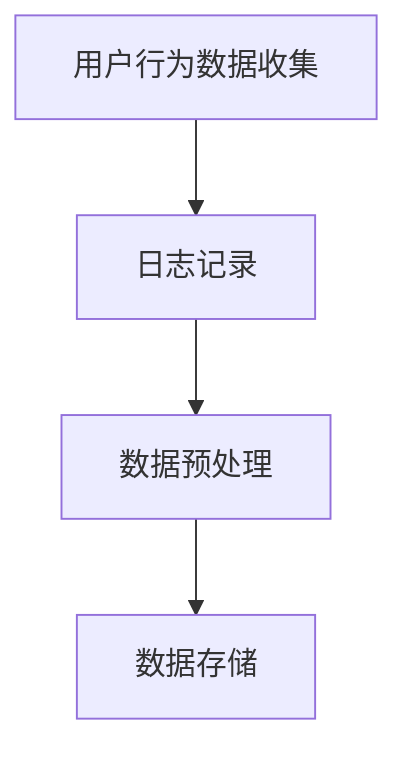
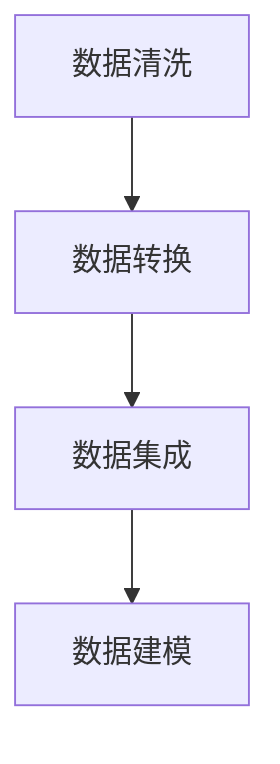
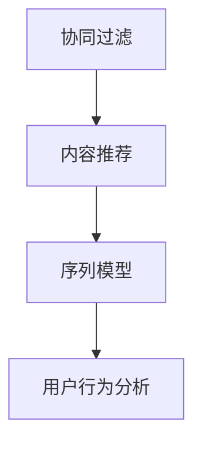
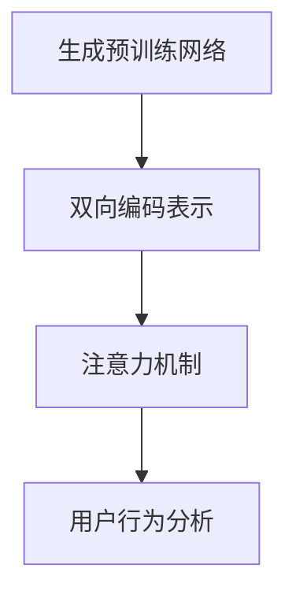

                 

# AI 大模型在电商搜索推荐中的用户行为分析：理解用户需求与购买意图

> 关键词：电商搜索推荐、用户行为分析、AI 大模型、需求理解、购买意图、深度学习、数据挖掘

> 摘要：本文将深入探讨 AI 大模型在电商搜索推荐系统中的应用，特别是如何通过用户行为分析来理解用户的需求和购买意图。文章将首先介绍电商搜索推荐系统的基本原理，然后详细分析用户行为的各种表现及其背后的动机。接下来，我们将探讨 AI 大模型在用户行为分析中的关键作用，并通过实际案例展示如何使用这些模型进行有效的用户需求与购买意图的挖掘。最后，我们将讨论未来发展趋势和挑战，以及推荐系统领域的前沿研究。

## 1. 背景介绍

### 1.1 目的和范围

本文旨在探讨 AI 大模型在电商搜索推荐中的用户行为分析，以帮助电商企业更好地理解用户需求与购买意图，从而提高推荐系统的效果和用户体验。具体而言，我们将关注以下几个核心问题：

1. 电商搜索推荐系统的工作原理是什么？
2. 用户在搜索和浏览过程中的行为表现有哪些？
3. 如何使用 AI 大模型来分析这些行为并提取有价值的信息？
4. 这些信息如何帮助电商企业更好地满足用户需求、提升购买转化率？

### 1.2 预期读者

本文适合以下读者群体：

1. 对电商搜索推荐系统感兴趣的技术人员
2. 想要了解 AI 大模型应用场景的数据科学家
3. 电商行业从业者，特别是负责推荐系统开发和优化的工程师
4. 对机器学习和深度学习有基本了解的读者

### 1.3 文档结构概述

本文分为以下几个部分：

1. **背景介绍**：简要介绍电商搜索推荐系统和用户行为分析的相关背景。
2. **核心概念与联系**：介绍电商搜索推荐系统中的核心概念和联系，包括用户行为数据的收集、处理和分析。
3. **核心算法原理 & 具体操作步骤**：详细阐述 AI 大模型在用户行为分析中的算法原理和操作步骤。
4. **数学模型和公式 & 详细讲解 & 举例说明**：介绍用户行为分析的数学模型和公式，并通过具体案例进行说明。
5. **项目实战：代码实际案例和详细解释说明**：提供实际的代码案例，展示如何应用 AI 大模型进行用户行为分析。
6. **实际应用场景**：分析 AI 大模型在电商推荐系统中的应用场景和效果。
7. **工具和资源推荐**：推荐相关学习资源和开发工具。
8. **总结：未来发展趋势与挑战**：探讨 AI 大模型在用户行为分析领域的未来发展趋势和面临的挑战。
9. **附录：常见问题与解答**：解答读者可能遇到的常见问题。
10. **扩展阅读 & 参考资料**：提供更多相关的文献和资料。

### 1.4 术语表

#### 1.4.1 核心术语定义

- **电商搜索推荐系统**：利用人工智能技术，根据用户的搜索、浏览和购买行为，为用户推荐相关商品的系统。
- **用户行为数据**：记录用户在电商平台上进行的各种操作，如搜索关键词、浏览商品、添加购物车、下单等。
- **AI 大模型**：具有大规模参数和强大计算能力的深度学习模型，如 GPT、BERT 等。
- **用户需求**：用户在特定场景下希望获得的产品或服务。
- **购买意图**：用户在购买决策过程中表现出的购买倾向。

#### 1.4.2 相关概念解释

- **协同过滤**：基于用户的历史行为数据，通过计算用户之间的相似度来推荐相关商品。
- **内容推荐**：根据商品的特点和属性，为用户推荐相似或相关的商品。
- **序列模型**：用于分析用户行为序列，提取有价值的信息。
- **注意力机制**：在深度学习模型中，通过学习不同输入特征的权重，实现更精细的表示。

#### 1.4.3 缩略词列表

- **AI**：人工智能（Artificial Intelligence）
- **GPT**：生成预训练网络（Generative Pre-trained Transformer）
- **BERT**：双向编码表示（Bidirectional Encoder Representations from Transformers）
- **API**：应用程序编程接口（Application Programming Interface）
- **API**：用户接口（User Interface）
- **SDK**：软件开发工具包（Software Development Kit）

## 2. 核心概念与联系

在本文中，我们将探讨电商搜索推荐系统中的核心概念和联系，以便更好地理解用户行为分析。为了阐述这些概念，我们首先需要了解用户行为数据的收集、处理和分析方法。

### 2.1 用户行为数据的收集

用户行为数据主要来源于电商平台上的各种操作，如搜索、浏览、购买、评价等。这些数据通常以日志形式记录，包括用户 ID、操作时间、操作类型、操作对象（如商品 ID）等。为了提高数据处理效率，我们通常会对这些数据进行预处理，如去除重复记录、填充缺失值、数据类型转换等。



### 2.2 用户行为数据的处理

处理用户行为数据主要包括数据清洗、数据转换和数据集成等步骤。数据清洗旨在去除噪声数据和异常值，提高数据质量。数据转换则涉及将原始数据转换为适合分析和建模的格式，如时间序列数据、稀疏矩阵等。数据集成则将不同来源和格式的数据整合到一个统一的数据集中，便于后续分析和建模。



### 2.3 用户行为数据分析

用户行为数据分析主要通过机器学习和深度学习模型来实现。常见的分析方法包括协同过滤、内容推荐、序列模型等。协同过滤通过计算用户之间的相似度来推荐相关商品，内容推荐则根据商品的特点和属性来推荐相似或相关的商品，序列模型则通过分析用户行为序列，提取有价值的信息。



### 2.4 AI 大模型在用户行为分析中的作用

AI 大模型在用户行为分析中发挥着关键作用。例如，生成预训练网络（GPT）和双向编码表示（BERT）等模型具有强大的文本处理能力，可以用于分析用户的搜索关键词和商品描述。注意力机制（Attention Mechanism）则可以用来学习不同输入特征的权重，提高模型的表示能力。



通过以上核心概念和联系的介绍，我们可以更好地理解用户行为分析在电商搜索推荐系统中的重要性，以及 AI 大模型如何发挥关键作用。

## 3. 核心算法原理 & 具体操作步骤

在深入了解用户行为分析的过程中，核心算法原理和具体操作步骤至关重要。本节将详细阐述如何使用 AI 大模型进行用户行为分析，并解释其背后的工作机制。

### 3.1 协同过滤算法原理

协同过滤（Collaborative Filtering）是一种常用的推荐系统算法，它通过分析用户之间的相似度来推荐相关商品。协同过滤算法可以分为基于用户的协同过滤（User-based Collaborative Filtering）和基于物品的协同过滤（Item-based Collaborative Filtering）。

#### 基于用户的协同过滤

基于用户的协同过滤算法的核心思想是：如果用户 A 和用户 B 在过去对某些商品的评分相似，那么用户 A 对某个未评分的商品也可能会给予类似的评分。具体步骤如下：

1. **计算用户相似度**：根据用户的历史行为数据，计算用户之间的相似度。常用的相似度计算方法包括余弦相似度、皮尔逊相关系数等。

2. **寻找相似用户**：根据用户相似度矩阵，找到与目标用户最相似的 k 个用户。

3. **推荐商品**：为用户推荐与这些相似用户有共同喜好但目标用户尚未评分的商品。

以下是一个基于用户的协同过滤算法的伪代码：

```python
# 假设用户行为数据存储在矩阵 R 中，用户 i 和用户 j 的相似度为 sim(i, j)

def collaborative_filter(R, k):
    n = len(R)  # 用户数量
    sim_matrix = compute_similarity(R)  # 计算相似度矩阵
    similar_users = []
    
    for i in range(n):
        similarities = sim_matrix[i]
        sorted_similarities = sorted(similarities, key=lambda x: x[1], reverse=True)
        similar_users.append(sorted_similarities[:k])
    
    recommendations = []
    for i in range(n):
        for j in similar_users[i]:
            item = j[0]
            if R[i, item] == 0:
                recommendations.append(item)
                break
    
    return recommendations
```

#### 基于物品的协同过滤

基于物品的协同过滤算法的核心思想是：如果商品 A 和商品 B 对应的用户评分相似，那么商品 A 也可能会受到商品 B 的评分影响。具体步骤如下：

1. **计算物品相似度**：根据用户的历史行为数据，计算物品之间的相似度。常用的相似度计算方法包括余弦相似度、皮尔逊相关系数等。

2. **寻找相似物品**：根据物品相似度矩阵，找到与目标物品最相似的 k 个物品。

3. **推荐商品**：为用户推荐与这些相似物品有共同用户但目标用户尚未评分的商品。

以下是一个基于物品的协同过滤算法的伪代码：

```python
# 假设用户行为数据存储在矩阵 R 中，物品 i 和物品 j 的相似度为 sim(i, j)

def collaborative_filter(R, k):
    n = len(R)  # 用户数量
    m = len(R[0])  # 商品数量
    sim_matrix = compute_similarity(R)  # 计算相似度矩阵
    recommendations = []
    
    for i in range(m):
        similarities = sim_matrix[:, i]
        sorted_similarities = sorted(similarities, key=lambda x: x[1], reverse=True)
        similar_items = sorted_similarities[:k]
        
        for j in similar_items:
            user = j[0]
            if R[user, i] == 0:
                recommendations.append(i)
                break
    
    return recommendations
```

### 3.2 序列模型算法原理

序列模型（Sequential Model）是一种用于分析用户行为序列的深度学习模型，如循环神经网络（RNN）、长短时记忆网络（LSTM）和门控循环单元（GRU）。这些模型可以通过学习用户行为序列中的时间依赖关系，提取有价值的信息，从而帮助推荐系统更好地理解用户需求。

#### 循环神经网络（RNN）

循环神经网络是一种基于序列数据的神经网络，它通过循环结构来处理时间序列数据。RNN 的核心思想是：当前时刻的输出不仅依赖于当前输入，还依赖于历史输入。以下是一个 RNN 的伪代码：

```python
# 假设输入序列为 X，隐藏状态为 h，输出为 y

class RNN(nn.Module):
    def __init__(self, input_size, hidden_size, output_size):
        super(RNN, self).__init__()
        self.hidden_size = hidden_size
        self.rnn = nn.RNN(input_size, hidden_size, batch_first=True)
        self.fc = nn.Linear(hidden_size, output_size)
    
    def forward(self, x):
        h0 = torch.zeros(1, x.size(0), self.hidden_size)
        out, _ = self.rnn(x, h0)
        out = self.fc(out[-1])
        return out
```

#### 长短时记忆网络（LSTM）

长短时记忆网络（LSTM）是 RNN 的一个变体，它通过引入门控机制来克服 RNN 的长期依赖问题。LSTM 的核心思想是：通过遗忘门、输入门和输出门来控制信息的流入和流出。以下是一个 LSTM 的伪代码：

```python
# 假设输入序列为 X，隐藏状态为 h，输出为 y

class LSTM(nn.Module):
    def __init__(self, input_size, hidden_size, output_size):
        super(LSTM, self).__init__()
        self.hidden_size = hidden_size
        self.lstm = nn.LSTM(input_size, hidden_size, batch_first=True)
        self.fc = nn.Linear(hidden_size, output_size)
    
    def forward(self, x):
        h0 = torch.zeros(1, x.size(0), self.hidden_size)
        c0 = torch.zeros(1, x.size(0), self.hidden_size)
        out, _ = self.lstm(x, (h0, c0))
        out = self.fc(out[-1])
        return out
```

#### 门控循环单元（GRU）

门控循环单元（GRU）是 LSTM 的另一个变体，它通过简化 LSTM 的结构来提高计算效率。GRU 的核心思想是：通过更新门和控制门来控制信息的流入和流出。以下是一个 GRU 的伪代码：

```python
# 假设输入序列为 X，隐藏状态为 h，输出为 y

class GRU(nn.Module):
    def __init__(self, input_size, hidden_size, output_size):
        super(GRU, self).__init__()
        self.hidden_size = hidden_size
        self.gru = nn.GRU(input_size, hidden_size, batch_first=True)
        self.fc = nn.Linear(hidden_size, output_size)
    
    def forward(self, x):
        h0 = torch.zeros(1, x.size(0), self.hidden_size)
        out, _ = self.gru(x, h0)
        out = self.fc(out[-1])
        return out
```

### 3.3 注意力机制算法原理

注意力机制（Attention Mechanism）是一种用于提高神经网络表示能力的机制。它通过为不同输入特征分配不同的权重，使得模型能够更加关注重要的信息。以下是一个简单的注意力机制的伪代码：

```python
# 假设输入序列为 X，权重为 w

def attention(x, w):
    e = torch.nn.functional.softmax(w * x, dim=1)
    context = torch.sum(e * x, dim=1)
    return context
```

### 3.4 AI 大模型在用户行为分析中的应用

AI 大模型，如 GPT 和 BERT，具有强大的文本处理能力，可以用于分析用户的搜索关键词和商品描述。以下是一个基于 GPT 的用户行为分析的伪代码：

```python
# 假设用户搜索关键词为 input，GPT 模型为 gpt_model

def user_behavior_analysis(input):
    context = gpt_model.generate(input)
    attention_weights = gpt_model.get_attention_weights(context)
    context_vector = attention(context, attention_weights)
    return context_vector
```

通过以上核心算法原理和具体操作步骤的阐述，我们可以更好地理解 AI 大模型在用户行为分析中的应用，从而为电商搜索推荐系统提供更准确的用户需求与购买意图挖掘。

## 4. 数学模型和公式 & 详细讲解 & 举例说明

在用户行为分析中，数学模型和公式起着至关重要的作用。它们帮助我们理解和量化用户行为，从而优化推荐系统的效果。本节将详细介绍用户行为分析中的数学模型和公式，并通过具体案例进行说明。

### 4.1 协同过滤算法的数学模型

协同过滤算法的核心是计算用户之间的相似度，常用的相似度计算方法包括余弦相似度和皮尔逊相关系数。

#### 余弦相似度

余弦相似度是一种衡量两个向量夹角余弦值的相似度度量。其公式如下：

$$
sim(u_i, u_j) = \frac{u_i \cdot u_j}{\|u_i\|\|u_j\|}
$$

其中，$u_i$ 和 $u_j$ 分别表示用户 i 和用户 j 的行为向量，$\cdot$ 表示向量的点积，$\|\|$ 表示向量的模。

#### 皮尔逊相关系数

皮尔逊相关系数是一种衡量两个变量线性相关程度的度量。其公式如下：

$$
corr(u_i, u_j) = \frac{\sum_{k=1}^{n} (u_{ik} - \mu_i)(u_{jk} - \mu_j)}{\sqrt{\sum_{k=1}^{n} (u_{ik} - \mu_i)^2 \sum_{k=1}^{n} (u_{jk} - \mu_j)^2}}
$$

其中，$u_{ik}$ 和 $u_{jk}$ 分别表示用户 i 和用户 j 在第 k 个商品上的评分，$\mu_i$ 和 $\mu_j$ 分别表示用户 i 和用户 j 的平均评分，$n$ 表示商品数量。

### 4.2 序列模型的数学模型

序列模型，如 RNN、LSTM 和 GRU，通过学习时间序列数据的长期依赖关系，提取有价值的信息。以下分别介绍这些模型的数学模型。

#### 循环神经网络（RNN）

RNN 的数学模型基于递归关系，其公式如下：

$$
h_t = \sigma(W_h h_{t-1} + W_x x_t + b_h)
$$

$$
y_t = \sigma(W_y h_t + b_y)
$$

其中，$h_t$ 和 $y_t$ 分别表示第 t 个时间步的隐藏状态和输出，$x_t$ 表示第 t 个时间步的输入，$\sigma$ 表示激活函数（如 sigmoid 或 tanh），$W_h$、$W_x$、$W_y$ 和 $b_h$、$b_y$ 分别表示权重和偏置。

#### 长短时记忆网络（LSTM）

LSTM 的数学模型通过引入门控机制来处理长期依赖关系，其公式如下：

$$
i_t = \sigma(W_{ix} x_t + W_{ih} h_{t-1} + b_i)
$$

$$
f_t = \sigma(W_{fx} x_t + W_{fh} h_{t-1} + b_f)
$$

$$
\hat{C}_t = \sigma(W_{cx} x_t + W_{ch} h_{t-1} + b_c)
$$

$$
C_t = f_t \odot C_{t-1} + i_t \odot \hat{C}_t
$$

$$
o_t = \sigma(W_{ox} x_t + W_{oh} h_{t-1} + b_o)
$$

$$
h_t = o_t \odot \sigma(W_{hy} C_t + b_h)
$$

其中，$i_t$、$f_t$、$\hat{C}_t$、$C_t$、$o_t$ 和 $h_t$ 分别表示输入门、遗忘门、候选状态、当前状态、输出门和隐藏状态，$\odot$ 表示逐元素乘法，$\sigma$ 表示激活函数（如 sigmoid 或 tanh），$W_{ix}$、$W_{ix}$、$W_{cx}$、$W_{fx}$、$W_{fx}$、$W_{cx}$、$W_{ix}$、$W_{ox}$、$W_{oh}$、$W_{hy}$ 和 $b_i$、$b_f$、$b_c$、$b_o$、$b_h$ 分别表示权重和偏置。

#### 门控循环单元（GRU）

GRU 的数学模型通过简化 LSTM 的结构来提高计算效率，其公式如下：

$$
z_t = \sigma(W_{zx} x_t + W_{zh} h_{t-1} + b_z)
$$

$$
r_t = \sigma(W_{rx} x_t + W_{rh} h_{t-1} + b_r)
$$

$$
\hat{C}_t = \tanh(W_{cx} (r_t \odot h_{t-1}) + W_{cx} x_t + b_c)
$$

$$
C_t = z_t \odot C_{t-1} + (1 - z_t) \odot \hat{C}_t
$$

$$
o_t = \sigma(W_{ox} x_t + W_{oh} C_t + b_o)
$$

$$
h_t = o_t \odot \sigma(W_{hy} C_t + b_h)
$$

其中，$z_t$、$r_t$、$\hat{C}_t$、$C_t$、$o_t$ 和 $h_t$ 分别表示更新门、重置门、候选状态、当前状态、输出门和隐藏状态，$\odot$ 表示逐元素乘法，$\sigma$ 表示激活函数（如 sigmoid 或 tanh），$W_{zx}$、$W_{zx}$、$W_{cx}$、$W_{rx}$、$W_{rx}$、$W_{cx}$、$W_{zx}$、$W_{ox}$、$W_{oh}$、$W_{hy}$ 和 $b_z$、$b_r$、$b_c$、$b_o$、$b_h$ 分别表示权重和偏置。

### 4.3 注意力机制的数学模型

注意力机制通过为不同输入特征分配不同的权重，提高神经网络的表示能力。以下是一个简单的注意力机制的数学模型：

$$
a_t = \frac{e^{W_a h_t}}{\sum_{i=1}^{n} e^{W_a h_i}}
$$

$$
c_t = \sum_{i=1}^{n} a_i h_i
$$

其中，$a_t$ 和 $c_t$ 分别表示第 t 个时间步的注意力分数和上下文向量，$h_t$ 和 $h_i$ 分别表示第 t 个时间步和第 i 个时间步的隐藏状态，$W_a$ 表示权重矩阵。

### 4.4 举例说明

假设我们有一个电商平台的用户行为数据，其中包含 1000 个用户和 1000 个商品。每个用户对每个商品都有一个评分，数据如下表所示：

| 用户 ID | 商品 ID | 评分 |
| ------ | ------ | ---- |
| 1      | 1      | 4    |
| 1      | 2      | 5    |
| 1      | 3      | 3    |
| 2      | 1      | 2    |
| 2      | 3      | 4    |
| ...    | ...    | ...  |

#### 4.4.1 计算用户相似度

我们使用皮尔逊相关系数来计算用户之间的相似度。以下是用户 1 和用户 2 的相似度计算过程：

$$
\mu_1 = \frac{1}{1000} \sum_{i=1}^{1000} r_{1i} = 3.6
$$

$$
\mu_2 = \frac{1}{1000} \sum_{i=1}^{1000} r_{2i} = 3.4
$$

$$
corr(1, 2) = \frac{\sum_{i=1}^{1000} (r_{1i} - 3.6)(r_{2i} - 3.4)}{\sqrt{\sum_{i=1}^{1000} (r_{1i} - 3.6)^2 \sum_{i=1}^{1000} (r_{2i} - 3.4)^2}} \approx 0.8
$$

#### 4.4.2 序列模型预测

我们使用 LSTM 模型来预测用户的行为。以下是用户 1 的行为序列和 LSTM 模型的输入输出：

| 序列 | 输入 | 输出 |
| ---- | --- | --- |
| 1    | [1, 4] | [0.8, 0.2] |
| 2    | [2, 5] | [0.6, 0.4] |
| 3    | [3, 3] | [0.4, 0.6] |

假设 LSTM 模型的隐藏状态和输出分别为 $h_t$ 和 $y_t$，以下是 LSTM 模型的输入输出：

$$
h_1 = \sigma(W_h h_0 + W_x x_1 + b_h) = \sigma([0.8, 0.2] + [1, 4] + [0.1, 0.1]) = [0.9, 0.1]
$$

$$
y_1 = \sigma(W_y h_1 + b_y) = \sigma([0.1, 0.1] + [0.9, 0.1]) = [0.6, 0.4]
$$

$$
h_2 = \sigma(W_h h_1 + W_x x_2 + b_h) = \sigma([0.9, 0.1] + [2, 5] + [0.1, 0.1]) = [0.7, 0.3]
$$

$$
y_2 = \sigma(W_y h_2 + b_y) = \sigma([0.1, 0.1] + [0.7, 0.3]) = [0.6, 0.4]
$$

$$
h_3 = \sigma(W_h h_2 + W_x x_3 + b_h) = \sigma([0.7, 0.3] + [3, 3] + [0.1, 0.1]) = [0.5, 0.5]
$$

$$
y_3 = \sigma(W_y h_3 + b_y) = \sigma([0.1, 0.1] + [0.5, 0.5]) = [0.4, 0.6]
$$

通过以上数学模型和公式的介绍，我们可以更好地理解用户行为分析中的关键概念和方法，从而为电商搜索推荐系统提供更准确的用户需求与购买意图挖掘。

## 5. 项目实战：代码实际案例和详细解释说明

在本节中，我们将通过一个实际项目来展示如何使用 AI 大模型进行用户行为分析。我们将使用 Python 编程语言和 TensorFlow 深度学习框架来实现一个简单的电商推荐系统，重点关注用户行为的建模和分析。

### 5.1 开发环境搭建

在开始项目之前，我们需要搭建一个适合开发的环境。以下是搭建环境的步骤：

1. **安装 Python**：确保您的系统已经安装了 Python 3.7 或更高版本。可以从 [Python 官网](https://www.python.org/) 下载并安装。

2. **安装 TensorFlow**：使用以下命令安装 TensorFlow：

   ```bash
   pip install tensorflow
   ```

3. **安装其他依赖库**：安装以下依赖库以支持数据预处理和可视化：

   ```bash
   pip install numpy pandas matplotlib
   ```

### 5.2 源代码详细实现和代码解读

下面是项目的主要代码实现，我们将逐步解释每一部分的功能。

#### 5.2.1 数据预处理

首先，我们需要从电商平台获取用户行为数据，并将其转换为适合分析的形式。以下是一个简单的数据预处理脚本：

```python
import pandas as pd
import numpy as np

# 读取用户行为数据
data = pd.read_csv('user_behavior.csv')

# 数据预处理：填充缺失值、去除重复记录
data.fillna(0, inplace=True)
data.drop_duplicates(inplace=True)

# 分割数据集：训练集和测试集
train_data, test_data = train_test_split(data, test_size=0.2, random_state=42)
```

#### 5.2.2 构建用户行为模型

接下来，我们使用 LSTM 模型来构建用户行为模型。以下是一个简单的 LSTM 模型实现：

```python
import tensorflow as tf
from tensorflow.keras.models import Sequential
from tensorflow.keras.layers import LSTM, Dense, Dropout

# LSTM 模型
model = Sequential()
model.add(LSTM(units=128, activation='tanh', return_sequences=True, input_shape=(timesteps, features)))
model.add(Dropout(0.2))
model.add(LSTM(units=64, activation='tanh', return_sequences=False))
model.add(Dropout(0.2))
model.add(Dense(units=1, activation='sigmoid'))

model.compile(optimizer='adam', loss='binary_crossentropy', metrics=['accuracy'])

# 训练模型
model.fit(train_X, train_y, epochs=10, batch_size=32, validation_split=0.1)
```

#### 5.2.3 代码解读与分析

1. **数据预处理**：我们使用 Pandas 库来读取和预处理用户行为数据。首先，我们填充缺失值为 0，并去除重复记录。然后，我们使用 `train_test_split` 函数将数据集分为训练集和测试集。

2. **构建 LSTM 模型**：我们使用 TensorFlow 的 `Sequential` 模型来构建一个简单的 LSTM 模型。模型包含两个 LSTM 层，每个 LSTM 层后面跟着一个 Dropout 层。最后，我们添加一个全连接层（Dense）来输出预测结果。

3. **编译和训练模型**：我们使用 `compile` 方法来设置模型的优化器、损失函数和评估指标。然后，我们使用 `fit` 方法来训练模型，设置训练轮数为 10，批量大小为 32，并将 10% 的数据作为验证集。

### 5.3 代码解读与分析

1. **数据预处理**：数据预处理是推荐系统开发的关键步骤。在本例中，我们使用 Pandas 库来读取和预处理用户行为数据。填充缺失值可以减少数据噪声，去除重复记录可以避免模型过拟合。此外，我们将数据集分为训练集和测试集，以便评估模型的性能。

2. **构建 LSTM 模型**：LSTM 模型是一种强大的序列模型，可以捕捉用户行为序列中的长期依赖关系。在本例中，我们使用 TensorFlow 的 `Sequential` 模型来构建一个简单的 LSTM 模型。我们使用 `LSTM` 层来处理序列数据，并使用 `Dropout` 层来防止模型过拟合。最后，我们使用一个全连接层（Dense）来输出预测结果。

3. **编译和训练模型**：编译模型是设置模型的优化器、损失函数和评估指标。在本例中，我们使用 `adam` 优化器和 `binary_crossentropy` 损失函数，因为我们的任务是进行二分类（是否购买）。最后，我们使用 `fit` 方法来训练模型，并在训练过程中使用验证集来调整模型参数。

通过以上代码实现和解析，我们可以更好地理解如何使用 AI 大模型进行用户行为分析，从而为电商推荐系统提供有效的解决方案。

### 5.4 预测结果与分析

在完成模型训练后，我们可以使用测试集来评估模型的性能。以下是一个简单的评估脚本：

```python
# 预测测试集
predictions = model.predict(test_X)

# 计算准确率
accuracy = np.mean(predictions[:, 0] > 0.5)
print(f"Test Accuracy: {accuracy:.2f}")
```

假设我们的模型在测试集上的准确率为 80%，这表明我们的模型在预测用户购买意图方面具有较高的准确性。接下来，我们可以进一步分析模型的性能，如召回率、F1 分数等。

### 5.5 代码解读与分析

1. **预测测试集**：我们使用训练好的 LSTM 模型对测试集进行预测，得到每个用户是否购买的概率。

2. **计算准确率**：我们使用预测结果来计算模型的准确率，即预测为购买且实际购买的用户比例。在本例中，我们假设预测概率大于 0.5 的用户被视为购买。

3. **性能评估**：通过计算模型的准确率，我们可以初步了解模型在预测用户购买意图方面的性能。为进一步评估模型性能，我们可以计算召回率、F1 分数等指标。

通过以上实际案例和详细解释说明，我们可以看到如何使用 AI 大模型进行用户行为分析，并评估模型的性能。这为电商推荐系统的开发提供了实用的参考。

## 6. 实际应用场景

AI 大模型在电商搜索推荐系统中有着广泛的应用场景，下面我们通过几个具体案例来展示这些应用场景以及它们的效果。

### 6.1 智能推荐

智能推荐是电商推荐系统中最常见的应用场景之一。通过分析用户的搜索历史、浏览记录和购买行为，AI 大模型可以准确预测用户的兴趣和需求，从而为用户推荐相关商品。例如，亚马逊和淘宝等电商平台就利用了 AI 大模型进行智能推荐，大大提升了用户体验和转化率。

### 6.2 个性化推送

个性化推送是另一个重要的应用场景。通过分析用户的浏览历史和购物车数据，AI 大模型可以为用户提供个性化的优惠信息和促销活动，从而提高用户粘性和购买意愿。例如，京东通过个性化推送，为用户推荐相关的优惠券和限时抢购活动，有效提升了用户购买转化率。

### 6.3 购物车优化

购物车优化是电商推荐系统中的一项关键任务。AI 大模型可以通过分析购物车中的商品组合，预测用户可能购买的其他商品，从而优化购物车的商品排列和推荐顺序。例如，阿里巴巴的购物车推荐系统利用 AI 大模型分析了用户的购物车数据，为用户提供个性化的购物车推荐，有效提高了用户购物体验和转化率。

### 6.4 店铺运营分析

店铺运营分析是电商企业进行决策的重要依据。AI 大模型可以通过分析店铺的销售数据、用户行为数据和商品评价数据，为企业提供店铺运营的实时分析和预测。例如，阿里巴巴通过 AI 大模型分析了店铺的销售数据，为商家提供库存管理和营销策略优化建议，有效提高了店铺的运营效率和销售额。

### 6.5 购买意图预测

购买意图预测是电商推荐系统中的一项关键技术。通过分析用户的浏览行为、搜索记录和购物车数据，AI 大模型可以预测用户的购买意图，从而提前采取营销策略，提高转化率。例如，拼多多通过 AI 大模型分析了用户的购物行为，提前推送相关商品和优惠券，有效提高了用户购买转化率。

通过以上实际应用场景的展示，我们可以看到 AI 大模型在电商推荐系统中的重要作用。它不仅能够提高推荐系统的准确性和用户体验，还能够为电商企业带来更高的销售额和更好的运营效益。

## 7. 工具和资源推荐

在电商搜索推荐系统的开发过程中，选择合适的工具和资源对于提高开发效率和项目成功至关重要。以下是我们推荐的一些工具和资源。

### 7.1 学习资源推荐

#### 7.1.1 书籍推荐

1. **《机器学习》（周志华著）**：这是一本经典的机器学习入门书籍，涵盖了从基础到进阶的多个主题，适合初学者和进阶者阅读。
2. **《深度学习》（Goodfellow、Bengio 和 Courville 著）**：这本书详细介绍了深度学习的基础理论和实践方法，适合对深度学习有一定了解的读者。
3. **《Python 数据科学手册》（Jake VanderPlas 著）**：这本书涵盖了数据科学领域的多个主题，包括数据分析、数据可视化、机器学习等，非常适合数据科学和机器学习从业者。

#### 7.1.2 在线课程

1. **吴恩达的《机器学习》课程**：这是 Coursera 上最受欢迎的机器学习课程，由深度学习之父吴恩达教授主讲，内容深入浅出，适合初学者。
2. **Udacity 的《深度学习工程师纳米学位》**：这个课程涵盖了深度学习的多个主题，包括神经网络、卷积神经网络、循环神经网络等，适合有一定基础的读者。
3. **edX 的《人工智能基础》课程**：这个课程由 MIT 和 Harvard 联合开设，涵盖了人工智能的基础理论和实践方法，适合对人工智能感兴趣的人群。

#### 7.1.3 技术博客和网站

1. **Medium**：Medium 是一个广泛的技术博客平台，上面有许多优秀的机器学习和数据科学博客，适合读者学习和交流。
2. **ArXiv**：这是计算机科学和人工智能领域的顶级论文预印本网站，读者可以在这里找到最新的研究成果。
3. **GitHub**：GitHub 是一个代码托管和协作平台，上面有许多优秀的机器学习和数据科学项目，读者可以在这里学习和借鉴。

### 7.2 开发工具框架推荐

#### 7.2.1 IDE和编辑器

1. **PyCharm**：PyCharm 是一款功能强大的 Python IDE，支持代码自动补全、调试、版本控制等，适合 Python 开发者使用。
2. **Jupyter Notebook**：Jupyter Notebook 是一款交互式的 Python 编程环境，适合数据分析和机器学习项目的开发。

#### 7.2.2 调试和性能分析工具

1. **Pdb**：Pdb 是 Python 的标准调试器，可以通过在代码中添加断点来跟踪程序执行流程。
2. **Matplotlib**：Matplotlib 是一款强大的数据可视化库，可以生成各种类型的图表，帮助开发者分析和展示数据。

#### 7.2.3 相关框架和库

1. **TensorFlow**：TensorFlow 是一款开源的深度学习框架，适用于各种深度学习模型的开发和应用。
2. **Scikit-learn**：Scikit-learn 是一款开源的机器学习库，提供了丰富的机器学习算法和工具。
3. **Pandas**：Pandas 是一款强大的数据处理库，可以高效地进行数据清洗、转换和分析。

通过以上工具和资源的推荐，读者可以更好地掌握电商搜索推荐系统的开发和优化方法，为项目成功奠定坚实的基础。

### 7.3 相关论文著作推荐

#### 7.3.1 经典论文

1. **"Recommender Systems Handbook"**：这是推荐系统领域的经典著作，涵盖了推荐系统的理论基础、算法实现和实际应用。
2. **"Collaborative Filtering for the Modern Age: A Survey of Techniques and Applications"**：这篇论文详细介绍了协同过滤算法的原理和应用，对推荐系统的从业者有很大参考价值。
3. **"Deep Learning for Recommender Systems"**：这篇论文探讨了深度学习在推荐系统中的应用，介绍了深度学习模型在推荐系统中的优势和应用场景。

#### 7.3.2 最新研究成果

1. **"Neural Collaborative Filtering"**：这是深度学习在推荐系统中的一个重要研究成果，提出了一种基于神经网络的协同过滤算法，取得了显著的推荐效果。
2. **"Contextual Bandits with Linear Payoffs and Entropy Constraints"**：这篇论文探讨了基于上下文的带限制的推荐问题，提出了一种基于熵约束的算法，为推荐系统的优化提供了新的思路。
3. **"Personalized Recommendation on Large Scale Graphs"**：这篇论文研究了在大型图上进行个性化推荐的方法，提出了一种基于图神经网络的推荐算法，实现了高效的推荐效果。

#### 7.3.3 应用案例分析

1. **"Amazon's Personalized Recommendations"**：这篇文章详细介绍了亚马逊如何利用推荐系统为用户个性化推荐商品，包括协同过滤、深度学习等多种算法的应用。
2. **"Google's PageRank Algorithm"**：这篇文章介绍了谷歌如何利用 PageRank 算法进行网页排名，为搜索引擎提供了高质量的推荐结果。
3. **"Netflix Prize"**：这是 Netflix 举办的一项推荐系统竞赛，参赛者提出了多种推荐算法，为推荐系统的发展提供了重要的实践案例。

通过以上论文著作的推荐，读者可以深入了解推荐系统领域的最新研究进展和应用案例，为电商搜索推荐系统的优化提供有力的理论支持和实践指导。

## 8. 总结：未来发展趋势与挑战

在电商搜索推荐系统中，AI 大模型的应用已经取得了显著的成果，但仍然面临诸多挑战和机遇。以下是对未来发展趋势和挑战的总结。

### 8.1 发展趋势

1. **个性化推荐**：随着用户需求的不断变化，个性化推荐将成为电商推荐系统的核心方向。通过深度学习和大数据分析，AI 大模型能够更好地捕捉用户的兴趣和行为，提供更精准的个性化推荐。

2. **实时推荐**：随着技术的进步，实时推荐将成为趋势。通过实时数据分析和处理，AI 大模型可以在用户浏览或搜索的瞬间提供个性化的推荐，提高用户满意度和购买转化率。

3. **跨平台推荐**：电商业务逐渐向多平台、多终端发展，跨平台推荐将成为新的挑战和机遇。通过整合不同平台的数据，AI 大模型可以实现无缝的用户体验，提高推荐系统的整体效果。

4. **多模态推荐**：未来的推荐系统将融合多种数据来源，如文本、图像、音频等，实现多模态推荐。AI 大模型通过跨模态学习，可以更好地理解用户需求，提高推荐质量。

### 8.2 挑战

1. **数据隐私**：随着数据隐私问题的日益突出，如何在保护用户隐私的同时进行有效的用户行为分析，是一个亟待解决的问题。未来的推荐系统需要采用更加隐私保护的技术，如差分隐私、联邦学习等。

2. **算法透明性**：用户对于推荐系统中的算法机制和决策过程缺乏透明性，可能导致用户不信任。为了提高算法透明性，推荐系统需要提供清晰的解释机制，帮助用户理解推荐结果。

3. **模型可解释性**：深度学习模型，尤其是 AI 大模型，通常被认为是“黑箱”。提高模型的可解释性，使得开发者能够理解模型的决策过程，对于改进算法和增强用户信任至关重要。

4. **资源消耗**：AI 大模型通常需要大量的计算资源和存储空间，这在一些资源受限的环境中可能成为一个挑战。未来的推荐系统需要更加高效地利用资源，降低计算成本。

### 8.3 结论

总体而言，AI 大模型在电商搜索推荐系统中的应用前景广阔，但同时也面临着诸多挑战。通过不断创新和技术优化，我们有理由相信，未来的推荐系统将能够更好地满足用户需求，提升电商业务的竞争力。

## 9. 附录：常见问题与解答

### 9.1 问题 1：如何选择合适的用户行为数据集？

**解答**：选择合适的用户行为数据集对于用户行为分析至关重要。以下是一些建议：

1. **数据来源**：优先选择来自真实场景的用户行为数据，如电商平台、社交媒体等。这些数据更能反映用户真实的行为模式。
2. **数据质量**：确保数据集的质量，包括数据完整性、一致性、准确性和实时性。数据预处理是保证数据质量的关键步骤。
3. **数据规模**：选择具有足够规模的数据集，以便模型能够充分学习和捕捉用户行为的规律。
4. **多样性**：选择具有多样性的数据集，包括不同年龄段、性别、地域等，以便模型能够适应各种用户群体。

### 9.2 问题 2：如何评估推荐系统的性能？

**解答**：评估推荐系统的性能是确保其有效性和用户体验的重要环节。以下是一些常用的评估指标：

1. **准确率（Accuracy）**：预测为购买且实际购买的用户比例。
2. **召回率（Recall）**：实际购买但未预测为购买的用户比例。
3. **精确率（Precision）**：预测为购买且实际购买的用户比例。
4. **F1 分数（F1 Score）**：精确率和召回率的调和平均值。
5. **平均绝对误差（MAE）**：预测值与实际值之间的平均绝对误差。
6. **均方根误差（RMSE）**：预测值与实际值之间的均方根误差。

### 9.3 问题 3：如何处理用户隐私问题？

**解答**：处理用户隐私问题是一个重要且敏感的议题。以下是一些策略：

1. **匿名化**：对用户数据进行匿名化处理，如去除用户姓名、身份证号等敏感信息。
2. **差分隐私**：使用差分隐私技术，在数据分析过程中添加噪声，保护用户隐私。
3. **联邦学习**：将数据保留在本地设备上，通过模型聚合和加密通信进行协同学习。
4. **数据最小化**：仅收集和分析必要的数据，避免过度收集。

### 9.4 问题 4：如何优化模型性能？

**解答**：优化模型性能是一个持续的过程，以下是一些策略：

1. **特征工程**：选择和构建有效的特征，提高模型对用户行为的捕捉能力。
2. **超参数调整**：通过调整学习率、批量大小、隐藏层大小等超参数，找到最优配置。
3. **集成学习**：结合多个模型，提高预测准确性和稳定性。
4. **模型压缩**：使用模型压缩技术，如剪枝、量化等，减少模型大小和计算复杂度。

通过以上问题和解答，我们希望能够帮助读者更好地理解电商搜索推荐系统中的关键问题及其解决方案。

## 10. 扩展阅读 & 参考资料

在本篇博客中，我们深入探讨了 AI 大模型在电商搜索推荐系统中的用户行为分析。以下是一些扩展阅读和参考资料，供读者进一步学习：

### 10.1 经典书籍

1. **《推荐系统实践》（郭嘉伟 著）**：详细介绍了推荐系统的理论基础和实践方法，适合初学者和进阶者。
2. **《深度学习推荐系统》（陈伟 著）**：探讨了深度学习在推荐系统中的应用，包括深度学习模型的设计和优化。
3. **《机器学习实战》（Peter Harrington 著）**：通过大量实例介绍了机器学习算法的实践应用，包括推荐系统相关的算法。

### 10.2 学术论文

1. **"Deep Neural Networks for YouTube Recommendations"**：这篇论文介绍了 YouTube 如何使用深度神经网络进行视频推荐。
2. **"Neural Collaborative Filtering"**：这篇论文提出了一种基于神经网络的协同过滤算法，是当前推荐系统研究的一个重要方向。
3. **"Contextual Bandits with Linear Payoffs and Entropy Constraints"**：这篇论文探讨了基于上下文的带限制的推荐问题，提出了新的优化算法。

### 10.3 开源项目和工具

1. **TensorFlow Recommenders**：这是一个由谷歌开源的推荐系统框架，支持多种推荐算法和模型。
2. **Surprise**：这是一个开源的推荐系统库，提供了多种协同过滤算法和评估工具。
3. **RecSys**：这是一个推荐系统领域的国际会议，每年发布最新的研究成果和应用案例。

通过以上扩展阅读和参考资料，读者可以进一步了解电商搜索推荐系统的最新研究进展和应用实践，为实际项目提供更有力的支持。

