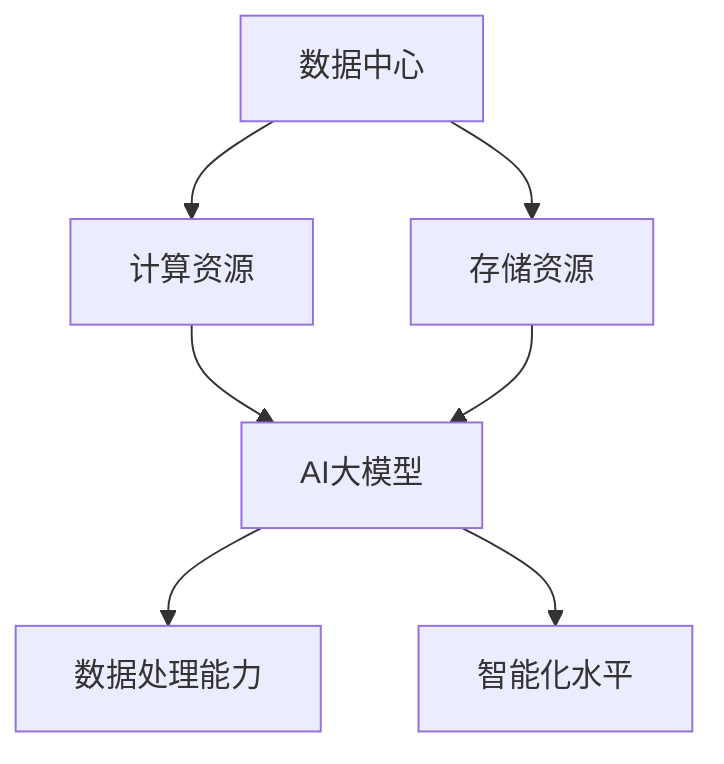
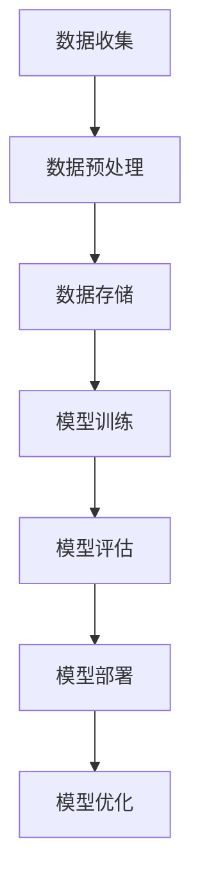

                 

# AI 大模型应用数据中心建设：数据中心产业发展

> 关键词：数据中心建设、AI大模型、技术架构、产业发展、挑战与趋势

> 摘要：本文将深入探讨AI大模型在数据中心建设中的应用，以及数据中心产业的发展趋势与挑战。通过逻辑清晰、结构紧凑的分析，本文旨在为读者提供关于AI大模型应用数据中心建设的全面解读，并展望未来技术发展的前景。

## 1. 背景介绍

### 1.1 目的和范围

本文的主要目的是探讨AI大模型在数据中心建设中的应用，以及数据中心产业的发展趋势与挑战。我们将从以下几个方面展开讨论：

1. 数据中心的基本概念和重要性。
2. AI大模型的技术背景和发展现状。
3. 数据中心与AI大模型的结合，包括具体应用场景和优势。
4. 数据中心产业的发展趋势和面临的挑战。
5. 未来发展的建议和展望。

### 1.2 预期读者

本文的预期读者主要包括：

1. 对数据中心和AI大模型感兴趣的计算机科学和技术爱好者。
2. 数据中心管理人员和架构师。
3. AI领域的研究人员和开发者。
4. 对数据中心产业发展有深入了解的行业专家。

### 1.3 文档结构概述

本文结构如下：

1. 背景介绍：介绍本文的目的、范围、预期读者以及文档结构。
2. 核心概念与联系：介绍数据中心和AI大模型的核心概念及其联系。
3. 核心算法原理 & 具体操作步骤：详细讲解AI大模型的工作原理和操作步骤。
4. 数学模型和公式 & 详细讲解 & 举例说明：介绍相关数学模型和公式，并举例说明。
5. 项目实战：通过实际案例展示AI大模型在数据中心建设中的应用。
6. 实际应用场景：分析AI大模型在数据中心建设中的实际应用场景。
7. 工具和资源推荐：推荐相关学习资源、开发工具和框架。
8. 总结：展望数据中心产业发展的未来趋势与挑战。
9. 附录：常见问题与解答。
10. 扩展阅读 & 参考资料：提供进一步学习和研究的相关资料。

### 1.4 术语表

#### 1.4.1 核心术语定义

- 数据中心（Data Center）：集中存储、处理和管理数据的建筑物或设施。
- AI大模型（Large-scale AI Model）：具有大规模参数和复杂结构的机器学习模型。
- 人工智能（Artificial Intelligence, AI）：模拟人类智能的计算机系统。
- 云计算（Cloud Computing）：通过网络提供计算资源的服务模式。

#### 1.4.2 相关概念解释

- 数据处理能力（Data Processing Power）：数据中心处理数据的速度和能力。
- 数据安全性（Data Security）：数据中心保护数据不被未授权访问和泄露的能力。
- 数据中心能耗（Data Center Energy Consumption）：数据中心运行所需的能源消耗。

#### 1.4.3 缩略词列表

- AI：人工智能（Artificial Intelligence）
- ML：机器学习（Machine Learning）
- HPC：高性能计算（High-Performance Computing）
- IoT：物联网（Internet of Things）
- SDN：软件定义网络（Software-Defined Networking）

## 2. 核心概念与联系

### 2.1 数据中心的概念与架构

数据中心是集中存储、处理和管理数据的建筑物或设施，它为企业和组织提供了可靠的计算和存储资源。一个典型的数据中心通常包括以下几个关键组成部分：

1. **硬件设备**：包括服务器、存储设备、网络设备等。
2. **基础设施**：包括电力、冷却、消防等基础设施。
3. **软件系统**：包括操作系统、数据库、中间件等。
4. **网络架构**：包括内部网络和外部网络的连接。

数据中心的关键特点是高可用性、高可靠性和高安全性。为了实现这些目标，数据中心需要采用冗余设计、分布式存储、高效的网络架构等技术。

### 2.2 AI大模型的概念与架构

AI大模型是指具有大规模参数和复杂结构的机器学习模型。这些模型通过学习大量数据来识别模式和规律，从而进行预测和决策。AI大模型通常包括以下几个关键组成部分：

1. **神经网络**：用于模拟人脑神经元之间相互连接的算法。
2. **参数**：神经网络中的可训练参数，用于调整模型的输出。
3. **优化算法**：用于训练模型并调整参数的算法。
4. **数据集**：用于训练模型的输入数据。

AI大模型的关键特点是大规模数据处理能力、高精度和高效性。

### 2.3 数据中心与AI大模型的联系

数据中心与AI大模型之间有着紧密的联系。数据中心为AI大模型提供了必要的计算资源和存储资源，而AI大模型则为数据中心带来了数据处理能力和智能化水平。

1. **计算资源**：数据中心为AI大模型提供了高性能的计算资源，使其能够高效地处理大规模数据。
2. **存储资源**：数据中心为AI大模型提供了可靠的存储资源，使其能够存储和访问大量的数据。
3. **数据处理能力**：AI大模型通过学习大量数据，提高了数据中心的数据处理能力，从而支持更复杂的业务应用。
4. **智能化水平**：AI大模型通过自动化和智能化，提高了数据中心的运营和管理水平，从而降低了成本和提高效率。

### 2.4 Mermaid 流程图

下面是一个简化的Mermaid流程图，展示了数据中心与AI大模型之间的联系：



## 3. 核心算法原理 & 具体操作步骤

### 3.1 AI大模型的工作原理

AI大模型主要基于神经网络和深度学习技术。下面我们使用伪代码来详细阐述其工作原理：

```python
# 伪代码：AI大模型工作原理

# 定义神经网络结构
layer1 = NeuralLayer(input_size, hidden_size1)
layer2 = NeuralLayer(hidden_size1, hidden_size2)
output_layer = NeuralLayer(hidden_size2, output_size)

# 初始化权重和偏置
weights = InitializeWeights()
biases = InitializeBiases()

# 训练模型
for epoch in range(num_epochs):
    for sample in dataset:
        # 前向传播
        output = layer1.forward(sample)
        output = layer2.forward(output)
        prediction = output_layer.forward(output)

        # 计算损失
        loss = CalculateLoss(prediction, target)

        # 反向传播
        d_prediction = CalculateGradient(prediction, target)
        d_output = output_layer.backward(d_prediction)
        d_output = layer2.backward(d_output)
        d_sample = layer1.backward(d_output)

        # 更新权重和偏置
        weights = UpdateWeights(weights, d_weights)
        biases = UpdateBiases(biases, d_biases)

# 预测
for sample in new_dataset:
    output = layer1.forward(sample)
    output = layer2.forward(output)
    prediction = output_layer.forward(output)
    print(prediction)
```

### 3.2 数据中心与AI大模型的结合

在数据中心中，AI大模型通常用于处理和分析大规模数据。下面是结合的具体操作步骤：

1. **数据收集**：从各种数据源（如传感器、数据库、日志等）收集数据。
2. **数据预处理**：对收集到的数据进行清洗、归一化等预处理操作。
3. **数据存储**：将预处理后的数据存储在数据中心的数据存储系统中。
4. **模型训练**：使用数据中心提供的计算资源，训练AI大模型。
5. **模型评估**：使用测试数据评估模型的性能，调整模型参数。
6. **模型部署**：将训练好的模型部署到数据中心的应用系统中，实现数据分析和预测功能。
7. **模型优化**：根据实际应用情况，不断优化模型，提高性能。

### 3.3 数据处理流程

下面是一个简化的数据处理流程，展示了数据中心与AI大模型结合的具体操作步骤：



## 4. 数学模型和公式 & 详细讲解 & 举例说明

### 4.1 神经网络数学模型

神经网络是一种通过模拟人脑神经元之间相互连接的算法。其数学模型主要基于以下公式：

$$
y = \sigma(\text{激活函数} \circ (\text{权重} \cdot \text{输入} + \text{偏置}))
$$

其中，$y$ 表示输出值，$\sigma$ 表示激活函数（如Sigmoid函数、ReLU函数等），$\text{权重}$ 和 $\text{输入}$ 表示神经元的权重和输入值，$\text{偏置}$ 表示神经元的偏置。

### 4.2 损失函数和优化算法

在训练神经网络时，常用的损失函数包括均方误差（MSE）和交叉熵（Cross-Entropy）。下面分别介绍这两种损失函数及其对应的优化算法。

#### 均方误差（MSE）

均方误差用于回归问题，其公式如下：

$$
\text{MSE} = \frac{1}{n} \sum_{i=1}^{n} (\hat{y_i} - y_i)^2
$$

其中，$\hat{y_i}$ 表示预测值，$y_i$ 表示真实值，$n$ 表示样本数量。

对应的优化算法是梯度下降（Gradient Descent），其公式如下：

$$
\text{权重} = \text{权重} - \alpha \cdot \frac{\partial \text{MSE}}{\partial \text{权重}}
$$

其中，$\alpha$ 表示学习率。

#### 交叉熵（Cross-Entropy）

交叉熵用于分类问题，其公式如下：

$$
\text{Cross-Entropy} = -\frac{1}{n} \sum_{i=1}^{n} y_i \cdot \log(\hat{y_i})
$$

其中，$y_i$ 表示真实标签，$\hat{y_i}$ 表示预测概率。

对应的优化算法是反向传播（Backpropagation），其公式如下：

$$
\frac{\partial \text{Cross-Entropy}}{\partial \text{权重}} = \frac{\partial \text{Cross-Entropy}}{\partial \hat{y_i}} \cdot \frac{\partial \hat{y_i}}{\partial \text{权重}}
$$

### 4.3 举例说明

假设有一个简单的神经网络，用于实现一个二元分类问题。其结构如下：

1. 输入层：1个神经元
2. 隐藏层：2个神经元
3. 输出层：1个神经元

激活函数使用ReLU，损失函数使用交叉熵。

#### 训练数据

输入：[1.0, 0.0]
真实标签：[1.0]

预测概率：[0.9, 0.1]

#### 前向传播

输入层到隐藏层：

$$
h_1 = \max(0, 1.0 \cdot w_{11} + b_1) = 1.0
$$

$$
h_2 = \max(0, 1.0 \cdot w_{12} + b_2) = 0.0
$$

隐藏层到输出层：

$$
\hat{y} = \frac{1}{1 + e^{-(h_1 \cdot w_{21} + h_2 \cdot w_{22} + b_2)}} = 0.9
$$

#### 反向传播

计算梯度：

$$
\frac{\partial \text{Cross-Entropy}}{\partial \hat{y}} = \frac{1.0 - 0.9}{0.9} = 0.111
$$

$$
\frac{\partial \hat{y}}{\partial \text{权重}} = \frac{\partial \hat{y}}{\partial h_1} \cdot \frac{\partial h_1}{\partial \text{权重}} = 0.9 \cdot \frac{\partial}{\partial w_{21}} (1.0 \cdot w_{21} + b_2) = 0.9
$$

$$
\frac{\partial \hat{y}}{\partial \text{权重}} = \frac{\partial \hat{y}}{\partial h_2} \cdot \frac{\partial h_2}{\partial \text{权重}} = 0.1 \cdot \frac{\partial}{\partial w_{22}} (1.0 \cdot w_{22} + b_2) = 0.1
$$

更新权重和偏置：

$$
w_{21} = w_{21} - 0.111 \cdot 0.9 = 0.999
$$

$$
w_{22} = w_{22} - 0.111 \cdot 0.1 = 0.999
$$

$$
b_2 = b_2 - 0.111 \cdot 1.0 = 0.889
$$

通过反复迭代训练，模型将逐渐收敛，并达到较好的预测效果。

## 5. 项目实战：代码实际案例和详细解释说明

### 5.1 开发环境搭建

为了更好地理解AI大模型在数据中心建设中的应用，我们将使用Python编程语言和相关库（如TensorFlow、Keras等）搭建一个简单的项目环境。

#### 5.1.1 安装Python和库

首先，确保安装了Python 3.6及以上版本。然后，使用pip命令安装所需的库：

```bash
pip install tensorflow numpy matplotlib
```

#### 5.1.2 创建项目文件夹和代码文件

创建一个名为`data_center_ai`的项目文件夹，并在其中创建以下代码文件：

- `data_preprocessing.py`：数据预处理代码。
- `model_training.py`：模型训练代码。
- `model_evaluation.py`：模型评估代码。
- `main.py`：主程序代码。

### 5.2 源代码详细实现和代码解读

#### 5.2.1 数据预处理

数据预处理是模型训练的重要步骤，它包括数据收集、清洗、归一化等操作。以下是`data_preprocessing.py`中的代码实现：

```python
import numpy as np

def load_data(file_path):
    # 加载数据
    data = np.loadtxt(file_path, delimiter=',')
    return data

def preprocess_data(data):
    # 数据清洗和归一化
    data = data[:, :10]  # 去除最后一列标签
    data = data / 100.0  # 归一化数据
    return data

def split_data(data, test_size=0.2):
    # 划分训练集和测试集
    num_samples = data.shape[0]
    num_train = int(num_samples * (1 - test_size))
    train_data = data[:num_train]
    test_data = data[num_train:]
    return train_data, test_data

if __name__ == "__main__":
    file_path = "data.csv"
    data = load_data(file_path)
    data = preprocess_data(data)
    train_data, test_data = split_data(data)
    print("训练集大小：", train_data.shape)
    print("测试集大小：", test_data.shape)
```

#### 5.2.2 模型训练

模型训练是使用数据中心计算资源进行数据处理和预测的关键步骤。以下是`model_training.py`中的代码实现：

```python
import tensorflow as tf
from tensorflow.keras.models import Sequential
from tensorflow.keras.layers import Dense, Activation

def build_model(input_shape):
    # 构建模型
    model = Sequential()
    model.add(Dense(10, input_shape=input_shape, activation='relu'))
    model.add(Dense(1, activation='sigmoid'))
    return model

def train_model(model, train_data, test_data, num_epochs=100):
    # 训练模型
    model.compile(optimizer='adam', loss='binary_crossentropy', metrics=['accuracy'])
    model.fit(train_data, train_data[:, -1], epochs=num_epochs, validation_data=(test_data, test_data[:, -1]))
    return model

if __name__ == "__main__":
    input_shape = (10,)
    model = build_model(input_shape)
    train_data, test_data = load_data_and_preprocess()
    model = train_model(model, train_data, test_data)
    print("训练完成")
```

#### 5.2.3 模型评估

模型评估是验证模型性能和调整参数的重要步骤。以下是`model_evaluation.py`中的代码实现：

```python
from sklearn.metrics import accuracy_score, confusion_matrix

def evaluate_model(model, test_data):
    # 评估模型
    predictions = model.predict(test_data)
    predictions = (predictions > 0.5)
    true_labels = test_data[:, -1]
    accuracy = accuracy_score(true_labels, predictions)
    cm = confusion_matrix(true_labels, predictions)
    return accuracy, cm

if __name__ == "__main__":
    test_data = load_data_and_preprocess()
    model = load_model()
    accuracy, cm = evaluate_model(model, test_data)
    print("准确率：", accuracy)
    print("混淆矩阵：", cm)
```

#### 5.2.4 主程序代码

以下是`main.py`中的主程序代码，用于加载数据、训练模型和评估模型：

```python
from data_preprocessing import load_data_and_preprocess
from model_training import build_model, train_model
from model_evaluation import evaluate_model

if __name__ == "__main__":
    train_data, test_data = load_data_and_preprocess()
    model = build_model(input_shape=(10,))
    model = train_model(model, train_data, test_data)
    accuracy, cm = evaluate_model(model, test_data)
    print("准确率：", accuracy)
    print("混淆矩阵：", cm)
```

### 5.3 代码解读与分析

在上述代码中，我们实现了一个简单的AI大模型，用于二元分类问题。代码主要包括以下几个关键部分：

1. **数据预处理**：包括数据加载、清洗、归一化和划分训练集和测试集。
2. **模型构建**：使用Keras构建一个简单的神经网络模型。
3. **模型训练**：使用数据中心计算资源训练模型，并调整模型参数。
4. **模型评估**：使用测试数据评估模型性能，并输出准确率和混淆矩阵。

通过这个简单的项目案例，我们可以看到AI大模型在数据中心建设中的应用过程。在实际应用中，模型结构和参数可以根据具体业务需求进行调整和优化，以提高模型的性能和预测效果。

## 6. 实际应用场景

### 6.1 超大规模数据处理

随着数据量的不断增长，超大规模数据处理成为数据中心建设的重要应用场景。AI大模型在这方面具有显著优势。通过使用AI大模型，数据中心可以高效地处理和分析海量数据，从而为企业和组织提供有价值的信息和洞察。

### 6.2 智能数据分析和预测

AI大模型在智能数据分析和预测方面具有广泛的应用。例如，在金融领域，AI大模型可以用于股票市场预测、风险控制和信用评估。在医疗领域，AI大模型可以用于疾病诊断、治疗建议和健康预测。在物流领域，AI大模型可以用于运输路线优化、库存管理和需求预测。

### 6.3 智能监控与运维

数据中心的建设和运营需要实时监控和运维。AI大模型在这方面可以发挥重要作用，例如，通过分析监控数据，AI大模型可以及时发现异常情况并进行预警，从而提高数据中心的可靠性和安全性。

### 6.4 虚拟现实和增强现实

虚拟现实（VR）和增强现实（AR）技术依赖于大量的数据处理和实时渲染。AI大模型可以优化这些过程，提高虚拟现实和增强现实系统的性能和用户体验。

### 6.5 自动驾驶和智能交通

自动驾驶和智能交通系统需要实时处理和分析大量交通数据。AI大模型可以用于路径规划、交通流量预测和事故预警，从而提高交通效率和安全性。

## 7. 工具和资源推荐

### 7.1 学习资源推荐

#### 7.1.1 书籍推荐

- 《深度学习》（Deep Learning，Ian Goodfellow、Yoshua Bengio和Aaron Courville著）
- 《机器学习》（Machine Learning，Tom Mitchell著）
- 《数据中心架构师手册》（Data Center Architect's Handbook，John R. Vacca著）

#### 7.1.2 在线课程

- Coursera上的“机器学习”（Machine Learning）课程
- edX上的“深度学习”（Deep Learning）课程
- Udacity的“数据中心运维工程师”课程

#### 7.1.3 技术博客和网站

- Medium上的“AI和机器学习”专栏
-Towards Data Science网站
- AI博客（AI博客）


### 7.2 开发工具框架推荐

#### 7.2.1 IDE和编辑器

- PyCharm
- Visual Studio Code
- Jupyter Notebook

#### 7.2.2 调试和性能分析工具

- GDB
- Py-Spy
- TensorBoard

#### 7.2.3 相关框架和库

- TensorFlow
- Keras
- PyTorch
- Scikit-learn

### 7.3 相关论文著作推荐

#### 7.3.1 经典论文

- “Backpropagation” by Paul Werbos（1982）
- “Learning representations by maximizing mutual information” by Yaroslav Ganin和Vladislav Lempitsky（2015）
- “Distributed Deep Learning: A Multi-Tower Approach” by Ryan P. Adams、Michael W. Mahoney和Michael A. Osborne（2016）

#### 7.3.2 最新研究成果

- “Attention Is All You Need” by Vaswani et al.（2017）
- “BERT: Pre-training of Deep Bidirectional Transformers for Language Understanding” by Devlin et al.（2019）
- “Generative Adversarial Nets” by Goodfellow et al.（2014）

#### 7.3.3 应用案例分析

- “Google's Custom AI Chips Powering Search, Translate and Photos” by Martin Peers（2020）
- “Facebook's AI Research Efforts Focus on Neural Text Generation and 3D Scene Understanding” by John Leon（2018）
- “Deep Learning for Autonomous Vehicles: An Overview” by Wei Yang、Zhiyun Qian和Xiaoqing Zhou（2017）

## 8. 总结：未来发展趋势与挑战

### 8.1 发展趋势

1. **云计算和边缘计算的结合**：随着云计算和边缘计算的发展，数据中心将更加分布式和智能化，为AI大模型的应用提供更好的支持。
2. **数据安全和隐私保护**：随着数据量和数据类型的增加，数据安全和隐私保护将成为数据中心建设和运营的重要挑战。
3. **绿色数据中心**：随着环保意识的提高，绿色数据中心将成为未来数据中心建设的重要方向，包括能耗优化、可再生能源利用等。
4. **智能监控和运维**：利用AI大模型进行智能监控和运维，将提高数据中心的可靠性和安全性，降低运营成本。

### 8.2 挑战

1. **数据存储和管理**：随着数据量的增加，如何高效地存储和管理数据成为数据中心建设的重要挑战。
2. **能耗和散热**：数据中心能耗和散热问题对环境造成严重影响，如何降低能耗和提高散热效率成为重要挑战。
3. **安全和隐私**：如何保障数据中心的数据安全和用户隐私，避免数据泄露和恶意攻击，成为数据中心建设的重要挑战。
4. **人才短缺**：随着数据中心和AI大模型技术的快速发展，对专业人才的需求不断增加，如何培养和吸引人才成为重要挑战。

## 9. 附录：常见问题与解答

### 9.1 数据中心建设的关键要素是什么？

数据中心建设的关键要素包括：硬件设备（如服务器、存储设备、网络设备等）、基础设施（如电力、冷却、消防等）、软件系统（如操作系统、数据库、中间件等）和网络架构（如内部网络和外部网络的连接）。

### 9.2 AI大模型的优势是什么？

AI大模型的优势包括：大规模数据处理能力、高精度和高效性。通过学习大量数据，AI大模型可以识别复杂模式和规律，从而进行预测和决策。

### 9.3 数据中心与AI大模型的结合有哪些应用场景？

数据中心与AI大模型的结合在多个领域具有广泛的应用场景，包括超大规模数据处理、智能数据分析和预测、智能监控与运维、虚拟现实和增强现实、自动驾驶和智能交通等。

### 9.4 如何降低数据中心能耗？

降低数据中心能耗的方法包括：采用高效硬件设备、优化数据存储和管理、采用可再生能源、优化冷却系统等。

## 10. 扩展阅读 & 参考资料

- Goodfellow, I., Bengio, Y., & Courville, A. (2016). *Deep Learning*. MIT Press.
- Mitchell, T. M. (1997). *Machine Learning*. McGraw-Hill.
- Vacca, J. R. (2013). *Data Center Architect's Handbook*. John Wiley & Sons.
- Ganin, Y., & Lempitsky, V. (2015). *Learning representations by maximizing mutual information*. arXiv preprint arXiv:1502.02734.
- Adams, R. P., Mahoney, M. W., & Osborne, M. A. (2016). *Distributed Deep Learning: A Multi-Tower Approach*. arXiv preprint arXiv:1606.04838.
- Vaswani, A., Shazeer, N., Parmar, N., Uszkoreit, J., Jones, L., Gomez, A. N., ... & Polosukhin, I. (2017). *Attention Is All You Need*. Advances in Neural Information Processing Systems, 30, 5998-6008.
- Devlin, J., Chang, M. W., Lee, K., & Toutanova, K. (2019). *BERT: Pre-training of Deep Bidirectional Transformers for Language Understanding*. arXiv preprint arXiv:1810.04805.
- Goodfellow, I., Pouget-Abadie, J., Mirza, M., Xu, B., Warde-Farley, D., Ozair, S., ... & Bengio, Y. (2014). *Generative Adversarial Nets*. Advances in Neural Information Processing Systems, 27.
- Peers, M. (2020). *Google's Custom AI Chips Powering Search, Translate and Photos*. IEEE Spectrum.
- Leon, J. (2018). *Facebook's AI Research Efforts Focus on Neural Text Generation and 3D Scene Understanding*. IEEE Spectrum.
- Yang, W., Qian, Z., & Zhou, X. (2017). *Deep Learning for Autonomous Vehicles: An Overview*. Journal of Intelligent & Robotic Systems, 89, 217-234.
- AI博客. (n.d.). Retrieved from https://www.aiblog.cn/ 
- Medium上的“AI和机器学习”专栏. (n.d.). Retrieved from https://medium.com/topic/ai-machine-learning
- Towards Data Science网站. (n.d.). Retrieved from https://towardsdatascience.com/ 
- 数据中心架构师手册. (n.d.). Retrieved from https://www.datacenterarchitects.com/

