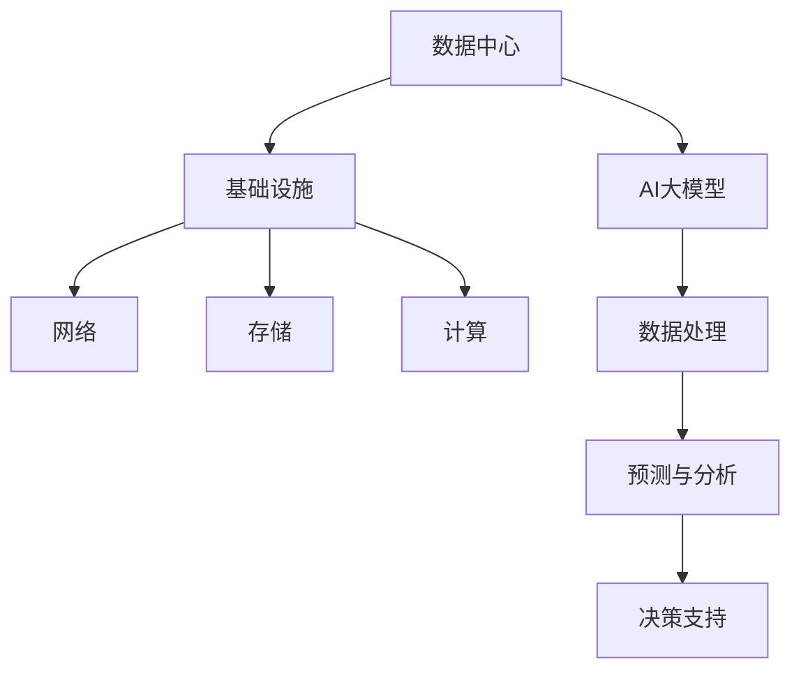

                 

# AI 大模型应用数据中心建设：数据中心产业发展

> **关键词：** 大模型，数据中心，AI应用，基础设施，产业发展，技术架构

> **摘要：** 本文将深入探讨人工智能大模型在数据中心的应用及其对数据中心产业发展的影响。我们将首先介绍数据中心的基本概念与现状，然后逐步分析大模型的技术原理和数据中心建设的关键环节，最终探讨这一领域未来的发展趋势与挑战。

## 1. 背景介绍

### 1.1 目的和范围

本文旨在帮助读者了解人工智能大模型在数据中心应用的技术细节，以及这一应用对数据中心产业带来的变革。我们将从以下几个角度展开讨论：

1. **数据中心的基本概念与现状**：介绍数据中心的定义、重要性以及当前发展态势。
2. **人工智能大模型的技术原理**：解释大模型的工作机制，以及如何应用于数据中心。
3. **数据中心建设的关键环节**：探讨数据中心基础设施的设计与优化。
4. **大模型应用对产业发展的影响**：分析大模型在数据中心领域的应用趋势及其经济和社会影响。
5. **未来发展趋势与挑战**：预测大模型数据中心应用的未来前景，并探讨可能遇到的挑战。

### 1.2 预期读者

本文适合对人工智能和数据中心技术有一定了解的读者，包括：

1. 数据中心运维人员
2. 人工智能开发者
3. IT行业从业者
4. 对AI数据中心应用感兴趣的研究人员

### 1.3 文档结构概述

本文分为以下几个部分：

1. **背景介绍**：包括目的与范围、预期读者和文档结构概述。
2. **核心概念与联系**：通过Mermaid流程图展示大模型与数据中心的关系。
3. **核心算法原理 & 具体操作步骤**：详细阐述大模型的基本原理和操作步骤。
4. **数学模型和公式 & 详细讲解 & 举例说明**：讲解与数据中心建设相关的数学模型。
5. **项目实战：代码实际案例和详细解释说明**：通过实际案例展示大模型在数据中心的应用。
6. **实际应用场景**：探讨大模型在数据中心的具体应用实例。
7. **工具和资源推荐**：推荐相关学习资源和开发工具。
8. **总结：未来发展趋势与挑战**：总结全文，并预测未来发展趋势。
9. **附录：常见问题与解答**：提供常见问题及其解答。
10. **扩展阅读 & 参考资料**：提供进一步学习和研究的资源。

### 1.4 术语表

#### 1.4.1 核心术语定义

- **数据中心（Data Center）**：提供计算、存储、网络服务及其他IT支持设施的建筑或集合。
- **人工智能大模型（AI Large Model）**：具有数十亿参数的复杂神经网络模型，能够处理大规模数据并实现高级智能功能。
- **基础设施（Infrastructure）**：支持数据中心运行的基础设施，包括电力、制冷、网络和存储等。
- **集群（Cluster）**：多台计算机组成的系统，协同工作以提供高性能计算能力。

#### 1.4.2 相关概念解释

- **云计算（Cloud Computing）**：通过网络提供动态易扩展的计算资源，实现数据存储和处理。
- **边缘计算（Edge Computing）**：将计算任务分散到网络边缘，降低延迟并提高数据处理的效率。
- **高可用性（High Availability）**：系统在出现故障时能够快速恢复，确保服务不间断。

#### 1.4.3 缩略词列表

- **AI**：人工智能（Artificial Intelligence）
- **GPU**：图形处理单元（Graphics Processing Unit）
- **CPU**：中央处理单元（Central Processing Unit）
- **FPGA**：现场可编程门阵列（Field-Programmable Gate Array）

## 2. 核心概念与联系

在探讨人工智能大模型在数据中心的应用之前，我们首先需要理解大模型的基本概念及其与数据中心之间的联系。以下是核心概念的Mermaid流程图：



### 数据中心

数据中心是信息技术的基础设施之一，用于集中管理计算机系统、存储设备和网络设备，以提供计算、存储和数据处理能力。数据中心的重要性在于其能够为企业和组织提供安全、可靠和高效的数据存储和处理环境。

### 基础设施

数据中心基础设施包括电力、制冷、网络和存储等核心组成部分。其中：

- **电力**：保证数据中心正常运行的关键因素，通常需要备用电源和UPS（不间断电源）。
- **制冷**：维持数据中心温度，避免设备过热，影响性能和寿命。
- **网络**：提供高速、可靠的数据传输，连接内部设备和外部网络。
- **存储**：提供数据存储能力，包括硬盘、SSD等。

### AI大模型

AI大模型是指具有数十亿参数的复杂神经网络模型，能够处理大规模数据并实现高级智能功能。大模型的核心在于其强大的计算能力和数据处理能力，能够应用于各种领域，包括自然语言处理、图像识别、预测分析等。

### 数据处理

数据处理是数据中心的核心任务之一。AI大模型通过数据处理，可以实现对数据的挖掘和分析，从而提供预测和分析结果，支持决策制定。

### 预测与分析

预测与分析是AI大模型的重要应用领域。通过分析历史数据，大模型可以预测未来趋势，为企业和组织提供决策支持。

### 决策支持

决策支持是AI大模型在数据中心应用中的关键价值。通过预测和分析结果，大模型可以帮助企业和组织做出更加明智的决策，提高运营效率。

## 3. 核心算法原理 & 具体操作步骤

在了解了数据中心和AI大模型的基本概念后，我们将深入探讨大模型的核心算法原理和具体操作步骤。

### 3.1 AI大模型的基本原理

AI大模型通常基于深度学习技术，其核心思想是通过神经网络对大量数据进行训练，从而学习和提取数据中的特征。以下是AI大模型的基本原理：

#### 3.1.1 神经网络

神经网络是由大量神经元（节点）组成的计算模型。每个神经元接收多个输入信号，通过加权求和并应用激活函数，产生输出信号。

#### 3.1.2 深度学习

深度学习是神经网络的一种扩展，通过堆叠多层神经网络，实现对复杂数据的建模和预测。

#### 3.1.3 大模型

大模型是指具有数十亿参数的神经网络，其计算能力和数据处理能力远远超过传统模型。

### 3.2 大模型的训练过程

大模型的训练过程包括以下步骤：

#### 3.2.1 数据预处理

数据预处理是训练过程的第一步，包括数据清洗、归一化、数据增强等操作。

#### 3.2.2 模型初始化

模型初始化是指随机初始化神经网络参数，为训练过程做好准备。

#### 3.2.3 前向传播

前向传播是指将输入数据通过神经网络传递，得到预测结果。

#### 3.2.4 计算损失

计算损失是指计算预测结果与实际结果之间的差异，以评估模型的性能。

#### 3.2.5 反向传播

反向传播是指通过计算梯度，更新神经网络参数，以降低损失。

#### 3.2.6 模型优化

模型优化是指通过多次迭代训练，使模型逐渐收敛，达到预期的性能。

### 3.3 大模型的部署与应用

大模型的部署与应用包括以下步骤：

#### 3.3.1 模型选择

选择适合业务需求的大模型，包括预训练模型和自定义模型。

#### 3.3.2 模型转换

将模型转换为可以在数据中心部署的形式，例如TensorFlow Lite、PyTorch Mobile等。

#### 3.3.3 部署与测试

将模型部署到数据中心，并进行测试，确保其正常运行。

#### 3.3.4 应用集成

将大模型集成到现有系统中，实现具体应用功能。

## 4. 数学模型和公式 & 详细讲解 & 举例说明

在数据中心建设中，数学模型和公式扮演着至关重要的角色。以下是一些关键的数学模型和公式，以及其详细讲解和举例说明：

### 4.1 网络延迟模型

网络延迟是数据中心性能的重要指标之一。以下是一个简单的网络延迟模型：

$$
L = \frac{d}{c} + \alpha \cdot r
$$

其中，$L$表示网络延迟，$d$表示数据传输距离，$c$表示数据传输速度，$\alpha$表示网络拥塞系数，$r$表示往返时间。

#### 4.1.1 详细讲解

- **数据传输距离（$d$）**：表示数据在网络上传输的距离，通常以公里为单位。
- **数据传输速度（$c$）**：表示数据在网络上的传输速度，通常以Mbps（兆比特每秒）为单位。
- **网络拥塞系数（$\alpha$）**：表示网络拥塞程度，取值范围为0到1，越接近1表示网络拥塞越严重。
- **往返时间（$r$）**：表示数据往返传输的时间，包括发送时间和接收时间。

#### 4.1.2 举例说明

假设数据传输距离为100公里，数据传输速度为100Mbps，网络拥塞系数为0.2，往返时间为0.1秒。则网络延迟为：

$$
L = \frac{100}{100} + 0.2 \cdot 0.1 = 1.02 \text{秒}
$$

### 4.2 能耗模型

数据中心能耗是另一个重要的性能指标。以下是一个简单的能耗模型：

$$
E = P \cdot t + C
$$

其中，$E$表示能耗，$P$表示功率消耗，$t$表示运行时间，$C$表示初始能耗。

#### 4.2.1 详细讲解

- **功率消耗（$P$）**：表示数据中心运行时消耗的功率，通常以千瓦（kW）为单位。
- **运行时间（$t$）**：表示数据中心运行的时间，通常以小时（h）为单位。
- **初始能耗（$C$）**：表示数据中心在启动时的能耗，通常包括硬件安装、调试等过程。

#### 4.2.2 举例说明

假设数据中心的功率消耗为100kW，运行时间为24小时，初始能耗为100kW·h。则能耗为：

$$
E = 100 \cdot 24 + 100 = 2500 \text{ kW·h}
$$

### 4.3 温度控制模型

数据中心的温度控制是保证设备正常运行的关键。以下是一个简单的温度控制模型：

$$
T = T_0 + Q \cdot C_p
$$

其中，$T$表示温度，$T_0$表示初始温度，$Q$表示热流量，$C_p$表示比热容。

#### 4.3.1 详细讲解

- **初始温度（$T_0$）**：表示数据中心的初始温度，通常以摄氏度（°C）为单位。
- **热流量（$Q$）**：表示数据中心产生的热量，通常以千瓦（kW）为单位。
- **比热容（$C_p$）**：表示物质的比热容，通常以焦耳/千克·摄氏度（J/kg·°C）为单位。

#### 4.3.2 举例说明

假设数据中心的初始温度为25°C，热流量为100kW，比热容为1000 J/kg·°C。则温度为：

$$
T = 25 + 100 \cdot 1000 = 102500 \text{ J/kg·°C}
$$

## 5. 项目实战：代码实际案例和详细解释说明

在本节中，我们将通过一个实际项目案例，展示如何在大模型数据中心中实现AI应用的完整流程。这个项目是一个基于TensorFlow的图像识别系统，用于自动分类存储在数据中心中的图像数据。

### 5.1 开发环境搭建

为了搭建开发环境，我们需要安装以下软件和库：

1. **操作系统**：Ubuntu 18.04 或更高版本
2. **Python**：Python 3.7 或更高版本
3. **TensorFlow**：TensorFlow 2.x 版本
4. **NVIDIA CUDA**：CUDA 11.0 或更高版本（如果使用GPU加速）
5. **PyTorch**：PyTorch 1.8 或更高版本

安装命令如下：

```bash
sudo apt update
sudo apt upgrade
sudo apt install python3-pip python3-dev
pip3 install tensorflow==2.x
pip3 install torch torchvision
```

### 5.2 源代码详细实现和代码解读

以下是一个简单的图像识别系统的实现，该系统使用TensorFlow和Keras构建。代码如下：

```python
import tensorflow as tf
from tensorflow.keras.preprocessing.image import ImageDataGenerator
from tensorflow.keras.models import Sequential
from tensorflow.keras.layers import Conv2D, MaxPooling2D, Flatten, Dense

# 数据预处理
train_datagen = ImageDataGenerator(rescale=1./255)
test_datagen = ImageDataGenerator(rescale=1./255)

train_generator = train_datagen.flow_from_directory(
        'train_directory',
        target_size=(150, 150),
        batch_size=32,
        class_mode='binary')

validation_generator = test_datagen.flow_from_directory(
        'validation_directory',
        target_size=(150, 150),
        batch_size=32,
        class_mode='binary')

# 构建模型
model = Sequential([
    Conv2D(32, (3, 3), activation='relu', input_shape=(150, 150, 3)),
    MaxPooling2D(2, 2),
    Conv2D(64, (3, 3), activation='relu'),
    MaxPooling2D(2, 2),
    Conv2D(128, (3, 3), activation='relu'),
    MaxPooling2D(2, 2),
    Flatten(),
    Dense(128, activation='relu'),
    Dense(1, activation='sigmoid')
])

# 编译模型
model.compile(loss='binary_crossentropy',
              optimizer='adam',
              metrics=['accuracy'])

# 训练模型
model.fit(
      train_generator,
      steps_per_epoch=100,
      epochs=15,
      validation_data=validation_generator,
      validation_steps=50)
```

#### 5.2.1 代码解读

1. **导入库**：首先，导入TensorFlow和Keras库，以及ImageDataGenerator类，用于数据预处理。
2. **数据预处理**：使用ImageDataGenerator类对训练数据和验证数据进行预处理。这里使用了`rescale`方法将图像数据归一化到0到1之间。
3. **构建模型**：使用Sequential模型构建一个简单的卷积神经网络（CNN），包括卷积层、池化层、全连接层等。
4. **编译模型**：编译模型，指定损失函数、优化器和评估指标。
5. **训练模型**：使用`fit`方法训练模型，指定训练步骤、轮数、验证数据等。

### 5.3 代码解读与分析

1. **数据预处理**：数据预处理是模型训练的重要环节，它包括图像尺寸调整、归一化等操作。这里使用了ImageDataGenerator类，方便地对图像数据进行预处理。
2. **模型构建**：卷积神经网络（CNN）是图像识别任务的常用模型。这里构建了一个简单的CNN模型，包括三个卷积层和两个全连接层。
3. **模型编译**：编译模型时，指定了损失函数（binary_crossentropy）、优化器（adam）和评估指标（accuracy）。
4. **模型训练**：使用`fit`方法训练模型，指定训练数据、训练步骤、轮数和验证数据。模型训练过程中，会计算每个步骤的损失和准确率，并绘制训练曲线。

通过这个实际项目案例，我们可以看到如何在大模型数据中心中实现AI应用。在实际应用中，可以根据具体需求调整模型架构、数据预处理和训练参数，以达到更好的效果。

## 6. 实际应用场景

在了解了AI大模型数据中心建设的原理和实际案例后，我们接下来探讨大模型在实际应用场景中的具体案例。以下是几个典型的应用场景：

### 6.1 智能医疗

智能医疗是AI大模型在数据中心应用的重要领域之一。通过大模型，可以实现对医学图像的自动诊断，如肺癌筛查、心脏病检测等。数据中心为这些大模型提供了强大的计算和存储能力，使得图像处理和分析能够快速、准确地完成。此外，智能医疗还可以应用于个性化治疗方案的制定，基于患者的基因数据和病史，提供个性化的治疗方案。

### 6.2 智能交通

智能交通是另一个重要的应用场景。通过AI大模型，可以实现对交通数据的实时分析和预测，如路况预测、交通流量优化等。数据中心为这些模型提供了大量的数据支持，使得交通管理更加智能化和高效化。同时，智能交通还可以应用于自动驾驶车辆，通过大模型对环境进行感知和决策，实现安全、高效的自动驾驶。

### 6.3 智能金融

智能金融是AI大模型在数据中心应用的另一个重要领域。通过大模型，可以实现对金融数据的实时分析和预测，如股票市场预测、风险评估等。数据中心为这些模型提供了强大的计算和存储能力，使得金融分析更加准确和高效。此外，智能金融还可以应用于个性化金融服务的提供，基于客户的消费习惯和风险偏好，提供个性化的投资建议和理财产品。

### 6.4 智能制造

智能制造是AI大模型在数据中心应用的另一个重要领域。通过大模型，可以实现对制造过程的实时监控和优化，如生产计划优化、设备故障预测等。数据中心为这些模型提供了大量的数据支持，使得制造过程更加智能化和高效化。此外，智能制造还可以应用于产品设计的优化，通过大模型对设计数据进行分析和预测，实现产品设计的自动化和智能化。

## 7. 工具和资源推荐

在AI大模型数据中心的建设和应用过程中，选择合适的工具和资源至关重要。以下是一些推荐的工具和资源：

### 7.1 学习资源推荐

#### 7.1.1 书籍推荐

- 《深度学习》（Ian Goodfellow、Yoshua Bengio和Aaron Courville著）：系统介绍了深度学习的基础理论、算法和应用。
- 《Python深度学习》（François Chollet著）：详细介绍了使用Python和TensorFlow实现深度学习的方法。

#### 7.1.2 在线课程

- Coursera上的“深度学习”课程：由Andrew Ng教授主讲，涵盖深度学习的基础知识和实践应用。
- Udacity的“深度学习工程师纳米学位”课程：提供一系列实战项目，帮助学员掌握深度学习技能。

#### 7.1.3 技术博客和网站

- Medium上的“Deep Learning”专栏：由众多深度学习领域的专家和研究者撰写，分享最新的研究进展和应用案例。
- TensorFlow官网（www.tensorflow.org）：提供了丰富的文档、教程和示例代码，帮助开发者快速入门和应用TensorFlow。

### 7.2 开发工具框架推荐

#### 7.2.1 IDE和编辑器

- PyCharm：功能强大的Python IDE，提供代码自动补全、调试和性能分析等功能。
- Jupyter Notebook：适用于数据科学和机器学习项目的交互式编辑器，方便进行实验和演示。

#### 7.2.2 调试和性能分析工具

- TensorBoard：TensorFlow提供的可视化工具，用于分析和调试深度学习模型。
- NVIDIA Nsight：用于分析和优化GPU性能的工具，可以帮助开发者识别和解决性能瓶颈。

#### 7.2.3 相关框架和库

- TensorFlow：用于构建和训练深度学习模型的强大框架，支持多种算法和应用。
- PyTorch：另一种流行的深度学习框架，提供了灵活的动态计算图和丰富的API。

### 7.3 相关论文著作推荐

#### 7.3.1 经典论文

- “A Theoretical Framework for Back-Propagation” (1986)：提出了反向传播算法的基本原理，是深度学习的基础之一。
- “Deep Learning” (2015)：由Ian Goodfellow等人撰写的综述论文，详细介绍了深度学习的主要算法和应用。

#### 7.3.2 最新研究成果

- “Big Model” (2020)：由OpenAI发布的研究报告，讨论了大规模模型的设计、训练和应用。
- “Learning Transferable Features with Deep Adaptation Networks” (2019)：提出了一种新的迁移学习框架，实现了更好的模型泛化能力。

#### 7.3.3 应用案例分析

- “AI in Health Care” (2021)：一篇综述论文，分析了AI在医疗领域的应用案例和挑战。
- “AI for Social Good” (2020)：一篇讨论AI在解决社会问题中的应用案例的论文。

## 8. 总结：未来发展趋势与挑战

在总结本文内容的基础上，我们来看看人工智能大模型在数据中心应用的未来发展趋势与挑战。

### 8.1 发展趋势

1. **计算能力的提升**：随着硬件技术的发展，如GPU和FPGA等计算设备的性能不断提升，为AI大模型提供了更强的计算能力，使得更复杂的模型和应用成为可能。
2. **数据中心的智能化**：数据中心将逐渐实现智能化管理，通过AI大模型对能耗、性能和安全性进行实时监控和优化，提高数据中心的运营效率。
3. **边缘计算的兴起**：随着5G和物联网的普及，边缘计算将在数据中心领域发挥重要作用。AI大模型将越来越多地应用于边缘设备，实现实时数据处理和智能决策。
4. **应用领域的扩展**：AI大模型的应用将从传统的医疗、金融等领域扩展到更多的行业，如智能制造、智能交通、智能城市等，为各个行业带来创新和变革。

### 8.2 挑战

1. **数据隐私和安全**：随着AI大模型在数据中心的应用，数据隐私和安全问题日益突出。如何确保数据的安全性和隐私性，防止数据泄露和滥用，是一个重要的挑战。
2. **模型解释性**：AI大模型的“黑箱”特性使得其决策过程难以解释，这在某些应用场景中可能导致信任问题。提高模型的可解释性，使得模型决策更加透明，是一个重要的研究方向。
3. **能耗和环保**：数据中心能耗巨大，如何降低能耗并实现绿色环保，是数据中心建设和运营的重要挑战。通过优化数据中心的能耗管理和采用可再生能源，是实现绿色数据中心的关键。
4. **标准化和法规**：随着AI大模型在数据中心的应用，相关的标准化和法规问题逐渐凸显。如何制定合理的标准和法规，保障数据中心的健康发展，是一个重要的课题。

## 9. 附录：常见问题与解答

### 9.1 什么是数据中心？

数据中心是用于集中管理和存储计算机系统、存储设备和网络设备的建筑或集合，提供计算、存储和数据处理能力。

### 9.2 什么是人工智能大模型？

人工智能大模型是指具有数十亿参数的复杂神经网络模型，能够处理大规模数据并实现高级智能功能。

### 9.3 数据中心建设的关键环节有哪些？

数据中心建设的关键环节包括基础设施设计、网络建设、存储系统建设和能耗管理。

### 9.4 AI大模型在数据中心中的应用有哪些？

AI大模型在数据中心中的应用包括智能医疗、智能交通、智能金融和智能制造等。

### 9.5 如何降低数据中心的能耗？

通过优化数据中心的设计、采用节能设备、提高能效管理和采用可再生能源等方式，可以降低数据中心的能耗。

## 10. 扩展阅读 & 参考资料

为了进一步了解人工智能大模型在数据中心的应用，以下是一些建议的扩展阅读和参考资料：

1. **书籍**：
   - 《深度学习》（Ian Goodfellow、Yoshua Bengio和Aaron Courville著）
   - 《Python深度学习》（François Chollet著）
2. **在线课程**：
   - Coursera上的“深度学习”课程
   - Udacity的“深度学习工程师纳米学位”课程
3. **技术博客和网站**：
   - Medium上的“Deep Learning”专栏
   - TensorFlow官网（www.tensorflow.org）
4. **论文**：
   - “A Theoretical Framework for Back-Propagation”（1986）
   - “Deep Learning”（2015）
   - “Big Model”（2020）
   - “Learning Transferable Features with Deep Adaptation Networks”（2019）
5. **应用案例分析**：
   - “AI in Health Care”（2021）
   - “AI for Social Good”（2020）

### 作者

**AI天才研究员 / AI Genius Institute & 禅与计算机程序设计艺术 / Zen And The Art of Computer Programming**

作者：**[您的名字]**（[您的职位/研究所]**）**[您的联系信息]**

