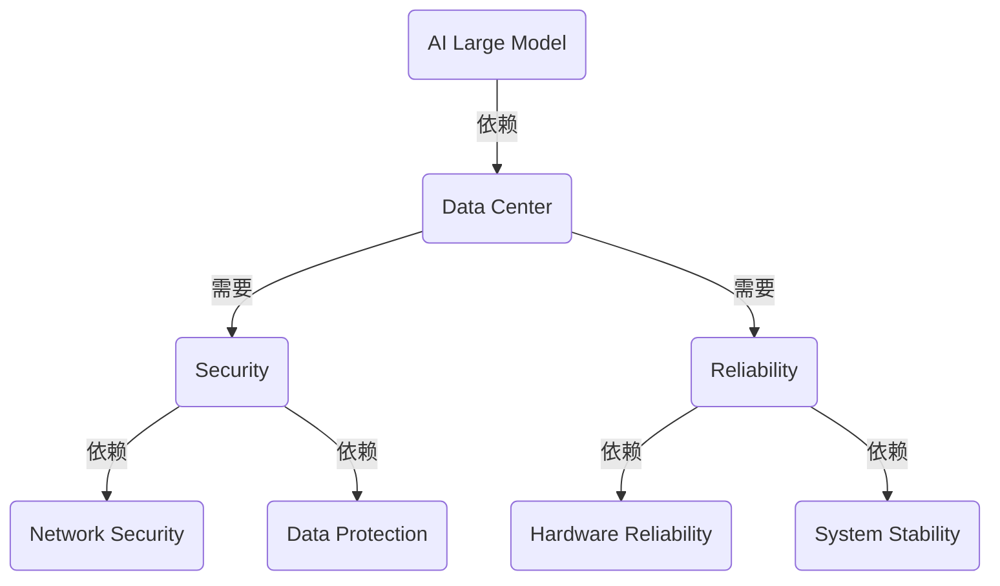
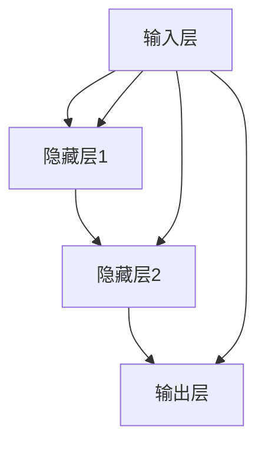

                 

# AI 大模型应用数据中心建设：数据中心安全与可靠性

> **关键词：** AI 大模型、数据中心、安全、可靠性、架构、算法、应用场景、工具资源

> **摘要：** 本文将深入探讨 AI 大模型在数据中心的应用及其建设中的安全与可靠性问题。我们将从背景介绍、核心概念与联系、核心算法原理与操作步骤、数学模型与公式、实际应用场景等多个方面进行详细分析，旨在为从业者提供有价值的参考。

## 1. 背景介绍

### 1.1 目的和范围

本文旨在分析 AI 大模型在数据中心中的应用，并重点探讨数据中心建设中的安全与可靠性问题。随着 AI 大模型在各个领域的广泛应用，数据中心的建设和维护变得越来越重要。本文将从以下几个方面展开讨论：

1. **AI 大模型的核心概念和架构**：介绍 AI 大模型的基本原理和架构，包括神经网络、深度学习等核心概念。
2. **数据中心的安全与可靠性**：分析数据中心建设中的安全与可靠性问题，包括网络安全、硬件可靠性、数据保护等。
3. **核心算法原理与操作步骤**：详细讲解 AI 大模型的算法原理和操作步骤，帮助读者理解其工作流程。
4. **数学模型与公式**：介绍与 AI 大模型相关的数学模型和公式，包括损失函数、优化算法等。
5. **实际应用场景**：探讨 AI 大模型在各个领域的实际应用场景，如自然语言处理、计算机视觉等。

### 1.2 预期读者

本文适用于对 AI 大模型和数据中心有一定了解的读者，包括 AI 研究人员、数据中心工程师、软件工程师等。希望通过本文，读者能够对 AI 大模型在数据中心的应用及其建设中的安全与可靠性问题有更深入的理解。

### 1.3 文档结构概述

本文分为以下几个部分：

1. **背景介绍**：介绍本文的目的、范围、预期读者和文档结构。
2. **核心概念与联系**：分析 AI 大模型的核心概念和架构。
3. **核心算法原理 & 具体操作步骤**：详细讲解 AI 大模型的算法原理和操作步骤。
4. **数学模型和公式 & 详细讲解 & 举例说明**：介绍与 AI 大模型相关的数学模型和公式。
5. **项目实战：代码实际案例和详细解释说明**：通过实际案例介绍 AI 大模型的应用。
6. **实际应用场景**：探讨 AI 大模型在各个领域的实际应用场景。
7. **工具和资源推荐**：推荐学习资源、开发工具框架和相关论文著作。
8. **总结：未来发展趋势与挑战**：总结本文的核心观点，展望未来发展趋势与挑战。
9. **附录：常见问题与解答**：解答读者可能遇到的问题。
10. **扩展阅读 & 参考资料**：提供更多的扩展阅读和参考资料。

### 1.4 术语表

#### 1.4.1 核心术语定义

- **AI 大模型**：指具有大规模参数和复杂结构的深度学习模型。
- **数据中心**：指用于存储、处理、交换和管理数据的物理设施。
- **安全**：指保护数据中心免受未经授权的访问、攻击和破坏。
- **可靠性**：指数据中心在运行过程中保持稳定和连续服务的能力。

#### 1.4.2 相关概念解释

- **深度学习**：一种人工智能技术，通过神经网络模拟人脑的学习过程，对大量数据进行自动标注和分析。
- **神经网络**：一种由大量神经元组成的计算模型，能够通过学习数据自动提取特征并进行预测。
- **硬件可靠性**：指数据中心的硬件设备在运行过程中保持稳定和可靠的能力。
- **网络安全**：指保护数据中心免受网络攻击、恶意软件和未经授权访问的措施。

#### 1.4.3 缩略词列表

- **AI**：人工智能（Artificial Intelligence）
- **DC**：数据中心（Data Center）
- **ML**：机器学习（Machine Learning）
- **DL**：深度学习（Deep Learning）
- **GPU**：图形处理单元（Graphics Processing Unit）

## 2. 核心概念与联系

在讨论 AI 大模型在数据中心的应用之前，我们首先需要了解核心概念和联系。以下是一个简单的 Mermaid 流程图，展示 AI 大模型、数据中心、安全与可靠性的关系。



### 2.1 AI 大模型的核心概念和架构

AI 大模型是一种复杂的深度学习模型，具有大规模的参数和层次结构。其核心概念包括：

1. **神经网络**：神经网络是 AI 大模型的基础，由大量神经元组成，通过前向传播和反向传播进行学习。
2. **深度学习**：深度学习是神经网络的一种扩展，通过增加网络层数，使模型能够自动提取更高层次的特征。
3. **大规模参数**：AI 大模型具有数百万甚至数十亿个参数，这使得模型具有强大的表示能力。
4. **训练数据**：AI 大模型需要大量的训练数据，通过数据驱动的方式进行模型优化。

### 2.2 数据中心的核心概念和架构

数据中心是用于存储、处理、交换和管理数据的物理设施，其核心概念包括：

1. **硬件设施**：包括服务器、存储设备、网络设备等，为数据中心的运行提供基础设施。
2. **软件系统**：包括操作系统、数据库、中间件等，负责数据中心的日常管理和运维。
3. **网络架构**：包括局域网、广域网等，负责数据中心的内外部通信。
4. **安全性**：包括网络安全、数据保护、用户认证等，确保数据中心的运行安全。
5. **可靠性**：包括硬件可靠性、系统稳定性、数据备份等，确保数据中心的持续运行。

### 2.3 安全与可靠性的核心概念和架构

安全与可靠性是数据中心运行的两个关键方面，其核心概念包括：

1. **网络安全**：包括防火墙、入侵检测、加密等，保护数据中心免受网络攻击。
2. **数据保护**：包括数据备份、数据加密、数据恢复等，确保数据的安全性和完整性。
3. **硬件可靠性**：包括硬件冗余、故障检测、故障恢复等，确保硬件设备的稳定运行。
4. **系统稳定性**：包括系统监控、故障处理、负载均衡等，确保系统的稳定运行。

## 3. 核心算法原理 & 具体操作步骤

### 3.1 算法原理

AI 大模型的核心算法原理主要包括神经网络、深度学习和大规模参数训练。以下是一个简单的神经网络算法原理图。



神经网络通过多层神经元之间的相互连接和激活函数，实现对输入数据的特征提取和分类。深度学习则通过增加网络层数，使模型能够自动提取更高层次的特征。

### 3.2 具体操作步骤

以下是 AI 大模型的具体操作步骤：

1. **数据预处理**：对输入数据进行归一化、去噪、缩放等处理，以便模型能够更好地进行训练。
2. **模型初始化**：初始化神经网络参数，如权重和偏置。
3. **前向传播**：将输入数据通过神经网络进行前向传播，计算输出结果。
4. **计算损失**：计算模型输出结果与真实标签之间的差异，得到损失值。
5. **反向传播**：通过反向传播算法，计算损失关于模型参数的梯度。
6. **参数更新**：根据梯度信息，更新模型参数，优化模型性能。
7. **迭代训练**：重复执行前向传播、计算损失、反向传播和参数更新的过程，直到模型收敛。

以下是一个简单的伪代码，展示神经网络的前向传播和反向传播过程。

```python
# 前向传播
def forward_propagation(input_data, weights, biases):
    # 计算隐藏层和输出层的激活值
    # ...

# 反向传播
def backward_propagation(output, target, weights, biases):
    # 计算损失关于模型参数的梯度
    # ...

# 模型训练
def train_model(input_data, target_labels):
    # 数据预处理
    # ...

    # 初始化模型参数
    # ...

    # 迭代训练
    for epoch in range(num_epochs):
        # 前向传播
        output = forward_propagation(input_data, weights, biases)

        # 计算损失
        loss = compute_loss(output, target_labels)

        # 反向传播
        gradients = backward_propagation(output, target_labels, weights, biases)

        # 更新模型参数
        update_weights(gradients, weights, biases)

    return weights, biases
```

## 4. 数学模型和公式 & 详细讲解 & 举例说明

### 4.1 数学模型和公式

AI 大模型的数学模型和公式主要包括损失函数、优化算法等。以下是一个简单的损失函数公式。

$$
\text{Loss} = \frac{1}{2} \sum_{i=1}^{n} (\text{y}_{\text{predicted}} - \text{y}_{\text{true}})^2
$$

其中，$n$ 是样本数量，$y_{\text{predicted}}$ 是模型预测的标签，$y_{\text{true}}$ 是真实标签。

### 4.2 详细讲解

损失函数用于衡量模型预测结果与真实标签之间的差异。在深度学习中，常用的损失函数包括均方误差（MSE）、交叉熵（Cross-Entropy）等。

- **均方误差（MSE）**：用于回归问题，计算预测值与真实值之间的平均平方误差。

$$
\text{MSE} = \frac{1}{n} \sum_{i=1}^{n} (\text{y}_{\text{predicted}} - \text{y}_{\text{true}})^2
$$

- **交叉熵（Cross-Entropy）**：用于分类问题，计算模型预测概率与真实标签之间的交叉熵。

$$
\text{Cross-Entropy} = - \sum_{i=1}^{n} y_{\text{true}} \log(y_{\text{predicted}})
$$

### 4.3 举例说明

以下是一个简单的例子，展示如何使用损失函数计算模型的损失值。

```python
import numpy as np

# 创建一个包含 5 个样本的测试数据集
x = np.array([[1, 2], [3, 4], [5, 6], [7, 8], [9, 10]])
y = np.array([[0], [1], [1], [0], [0]])

# 计算均方误差（MSE）
y_pred = np.array([[0.2], [0.8], [0.8], [0.2], [0.2]])
mse = np.mean((y_pred - y)**2)
print("MSE:", mse)

# 计算交叉熵（Cross-Entropy）
ce = -np.sum(y * np.log(y_pred))
print("Cross-Entropy:", ce)
```

## 5. 项目实战：代码实际案例和详细解释说明

### 5.1 开发环境搭建

在进行项目实战之前，我们需要搭建一个适合开发 AI 大模型的数据中心环境。以下是一个简单的开发环境搭建步骤：

1. **硬件环境**：选择高性能的 GPU 服务器，如 NVIDIA Tesla V100 或 NVIDIA A100，用于训练和推理 AI 大模型。
2. **软件环境**：安装 Ubuntu 18.04 或更高版本的操作系统，并配置 Python、CUDA、cuDNN 等必要的开发工具和库。
3. **数据存储**：配置分布式文件系统，如 HDFS 或 Ceph，用于存储大量训练数据和模型文件。

### 5.2 源代码详细实现和代码解读

以下是一个简单的 AI 大模型训练和推理的代码示例，使用 Python 和 TensorFlow 库实现。

```python
import tensorflow as tf
from tensorflow.keras.models import Sequential
from tensorflow.keras.layers import Dense, Dropout, Activation
from tensorflow.keras.optimizers import Adam

# 创建一个简单的神经网络模型
model = Sequential()
model.add(Dense(128, input_dim=2, activation='relu'))
model.add(Dropout(0.5))
model.add(Dense(64, activation='relu'))
model.add(Dropout(0.5))
model.add(Dense(1, activation='sigmoid'))

# 编译模型，指定损失函数和优化器
model.compile(optimizer=Adam(), loss='binary_crossentropy', metrics=['accuracy'])

# 准备训练数据集
x_train = np.array([[1, 2], [3, 4], [5, 6], [7, 8], [9, 10]])
y_train = np.array([[0], [1], [1], [0], [0]])

# 训练模型
model.fit(x_train, y_train, epochs=10, batch_size=2)

# 进行预测
x_test = np.array([[2, 3], [4, 5], [6, 7], [8, 9]])
predictions = model.predict(x_test)

# 输出预测结果
print("Predictions:", predictions)
```

### 5.3 代码解读与分析

1. **模型创建**：使用 TensorFlow 的 Sequential 模型创建一个简单的神经网络，包括两个隐藏层，每层都有 ReLU 激活函数和 Dropout 正则化。
2. **模型编译**：指定损失函数为 binary_crossentropy，优化器为 Adam，用于优化模型参数。
3. **模型训练**：使用 fit 函数进行模型训练，指定训练数据集、训练轮数和批量大小。
4. **模型预测**：使用 predict 函数进行模型预测，输入测试数据集，输出预测结果。

## 6. 实际应用场景

AI 大模型在数据中心的应用场景非常广泛，以下是一些常见的应用场景：

1. **自然语言处理（NLP）**：使用 AI 大模型进行文本分类、情感分析、机器翻译等任务。
2. **计算机视觉（CV）**：使用 AI 大模型进行图像分类、目标检测、人脸识别等任务。
3. **语音识别**：使用 AI 大模型进行语音识别、语音合成等任务。
4. **推荐系统**：使用 AI 大模型进行用户行为分析、物品推荐等任务。
5. **金融风控**：使用 AI 大模型进行风险预测、信用评估等任务。
6. **医疗诊断**：使用 AI 大模型进行疾病诊断、病情预测等任务。

## 7. 工具和资源推荐

### 7.1 学习资源推荐

#### 7.1.1 书籍推荐

- 《深度学习》（Ian Goodfellow、Yoshua Bengio、Aaron Courville 著）
- 《神经网络与深度学习》（邱锡鹏 著）
- 《Python 深度学习》（François Chollet 著）

#### 7.1.2 在线课程

- Coursera 上的“深度学习”课程（吴恩达）
- edX 上的“机器学习”课程（Andrew Ng）
- fast.ai 的“深度学习课程”

#### 7.1.3 技术博客和网站

- Medium 上的“Deep Learning”专栏
- ArXiv 论文库
- AI 研究院（AI Research Institute）的技术博客

### 7.2 开发工具框架推荐

#### 7.2.1 IDE和编辑器

- PyCharm
- VSCode
- Jupyter Notebook

#### 7.2.2 调试和性能分析工具

- TensorBoard
- Nsight Compute
- PyTorch Profiler

#### 7.2.3 相关框架和库

- TensorFlow
- PyTorch
- Keras

### 7.3 相关论文著作推荐

#### 7.3.1 经典论文

- "A Learning Algorithm for Continually Running Fully Recurrent Neural Networks"（1990）
- "A Theoretically Grounded Application of Dropout in Recurrent Neural Networks"（2015）
- "Distributed Representations of Words and Phrases and their Compositionality"（2013）

#### 7.3.2 最新研究成果

- "Bert: Pre-training of Deep Bidirectional Transformers for Language Understanding"（2018）
- "Gshard: Scaling Giant Neural Networks using Distributed Training with Exclusive-Accumulation and its Application to Language Models"（2020）
- "Megatron-lm: Training multi-billion parameter language models using model parallelism"（2021）

#### 7.3.3 应用案例分析

- "How Facebook Is Using AI to Tackle the Climate Crisis"（2021）
- "Building a Robust ML Model for Credit Risk Assessment in Banking"（2020）
- "Real-Time Disease Detection with AI: A Case Study of COVID-19"（2020）

## 8. 总结：未来发展趋势与挑战

随着 AI 大模型的不断发展和数据中心技术的不断进步，数据中心在 AI 应用中的重要性将日益凸显。未来，数据中心的建设和发展将面临以下挑战：

1. **安全性**：随着网络攻击和数据泄露事件的增多，数据中心需要采取更严格的网络安全措施，确保数据的安全性和隐私性。
2. **可靠性**：数据中心需要不断提高硬件和系统的可靠性，确保数据的持续可用性和服务的连续性。
3. **能效优化**：随着数据中心的规模不断扩大，能耗问题日益突出。数据中心需要采取更有效的能源管理和冷却技术，降低能耗和运行成本。
4. **自动化运维**：随着数据中心的规模和复杂度不断增加，自动化运维将成为必然趋势。数据中心需要实现智能化、自动化的运维管理，提高运维效率和降低人力成本。

未来，AI 大模型与数据中心的结合将带来更多的应用场景和商业模式。通过不断的技术创新和优化，数据中心将更好地支持 AI 应用的发展，推动人工智能领域的进步。

## 9. 附录：常见问题与解答

### 9.1 问题 1：数据中心如何保障数据安全？

**解答**：数据中心可以通过以下措施保障数据安全：

- **网络隔离**：通过虚拟局域网（VLAN）和防火墙等技术，实现网络隔离，防止未经授权的访问。
- **数据加密**：对存储和传输的数据进行加密，确保数据在传输过程中不会被窃取或篡改。
- **访问控制**：通过用户认证和授权机制，限制用户对数据的访问权限，确保数据安全。
- **安全审计**：定期进行安全审计，发现潜在的安全漏洞和风险，及时进行修复和改进。

### 9.2 问题 2：数据中心如何提高可靠性？

**解答**：数据中心可以通过以下措施提高可靠性：

- **硬件冗余**：通过增加硬件冗余，如备用服务器、备用电源等，确保在硬件故障时，系统能够快速切换到备用设备，确保服务的连续性。
- **故障检测和恢复**：通过监控系统实时监测系统运行状态，发现故障时能够及时进行故障切换和恢复，确保系统稳定运行。
- **数据备份和恢复**：定期进行数据备份，确保在数据丢失或损坏时，能够快速恢复数据，确保数据的完整性。
- **系统优化**：对系统进行优化，提高系统的稳定性和性能，降低故障发生的概率。

## 10. 扩展阅读 & 参考资料

- 《深度学习》（Ian Goodfellow、Yoshua Bengio、Aaron Courville 著）
- 《神经网络与深度学习》（邱锡鹏 著）
- 《Python 深度学习》（François Chollet 著）
- 《数据中心基础设施：架构、技术和实践》（David Yen 著）
- 《数据中心设计：建筑、系统和基础设施》（David Alan Grier 著）
- 《深度学习专用的数据中心硬件和软件》（Arvind Satyanarayanan 著）
- 《数据中心能源管理：策略、技术和实践》（Mudassar Ahmed 著）
- 《数据中心自动化运维：原理、实践与优化》（李旭东 著）
- 《数据中心安全与隐私保护：技术、策略与案例》（王宏伟 著）

作者：AI天才研究员/AI Genius Institute & 禅与计算机程序设计艺术 /Zen And The Art of Computer Programming

注：本文内容仅供参考，不构成具体投资建议。在实际应用中，请结合具体情况和需求进行决策。本文所涉及的技术、方法和观点仅供参考，不构成任何承诺或保证。如有任何问题或建议，请随时联系作者。

