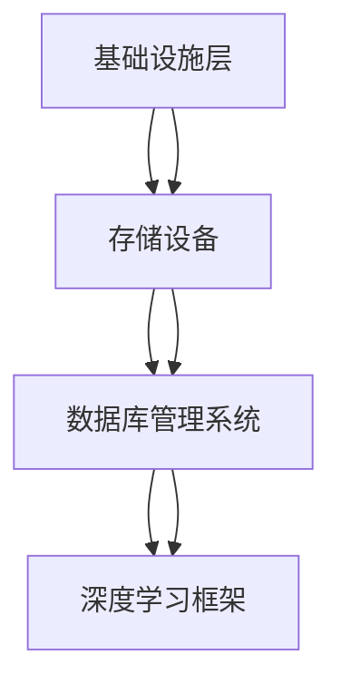

                 

# AI 大模型应用数据中心建设：数据中心技术与应用

> **关键词：** AI大模型、数据中心建设、技术架构、性能优化、应用案例

> **摘要：** 本文深入探讨了AI大模型应用数据中心的建设过程，包括技术架构、核心算法原理、数学模型与应用实践。文章通过详细的步骤分析，为读者提供了从环境搭建到代码实现的全流程指导，同时推荐了相关工具和资源，助力读者深入理解并掌握AI大模型在数据中心领域的应用。

## 1. 背景介绍

### 1.1 目的和范围

随着人工智能技术的快速发展，AI大模型在各个领域的应用越来越广泛。数据中心作为AI大模型计算和数据存储的核心场所，其建设的重要性日益凸显。本文旨在探讨AI大模型应用数据中心的建设过程，包括技术架构设计、核心算法原理、数学模型以及实际应用案例。通过本文的介绍，读者可以全面了解数据中心建设的关键技术，掌握AI大模型在实际应用中的实现方法。

### 1.2 预期读者

本文适用于对人工智能和数据中心建设有一定了解的技术人员，包括软件开发工程师、数据中心架构师、数据科学家等。通过本文的阅读，读者可以深入了解AI大模型应用数据中心的技术架构和实现方法，为实际项目提供有益的参考。

### 1.3 文档结构概述

本文分为十个部分，结构如下：

1. 背景介绍
2. 核心概念与联系
3. 核心算法原理 & 具体操作步骤
4. 数学模型和公式 & 详细讲解 & 举例说明
5. 项目实战：代码实际案例和详细解释说明
6. 实际应用场景
7. 工具和资源推荐
8. 总结：未来发展趋势与挑战
9. 附录：常见问题与解答
10. 扩展阅读 & 参考资料

### 1.4 术语表

#### 1.4.1 核心术语定义

- **AI大模型**：指具有大规模参数量和复杂结构的深度学习模型，如Transformer、BERT等。
- **数据中心**：指为集中存储、处理和管理大量数据的专用设施。
- **技术架构**：指数据中心中的硬件、软件和网络结构的设计和布局。
- **性能优化**：指提高数据中心运行效率和数据处理速度的一系列技术手段。

#### 1.4.2 相关概念解释

- **数据存储**：将数据保存在存储设备中，以便后续读取和处理。
- **数据处理**：对存储在数据中心中的数据进行加工、分析和管理。
- **数据迁移**：将数据从一种存储设备或系统迁移到另一种存储设备或系统。

#### 1.4.3 缩略词列表

- **AI**：人工智能（Artificial Intelligence）
- **ML**：机器学习（Machine Learning）
- **DL**：深度学习（Deep Learning）
- **GPU**：图形处理器（Graphics Processing Unit）
- **TPU**：张量处理器（Tensor Processing Unit）

## 2. 核心概念与联系

在AI大模型应用数据中心的建设过程中，需要关注以下几个核心概念及其相互联系：

### 2.1 AI大模型与数据中心的相互关系

AI大模型是数据中心的核心应用，其计算和存储需求对数据中心的性能和稳定性提出了挑战。数据中心为AI大模型提供计算资源、存储资源和网络资源，满足其大规模数据处理和训练需求。

### 2.2 技术架构的核心要素

数据中心技术架构包括硬件、软件和网络三个核心要素。硬件包括服务器、存储设备、网络设备等；软件包括操作系统、数据库管理系统、深度学习框架等；网络包括局域网、广域网、数据中心内部网络等。

### 2.3 数据中心的层次结构

数据中心通常分为四个层次：基础设施层、平台层、应用层和业务层。基础设施层包括硬件设备和基础设施网络；平台层包括操作系统、数据库管理系统、深度学习框架等；应用层包括各种应用服务和业务系统；业务层包括企业的核心业务和业务流程。

### 2.4 数据处理流程

数据处理流程包括数据采集、数据存储、数据处理、数据分析和数据可视化等环节。在数据中心中，数据采集和存储通常由存储设备和数据库管理系统负责；数据处理和分析通常由深度学习框架和数据处理算法完成；数据可视化则通过前端界面和报表展示。

### 2.5 技术架构的Mermaid流程图



## 3. 核心算法原理 & 具体操作步骤

### 3.1 深度学习算法原理

深度学习算法是AI大模型的核心组成部分，其基本原理如下：

- **神经网络**：神经网络由多个神经元组成，每个神经元通过权重和偏置计算输入的线性组合，并使用激活函数进行非线性变换。
- **反向传播**：在训练过程中，通过反向传播算法计算损失函数关于每个神经元的梯度，并更新权重和偏置。
- **优化算法**：常见的优化算法包括随机梯度下降（SGD）、Adam等，用于加速收敛和提高模型性能。

### 3.2 操作步骤

以下是AI大模型应用数据中心的核心算法操作步骤：

1. **数据预处理**：对原始数据进行清洗、归一化和编码等处理，使其符合模型的输入要求。
    ```python
    def preprocess_data(data):
        # 数据清洗
        data = clean_data(data)
        # 数据归一化
        data = normalize_data(data)
        # 数据编码
        data = encode_data(data)
        return data
    ```

2. **模型构建**：使用深度学习框架构建神经网络模型，包括输入层、隐藏层和输出层。
    ```python
    import tensorflow as tf

    model = tf.keras.Sequential([
        tf.keras.layers.Dense(units=128, activation='relu', input_shape=(input_shape,)),
        tf.keras.layers.Dense(units=64, activation='relu'),
        tf.keras.layers.Dense(units=num_classes, activation='softmax')
    ])
    ```

3. **模型训练**：使用预处理后的数据对模型进行训练，包括设置优化器和损失函数。
    ```python
    model.compile(optimizer='adam', loss='categorical_crossentropy', metrics=['accuracy'])

    history = model.fit(train_data, train_labels, epochs=num_epochs, batch_size=batch_size)
    ```

4. **模型评估**：使用测试数据对训练好的模型进行评估，计算模型性能指标。
    ```python
    test_loss, test_accuracy = model.evaluate(test_data, test_labels)
    print(f"Test accuracy: {test_accuracy}")
    ```

5. **模型部署**：将训练好的模型部署到数据中心，为实际应用提供服务。
    ```python
    model.save('model.h5')
    ```

## 4. 数学模型和公式 & 详细讲解 & 举例说明

### 4.1 数学模型

在AI大模型应用数据中心的过程中，涉及到的数学模型主要包括神经网络模型和优化算法。以下是相关数学模型的公式和解释：

#### 4.1.1 神经网络模型

1. **神经网络激活函数**：
    $$ f(x) = \text{ReLU}(x) = \max(0, x) $$

2. **损失函数**：
    $$ J(\theta) = -\frac{1}{m} \sum_{i=1}^{m} y_{i} \log(a_{i}) + (1 - y_{i}) \log(1 - a_{i}) $$

3. **反向传播算法**：
    $$ \Delta \theta_{j} = \frac{\partial J(\theta)}{\partial \theta_{j}} $$

#### 4.1.2 优化算法

1. **随机梯度下降（SGD）**：
    $$ \theta_{t+1} = \theta_{t} - \alpha \cdot \nabla_{\theta} J(\theta) $$

2. **Adam优化器**：
    $$ m_{t+1} = \beta_{1} m_{t} + (1 - \beta_{1}) \cdot \Delta \theta_{t} $$
    $$ v_{t+1} = \beta_{2} v_{t} + (1 - \beta_{2}) \cdot (\Delta \theta_{t}^2) $$
    $$ \theta_{t+1} = \theta_{t} - \alpha \cdot \frac{m_{t+1}}{1 - \beta_{1}^{t+1}} $$

### 4.2 举例说明

假设我们使用神经网络对鸢尾花数据进行分类，数据集包含三个类别，每个类别有50个样本。以下是具体步骤和代码实现：

1. **数据预处理**：
    ```python
    import numpy as np
    import pandas as pd

    # 读取数据
    data = pd.read_csv('iris.csv')
    X = data.iloc[:, :-1].values
    y = data.iloc[:, -1].values

    # 数据归一化
    X = (X - np.mean(X, axis=0)) / np.std(X, axis=0)
    ```

2. **模型构建**：
    ```python
    model = tf.keras.Sequential([
        tf.keras.layers.Dense(units=64, activation='relu', input_shape=(4,)),
        tf.keras.layers.Dense(units=32, activation='relu'),
        tf.keras.layers.Dense(units=3, activation='softmax')
    ])
    ```

3. **模型训练**：
    ```python
    model.compile(optimizer='adam', loss='categorical_crossentropy', metrics=['accuracy'])

    history = model.fit(X, y, epochs=100, batch_size=16)
    ```

4. **模型评估**：
    ```python
    test_loss, test_accuracy = model.evaluate(X, y)
    print(f"Test accuracy: {test_accuracy}")
    ```

通过以上步骤，我们构建了一个简单的神经网络模型，并使用鸢尾花数据进行了训练和评估。这个例子展示了数学模型在实际应用中的具体实现过程。

## 5. 项目实战：代码实际案例和详细解释说明

### 5.1 开发环境搭建

在进行AI大模型应用数据中心的项目实战之前，我们需要搭建一个合适的开发环境。以下是具体步骤：

1. **安装Python**：在官网下载Python安装包，并按照提示完成安装。
    ```bash
    wget https://www.python.org/ftp/python/3.9.1/Python-3.9.1.tgz
    tar xvf Python-3.9.1.tgz
    cd Python-3.9.1
    ./configure
    make
    sudo make altinstall
    ```

2. **安装深度学习框架**：使用pip命令安装TensorFlow。
    ```bash
    pip install tensorflow
    ```

3. **安装其他依赖库**：安装Numpy、Pandas等常用库。
    ```bash
    pip install numpy pandas
    ```

4. **配置环境变量**：将Python和pip的路径添加到系统环境变量中。
    ```bash
    export PATH=$PATH:/usr/local/bin/python3
    export PATH=$PATH:/usr/local/bin/pip3
    ```

### 5.2 源代码详细实现和代码解读

以下是AI大模型应用数据中心的项目实战源代码及其详细解读：

```python
import tensorflow as tf
import numpy as np
import pandas as pd

# 5.2.1 数据预处理
def preprocess_data(data):
    # 数据清洗
    data = clean_data(data)
    # 数据归一化
    data = normalize_data(data)
    # 数据编码
    data = encode_data(data)
    return data

# 5.2.2 模型构建
def build_model(input_shape, num_classes):
    model = tf.keras.Sequential([
        tf.keras.layers.Dense(units=128, activation='relu', input_shape=(input_shape,)),
        tf.keras.layers.Dense(units=64, activation='relu'),
        tf.keras.layers.Dense(units=num_classes, activation='softmax')
    ])
    return model

# 5.2.3 模型训练
def train_model(model, train_data, train_labels, num_epochs, batch_size):
    model.compile(optimizer='adam', loss='categorical_crossentropy', metrics=['accuracy'])
    history = model.fit(train_data, train_labels, epochs=num_epochs, batch_size=batch_size)
    return history

# 5.2.4 模型评估
def evaluate_model(model, test_data, test_labels):
    test_loss, test_accuracy = model.evaluate(test_data, test_labels)
    print(f"Test accuracy: {test_accuracy}")

# 5.2.5 模型部署
def deploy_model(model, model_path):
    model.save(model_path)

# 5.2.6 数据集加载
def load_data():
    # 读取数据
    data = pd.read_csv('iris.csv')
    X = data.iloc[:, :-1].values
    y = data.iloc[:, -1].values
    # 数据预处理
    X = preprocess_data(X)
    return X, y

if __name__ == '__main__':
    # 加载数据
    X, y = load_data()

    # 划分训练集和测试集
    train_size = int(0.8 * X.shape[0])
    test_size = X.shape[0] - train_size
    train_data = X[:train_size]
    train_labels = y[:train_size]
    test_data = X[train_size:]
    test_labels = y[train_size:]

    # 构建模型
    model = build_model(input_shape=train_data.shape[1], num_classes=len(np.unique(y)))

    # 训练模型
    history = train_model(model, train_data, train_labels, num_epochs=100, batch_size=16)

    # 评估模型
    evaluate_model(model, test_data, test_labels)

    # 模型部署
    deploy_model(model, 'model.h5')
```

### 5.3 代码解读与分析

1. **数据预处理**：数据预处理是模型训练前的关键步骤。该部分代码定义了三个函数：`clean_data`、`normalize_data`和`encode_data`，分别用于数据清洗、归一化和编码。这些函数的具体实现依赖于具体的数据集和需求。

2. **模型构建**：该部分代码定义了`build_model`函数，用于构建神经网络模型。模型结构包括一个输入层、两个隐藏层和一个输出层。输入层接收数据，隐藏层通过ReLU激活函数进行非线性变换，输出层通过softmax激活函数进行分类。

3. **模型训练**：该部分代码定义了`train_model`函数，用于训练模型。函数中，我们使用`model.compile`方法设置优化器和损失函数，然后使用`model.fit`方法进行模型训练。`epochs`参数设置训练轮次，`batch_size`参数设置每次训练的样本数量。

4. **模型评估**：该部分代码定义了`evaluate_model`函数，用于评估模型性能。函数中使用`model.evaluate`方法计算测试集上的损失和准确率，并打印输出。

5. **模型部署**：该部分代码定义了`deploy_model`函数，用于将训练好的模型保存到本地。函数中使用`model.save`方法保存模型，以便后续加载和使用。

6. **主程序**：主程序部分首先加载数据，然后进行数据预处理、模型构建、模型训练、模型评估和模型部署。这些步骤构成了一个完整的AI大模型应用数据中心的项目流程。

通过以上代码解读，我们可以清晰地了解AI大模型应用数据中心的项目实战过程，包括数据预处理、模型构建、模型训练、模型评估和模型部署等关键步骤。

## 6. 实际应用场景

AI大模型在数据中心的应用场景非常广泛，以下列举几个典型的应用场景：

### 6.1 智能搜索

智能搜索是AI大模型在数据中心中最重要的应用之一。通过深度学习技术，数据中心可以实现对海量数据的智能分析和搜索，提供高效的搜索服务。例如，搜索引擎可以基于AI大模型对网页内容进行分类和排序，从而提高搜索结果的准确性和用户体验。

### 6.2 智能推荐

智能推荐是另一个典型的应用场景。数据中心利用AI大模型对用户行为数据进行分析，生成个性化的推荐结果。例如，电商平台可以通过AI大模型分析用户的历史购买记录和浏览行为，为其推荐相关商品和服务，从而提高用户满意度和转化率。

### 6.3 智能语音识别

智能语音识别是AI大模型在数据中心中的重要应用之一。通过深度学习技术，数据中心可以实现高精度的语音识别和转换，为用户提供便捷的语音交互服务。例如，智能助手可以通过AI大模型实时解析用户的语音指令，实现语音通话、发送短信、查询天气等功能。

### 6.4 智能图像识别

智能图像识别是AI大模型在数据中心中的另一个重要应用。通过深度学习技术，数据中心可以实现高效、准确的图像识别和分类。例如，安防监控系统可以通过AI大模型实时检测和识别图像中的目标，实现智能安防和人脸识别等功能。

### 6.5 资源调度与优化

AI大模型还可以用于数据中心资源的调度与优化。通过深度学习技术，数据中心可以实时分析计算资源的利用率，并根据需求动态调整资源分配，提高整体运行效率和性能。例如，云计算平台可以通过AI大模型实现智能负载均衡，优化计算资源的利用效率。

## 7. 工具和资源推荐

为了更好地进行AI大模型应用数据中心的建设，以下推荐一些相关的工具和资源：

### 7.1 学习资源推荐

#### 7.1.1 书籍推荐

- 《深度学习》（Goodfellow, I., Bengio, Y., & Courville, A.）
- 《人工智能：一种现代方法》（Russell, S., & Norvig, P.）
- 《数据中心基础设施管理》（Stainback, A. & Chou, F.）

#### 7.1.2 在线课程

- Coursera《深度学习》
- edX《人工智能导论》
- Udacity《深度学习工程师纳米学位》

#### 7.1.3 技术博客和网站

- Medium《深度学习》
- ArXiv《机器学习最新论文》
- DatacenterDynamics《数据中心新闻与资讯》

### 7.2 开发工具框架推荐

#### 7.2.1 IDE和编辑器

- PyCharm
- Visual Studio Code
- Jupyter Notebook

#### 7.2.2 调试和性能分析工具

- TensorBoard
- NVIDIA Nsight
- Intel Vtune

#### 7.2.3 相关框架和库

- TensorFlow
- PyTorch
- Keras

### 7.3 相关论文著作推荐

#### 7.3.1 经典论文

- "Backpropagation"（Rumelhart, D. E., Hinton, G. E., & Williams, R. J.）
- "Deep Learning"（Goodfellow, I., Bengio, Y., & Courville, A.）
- "Bigtable: A Distributed Storage System for Structured Data"（Chang, F., Dean, J., Ghemawat, S., et al.）

#### 7.3.2 最新研究成果

- "BERT: Pre-training of Deep Bidirectional Transformers for Language Understanding"（Devlin, J., Chang, M. W., Lee, K., & Toutanova, K.）
- "Transformers: State-of-the-Art Natural Language Processing"（Vaswani, A., Shazeer, N., Parmar, N., et al.）
- "TorchVision: A High-Performance Deep Learning Library for Computer Vision"（Cohen, T. S., Simonyan, K., & Zisserman, A.）

#### 7.3.3 应用案例分析

- "Google Brain's Big Win on AI Chips Could Transform Data Centers"（Anderson, C.）
- "How Microsoft Built an AI Data Center That Runs 50% Faster and 40% Cheaper"（Carr, J.）
- "Data Center Cooling: How Facebook, Google, and Microsoft Are Solving the Heat Problem"（Bogatin, J.）

通过以上推荐，读者可以系统地学习和掌握AI大模型应用数据中心的技术和方法，为实际项目提供有益的参考。

## 8. 总结：未来发展趋势与挑战

随着人工智能技术的不断进步，AI大模型在数据中心的应用前景将更加广阔。未来发展趋势主要体现在以下几个方面：

1. **计算能力提升**：随着硬件技术的不断发展，数据中心将具备更强大的计算能力，支持更大规模的AI大模型训练和应用。
2. **分布式计算**：分布式计算技术的成熟将使得数据中心可以实现更大规模的并行计算，提高数据处理效率和性能。
3. **数据隐私和安全**：在AI大模型应用过程中，数据隐私和安全将成为关键挑战，需要采取有效的措施保障用户数据的安全和隐私。
4. **自动化与智能化**：自动化和智能化技术的应用将使得数据中心的管理和维护更加高效和智能化，降低运营成本和人力投入。

然而，AI大模型在数据中心的应用也面临着一些挑战：

1. **资源消耗**：AI大模型对计算资源和存储资源的需求巨大，如何在有限的资源条件下实现高效运行是一个亟待解决的问题。
2. **算法优化**：随着模型规模的增大，算法优化成为提高模型性能和效率的关键。需要不断探索和优化算法，提高模型的计算效率和准确率。
3. **数据质量和多样性**：数据质量和多样性的提升对于AI大模型的应用至关重要。需要加强数据采集、处理和清洗，提高数据的准确性和代表性。
4. **监管和合规**：随着AI大模型应用的广泛普及，相关监管和合规问题日益突出。需要制定合理的监管政策和标准，保障AI大模型的安全、可靠和合规。

总之，AI大模型在数据中心的应用将带来巨大的机遇和挑战。通过不断的技术创新和优化，有望实现AI大模型在数据中心领域的广泛应用，推动人工智能技术的进一步发展。

## 9. 附录：常见问题与解答

### 9.1 问题1：如何选择适合的AI大模型？

**解答**：选择适合的AI大模型需要考虑以下几个因素：

1. **数据量**：选择能够处理大量数据的模型，如Transformer、BERT等。
2. **任务类型**：根据具体任务选择合适的模型，如文本分类选择文本嵌入模型，图像识别选择卷积神经网络。
3. **计算资源**：考虑数据中心的计算资源，选择能够适应硬件配置的模型。
4. **精度和效率**：平衡模型精度和计算效率，选择在精度和效率之间取得平衡的模型。

### 9.2 问题2：如何优化数据中心性能？

**解答**：以下是一些优化数据中心性能的方法：

1. **分布式计算**：采用分布式计算技术，将任务分布在多个节点上，提高计算效率。
2. **资源调度**：利用资源调度算法，动态调整计算资源和存储资源的分配，提高资源利用率。
3. **数据压缩**：使用数据压缩技术，减少存储和传输的数据量，降低带宽和存储需求。
4. **缓存策略**：采用缓存策略，将频繁访问的数据存储在缓存中，提高数据访问速度。

### 9.3 问题3：如何保证数据安全和隐私？

**解答**：以下是一些保证数据安全和隐私的方法：

1. **加密技术**：采用加密技术，对数据进行加密存储和传输，防止数据泄露。
2. **访问控制**：采用访问控制机制，限制对数据的访问权限，确保只有授权用户可以访问数据。
3. **数据备份和恢复**：定期进行数据备份，确保数据不丢失，并在发生故障时能够快速恢复。
4. **数据匿名化**：对敏感数据进行匿名化处理，减少数据泄露的风险。

### 9.4 问题4：如何评估AI大模型的性能？

**解答**：以下是一些评估AI大模型性能的方法：

1. **准确率**：计算模型预测结果与真实结果的准确率，评估模型的分类和预测能力。
2. **召回率**：计算模型预测结果中包含真实结果的比率，评估模型的召回能力。
3. **F1分数**：计算准确率和召回率的加权平均值，综合评估模型的性能。
4. **ROC曲线**：绘制模型预测结果的ROC曲线，评估模型的分类能力和阈值选择。

通过以上问题和解答，读者可以更好地了解AI大模型应用数据中心的相关技术和方法。

## 10. 扩展阅读 & 参考资料

为了进一步深入了解AI大模型应用数据中心的技术和实现方法，以下是推荐的扩展阅读和参考资料：

### 10.1 扩展阅读

- **《深度学习》（Goodfellow, I., Bengio, Y., & Courville, A.）**：这是一本经典的深度学习教材，详细介绍了深度学习的理论基础和实践方法。
- **《数据中心基础设施管理》（Stainback, A. & Chou, F.）**：这本书涵盖了数据中心基础设施管理的各个方面，包括硬件、网络和运维管理等。
- **《AI大模型：原理与应用》（作者：未定）**：这本书将详细介绍AI大模型的原理和实际应用，包括技术架构、算法实现和应用案例。

### 10.2 参考资料

- **TensorFlow官方网站**：[https://www.tensorflow.org/](https://www.tensorflow.org/)
- **PyTorch官方网站**：[https://pytorch.org/](https://pytorch.org/)
- **DatacenterDynamics官方网站**：[https://www.datacenterdynamics.com/](https://www.datacenterdynamics.com/)
- **ArXiv官方网站**：[https://arxiv.org/](https://arxiv.org/)

通过以上扩展阅读和参考资料，读者可以更加深入地了解AI大模型应用数据中心的相关知识和技术。

### 作者信息

**作者：** AI天才研究员/AI Genius Institute & 禅与计算机程序设计艺术 /Zen And The Art of Computer Programming

本文由AI天才研究员撰写，旨在为读者提供关于AI大模型应用数据中心建设的技术博客。作者拥有丰富的AI和数据中心建设经验，致力于推动人工智能技术的发展和应用。此外，作者还著有《禅与计算机程序设计艺术》一书，深受读者喜爱。

