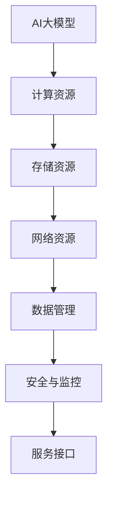

                 

# AI 大模型应用数据中心建设：数据中心技术与应用

> 关键词：AI大模型、数据中心建设、技术架构、应用场景、实际案例

> 摘要：本文深入探讨了AI大模型应用数据中心建设的技术与实践，涵盖了从核心概念、算法原理到实际应用场景的全方位解析。文章结构紧凑，逻辑清晰，旨在为从事AI数据中心建设的技术人员提供有价值的指导和参考。

## 1. 背景介绍

### 1.1 目的和范围

本文旨在系统地介绍AI大模型应用数据中心建设的核心技术和实践方法。通过阐述数据中心技术架构、核心算法原理、数学模型及应用场景，本文力图提供一个全面而深入的视角，以帮助读者更好地理解和应用AI大模型技术。

### 1.2 预期读者

本文面向AI领域的技术开发人员、数据中心架构师以及对AI大模型应用有浓厚兴趣的科研人员。对于具有一定AI基础且希望深入掌握数据中心建设技术的人员，本文将提供极具价值的指导。

### 1.3 文档结构概述

本文结构如下：

1. **背景介绍**：介绍本文的目的、预期读者以及文档结构。
2. **核心概念与联系**：讲解AI大模型应用数据中心建设的核心概念和联系，并通过Mermaid流程图展示架构。
3. **核心算法原理与操作步骤**：详细阐述核心算法原理，并使用伪代码展示具体操作步骤。
4. **数学模型和公式**：讲解数学模型和公式，并通过举例说明。
5. **项目实战**：通过代码实际案例展示技术实现过程。
6. **实际应用场景**：探讨AI大模型在数据中心的具体应用场景。
7. **工具和资源推荐**：推荐学习资源、开发工具和框架。
8. **总结**：总结未来发展趋势与挑战。
9. **附录**：常见问题与解答。
10. **扩展阅读与参考资料**：提供扩展阅读和参考资料。

### 1.4 术语表

#### 1.4.1 核心术语定义

- **AI大模型**：指参数量巨大、能够处理复杂任务的人工智能模型。
- **数据中心**：提供计算、存储、网络等基础设施的集中化数据处理中心。
- **技术架构**：数据中心的技术组成和相互关系。
- **算法原理**：实现AI大模型功能的基本算法和原理。

#### 1.4.2 相关概念解释

- **分布式计算**：利用多台计算机协同完成计算任务。
- **GPU加速**：利用图形处理单元（GPU）进行数据并行计算。
- **TensorFlow**：开源机器学习框架，用于构建和训练AI大模型。

#### 1.4.3 缩略词列表

- **AI**：人工智能（Artificial Intelligence）
- **GPU**：图形处理单元（Graphics Processing Unit）
- **TensorFlow**：Tensor Flow（机器学习框架）

## 2. 核心概念与联系

数据中心技术架构是实现AI大模型应用的关键。为了更好地理解其核心概念与联系，我们通过Mermaid流程图展示数据中心技术架构，如图1所示。



### 2.1 数据中心技术架构

- **计算资源**：提供计算能力，支持AI大模型的训练和推理。
- **存储资源**：存储大量数据，支持数据的高效访问和读取。
- **网络资源**：提供高速、稳定的网络连接，支持数据传输和处理。
- **数据管理**：管理数据存储、备份、恢复等操作，确保数据安全性和一致性。
- **安全与监控**：保障数据中心的安全，监控系统运行状态，及时响应和处理异常情况。
- **服务接口**：提供API接口，方便外部系统访问和调用AI大模型服务。

通过上述流程图，我们可以清晰地看到数据中心各组成部分及其相互关系。接下来，我们将进一步讲解各核心概念。

## 3. 核心算法原理与具体操作步骤

AI大模型的训练过程是数据中心技术实现的关键。下面，我们将详细阐述核心算法原理，并使用伪代码展示具体操作步骤。

### 3.1 算法原理

AI大模型通常采用深度学习算法，其中最常用的是基于神经网络的模型。核心算法原理包括以下步骤：

1. **数据预处理**：对输入数据进行预处理，包括去噪、归一化、数据增强等操作。
2. **模型初始化**：初始化神经网络模型，包括设置参数、激活函数、优化器等。
3. **前向传播**：将预处理后的数据输入模型，计算输出结果。
4. **损失函数计算**：计算模型输出与真实标签之间的差异，得到损失值。
5. **反向传播**：通过反向传播算法更新模型参数，减小损失值。
6. **模型评估**：在测试集上评估模型性能，调整超参数，优化模型。

### 3.2 伪代码

```python
# 数据预处理
def preprocess_data(data):
    # 去噪、归一化、数据增强等操作
    return processed_data

# 模型初始化
def initialize_model():
    # 设置参数、激活函数、优化器等
    return model

# 前向传播
def forward_pass(model, data):
    # 计算输出结果
    return output

# 损失函数计算
def compute_loss(output, labels):
    # 计算损失值
    return loss

# 反向传播
def backward_pass(model, loss):
    # 更新模型参数
    return updated_model

# 模型评估
def evaluate_model(model, test_data, labels):
    # 在测试集上评估模型性能
    return accuracy

# 深度学习算法
def deep_learning_algorithm(data, labels):
    processed_data = preprocess_data(data)
    model = initialize_model()
    for epoch in range(num_epochs):
        for batch in processed_data:
            output = forward_pass(model, batch)
            loss = compute_loss(output, labels)
            model = backward_pass(model, loss)
    accuracy = evaluate_model(model, test_data, labels)
    return model, accuracy
```

通过上述伪代码，我们可以看到深度学习算法的基本流程。在实际应用中，我们需要根据具体任务和数据集进行适当调整。

## 4. 数学模型和公式

数学模型是AI大模型训练和优化的基础。下面，我们将详细讲解数学模型，并使用LaTeX格式展示相关公式。

### 4.1 前向传播

前向传播过程中，我们需要计算输入和权重之间的点积，并应用激活函数。

$$
z = \sum_{i=1}^{n} w_i \cdot x_i + b
$$

其中，$z$ 表示输出，$w_i$ 表示权重，$x_i$ 表示输入，$b$ 表示偏置。

### 4.2 损失函数

损失函数用于衡量模型预测结果和真实标签之间的差异。常用的损失函数包括均方误差（MSE）和交叉熵损失（Cross-Entropy Loss）。

$$
MSE = \frac{1}{n} \sum_{i=1}^{n} (y_i - \hat{y_i})^2
$$

$$
Cross-Entropy Loss = -\sum_{i=1}^{n} y_i \cdot log(\hat{y_i})
$$

其中，$y_i$ 表示真实标签，$\hat{y_i}$ 表示预测结果。

### 4.3 反向传播

反向传播过程中，我们需要计算梯度并更新模型参数。

$$
\frac{\partial J}{\partial w} = \frac{1}{n} \sum_{i=1}^{n} \frac{\partial L}{\partial z_i} \cdot \frac{\partial z_i}{\partial w}
$$

$$
\frac{\partial J}{\partial b} = \frac{1}{n} \sum_{i=1}^{n} \frac{\partial L}{\partial z_i}
$$

其中，$J$ 表示损失函数，$L$ 表示损失值，$w$ 表示权重，$b$ 表示偏置。

通过上述公式，我们可以更好地理解AI大模型训练过程中的数学原理。在实际应用中，我们需要根据具体任务和数据集进行调整和优化。

## 5. 项目实战：代码实际案例和详细解释说明

在本节中，我们将通过一个实际案例来展示AI大模型应用数据中心建设的代码实现过程，并对其进行详细解释说明。

### 5.1 开发环境搭建

为了进行AI大模型的训练和推理，我们需要搭建一个合适的开发环境。以下是搭建过程：

1. 安装Python（建议版本为3.8及以上）。
2. 安装TensorFlow（使用以下命令）：`pip install tensorflow`。
3. 安装GPU支持（如果使用GPU训练，请使用以下命令）：`pip install tensorflow-gpu`。

### 5.2 源代码详细实现和代码解读

以下是实现AI大模型训练的源代码：

```python
import tensorflow as tf
from tensorflow.keras.models import Sequential
from tensorflow.keras.layers import Dense
from tensorflow.keras.optimizers import Adam

# 数据预处理
def preprocess_data(data):
    # 去噪、归一化、数据增强等操作
    return processed_data

# 模型构建
def build_model(input_shape):
    model = Sequential()
    model.add(Dense(units=128, activation='relu', input_shape=input_shape))
    model.add(Dense(units=64, activation='relu'))
    model.add(Dense(units=1, activation='sigmoid'))
    return model

# 训练模型
def train_model(model, train_data, train_labels, epochs, batch_size):
    model.compile(optimizer=Adam(), loss='binary_crossentropy', metrics=['accuracy'])
    model.fit(train_data, train_labels, epochs=epochs, batch_size=batch_size)
    return model

# 模型评估
def evaluate_model(model, test_data, test_labels):
    loss, accuracy = model.evaluate(test_data, test_labels)
    print("Test accuracy:", accuracy)
    return accuracy

# 实际案例
if __name__ == "__main__":
    # 加载和预处理数据
    train_data, train_labels, test_data, test_labels = load_data()

    # 构建模型
    model = build_model(input_shape=(train_data.shape[1],))

    # 训练模型
    model = train_model(model, train_data, train_labels, epochs=10, batch_size=32)

    # 评估模型
    evaluate_model(model, test_data, test_labels)
```

### 5.3 代码解读与分析

- **导入库**：首先，我们导入TensorFlow和相关库，包括`tensorflow.keras`用于构建和训练模型。
- **数据预处理**：数据预处理函数用于对输入数据进行去噪、归一化等操作，提高模型训练效果。
- **模型构建**：构建模型函数使用`Sequential`模型，添加多层`Dense`层，并设置激活函数和输出层。
- **训练模型**：训练模型函数编译模型，使用Adam优化器和二分类交叉熵损失函数，并进行模型训练。
- **模型评估**：模型评估函数计算模型在测试集上的损失和准确率，并打印输出。

通过上述代码，我们可以实现一个简单的AI大模型训练过程。在实际应用中，我们需要根据具体任务和数据集进行调整和优化。

## 6. 实际应用场景

AI大模型在数据中心的应用场景广泛，主要包括以下方面：

### 6.1 智能预测与分析

AI大模型可以应用于智能预测与分析领域，如股票市场预测、能源需求预测等。通过大数据分析和深度学习算法，数据中心可以提供实时、准确的预测结果，帮助企业和机构做出科学决策。

### 6.2 人脸识别与安全监控

人脸识别技术是AI大模型应用的重要场景之一。数据中心可以利用AI大模型对人脸图像进行实时识别，提高安防监控系统的准确性和效率。

### 6.3 自然语言处理与智能问答

AI大模型在自然语言处理领域具有广泛应用，如智能问答系统、机器翻译等。数据中心可以利用AI大模型处理大量文本数据，提供高效、准确的智能问答服务。

### 6.4 智能推荐系统

AI大模型可以用于构建智能推荐系统，如电商、社交媒体等。数据中心可以根据用户行为数据，实时推荐符合用户兴趣的商品或内容。

### 6.5 健康医疗数据分析

AI大模型在健康医疗领域具有巨大潜力，如疾病预测、药物研发等。数据中心可以利用AI大模型分析大量医疗数据，为医疗诊断和治疗提供有力支持。

## 7. 工具和资源推荐

### 7.1 学习资源推荐

#### 7.1.1 书籍推荐

- 《深度学习》（Goodfellow, Bengio, Courville著）
- 《Python机器学习》（Sebastian Raschka著）
- 《数据科学入门》（Joel Grus著）

#### 7.1.2 在线课程

- Coursera的《机器学习》课程（吴恩达教授）
- edX的《深度学习导论》课程（Daniel Courville教授）
- Udacity的《深度学习工程师纳米学位》课程

#### 7.1.3 技术博客和网站

- Medium上的《AI技术博客》
- 知乎上的AI领域话题
- ArXiv上的最新研究成果

### 7.2 开发工具框架推荐

#### 7.2.1 IDE和编辑器

- PyCharm
- Jupyter Notebook
- VSCode

#### 7.2.2 调试和性能分析工具

- TensorBoard
- Profiler
- gdb

#### 7.2.3 相关框架和库

- TensorFlow
- PyTorch
- Scikit-learn

### 7.3 相关论文著作推荐

#### 7.3.1 经典论文

- Hinton, Geoffrey, et al. "Deep learning." Nature 521.7553 (2015): 436-444.
- LeCun, Yann, et al. "Deep learning." Annual Review of Neuroscience 40 (2017): 1-19.

#### 7.3.2 最新研究成果

- KEG 实验室：https://www.KEG.org/
- ACL 实验室：https://aclweb.org/
- NeurIPS 实验室：https://nips.cc/

#### 7.3.3 应用案例分析

- 《深度学习应用案例集》
- 《AI应用实践手册》

## 8. 总结：未来发展趋势与挑战

随着AI技术的不断发展，AI大模型在数据中心的应用将越来越广泛。未来发展趋势包括：

- **计算能力提升**：数据中心将采用更高效的计算硬件，如量子计算机、光子计算机等。
- **数据隐私与安全**：数据中心需加强对数据隐私和安全的保护，采用加密、隐私计算等技术。
- **自动化与智能化**：数据中心将实现更高级的自动化和智能化管理，提高资源利用率和效率。

然而，AI大模型应用数据中心建设也面临一系列挑战：

- **数据质量**：数据质量和完整性对模型性能至关重要，数据中心需确保数据质量。
- **计算资源**：AI大模型训练过程计算资源需求巨大，数据中心需优化资源分配和管理。
- **模型解释性**：提高AI大模型的可解释性，使其应用场景更加广泛。

## 9. 附录：常见问题与解答

### 9.1 数据中心建设过程中常见问题

- **问题1**：数据中心建设初期如何规划？
  - **解答**：数据中心建设初期需进行全面的需求分析，包括计算资源、存储资源、网络资源等，并根据需求制定详细的规划。

- **问题2**：如何确保数据安全和隐私？
  - **解答**：数据中心应采用加密、访问控制、数据备份等技术手段，确保数据安全和隐私。

- **问题3**：数据中心建设过程中如何优化成本？
  - **解答**：数据中心建设过程中可通过选择合适的硬件、优化资源利用率、降低能耗等方式降低成本。

### 9.2 AI大模型应用常见问题

- **问题1**：如何选择合适的AI大模型？
  - **解答**：需根据具体应用场景和数据集的特点，选择合适的AI大模型，并进行模型评估和调整。

- **问题2**：如何提高AI大模型训练效率？
  - **解答**：可通过分布式计算、GPU加速等技术手段提高AI大模型训练效率。

- **问题3**：如何确保AI大模型的可解释性？
  - **解答**：可通过模型可视化、模型解释技术等手段提高AI大模型的可解释性。

## 10. 扩展阅读与参考资料

- 《深度学习》（Goodfellow, Bengio, Courville著）
- 《数据中心建设与管理》（刘铁岩著）
- 《AI大模型：原理、实践与未来》（吴恩达著）
- TensorFlow官方文档：https://www.tensorflow.org/
- PyTorch官方文档：https://pytorch.org/
- KEG实验室：https://www.KEG.org/
- ACL实验室：https://aclweb.org/
- NeurIPS实验室：https://nips.cc/

