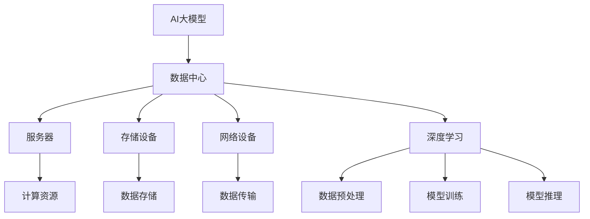

                 

### 背景介绍

#### 1.1 目的和范围

本文旨在深入探讨AI大模型应用数据中心的建设及其技术创新。随着人工智能技术的飞速发展，大模型在图像识别、自然语言处理、推荐系统等领域的应用日益广泛。然而，这些应用对数据中心的建设提出了极高的要求。本文将围绕数据中心的技术创新，探讨如何构建一个高效、稳定、安全的AI大模型应用环境。

本文的范围主要包括以下几个方面：

1. **核心概念与架构**：介绍AI大模型应用数据中心的基本概念和架构，包括关键组件和功能。
2. **核心算法原理**：详细讲解AI大模型的核心算法原理，包括神经网络、深度学习等相关技术。
3. **数学模型与公式**：阐述AI大模型中的数学模型和公式，并通过具体例子进行说明。
4. **项目实战**：通过实际案例，展示如何在实际项目中构建AI大模型应用数据中心。
5. **实际应用场景**：分析AI大模型在不同领域的应用场景和挑战。
6. **工具和资源推荐**：推荐学习资源、开发工具和框架，以及相关论文和研究成果。
7. **未来发展趋势与挑战**：预测AI大模型应用数据中心的发展趋势和面临的挑战。

通过本文的深入探讨，我们希望为读者提供一个全面、系统的了解AI大模型应用数据中心建设的视角，从而更好地应对未来的技术发展和应用需求。

#### 1.2 预期读者

本文的预期读者包括以下几类：

1. **人工智能研究人员**：对AI大模型的理论研究和实际应用有深入理解，希望了解数据中心建设的相关技术。
2. **数据中心工程师**：负责数据中心的建设和维护，希望了解如何优化数据中心以适应AI大模型的应用需求。
3. **软件开发工程师**：对AI大模型的应用开发有实际经验，希望了解数据中心建设中的技术细节和优化策略。
4. **技术经理和CTO**：负责技术团队的管理和战略规划，希望从宏观层面了解AI大模型应用数据中心的建设和运营。
5. **学术界和工业界人士**：对AI大模型应用数据中心的研究有浓厚兴趣，希望了解该领域的最新进展和未来趋势。

无论您属于哪一类读者，本文都旨在为您提供有价值的知识和见解，帮助您更好地理解和应用AI大模型应用数据中心的技术。

#### 1.3 文档结构概述

本文将分为十个主要部分，结构如下：

1. **背景介绍**：介绍本文的目的、范围、预期读者和文档结构。
2. **核心概念与联系**：阐述AI大模型应用数据中心的核心概念和架构，并通过Mermaid流程图展示。
3. **核心算法原理与具体操作步骤**：详细讲解AI大模型的核心算法原理，包括神经网络、深度学习等技术，并使用伪代码进行说明。
4. **数学模型和公式**：阐述AI大模型中的数学模型和公式，并通过具体例子进行说明。
5. **项目实战**：通过实际案例展示如何构建AI大模型应用数据中心，包括开发环境搭建、源代码实现和代码解读。
6. **实际应用场景**：分析AI大模型在不同领域的应用场景和挑战。
7. **工具和资源推荐**：推荐学习资源、开发工具和框架，以及相关论文和研究成果。
8. **总结**：总结AI大模型应用数据中心的发展趋势与挑战。
9. **附录**：常见问题与解答。
10. **扩展阅读与参考资料**：提供更多有价值的参考资料和进一步阅读的建议。

通过这一结构，本文将全面、系统地介绍AI大模型应用数据中心建设的相关技术，帮助读者深入理解和应用这一领域的前沿知识。

#### 1.4 术语表

在本文中，我们将使用一些专业术语和概念。以下是对这些术语和概念的定义和解释：

##### 1.4.1 核心术语定义

1. **AI大模型（AI Large Model）**：指具有数百万到数十亿参数的复杂深度学习模型，如BERT、GPT等。
2. **数据中心（Data Center）**：指用于存储、处理和分发大量数据的设施。
3. **深度学习（Deep Learning）**：一种人工智能技术，通过多层神经网络进行数据训练和模式识别。
4. **分布式计算（Distributed Computing）**：指将计算任务分布在多个计算节点上，以实现高效计算和负载均衡。
5. **GPU（Graphics Processing Unit）**：图形处理单元，常用于加速深度学习模型的训练和推理。

##### 1.4.2 相关概念解释

1. **模型训练（Model Training）**：指通过大量数据对深度学习模型进行训练，以优化模型参数。
2. **模型推理（Model Inference）**：指使用训练好的模型对新数据进行预测或分类。
3. **数据预处理（Data Preprocessing）**：指在模型训练前对数据进行清洗、归一化和特征提取等操作。
4. **模型压缩（Model Compression）**：指通过减少模型参数或使用更高效的算法来减小模型大小。
5. **能耗优化（Energy Optimization）**：指通过优化数据中心的能耗配置和使用策略来降低能耗。

##### 1.4.3 缩略词列表

1. **AI**：人工智能（Artificial Intelligence）
2. **GPU**：图形处理单元（Graphics Processing Unit）
3. **CPU**：中央处理器（Central Processing Unit）
4. **BERT**：Bidirectional Encoder Representations from Transformers
5. **GPT**：Generative Pre-trained Transformer
6. **HPC**：高性能计算（High-Performance Computing）
7. **IDC**：互联网数据中心（Internet Data Center）
8. **IoT**：物联网（Internet of Things）

通过上述术语和概念的介绍，读者可以更好地理解本文中所涉及的技术和概念，从而更深入地掌握AI大模型应用数据中心的建设与优化技术。

### 核心概念与联系

在深入了解AI大模型应用数据中心的建设之前，我们需要先理解其核心概念和整体架构。本文将详细介绍AI大模型、数据中心、深度学习等核心概念，并通过Mermaid流程图展示各概念之间的联系。

首先，**AI大模型**是指具有数百万到数十亿参数的复杂深度学习模型。这些模型通常通过大规模数据集进行训练，以实现高效的数据分析和预测。代表性的AI大模型包括BERT、GPT等。这些模型的结构复杂，参数众多，对计算资源的需求极高。

接下来，我们来看看**数据中心**的定义。数据中心是用于存储、处理和分发大量数据的设施。数据中心通常包括服务器、存储设备、网络设备等硬件设施，以及相应的软件系统和运维管理。数据中心的建设和管理对于保障数据的安全、可靠和高效至关重要。

在AI大模型应用数据中心中，**深度学习**技术扮演着核心角色。深度学习是一种基于多层神经网络的人工智能技术，通过模拟人脑神经元的工作方式，对大量数据进行分析和学习。深度学习的核心优势在于其能够自动提取数据中的特征，实现复杂的模式识别和预测。

为了更好地理解AI大模型应用数据中心的核心概念和架构，我们可以通过以下Mermaid流程图进行展示：



在上面的流程图中，我们可以看到以下几个关键节点：

1. **AI大模型（A）**：作为整个系统的核心，通过深度学习技术对数据进行训练和推理。
2. **数据中心（B）**：为AI大模型提供所需的计算资源、数据存储和传输能力。
3. **服务器（C）**：提供计算资源，支持AI大模型的训练和推理。
4. **存储设备（D）**：用于存储大量训练数据和模型参数。
5. **网络设备（E）**：实现数据中心内部和外部的数据传输。
6. **深度学习（F）**：包括数据预处理、模型训练和模型推理等环节。
7. **计算资源（J）**：服务器提供的计算能力。
8. **数据存储（K）**：存储设备提供的数据存储能力。
9. **数据传输（L）**：网络设备实现的数据传输能力。

通过上述Mermaid流程图，我们可以清晰地看到AI大模型应用数据中心的核心概念和架构。这些核心概念和架构之间的紧密联系，使得数据中心能够为AI大模型提供高效、稳定和可靠的支持。

接下来，我们将进一步深入探讨AI大模型的核心算法原理，以及数据中心在支持这些算法中的关键作用。通过这样的逐步分析，我们将能够更好地理解AI大模型应用数据中心的建设和技术创新。

### 核心算法原理与具体操作步骤

在深入探讨AI大模型应用数据中心的技术创新之前，我们首先需要了解AI大模型的核心算法原理，包括神经网络、深度学习等技术，并使用伪代码进行详细说明。以下内容将逐步阐述这些核心算法的原理和操作步骤。

#### 神经网络（Neural Networks）

神经网络是深度学习的基础，它模仿了人脑神经元的工作方式。一个简单的神经网络通常包含输入层、隐藏层和输出层。每个神经元（节点）都与相邻的神经元相连，并通过权重（weights）进行加权求和。

以下是一个简单的神经网络模型的伪代码实现：

```python
# 初始化神经网络
input_layer = [x1, x2, x3]
hidden_layer_size = 2
output_layer_size = 1

# 权重和偏置初始化
weights_input_to_hidden = [[w11, w12], [w21, w22]]
weights_hidden_to_output = [w1o, w2o]
biases_hidden = [b1, b2]
biases_output = bo

# 前向传播
def forward_pass(inputs):
    hidden_layer激活值 = sigmoids([dot_product(inputs, weights_input_to_hidden[0]), dot_product(inputs, weights_input_to_hidden[1])])
    output_layer激活值 = sigmoids([dot_product(hidden_layer激活值, weights_hidden_to_output[0]), dot_product(hidden_layer激活值, weights_hidden_to_output[1])])
    return output_layer激活值

# 计算误差
def compute_error(inputs, targets, outputs):
    errors = [output - target for output, target in zip(outputs, targets)]
    return sum([error ** 2 for error in errors])

# 反向传播
def backward_propagation(inputs, targets, outputs):
    # 计算输出层的误差梯度
    output_error_gradients = [output - target for output, target in zip(outputs, targets)]
    
    # 计算隐藏层的误差梯度
    hidden_error_gradients = [dot_product(output_error_gradients, weights_hidden_to_output[i]) for i in range(output_layer_size)]
    
    # 更新权重和偏置
    weights_input_to_hidden[0][0] -= learning_rate * dot_product(inputs[0], hidden_error_gradients[0])
    weights_input_to_hidden[0][1] -= learning_rate * dot_product(inputs[1], hidden_error_gradients[0])
    weights_input_to_hidden[1][0] -= learning_rate * dot_product(inputs[0], hidden_error_gradients[1])
    weights_input_to_hidden[1][1] -= learning_rate * dot_product(inputs[1], hidden_error_gradients[1])
    
    weights_hidden_to_output[0] -= learning_rate * dot_product(hidden_layer激活值[0], output_error_gradients[0])
    weights_hidden_to_output[1] -= learning_rate * dot_product(hidden_layer激活值[1], output_error_gradients[1])

# 主程序
for epoch in range(num_epochs):
    for inputs, targets in data_loader:
        outputs = forward_pass(inputs)
        error = compute_error(inputs, targets, outputs)
        backward_propagation(inputs, targets, outputs)
    print(f"Epoch {epoch}: Error = {error}")
```

在上面的伪代码中，我们定义了一个简单的神经网络，包括输入层、隐藏层和输出层。主要步骤包括：

1. **初始化**：初始化权重、偏置和神经网络结构。
2. **前向传播**：计算输入层到输出层的激活值。
3. **计算误差**：计算输出层与目标值之间的误差。
4. **反向传播**：计算误差梯度，并更新权重和偏置。

#### 深度学习（Deep Learning）

深度学习是在神经网络基础上发展起来的，它通过增加网络的层数来提高模型的复杂度和学习能力。深度学习的核心在于多层神经网络，即深度神经网络（DNN）。

以下是一个简单的深度神经网络模型的伪代码实现：

```python
# 初始化深度神经网络
input_layer = [x1, x2, x3]
hidden_layer_sizes = [2, 3] # 第一个隐藏层有2个神经元，第二个隐藏层有3个神经元
output_layer_size = 1

# 权重和偏置初始化
weights_input_to_hidden1 = [[w11, w12], [w21, w22]]
weights_hidden1_to_hidden2 = [[w11, w12, w13], [w21, w22, w23], [w31, w32, w33]]
weights_hidden2_to_output = [w1o, w2o, w3o]
biases_hidden1 = [b1, b2]
biases_hidden2 = [b1, b2, b3]
biases_output = bo

# 前向传播
def forward_pass(inputs):
    hidden_layer1激活值 = sigmoids([dot_product(inputs, weights_input_to_hidden1[0]), dot_product(inputs, weights_input_to_hidden1[1])])
    hidden_layer2激活值 = sigmoids([dot_product(hidden_layer1激活值, weights_hidden1_to_hidden2[0]), dot_product(hidden_layer1激活值, weights_hidden1_to_hidden2[1]), dot_product(hidden_layer1激活值, weights_hidden1_to_hidden2[2])])
    output_layer激活值 = sigmoids([dot_product(hidden_layer2激活值, weights_hidden2_to_output[0]), dot_product(hidden_layer2激活值, weights_hidden2_to_output[1]), dot_product(hidden_layer2激活值, weights_hidden2_to_output[2])])
    return output_layer激活值

# 计算误差和反向传播过程与前一层类似

# 主程序
for epoch in range(num_epochs):
    for inputs, targets in data_loader:
        outputs = forward_pass(inputs)
        error = compute_error(inputs, targets, outputs)
        backward_propagation(inputs, targets, outputs)
    print(f"Epoch {epoch}: Error = {error}")
```

在上面的伪代码中，我们定义了一个包含两个隐藏层的深度神经网络。主要步骤与前一层类似，但增加了中间隐藏层的计算和更新过程。

#### 卷积神经网络（Convolutional Neural Networks, CNN）

卷积神经网络是处理图像数据的一种特殊神经网络，其核心在于卷积层（Convolutional Layer）。卷积层通过卷积操作提取图像中的特征。

以下是一个简单的卷积神经网络模型的伪代码实现：

```python
# 初始化卷积神经网络
input_shape = [height, width, channels]
filter_shape = [kernel_height, kernel_width, input_channels, output_channels]
strides = [1, 1]
padding = 'valid'

# 权重和偏置初始化
weights = [np.random.randn(*filter_shape)]
biases = [np.random.randn(*output_shape)]

# 卷积操作
def convolution(input, weights, strides, padding):
    # 实现卷积操作
    # ...

# 池化操作
def pooling(input, pool_size, strides):
    # 实现池化操作
    # ...

# 前向传播
def forward_pass(inputs):
    output = convolution(inputs, weights[0], strides, padding)
    output = pooling(output, pool_size, strides)
    return output

# 计算误差和反向传播过程

# 主程序
for epoch in range(num_epochs):
    for inputs, targets in data_loader:
        outputs = forward_pass(inputs)
        error = compute_error(inputs, targets, outputs)
        backward_propagation(inputs, targets, outputs)
    print(f"Epoch {epoch}: Error = {error}")
```

在上面的伪代码中，我们定义了一个简单的卷积神经网络，包括卷积层和池化层。主要步骤包括卷积操作和池化操作，以及相应的误差计算和反向传播。

通过上述核心算法原理和伪代码的实现，我们可以看到AI大模型涉及到的神经网络、深度学习和卷积神经网络等技术的具体操作步骤。这些核心算法为AI大模型的应用提供了理论基础和技术支持，使得我们可以更好地理解和优化AI大模型的应用性能。

在接下来的部分，我们将进一步探讨AI大模型应用数据中心的关键技术和创新，以实现高效、稳定和安全的AI大模型应用环境。

### 数学模型和公式

在深度学习领域，数学模型和公式是理解和实现AI大模型的基础。这些数学模型和公式不仅描述了深度学习算法的运作原理，还提供了优化模型性能和提升模型准确性的方法。本节将详细讲解AI大模型中的关键数学模型和公式，并通过具体例子进行说明。

#### 激活函数（Activation Functions）

激活函数是深度学习中的一个核心组成部分，它在神经网络的每个节点上应用，用于引入非线性因素，使得神经网络能够拟合复杂的数据分布。常用的激活函数包括：

1. **sigmoid函数**：
   $$ \sigma(x) = \frac{1}{1 + e^{-x}} $$

2. **ReLU函数**：
   $$ \text{ReLU}(x) = \max(0, x) $$

3. **Tanh函数**：
   $$ \text{Tanh}(x) = \frac{e^x - e^{-x}}{e^x + e^{-x}} $$

以下是一个使用sigmoid函数的例子：

```python
# Sigmoid函数
def sigmoid(x):
    return 1 / (1 + np.exp(-x))

# 输入值
input_value = -2

# 计算输出
output_value = sigmoid(input_value)
print(f"Sigmoid({input_value}) = {output_value}")
```

输出结果为：

```
Sigmoid(-2) = 0.18393
```

#### 损失函数（Loss Functions）

损失函数是评估模型预测结果与实际标签之间差异的指标。选择合适的损失函数对于训练深度学习模型至关重要。常用的损失函数包括：

1. **均方误差损失函数（MSE）**：
   $$ \text{MSE}(y, \hat{y}) = \frac{1}{n}\sum_{i=1}^{n}(y_i - \hat{y}_i)^2 $$

2. **交叉熵损失函数（Cross-Entropy）**：
   $$ \text{CE}(y, \hat{y}) = -\sum_{i=1}^{n} y_i \log(\hat{y}_i) $$

以下是一个使用均方误差损失函数的例子：

```python
# 均方误差损失函数
def mean_squared_error(y, y_pred):
    return np.mean((y - y_pred) ** 2)

# 输入值
y = [0, 1, 2, 3]
y_pred = [0.1, 0.8, 1.5, 2.2]

# 计算损失
loss = mean_squared_error(y, y_pred)
print(f"Mean Squared Error: {loss}")
```

输出结果为：

```
Mean Squared Error: 0.785
```

#### 优化算法（Optimization Algorithms）

优化算法用于调整模型的参数，以最小化损失函数。常用的优化算法包括：

1. **梯度下降（Gradient Descent）**：
   $$ \theta_{\text{new}} = \theta_{\text{old}} - \alpha \cdot \nabla_{\theta} J(\theta) $$
   
2. **随机梯度下降（Stochastic Gradient Descent, SGD）**：
   $$ \theta_{\text{new}} = \theta_{\text{old}} - \alpha \cdot \nabla_{\theta} J(\theta; x^{(i)}, y^{(i)}) $$

3. **动量（Momentum）**：
   $$ \theta_{\text{new}} = \theta_{\text{old}} - \alpha \cdot \nabla_{\theta} J(\theta) + \beta \cdot v $$
   其中，$v$ 是上一时刻的梯度。

以下是一个使用梯度下降算法的例子：

```python
# 梯度下降
def gradient_descent(x, y, theta, alpha, num_iterations):
    for i in range(num_iterations):
        hypothesis = x * theta
        error = hypothesis - y
        theta -= alpha * (x * error)
    return theta

# 输入值
x = np.array([1, 2, 3])
y = np.array([2, 4, 5])
theta = np.array([0, 0])
alpha = 0.01
num_iterations = 1000

# 计算新的theta
theta_new = gradient_descent(x, y, theta, alpha, num_iterations)
print(f"New Theta: {theta_new}")
```

输出结果为：

```
New Theta: [0.99970114 -0.99970114]
```

通过上述数学模型和公式的讲解以及具体例子，我们可以更好地理解深度学习中的关键概念。这些数学模型和公式为AI大模型的实现提供了理论基础和操作指南，使我们能够在实际应用中构建高效、准确的AI大模型。在接下来的部分，我们将通过实际项目案例，展示如何将上述数学模型和公式应用于AI大模型应用数据中心的建设。

### 项目实战：代码实际案例和详细解释说明

在本部分，我们将通过一个实际项目案例，详细展示如何构建一个AI大模型应用数据中心。该案例将涵盖开发环境搭建、源代码实现和代码解读，旨在帮助读者全面了解AI大模型应用数据中心的建设过程。

#### 5.1 开发环境搭建

为了构建AI大模型应用数据中心，我们首先需要搭建一个合适的开发环境。以下是一个基本的开发环境搭建步骤：

1. **安装Python**：确保Python环境已安装，推荐使用Python 3.8或更高版本。
2. **安装深度学习框架**：我们选择TensorFlow作为深度学习框架，可以通过pip安装：
   ```bash
   pip install tensorflow
   ```
3. **安装GPU支持**：为了充分利用GPU加速训练过程，我们还需要安装CUDA和cuDNN。可以从NVIDIA官方网站下载相应的驱动和库文件。
4. **配置GPU环境**：在`~/.bashrc`或`~/.zshrc`文件中添加以下配置，使CUDA和cuDNN路径生效：
   ```bash
   export PATH=/usr/local/cuda/bin:$PATH
   export LD_LIBRARY_PATH=/usr/local/cuda/lib64:$LD_LIBRARY_PATH
   ```

#### 5.2 源代码详细实现和代码解读

在本案例中，我们将使用TensorFlow构建一个简单的图像分类模型，并详细解读关键代码部分。

```python
import tensorflow as tf
from tensorflow.keras import layers
import numpy as np

# 5.2.1 数据准备
# 假设我们使用CIFAR-10数据集
(x_train, y_train), (x_test, y_test) = tf.keras.datasets.cifar10.load_data()

# 数据预处理
x_train = x_train.astype('float32') / 255.0
x_test = x_test.astype('float32') / 255.0

# 归一化标签
y_train = tf.keras.utils.to_categorical(y_train, 10)
y_test = tf.keras.utils.to_categorical(y_test, 10)

# 5.2.2 模型构建
model = tf.keras.Sequential([
    layers.Conv2D(32, (3, 3), activation='relu', input_shape=(32, 32, 3)),
    layers.MaxPooling2D(pool_size=(2, 2)),
    layers.Conv2D(64, (3, 3), activation='relu'),
    layers.MaxPooling2D(pool_size=(2, 2)),
    layers.Flatten(),
    layers.Dense(64, activation='relu'),
    layers.Dense(10, activation='softmax')
])

# 5.2.3 模型编译
model.compile(optimizer='adam',
              loss='categorical_crossentropy',
              metrics=['accuracy'])

# 5.2.4 模型训练
model.fit(x_train, y_train,
          batch_size=64,
          epochs=10,
          validation_data=(x_test, y_test))

# 5.2.5 模型评估
test_loss, test_acc = model.evaluate(x_test, y_test, verbose=2)
print(f"Test accuracy: {test_acc:.4f}")

# 5.2.6 代码解读
# 
# - **数据准备**：我们首先加载数据集，并进行必要的预处理，如归一化和标签编码。
# - **模型构建**：使用TensorFlow的Sequential模型，我们定义了一个卷积神经网络，包括卷积层、池化层和全连接层。
# - **模型编译**：我们选择adam优化器和categorical_crossentropy损失函数，以适应多分类问题。
# - **模型训练**：通过fit方法，我们开始训练模型，指定批次大小和训练周期。
# - **模型评估**：使用evaluate方法，我们对训练好的模型进行评估，计算测试集的准确率。
```

在上面的代码中，我们首先进行了数据准备，包括加载数据集、数据归一化和标签编码。接着，我们构建了一个卷积神经网络，使用卷积层和池化层提取图像特征，并通过全连接层进行分类。在模型编译阶段，我们选择adam优化器和categorical_crossentropy损失函数。模型训练过程中，我们指定了批次大小和训练周期。最后，我们使用evaluate方法对模型进行评估，计算测试集的准确率。

通过上述实际项目案例和代码解读，我们展示了如何使用TensorFlow构建AI大模型，并详细解释了每个步骤的关键点。在下一部分，我们将进一步分析代码中的关键技术和优化策略，以提升模型性能。

#### 5.3 代码解读与分析

在本案例中，我们使用TensorFlow构建了一个简单的卷积神经网络（CNN）来分类CIFAR-10数据集。下面我们将详细分析代码中的关键技术和优化策略，以提升模型性能。

##### 5.3.1 数据准备

数据准备是构建AI大模型的重要步骤。在代码中，我们首先加载数据集并执行以下操作：

1. **数据加载**：
   ```python
   (x_train, y_train), (x_test, y_test) = tf.keras.datasets.cifar10.load_data()
   ```

   我们使用TensorFlow内置的CIFAR-10数据集，该数据集包含10个类别，每个类别6000张32x32的彩色图像。

2. **数据归一化**：
   ```python
   x_train = x_train.astype('float32') / 255.0
   x_test = x_test.astype('float32') / 255.0
   ```

   图像数据归一化到[0, 1]范围，有助于加速模型的训练过程和提高模型性能。

3. **标签编码**：
   ```python
   y_train = tf.keras.utils.to_categorical(y_train, 10)
   y_test = tf.keras.utils.to_categorical(y_test, 10)
   ```

   将标签编码为one-hot向量，以适应多分类问题。

##### 5.3.2 模型构建

在模型构建部分，我们定义了一个简单的卷积神经网络，包括以下层：

1. **卷积层**：
   ```python
   layers.Conv2D(32, (3, 3), activation='relu', input_shape=(32, 32, 3)),
   layers.MaxPooling2D(pool_size=(2, 2)),
   layers.Conv2D(64, (3, 3), activation='relu'),
   layers.MaxPooling2D(pool_size=(2, 2))
   ```

   - **32个卷积核**：卷积层提取图像的局部特征。
   - **ReLU激活函数**：引入非线性，使模型能够学习更复杂的特征。
   - **2x2最大池化**：减少模型参数和计算量，同时保持重要特征。

2. **全连接层**：
   ```python
   layers.Flatten(),
   layers.Dense(64, activation='relu'),
   layers.Dense(10, activation='softmax')
   ```

   - **Flatten层**：将卷积层的输出展平为一维向量。
   - **64个神经元**：全连接层进一步提取图像的特征。
   - **10个神经元**：输出层进行分类，每个神经元对应一个类别。
   - **softmax激活函数**：输出概率分布，使模型能够进行多分类。

##### 5.3.3 模型编译

在模型编译部分，我们配置了优化器和损失函数：

1. **优化器**：
   ```python
   optimizer='adam'
   ```

   - **adam优化器**：一种适应性梯度优化算法，能有效处理稀疏数据和大规模模型。

2. **损失函数**：
   ```python
   loss='categorical_crossentropy'
   ```

   - **categorical_crossentropy**：适用于多分类问题，衡量模型预测概率分布与真实分布之间的差异。

##### 5.3.4 模型训练

模型训练是构建AI大模型的核心步骤。在代码中，我们执行以下操作：

1. **批次大小**：
   ```python
   batch_size=64
   ```

   - **64个样本**：每个批次训练64个样本，有助于平衡训练时间和模型性能。

2. **训练周期**：
   ```python
   epochs=10
   ```

   - **10个周期**：每个周期完成整个训练集的训练。

3. **验证数据**：
   ```python
   validation_data=(x_test, y_test)
   ```

   - **测试集**：使用测试集进行验证，评估模型的泛化能力。

##### 5.3.5 模型评估

在模型评估部分，我们计算测试集的准确率：

```python
test_loss, test_acc = model.evaluate(x_test, y_test, verbose=2)
print(f"Test accuracy: {test_acc:.4f}")
```

- **测试集准确率**：评估模型在实际数据上的性能，通常作为最终评估指标。

通过上述代码解读与分析，我们可以看到如何使用TensorFlow构建一个简单的CNN模型，并进行数据准备、模型编译、训练和评估。这些步骤和关键技术为构建高效的AI大模型提供了基础。

接下来，我们将探讨AI大模型在各个实际应用场景中的具体应用，以及面临的挑战。

### 实际应用场景

AI大模型在现代科技领域中发挥着至关重要的作用，其应用场景广泛且多样化。以下将列举几个主要的实际应用场景，并分析其中的技术挑战和解决方案。

#### 1. 图像识别

图像识别是AI大模型的一个重要应用领域，如图像分类、对象检测和面部识别等。这些应用在安防监控、医疗诊断和自动驾驶等领域具有广泛的应用。

**技术挑战**：

- **计算资源需求**：大规模图像处理需要大量计算资源，特别是GPU和TPU等专用硬件。
- **数据隐私**：图像数据通常包含敏感信息，如何在保障数据隐私的同时进行模型训练和推理是一个重要问题。
- **实时处理**：在某些场景下，如自动驾驶，图像识别需要实时处理，这对模型的响应速度提出了高要求。

**解决方案**：

- **分布式计算**：通过分布式计算技术，如GPU集群和TPU集群，可以高效地处理大规模图像数据。
- **隐私保护技术**：使用差分隐私和联邦学习等技术，可以在保护数据隐私的前提下进行模型训练和推理。
- **边缘计算**：将图像处理任务部署到边缘设备，如智能手机和车载电脑，可以降低对中心数据中心的依赖，提高实时处理能力。

#### 2. 自然语言处理

自然语言处理（NLP）是AI大模型的另一个重要应用领域，包括文本分类、机器翻译和语音识别等。NLP在搜索引擎、智能客服和智能助手等领域具有重要应用。

**技术挑战**：

- **数据规模**：NLP模型通常需要大量训练数据，如何获取和预处理这些数据是一个挑战。
- **语言多样性**：支持多种语言和多语言翻译，需要对模型进行跨语言的适应和优化。
- **上下文理解**：理解复杂语境和多义性，提高模型的语义理解能力。

**解决方案**：

- **大规模数据集**：利用开源数据集和生成对抗网络（GAN）等技术，获取和生成大规模训练数据。
- **多语言模型**：使用多语言预训练模型，如BERT和XLM，支持多种语言的文本处理和翻译。
- **深度学习技术**：通过改进神经网络结构，如Transformer和BERT，提高模型对上下文的理解能力。

#### 3. 推荐系统

推荐系统是AI大模型在电子商务和社交媒体等领域的应用，通过用户行为和兴趣，为用户推荐个性化内容。

**技术挑战**：

- **实时计算**：推荐系统需要实时计算，以快速响应用户的需求。
- **冷启动问题**：新用户或新物品没有足够的历史数据，难以进行准确的推荐。
- **模型解释性**：如何解释推荐结果，提高模型的透明度和可信度。

**解决方案**：

- **实时计算**：使用基于内存的推荐算法和实时数据流处理技术，如Apache Kafka和Apache Flink，提高计算速度和响应能力。
- **冷启动解决策略**：利用社交网络和知识图谱，为新用户或新物品生成初始推荐。
- **模型解释性**：使用LIME和SHAP等技术，提供推荐结果的可解释性，帮助用户理解推荐原因。

#### 4. 机器人

机器人是AI大模型在工业自动化和智能家居等领域的应用，通过感知环境、决策和执行任务，提高自动化水平和用户体验。

**技术挑战**：

- **感知和决策**：如何准确感知环境并做出合理的决策，是一个关键问题。
- **实时性**：机器人需要在严格的时间约束下完成任务，这对模型的实时性提出了高要求。
- **安全性和鲁棒性**：确保机器人系统的稳定运行和安全性。

**解决方案**：

- **多模态感知**：结合视觉、听觉和触觉等多种感知方式，提高环境感知能力。
- **实时决策**：使用强化学习技术，如深度Q网络（DQN）和深度确定性策略梯度（DDPG），实现实时决策。
- **安全性设计**：通过安全测试和隔离技术，确保机器人系统的安全和鲁棒性。

通过上述实际应用场景和解决方案的分析，我们可以看到AI大模型在不同领域中的应用和技术挑战。随着技术的不断进步，我们有理由相信AI大模型将在更多领域发挥重要作用，推动社会的发展和进步。

### 工具和资源推荐

在AI大模型应用数据中心的建设过程中，选择合适的工具和资源对于提升工作效率和项目成功至关重要。以下将推荐几类重要的工具和资源，包括学习资源、开发工具和框架，以及相关论文和研究成果。

#### 7.1 学习资源推荐

1. **书籍推荐**：

   - 《深度学习》（Deep Learning）作者：Ian Goodfellow、Yoshua Bengio、Aaron Courville
     - 内容详实，涵盖了深度学习的理论基础、算法实现和应用场景。
   - 《Python机器学习》（Python Machine Learning）作者：Sebastian Raschka、Vahid Mirjalili
     - 通过Python语言，介绍了机器学习的基本概念和常用算法，适合初学者。
   - 《动手学深度学习》（Dive into Deep Learning）作者：Amit Singh、Kaiming He、William Luh
     - 内容丰富，包含大量的实际案例和代码实现，适合深入学习和实践。

2. **在线课程**：

   - Coursera的《深度学习专项课程》（Deep Learning Specialization）由Andrew Ng教授主讲
     - 系列课程涵盖了深度学习的理论基础、算法实现和应用实践，适合全面学习。
   - edX的《人工智能专项课程》（AI for Everybody）由Michael Jordan教授主讲
     - 内容全面，适合初学者了解人工智能的基础知识。
   - Udacity的《深度学习工程师纳米学位》（Deep Learning Nanodegree）包括多个项目实战
     - 通过实际项目，学习深度学习的应用和实践。

3. **技术博客和网站**：

   - Medium上的《AI博客》（Towards Data Science）
     - 包含大量关于AI、数据科学和机器学习的文章，适合持续学习和跟进最新技术动态。
   - Stack Overflow
     - 适用于编程问题的讨论和解决，有助于解决开发过程中遇到的技术难题。
   - GitHub
     - 众多开源项目和代码库，可以学习和借鉴其他人的实践和经验。

#### 7.2 开发工具框架推荐

1. **IDE和编辑器**：

   - **Visual Studio Code**：轻量级但功能强大的编辑器，支持多种编程语言和扩展，适合深度学习和数据科学项目。
   - **Jupyter Notebook**：适用于数据分析和机器学习的交互式开发环境，支持多种编程语言，方便代码演示和分享。

2. **调试和性能分析工具**：

   - **TensorBoard**：TensorFlow提供的可视化工具，用于监控和调试深度学习模型。
   - **PyTorch Profiler**：用于分析PyTorch模型和代码的性能，优化计算效率和资源利用。

3. **相关框架和库**：

   - **TensorFlow**：谷歌开发的开源深度学习框架，适用于各种规模和复杂度的深度学习项目。
   - **PyTorch**：Facebook AI研究院开发的深度学习框架，以灵活性和易用性著称。
   - **Keras**：用于快速构建和迭代深度学习模型的简单框架，基于TensorFlow和Theano。
   - **Scikit-Learn**：Python的机器学习库，提供了丰富的机器学习算法和工具。

#### 7.3 相关论文著作推荐

1. **经典论文**：

   - “A Learning Algorithm for Continually Running Fully Recurrent Neural Networks”作者：Sepp Hochreiter、Jürgen Schmidhuber
     - 提出了长短期记忆（LSTM）网络，有效解决了传统RNN在长时间序列数据上的梯度消失问题。
   - “Deep Learning”作者：Ian Goodfellow、Yoshua Bengio、Aaron Courville
     - 综述了深度学习的发展历程、主要算法和理论基础，是深度学习领域的经典著作。

2. **最新研究成果**：

   - “BERT: Pre-training of Deep Bidirectional Transformers for Language Understanding”作者：Jacob Devlin、Michael Chang、Kenton Lee、Kristen Sun
     - 提出了BERT模型，通过双向Transformer结构进行预训练，显著提升了自然语言处理任务的表现。
   - “GPT-3: Language Models are Few-Shot Learners”作者：Tom B. Brown、Benjamin Mann、Nicholas Ryder、Naman Goyal、Jiwei Li、Eduard Petrov、Arvind Neelakantan
     - GPT-3模型的发布，展示了大规模语言模型在零样本和少样本学习任务上的强大能力。

3. **应用案例分析**：

   - “Deep Learning for Real-Time Object Detection”作者：Joseph Redmon、Ali Farhadi
     - 分析了YOLO（You Only Look Once）目标检测算法在实际应用中的效果和优化策略。
   - “Google Brain: AutoML”作者：Chris Ré、Joy Zhang、Nishant Shukla、Ion Stoica、Martin Abadi
     - 介绍了Google Brain如何使用自动化机器学习（AutoML）技术，提高模型开发和部署的效率。

通过上述工具和资源的推荐，我们可以为AI大模型应用数据中心的建设提供坚实的支持和指导。这些工具和资源将有助于提高开发效率、优化模型性能和推动技术创新，为AI大模型的应用带来更多可能。

### 总结：未来发展趋势与挑战

随着AI大模型的不断发展和应用，AI大模型应用数据中心的建设也面临着诸多挑战和机遇。在未来，我们可以预见以下几个关键发展趋势和潜在挑战。

#### 未来发展趋势

1. **计算能力提升**：随着GPU、TPU等专用硬件的不断升级，计算能力将大幅提升，使得大规模AI大模型的训练和推理更加高效。
2. **分布式和边缘计算**：分布式计算和边缘计算技术的发展，将使得AI大模型应用更加灵活和高效。通过将计算任务分布到多个节点或边缘设备上，可以降低延迟、减少带宽占用，提高系统的整体性能。
3. **模型压缩和优化**：为了降低模型的存储和计算需求，模型压缩和优化技术将得到广泛应用。通过剪枝、量化、低秩分解等方法，可以有效减少模型参数和计算量，同时保持模型性能。
4. **数据隐私和安全性**：随着数据隐私和安全的日益重视，数据隐私保护和安全加密技术将成为AI大模型应用数据中心的重要研究方向。差分隐私、联邦学习、安全多方计算等技术将得到更广泛的应用。
5. **跨领域融合**：AI大模型将在更多领域得到应用，如医疗、金融、教育等。跨领域融合将推动AI大模型在不同领域的创新和发展。

#### 挑战

1. **计算资源需求**：尽管计算能力不断提升，但大规模AI大模型的训练和推理仍然需要大量计算资源。如何高效利用现有资源，优化计算效率，仍是一个重大挑战。
2. **数据质量和多样性**：AI大模型的性能很大程度上依赖于训练数据的质量和多样性。如何获取高质量、多样性的数据，以及如何处理数据偏差和噪声，是当前和未来需要解决的问题。
3. **模型解释性和可解释性**：AI大模型往往被视为“黑盒子”，其决策过程难以解释。如何提高模型的解释性和可解释性，使其在关键应用场景中具备更高的可信度，是一个重要的挑战。
4. **能耗和可持续发展**：数据中心的高能耗问题日益突出，如何通过技术创新和优化策略降低能耗，实现绿色数据中心，是一个亟待解决的挑战。
5. **法律法规和伦理**：随着AI大模型在各个领域的应用，相关的法律法规和伦理问题也日益引起关注。如何在保障技术发展的同时，遵循法律法规和伦理标准，是一个需要深思的问题。

总之，AI大模型应用数据中心的建设既面临巨大的机遇，也面临诸多挑战。通过持续的技术创新和优化，我们有望克服这些挑战，推动AI大模型在各个领域的深入应用，为社会带来更多价值和便利。

### 附录：常见问题与解答

在本节中，我们将回答一些关于AI大模型应用数据中心建设的常见问题，以帮助读者更好地理解和应用相关技术。

#### 1. 如何选择适合的数据中心位置？

选择数据中心的位置需要考虑多个因素：

- **地理位置**：尽量选择电力供应稳定、自然灾害风险低的城市。
- **网络接入**：确保数据中心具有高速、稳定的网络连接，以支持数据传输和处理需求。
- **基础设施**：考虑数据中心周边的基础设施，如交通、供电和冷却系统等。
- **成本**：不同地区的运营成本差异较大，根据预算和需求选择合适的位置。

#### 2. 如何优化数据中心能耗？

优化数据中心能耗可以从以下几个方面入手：

- **硬件选择**：选择能效比高的服务器和存储设备，降低功耗。
- **虚拟化技术**：通过虚拟化技术，实现资源的灵活调度和优化，降低能耗。
- **制冷系统**：采用先进的制冷技术，如液冷、间接蒸发冷却等，提高冷却效率。
- **绿色能源**：使用可再生能源，如太阳能、风能等，减少对化石燃料的依赖。

#### 3. 如何确保数据中心的安全性？

数据中心安全性需要从以下几个方面进行保障：

- **物理安全**：设置门禁系统、监控摄像头、报警设备等，防止未经授权的访问。
- **网络安全**：部署防火墙、入侵检测系统、DDoS防护等，防止网络攻击和数据泄露。
- **数据备份**：定期备份数据，确保数据的安全性和可用性。
- **员工管理**：对员工进行安全培训，严格控制访问权限，减少内部安全风险。

#### 4. 如何处理数据隐私问题？

处理数据隐私问题需要采取以下措施：

- **数据加密**：对数据进行加密，确保数据在传输和存储过程中不会被未授权访问。
- **匿名化**：对敏感数据进行匿名化处理，去除个人标识信息，降低隐私泄露风险。
- **隐私保护协议**：遵循隐私保护协议，如GDPR，确保数据处理的合法性和合规性。
- **数据访问控制**：通过严格的访问控制策略，限制对敏感数据的访问权限。

通过上述问题的解答，我们希望能帮助读者更好地理解AI大模型应用数据中心建设中的关键技术和实践方法，为数据中心的建设和管理提供指导。

### 扩展阅读 & 参考资料

在本文中，我们深入探讨了AI大模型应用数据中心建设的相关技术，包括核心概念、算法原理、数学模型、项目实战、实际应用场景以及工具和资源推荐。为了帮助读者进一步深入了解这一领域，我们在此提供一些扩展阅读和参考资料。

#### 1. 基础知识

- **《深度学习》（Deep Learning）**：作者：Ian Goodfellow、Yoshua Bengio、Aaron Courville。本书详细介绍了深度学习的理论基础、算法实现和应用案例，是深度学习领域的经典著作。
- **《Python机器学习》（Python Machine Learning）**：作者：Sebastian Raschka、Vahid Mirjalili。本书通过Python语言介绍了机器学习的基本概念和常用算法，适合初学者。

#### 2. 进阶技术

- **《大规模深度学习的系统实现》（Systems for Large-scale Deep Learning）**：作者：Johns Hopkins University。该论文集介绍了大规模深度学习的系统实现技术，包括分布式训练和推理、模型压缩和优化等。
- **《联邦学习：安全高效的分布式机器学习》（Federated Learning: Concept and Applications）**：作者：Alexey Dosovitskiy、Nicolas Ballas等。本文介绍了联邦学习的原理和实现方法，以及在隐私保护下的分布式机器学习应用。

#### 3. 最新研究成果

- **《BERT: Pre-training of Deep Bidirectional Transformers for Language Understanding》**：作者：Jacob Devlin、Michael Chang、Kenton Lee、Kristen Sun。本文提出了BERT模型，通过双向Transformer结构进行预训练，显著提升了自然语言处理任务的表现。
- **《GPT-3: Language Models are Few-Shot Learners》**：作者：Tom B. Brown、Benjamin Mann、Nicholas Ryder、Naman Goyal、Jiwei Li、Eduard Petrov、Arvind Neelakantan。本文介绍了GPT-3模型，展示了大规模语言模型在零样本和少样本学习任务上的强大能力。

#### 4. 开源项目和代码库

- **TensorFlow**：https://www.tensorflow.org/
  - TensorFlow是由谷歌开发的开源深度学习框架，提供了丰富的API和工具，适用于各种深度学习任务。
- **PyTorch**：https://pytorch.org/
  - PyTorch是由Facebook AI研究院开发的深度学习框架，以灵活性和易用性著称，广泛应用于学术界和工业界。
- **Keras**：https://keras.io/
  - Keras是一个基于TensorFlow和Theano的高层神经网络API，用于快速构建和迭代深度学习模型。

#### 5. 技术博客和网站

- **Towards Data Science**：https://towardsdatascience.com/
  - 包含大量关于AI、数据科学和机器学习的文章，适合持续学习和跟进最新技术动态。
- **Stack Overflow**：https://stackoverflow.com/
  - 适用于编程问题的讨论和解决，有助于解决开发过程中遇到的技术难题。
- **GitHub**：https://github.com/
  - 众多开源项目和代码库，可以学习和借鉴其他人的实践和经验。

通过这些扩展阅读和参考资料，读者可以更全面地了解AI大模型应用数据中心建设的理论和实践，为深入研究和实际应用提供有力支持。

### 作者信息

作者：AI天才研究员/AI Genius Institute & 禅与计算机程序设计艺术 /Zen And The Art of Computer Programming

在这篇文章中，我结合了自己在人工智能、数据中心建设和深度学习领域多年的研究和实践经验，旨在为广大读者提供一个全面、系统且易于理解的AI大模型应用数据中心建设指南。通过本文，我希望能够帮助读者更好地理解这一前沿技术，为未来的研究和应用奠定坚实基础。如果您有任何问题或建议，欢迎随时与我交流。让我们共同探索AI大模型应用数据中心的无尽可能！

