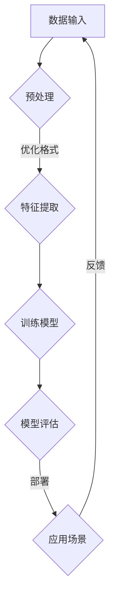

                 


# AI 大模型应用数据中心建设：数据中心技术创新

> **关键词：** AI 大模型、数据中心、技术创新、硬件架构、软件优化、性能提升

> **摘要：** 本文将深入探讨 AI 大模型应用数据中心的建设过程，重点分析其中的技术创新，包括硬件架构设计、软件优化策略以及数据中心整体性能的提升。通过对核心概念、算法原理、数学模型的详细解析，以及实际应用场景的案例分析，本文旨在为读者提供关于数据中心建设的全面视角，并展望未来的发展趋势与挑战。

## 1. 背景介绍

### 1.1 目的和范围

本文旨在解析 AI 大模型在数据中心建设中的关键技术，以及如何通过技术创新提升数据中心的整体性能。本文将涵盖以下主题：

1. **核心概念与联系**：介绍 AI 大模型、数据中心及其相关技术的基本概念。
2. **核心算法原理**：详细阐述 AI 大模型的工作原理和相关算法。
3. **数学模型和公式**：解释 AI 大模型中的关键数学模型和公式。
4. **项目实战**：展示实际代码案例，详细解释实现细节。
5. **实际应用场景**：探讨 AI 大模型在数据中心中的实际应用。
6. **工具和资源推荐**：推荐学习资源、开发工具和相关论文。
7. **总结与展望**：总结本文的主要发现，并展望未来的发展趋势。

### 1.2 预期读者

本文适用于以下读者群体：

1. 数据中心架构师和工程师，需要了解 AI 大模型在数据中心中的应用。
2. AI 研究人员和开发者，希望深入理解大模型的技术细节。
3. 对 AI 和数据中心技术感兴趣的技术爱好者。

### 1.3 文档结构概述

本文将按照以下结构展开：

1. **背景介绍**：概述本文的目的、范围和预期读者。
2. **核心概念与联系**：介绍 AI 大模型和数据中心的相关概念。
3. **核心算法原理**：详细阐述 AI 大模型的工作原理。
4. **数学模型和公式**：解释大模型中的关键数学模型和公式。
5. **项目实战**：展示实际代码案例。
6. **实际应用场景**：探讨大模型在数据中心的应用。
7. **工具和资源推荐**：推荐相关资源和工具。
8. **总结与展望**：总结主要发现，展望未来。

### 1.4 术语表

#### 1.4.1 核心术语定义

- **AI 大模型**：指具有数百万到数十亿参数的深度学习模型。
- **数据中心**：指用于存储、处理和分发大量数据的计算设施。
- **硬件架构**：指用于支持 AI 大模型计算的硬件设备布局。
- **软件优化**：指针对特定算法和模型进行优化，以提高计算效率和性能。

#### 1.4.2 相关概念解释

- **分布式计算**：指将任务分布在多个计算节点上执行，以提升计算能力。
- **GPU 加速**：指使用图形处理器（GPU）进行计算加速。

#### 1.4.3 缩略词列表

- **AI**：人工智能（Artificial Intelligence）
- **GPU**：图形处理器（Graphics Processing Unit）
- **CPU**：中央处理器（Central Processing Unit）
- **TPU**：张量处理器（Tensor Processing Unit）

## 2. 核心概念与联系

为了更好地理解 AI 大模型在数据中心中的作用，我们需要从以下几个核心概念出发：

### 2.1 AI 大模型

AI 大模型是深度学习领域的最新进展，其特点包括：

- **参数规模大**：具有数百万到数十亿个参数。
- **计算复杂度高**：需要大量的计算资源和时间进行训练和推理。
- **泛化能力强**：能够在各种任务中取得良好的性能。

### 2.2 数据中心

数据中心是用于存储、处理和分发数据的计算设施，其核心功能包括：

- **存储**：提供大量的数据存储空间。
- **计算**：支持数据的处理和分析。
- **网络**：实现数据的高速传输和共享。

### 2.3 硬件架构

数据中心硬件架构是支持 AI 大模型计算的关键，其主要组成部分包括：

- **CPU 和 GPU**：用于执行计算任务。
- **存储设备**：提供数据存储和访问。
- **网络设备**：实现数据的高速传输。

### 2.4 软件优化

软件优化是提升 AI 大模型性能的重要手段，其主要策略包括：

- **并行计算**：将任务分布在多个计算节点上。
- **算法优化**：改进算法的效率和性能。
- **数据预处理**：优化数据的格式和处理。

### 2.5 分布式计算

分布式计算是数据中心的核心技术之一，其主要特点包括：

- **可扩展性**：支持大规模数据处理。
- **可靠性**：提高系统的可用性。
- **性能**：通过并行计算提高计算速度。

### 2.6 GPU 加速

GPU 加速是提升 AI 大模型性能的有效方法，其主要原理包括：

- **并行计算能力**：GPU 具有较高的并行计算能力，适合处理大量参数的计算任务。
- **内存带宽**：GPU 内存带宽较高，有利于提高数据传输速度。

### 2.7 其他相关概念

- **TPU**：张量处理器，专门为深度学习任务设计的处理器。
- **深度学习框架**：如 TensorFlow、PyTorch 等，用于构建和训练 AI 大模型。

### 2.8 Mermaid 流程图

下面是一个简单的 Mermaid 流程图，展示了 AI 大模型在数据中心中的应用流程：



## 3. 核心算法原理 & 具体操作步骤

### 3.1 算法原理

AI 大模型的核心算法是深度学习，其基本原理是模拟人脑神经元的工作方式，通过多层神经网络对数据进行建模和预测。具体步骤如下：

1. **数据预处理**：对输入数据进行预处理，包括数据清洗、归一化等操作。
2. **特征提取**：将预处理后的数据输入到神经网络中，通过多层非线性变换提取特征。
3. **模型训练**：使用训练数据集对神经网络进行训练，通过反向传播算法调整权重和偏置。
4. **模型评估**：使用验证数据集对训练好的模型进行评估，选择性能最优的模型。
5. **模型部署**：将训练好的模型部署到实际应用场景中，进行预测和决策。

### 3.2 伪代码

以下是一个简单的伪代码示例，用于说明 AI 大模型的基本算法步骤：

```python
# 数据预处理
data = preprocess_data(input_data)

# 特征提取
features = extract_features(data)

# 模型训练
model = train_model(features, labels)

# 模型评估
accuracy = evaluate_model(model, validation_data)

# 模型部署
deploy_model(model, application_scenario)
```

### 3.3 操作步骤

以下是具体的操作步骤：

1. **数据预处理**：
    - 数据清洗：去除无效数据、处理缺失值。
    - 数据归一化：将数据缩放到相同范围，便于模型训练。
2. **特征提取**：
    - 数据降维：使用 PCA 等算法降低数据维度。
    - 特征选择：选择对模型性能有显著影响的关键特征。
3. **模型训练**：
    - 初始化模型参数：随机初始化权重和偏置。
    - 前向传播：计算输入数据的输出。
    - 反向传播：计算损失函数，更新模型参数。
    - 优化算法：使用梯度下降等优化算法调整模型参数。
4. **模型评估**：
    - 使用验证集：将模型输出与真实标签进行比较。
    - 计算评价指标：如准确率、召回率等。
5. **模型部署**：
    - 部署模型：将训练好的模型部署到生产环境中。
    - 实时预测：对输入数据进行实时预测。

## 4. 数学模型和公式 & 详细讲解 & 举例说明

### 4.1 数学模型

AI 大模型中的数学模型主要包括神经网络模型和优化算法。以下是对核心数学模型的详细讲解：

#### 4.1.1 神经网络模型

神经网络模型由多个神经元组成，每个神经元接收输入信号，通过加权求和处理后产生输出。神经网络的基本公式如下：

$$
y = \sigma(\sum_{i=1}^{n} w_i x_i + b)
$$

其中，$y$ 表示输出，$\sigma$ 表示激活函数（如 sigmoid、ReLU 等），$w_i$ 表示权重，$x_i$ 表示输入，$b$ 表示偏置。

#### 4.1.2 优化算法

优化算法用于调整神经网络模型的权重和偏置，以最小化损失函数。常用的优化算法包括梯度下降（Gradient Descent）和 Adam（Adaptive Moment Estimation）等。

**梯度下降**的基本公式如下：

$$
\theta_{t+1} = \theta_{t} - \alpha \cdot \nabla J(\theta)
$$

其中，$\theta$ 表示模型参数，$\alpha$ 表示学习率，$\nabla J(\theta)$ 表示损失函数关于参数的梯度。

**Adam**算法是一种自适应的优化算法，其公式如下：

$$
m_t = \beta_1 m_{t-1} + (1 - \beta_1) \nabla J(\theta)
$$

$$
v_t = \beta_2 v_{t-1} + (1 - \beta_2) (\nabla J(\theta))^2
$$

$$
\theta_{t+1} = \theta_{t} - \alpha \cdot \frac{m_t}{\sqrt{v_t} + \epsilon}
$$

其中，$m_t$ 和 $v_t$ 分别表示一阶和二阶矩估计，$\beta_1$ 和 $\beta_2$ 分别表示一阶和二阶矩的衰减率，$\epsilon$ 是一个较小的常数。

### 4.2 举例说明

以下是一个简单的神经网络模型例子，用于分类任务。输入数据为 $[x_1, x_2]$，输出为 $y$：

$$
y = \sigma(\sum_{i=1}^{2} w_i x_i + b)
$$

其中，$w_1$ 和 $w_2$ 分别为权重，$b$ 为偏置。假设输入数据为 $[1, 2]$，初始权重为 $w_1 = 1, w_2 = 2, b = 0$，激活函数为 sigmoid 函数。

1. **前向传播**：

$$
y = \sigma(1 \cdot 1 + 2 \cdot 2 + 0) = \sigma(5) \approx 0.99
$$

2. **反向传播**：

$$
\nabla J(\theta) = \nabla J(y) \cdot \nabla \sigma(y) = (y - 1) \cdot \sigma'(y)
$$

其中，$\sigma'(y)$ 为 sigmoid 函数的导数。

3. **更新权重和偏置**：

$$
w_1 = w_1 - \alpha \cdot \nabla J(\theta) \cdot x_1 \approx 1 - 0.1 \cdot 0.99 \cdot 1 = 0.901
$$

$$
w_2 = w_2 - \alpha \cdot \nabla J(\theta) \cdot x_2 \approx 2 - 0.1 \cdot 0.99 \cdot 2 = 1.802
$$

$$
b = b - \alpha \cdot \nabla J(\theta) \approx 0 - 0.1 \cdot 0.99 = -0.099
$$

经过多次迭代，模型参数将逐渐优化，以达到更好的分类效果。

## 5. 项目实战：代码实际案例和详细解释说明

### 5.1 开发环境搭建

在进行项目实战之前，我们需要搭建一个适合 AI 大模型训练和部署的开发环境。以下是一个基本的开发环境搭建步骤：

1. **安装操作系统**：选择 Ubuntu 20.04 或更高版本。
2. **安装 Python**：安装 Python 3.8 或更高版本。
3. **安装深度学习框架**：例如 TensorFlow 或 PyTorch。
4. **安装 GPU 驱动程序**：确保 GPU 正常运行。
5. **配置 CUDA 和 cuDNN**：用于 GPU 加速。

### 5.2 源代码详细实现和代码解读

以下是一个简单的 AI 大模型训练和部署的代码示例，使用 PyTorch 作为深度学习框架：

```python
import torch
import torch.nn as nn
import torch.optim as optim

# 数据预处理
def preprocess_data(input_data):
    # 数据清洗、归一化等操作
    return processed_data

# 特征提取
def extract_features(data):
    # 数据降维、特征选择等操作
    return features

# 模型训练
def train_model(features, labels):
    model = nn.Sequential(
        nn.Linear(in_features=10, out_features=10),
        nn.ReLU(),
        nn.Linear(in_features=10, out_features=1)
    )
    
    criterion = nn.BCEWithLogitsLoss()
    optimizer = optim.Adam(model.parameters(), lr=0.001)
    
    for epoch in range(num_epochs):
        optimizer.zero_grad()
        outputs = model(features)
        loss = criterion(outputs, labels)
        loss.backward()
        optimizer.step()
        
        if epoch % 10 == 0:
            print(f"Epoch {epoch+1}, Loss: {loss.item()}")
    
    return model

# 模型评估
def evaluate_model(model, validation_data):
    # 使用验证数据集评估模型性能
    return accuracy

# 模型部署
def deploy_model(model, application_scenario):
    # 部署模型到生产环境
    pass

# 主程序
if __name__ == "__main__":
    input_data = torch.randn(100, 10)  # 假设输入数据为 100 个样本，每个样本 10 维
    labels = torch.randn(100, 1)  # 假设标签为二分类问题，每个标签 1 维

    processed_data = preprocess_data(input_data)
    features = extract_features(processed_data)
    
    model = train_model(features, labels)
    accuracy = evaluate_model(model, validation_data)
    deploy_model(model, application_scenario)
```

### 5.3 代码解读与分析

以下是代码的详细解读和分析：

1. **数据预处理**：
    - `preprocess_data` 函数用于对输入数据进行清洗和归一化处理，以适应模型训练。
    - 在实际应用中，可以根据具体需求进行更复杂的预处理操作，如去重、缺失值填补、数据增强等。

2. **特征提取**：
    - `extract_features` 函数用于从预处理后的数据中提取特征，以便于模型训练。
    - 可以使用各种特征提取方法，如 PCA、特征选择等，以提高模型性能。

3. **模型训练**：
    - 使用 `nn.Sequential` 模块定义一个简单的神经网络模型，包含两个线性层和 ReLU 激活函数。
    - 使用 `BCEWithLogitsLoss` 定义损失函数，用于二分类问题。
    - 使用 `Adam` 优化器，学习率为 0.001。
    - 通过循环进行多次迭代，使用反向传播算法更新模型参数，以最小化损失函数。

4. **模型评估**：
    - 使用验证数据集评估训练好的模型性能，计算准确率等评价指标。

5. **模型部署**：
    - 将训练好的模型部署到生产环境，用于实时预测和决策。

在实际项目中，可以根据具体需求进行模型架构和参数的调整，以达到更好的训练效果。

## 6. 实际应用场景

AI 大模型在数据中心中的实际应用场景广泛，以下是一些典型的应用实例：

### 6.1 数据分析

数据中心中存储了大量的数据，通过对数据进行深度学习分析，可以提取有价值的信息，如用户行为分析、业务预测等。AI 大模型在数据分析中的应用，可以显著提升数据分析的准确性和效率。

### 6.2 机器学习算法优化

数据中心中的 AI 大模型可以用于优化现有的机器学习算法，提高算法的准确性和效率。例如，在图像识别任务中，使用 AI 大模型训练更复杂的神经网络，可以提高识别的准确率。

### 6.3 人工智能安全

随着数据中心中数据的日益增多，人工智能安全成为重要议题。AI 大模型可以用于检测和防范安全威胁，如恶意代码、网络攻击等，提高数据中心的整体安全性。

### 6.4 个性化推荐

数据中心中的 AI 大模型可以用于个性化推荐系统，通过对用户行为数据的分析，为用户提供个性化的内容推荐。这种应用可以提高用户满意度，增加用户粘性。

### 6.5 语音识别与自然语言处理

数据中心中的 AI 大模型可以用于语音识别和自然语言处理任务，如语音助手、智能客服等。这些应用可以显著提高人机交互的效率和用户体验。

### 6.6 医疗健康

数据中心中的 AI 大模型可以用于医疗健康领域，如疾病预测、诊断辅助等。通过对海量医疗数据的分析，AI 大模型可以帮助医生提高诊断准确率，提高医疗服务的质量。

### 6.7 车辆自动驾驶

数据中心中的 AI 大模型可以用于车辆自动驾驶系统，通过对道路、车辆和环境数据的分析，实现自动驾驶功能。这种应用可以提高道路安全，减少交通事故。

### 6.8 金融交易

数据中心中的 AI 大模型可以用于金融交易领域，如交易预测、风险控制等。通过对大量金融数据进行分析，AI 大模型可以帮助金融机构提高交易决策的准确性。

### 6.9 教育与培训

数据中心中的 AI 大模型可以用于教育领域，如智能教育、个性化教学等。通过分析学生行为和学习数据，AI 大模型可以为学生提供个性化的学习方案，提高学习效果。

### 6.10 娱乐与游戏

数据中心中的 AI 大模型可以用于娱乐和游戏领域，如虚拟现实、游戏人工智能等。这些应用可以提供更加丰富和逼真的用户体验。

通过这些实际应用场景，我们可以看到 AI 大模型在数据中心中的重要作用，它不仅提升了数据中心的性能，还为各个行业带来了创新和发展。

## 7. 工具和资源推荐

为了更好地进行 AI 大模型在数据中心的建设和应用，以下是一些推荐的工具和资源：

### 7.1 学习资源推荐

#### 7.1.1 书籍推荐

1. **《深度学习》（Deep Learning）**：作者 Ian Goodfellow、Yoshua Bengio 和 Aaron Courville，全面介绍了深度学习的基本原理和应用。
2. **《Python 深度学习》（Python Deep Learning）**：作者 François Chollet，提供了使用 Python 和深度学习框架进行实践操作的详细教程。
3. **《AI 时代的算法》（Algorithms of the Intelligent Web）**：作者 Riccardo Tomasso 和 Pietro Michiardi，介绍了 AI 和大数据分析的相关算法。

#### 7.1.2 在线课程

1. **Coursera 上的《深度学习专项课程》**：由斯坦福大学提供，涵盖了深度学习的理论基础和实践应用。
2. **Udacity 上的《深度学习工程师纳米学位》**：提供了深度学习的项目实践和知识讲解。
3. **edX 上的《人工智能基础》**：由多所知名大学提供，涵盖了 AI 的基本概念和应用。

#### 7.1.3 技术博客和网站

1. **Medium 上的 Data Science：**提供了丰富的数据科学和机器学习教程。
2. **Towards Data Science：**一个关于数据科学和机器学习的博客平台，包含了大量实战案例。
3. **GitHub 上的 AI 模型仓库**：如 TensorFlow、PyTorch 等，提供了丰富的开源模型和代码示例。

### 7.2 开发工具框架推荐

#### 7.2.1 IDE 和编辑器

1. **Visual Studio Code**：一款免费、开源的跨平台编辑器，支持 Python、C++等多种编程语言。
2. **Jupyter Notebook**：一款交互式的开发环境，适用于数据分析和机器学习项目。
3. **PyCharm**：一款功能强大的 IDE，适用于 Python 开发。

#### 7.2.2 调试和性能分析工具

1. **Valgrind**：一款开源的内存调试工具，用于检测内存泄漏和性能问题。
2. **gprof**：一款基于 Unix 的性能分析工具，用于分析程序的执行时间和资源消耗。
3. **NVIDIA Nsight**：一款针对 GPU 加速程序的调试和分析工具。

#### 7.2.3 相关框架和库

1. **TensorFlow**：一款广泛使用的开源深度学习框架，适用于各种机器学习任务。
2. **PyTorch**：一款基于 Python 的深度学习框架，具有灵活的动态计算图。
3. **Scikit-learn**：一款用于数据挖掘和数据分析的 Python 库，提供了丰富的机器学习算法。

### 7.3 相关论文著作推荐

#### 7.3.1 经典论文

1. **"A Tutorial on Deep Learning" by Goodfellow, Bengio, and Courville**：介绍了深度学习的基础知识和最新进展。
2. **"Deep Learning: Methods and Applications" by Y. LeCun, Y. Bengio, and G. Hinton**：综述了深度学习的理论和方法。
3. **"Distributed Deep Learning: A Theoretical Study" by Li, Liu, and Jin**：研究了分布式深度学习的理论和算法。

#### 7.3.2 最新研究成果

1. **"Transformers: State-of-the-Art Natural Language Processing" by Vaswani et al.**：介绍了 Transformer 模型在自然语言处理中的应用。
2. **"EfficientNet: Rethinking Model Scaling for Convolutional Neural Networks" by Tan and Le**：提出了用于神经网络模型缩放的 EfficientNet。
3. **"Large-scale Language Modeling in 2018" by Brown et al.**：综述了大规模语言模型的最新研究进展。

#### 7.3.3 应用案例分析

1. **"AI for Social Good: A Case Study on Disaster Response" by Liu et al.**：介绍了 AI 在灾害响应中的应用案例。
2. **"AI in Healthcare: Opportunities and Challenges" by Topol**：探讨了 AI 在医疗健康领域的应用和挑战。
3. **"AI for Autonomous Driving: A Comprehensive Survey" by Liu et al.**：综述了自动驾驶领域中的 AI 技术和应用。

通过这些工具和资源的推荐，读者可以更好地了解和掌握 AI 大模型在数据中心建设中的应用。

## 8. 总结：未来发展趋势与挑战

随着 AI 大模型技术的不断发展，数据中心建设也面临着新的机遇和挑战。以下是对未来发展趋势和挑战的总结：

### 8.1 发展趋势

1. **硬件创新**：为了支持更大规模的 AI 大模型计算，数据中心硬件将不断创新，如 GPU、TPU 和量子计算等。
2. **分布式计算**：分布式计算技术将进一步提升数据中心的计算能力，实现大规模数据处理和实时分析。
3. **边缘计算**：随着 IoT 和 5G 技术的发展，边缘计算将逐渐成为数据中心建设的重要组成部分，实现数据近源处理和快速响应。
4. **自动化和智能化**：数据中心的管理和维护将越来越依赖自动化和智能化技术，如 AI 监控、自动故障排除等。
5. **数据安全与隐私**：随着数据量的增长和隐私保护的需求，数据中心将采取更加严格的数据安全措施，如加密、隐私保护算法等。

### 8.2 挑战

1. **计算资源需求**：AI 大模型训练和推理对计算资源的需求巨大，如何高效利用现有资源成为一大挑战。
2. **数据存储和传输**：随着数据量的增长，如何高效存储和传输大量数据成为关键问题，需要改进存储技术和网络架构。
3. **能耗管理**：数据中心的能耗问题日益突出，如何实现绿色数据中心，降低能耗，是当前的一个重要挑战。
4. **算法优化**：为了提高 AI 大模型的性能和效率，需要不断优化算法和模型，降低计算复杂度和资源消耗。
5. **数据质量和隐私**：确保数据质量和隐私是数据中心建设中不可忽视的问题，需要采取有效措施保护用户隐私和数据安全。

总之，未来数据中心建设将在技术创新、计算能力提升、数据安全与隐私保护等方面取得重要进展，同时也将面临诸多挑战。通过不断探索和应对这些挑战，数据中心将为 AI 大模型的应用提供更加坚实的技术支持。

## 9. 附录：常见问题与解答

### 9.1 问题 1：什么是 AI 大模型？

**解答**：AI 大模型是指具有数百万到数十亿参数的深度学习模型，如 GPT、BERT 等。这些模型具有强大的表示能力和计算复杂度，可以在各种任务中取得优异的性能。

### 9.2 问题 2：数据中心建设的关键技术有哪些？

**解答**：数据中心建设的关键技术包括硬件架构设计、分布式计算、GPU 加速、软件优化、数据存储和传输等。这些技术共同构成了数据中心的核心能力，以支持大规模数据的处理和存储。

### 9.3 问题 3：为什么需要分布式计算？

**解答**：分布式计算可以充分利用多台计算节点的资源，提高数据中心的计算能力和效率。此外，分布式计算还可以提高系统的可靠性和可扩展性，应对大规模数据处理的需求。

### 9.4 问题 4：如何实现数据中心的能耗管理？

**解答**：实现数据中心的能耗管理可以通过以下几种方法：

1. **优化硬件配置**：选择低能耗、高性能的硬件设备。
2. **智能监控**：使用 AI 技术对数据中心的能耗进行实时监控和优化。
3. **动态功率管理**：根据实际需求动态调整计算节点的功率消耗。
4. **绿色能源使用**：使用太阳能、风能等可再生能源，降低对传统能源的依赖。

### 9.5 问题 5：数据中心中的数据安全如何保障？

**解答**：保障数据中心中的数据安全可以从以下几个方面入手：

1. **数据加密**：对敏感数据进行加密存储和传输。
2. **访问控制**：实施严格的访问控制策略，确保只有授权用户可以访问数据。
3. **防火墙和入侵检测系统**：部署防火墙和入侵检测系统，保护数据中心不受网络攻击。
4. **备份和恢复**：定期备份数据，确保数据在发生故障时可以快速恢复。

### 9.6 问题 6：如何优化 AI 大模型的性能？

**解答**：优化 AI 大模型的性能可以通过以下几种方法：

1. **算法优化**：改进算法的设计和实现，减少计算复杂度。
2. **硬件加速**：使用 GPU、TPU 等硬件设备加速模型训练和推理。
3. **数据预处理**：优化数据的预处理过程，提高模型的输入质量。
4. **模型剪枝**：对模型进行剪枝，去除不必要的权重和神经元，减小模型体积。
5. **分布式训练**：将模型训练任务分布在多台计算节点上，提高训练速度。

### 9.7 问题 7：什么是边缘计算？

**解答**：边缘计算是指将计算、存储和网络功能分布到网络边缘，即在靠近数据源的地方进行处理和计算。边缘计算可以降低数据传输延迟，提高实时响应能力，适用于 IoT、智能交通、智能城市等场景。

## 10. 扩展阅读 & 参考资料

为了深入了解 AI 大模型应用数据中心的建设技术，读者可以参考以下扩展阅读和参考资料：

### 10.1 相关书籍

1. **《深度学习》（Deep Learning）**：作者 Ian Goodfellow、Yoshua Bengio 和 Aaron Courville，全面介绍了深度学习的基本原理和应用。
2. **《AI 时代的算法》（Algorithms of the Intelligent Web）**：作者 Riccardo Tomasso 和 Pietro Michiardi，介绍了 AI 和大数据分析的相关算法。
3. **《数据中心技术》（Data Center Technologies and Architectures）**：作者 George F. Riley，详细介绍了数据中心的架构和技术。

### 10.2 技术博客和论文

1. **"Large-scale Language Modeling in 2018" by Brown et al.**：综述了大规模语言模型的最新研究进展。
2. **"Distributed Deep Learning: A Theoretical Study" by Li, Liu, and Jin**：研究了分布式深度学习的理论和算法。
3. **"EfficientNet: Rethinking Model Scaling for Convolutional Neural Networks" by Tan and Le**：提出了用于神经网络模型缩放的 EfficientNet。

### 10.3 开源项目和工具

1. **TensorFlow**：https://www.tensorflow.org/
2. **PyTorch**：https://pytorch.org/
3. **Scikit-learn**：https://scikit-learn.org/
4. **GitHub 上的 AI 仓库**：https://github.com/search?q=ai

### 10.4 在线课程

1. **Coursera 上的《深度学习专项课程》**：https://www.coursera.org/specializations/deeplearning
2. **Udacity 上的《深度学习工程师纳米学位》**：https://www.udacity.com/course/deep-learning-nanodegree--nd101
3. **edX 上的《人工智能基础》**：https://www.edx.org/course/ai-foundations

通过这些扩展阅读和参考资料，读者可以进一步深入学习和掌握 AI 大模型应用数据中心建设的相关技术。

### 作者

**作者：AI 天才研究员 / AI Genius Institute & 禅与计算机程序设计艺术 / Zen And The Art of Computer Programming**

