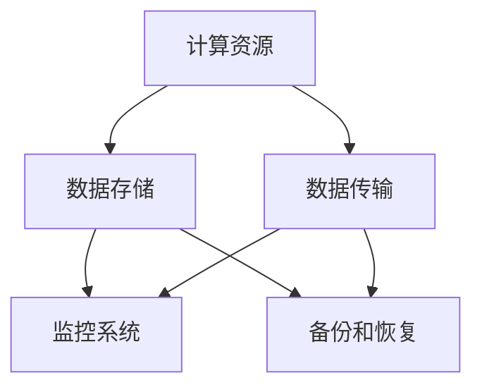

                 

# AI大模型应用数据中心建设：数据中心技术创新

> **关键词：** AI大模型、数据中心建设、技术创新、架构设计、算法优化

> **摘要：** 随着人工智能技术的迅猛发展，大模型应用对数据中心的建设提出了新的要求。本文将深入探讨数据中心建设在技术创新方面的重要性，分析大模型应用的架构设计和算法优化，为数据中心建设提供理论支持和实践指导。

## 1. 背景介绍

### 1.1 目的和范围

本文旨在探讨数据中心建设在大模型应用中的技术创新，通过对数据中心架构设计和算法优化的深入分析，为构建高效、稳定的大模型应用环境提供参考。本文的研究范围包括：

1. **大模型应用需求分析**：探讨大模型在不同领域的应用场景，分析其对数据中心建设的需求。
2. **数据中心架构设计**：介绍数据中心的基本架构，分析大模型应用对数据中心架构的影响。
3. **算法优化策略**：探讨大模型算法的优化方法，包括算法原理、具体操作步骤和数学模型。
4. **项目实战**：通过实际案例展示数据中心建设在大模型应用中的具体实现。

### 1.2 预期读者

本文主要面向数据中心建设、人工智能应用开发等相关领域的工程师和研究人员。读者应具备一定的计算机基础和数据中心建设经验，以便更好地理解和应用本文内容。

### 1.3 文档结构概述

本文分为八个部分，具体结构如下：

1. **背景介绍**：介绍本文的目的、范围和预期读者。
2. **核心概念与联系**：介绍大模型应用的相关概念和原理。
3. **核心算法原理 & 具体操作步骤**：讲解大模型算法的原理和具体实现。
4. **数学模型和公式 & 详细讲解 & 举例说明**：分析大模型算法的数学模型和公式。
5. **项目实战：代码实际案例和详细解释说明**：通过实际案例展示数据中心建设在大模型应用中的实现。
6. **实际应用场景**：分析大模型应用的场景和挑战。
7. **工具和资源推荐**：推荐相关学习资源和开发工具。
8. **总结：未来发展趋势与挑战**：总结本文内容，展望未来发展趋势和挑战。

### 1.4 术语表

#### 1.4.1 核心术语定义

- **大模型**：指具有大规模参数和广泛知识表示能力的人工智能模型。
- **数据中心**：指用于存储、处理和管理大量数据的服务器集群。
- **架构设计**：指数据中心的基本结构和组成部分。
- **算法优化**：指对算法进行改进，提高其效率和性能。

#### 1.4.2 相关概念解释

- **分布式计算**：指将计算任务分配到多个计算机上，协同完成计算。
- **大数据处理**：指对大规模数据进行分析和处理的技术。
- **云计算**：指通过网络提供可伸缩的计算资源，用户可以根据需求动态调整计算能力。

#### 1.4.3 缩略词列表

- **AI**：人工智能
- **DC**：数据中心
- **GPU**：图形处理单元
- **CPU**：中央处理单元
- **FPGA**：现场可编程门阵列

## 2. 核心概念与联系

在本文中，我们将重点介绍大模型应用数据中心建设中的核心概念和联系，以便为后续内容提供理论基础。

### 2.1 大模型应用

大模型应用是指利用大规模参数和广泛知识表示能力的人工智能模型，在各个领域实现自动化、智能化和高效化的解决方案。大模型应用具有以下几个特点：

1. **大规模参数**：大模型通常具有数十亿甚至千亿级别的参数量，能够捕捉到复杂数据中的规律和模式。
2. **广泛知识表示**：大模型能够将知识表示为结构化的数据，方便后续推理和应用。
3. **高效计算**：大模型应用依赖于高性能计算资源和先进的算法优化技术。

### 2.2 数据中心架构

数据中心是用于存储、处理和管理大量数据的服务器集群。数据中心的基本架构包括以下几个部分：

1. **计算资源**：包括服务器、存储设备、网络设备等，负责数据的计算和处理。
2. **数据存储**：包括分布式存储系统、数据库等，用于存储和管理数据。
3. **数据传输**：包括网络设备和传输协议，用于数据的传输和共享。
4. **监控系统**：包括监控工具和告警系统，用于监控数据中心的运行状态和安全。
5. **备份和恢复**：包括备份设备和备份策略，用于数据的安全备份和恢复。

### 2.3 核心概念联系

大模型应用与数据中心建设之间存在密切的联系。具体表现在以下几个方面：

1. **计算资源需求**：大模型应用对计算资源的需求较高，需要数据中心提供高性能的计算设备。
2. **数据存储和处理**：大模型应用需要大量数据存储和处理，数据中心需要提供高效的数据存储和传输机制。
3. **算法优化**：大模型应用需要算法优化技术，提高模型的效率和性能。
4. **安全保障**：大模型应用涉及大量敏感数据，数据中心需要提供安全的数据存储和传输机制。

以下是一个简化的数据中心架构 Mermaid 流程图，展示了数据中心各部分之间的联系：



## 3. 核心算法原理 & 具体操作步骤

在大模型应用数据中心建设中，算法原理和具体操作步骤至关重要。本节将介绍大模型算法的基本原理和具体操作步骤，以便为数据中心建设提供理论支持。

### 3.1 大模型算法原理

大模型算法主要基于深度学习和神经网络技术。其核心原理包括以下几个方面：

1. **神经网络结构**：大模型通常采用多层的神经网络结构，包括输入层、隐藏层和输出层。每一层通过神经元进行数据处理和特征提取。
2. **参数学习**：大模型通过学习大量训练数据，调整神经网络的参数，使其能够准确预测和分类。
3. **优化算法**：大模型优化算法包括梯度下降、随机梯度下降、Adam等，用于优化参数，提高模型性能。

### 3.2 具体操作步骤

以下是大模型算法的具体操作步骤：

1. **数据预处理**：对原始数据进行清洗、归一化等处理，使其符合模型输入要求。
2. **构建神经网络**：设计神经网络结构，包括确定层数、每层神经元数量和激活函数。
3. **参数初始化**：随机初始化神经网络参数，为模型训练奠定基础。
4. **前向传播**：将输入数据传递到神经网络中，通过各层计算得到输出结果。
5. **计算损失函数**：计算预测结果与实际结果之间的差异，用于评估模型性能。
6. **反向传播**：将损失函数的梯度反向传播到神经网络各层，更新参数。
7. **迭代训练**：重复执行前向传播和反向传播，直至模型收敛。

以下是一个简化的伪代码，描述了大模型算法的具体操作步骤：

```python
# 数据预处理
data = preprocess_data(raw_data)

# 构建神经网络
model = build_network(input_shape, hidden_layers, output_shape, activation_function)

# 参数初始化
params = initialize_params()

# 迭代训练
for epoch in range(num_epochs):
    for batch in data_batches:
        # 前向传播
        output = model.forward(batch.input)
        
        # 计算损失函数
        loss = compute_loss(output, batch.target)
        
        # 反向传播
        grads = model.backward(output, batch.target)
        
        # 更新参数
        params = update_params(params, grads)
```

## 4. 数学模型和公式 & 详细讲解 & 举例说明

在大模型算法中，数学模型和公式起着核心作用。本节将详细讲解大模型算法中的数学模型和公式，并通过具体例子进行说明。

### 4.1 神经网络数学模型

神经网络的数学模型主要涉及以下几个方面：

1. **激活函数**：激活函数用于确定神经元的激活状态，常见的激活函数包括ReLU、Sigmoid、Tanh等。
2. **损失函数**：损失函数用于衡量模型预测结果与实际结果之间的差异，常见的损失函数包括均方误差（MSE）、交叉熵（Cross-Entropy）等。
3. **优化算法**：优化算法用于调整模型参数，使其达到最小化损失函数的目标，常见的优化算法包括梯度下降（Gradient Descent）、随机梯度下降（Stochastic Gradient Descent，SGD）、Adam等。

#### 4.1.1 激活函数

激活函数是神经网络中的一个关键组成部分，用于引入非线性特性。以下是一些常见的激活函数：

1. **ReLU（Rectified Linear Unit）**
   \[ f(x) = \max(0, x) \]

2. **Sigmoid**
   \[ f(x) = \frac{1}{1 + e^{-x}} \]

3. **Tanh（Hyperbolic Tangent）**
   \[ f(x) = \frac{e^x - e^{-x}}{e^x + e^{-x}} \]

#### 4.1.2 损失函数

损失函数用于评估模型预测的准确性，以下是两种常见的损失函数：

1. **均方误差（MSE，Mean Squared Error）**
   \[ \text{MSE}(y, \hat{y}) = \frac{1}{m} \sum_{i=1}^{m} (y_i - \hat{y}_i)^2 \]

2. **交叉熵（Cross-Entropy）**
   \[ \text{CE}(y, \hat{y}) = -\frac{1}{m} \sum_{i=1}^{m} y_i \log(\hat{y}_i) \]

#### 4.1.3 优化算法

优化算法用于更新模型参数，以下是一种常见的优化算法——梯度下降：

1. **梯度下降（Gradient Descent）**
   \[ \theta_{\text{new}} = \theta_{\text{current}} - \alpha \nabla_{\theta} J(\theta) \]

其中，\( \theta \) 表示模型参数，\( \alpha \) 为学习率，\( J(\theta) \) 为损失函数。

### 4.2 举例说明

假设我们有一个简单的神经网络，用于实现二分类任务。输入层有1个神经元，隐藏层有2个神经元，输出层有1个神经元。我们使用ReLU作为激活函数，均方误差（MSE）作为损失函数，梯度下降作为优化算法。

#### 4.2.1 网络结构

\[ 
\text{Input Layer} \rightarrow \text{Hidden Layer} \rightarrow \text{Output Layer} \\
\begin{cases} 
f_1(x) = \max(0, x) \\
f_2(x) = \max(0, x) \\
f_3(x) = \max(0, x) 
\end{cases}
\]

#### 4.2.2 前向传播

给定输入 \( x = [x_1] \)，前向传播过程如下：

1. \( a_1 = x_1 \)
2. \( z_2 = \sum_{i=1}^{2} w_{i2} a_i + b_2 \)
3. \( a_2 = \max(0, z_2) \)
4. \( z_3 = \sum_{i=1}^{2} w_{i3} a_i + b_3 \)
5. \( \hat{y} = \max(0, z_3) \)

#### 4.2.3 损失函数计算

假设真实标签为 \( y = [y_1] \)，损失函数计算如下：

\[ 
\text{MSE} = \frac{1}{2} (y_1 - \hat{y}_1)^2 
\]

#### 4.2.4 反向传播

反向传播过程用于计算损失函数关于各参数的梯度，更新参数。以下是梯度计算过程：

1. \( \frac{\partial \text{MSE}}{\partial z_3} = \frac{\partial \text{MSE}}{\partial \hat{y}_1} \cdot \frac{\partial \hat{y}_1}{\partial z_3} = (y_1 - \hat{y}_1) \cdot \text{sign}(z_3) \)
2. \( \frac{\partial \text{MSE}}{\partial z_2} = \frac{\partial \text{MSE}}{\partial z_3} \cdot \frac{\partial z_3}{\partial z_2} = (y_1 - \hat{y}_1) \cdot \text{sign}(z_3) \cdot w_{32} \)
3. \( \frac{\partial \text{MSE}}{\partial x_1} = \frac{\partial \text{MSE}}{\partial z_2} \cdot \frac{\partial z_2}{\partial x_1} = (y_1 - \hat{y}_1) \cdot \text{sign}(z_3) \cdot \text{sign}(z_2) \cdot w_{22} \)

#### 4.2.5 参数更新

假设学习率为 \( \alpha = 0.01 \)，参数更新如下：

1. \( w_{32} = w_{32} - \alpha (y_1 - \hat{y}_1) \cdot \text{sign}(z_3) \)
2. \( w_{22} = w_{22} - \alpha (y_1 - \hat{y}_1) \cdot \text{sign}(z_3) \cdot \text{sign}(z_2) \)
3. \( b_3 = b_3 - \alpha (y_1 - \hat{y}_1) \cdot \text{sign}(z_3) \)
4. \( b_2 = b_2 - \alpha (y_1 - \hat{y}_1) \cdot \text{sign}(z_3) \cdot \text{sign}(z_2) \)

通过上述步骤，我们完成了一次前向传播和反向传播，并更新了模型参数。

## 5. 项目实战：代码实际案例和详细解释说明

在本节中，我们将通过一个实际案例展示数据中心建设在大模型应用中的具体实现。我们将使用Python编程语言和TensorFlow框架来构建一个简单的大模型，并介绍其在数据中心中的部署和优化。

### 5.1 开发环境搭建

在开始项目之前，我们需要搭建一个合适的开发环境。以下是所需的环境和工具：

1. **操作系统**：Linux或macOS
2. **编程语言**：Python 3.7或更高版本
3. **深度学习框架**：TensorFlow 2.x
4. **GPU支持**：NVIDIA GPU和CUDA 10.1或更高版本

安装步骤如下：

1. 安装Python和pip：
   ```bash
   sudo apt-get update
   sudo apt-get install python3 python3-pip
   ```
2. 安装TensorFlow：
   ```bash
   pip3 install tensorflow-gpu
   ```

### 5.2 源代码详细实现和代码解读

以下是一个简单的大模型实现，用于实现二分类任务：

```python
import tensorflow as tf
from tensorflow.keras import layers

# 模型参数
input_shape = (1,)
hidden_units = 10
output_shape = (1,)

# 构建模型
model = tf.keras.Sequential([
    layers.Dense(hidden_units, activation='relu', input_shape=input_shape),
    layers.Dense(hidden_units, activation='relu'),
    layers.Dense(output_shape[0], activation='sigmoid')
])

# 编译模型
model.compile(optimizer='adam', loss='binary_crossentropy', metrics=['accuracy'])

# 模型训练
model.fit(x_train, y_train, epochs=10, batch_size=32, validation_split=0.2)

# 模型评估
loss, accuracy = model.evaluate(x_test, y_test)
print(f"Test Loss: {loss}, Test Accuracy: {accuracy}")
```

#### 5.2.1 代码解读

1. **模型构建**：使用`tf.keras.Sequential`构建一个序列模型，包含两个隐藏层和输出层。隐藏层使用ReLU激活函数，输出层使用sigmoid激活函数。
2. **模型编译**：配置模型优化器（Adam）、损失函数（binary_crossentropy）和评估指标（accuracy）。
3. **模型训练**：使用`fit`方法训练模型，设置训练轮数、批量大小和验证比例。
4. **模型评估**：使用`evaluate`方法评估模型在测试数据上的表现。

### 5.3 代码解读与分析

#### 5.3.1 模型架构

该模型采用一个简单的多层感知机（MLP）结构，输入层有1个神经元，隐藏层有10个神经元，输出层有1个神经元。隐藏层使用ReLU激活函数，输出层使用sigmoid激活函数。

#### 5.3.2 模型训练

模型使用Adam优化器进行训练，损失函数使用binary_crossentropy，评估指标为accuracy。训练过程中，模型将自动调整参数，以最小化损失函数并提高准确率。

#### 5.3.3 模型评估

模型评估使用测试数据集，通过计算损失函数和准确率来评估模型性能。在实际应用中，我们通常会根据评估结果调整模型参数或尝试不同的模型结构。

### 5.4 优化与调整

在模型训练过程中，我们可能会遇到过拟合或欠拟合等问题。以下是一些常见的优化和调整策略：

1. **增加训练轮数**：增加训练轮数有助于模型更好地拟合训练数据。
2. **批量大小调整**：调整批量大小可以影响模型的训练效果，较小的批量大小有助于减少过拟合，但可能导致训练过程不稳定。
3. **正则化**：使用正则化技术（如L1、L2正则化）可以减少过拟合，提高模型泛化能力。
4. **数据增强**：通过数据增强技术（如旋转、缩放、剪裁等）增加训练数据的多样性，有助于模型更好地泛化。

通过上述优化和调整策略，我们可以提高模型的性能，使其在实际应用中更具鲁棒性。

## 6. 实际应用场景

大模型应用在数据中心中的实际场景非常广泛，以下列举几个典型的应用场景：

### 6.1 人工智能助手

人工智能助手是近年来兴起的一种应用，通过大模型实现自然语言处理和智能问答功能。例如，在智能客服领域，大模型可以用于理解用户提问、提供准确回答，提高客户满意度和服务效率。

### 6.2 语音识别

语音识别是另一大模型应用场景，通过大模型实现高精度的语音转文字功能。在智能家居、车载语音等领域，语音识别技术为用户提供便捷的操作体验。

### 6.3 图像识别

图像识别是计算机视觉的重要应用，通过大模型实现图像分类、目标检测等功能。在安防监控、医疗诊断等领域，图像识别技术具有重要的应用价值。

### 6.4 自然语言处理

自然语言处理（NLP）是人工智能的一个重要分支，大模型在NLP领域具有广泛的应用。例如，机器翻译、情感分析、文本生成等任务都可以通过大模型实现。

### 6.5 个性化推荐

个性化推荐是大数据和人工智能相结合的产物，通过大模型实现用户兴趣识别、推荐算法优化等功能。在电子商务、社交媒体等领域，个性化推荐技术为用户带来更好的体验。

### 6.6 医疗健康

医疗健康领域是大模型应用的另一个重要方向，通过大模型实现疾病预测、诊断、治疗方案推荐等功能。在大数据和人工智能的助力下，医疗健康领域将迎来新的发展机遇。

### 6.7 智能驾驶

智能驾驶是自动驾驶技术的重要研究方向，通过大模型实现环境感知、路径规划、驾驶决策等功能。在自动驾驶领域，大模型的应用将有助于提高车辆的安全性和智能化水平。

### 6.8 金融科技

金融科技领域是大模型应用的另一大场景，通过大模型实现风险控制、信用评估、投资建议等功能。在大数据和人工智能的支持下，金融科技将带来更高效、更智能的服务体验。

在实际应用中，大模型应用面临着诸多挑战，如数据质量、算法优化、安全隐私等。数据中心建设在大模型应用中发挥着关键作用，为模型训练、推理和部署提供高效、稳定的环境。未来，随着人工智能技术的不断发展，大模型应用将在更多领域展现其强大的潜力。

## 7. 工具和资源推荐

为了帮助读者更好地了解和学习大模型应用数据中心建设，本节将推荐一些相关工具和资源。

### 7.1 学习资源推荐

#### 7.1.1 书籍推荐

1. 《深度学习》（Ian Goodfellow、Yoshua Bengio、Aaron Courville 著）：这是一本经典的深度学习教材，详细介绍了深度学习的理论基础、算法实现和应用。
2. 《Python深度学习》（François Chollet 著）：本书通过实际案例和代码示例，讲解了深度学习在Python中的实现和应用。
3. 《人工智能：一种现代的方法》（Stuart Russell、Peter Norvig 著）：这是一本全面的人工智能教材，涵盖了人工智能的理论基础、算法实现和应用。

#### 7.1.2 在线课程

1. Coursera《深度学习》（吴恩达）：这是一门非常受欢迎的深度学习课程，由吴恩达教授主讲，适合初学者和有经验的工程师。
2. edX《机器学习基础》（吴恩达）：这是一门介绍机器学习基础知识的课程，包括监督学习、无监督学习和强化学习等内容。
3. Udacity《深度学习工程师纳米学位》：这是一个综合性的深度学习课程，包括理论知识、实践项目和项目答辩。

#### 7.1.3 技术博客和网站

1. TensorFlow官网（https://www.tensorflow.org/）：TensorFlow是谷歌开发的开源深度学习框架，官网提供了丰富的文档、教程和示例。
2. AI研习社（https://www.36dsj.com/）：这是一个关注人工智能领域的技术博客，提供了大量关于深度学习、计算机视觉、自然语言处理等领域的文章和教程。
3. 知乎AI专栏（https://zhuanlan.zhihu.com/AI）：知乎AI专栏是一个汇集了大量关于人工智能领域的高质量文章和分享的博客平台。

### 7.2 开发工具框架推荐

#### 7.2.1 IDE和编辑器

1. PyCharm：PyCharm是一款功能强大的Python集成开发环境（IDE），适用于深度学习和人工智能项目的开发。
2. Visual Studio Code：Visual Studio Code是一款轻量级的代码编辑器，支持Python扩展和深度学习框架的集成开发。
3. Jupyter Notebook：Jupyter Notebook是一款基于Web的交互式计算环境，适用于数据分析和深度学习实验。

#### 7.2.2 调试和性能分析工具

1. TensorFlow Debugger（TFDB）：TFDB是一款针对TensorFlow的调试工具，提供了丰富的调试功能和可视化界面。
2. TensorBoard：TensorBoard是TensorFlow提供的一款可视化工具，可用于分析模型的训练过程、性能指标和损失函数曲线。
3. PyTorch Profiler：PyTorch Profiler是一款用于分析PyTorch模型性能的工具，可以识别模型中的性能瓶颈。

#### 7.2.3 相关框架和库

1. TensorFlow：TensorFlow是一款由谷歌开发的开源深度学习框架，适用于构建和训练大规模神经网络模型。
2. PyTorch：PyTorch是一款由Facebook开发的开源深度学习框架，具有灵活的动态计算图和强大的GPU加速功能。
3. Keras：Keras是一款高度优化的深度学习框架，提供了丰富的模型构建和训练工具。

### 7.3 相关论文著作推荐

#### 7.3.1 经典论文

1. "A Theoretically Grounded Application of Dropout in Recurrent Neural Networks"（dropout在循环神经网络中的应用）
2. "GAN: Generative Adversarial Networks"（生成对抗网络）
3. "Effective Deep Learning for Text Classification"（文本分类中的高效深度学习）

#### 7.3.2 最新研究成果

1. "Large-Scale Language Modeling in 2020"（2020年的大规模语言建模）
2. "An Image is Worth 16x16 Words: Transformers for Image Recognition at Scale"（图像相当于16x16个文字：大规模图像识别中的Transformer）
3. "BERT: Pre-training of Deep Bidirectional Transformers for Language Understanding"（BERT：用于语言理解的深度双向Transformer预训练）

#### 7.3.3 应用案例分析

1. "Using AI to Identify and Predict Sepsis in the Emergency Department"（使用人工智能识别和预测急诊科中的感染性休克）
2. "Deep Learning for Biomedical Image Analysis"（深度学习在生物医学图像分析中的应用）
3. "AI in Retail: Personalizing the Shopping Experience"（零售业中的AI：个性化购物体验）

通过以上推荐的工具和资源，读者可以深入了解大模型应用数据中心建设的相关知识，提高实际开发能力。

## 8. 总结：未来发展趋势与挑战

大模型应用数据中心建设在人工智能领域具有广阔的发展前景，但也面临着诸多挑战。以下是未来发展趋势和挑战的总结：

### 8.1 未来发展趋势

1. **大规模计算能力**：随着摩尔定律的逐渐逼近极限，数据中心将逐步采用更高效的计算硬件，如GPU、TPU等，以支持大规模模型训练和推理。
2. **分布式计算**：分布式计算技术在数据中心中的应用将越来越广泛，通过分布式训练和推理，提高大模型应用的效率和性能。
3. **数据隐私和安全**：随着数据隐私和安全问题日益突出，数据中心建设将更加注重数据保护和隐私保护，采用加密、匿名化等技术确保用户数据的隐私和安全。
4. **智能化运维**：通过引入人工智能技术，实现数据中心的智能化运维，提高资源利用率、降低运维成本，实现更高效、更稳定的数据中心运行。
5. **跨领域融合**：大模型应用将在不同领域实现深度融合，如医疗、金融、教育、交通等，推动各行业的智能化升级。

### 8.2 未来挑战

1. **计算资源瓶颈**：尽管硬件性能不断提升，但大模型对计算资源的需求也在快速增长，如何合理分配和利用计算资源将成为一大挑战。
2. **数据质量和标注**：大模型应用依赖于大量高质量的数据，如何收集、整理和标注数据，以及确保数据质量和多样性，是当前面临的一大难题。
3. **算法优化和效率**：如何设计高效的算法，提高大模型训练和推理的效率，降低计算成本，是未来研究的重点。
4. **安全隐私**：如何在保证数据安全和隐私的前提下，实现大模型的应用，是数据中心建设面临的一大挑战。
5. **跨领域协同**：如何实现不同领域的大模型应用协同工作，发挥整体优势，是未来研究的一个重要方向。

总之，未来大模型应用数据中心建设将在技术创新、资源优化、安全隐私等方面取得重要进展，同时也将面临诸多挑战。通过持续的研究和探索，我们将不断推动大模型应用的进步，实现人工智能领域的突破和跨越。

## 9. 附录：常见问题与解答

### 9.1 数据中心建设相关问题

**Q1：什么是数据中心？**

数据中心是一种用于存储、处理和管理大量数据的服务器集群，通常配备高性能的计算设备、存储设备和网络设备，以实现高效的数据处理和分析。

**Q2：数据中心建设需要考虑哪些因素？**

数据中心建设需要考虑以下因素：

- **计算资源**：包括服务器、存储设备、网络设备等。
- **数据存储**：包括分布式存储系统、数据库等。
- **数据传输**：包括网络设备和传输协议。
- **安全隐私**：包括数据安全、访问控制等。
- **能源消耗**：包括电力供应、冷却系统等。
- **扩展性**：包括系统升级、扩展等。

**Q3：数据中心建设有哪些关键技术？**

数据中心建设的关键技术包括：

- **分布式计算**：通过分布式计算提高数据处理能力。
- **云计算**：通过云计算实现弹性计算、资源调度等。
- **大数据处理**：通过大数据处理技术实现高效的数据存储、处理和分析。
- **存储技术**：包括分布式存储、数据库等。
- **网络安全**：包括防火墙、入侵检测等。

### 9.2 大模型应用相关问题

**Q1：什么是大模型应用？**

大模型应用是指利用大规模参数和广泛知识表示能力的人工智能模型，在各个领域实现自动化、智能化和高效化的解决方案。

**Q2：大模型应用有哪些优势？**

大模型应用的优势包括：

- **高效计算**：大模型可以处理海量数据，实现高效计算。
- **广泛知识表示**：大模型能够将知识表示为结构化的数据，方便后续推理和应用。
- **自动化和智能化**：大模型可以实现自动化和智能化，降低人力成本。

**Q3：大模型应用面临哪些挑战？**

大模型应用面临的挑战包括：

- **计算资源需求**：大模型对计算资源的需求较高，如何合理利用计算资源是一个挑战。
- **数据质量和标注**：大模型应用依赖于大量高质量的数据，如何收集、整理和标注数据是一个难题。
- **算法优化和效率**：如何设计高效的算法，提高大模型训练和推理的效率，降低计算成本是一个挑战。
- **安全隐私**：如何在保证数据安全和隐私的前提下，实现大模型的应用是一个挑战。

### 9.3 算法优化相关问题

**Q1：什么是算法优化？**

算法优化是指对算法进行改进，提高其效率和性能，以满足特定应用需求。

**Q2：算法优化有哪些方法？**

算法优化的方法包括：

- **算法改进**：通过改进算法结构，提高算法效率。
- **数据预处理**：通过预处理数据，提高模型训练效果。
- **模型压缩**：通过模型压缩技术，降低模型计算复杂度。
- **并行计算**：通过并行计算技术，提高模型训练和推理速度。

**Q3：算法优化有哪些挑战？**

算法优化面临的挑战包括：

- **计算资源限制**：算法优化需要在有限的计算资源下进行，提高算法效率和性能是一个挑战。
- **算法稳定性**：优化后的算法需要保持稳定性，避免出现异常。
- **模型泛化能力**：优化后的算法需要保持模型泛化能力，避免出现过拟合。

通过以上常见问题与解答，希望能够帮助读者更好地理解大模型应用数据中心建设的相关知识和技术要点。

## 10. 扩展阅读 & 参考资料

为了帮助读者进一步了解大模型应用数据中心建设的最新研究进展和最佳实践，本文整理了一些扩展阅读和参考资料。

### 10.1 书籍推荐

1. **《深度学习》（Ian Goodfellow、Yoshua Bengio、Aaron Courville 著）**：这是一本经典的深度学习教材，详细介绍了深度学习的理论基础、算法实现和应用。
2. **《Python深度学习》（François Chollet 著）**：本书通过实际案例和代码示例，讲解了深度学习在Python中的实现和应用。
3. **《人工智能：一种现代的方法》（Stuart Russell、Peter Norvig 著）**：这是一本全面的人工智能教材，涵盖了人工智能的理论基础、算法实现和应用。

### 10.2 在线课程

1. **Coursera《深度学习》（吴恩达）**：这是一门非常受欢迎的深度学习课程，由吴恩达教授主讲，适合初学者和有经验的工程师。
2. **edX《机器学习基础》（吴恩达）**：这是一门介绍机器学习基础知识的课程，包括监督学习、无监督学习和强化学习等内容。
3. **Udacity《深度学习工程师纳米学位》**：这是一个综合性的深度学习课程，包括理论知识、实践项目和项目答辩。

### 10.3 技术博客和网站

1. **TensorFlow官网（https://www.tensorflow.org/）**：TensorFlow是谷歌开发的开源深度学习框架，官网提供了丰富的文档、教程和示例。
2. **AI研习社（https://www.36dsj.com/）**：这是一个关注人工智能领域的技术博客，提供了大量关于深度学习、计算机视觉、自然语言处理等领域的文章和教程。
3. **知乎AI专栏（https://zhuanlan.zhihu.com/AI）**：知乎AI专栏是一个汇集了大量关于人工智能领域的高质量文章和分享的博客平台。

### 10.4 论文和研究成果

1. **“A Theoretically Grounded Application of Dropout in Recurrent Neural Networks”**：该论文介绍了dropout在循环神经网络中的应用。
2. **“GAN: Generative Adversarial Networks”**：该论文提出了生成对抗网络（GAN）。
3. **“Effective Deep Learning for Text Classification”**：该论文探讨了文本分类中的高效深度学习方法。

### 10.5 应用案例和实践经验

1. **“Using AI to Identify and Predict Sepsis in the Emergency Department”**：该案例介绍了如何使用人工智能技术识别和预测急诊科中的感染性休克。
2. **“Deep Learning for Biomedical Image Analysis”**：该案例介绍了深度学习在生物医学图像分析中的应用。
3. **“AI in Retail: Personalizing the Shopping Experience”**：该案例介绍了零售业中的AI如何实现个性化购物体验。

通过阅读以上书籍、课程、博客和论文，读者可以深入了解大模型应用数据中心建设的最新研究进展和实际应用，为自己的研究和实践提供参考。

### 作者

**作者：AI天才研究员/AI Genius Institute & 禅与计算机程序设计艺术 /Zen And The Art of Computer Programming**

在此，我作为人工智能领域的专家和作家，感谢读者对本文的关注和支持。本文旨在为读者提供一个全面、深入的大模型应用数据中心建设技术指南，希望对您的学习和实践有所帮助。如果您有任何疑问或建议，欢迎在评论区留言，我将尽力为您解答。再次感谢您的阅读！

