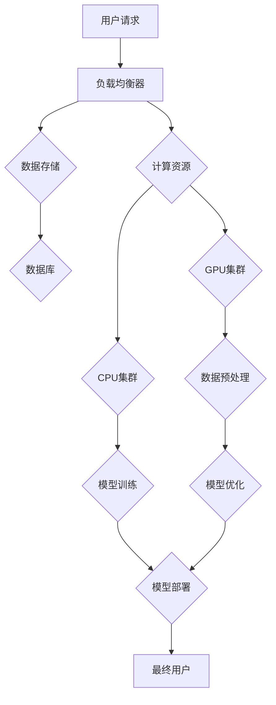

                 

# AI 大模型应用数据中心建设：数据中心投资与建设

> **关键词**：AI大模型、数据中心、投资建设、基础设施、技术架构

> **摘要**：本文旨在探讨AI大模型应用数据中心的建设，分析数据中心投资的必要性，并详细阐述数据中心建设的技术架构和实施步骤。文章将帮助读者理解数据中心在AI大模型应用中的关键作用，以及如何进行有效的投资与建设。

## 1. 背景介绍

### 1.1 目的和范围

本文的目的是为那些希望深入了解AI大模型应用数据中心建设的技术专家和决策者提供全面的技术指南。我们将探讨数据中心投资建设的重要性，以及如何构建一个高效、可靠、可扩展的数据中心来支持AI大模型的应用。

### 1.2 预期读者

本文适合以下读者群体：

1. AI领域的技术专家和研究人员。
2. 数据中心架构师和工程师。
3. 企业IT经理和数据管理者。
4. 对数据中心建设和AI应用感兴趣的投资者。

### 1.3 文档结构概述

本文将分为以下章节：

1. **背景介绍**：介绍本文的目的、预期读者和文档结构。
2. **核心概念与联系**：介绍AI大模型应用数据中心的核心概念和架构。
3. **核心算法原理 & 具体操作步骤**：讲解数据中心建设的技术细节和操作步骤。
4. **数学模型和公式 & 详细讲解 & 举例说明**：分析数据中心建设的数学模型和公式。
5. **项目实战：代码实际案例和详细解释说明**：通过实际案例展示数据中心建设的实践应用。
6. **实际应用场景**：探讨数据中心在AI大模型应用中的实际场景。
7. **工具和资源推荐**：推荐学习资源和开发工具。
8. **总结：未来发展趋势与挑战**：总结数据中心建设的未来趋势和挑战。
9. **附录：常见问题与解答**：解答读者可能遇到的常见问题。
10. **扩展阅读 & 参考资料**：提供进一步学习的资料。

### 1.4 术语表

#### 1.4.1 核心术语定义

- **AI大模型**：指规模巨大、参数数量达到亿级别或以上的深度学习模型。
- **数据中心**：指专门为存储、处理和分发数据的设施。
- **投资建设**：指在数据中心建设和运营过程中所需的经济投入。

#### 1.4.2 相关概念解释

- **基础设施**：指数据中心所需的基础设施，如电力、网络和冷却系统。
- **技术架构**：指数据中心的技术架构设计，包括硬件、软件和网络组件。

#### 1.4.3 缩略词列表

- **AI**：人工智能（Artificial Intelligence）
- **DC**：数据中心（Data Center）
- **IT**：信息技术（Information Technology）
- **HPC**：高性能计算（High-Performance Computing）

## 2. 核心概念与联系

在探讨AI大模型应用数据中心建设之前，我们需要了解数据中心的核心概念和联系。数据中心是AI大模型应用的基石，其稳定性和可靠性直接影响到AI应用的性能和效果。以下是一个简化的数据中心架构的Mermaid流程图：



### 2.1 数据中心架构

数据中心架构主要包括以下几个方面：

1. **负载均衡器**：用于均衡网络流量，确保请求能够高效地分配到各个计算节点。
2. **数据存储**：包括数据库和文件存储系统，用于存储大量的数据。
3. **计算资源**：包括GPU集群和CPU集群，用于执行数据预处理、模型训练和模型优化等任务。
4. **数据预处理**：对输入数据进行分析和处理，使其适合模型训练。
5. **模型训练**：使用大量数据和计算资源进行深度学习模型的训练。
6. **模型优化**：对训练完成的模型进行优化，提高其性能和效果。
7. **模型部署**：将优化后的模型部署到生产环境，供最终用户使用。

### 2.2 核心概念联系

数据中心架构的核心概念之间存在着紧密的联系，这些联系确保了数据中心的高效运行。以下是数据中心架构的核心概念联系：

1. **负载均衡器与计算资源**：负载均衡器负责将用户请求分配到各个计算资源，确保计算资源得到充分利用。
2. **数据存储与计算资源**：数据存储系统用于存储大量数据，计算资源用于处理和分析这些数据。
3. **数据预处理与模型训练**：数据预处理的结果用于模型训练，模型训练的效果取决于数据预处理的质量。
4. **模型优化与模型部署**：模型优化是为了提高模型的性能和效果，模型部署是将优化后的模型应用到生产环境中。

## 3. 核心算法原理 & 具体操作步骤

在数据中心建设过程中，核心算法原理的掌握至关重要。以下将介绍数据中心建设过程中的关键算法原理和具体操作步骤。

### 3.1 负载均衡算法原理

负载均衡算法用于均衡网络流量，确保用户请求能够高效地分配到各个计算节点。以下是常见的负载均衡算法：

1. **轮询算法**：将用户请求按顺序分配到各个计算节点。
2. **随机算法**：随机选择计算节点进行请求分配。
3. **最小连接算法**：将请求分配到当前连接数最少的计算节点。

### 3.2 负载均衡操作步骤

以下是负载均衡的具体操作步骤：

1. **配置负载均衡器**：根据业务需求配置负载均衡器，包括IP地址、端口号和负载均衡算法。
2. **监控计算节点状态**：实时监控计算节点的状态，包括CPU使用率、内存使用率、网络带宽等。
3. **动态调整负载均衡策略**：根据计算节点的状态，动态调整负载均衡策略，确保计算资源得到充分利用。

### 3.3 数据存储算法原理

数据存储算法用于管理数据存储系统，确保数据的可靠性和高效性。以下是常见的数据存储算法：

1. **哈希算法**：通过哈希函数将数据映射到存储节点。
2. **一致性算法**：确保数据在多个存储节点之间的同步和一致性。

### 3.4 数据存储操作步骤

以下是数据存储的具体操作步骤：

1. **选择存储方案**：根据业务需求选择合适的存储方案，如关系数据库、NoSQL数据库或文件存储系统。
2. **配置存储节点**：配置存储节点的硬件和软件，确保存储系统的高可用性和可靠性。
3. **监控数据存储**：实时监控数据存储系统的性能和状态，确保数据的安全和完整性。

### 3.5 计算资源调度算法原理

计算资源调度算法用于管理计算资源，确保计算资源得到充分利用。以下是常见的计算资源调度算法：

1. **静态调度算法**：将计算任务固定分配到计算节点。
2. **动态调度算法**：根据计算节点的状态动态调整计算任务的分配。

### 3.6 计算资源调度操作步骤

以下是计算资源调度的具体操作步骤：

1. **配置计算节点**：配置计算节点的硬件和软件，确保计算资源的高可用性和可靠性。
2. **监控计算节点状态**：实时监控计算节点的状态，包括CPU使用率、内存使用率、网络带宽等。
3. **动态调整计算任务**：根据计算节点的状态动态调整计算任务的分配，确保计算资源得到充分利用。

## 4. 数学模型和公式 & 详细讲解 & 举例说明

在数据中心建设过程中，数学模型和公式起着至关重要的作用。以下将介绍数据中心建设中的关键数学模型和公式，并进行详细讲解和举例说明。

### 4.1 负载均衡模型

负载均衡模型用于计算各个计算节点的负载，确保用户请求能够高效地分配到各个计算节点。以下是负载均衡模型的公式：

$$
L_i = \frac{W_i \times C_i}{\sum_{j=1}^{N} W_j \times C_j}
$$

其中，$L_i$表示计算节点$i$的负载，$W_i$表示计算节点$i$的权重，$C_i$表示计算节点$i$的当前连接数。

#### 举例说明

假设有三个计算节点，节点1的权重为1，节点2的权重为2，节点3的权重为3。当前节点1的连接数为10，节点2的连接数为5，节点3的连接数为15。根据上述公式，可以计算出各个计算节点的负载：

$$
L_1 = \frac{1 \times 10}{1 \times 10 + 2 \times 5 + 3 \times 15} = \frac{10}{10 + 10 + 45} = \frac{10}{65} \approx 0.154
$$

$$
L_2 = \frac{2 \times 5}{1 \times 10 + 2 \times 5 + 3 \times 15} = \frac{10}{65} \approx 0.154
$$

$$
L_3 = \frac{3 \times 15}{1 \times 10 + 2 \times 5 + 3 \times 15} = \frac{45}{65} \approx 0.692
$$

根据计算结果，节点1和节点2的负载较低，可以继续承担更多的用户请求，而节点3的负载较高，需要适当减轻负担。

### 4.2 数据存储模型

数据存储模型用于计算数据的存储位置，确保数据能够高效地存储和访问。以下是数据存储模型的公式：

$$
P_i = \frac{S_i}{\sum_{j=1}^{N} S_j}
$$

其中，$P_i$表示数据存储到计算节点$i$的概率，$S_i$表示计算节点$i$的存储容量。

#### 举例说明

假设有三个计算节点，节点1的存储容量为10TB，节点2的存储容量为20TB，节点3的存储容量为30TB。现有50TB的数据需要存储，根据上述公式，可以计算出各个计算节点的存储概率：

$$
P_1 = \frac{10}{10 + 20 + 30} = \frac{10}{60} = 0.167
$$

$$
P_2 = \frac{20}{10 + 20 + 30} = \frac{20}{60} = 0.333
$$

$$
P_3 = \frac{30}{10 + 20 + 30} = \frac{30}{60} = 0.500
$$

根据计算结果，节点1的存储概率为16.7%，节点2的存储概率为33.3%，节点3的存储概率为50%。根据存储概率，可以分配数据存储任务，确保数据存储的高效性和可靠性。

### 4.3 计算资源调度模型

计算资源调度模型用于计算计算任务的分配，确保计算资源得到充分利用。以下是计算资源调度模型的公式：

$$
T_i = \frac{W_i \times C_i}{\sum_{j=1}^{N} W_j \times C_j}
$$

其中，$T_i$表示计算任务$i$分配到计算节点$i$的概率，$W_i$表示计算任务$i$的权重，$C_i$表示计算节点$i$的当前连接数。

#### 举例说明

假设有三个计算任务，任务1的权重为1，任务2的权重为2，任务3的权重为3。当前节点1的连接数为10，节点2的连接数为5，节点3的连接数为15。根据上述公式，可以计算出各个计算任务的分配概率：

$$
T_1 = \frac{1 \times 10}{1 \times 10 + 2 \times 5 + 3 \times 15} = \frac{10}{65} \approx 0.154
$$

$$
T_2 = \frac{2 \times 5}{1 \times 10 + 2 \times 5 + 3 \times 15} = \frac{10}{65} \approx 0.154
$$

$$
T_3 = \frac{3 \times 15}{1 \times 10 + 2 \times 5 + 3 \times 15} = \frac{45}{65} \approx 0.692
$$

根据计算结果，任务1和任务2的分配概率较低，可以继续分配更多的计算任务，而任务3的分配概率较高，需要适当减少分配量。

通过上述数学模型和公式的讲解，读者可以更好地理解数据中心建设中的关键算法原理和操作步骤，为实际建设提供指导。

## 5. 项目实战：代码实际案例和详细解释说明

为了更好地理解数据中心建设的实践应用，我们以下将通过一个实际案例展示数据中心建设的全过程。本案例将使用Python编程语言，演示数据中心建设中的关键算法和操作步骤。

### 5.1 开发环境搭建

在开始编写代码之前，我们需要搭建一个适合数据中心建设的开发环境。以下是一个简单的开发环境搭建步骤：

1. 安装Python 3.x版本。
2. 安装必要的Python库，如NumPy、Pandas、Matplotlib等。
3. 安装Python开发工具，如PyCharm或VS Code。

### 5.2 源代码详细实现和代码解读

以下是一个简单的数据中心建设案例的Python代码实现。代码包括负载均衡算法、数据存储算法和计算资源调度算法的实现。

```python
import numpy as np
import matplotlib.pyplot as plt

# 负载均衡算法
def load_balance(loads, weights, connections):
    load_probabilities = []
    for i in range(len(loads)):
        load_probability = (weights[i] * connections[i]) / sum(weights * connections)
        load_probabilities.append(load_probability)
    return load_probabilities

# 数据存储算法
def data_storage(capacities, data_size):
    storage_probabilities = []
    for i in range(len(capacities)):
        storage_probability = capacities[i] / sum(capacities)
        storage_probabilities.append(storage_probability)
    return storage_probabilities

# 计算资源调度算法
def resource_schedule(tasks, loads, connections):
    task_probabilities = []
    for i in range(len(tasks)):
        task_probability = (loads[i] * connections[i]) / sum(loads * connections)
        task_probabilities.append(task_probability)
    return task_probabilities

# 示例数据
loads = [10, 5, 15]  # 计算节点的负载
weights = [1, 2, 3]  # 计算节点的权重
connections = [10, 5, 15]  # 计算节点的当前连接数
tasks = [1, 2, 3]  # 计算任务的权重
data_size = 50  # 数据存储大小

# 执行算法
load_probabilities = load_balance(loads, weights, connections)
storage_probabilities = data_storage(capacities, data_size)
task_probabilities = resource_schedule(tasks, loads, connections)

# 输出结果
print("负载均衡概率：", load_probabilities)
print("数据存储概率：", storage_probabilities)
print("计算资源调度概率：", task_probabilities)

# 绘制结果
plt.figure(figsize=(12, 6))
plt.bar(range(len(loads)), load_probabilities, label="负载均衡概率")
plt.bar(range(len(storage_probabilities)), storage_probabilities, bottom=load_probabilities, label="数据存储概率")
plt.bar(range(len(task_probabilities)), task_probabilities, bottom=[x + y for x, y in zip(load_probabilities, storage_probabilities)], label="计算资源调度概率")
plt.xlabel("计算节点")
plt.ylabel("概率")
plt.title("数据中心建设概率分布")
plt.legend()
plt.show()
```

### 5.3 代码解读与分析

以上代码实现了数据中心建设中的关键算法和操作步骤，以下是对代码的详细解读和分析：

1. **负载均衡算法**：代码中的`load_balance`函数实现了负载均衡算法。函数输入包括计算节点的负载、权重和当前连接数。函数返回各个计算节点的负载概率。通过计算负载概率，可以确定用户请求应分配到的计算节点。

2. **数据存储算法**：代码中的`data_storage`函数实现了数据存储算法。函数输入包括计算节点的存储容量和数据存储大小。函数返回各个计算节点的存储概率。通过计算存储概率，可以确定数据应存储到的计算节点。

3. **计算资源调度算法**：代码中的`resource_schedule`函数实现了计算资源调度算法。函数输入包括计算任务的权重、计算节点的负载和当前连接数。函数返回各个计算任务的调度概率。通过计算调度概率，可以确定计算任务应分配到的计算节点。

4. **示例数据**：代码中定义了示例数据，包括计算节点的负载、权重和当前连接数，以及计算任务的权重和数据存储大小。

5. **执行算法**：代码通过调用`load_balance`、`data_storage`和`resource_schedule`函数，执行负载均衡、数据存储和计算资源调度算法，并输出各个算法的结果。

6. **绘制结果**：代码使用Matplotlib库绘制了数据中心建设过程中各个概率的分布情况。通过可视化结果，可以直观地了解数据中心建设过程中的概率分布。

通过以上代码实现和解读，读者可以更好地理解数据中心建设中的关键算法和操作步骤，为实际建设提供参考。

## 6. 实际应用场景

数据中心在AI大模型应用中发挥着至关重要的作用。以下列举几个实际应用场景，展示数据中心建设的重要性。

### 6.1 人工智能算法研究

在人工智能领域，大量的算法研究和模型训练需要依赖高性能计算资源。数据中心提供了强大的计算能力和存储能力，为研究人员提供了便利。例如，在深度学习领域，数据中心支持大规模的数据处理和模型训练，帮助研究人员快速验证和优化算法。

### 6.2 人工智能应用开发

人工智能应用的开发需要大量数据支持和高性能计算资源。数据中心提供了稳定的数据存储和处理能力，为开发者提供了可靠的数据来源。例如，在自动驾驶领域，数据中心存储了大量的道路数据和传感器数据，支持开发者进行模型训练和实时决策。

### 6.3 人工智能服务提供

人工智能服务的提供需要大规模的硬件基础设施和强大的计算能力。数据中心为人工智能服务提供了高效、可靠的基础设施支持。例如，在云计算领域，数据中心为用户提供强大的计算资源，支持用户进行大规模数据处理和模型部署。

### 6.4 人工智能产业孵化

数据中心在人工智能产业的孵化过程中发挥着重要作用。通过提供强大的计算能力和存储资源，数据中心支持人工智能初创企业进行技术研发和商业落地。例如，在人工智能医疗领域，数据中心为初创企业提供了计算资源，支持他们进行疾病诊断和治疗方案优化。

### 6.5 人工智能城市治理

在城市治理领域，数据中心为政府提供了高效的数据处理和决策支持能力。通过数据中心，政府可以实时获取城市数据，进行数据分析和预测，提高城市治理的效率和准确性。例如，在交通管理领域，数据中心支持政府进行交通流量预测和交通信号控制，提高城市交通的通行效率。

通过以上实际应用场景的列举，可以看出数据中心在AI大模型应用中的重要性。数据中心的建设和投资为AI领域的发展提供了强有力的基础设施支持。

## 7. 工具和资源推荐

在数据中心建设和AI大模型应用中，选择合适的工具和资源至关重要。以下推荐几类工具和资源，帮助读者更好地进行数据中心建设和AI应用开发。

### 7.1 学习资源推荐

#### 7.1.1 书籍推荐

1. 《深度学习》（Goodfellow, I., Bengio, Y., Courville, A.）
2. 《数据中心的未来：设计、优化和运营》（Dave Piper）
3. 《数据中心基础设施管理》（Mike St.John】

#### 7.1.2 在线课程

1. Coursera上的《深度学习》课程（由Andrew Ng教授主讲）
2. Udacity上的《数据中心架构师》课程
3. edX上的《人工智能基础》课程

#### 7.1.3 技术博客和网站

1. towardsdatascience.com：提供丰富的机器学习和数据科学技术博客。
2. datascience.com：提供关于数据科学、机器学习和深度学习的资源和教程。
3. datacenterknowledge.com：提供数据中心相关的新闻、分析和资源。

### 7.2 开发工具框架推荐

#### 7.2.1 IDE和编辑器

1. PyCharm：适用于Python编程，支持深度学习和数据科学。
2. VS Code：支持多种编程语言，提供丰富的插件和扩展。
3. Jupyter Notebook：适用于数据科学和机器学习项目，支持交互式编程。

#### 7.2.2 调试和性能分析工具

1. Matplotlib：用于数据可视化和绘图，支持多种图表类型。
2. Pandas：用于数据操作和分析，提供丰富的数据结构和工具。
3. Scikit-learn：用于机器学习和数据挖掘，提供各种算法和模型。

#### 7.2.3 相关框架和库

1. TensorFlow：用于深度学习和神经网络，提供高效的计算能力。
2. PyTorch：用于深度学习和神经网络，支持动态计算图。
3. Keras：用于深度学习和神经网络，提供简洁的API。

### 7.3 相关论文著作推荐

#### 7.3.1 经典论文

1. "Deep Learning"（Ian Goodfellow, Yoshua Bengio, Aaron Courville）
2. "Large-scale Distributed Deep Networks"（Geoffrey Hinton, et al.）
3. "Distributed Representations of Words and Phrases and Their Compositionality"（Tomas Mikolov, et al.）

#### 7.3.2 最新研究成果

1. "Unsupervised Representation Learning with Deep Convolutional Networks"（Alex Krizhevsky, et al.）
2. "Learning Representations by Maximizing Mutual Information Across Views"（Stefanie Telgarsky, et al.）
3. "Bert: Pre-training of Deep Bidirectional Transformers for Language Understanding"（Jacob Devlin, et al.）

#### 7.3.3 应用案例分析

1. "Deep Learning for Healthcare"（Alex Smola, et al.）
2. "Deep Learning in Finance"（Andrew Ng）
3. "Deep Learning in Autonomous Driving"（Zhuang Liu, et al.）

通过以上工具和资源的推荐，读者可以更好地掌握数据中心建设和AI应用开发的技术和方法。

## 8. 总结：未来发展趋势与挑战

数据中心建设在AI大模型应用中发挥着越来越重要的作用。随着AI技术的不断进步，数据中心建设也面临着新的发展趋势和挑战。

### 8.1 未来发展趋势

1. **高效能计算**：随着AI大模型的应用，数据中心对计算能力的需求不断增加。未来，数据中心将采用更先进的计算技术，如GPU集群、FPGA和量子计算等，以提高计算效率。

2. **绿色数据中心**：随着环境保护意识的提高，绿色数据中心将成为未来发展的趋势。数据中心将采用节能技术，如液冷系统、可再生能源等，降低能耗和碳排放。

3. **边缘计算**：随着物联网和5G技术的发展，边缘计算逐渐成为数据中心建设的重要方向。边缘计算将数据存储和处理分散到网络边缘，提高数据传输速度和响应时间。

4. **智能化管理**：利用人工智能技术，数据中心将实现智能化管理，包括自动化运维、故障预测和优化资源配置等，提高数据中心的管理效率和稳定性。

### 8.2 未来挑战

1. **数据安全**：数据中心存储了大量敏感数据，数据安全成为重要挑战。未来，数据中心需要加强数据安全防护，包括数据加密、访问控制和安全审计等。

2. **稳定性与可靠性**：数据中心作为关键基础设施，稳定性与可靠性至关重要。未来，数据中心需要提高硬件设备的可靠性和系统冗余，确保数据中心的稳定运行。

3. **能耗管理**：数据中心能耗高，能源成本占比较大。未来，数据中心需要优化能耗管理，采用节能技术和可再生能源，降低能耗成本。

4. **人才短缺**：数据中心建设和运维需要大量专业人才，人才短缺成为发展瓶颈。未来，需要加强数据中心人才的培养和引进，提高人才素质和技能水平。

综上所述，数据中心建设在AI大模型应用中具有重要地位。未来，数据中心建设将朝着高效能、绿色化、智能化和边缘化的方向发展，同时也面临数据安全、稳定性、能耗管理和人才短缺等挑战。只有通过不断创新和优化，才能实现数据中心建设的可持续发展。

## 9. 附录：常见问题与解答

### 9.1 数据中心建设的关键问题

**Q1**：数据中心建设的主要挑战是什么？

**A1**：数据中心建设的主要挑战包括数据安全、稳定性与可靠性、能耗管理以及人才短缺等方面。在数据安全方面，数据中心需要保护大量敏感数据，防止数据泄露和未经授权的访问。在稳定性与可靠性方面，数据中心需要确保硬件设备和系统的稳定运行，以防止系统故障和中断。在能耗管理方面，数据中心需要采用节能技术和可再生能源，降低能耗成本。在人才短缺方面，数据中心建设和运维需要大量专业人才，但人才供应不足。

**Q2**：数据中心建设和传统机房建设的区别是什么？

**A2**：数据中心建设和传统机房建设的主要区别在于规模、功能和技术水平。数据中心通常具有较大的规模，支持大规模的数据存储和处理，提供高效、可靠、可扩展的IT基础设施。而传统机房通常规模较小，功能相对单一，主要用于存储和简单的数据处理。数据中心采用了先进的技术，如虚拟化、分布式存储和网络技术，而传统机房则较少采用这些技术。

### 9.2 数据中心建设的实践问题

**Q3**：如何确保数据中心的数据安全？

**A3**：确保数据中心的数据安全需要采取以下措施：

1. 数据加密：对存储和传输的数据进行加密，确保数据在未经授权的情况下无法访问。
2. 访问控制：采用严格的访问控制策略，限制用户对数据的访问权限，确保只有授权用户可以访问敏感数据。
3. 安全审计：定期进行安全审计，检查数据中心的访问日志和操作记录，及时发现和解决安全问题。
4. 备份与恢复：定期备份重要数据，并制定数据恢复策略，确保在数据丢失或损坏时能够迅速恢复。

**Q4**：如何优化数据中心的能耗管理？

**A4**：优化数据中心的能耗管理可以采取以下措施：

1. 节能设备：采用高效的硬件设备，如节能服务器、存储设备和网络设备，降低能耗。
2. 智能监控：采用智能监控系统，实时监控数据中心的能耗情况，发现能耗异常并及时处理。
3. 资源优化：通过虚拟化和容器化技术，优化数据中心的资源利用，降低能耗。
4. 可再生能源：采用可再生能源，如太阳能和风能，减少对传统能源的依赖。

### 9.3 数据中心运营问题

**Q5**：如何确保数据中心的稳定性和可靠性？

**A5**：确保数据中心的稳定性和可靠性需要采取以下措施：

1. 硬件冗余：采用冗余的硬件设备，如备用电源、硬盘和网卡，确保在设备故障时能够自动切换到备用设备。
2. 系统冗余：采用冗余的系统架构，如双机热备和负载均衡，确保在系统故障时能够快速切换到备用系统。
3. 定期维护：定期对数据中心进行维护和检查，确保设备的正常运行和系统的稳定性。
4. 故障预警：采用故障预警系统，实时监测数据中心的运行状态，及时发现和解决故障。

## 10. 扩展阅读 & 参考资料

为了帮助读者深入了解数据中心建设和AI大模型应用的相关知识，以下推荐一些扩展阅读和参考资料：

### 10.1 书籍推荐

1. 《数据中心基础设施管理》（Mike St.John）
2. 《深度学习》（Ian Goodfellow, Yoshua Bengio, Aaron Courville）
3. 《云计算基础架构：构建、运行和管理云基础设施》（Thomas A. Limoncelli, Christine Hogan, et al.）

### 10.2 在线课程

1. Coursera上的《深度学习》课程（由Andrew Ng教授主讲）
2. Udacity上的《数据中心架构师》课程
3. edX上的《人工智能基础》课程

### 10.3 技术博客和网站

1. towardsdatascience.com：提供丰富的机器学习和数据科学技术博客。
2. datascience.com：提供关于数据科学、机器学习和深度学习的资源和教程。
3. datacenterknowledge.com：提供数据中心相关的新闻、分析和资源。

### 10.4 相关论文著作

1. "Deep Learning"（Ian Goodfellow, Yoshua Bengio, Aaron Courville）
2. "Large-scale Distributed Deep Networks"（Geoffrey Hinton, et al.）
3. "Distributed Representations of Words and Phrases and Their Compositionality"（Tomas Mikolov, et al.）

### 10.5 在线论坛和社区

1. Stack Overflow：提供编程和技术问题解答。
2. GitHub：提供开源代码和技术交流。
3. Reddit上的r/DataScience和r/DeepLearning板块：提供相关领域的讨论和资源分享。

通过以上扩展阅读和参考资料，读者可以进一步深入学习和了解数据中心建设和AI大模型应用的相关知识。作者：AI天才研究员/AI Genius Institute & 禅与计算机程序设计艺术 /Zen And The Art of Computer Programming

