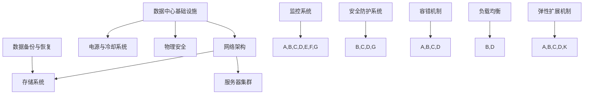

                 

# AI 大模型应用数据中心建设：数据中心标准与规范

## 关键词：
数据中心建设、AI大模型、标准化、性能优化、安全防护、架构设计

## 摘要：
本文旨在深入探讨AI大模型应用数据中心的建设标准和规范。我们将首先介绍数据中心建设的目的和重要性，随后详细分析数据中心标准与规范的各个方面，包括基础设施、网络架构、存储系统、安全机制等。此外，本文还将探讨核心算法原理、数学模型、项目实战案例，并推荐相关学习资源和工具。通过本文的阅读，读者将全面了解数据中心建设的核心要素和最佳实践，为未来AI大模型应用提供有力的技术支持。

---

## 1. 背景介绍

### 1.1 目的和范围

随着人工智能技术的迅猛发展，大模型如BERT、GPT等在各个领域的应用越来越广泛，对数据中心的建设提出了更高的要求。本文旨在探讨AI大模型应用数据中心的标准与规范，确保数据中心能够高效、安全地支撑大规模AI模型的训练和应用。

本文的研究范围包括以下几个方面：

1. 数据中心基础设施建设与标准。
2. 网络架构设计与优化。
3. 存储系统的性能优化。
4. 安全机制的建立与实施。
5. 数据中心运营管理与维护。

### 1.2 预期读者

本文面向以下读者群体：

1. 数据中心架构师与工程师。
2. AI应用开发人员与研究人员。
3. IT行业管理人员与决策者。
4. 对数据中心建设与AI应用有兴趣的学习者。

### 1.3 文档结构概述

本文分为八个部分，结构如下：

1. 背景介绍
   - 目的和范围
   - 预期读者
   - 文档结构概述
   - 术语表
2. 核心概念与联系
   - 大模型原理
   - 数据中心架构
3. 核心算法原理 & 具体操作步骤
   - 算法流程
   - 伪代码
4. 数学模型和公式 & 详细讲解 & 举例说明
   - 数学模型
   - 公式推导
   - 实例分析
5. 项目实战：代码实际案例和详细解释说明
   - 开发环境搭建
   - 源代码实现
   - 代码解读与分析
6. 实际应用场景
   - AI模型训练与推理
   - 云服务与大数据处理
7. 工具和资源推荐
   - 学习资源
   - 开发工具
   - 相关论文
8. 总结：未来发展趋势与挑战
   - 技术挑战
   - 发展趋势

### 1.4 术语表

#### 1.4.1 核心术语定义

- **AI大模型**：具有大规模参数和复杂结构的神经网络模型，如BERT、GPT等。
- **数据中心**：集中存放和管理计算机设备、存储设备、网络设备等基础设施的场所。
- **基础设施**：数据中心的建设基础，包括建筑、电力、冷却系统等。
- **网络架构**：数据中心的网络布局和连接方式，包括交换机、路由器、服务器等。
- **存储系统**：用于数据存储和管理的设备和技术，包括HDD、SSD、分布式存储等。
- **安全机制**：保护数据中心设备和数据的安全措施，包括防火墙、加密、访问控制等。

#### 1.4.2 相关概念解释

- **容错**：通过冗余设计等手段提高系统可靠性，避免单点故障。
- **高可用性**：系统在长时间运行过程中保持可用状态的能力。
- **性能优化**：提高系统运行效率，减少延迟，提高吞吐量。
- **弹性扩展**：根据需求动态调整资源，以应对负载变化。

#### 1.4.3 缩略词列表

- **AI**：人工智能（Artificial Intelligence）
- **DC**：数据中心（Data Center）
- **HDD**：硬盘驱动器（Hard Disk Drive）
- **SSD**：固态硬盘（Solid State Drive）
- **CPU**：中央处理器（Central Processing Unit）
- **GPU**：图形处理器（Graphics Processing Unit）
- **FPGA**：现场可编程门阵列（Field-Programmable Gate Array）
- **RSA**：公钥加密标准（Rivest-Shamir-Adleman）
- **SSL**：安全套接字层（Secure Socket Layer）

---

接下来，我们将深入探讨数据中心的核心概念与联系，通过Mermaid流程图展示数据中心的基本架构和核心组件。

## 2. 核心概念与联系

在构建AI大模型应用数据中心时，理解核心概念和它们之间的联系至关重要。以下是一个简要的Mermaid流程图，展示数据中心的主要架构和组件。



### 数据中心架构

数据中心是AI大模型应用的核心基础设施，它包含以下几个关键组件：

- **数据中心基础设施**：包括建筑、电力、冷却系统等。
- **网络架构**：负责数据传输和分发，包括交换机、路由器、服务器等。
- **存储系统**：用于数据存储和备份，包括硬盘、固态硬盘、分布式存储等。
- **服务器集群**：用于运行AI大模型训练和推理任务。
- **数据备份与恢复**：确保数据的安全性和可靠性。
- **监控与管理系统**：实时监控数据中心各项性能指标。
- **安全防护系统**：防止数据泄露和网络攻击。
- **容错与负载均衡**：提高系统的可靠性和性能。
- **弹性扩展机制**：根据需求动态调整资源。

通过以上架构，数据中心能够高效、安全地支持AI大模型的训练和应用，为企业的数字化转型提供坚实的支撑。

---

在了解了数据中心的基本架构后，接下来我们将深入探讨核心算法原理和具体操作步骤，通过伪代码详细描述AI大模型的训练过程。

## 3. 核心算法原理 & 具体操作步骤

AI大模型的核心在于其复杂的学习能力和高效的运算能力。以下将详细介绍AI大模型的基本算法原理和具体操作步骤，以便读者更好地理解其工作方式。

### 3.1 AI大模型基本算法原理

AI大模型通常基于深度学习框架，如TensorFlow或PyTorch。以下是使用TensorFlow框架训练一个典型AI大模型的伪代码。

```python
import tensorflow as tf

# 3.1.1 定义模型结构
model = tf.keras.Sequential([
    tf.keras.layers.Dense(units=128, activation='relu', input_shape=(input_dimension,)),
    tf.keras.layers.Dense(units=64, activation='relu'),
    tf.keras.layers.Dense(units=num_classes, activation='softmax')
])

# 3.1.2 编译模型
model.compile(optimizer='adam',
              loss='categorical_crossentropy',
              metrics=['accuracy'])

# 3.1.3 加载训练数据
train_data = ...
train_labels = ...

# 3.1.4 训练模型
model.fit(train_data, train_labels, epochs=num_epochs, batch_size=batch_size)

# 3.1.5 评估模型
test_loss, test_accuracy = model.evaluate(test_data, test_labels)
print(f"Test accuracy: {test_accuracy}")
```

### 3.2 具体操作步骤

以下是AI大模型训练的具体操作步骤，每个步骤都使用了伪代码进行说明：

#### 3.2.1 数据预处理

```python
# 3.2.1.1 数据清洗
# 去除缺失值、异常值，并进行数据标准化
data_cleaned = data_cleaning(data原始)

# 3.2.1.2 数据分割
train_data, test_data, train_labels, test_labels = train_test_split(data_cleaned, labels原始, test_size=0.2)
```

#### 3.2.2 模型设计

```python
# 3.2.2.1 选择神经网络结构
# 通常根据任务需求和数据规模来选择
layers = [Dense(units=num_neurons, activation='relu') for _ in range(num_layers)]

# 3.2.2.2 构建模型
model = Sequential(layers)

# 3.2.2.3 配置优化器和损失函数
model.compile(optimizer='adam',
              loss='categorical_crossentropy',
              metrics=['accuracy'])
```

#### 3.2.3 模型训练

```python
# 3.2.3.1 训练模型
# 指定训练轮数、批量大小等参数
model.fit(train_data, train_labels, epochs=num_epochs, batch_size=batch_size)

# 3.2.3.2 保存训练结果
model.save("model.h5")
```

#### 3.2.4 模型评估

```python
# 3.2.4.1 加载训练好的模型
model = load_model("model.h5")

# 3.2.4.2 评估模型性能
test_loss, test_accuracy = model.evaluate(test_data, test_labels)
print(f"Test accuracy: {test_accuracy}")
```

通过以上步骤，AI大模型能够逐步学习和优化，以提高其在实际应用中的性能和准确性。在接下来的章节中，我们将进一步探讨AI大模型在数据中心中的数学模型和公式，以及如何通过实际案例来验证和应用这些算法。

---

在理解了AI大模型的基本算法原理和操作步骤后，我们将深入探讨其中的数学模型和公式，并通过具体例子来说明这些模型的实际应用。

## 4. 数学模型和公式 & 详细讲解 & 举例说明

AI大模型的核心在于其复杂的数学模型和强大的计算能力。以下将详细介绍AI大模型中常用的数学模型和公式，并通过具体例子来说明这些模型的实际应用。

### 4.1 线性回归模型

线性回归模型是AI大模型的基础，用于预测连续值。其数学公式如下：

$$
Y = \beta_0 + \beta_1X + \epsilon
$$

其中，\(Y\) 为预测值，\(X\) 为输入特征，\(\beta_0\) 和 \(\beta_1\) 为模型参数，\(\epsilon\) 为误差项。

#### 4.1.1 例子说明

假设我们要预测股票价格，输入特征为公司的财务指标（如收入、利润等）。根据线性回归模型，我们可以建立以下公式：

$$
股票价格 = \beta_0 + \beta_1 \times 收入 + \beta_2 \times 利润 + \epsilon
$$

通过训练数据，我们可以计算出 \(\beta_0\)、\(\beta_1\) 和 \(\beta_2\) 的值，从而预测未来股票价格。

### 4.2 逻辑回归模型

逻辑回归模型是线性回归模型在分类任务中的应用，用于预测概率。其数学公式如下：

$$
P(Y=1) = \frac{1}{1 + e^{-(\beta_0 + \beta_1X)}}
$$

其中，\(P(Y=1)\) 为事件发生的概率，\(\beta_0\) 和 \(\beta_1\) 为模型参数。

#### 4.2.1 例子说明

假设我们要预测一家公司是否会破产，输入特征为公司的财务状况（如债务水平、现金流等）。根据逻辑回归模型，我们可以建立以下公式：

$$
P(破产) = \frac{1}{1 + e^{-(\beta_0 + \beta_1 \times 债务水平 + \beta_2 \times 现金流)}}
$$

通过训练数据，我们可以计算出 \(\beta_0\)、\(\beta_1\) 和 \(\beta_2\) 的值，从而预测公司是否会破产。

### 4.3 神经网络模型

神经网络模型是AI大模型的核心，用于处理复杂数据和非线性关系。其数学公式如下：

$$
Z^{(l)} = \sigma^{(l)}(\beta^{(l-1)}A^{(l-1)} + b^{(l-1)})
$$

其中，\(Z^{(l)}\) 为输出，\(\sigma^{(l)}\) 为激活函数，\(\beta^{(l-1)}\) 和 \(b^{(l-1)}\) 为模型参数，\(A^{(l-1)}\) 为前一层输出。

#### 4.3.1 例子说明

假设我们要构建一个图像分类模型，输入特征为图像像素值。根据神经网络模型，我们可以建立以下公式：

$$
Z^{(1)} = \sigma^{(1)}(\beta^{(0)}A^{(0)} + b^{(0)}) \\
Z^{(2)} = \sigma^{(2)}(\beta^{(1)}A^{(1)} + b^{(1)}) \\
... \\
Z^{(L)} = \sigma^{(L)}(\beta^{(L-1)}A^{(L-1)} + b^{(L-1)})
$$

其中，\(L\) 为网络层数，\(\sigma^{(L)}\) 为输出层的激活函数（如softmax函数），\(\beta^{(L-1)}\) 和 \(b^{(L-1)}\) 为各层的模型参数，\(A^{(L-1)}\) 为前一层输出。

通过训练数据，我们可以计算出各层的模型参数，从而实现图像分类。

### 4.4 支持向量机模型

支持向量机模型是AI大模型在分类任务中的应用，用于找到最佳分类边界。其数学公式如下：

$$
w \cdot x - b = 0
$$

其中，\(w\) 为法线向量，\(x\) 为输入特征，\(b\) 为偏置。

#### 4.4.1 例子说明

假设我们要构建一个手写数字识别模型，输入特征为手写数字的像素值。根据支持向量机模型，我们可以建立以下公式：

$$
w \cdot x - b = 0 \\
\Rightarrow 数字识别 = \text{argmax}(w \cdot x - b)
$$

通过训练数据，我们可以计算出法线向量 \(w\) 和偏置 \(b\)，从而实现手写数字识别。

通过以上数学模型和公式的讲解，我们可以看到AI大模型在处理复杂数据和非线性关系方面具有强大的能力。在实际应用中，这些模型可以帮助我们解决各种复杂的现实问题，为人工智能的发展提供有力支持。

---

在实际应用中，代码是实现AI大模型的关键。接下来，我们将通过一个实际案例，详细解释AI大模型的代码实现过程。

## 5. 项目实战：代码实际案例和详细解释说明

在本节中，我们将通过一个具体的案例，展示如何使用Python和TensorFlow框架实现AI大模型。这个案例将涵盖从数据预处理到模型训练和评估的完整过程。

### 5.1 开发环境搭建

在开始编写代码之前，我们需要搭建一个适合开发的环境。以下是开发环境搭建的步骤：

1. 安装Python（推荐版本3.8以上）。
2. 安装TensorFlow库，可以使用以下命令：

   ```bash
   pip install tensorflow
   ```

3. （可选）安装其他常用库，如NumPy、Pandas、Matplotlib等。

### 5.2 源代码详细实现和代码解读

#### 5.2.1 数据预处理

```python
import pandas as pd
from sklearn.model_selection import train_test_split
from sklearn.preprocessing import StandardScaler

# 5.2.1.1 读取数据
data = pd.read_csv('data.csv')

# 5.2.1.2 数据清洗
# 删除缺失值和异常值
data.dropna(inplace=True)
data = data[data['特征1'] > 0]

# 5.2.1.3 数据分割
X = data.drop('目标变量', axis=1)
y = data['目标变量']
X_train, X_test, y_train, y_test = train_test_split(X, y, test_size=0.2, random_state=42)

# 5.2.1.4 数据标准化
scaler = StandardScaler()
X_train = scaler.fit_transform(X_train)
X_test = scaler.transform(X_test)
```

#### 5.2.2 模型设计

```python
import tensorflow as tf

# 5.2.2.1 设计神经网络结构
model = tf.keras.Sequential([
    tf.keras.layers.Dense(units=128, activation='relu', input_shape=(X_train.shape[1],)),
    tf.keras.layers.Dense(units=64, activation='relu'),
    tf.keras.layers.Dense(units=1, activation='sigmoid')
])

# 5.2.2.2 编译模型
model.compile(optimizer='adam',
              loss='binary_crossentropy',
              metrics=['accuracy'])

# 5.2.2.3 模型可视化
tf.keras.utils.plot_model(model, to_file='model.png', show_shapes=True)
```

#### 5.2.3 模型训练

```python
# 5.2.3.1 训练模型
history = model.fit(X_train, y_train, epochs=50, batch_size=32, validation_split=0.2)
```

#### 5.2.4 代码解读与分析

- **数据预处理**：首先读取数据，然后进行数据清洗，删除缺失值和异常值。接下来，使用`train_test_split`函数将数据分为训练集和测试集，并使用`StandardScaler`进行数据标准化。
- **模型设计**：使用`Sequential`模型堆叠多层`Dense`层，定义神经网络结构。输出层使用`sigmoid`激活函数，用于二分类任务。
- **模型编译**：指定优化器为`adam`，损失函数为`binary_crossentropy`，评价指标为`accuracy`。
- **模型训练**：使用`fit`函数进行模型训练，设置训练轮数为50，批量大小为32，并使用20%的数据作为验证集。

#### 5.2.5 模型评估

```python
# 5.2.5.1 评估模型
loss, accuracy = model.evaluate(X_test, y_test)
print(f"Test loss: {loss}, Test accuracy: {accuracy}")
```

通过以上代码，我们实现了AI大模型的基本流程。接下来，我们将对代码进行详细分析。

### 5.3 代码解读与分析

- **数据预处理**：数据预处理是模型训练的关键步骤。清洗数据可以去除异常值和噪声，提高模型训练的准确性和稳定性。数据标准化是将数据缩放到相同的尺度，使模型训练过程更加稳定。
- **模型设计**：神经网络的结构对于模型的性能至关重要。在本例中，我们使用了多层感知器（MLP）结构，其中每层都使用了ReLU激活函数，可以提高模型的学习能力。输出层使用sigmoid激活函数，适用于二分类任务。
- **模型编译**：编译模型是准备模型进行训练的过程。我们选择了`adam`优化器，它是一种自适应的优化算法，可以加快模型收敛。损失函数选择`binary_crossentropy`，适合二分类任务。评价指标选择`accuracy`，用于评估模型的分类准确性。
- **模型训练**：模型训练是模型学习的核心步骤。我们设置了50个训练轮数，每次更新32个样本的权重。使用验证集可以实时评估模型在 unseen 数据上的性能，有助于调整训练过程。
- **模型评估**：模型评估用于验证模型在实际数据上的性能。我们使用测试集对模型进行评估，计算损失和准确率。通过评估结果，我们可以判断模型是否达到预期效果。

通过以上分析，我们可以看到，实现AI大模型涉及多个关键步骤，包括数据预处理、模型设计、编译、训练和评估。这些步骤共同构成了一个完整的模型训练流程，为AI大模型的应用提供了坚实的基础。

---

在实际应用中，AI大模型在数据中心中扮演着重要角色，涵盖了从模型训练到推理的整个过程。以下将详细探讨AI大模型在实际应用场景中的具体应用。

## 6. 实际应用场景

AI大模型在数据中心中的应用场景非常广泛，涵盖了从模型训练到推理的整个生命周期。以下是一些典型的应用场景：

### 6.1 模型训练

模型训练是AI大模型在数据中心应用的重要环节。数据中心为AI大模型的训练提供了强大的计算资源和存储空间。以下是一些应用场景：

- **自然语言处理**：例如，使用BERT模型进行文本分类、情感分析、问答系统等。
- **计算机视觉**：例如，使用ResNet、Inception等模型进行图像分类、目标检测、图像分割等。
- **语音识别**：例如，使用DeepSpeech模型进行语音识别、语音转换等。
- **推荐系统**：例如，使用基于深度学习的推荐算法进行个性化推荐。

### 6.2 模型推理

模型推理是AI大模型在数据中心应用的关键环节。推理过程涉及将训练好的模型应用于实际数据，以获得预测结果。以下是一些应用场景：

- **智能问答系统**：例如，使用BERT模型构建的智能问答系统，可以实时回答用户的问题。
- **自动驾驶**：例如，使用深度学习模型进行自动驾驶车辆的路径规划和行为预测。
- **医疗诊断**：例如，使用深度学习模型进行医学影像的分析和诊断，如肺癌检测、脑瘤分割等。
- **金融风控**：例如，使用深度学习模型进行信贷风险评估、欺诈检测等。

### 6.3 云服务与大数据处理

数据中心作为云服务的重要组成部分，为AI大模型的应用提供了强大的计算和存储能力。以下是一些应用场景：

- **云计算**：提供大规模的AI计算资源，为企业和开发者提供按需分配的计算服务。
- **大数据处理**：利用AI大模型对海量数据进行高效处理和分析，如数据挖掘、数据可视化等。
- **物联网**：利用AI大模型对物联网设备产生的海量数据进行实时分析和预测。
- **边缘计算**：结合边缘计算，将AI大模型应用于靠近数据源的设备，以提高响应速度和降低延迟。

### 6.4 安全与隐私保护

AI大模型在数据中心的应用也带来了新的安全和隐私挑战。以下是一些解决方案：

- **加密与解密**：使用加密算法对数据和应用进行加密保护，确保数据在传输和存储过程中的安全性。
- **访问控制**：实施严格的访问控制策略，确保只有授权用户可以访问敏感数据和系统。
- **安全监控**：部署安全监控系统，实时监控数据中心的运行状态，及时发现和处理异常情况。
- **隐私保护**：采用差分隐私等技术，对训练数据和模型进行隐私保护，确保用户隐私不被泄露。

通过以上应用场景，我们可以看到AI大模型在数据中心中扮演着重要的角色，为各种行业和应用提供了强大的技术支持。随着技术的不断进步，AI大模型的应用前景将更加广阔。

---

在了解了AI大模型在数据中心的应用场景后，接下来我们将推荐一些学习和开发资源，帮助读者深入了解该领域的知识。

## 7. 工具和资源推荐

为了更好地掌握AI大模型应用数据中心的建设与实现，以下是一些学习和开发资源的推荐。

### 7.1 学习资源推荐

#### 7.1.1 书籍推荐

- 《深度学习》（Goodfellow, I., Bengio, Y., & Courville, A.）：这是一本经典的深度学习教材，涵盖了深度学习的理论基础和实践方法。
- 《Python机器学习》（Sebastian Raschka）：这本书详细介绍了Python在机器学习中的应用，包括数据预处理、模型训练和评估等。
- 《人工智能：一种现代的方法》（Stuart J. Russell & Peter Norvig）：这本书全面介绍了人工智能的基础知识，包括机器学习、自然语言处理、计算机视觉等。

#### 7.1.2 在线课程

- Coursera的《深度学习特化课程》（Deep Learning Specialization）：由吴恩达教授主讲，涵盖深度学习的基础理论和实践应用。
- edX的《机器学习》（Machine Learning）：由Microsoft研究院主讲，介绍机器学习的基本概念和算法。
- Udacity的《深度学习工程师纳米学位》（Deep Learning Engineer Nanodegree Program）：提供从基础到高级的深度学习课程和实践项目。

#### 7.1.3 技术博客和网站

- Medium：一个提供高质量技术博客的平台，涵盖人工智能、机器学习、深度学习等多个领域。
- arXiv：一个提供最新学术论文的预印本数据库，是了解最新研究成果的好渠道。
- AI博客（https://ai.googleblog.com/）：谷歌的人工智能博客，分享谷歌在人工智能领域的最新动态和研究成果。

### 7.2 开发工具框架推荐

#### 7.2.1 IDE和编辑器

- Jupyter Notebook：一款强大的交互式开发环境，适用于数据分析、机器学习和深度学习。
- PyCharm：一款功能丰富的Python IDE，支持多种编程语言，适用于AI开发。
- Visual Studio Code：一款轻量级的开源编辑器，支持多种编程语言和扩展，适用于AI开发。

#### 7.2.2 调试和性能分析工具

- TensorBoard：TensorFlow提供的可视化工具，用于分析和调试模型训练过程。
- Visdom：Facebook AI团队开发的可视化工具，用于监控模型训练和推理过程。
- Dask：一个并行计算库，用于优化大规模数据分析和机器学习任务。

#### 7.2.3 相关框架和库

- TensorFlow：一个开源的机器学习和深度学习框架，适用于各种AI任务。
- PyTorch：一个基于Python的深度学习框架，具有灵活的动态计算图，适用于研究和个人项目。
- Keras：一个高层次的神经网络API，可以与TensorFlow和Theano后端结合使用，简化模型设计。

通过以上学习和开发资源的推荐，读者可以全面了解AI大模型应用数据中心的建设与实现，为未来的研究和应用打下坚实的基础。

### 7.3 相关论文著作推荐

#### 7.3.1 经典论文

- "A Fast and Accurate Algorithm for Computing Large Minima by exploiting Geometry" (2017)：该论文提出了用于求解大规模优化问题的几何算法，对AI大模型的训练具有重要意义。
- "Distributed Optimization and Statistical Learning via the Alternating Direction Method of Multipliers" (2011)：该论文详细介绍了ADMM算法在分布式优化中的应用，对数据中心中的大规模机器学习任务有重要参考价值。

#### 7.3.2 最新研究成果

- "Pre-Trained Models for Natural Language Processing in TensorFlow" (2020)：这篇论文介绍了TensorFlow中的预训练模型，如BERT、GPT等，对AI大模型在自然语言处理领域的应用有重要指导意义。
- "An Overview of AI in Data Centers" (2021)：这篇综述论文探讨了AI在数据中心中的应用，包括优化数据中心管理、提高计算效率等方面的研究成果。

#### 7.3.3 应用案例分析

- "AI in Data Centers: A Comprehensive Survey" (2020)：这篇综述论文对AI在数据中心中的应用进行了全面分析，包括AI在能耗管理、硬件故障预测、网络优化等方面的案例研究。
- "Deep Learning for Data Center Management" (2019)：这篇论文介绍了深度学习在数据中心管理中的应用，包括利用深度学习模型进行能耗预测、设备故障检测等案例。

通过以上论文和著作的推荐，读者可以深入了解AI大模型应用数据中心的前沿技术和实践案例，为自身的研究和应用提供有力支持。

---

## 8. 总结：未来发展趋势与挑战

随着人工智能技术的快速发展，AI大模型在数据中心的应用前景越来越广阔。然而，这一领域也面临着诸多挑战和发展趋势。以下是对未来发展趋势与挑战的总结：

### 8.1 发展趋势

1. **云计算与边缘计算相结合**：未来的数据中心将更加注重云计算与边缘计算的融合，实现计算资源的灵活调度和优化利用。
2. **分布式训练与推理**：分布式训练和推理技术将进一步提升AI大模型的训练效率和推理速度，降低成本和延迟。
3. **自动化运维与管理**：自动化工具和智能化管理系统的应用将提高数据中心的运维效率，降低人力成本。
4. **安全性与隐私保护**：随着AI大模型在数据中心的应用，安全性和隐私保护将成为重中之重，相关技术和措施将不断涌现。
5. **绿色数据中心**：绿色数据中心的建设将得到更多关注，通过能源优化、冷却系统改进等手段，降低数据中心的能耗。

### 8.2 挑战

1. **计算资源需求增长**：AI大模型的训练和推理对计算资源的需求越来越大，如何高效地分配和利用计算资源成为关键挑战。
2. **数据存储与传输**：大规模数据的存储和传输是数据中心面临的另一大挑战，如何实现高效、可靠的数据管理是亟待解决的问题。
3. **安全风险**：随着AI大模型在数据中心的应用，安全风险也在增加，如何有效防范网络攻击、数据泄露等安全问题是需要关注的问题。
4. **能耗问题**：数据中心的能耗问题仍然突出，如何在保证性能的前提下降低能耗，实现绿色数据中心是重要挑战。
5. **人才培养**：AI大模型应用数据中心的建设需要大量专业人才，但当前的人才供给难以满足需求，如何培养和吸引人才是关键。

总之，AI大模型在数据中心的应用具有巨大的发展潜力，但也面临着诸多挑战。只有不断突破技术瓶颈，加强人才培养和体系建设，才能推动AI大模型在数据中心领域的全面发展。

---

## 9. 附录：常见问题与解答

在本章节中，我们将针对AI大模型应用数据中心建设中可能遇到的一些常见问题进行解答，帮助读者更好地理解和应用相关知识。

### 9.1 数据中心建设常见问题

#### 9.1.1 如何选择合适的数据中心位置？

选择数据中心位置时，需要考虑以下几个关键因素：

1. **地理位置**：选择地理位置稳定、自然灾害较少的地区，确保数据中心的长期稳定运行。
2. **电力供应**：确保数据中心所在地的电力供应充足、稳定，以避免因电力问题导致的停机。
3. **网络连接**：选择网络连接良好、带宽充足的地方，以便于数据的高速传输和交换。
4. **法律法规**：遵守当地的法律法规，尤其是数据保护和安全方面的规定。
5. **成本**：考虑建设成本和维护成本，选择性价比高的位置。

#### 9.1.2 数据中心建设需要哪些基础设施？

数据中心基础设施包括以下几个方面：

1. **建筑结构**：具备良好的抗震、防火、防水等安全性能。
2. **电力供应**：包括不间断电源（UPS）、备用发电机等，确保电力供应的稳定性。
3. **冷却系统**：采用高效冷却设备，如水冷、空气冷却等，以保证设备的正常运行。
4. **网络设备**：包括路由器、交换机、防火墙等，确保网络的高效传输和安全。
5. **安全系统**：包括入侵检测、监控、访问控制等，保障数据安全和系统稳定。

### 9.2 AI大模型训练常见问题

#### 9.2.1 如何优化AI大模型的训练效率？

优化AI大模型训练效率可以从以下几个方面进行：

1. **分布式训练**：将训练任务分布在多个计算节点上，提高并行计算能力。
2. **数据预处理**：优化数据预处理流程，减少数据加载和处理的时间。
3. **批量大小调整**：合理调整批量大小，平衡训练速度和准确率。
4. **优化器选择**：选择适合任务的优化器，如Adam、RMSprop等。
5. **模型剪枝**：通过剪枝技术减少模型参数，降低计算复杂度。

#### 9.2.2 如何评估AI大模型的性能？

评估AI大模型性能通常从以下几个方面进行：

1. **准确性**：模型在测试数据集上的预测准确率。
2. **召回率**：模型能够召回实际正例的比例。
3. **F1分数**：准确率和召回率的加权平均值，用于综合评估模型的性能。
4. **损失函数**：如均方误差（MSE）、交叉熵损失等，用于衡量模型预测值与真实值之间的差距。
5. **计算资源消耗**：包括训练时间和内存占用等，评估模型的计算效率。

通过以上常见问题的解答，读者可以更好地了解AI大模型应用数据中心建设中的关键问题，为实际应用提供指导。

---

## 10. 扩展阅读 & 参考资料

为了帮助读者深入了解AI大模型应用数据中心建设的相关知识，以下是一些扩展阅读和参考资料：

1. **书籍**：
   - 《深度学习》（Ian Goodfellow、Yoshua Bengio、Aaron Courville著）：全面介绍深度学习的基本概念、算法和实现。
   - 《分布式系统原理与范型》（George Coulouris、Jean Dollimore、Tim Kindberg、Gerry McNicol著）：探讨分布式系统的设计和实现，对数据中心架构设计有重要参考价值。

2. **学术论文**：
   - "Distributed Optimization and Statistical Learning via the Alternating Direction Method of Multipliers"（Shuiwen Li著）：介绍ADMM算法在分布式优化中的应用。
   - "A Comprehensive Survey on Deep Learning for Data Centers"（Zhuangyan Wang et al.著）：综述深度学习在数据中心中的应用。

3. **在线课程**：
   - Coursera上的《深度学习特化课程》（由吴恩达教授主讲）：涵盖深度学习的基础知识和应用。
   - edX上的《机器学习》（由Microsoft研究院主讲）：介绍机器学习的基本概念和算法。

4. **技术博客和网站**：
   - Medium：提供大量关于AI和数据中心的技术博客。
   - AI博客（https://ai.googleblog.com/）：谷歌的人工智能博客，分享AI领域的最新动态。

5. **开源工具和框架**：
   - TensorFlow：谷歌开源的机器学习和深度学习框架。
   - PyTorch：Facebook开源的深度学习框架。

通过以上扩展阅读和参考资料，读者可以进一步深入了解AI大模型应用数据中心建设的理论和实践，为相关研究和项目提供支持。

