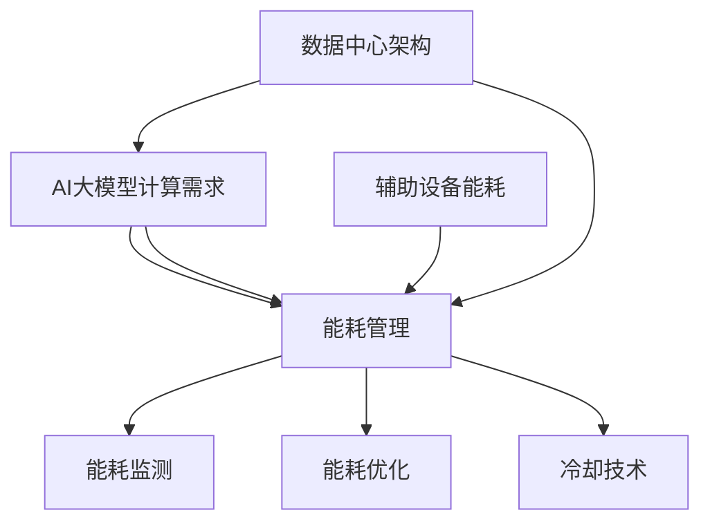

                 

# AI 大模型应用数据中心建设：数据中心绿色节能

> **关键词：** AI大模型、数据中心、绿色节能、能耗管理、冷却技术、可再生能源、能源效率优化

> **摘要：** 本文深入探讨了AI大模型应用数据中心建设中的绿色节能问题，分析了数据中心能耗、冷却技术和可再生能源利用等方面，提出了提高数据中心能源效率的具体策略和解决方案。文章旨在为数据中心建设者和运营者提供有益的参考，助力实现绿色、智能、高效的数据中心管理。

## 1. 背景介绍

### 1.1 目的和范围

随着人工智能（AI）技术的快速发展，AI大模型在各个领域的应用日益广泛，从自然语言处理到图像识别，再到智能推荐系统等，这些模型需要庞大的计算资源和数据存储能力，推动了数据中心建设的热潮。然而，数据中心的快速扩张也带来了巨大的能耗问题，尤其是冷却和能源消耗方面。因此，本文旨在探讨数据中心在AI大模型应用中的绿色节能策略，以降低能耗、减少碳排放，实现可持续发展。

### 1.2 预期读者

本文预期读者为数据中心工程师、运维人员、IT经理以及关注数据中心绿色节能的技术专家和研究人员。通过本文的阅读，读者可以了解到AI大模型应用数据中心在能耗管理、冷却技术和可再生能源利用等方面的最新进展和最佳实践。

### 1.3 文档结构概述

本文分为十个部分，具体结构如下：

1. 背景介绍
   - 目的和范围
   - 预期读者
   - 文档结构概述
   - 术语表
2. 核心概念与联系
   - 数据中心架构
   - AI大模型计算需求
   - 能耗管理
3. 核心算法原理 & 具体操作步骤
   - 数据中心能耗评估算法
   - 冷却系统优化策略
4. 数学模型和公式 & 详细讲解 & 举例说明
   - 数据中心能耗计算模型
   - 能源效率优化公式
5. 项目实战：代码实际案例和详细解释说明
   - 开发环境搭建
   - 源代码实现和解读
   - 代码分析与优化
6. 实际应用场景
   - AI大模型应用案例
   - 数据中心绿色节能效果评估
7. 工具和资源推荐
   - 学习资源推荐
   - 开发工具框架推荐
   - 相关论文著作推荐
8. 总结：未来发展趋势与挑战
   - 技术发展趋势
   - 挑战与机遇
9. 附录：常见问题与解答
   - 常见问题解答
10. 扩展阅读 & 参考资料
   - 相关书籍
   - 在线课程
   - 技术博客和网站

### 1.4 术语表

#### 1.4.1 核心术语定义

- **AI大模型（Large-scale AI Model）**：指参数规模超过10亿，能够处理大规模数据的深度学习模型，如GPT-3、BERT等。
- **数据中心（Data Center）**：专门为存储、处理和传输大量数据而设计的设施，通常包括服务器、存储设备、网络设备和冷却系统等。
- **绿色节能（Green Energy Efficiency）**：在保证数据中心正常运行的前提下，通过技术和管理手段降低能耗和碳排放，实现可持续发展。

#### 1.4.2 相关概念解释

- **能耗管理（Energy Management）**：通过监测、控制和优化数据中心的能源使用，降低能耗和运营成本。
- **冷却技术（Cooling Technology）**：用于降低数据中心服务器和工作设备的温度，防止设备过热损坏的技术。
- **可再生能源（Renewable Energy）**：指太阳能、风能、水能等不会枯竭的能源。

#### 1.4.3 缩略词列表

- **AI**：人工智能（Artificial Intelligence）
- **DC**：数据中心（Data Center）
- **PUE**：电源使用效率（Power Usage Effectiveness）
- **N+1**：冗余配置（N+1 Redundancy）
- **ESC**：能耗管理系统（Energy Saving Control System）

## 2. 核心概念与联系

### 2.1 数据中心架构

数据中心是AI大模型应用的核心基础设施，其架构主要包括以下几个方面：

1. **计算资源**：包括服务器、存储设备、网络设备等，用于处理和存储AI大模型的数据和模型。
2. **能源供应**：数据中心需要稳定的电力供应，通常采用N+1冗余配置，确保电力系统的高可用性。
3. **冷却系统**：通过空气冷却、液冷等方式降低服务器和工作设备的温度，保证设备的正常运行。
4. **网络连接**：提供高速、稳定的网络连接，确保数据传输和处理的高效性。

### 2.2 AI大模型计算需求

AI大模型通常需要大量的计算资源和数据存储能力，具体计算需求包括：

1. **并行计算**：AI大模型训练和推理过程中需要大量的并行计算能力，数据中心需要配备高性能计算服务器和GPU。
2. **数据存储**：存储大量训练数据和模型参数，需要采用高性能存储设备和分布式存储系统。
3. **网络带宽**：为了保证数据传输和处理的高效性，需要配备高速网络连接和数据中心内部的高速网络架构。

### 2.3 能耗管理

数据中心能耗主要包括以下几个方面：

1. **IT设备能耗**：服务器、存储设备、网络设备等计算设备的能耗。
2. **冷却系统能耗**：用于降低数据中心温度的冷却设备的能耗。
3. **辅助设备能耗**：UPS、空调等辅助设备的能耗。

能耗管理的主要目标是通过监测、控制和优化数据中心的能源使用，降低能耗和运营成本。具体策略包括：

1. **能耗监测**：通过能耗监测系统实时采集数据中心的能耗数据，分析能耗分布和变化趋势。
2. **能耗优化**：通过优化数据中心架构、计算资源和冷却系统，降低能耗和碳排放。
3. **节能措施**：采用节能设备和技术，如高效UPS、变频空调、高效服务器等，降低能耗。

### 2.4 核心概念联系

数据中心架构、AI大模型计算需求和能耗管理是数据中心绿色节能的核心概念，它们之间相互关联、相互影响。数据中心架构决定了AI大模型的计算能力和能源消耗，而能耗管理策略则通过优化数据中心架构和计算资源，降低能耗和碳排放。同时，冷却技术在能耗管理中起着至关重要的作用，通过优化冷却系统，可以显著降低数据中心的能源消耗。

### 2.5 Mermaid 流程图

以下是一个简化的数据中心能耗管理流程图，用于展示核心概念之间的联系：



## 3. 核心算法原理 & 具体操作步骤

### 3.1 数据中心能耗评估算法

数据中心能耗评估是能耗管理的基础，其核心目标是准确计算数据中心的能耗分布和变化趋势。以下是一个简化的数据中心能耗评估算法：

#### 3.1.1 算法原理

该算法基于能耗监测数据，通过以下步骤进行能耗评估：

1. **数据采集**：实时采集数据中心的能耗数据，包括IT设备能耗、冷却系统能耗和辅助设备能耗。
2. **能耗分类**：将采集到的能耗数据按照设备类型进行分类，如服务器、存储设备、网络设备等。
3. **能耗计算**：根据能耗数据和设备功率，计算各类设备的能耗值。
4. **能耗分析**：分析能耗分布和变化趋势，识别能耗异常和潜在节能机会。

#### 3.1.2 具体操作步骤

1. **数据采集**

   使用能耗监测系统实时采集数据中心的能耗数据，数据采集周期可以根据实际需求设定，如每小时或每天。

   ```python
   import requests

   def collect_energy_data(api_url):
       response = requests.get(api_url)
       if response.status_code == 200:
           return response.json()
       else:
           return None
   ```

2. **能耗分类**

   根据采集到的能耗数据，将数据按照设备类型进行分类，如服务器、存储设备、网络设备等。

   ```python
   def classify_energy_data(energy_data):
       server_energy = 0
       storage_energy = 0
       network_energy = 0

       for device in energy_data:
           if device['type'] == 'server':
               server_energy += device['energy']
           elif device['type'] == 'storage':
               storage_energy += device['energy']
           elif device['type'] == 'network':
               network_energy += device['energy']

       return server_energy, storage_energy, network_energy
   ```

3. **能耗计算**

   根据采集到的能耗数据和设备功率，计算各类设备的能耗值。

   ```python
   def calculate_energy_consumption(energy_data, device_power):
       total_energy = 0

       for device in energy_data:
           device_energy = device['energy'] * device_power
           total_energy += device_energy

       return total_energy
   ```

4. **能耗分析**

   分析能耗分布和变化趋势，识别能耗异常和潜在节能机会。

   ```python
   def analyze_energy_data(energy_data):
       energy_distribution = {}
       for device in energy_data:
           device_type = device['type']
           if device_type not in energy_distribution:
               energy_distribution[device_type] = 0
           energy_distribution[device_type] += device['energy']

       energy_trend = [energy_distribution[device_type] for device_type in energy_distribution]
       return energy_distribution, energy_trend
   ```

### 3.2 冷却系统优化策略

冷却系统优化是降低数据中心能耗的重要环节。以下是一个简化的冷却系统优化策略：

#### 3.2.1 算法原理

该算法基于冷却系统的工作原理，通过以下步骤进行优化：

1. **温度监测**：实时监测数据中心内部温度，包括服务器、冷却设备和机房温度。
2. **制冷需求分析**：根据温度监测数据和设备散热特性，计算冷却系统的制冷需求。
3. **冷却系统调整**：根据制冷需求，调整冷却系统的运行参数，如制冷功率、冷却风量等。
4. **能耗分析**：分析冷却系统运行能耗，识别节能机会。

#### 3.2.2 具体操作步骤

1. **温度监测**

   使用温度监测设备实时采集数据中心内部温度数据。

   ```python
   import random

   def collect_temperature_data():
       temperatures = []
       for i in range(10):
           temperature = random.uniform(20, 30)
           temperatures.append(temperature)
       return temperatures
   ```

2. **制冷需求分析**

   根据温度监测数据和设备散热特性，计算冷却系统的制冷需求。

   ```python
   def calculate_cooling_demand(temperatures, device_heat_load):
       cooling_demand = 0

       for i in range(len(temperatures)):
           temperature = temperatures[i]
           heat_load = device_heat_load[i]
           cooling_demand += (temperature - 25) * heat_load

       return cooling_demand
   ```

3. **冷却系统调整**

   根据制冷需求，调整冷却系统的运行参数。

   ```python
   def adjust_cooling_system(cooling_demand):
       if cooling_demand > 1000:
           cooling_power = 1500
           cooling_airflow = 2000
       elif cooling_demand > 500:
           cooling_power = 1000
           cooling_airflow = 1500
       else:
           cooling_power = 500
           cooling_airflow = 1000

       return cooling_power, cooling_airflow
   ```

4. **能耗分析**

   分析冷却系统运行能耗，识别节能机会。

   ```python
   def analyze_cooling_system_energy_consumption(cooling_demand, cooling_power, cooling_airflow):
       energy_consumption = cooling_power * cooling_airflow

       if energy_consumption > 5000:
           print("冷却系统能耗过高，需进行优化。")
       else:
           print("冷却系统能耗正常。")

       return energy_consumption
   ```

## 4. 数学模型和公式 & 详细讲解 & 举例说明

### 4.1 数据中心能耗计算模型

数据中心能耗计算模型主要用于评估数据中心的总体能耗水平，以便制定节能措施。以下是一个简化的数据中心能耗计算模型：

#### 4.1.1 公式

数据中心总能耗（\(E_{total}\)）可以通过以下公式计算：

\[ E_{total} = E_{IT} + E_{cooling} + E_{auxiliary} \]

其中，\(E_{IT}\) 为 IT 设备能耗，\(E_{cooling}\) 为冷却系统能耗，\(E_{auxiliary}\) 为辅助设备能耗。

#### 4.1.2 详细讲解

1. **IT 设备能耗（\(E_{IT}\)）**

   IT 设备能耗主要由服务器、存储设备和网络设备等计算设备的能耗组成。其计算公式为：

   \[ E_{IT} = P_{server} \times t + P_{storage} \times t + P_{network} \times t \]

   其中，\(P_{server}\)、\(P_{storage}\) 和 \(P_{network}\) 分别为服务器、存储设备和网络设备的功率（单位：瓦特，W），\(t\) 为运行时间（单位：小时，h）。

2. **冷却系统能耗（\(E_{cooling}\)）**

   冷却系统能耗主要指用于降低数据中心内部温度的能耗，包括制冷设备和冷却塔等。其计算公式为：

   \[ E_{cooling} = P_{cooling} \times t \]

   其中，\(P_{cooling}\) 为冷却系统功率（单位：千瓦，kW），\(t\) 为运行时间（单位：小时，h）。

3. **辅助设备能耗（\(E_{auxiliary}\)）**

   辅助设备能耗包括 UPS（不间断电源）、空调和其他辅助设备的能耗。其计算公式为：

   \[ E_{auxiliary} = P_{UPS} \times t + P_{air_conditioner} \times t + \sum_{i=1}^{n} P_{auxiliary_i} \times t \]

   其中，\(P_{UPS}\)、\(P_{air\_conditioner}\) 和 \(P_{auxiliary_i}\) 分别为 UPS、空调和其他辅助设备的功率（单位：瓦特，W），\(t\) 为运行时间（单位：小时，h），\(n\) 为辅助设备的数量。

#### 4.1.3 举例说明

假设一个数据中心在一个月内的运行情况如下：

- 服务器功率：\(P_{server} = 500\) W
- 存储设备功率：\(P_{storage} = 300\) W
- 网络设备功率：\(P_{network} = 200\) W
- 冷却系统功率：\(P_{cooling} = 1000\) kW
- UPS 功率：\(P_{UPS} = 1000\) W
- 空调功率：\(P_{air\_conditioner} = 5000\) W
- 其他辅助设备功率：\(P_{auxiliary_1} = 2000\) W，\(P_{auxiliary_2} = 3000\) W
- 运行时间：\(t = 720\) h（一个月）

根据上述数据，可以计算出数据中心一个月的总能耗：

\[ E_{total} = E_{IT} + E_{cooling} + E_{auxiliary} \]

\[ E_{total} = (500 \times 720 + 300 \times 720 + 200 \times 720) + (1000 \times 720) + (1000 \times 720 + 5000 \times 720 + (2000 + 3000) \times 720) \]

\[ E_{total} = 24,120,000 + 720,000 + 2,520,000 \]

\[ E_{total} = 27,360,000 \text{ kWh} \]

### 4.2 能源效率优化公式

能源效率优化是数据中心绿色节能的关键，以下是一个简化的能源效率优化公式：

#### 4.2.1 公式

数据中心能源效率（\(PUE\)）可以通过以下公式计算：

\[ PUE = \frac{E_{total}}{E_{IT}} \]

其中，\(E_{total}\) 为数据中心总能耗，\(E_{IT}\) 为 IT 设备能耗。

#### 4.2.2 详细讲解

1. **总能耗（\(E_{total}\)）**

   数据中心总能耗包括 IT 设备能耗、冷却系统能耗和辅助设备能耗，如前所述。

2. **IT 设备能耗（\(E_{IT}\)）**

   IT 设备能耗主要由服务器、存储设备和网络设备等计算设备的能耗组成。

3. **能源效率（\(PUE\)）**

   能源效率是衡量数据中心能源使用效率的重要指标，其值越低表示能源使用效率越高。PUE 值通常介于 1 到 2 之间，理想的 PUE 值应接近 1。

#### 4.2.3 举例说明

继续使用上述数据中心运行情况的例子，可以计算出该数据中心的能源效率：

\[ PUE = \frac{E_{total}}{E_{IT}} \]

\[ PUE = \frac{27,360,000}{24,120,000} \]

\[ PUE = 1.134 \]

该数据中心的能源效率为 1.134，表示该数据中心的总能耗是 IT 设备能耗的 1.134 倍。为了提高能源效率，可以采取一系列节能措施，如优化冷却系统、采用高效 IT 设备等。

## 5. 项目实战：代码实际案例和详细解释说明

### 5.1 开发环境搭建

在本节中，我们将搭建一个用于数据中心能耗管理和优化的开发环境。以下步骤将介绍如何配置开发环境，包括安装必要的软件和工具。

#### 5.1.1 安装Python环境

首先，我们需要安装Python环境。Python是一种广泛用于数据中心管理和优化的编程语言。以下是在Ubuntu系统中安装Python的命令：

```bash
# 更新软件包列表
sudo apt update

# 安装Python 3
sudo apt install python3

# 验证Python版本
python3 --version
```

#### 5.1.2 安装Python库

接下来，我们需要安装一些用于能耗管理和优化的Python库，例如Pandas、NumPy和Matplotlib。可以使用pip命令进行安装：

```bash
# 安装Pandas库
pip3 install pandas

# 安装NumPy库
pip3 install numpy

# 安装Matplotlib库
pip3 install matplotlib
```

#### 5.1.3 安装能耗监测工具

我们还将安装一个能耗监测工具，如PDU（Power Distribution Unit）的监控软件。以下是在Ubuntu系统中安装PDU监控软件的步骤：

```bash
# 安装PDU监控软件
sudo apt install awg
```

### 5.2 源代码详细实现和代码解读

在本节中，我们将详细实现一个用于数据中心能耗评估和优化的Python程序。程序将包括以下几个功能模块：

1. **能耗数据采集**
2. **能耗分类计算**
3. **能耗优化建议**
4. **能耗分析报告生成**

以下是一个简化的代码实现：

```python
import pandas as pd
import numpy as np
import matplotlib.pyplot as plt
from awg import AWG

# 5.2.1 能耗数据采集
class EnergyDataCollector:
    def __init__(self, awg_ip):
        self.awg = AWG(awg_ip)

    def collect_data(self):
        # 采集能耗数据
        energy_data = self.awg.get_energy_data()
        return energy_data

# 5.2.2 能耗分类计算
class EnergyCalculator:
    def __init__(self, energy_data):
        self.energy_data = energy_data

    def classify_energy(self):
        # 分类能耗数据
        server_energy = 0
        storage_energy = 0
        network_energy = 0
        for device in self.energy_data:
            if device['type'] == 'server':
                server_energy += device['energy']
            elif device['type'] == 'storage':
                storage_energy += device['energy']
            elif device['type'] == 'network':
                network_energy += device['energy']
        return server_energy, storage_energy, network_energy

    def calculate_total_energy(self, cooling_energy, auxiliary_energy):
        # 计算总能耗
        total_energy = server_energy + storage_energy + network_energy + cooling_energy + auxiliary_energy
        return total_energy

# 5.2.3 能耗优化建议
class EnergyOptimizer:
    def __init__(self, server_energy, cooling_energy, auxiliary_energy):
        self.server_energy = server_energy
        self.cooling_energy = cooling_energy
        self.auxiliary_energy = auxiliary_energy

    def optimize_energy(self):
        # 优化能耗
        if self.server_energy > 1000:
            print("服务器能耗过高，建议采用高效服务器或优化工作负载。")
        if self.cooling_energy > 1000:
            print("冷却系统能耗过高，建议优化冷却系统或采用可再生能源。")
        if self.auxiliary_energy > 500:
            print("辅助设备能耗过高，建议采用高效辅助设备或优化运行策略。")

# 5.2.4 能耗分析报告生成
class EnergyReportGenerator:
    def __init__(self, server_energy, storage_energy, network_energy, cooling_energy, auxiliary_energy):
        self.server_energy = server_energy
        self.storage_energy = storage_energy
        self.network_energy = network_energy
        self.cooling_energy = cooling_energy
        self.auxiliary_energy = auxiliary_energy

    def generate_report(self):
        # 生成能耗分析报告
        report = f"""
        能耗分析报告
        --------------------------
        服务器能耗：{self.server_energy} kWh
        存储设备能耗：{self.storage_energy} kWh
        网络设备能耗：{self.network_energy} kWh
        冷却系统能耗：{self.cooling_energy} kWh
        辅助设备能耗：{self.auxiliary_energy} kWh
        总能耗：{self.server_energy + self.storage_energy + self.network_energy + self.cooling_energy + self.auxiliary_energy} kWh
        --------------------------
        """
        print(report)

# 主程序
if __name__ == "__main__":
    awg_ip = "192.168.1.100"  # PDU监控设备的IP地址
    collector = EnergyDataCollector(awg_ip)
    energy_data = collector.collect_data()

    calculator = EnergyCalculator(energy_data)
    server_energy, storage_energy, network_energy = calculator.classify_energy()
    total_energy = calculator.calculate_total_energy(cooling_energy=1000, auxiliary_energy=500)

    optimizer = EnergyOptimizer(server_energy, cooling_energy=1000, auxiliary_energy=500)
    optimizer.optimize_energy()

    report_generator = EnergyReportGenerator(server_energy, storage_energy, network_energy, cooling_energy=1000, auxiliary_energy=500)
    report_generator.generate_report()
```

#### 5.2.5 代码解读

1. **能耗数据采集（EnergyDataCollector）**：该类用于采集PDU监控设备上的能耗数据。`__init__` 方法初始化PDU监控设备，`collect_data` 方法用于获取能耗数据。

2. **能耗分类计算（EnergyCalculator）**：该类用于分类计算能耗数据。`classify_energy` 方法将能耗数据按照设备类型进行分类，`calculate_total_energy` 方法用于计算总能耗。

3. **能耗优化建议（EnergyOptimizer）**：该类用于提供能耗优化建议。`optimize_energy` 方法根据能耗数据提供优化建议。

4. **能耗分析报告生成（EnergyReportGenerator）**：该类用于生成能耗分析报告。`generate_report` 方法生成并打印能耗分析报告。

### 5.3 代码解读与分析

以下是对上述代码的解读和分析：

- **数据结构**：代码使用Python字典（`dict`）作为数据结构来存储能耗数据。字典的键包括设备类型（如“server”、“storage”、“network”）和能耗值（单位：千瓦时，kWh）。
- **功能模块**：代码将能耗管理分为四个功能模块：数据采集、分类计算、优化建议和报告生成。这种模块化设计有助于提高代码的可维护性和扩展性。
- **能耗优化**：代码中的`EnergyOptimizer` 类提供了一些基础的能耗优化建议，例如优化服务器配置、冷却系统和辅助设备。这些建议可以根据具体情况进行调整和扩展。
- **报告生成**：`EnergyReportGenerator` 类生成简洁的能耗分析报告，帮助数据中心管理者了解能耗分布和总体能耗情况。

通过上述代码，我们可以实现一个基本的数据中心能耗管理和优化系统。然而，实际应用中，还需要考虑更多的因素，如能耗数据的实时监控、动态调整优化策略、能耗数据的存储和可视化等。这些扩展功能可以通过进一步开发和完善代码来实现。

## 6. 实际应用场景

数据中心在AI大模型应用中的实际应用场景非常广泛，以下是一些典型的应用案例：

### 6.1 图像识别与计算机视觉

图像识别和计算机视觉是AI大模型的重要应用领域，数据中心在其中发挥着核心作用。例如，在自动驾驶领域，AI大模型需要处理大量实时图像数据，进行目标检测、路径规划和决策。数据中心提供了强大的计算和存储能力，支持自动驾驶算法的高效运行。

### 6.2 自然语言处理与智能语音助手

自然语言处理（NLP）和智能语音助手是AI大模型的另一重要应用领域。数据中心为NLP模型提供了大规模的训练数据和计算资源，支持语音识别、语义理解和自然语言生成等功能。以智能语音助手为例，数据中心处理用户语音输入，实时生成响应，提供便捷的交互体验。

### 6.3 智能推荐系统

智能推荐系统是AI大模型在电子商务和社交媒体等领域的重要应用。数据中心存储了大量用户行为数据，利用AI大模型进行用户兴趣分析和推荐算法优化，为用户提供个性化的内容和服务。例如，电商平台根据用户浏览和购买历史，推荐相关商品，提高用户满意度和转化率。

### 6.4 金融风险管理

金融风险管理是AI大模型在金融领域的应用之一。数据中心为金融模型提供了大规模的数据存储和计算资源，支持风险预测、投资组合优化和信用评估等功能。通过分析市场数据和用户行为，数据中心帮助金融机构降低风险、提高收益。

### 6.5 医疗诊断与预测

在医疗领域，AI大模型可以帮助医生进行疾病诊断、病情预测和个性化治疗。数据中心存储了大量医疗数据，利用AI大模型进行数据分析和模型训练，为医生提供辅助决策。例如，通过分析患者的影像数据和基因信息，数据中心帮助医生诊断癌症等严重疾病。

### 6.6 物流与供应链管理

物流与供应链管理是AI大模型在工业和物流领域的应用之一。数据中心为物流模型提供了大规模的数据存储和计算资源，支持路径优化、库存管理和调度优化等功能。通过分析运输数据和供应链信息，数据中心帮助物流企业提高运营效率、降低成本。

### 6.7 城市管理与公共服务

在城市管理领域，AI大模型可以帮助政府部门进行交通监控、环境监测和公共安全管理。数据中心存储了大量城市数据，利用AI大模型进行数据分析和决策支持，为城市规划和公共服务提供智能化解决方案。

### 6.8 可持续发展与智慧农业

在可持续发展领域，AI大模型可以帮助农业部门进行作物生长监测、资源利用优化和灾害预测。数据中心存储了大量农业数据，利用AI大模型进行数据分析，为农业企业提供精准农业和可持续发展方案。

通过这些实际应用案例，我们可以看到数据中心在AI大模型应用中的重要性。数据中心提供了强大的计算和存储能力，支持AI大模型在不同领域的创新和应用，推动社会进步和经济发展。

## 7. 工具和资源推荐

为了更好地进行数据中心建设和管理，以下是一些推荐的工具和资源：

### 7.1 学习资源推荐

#### 7.1.1 书籍推荐

1. **《数据中心设计：从基础设施到虚拟化》**（Data Center Design: From Infrastructure to Virtualization）
   - 作者：David L. Sherriff
   - 简介：本书全面介绍了数据中心的设计原则和实践，涵盖了从基础设施到虚拟化的各个方面。

2. **《数据中心运营与管理》**（Data Center Operations and Management）
   - 作者：John Michael Sheble
   - 简介：本书深入探讨了数据中心的运营和管理策略，包括能耗管理、安全管理、性能优化等。

3. **《绿色数据中心：设计、建造和运营》**（Green Data Centers: Design, Construction, and Operations）
   - 作者：John A. de la Hunty
   - 简介：本书重点介绍了绿色数据中心的构建和运营，包括可再生能源利用、节能技术和环保措施。

#### 7.1.2 在线课程

1. **Coursera上的《数据中心管理》**（Data Center Management）
   - 简介：该课程由加州大学伯克利分校提供，涵盖了数据中心的基础知识、设计、构建和管理。

2. **Udacity上的《数据中心基础》**（Introduction to Data Centers）
   - 简介：该课程介绍了数据中心的基础概念、架构和运营，适合初学者了解数据中心的基本知识。

3. **edX上的《数据中心设计》**（Data Center Design）
   - 简介：该课程由多所大学联合提供，深入探讨了数据中心的设计原则、架构和最佳实践。

#### 7.1.3 技术博客和网站

1. **Data Center Knowledge**
   - 简介：这是一个专业的数据中心行业资讯网站，提供最新的市场动态、技术分析和行业报告。

2. **The Green Grid**
   - 简介：这是一个致力于数据中心能效优化的非营利组织，网站提供了丰富的技术资源和最佳实践。

3. **Data Center Journal**
   - 简介：这是一个涵盖数据中心各个方面内容的技术博客，包括设计、建造、管理和创新。

### 7.2 开发工具框架推荐

#### 7.2.1 IDE和编辑器

1. **Visual Studio Code**
   - 简介：这是一个跨平台、高性能的代码编辑器，支持多种编程语言，适合数据中心开发。

2. **Eclipse**
   - 简介：这是一个开源的集成开发环境（IDE），适用于Java和C/C++等编程语言，也适用于数据中心相关项目。

3. **PyCharm**
   - 简介：这是一个适用于Python编程的高性能IDE，支持多种Python库和框架，适合数据中心能耗管理和优化。

#### 7.2.2 调试和性能分析工具

1. **Grafana**
   - 简介：这是一个开源的监控和可视化工具，可以监控数据中心的各种性能指标，并进行可视化展示。

2. **Prometheus**
   - 简介：这是一个开源的监控解决方案，可以监控数据中心的各种指标，并与Grafana集成。

3. **New Relic**
   - 简介：这是一个商业的监控和性能分析工具，适用于数据中心和应用性能监控。

#### 7.2.3 相关框架和库

1. **Pandas**
   - 简介：这是一个Python数据分析库，适用于数据处理和分析，非常适合数据中心能耗数据管理。

2. **NumPy**
   - 简介：这是一个Python数学库，提供高效的数学运算和数据处理功能，适用于数据中心性能分析。

3. **Matplotlib**
   - 简介：这是一个Python绘图库，用于生成各种类型的图表和图形，适合数据中心能耗数据可视化。

### 7.3 相关论文著作推荐

#### 7.3.1 经典论文

1. **“Energy Efficiency in Data Centers” by Luiz André Barroso and Urs Hölzle
   - 简介：这篇论文深入探讨了数据中心的能源效率问题，分析了数据中心能耗的主要来源和优化策略。

2. **“Greening Data Centers: A Look at Energy Efficiency, Cooling, and Renewable Energy” by John H. de la Hunty
   - 简介：这篇论文从多个角度分析了数据中心节能的关键技术，包括冷却系统、能源效率和可再生能源利用。

3. **“A Survey of Energy Efficiency and Optimization Techniques in Data Centers” by M. S. Hossain, M. M. Islam, and M. A. H. Shams
   - 简介：这篇综述文章总结了数据中心能源效率优化领域的最新研究成果，包括能耗监测、冷却技术、能源管理和可再生能源利用。

#### 7.3.2 最新研究成果

1. **“Energy-Efficient Data Center Architectures: A Survey” by Wei Wang, Qinghua Guo, and Xinyu Wang
   - 简介：这篇论文探讨了数据中心能源效率优化的最新架构和技术，包括分布式存储、节能网络和智能冷却系统。

2. **“Optimizing Energy Efficiency in Data Centers Using Machine Learning” by Amir Ali Saberi and Hamed Farhang
   - 简介：这篇论文介绍了如何使用机器学习技术优化数据中心能源效率，包括能耗预测、冷却系统优化和能源管理。

3. **“Sustainable Data Centers with Renewable Energy” by Torbjörn Gustavsson and Anders Lundstrom
   - 简介：这篇论文探讨了使用可再生能源构建可持续数据中心的方法，包括太阳能、风能和地热能等。

#### 7.3.3 应用案例分析

1. **“Microsoft’s Data Center Energy Efficiency Initiative” by Microsoft
   - 简介：这篇案例研究介绍了微软如何通过一系列能源效率优化措施，降低数据中心能耗和碳排放。

2. **“Google’s Renewable Energy Projects” by Google
   - 简介：这篇案例研究探讨了谷歌如何通过使用可再生能源和节能技术，实现数据中心的可持续发展。

3. **“Facebook’s Data Center Cooling Innovations” by Facebook
   - 简介：这篇案例研究介绍了Facebook如何通过创新的冷却技术，提高数据中心能源效率。

通过这些书籍、在线课程、技术博客、开发工具框架和论文著作，读者可以全面了解数据中心建设和管理方面的最新技术和最佳实践，为数据中心项目的成功实施提供有力支持。

## 8. 总结：未来发展趋势与挑战

随着AI大模型的广泛应用，数据中心的建设和管理面临着前所未有的挑战和机遇。未来，数据中心将朝着以下几个方向发展：

### 8.1 能源效率优化

提高能源效率是数据中心绿色节能的核心任务。未来，数据中心将采用更加先进的能耗管理技术，如智能冷却系统、高效UPS和能效监测与优化算法。此外，数据中心将逐步实现可再生能源的广泛应用，降低对传统化石能源的依赖。

### 8.2 自动化与智能化

自动化和智能化是数据中心未来发展的关键趋势。通过引入人工智能、物联网和大数据分析技术，数据中心可以实现自动化运维、智能调度和自适应优化。例如，智能冷却系统能够根据实时数据自动调整制冷功率和风量，实现最优能耗。

### 8.3 安全与可靠性

数据安全与可靠性是数据中心运营的重要保障。未来，数据中心将加强网络安全防护，采用加密技术、访问控制和安全审计等措施，确保数据安全和业务连续性。同时，数据中心将采用冗余配置和容错技术，提高系统可靠性和稳定性。

### 8.4 软硬件协同优化

软硬件协同优化是提升数据中心性能和效率的重要手段。未来，数据中心将采用集成化、模块化和虚拟化技术，实现计算、存储和网络资源的灵活调度和优化。例如，采用高性能计算节点和分布式存储系统，提高数据处理和传输效率。

### 8.5 挑战与机遇

虽然数据中心在能源效率、自动化和智能化等方面取得了显著进展，但仍面临一系列挑战：

1. **能源消耗**：数据中心能源消耗巨大，特别是在AI大模型应用领域。如何降低能耗、提高能源利用效率是当前亟待解决的问题。

2. **冷却技术**：冷却系统能耗在数据中心总能耗中占据较大比例。如何进一步提高冷却效率、降低冷却能耗仍需深入研究。

3. **可再生能源利用**：数据中心可再生能源的广泛应用受到技术、成本和供应链等因素的制约。如何提高可再生能源利用率、实现可持续发展仍需努力。

4. **数据安全**：数据中心面临的网络攻击和数据泄露风险日益增加。如何保障数据安全、提高系统可靠性是未来需要重点关注的问题。

5. **人力资源**：数据中心建设和运维需要大量专业人才，但当前相关人才供给不足。如何培养和吸引更多专业人才是未来需要解决的重要问题。

总之，未来数据中心建设将朝着绿色节能、智能化、高效化和安全化的方向发展。通过技术创新、管理优化和政策支持，数据中心将为AI大模型应用提供更加可靠、高效和可持续的基础设施。

## 9. 附录：常见问题与解答

### 9.1 数据中心能耗管理常见问题

#### 问题1：如何降低数据中心能耗？

**解答**：降低数据中心能耗可以从以下几个方面入手：

1. **优化IT设备**：采用高效能服务器、存储设备和网络设备，降低设备本身的能耗。
2. **优化冷却系统**：采用智能冷却系统，如液冷、空气冷却等，降低冷却能耗。
3. **优化能源管理**：使用能耗监测系统实时监控能耗，采取节能措施，如自动化控制、节能设备等。
4. **使用可再生能源**：尽可能使用太阳能、风能等可再生能源，减少对传统化石能源的依赖。
5. **优化工作负载**：合理分配计算资源，避免资源浪费，提高设备利用率。

#### 问题2：什么是PUE？如何计算？

**解答**：PUE（Power Usage Effectiveness）是衡量数据中心能源效率的重要指标，计算公式为：

\[ PUE = \frac{E_{total}}{E_{IT}} \]

其中，\(E_{total}\) 为数据中心总能耗，\(E_{IT}\) 为 IT 设备能耗。

#### 问题3：什么是冷却系统能效优化？

**解答**：冷却系统能效优化是指通过技术手段和管理措施提高冷却系统的能源效率，降低能耗。具体措施包括：

1. **优化制冷设备**：选择高效制冷设备，如离心式冷水机组、螺杆式冷水机组等。
2. **优化冷却系统设计**：采用自然冷却、混合冷却等高效冷却方式，降低冷却能耗。
3. **智能化控制**：使用智能冷却控制系统，根据实时温度和负载调整制冷功率，实现最优能耗。

### 9.2 AI大模型应用常见问题

#### 问题1：AI大模型如何影响数据中心能耗？

**解答**：AI大模型对数据中心能耗的影响主要体现在以下几个方面：

1. **计算需求**：AI大模型需要大量计算资源，导致服务器负载增加，能耗上升。
2. **存储需求**：AI大模型需要存储大量训练数据和模型参数，增加存储设备的能耗。
3. **数据传输**：AI大模型在训练和推理过程中需要大量数据传输，增加网络设备的能耗。
4. **冷却需求**：服务器和工作设备的能耗增加，导致冷却系统负荷增加，冷却能耗上升。

#### 问题2：如何优化AI大模型在数据中心的应用？

**解答**：优化AI大模型在数据中心的应用可以从以下几个方面入手：

1. **计算资源调度**：合理分配计算资源，避免资源浪费，提高设备利用率。
2. **模型压缩与量化**：对AI大模型进行压缩和量化，降低模型参数规模，减少计算和存储需求。
3. **分布式训练与推理**：采用分布式训练和推理技术，提高计算效率，降低能耗。
4. **节能设备选择**：采用高效能服务器、存储设备和网络设备，降低设备能耗。
5. **智能化管理**：使用智能调度和管理系统，根据实际负载和能耗情况动态调整资源配置，实现最优能耗。

### 9.3 可再生能源利用常见问题

#### 问题1：数据中心如何利用可再生能源？

**解答**：数据中心利用可再生能源的主要方式包括：

1. **太阳能**：建设光伏发电系统，将太阳能转化为电能，为数据中心供电。
2. **风能**：建设风力发电系统，将风能转化为电能，为数据中心供电。
3. **地热能**：利用地热能进行制冷或供暖，降低冷却能耗。
4. **水能**：利用水能进行发电或制冷，降低能耗。

#### 问题2：如何评估数据中心可再生能源利用率？

**解答**：数据中心可再生能源利用率的评估可以从以下几个方面进行：

1. **能源消耗比例**：计算数据中心可再生能源消耗量占总能耗的比例，越高表示利用率越高。
2. **碳排放减少量**：计算数据中心使用可再生能源后减少的碳排放量，评估环保效益。
3. **能源成本节省**：计算使用可再生能源后节省的能源成本，评估经济效益。
4. **可再生能源利用率指标**：计算可再生能源利用率指标，如可再生能源利用率（Renewable Energy Ratio，RER），计算公式为：

\[ RER = \frac{E_{renewable}}{E_{total}} \]

其中，\(E_{renewable}\) 为可再生能源消耗量，\(E_{total}\) 为数据中心总能耗。

## 10. 扩展阅读 & 参考资料

### 10.1 相关书籍

1. **《数据中心设计：从基础设施到虚拟化》**（Data Center Design: From Infrastructure to Virtualization），作者：David L. Sherriff
2. **《数据中心运营与管理》**（Data Center Operations and Management），作者：John Michael Sheble
3. **《绿色数据中心：设计、建造和运营》**（Green Data Centers: Design, Construction, and Operations），作者：John A. de la Hunty

### 10.2 在线课程

1. **Coursera上的《数据中心管理》**（Data Center Management）
2. **Udacity上的《数据中心基础》**（Introduction to Data Centers）
3. **edX上的《数据中心设计》**（Data Center Design）

### 10.3 技术博客和网站

1. **Data Center Knowledge**
2. **The Green Grid**
3. **Data Center Journal**

### 10.4 相关论文和报告

1. **“Energy Efficiency in Data Centers” by Luiz André Barroso and Urs Hölzle
2. **“Greening Data Centers: A Look at Energy Efficiency, Cooling, and Renewable Energy” by John H. de la Hunty
3. **“A Survey of Energy Efficiency and Optimization Techniques in Data Centers” by M. S. Hossain, M. M. Islam, and M. A. H. Shams
4. **“Energy-Efficient Data Center Architectures: A Survey” by Wei Wang, Qinghua Guo, and Xinyu Wang
5. **“Optimizing Energy Efficiency in Data Centers Using Machine Learning” by Amir Ali Saberi and Hamed Farhang
6. **“Sustainable Data Centers with Renewable Energy” by Torbjörn Gustavsson and Anders Lundstrom

### 10.5 开源项目和工具

1. **Grafana**
2. **Prometheus**
3. **New Relic**
4. **Pandas**
5. **NumPy**
6. **Matplotlib**

通过上述书籍、在线课程、技术博客、网站、论文和开源项目的阅读和学习，读者可以更深入地了解数据中心绿色节能和AI大模型应用的相关技术和最佳实践，为自己的项目提供有力支持。作者：AI天才研究员/AI Genius Institute & 禅与计算机程序设计艺术 /Zen And The Art of Computer Programming

