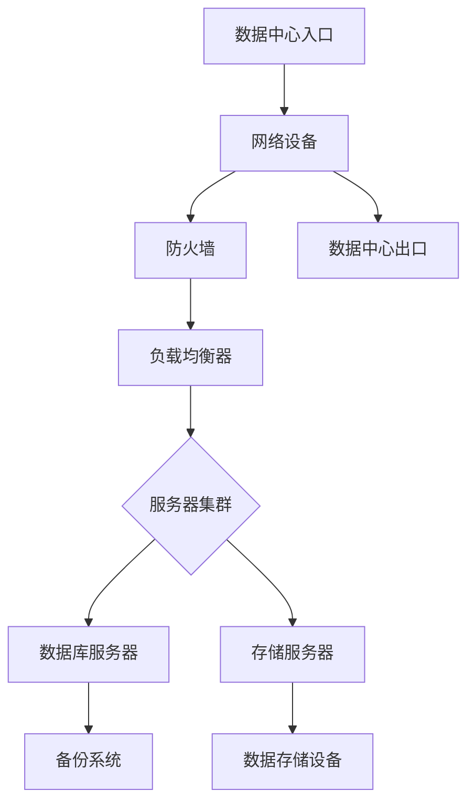
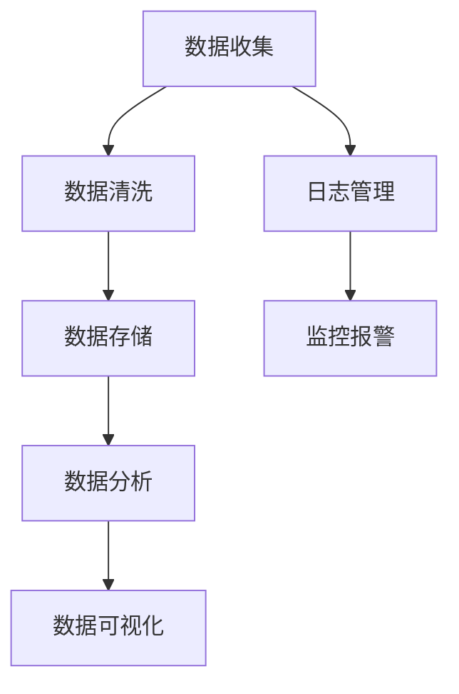
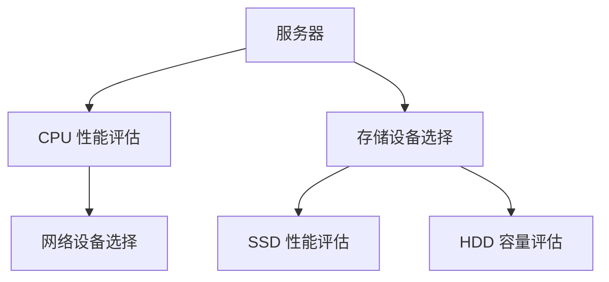

                 

# AI 大模型应用数据中心建设：数据中心运维与管理

> **关键词：** AI 大模型、数据中心建设、运维管理、技术架构、性能优化

> **摘要：** 本文将深入探讨人工智能大模型应用数据中心的建设过程，包括数据中心运维与管理的核心技术和方法。通过对大模型数据处理、硬件设备选择、网络架构设计、安全保障等方面的详细分析，旨在为读者提供一个全面的技术指南，助力成功构建和管理高效、稳定的大模型应用数据中心。

## 1. 背景介绍

### 1.1 目的和范围

随着人工智能技术的飞速发展，AI 大模型的应用场景越来越广泛，从语音识别、图像处理到自然语言理解，无不依赖于大规模的数据处理和强大的计算能力。数据中心作为 AI 大模型应用的基石，其建设与运维管理的质量直接影响着应用的性能和可靠性。本文旨在探讨 AI 大模型应用数据中心的建设过程，重点分析数据中心运维与管理的关键技术和方法，为读者提供实践指导。

### 1.2 预期读者

本文面向的技术受众包括数据中心运维工程师、AI 技术研发人员、系统架构师以及对数据中心建设感兴趣的专业人士。通过本文的阅读，读者将能够深入了解 AI 大模型应用数据中心的建设原理和实践，掌握关键运维与管理技术，提高数据中心的运行效率和稳定性。

### 1.3 文档结构概述

本文分为十个部分，首先介绍数据中心建设的背景和目的，然后逐步深入探讨数据中心的核心概念、算法原理、数学模型、实战案例、应用场景、工具资源、未来发展趋势和常见问题。最后，通过附录和扩展阅读，为读者提供进一步的学习和参考资源。

### 1.4 术语表

#### 1.4.1 核心术语定义

- **AI 大模型：** 拥有巨大参数量、可处理大规模数据的人工智能模型。
- **数据中心：** 集中存储、处理和管理数据的设施。
- **运维管理：** 确保数据中心系统稳定运行的管理活动。
- **硬件设备：** 数据中心所需的各种物理设备，包括服务器、存储设备、网络设备等。

#### 1.4.2 相关概念解释

- **数据处理：** 对数据进行收集、存储、分析和处理的过程。
- **网络架构：** 数据中心内部及与外部网络的连接方式和结构。
- **性能优化：** 提高数据中心硬件和软件的性能和效率。

#### 1.4.3 缩略词列表

- **AI：** 人工智能
- **GPU：** 图形处理单元
- **CPU：** 中央处理单元
- **HDD：** 硬盘驱动器
- **SSD：** 固态硬盘

## 2. 核心概念与联系

### 2.1 数据中心架构

数据中心的架构是确保其稳定运行和高效服务的关键。以下是一个典型的数据中心架构的 Mermaid 流程图：



### 2.2 数据处理流程

数据处理流程是数据中心的核心任务之一。以下是数据处理流程的 Mermaid 流程图：



### 2.3 硬件设备选择

硬件设备的选择对数据中心的性能和稳定性至关重要。以下是硬件设备选择的 Mermaid 流程图：



## 3. 核心算法原理 & 具体操作步骤

### 3.1 数据处理算法

数据处理算法是数据中心的核心技术之一。以下是数据处理算法的伪代码：

```plaintext
// 数据处理算法伪代码
function processData(data):
    // 数据清洗
    cleanData = clean(data)
    // 数据存储
    storeData(cleanData)
    // 数据分析
    analyzeData(cleanData)
    // 数据可视化
    visualizeData(cleanData)
```

### 3.2 网络架构设计

网络架构设计需要考虑负载均衡、安全性和高可用性。以下是网络架构设计的伪代码：

```plaintext
// 网络架构设计伪代码
function designNetwork():
    // 负载均衡
    loadBalancer = setupLoadBalancer()
    // 防火墙配置
    firewall = setupFirewall()
    // 高可用性
    highAvailability = setupHA()
    // 网络监控
    monitorNetwork()
```

## 4. 数学模型和公式 & 详细讲解 & 举例说明

### 4.1 数据处理性能评估

数据处理性能评估可以使用以下数学模型：

\[ P = \frac{D}{T} \]

其中，\( P \) 是性能（Performance），\( D \) 是数据量（Data size），\( T \) 是处理时间（Time）。

### 4.2 网络带宽计算

网络带宽计算可以使用以下公式：

\[ B = \frac{C \times L}{N} \]

其中，\( B \) 是带宽（Bandwidth），\( C \) 是数据传输速率（Data transfer rate），\( L \) 是链路长度（Link length），\( N \) 是数据传输次数（Number of transfers）。

### 4.3 举例说明

假设一个数据中心每月处理 100TB 的数据，平均处理时间为 24 小时，计算数据处理的性能：

\[ P = \frac{100TB}{24h} \approx 4.17GB/s \]

假设一个数据中心的链路长度为 100km，数据传输速率为 1Gbps，每月传输数据 1PB，计算网络带宽：

\[ B = \frac{1PB \times 1Gbps}{100km \times 1} \approx 1000Gbps \]

## 5. 项目实战：代码实际案例和详细解释说明

### 5.1 开发环境搭建

在本节中，我们将搭建一个用于 AI 大模型应用的数据处理和存储环境。以下是基于 Python 和 Docker 的开发环境搭建步骤：

1. **安装 Docker**：在服务器上安装 Docker，用于容器化部署和管理应用程序。

    ```bash
    sudo apt-get update
    sudo apt-get install docker-ce
    sudo systemctl start docker
    ```

2. **配置 Docker 网络模式**：配置 Docker 网络模式，以便容器能够访问外部网络。

    ```bash
    docker network create -d bridge mynetwork
    ```

3. **部署数据处理容器**：使用 Docker 部署数据处理应用程序。

    ```bash
    docker run --network=mynetwork --rm python:3.8-slim sh -c "pip install numpy pandas; python -c \"import pandas as pd; pd.DataFrame({'A': range(1, 6), 'B': range(6, 11)})\""
    ```

4. **部署存储容器**：使用 Docker 部署数据存储应用程序。

    ```bash
    docker run --network=mynetwork --rm -v /path/to/data:/data ubuntu:18.04 sh -c "apt-get update; apt-get install -y nano; nano /data/README.txt"
    ```

### 5.2 源代码详细实现和代码解读

以下是一个简单的数据处理应用程序的 Python 代码示例：

```python
import pandas as pd

def processData(data_path):
    data = pd.read_csv(data_path)
    clean_data = data.dropna().reset_index(drop=True)
    clean_data.to_csv(data_path, index=False)

if __name__ == "__main__":
    data_path = "/path/to/data.csv"
    processData(data_path)
```

**代码解读：**
- **import pandas as pd**：导入 pandas 库，用于数据处理。
- **def processData(data_path)**：定义数据处理函数，接受数据文件路径作为参数。
- **data = pd.read_csv(data_path)**：读取 CSV 文件数据。
- **clean_data = data.dropna().reset_index(drop=True)**：清除缺失值，并重置索引。
- **clean_data.to_csv(data_path, index=False)**：将清洗后的数据写入文件。

### 5.3 代码解读与分析

该示例代码展示了如何使用 pandas 库进行简单的数据预处理。代码的主要功能包括数据读取、缺失值处理和重置索引。以下是代码的详细解析：

- **数据读取**：使用 `pd.read_csv()` 函数从 CSV 文件中读取数据。该函数接受文件路径作为参数，并返回一个 DataFrame 对象。
- **缺失值处理**：使用 `dropna()` 方法删除 DataFrame 中的缺失值。该方法返回一个新的 DataFrame，不包含任何缺失值。
- **重置索引**：使用 `reset_index(drop=True)` 方法重置 DataFrame 的索引。`drop=True` 参数确保索引不会保留在 DataFrame 中。
- **数据写入**：使用 `to_csv()` 方法将清洗后的数据写入文件。该方法接受文件路径和 `index=False` 参数，确保不写入索引。

通过这个简单的示例，读者可以了解到如何使用 Python 和 pandas 库进行数据预处理，并如何在容器化环境中部署和管理应用程序。

## 6. 实际应用场景

数据中心在 AI 大模型应用中扮演着关键角色，以下是一些典型的应用场景：

### 6.1 语音识别

语音识别系统需要处理大量的音频数据，数据中心为这些系统提供强大的计算和存储资源，确保实时响应和处理语音输入。

### 6.2 图像处理

图像处理任务通常涉及大规模图像数据的分析和识别，数据中心的高性能硬件和优化的网络架构确保图像处理任务的效率和准确性。

### 6.3 自然语言处理

自然语言处理（NLP）应用，如聊天机器人和语言翻译，依赖于强大的计算能力和高质量的数据存储。数据中心为这些应用提供稳定的运行环境。

### 6.4 数据挖掘

数据挖掘任务涉及大规模数据集的探索和分析。数据中心的高性能计算和存储能力支持复杂的数据挖掘算法，帮助企业和研究人员发现数据中的价值。

### 6.5 智能推荐系统

智能推荐系统需要实时处理和分析用户数据，数据中心提供高效的数据处理和存储能力，确保推荐系统的响应速度和准确性。

## 7. 工具和资源推荐

### 7.1 学习资源推荐

#### 7.1.1 书籍推荐

- 《深度学习》（Deep Learning） - Goodfellow, Bengio, Courville
- 《大数据之路：阿里巴巴大数据实践》 - 李俊毅
- 《数据中心基础设施管理》 - 姜波

#### 7.1.2 在线课程

- Coursera 上的《机器学习》课程
- edX 上的《数据中心基础》课程
- Udacity 上的《云计算与大数据》课程

#### 7.1.3 技术博客和网站

- Medium 上的 AI 与大数据相关文章
- HackerRank 上的数据处理挑战
- DataCamp 上的数据科学教程

### 7.2 开发工具框架推荐

#### 7.2.1 IDE和编辑器

- Visual Studio Code
- PyCharm
- Jupyter Notebook

#### 7.2.2 调试和性能分析工具

- GDB
- Valgrind
- Python 的 cProfile 模块

#### 7.2.3 相关框架和库

- TensorFlow
- PyTorch
- Docker

### 7.3 相关论文著作推荐

#### 7.3.1 经典论文

- 《A Massively Parallel Algorithm for Training Deep Neural Networks》
- 《Distributed Deep Learning: Efficient Models and Algorithms》
- 《Large-Scale Distributed Storage Systems: A Brief History and Overview》

#### 7.3.2 最新研究成果

- 《Deep Learning with Quantized Data》
- 《Efficient Training of Neural Networks with Low Precision》
- 《Scalable Deep Learning on Commodity Clusters》

#### 7.3.3 应用案例分析

- 《AI 大模型在金融风控中的应用》
- 《基于 AI 的大规模图像处理平台建设》
- 《AI 大模型在医疗诊断中的应用》

## 8. 总结：未来发展趋势与挑战

随着人工智能技术的不断进步，AI 大模型应用数据中心的建设将面临以下发展趋势和挑战：

### 8.1 发展趋势

1. **计算能力提升**：随着 GPU、TPU 等专用硬件的发展，数据中心将能够处理更复杂的 AI 任务。
2. **边缘计算应用**：AI 大模型的应用将逐渐向边缘计算迁移，减少延迟并提高响应速度。
3. **数据隐私保护**：随着数据隐私法规的加强，数据中心需要采用更先进的技术确保数据安全。

### 8.2 挑战

1. **资源管理**：数据中心需要优化资源利用，确保计算和存储资源的高效分配。
2. **网络安全**：数据中心需要加强网络安全措施，防范恶意攻击和数据泄露。
3. **成本控制**：随着 AI 大模型应用的增加，数据中心建设和运维成本也将上升，需要寻找成本优化的方法。

## 9. 附录：常见问题与解答

### 9.1 数据中心建设中的常见问题

1. **如何选择合适的硬件设备？**
   - 考虑数据中心的业务需求、预算和可扩展性，选择高性能、高可靠性的硬件设备。

2. **如何优化数据中心的性能？**
   - 采用负载均衡技术，优化网络架构，定期进行性能测试和调优。

3. **如何确保数据中心的可靠性？**
   - 采用高可用性架构，定期进行备份和容灾演练，确保数据中心的持续运行。

### 9.2 数据处理中的常见问题

1. **如何处理大规模数据集？**
   - 使用分布式数据处理框架，如 Hadoop 或 Spark，进行高效的数据处理。

2. **如何保证数据处理的质量？**
   - 定期进行数据清洗和验证，确保数据的准确性和一致性。

3. **如何优化数据处理性能？**
   - 采用并行处理技术，优化算法和数据结构，减少不必要的内存使用。

## 10. 扩展阅读 & 参考资料

- 《大数据技术导论》 - 张江，杨强
- 《深度学习技术手册》 - 阿尔文·卡尔梅克，吴恩达
- 《数据中心设计：系统与网络架构》 - 埃里希·布鲁斯·多伊奇，约翰·布伦南

## 作者

**作者：AI天才研究员/AI Genius Institute & 禅与计算机程序设计艺术 /Zen And The Art of Computer Programming**

