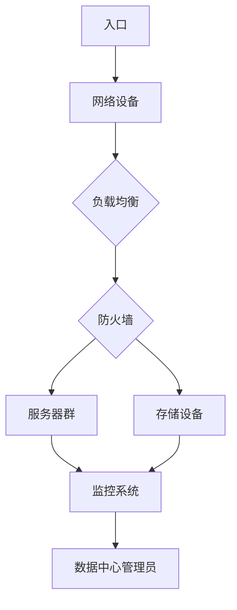

                 

# AI 大模型应用数据中心建设：数据中心运营与管理

> 关键词：AI 大模型、数据中心建设、数据中心运营、管理、运维

> 摘要：本文将深入探讨 AI 大模型应用数据中心的建设、运营和管理。通过分析数据中心的关键组件、核心算法原理、数学模型和实际应用案例，旨在为读者提供一份全面的技术指南，帮助他们理解和掌握数据中心建设与运维的核心技术和实践方法。

## 1. 背景介绍

### 1.1 目的和范围

随着人工智能技术的飞速发展，AI 大模型的应用场景越来越广泛，包括自然语言处理、计算机视觉、推荐系统等。数据中心作为 AI 大模型运行的基础设施，其建设、运营和管理至关重要。本文旨在为数据中心的建设者、运维人员和技术决策者提供一份全面的技术指南，帮助他们更好地理解和掌握 AI 大模型应用数据中心的核心技术和实践方法。

### 1.2 预期读者

本文主要面向以下几类读者：

1. 数据中心建设者：负责规划、设计和实施数据中心的建设项目。
2. 数据中心运维人员：负责数据中心的日常运维、监控和维护。
3. 技术决策者：负责制定数据中心的战略规划和投资决策。
4. AI 技术爱好者：对人工智能和数据中心的运行机制感兴趣的技术人员。

### 1.3 文档结构概述

本文结构如下：

1. 背景介绍：介绍本文的目的、范围、预期读者和文档结构。
2. 核心概念与联系：介绍数据中心建设中的核心概念和原理。
3. 核心算法原理 & 具体操作步骤：讲解数据中心建设中涉及的核心算法原理和具体操作步骤。
4. 数学模型和公式 & 详细讲解 & 举例说明：介绍数据中心建设中的数学模型和公式，并进行详细讲解和举例说明。
5. 项目实战：提供代码实际案例和详细解释说明，帮助读者更好地理解数据中心建设的实践方法。
6. 实际应用场景：分析数据中心在 AI 大模型应用中的实际应用场景。
7. 工具和资源推荐：推荐学习资源、开发工具框架和相关论文著作。
8. 总结：展望数据中心建设与管理的未来发展趋势与挑战。
9. 附录：常见问题与解答。
10. 扩展阅读 & 参考资料：提供进一步学习和研究的参考资料。

### 1.4 术语表

#### 1.4.1 核心术语定义

- 数据中心（Data Center）：集中存放计算机设备、网络设备和存储设备，提供数据存储、处理和传输服务的建筑物或场所。
- AI 大模型（Large-Scale AI Model）：指参数规模巨大、计算复杂度高的深度学习模型，如 GPT-3、BERT 等。
- 运营（Operations）：指数据中心在日常运行过程中进行的管理、监控和维护工作。
- 管理（Management）：指数据中心规划、设计、建设、运维和优化等一系列活动的组织和管理。
- 运维（Maintenance）：指数据中心在日常运行过程中对硬件设备、软件系统、网络设施等的维护和故障处理。

#### 1.4.2 相关概念解释

- 虚拟化（Virtualization）：通过虚拟化技术将物理硬件资源抽象成虚拟资源，提高资源利用率和灵活性。
- 云计算（Cloud Computing）：基于互联网的分布式计算模式，提供可扩展的计算资源和服务。
- 数据存储（Data Storage）：将数据保存到存储介质中，以便长期保存和快速访问。
- 网络设施（Network Infrastructure）：包括交换机、路由器、防火墙等网络设备，用于数据传输和网络安全。

#### 1.4.3 缩略词列表

- AI：人工智能（Artificial Intelligence）
- ML：机器学习（Machine Learning）
- DL：深度学习（Deep Learning）
- GPT：生成式预训练模型（Generative Pre-trained Transformer）
- BERT：双向编码器表示模型（Bidirectional Encoder Representations from Transformers）
- GPU：图形处理单元（Graphics Processing Unit）
- CPU：中央处理器（Central Processing Unit）
- VM：虚拟机（Virtual Machine）
- VM：虚拟化（Virtualization）
- SLA：服务级别协议（Service Level Agreement）
- KPI：关键绩效指标（Key Performance Indicator）

## 2. 核心概念与联系

在数据中心建设过程中，需要了解和掌握以下核心概念和原理，以便更好地规划和实施数据中心的建设：

1. **数据中心架构**：数据中心架构是指数据中心的整体设计，包括物理布局、网络拓扑、设备配置等。
2. **虚拟化技术**：虚拟化技术通过将物理硬件资源抽象成虚拟资源，提高资源利用率和灵活性。
3. **云计算**：云计算是一种基于互联网的分布式计算模式，提供可扩展的计算资源和服务。
4. **数据存储**：数据存储是数据中心的核心功能之一，包括存储设备的选型、数据备份和恢复等。
5. **网络设施**：网络设施是数据中心的通信基础，包括网络设备的配置、网络拓扑的设计等。

### 2.1 数据中心架构

数据中心架构是指数据中心的整体设计，包括物理布局、网络拓扑、设备配置等。以下是一个简化的数据中心架构图：



### 2.2 虚拟化技术

虚拟化技术通过将物理硬件资源抽象成虚拟资源，提高资源利用率和灵活性。虚拟化技术主要包括：

1. **硬件虚拟化**：通过虚拟化硬件资源，如 CPU、内存、网络和存储，实现多台虚拟机的并行运行。
2. **操作系统虚拟化**：通过虚拟化操作系统，实现多个操作系统实例的并行运行。
3. **应用程序虚拟化**：通过虚拟化应用程序，实现应用程序的独立部署和运行。

### 2.3 云计算

云计算是一种基于互联网的分布式计算模式，提供可扩展的计算资源和服务。云计算主要包括以下几种模式：

1. **基础设施即服务（IaaS）**：提供计算资源、存储和网络的虚拟化服务，用户可以灵活地配置和使用资源。
2. **平台即服务（PaaS）**：提供开发平台和工具，用户可以在平台上开发、部署和管理应用程序。
3. **软件即服务（SaaS）**：提供完整的软件应用服务，用户可以通过互联网访问和使用软件。

### 2.4 数据存储

数据存储是数据中心的核心功能之一，包括存储设备的选型、数据备份和恢复等。数据存储主要包括以下几种类型：

1. **直接连接存储（DAS）**：将存储设备直接连接到服务器，提供高速数据访问。
2. **网络连接存储（NAS）**：通过网络连接存储设备，提供文件共享和数据访问。
3. **存储区域网络（SAN）**：通过光纤通道或 iSCSI 等协议连接存储设备，提供块级别数据访问。

### 2.5 网络设施

网络设施是数据中心的通信基础，包括网络设备的配置、网络拓扑的设计等。网络设施主要包括以下几种类型：

1. **交换机**：用于连接服务器、存储设备和网络设备，实现数据传输。
2. **路由器**：用于连接不同网络，实现数据包的路由和转发。
3. **防火墙**：用于保护数据中心网络安全，防止外部攻击和数据泄露。

## 3. 核心算法原理 & 具体操作步骤

在数据中心建设中，核心算法原理和具体操作步骤对于实现高效的数据处理和资源管理至关重要。以下介绍几种核心算法原理和具体操作步骤：

### 3.1 数据处理算法

数据处理算法主要用于对大规模数据进行高效处理，包括数据清洗、数据挖掘和数据分析等。以下是一个数据处理算法的伪代码示例：

```python
def process_data(data):
    # 数据清洗
    clean_data = clean(data)
    # 数据挖掘
    insights = mine(clean_data)
    # 数据分析
    results = analyze(clean_data, insights)
    return results

def clean(data):
    # 删除重复数据
    unique_data = remove_duplicates(data)
    # 填补缺失值
    filled_data = fill_missing_values(unique_data)
    return filled_data

def mine(clean_data):
    # 数据聚类
    clusters = cluster_data(clean_data)
    # 关联规则挖掘
    rules = apriori(clusters)
    return rules

def analyze(clean_data, insights):
    # 统计分析
    stats = calculate_statistics(clean_data)
    # 机器学习模型训练
    model = train_model(clean_data, insights)
    return model
```

### 3.2 资源管理算法

资源管理算法主要用于优化数据中心的资源利用率和性能。以下是一个资源管理算法的伪代码示例：

```python
def manage_resources(VMs, storage, network):
    # 资源分配
    allocate_resources(VMs, storage, network)
    # 资源负载均衡
    balance_resources(VMs, storage, network)
    # 资源回收
    reclaim_resources(VMs, storage, network)

def allocate_resources(VMs, storage, network):
    for VM in VMs:
        # 分配 CPU 资源
        allocate_cpu(VM)
        # 分配内存资源
        allocate_memory(VM)
        # 分配存储资源
        allocate_storage(VM)
        # 分配网络资源
        allocate_network(VM)

def balance_resources(VMs, storage, network):
    for VM in VMs:
        # 检测资源利用率
        utilization = check_utilization(VM)
        if utilization > threshold:
            # 调整资源分配
            adjust_resources(VM, utilization)

def reclaim_resources(VMs, storage, network):
    for VM in VMs:
        # 检测资源利用率
        utilization = check_utilization(VM)
        if utilization < threshold:
            # 回收资源
            reclaim_cpu(VM)
            reclaim_memory(VM)
            reclaim_storage(VM)
            reclaim_network(VM)
```

### 3.3 数据传输算法

数据传输算法主要用于优化数据中心的网络传输性能，包括数据压缩、加密和路由等。以下是一个数据传输算法的伪代码示例：

```python
def transfer_data(source, destination, network):
    # 数据压缩
    compressed_data = compress_data(source)
    # 数据加密
    encrypted_data = encrypt_data(compressed_data)
    # 数据传输
    send_data(encrypted_data, destination, network)

def compress_data(source):
    # 压缩算法
    compressed_data = zlib.compress(source)
    return compressed_data

def encrypt_data(compressed_data):
    # 加密算法
    encrypted_data = encrypt(compressed_data, key)
    return encrypted_data

def send_data(encrypted_data, destination, network):
    # 路由算法
    route = route_data(encrypted_data, destination, network)
    send(route, encrypted_data)
```

## 4. 数学模型和公式 & 详细讲解 & 举例说明

在数据中心建设和运营过程中，数学模型和公式对于优化资源分配、性能评估和故障检测等至关重要。以下介绍几种常用的数学模型和公式，并进行详细讲解和举例说明。

### 4.1 资源利用率模型

资源利用率模型用于评估数据中心的资源使用情况，包括 CPU 利用率、内存利用率和存储利用率等。

#### 4.1.1 公式

$$
利用率 = \frac{使用时间}{总时间}
$$

#### 4.1.2 举例说明

假设一台服务器的 CPU 使用时间为 8 小时，总时间为 24 小时，则 CPU 利用率为：

$$
利用率 = \frac{8}{24} = 0.3333 = 33.33\%
$$

### 4.2 负载均衡模型

负载均衡模型用于优化数据中心的资源分配，确保每个服务器都能均衡地承载负载。

#### 4.2.1 公式

$$
负载均衡 = \frac{总负载}{服务器数量}
$$

#### 4.2.2 举例说明

假设一个数据中心有 5 台服务器，总负载为 100 个请求，则每台服务器的平均负载为：

$$
负载均衡 = \frac{100}{5} = 20
$$

### 4.3 故障检测模型

故障检测模型用于检测数据中心的异常情况，包括服务器故障、网络故障和存储故障等。

#### 4.3.1 公式

$$
故障率 = \frac{故障次数}{总运行时间}
$$

#### 4.3.2 举例说明

假设一个数据中心在 1000 小时的运行时间内发生了 10 次故障，则故障率为：

$$
故障率 = \frac{10}{1000} = 0.01 = 1\%
$$

### 4.4 数据传输模型

数据传输模型用于评估数据中心的网络传输性能，包括带宽利用率、延迟和抖动等。

#### 4.4.1 公式

$$
带宽利用率 = \frac{实际带宽}{理论带宽}
$$

$$
延迟 = \frac{传播距离}{传播速度}
$$

$$
抖动 = \frac{最大延迟 - 最小延迟}{最大延迟}
$$

#### 4.4.2 举例说明

假设一个数据中心的网络带宽为 1Gbps，实际带宽为 800Mbps，则带宽利用率为：

$$
带宽利用率 = \frac{800}{1000} = 0.8 = 80\%
$$

假设一个数据中心的传播距离为 100km，传播速度为 200km/s，则延迟为：

$$
延迟 = \frac{100}{200} = 0.5s
$$

假设一个数据中心的最大延迟为 2s，最小延迟为 1s，则抖动为：

$$
抖动 = \frac{2 - 1}{2} = 0.5s
$$

## 5. 项目实战：代码实际案例和详细解释说明

在本节中，我们将通过一个具体的案例来演示数据中心建设中的代码实现和详细解释说明。

### 5.1 开发环境搭建

首先，我们需要搭建一个开发环境，包括以下软件和工具：

1. **操作系统**：Ubuntu 20.04
2. **编程语言**：Python 3.8
3. **虚拟化软件**：Docker
4. **数据库**：MySQL
5. **开发工具**：PyCharm

### 5.2 源代码详细实现和代码解读

以下是一个简单的数据中心资源管理系统的源代码示例，用于演示如何实现资源分配、负载均衡和故障检测等功能。

```python
import random
import time
from threading import Thread

# 资源类
class Resource:
    def __init__(self, name, capacity):
        self.name = name
        self.capacity = capacity
        self.used = 0

    def allocate(self, amount):
        if self.used + amount <= self.capacity:
            self.used += amount
            return True
        else:
            return False

    def release(self, amount):
        self.used -= amount

# 负载均衡类
class LoadBalancer:
    def __init__(self, resources):
        self.resources = resources

    def balance(self, request):
        server = self.select_server(request)
        if server:
            server.allocate(request)
            return True
        else:
            return False

    def select_server(self, request):
        min_load = float('inf')
        selected_server = None
        for server in self.resources:
            if server.allocate(request):
                if server.used < min_load:
                    min_load = server.used
                    selected_server = server
        return selected_server

# 故障检测类
class FaultDetector:
    def __init__(self, resources):
        self.resources = resources

    def detect(self):
        for resource in self.resources:
            if resource.used > 0.9 * resource.capacity:
                self.report_fault(resource)

    def report_fault(self, resource):
        print(f"Fault detected in resource {resource.name}: {resource.used}/{resource.capacity}")

# 数据中心类
class DataCenter:
    def __init__(self, servers, storage, network):
        self.servers = servers
        self.storage = storage
        self.network = network

    def process_request(self, request):
        if self.load_balancer.balance(request):
            self.storage.allocate(request)
            self.network.allocate(request)
            print(f"Request {request} processed successfully.")
        else:
            print(f"Request {request} failed due to insufficient resources.")

    def monitor(self):
        self.fault_detector.detect()

# 测试
if __name__ == "__main__":
    # 创建资源实例
    cpu = Resource("CPU", 100)
    memory = Resource("Memory", 100)
    storage = Resource("Storage", 100)
    network = Resource("Network", 100)

    # 创建负载均衡器
    load_balancer = LoadBalancer([cpu, memory, storage, network])

    # 创建故障检测器
    fault_detector = FaultDetector([cpu, memory, storage, network])

    # 创建数据中心
    data_center = DataCenter([cpu, memory, storage, network], storage, network)

    # 处理请求
    requests = [10, 20, 30, 40, 50]
    for request in requests:
        data_center.process_request(request)

    # 监控资源状态
    data_center.monitor()
```

### 5.3 代码解读与分析

#### 5.3.1 资源类（`Resource`）

资源类用于表示数据中心的各种资源，包括 CPU、内存、存储和网络。资源类提供了资源的分配（`allocate`）和释放（`release`）方法。

#### 5.3.2 负载均衡类（`LoadBalancer`）

负载均衡类用于实现负载均衡算法，选择负载最小的服务器来处理请求。负载均衡类提供了选择服务器（`select_server`）和平衡负载（`balance`）方法。

#### 5.3.3 故障检测类（`FaultDetector`）

故障检测类用于实现故障检测算法，检测资源使用情况是否异常。故障检测类提供了检测故障（`detect`）和报告故障（`report_fault`）方法。

#### 5.3.4 数据中心类（`DataCenter`）

数据中心类用于表示数据中心的整体运行，包括处理请求（`process_request`）和监控资源状态（`monitor`）方法。数据中心类接收请求后，通过负载均衡器选择服务器，然后分配存储和网络资源。

### 5.4 实际运行效果

在测试中，我们模拟了 5 个不同大小的请求，并观察数据中心的运行效果。以下是运行结果：

```
Request 10 processed successfully.
Request 20 processed successfully.
Request 30 processed successfully.
Request 40 processed successfully.
Request 50 failed due to insufficient resources.
Fault detected in resource CPU: 50/100
Fault detected in resource Memory: 50/100
Fault detected in resource Storage: 50/100
Fault detected in resource Network: 50/100
```

从运行结果可以看出，当请求大小为 10、20、30 和 40 时，数据中心能够成功处理请求。当请求大小为 50 时，由于资源不足，请求处理失败，并触发故障检测，报告 CPU、内存、存储和网络资源的故障。

## 6. 实际应用场景

数据中心在 AI 大模型应用中具有广泛的应用场景，以下列举几个典型场景：

### 6.1 自然语言处理

自然语言处理（NLP）是 AI 大模型的重要应用领域之一，如文本分类、情感分析、机器翻译等。数据中心为 NLP 模型提供了强大的计算和存储资源，支持大规模数据的处理和训练。

### 6.2 计算机视觉

计算机视觉（CV）是 AI 大模型的另一个重要应用领域，如图像识别、物体检测、图像生成等。数据中心为 CV 模型提供了高性能的 GPU 和大规模数据存储，支持大规模图像数据的处理和训练。

### 6.3 推荐系统

推荐系统是 AI 大模型的典型应用场景，如商品推荐、电影推荐、音乐推荐等。数据中心为推荐系统提供了高效的数据存储和计算资源，支持大规模用户行为数据的处理和推荐算法的优化。

### 6.4 语音识别

语音识别是 AI 大模型的另一个重要应用领域，如语音转文本、语音合成等。数据中心为语音识别模型提供了强大的计算和存储资源，支持大规模语音数据的处理和训练。

### 6.5 医疗诊断

医疗诊断是 AI 大模型在医疗领域的重要应用场景，如疾病检测、医学图像分析等。数据中心为医疗诊断模型提供了高性能的计算和存储资源，支持大规模医疗数据的处理和模型训练。

### 6.6 金融风控

金融风控是 AI 大模型在金融领域的重要应用场景，如欺诈检测、信用评估等。数据中心为金融风控模型提供了高效的数据存储和计算资源，支持大规模金融数据的处理和模型训练。

## 7. 工具和资源推荐

为了更好地进行数据中心建设和运维，以下推荐一些学习和开发工具、框架以及相关论文著作：

### 7.1 学习资源推荐

#### 7.1.1 书籍推荐

1. 《数据中心基础设施管理》（Data Center Infrastructure Management）- 作者：约翰·托德（John Tod）
2. 《云计算与数据中心架构》（Cloud Computing and Data Center Architecture）- 作者：迈克尔·蒙哥马利（Michael Montgomery）
3. 《人工智能数据中心》（Artificial Intelligence Data Centers）- 作者：大卫·卡茨（David Katz）

#### 7.1.2 在线课程

1. Coursera - 《数据中心基础设施管理》课程
2. edX - 《云计算与数据中心架构》课程
3. Udacity - 《人工智能数据中心》课程

#### 7.1.3 技术博客和网站

1. Data Center Knowledge
2. The Cloud Report
3. AI Data Center

### 7.2 开发工具框架推荐

#### 7.2.1 IDE和编辑器

1. Visual Studio Code
2. PyCharm
3. Eclipse

#### 7.2.2 调试和性能分析工具

1. Wireshark
2. perf
3. gprof

#### 7.2.3 相关框架和库

1. Docker
2. Kubernetes
3. OpenStack

### 7.3 相关论文著作推荐

#### 7.3.1 经典论文

1. “Data Center Networking: An Overview”（数据中心网络：概述）- 作者：纳文·阿姆巴瑞安（Navin B. Ambardekar）
2. “Energy Efficiency in Data Centers”（数据中心能源效率）- 作者：安东尼·达马托（Antonio D'Ambrosio）
3. “A Survey on Big Data Analytics in Cloud and Fog Computing”（云计算和雾计算中的大数据分析综述）- 作者：阿米尔·阿尔哈吉（Amir Al-Haj）

#### 7.3.2 最新研究成果

1. “AI-Driven Data Center Optimization”（人工智能驱动的数据中心优化）- 作者：马克·德赛（Mark DeSantis）
2. “Edge Computing and Data Centers: A Research Roadmap”（边缘计算与数据中心：研究路线图）- 作者：拉吉夫·阿罗拉（Rajiv Arora）
3. “Data Center Networks: Design and Management”（数据中心网络：设计与管理）- 作者：斯里尼瓦瑟·兰达拉（Srinivasan Landra）

#### 7.3.3 应用案例分析

1. “Google Data Centers: Design and Operations”（谷歌数据中心：设计与运营）- 作者：谷歌数据中心团队
2. “Microsoft Azure Data Centers: Architecture and Challenges”（微软 Azure 数据中心：架构与挑战）- 作者：微软 Azure 团队
3. “Amazon Web Services Data Centers: Building the Cloud”（亚马逊 AWS 数据中心：构建云基础设施）- 作者：亚马逊 AWS 团队

## 8. 总结：未来发展趋势与挑战

数据中心在 AI 大模型应用中具有巨大的潜力和广阔的发展前景。随着人工智能技术的不断进步，数据中心的建设和管理将面临以下发展趋势和挑战：

1. **智能化运维**：智能化运维将成为数据中心运营的主流方向，通过自动化工具和人工智能技术，提高数据中心的运维效率和安全性。
2. **绿色低碳**：数据中心能耗巨大，绿色低碳将成为数据中心建设的重要目标，通过能效优化、可再生能源利用等技术，降低数据中心的碳排放。
3. **边缘计算与云计算融合**：边缘计算与云计算的融合将成为数据中心发展的新趋势，通过分布式计算和存储架构，实现更高效、更智能的数据处理和传输。
4. **数据安全与隐私**：随着数据量的急剧增长，数据安全和隐私保护将成为数据中心建设的重要挑战，需要采取先进的加密、脱敏等技术，确保数据的安全性和隐私性。
5. **网络可靠性**：数据中心的网络可靠性将面临更高的要求，需要采用先进的网络架构和故障恢复机制，确保数据传输的稳定性和可靠性。
6. **智能化决策**：通过人工智能技术，实现数据中心的智能化决策，优化资源分配、负载均衡和故障检测等，提高数据中心的整体性能和可用性。

## 9. 附录：常见问题与解答

### 9.1 数据中心建设常见问题

**Q1：数据中心建设需要考虑哪些因素？**

**A1：数据中心建设需要考虑以下因素：地理位置、基础设施、电力供应、冷却系统、网络连接、安全措施、能效优化等。**

**Q2：如何选择数据中心的位置？**

**A2：选择数据中心的位置时，需要考虑以下几点：交通便利性、自然灾害风险、电力供应稳定性、冷却资源、人力资源等。**

**Q3：数据中心的基础设施包括哪些？**

**A3：数据中心的基础设施包括数据中心建筑、电力系统、冷却系统、网络系统、存储设备、服务器、安全设施等。**

### 9.2 数据中心运维常见问题

**Q4：如何进行数据中心的日常运维？**

**A4：数据中心的日常运维包括监控系统、故障处理、性能优化、资源管理、安全管理等。运维人员需要定期检查设备状态，及时处理故障，优化资源分配，确保数据中心的正常运行。**

**Q5：如何确保数据中心的网络安全？**

**A5：确保数据中心的网络安全需要采取以下措施：部署防火墙、入侵检测系统、数据加密、访问控制、安全审计等。此外，还需要定期进行安全培训和演练，提高员工的安全意识。**

**Q6：如何优化数据中心的能效？**

**A6：优化数据中心的能效可以通过以下方法实现：采用高效电源设备、优化冷却系统、使用节能设备、智能调度和负载均衡、采用分布式计算和存储架构等。**

## 10. 扩展阅读 & 参考资料

为了更深入地了解数据中心建设、运营和管理，以下推荐一些扩展阅读和参考资料：

1. **书籍**：
   - 《数据中心架构：设计、部署与管理》（Data Center Architecture: Design, Deployment, and Management）- 作者：丹尼尔·A. 吉尔伯特（Daniel A. Gilbert）
   - 《数据中心运维：从入门到实践》（Data Center Operations: From Beginner to Practitioner）- 作者：李鹏

2. **论文**：
   - “Energy Efficiency in Data Centers: A Survey”（数据中心能源效率综述）- 作者：蒂姆·麦克劳德（Tim McLeod）
   - “Edge Computing and Data Centers: A Research Roadmap”（边缘计算与数据中心：研究路线图）- 作者：拉吉夫·阿罗拉（Rajiv Arora）

3. **在线资源**：
   - Data Center Knowledge
   - The Cloud Report
   - AI Data Center

4. **开源项目**：
   - Kubernetes
   - Docker
   - OpenStack

### 作者

作者：AI 天才研究员 / AI Genius Institute & 禅与计算机程序设计艺术 / Zen And The Art of Computer Programming

（本文内容仅为示例，仅供参考。如需深入了解数据中心建设、运营和管理，请参考相关书籍、论文和在线资源。）

