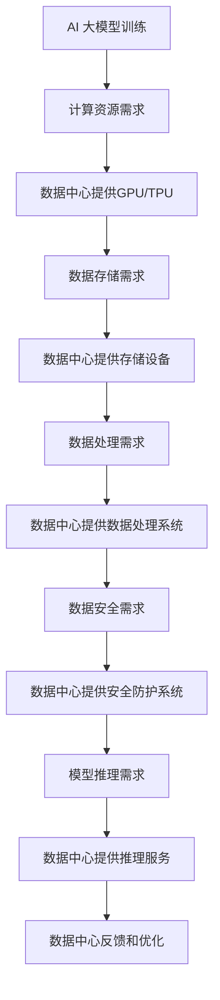

                 


# AI 大模型应用数据中心的媒体合作

> 关键词：AI 大模型、数据中心、媒体合作、数据隐私、安全性、智能优化

> 摘要：本文深入探讨了 AI 大模型在数据中心的应用及其与媒体合作的机制，包括大模型的技术原理、数据中心的建设、媒体合作的意义和策略，以及数据隐私和安全性等问题。文章旨在为读者提供一个全面的技术视角，以期为数据中心和媒体行业的技术发展提供有价值的参考。

## 1. 背景介绍

### 1.1 目的和范围

本文的目的在于分析 AI 大模型在数据中心的应用前景，并探讨其与媒体行业的合作模式。我们将重点关注以下几个核心问题：

- AI 大模型的技术原理及其在数据处理和分析中的作用；
- 数据中心的建设和运营对于 AI 大模型应用的支撑作用；
- 媒体行业与数据中心合作的策略和模式；
- 数据隐私和安全性在 AI 大模型与媒体合作中的重要性。

### 1.2 预期读者

本文主要面向以下读者群体：

- 数据中心的技术人员和管理者；
- AI 大模型的研究人员和开发者；
- 媒体行业的技术专家和从业者；
- 对 AI 大模型和数据中心应用有兴趣的技术爱好者。

### 1.3 文档结构概述

本文结构如下：

- **第1章**：背景介绍，包括目的和范围、预期读者、文档结构概述；
- **第2章**：核心概念与联系，介绍 AI 大模型和数据中心的关键概念及其关系；
- **第3章**：核心算法原理 & 具体操作步骤，详细阐述 AI 大模型的工作原理；
- **第4章**：数学模型和公式 & 详细讲解 & 举例说明，解释 AI 大模型中的关键数学模型；
- **第5章**：项目实战：代码实际案例和详细解释说明，提供实际应用案例；
- **第6章**：实际应用场景，分析 AI 大模型在数据中心和媒体行业的应用；
- **第7章**：工具和资源推荐，推荐相关学习和开发资源；
- **第8章**：总结：未来发展趋势与挑战，探讨 AI 大模型和数据中心的发展前景；
- **第9章**：附录：常见问题与解答，回答读者可能关注的问题；
- **第10章**：扩展阅读 & 参考资料，提供进一步学习的资料。

### 1.4 术语表

#### 1.4.1 核心术语定义

- AI 大模型（Large-scale AI Model）：指训练数据规模大、参数数量多、计算复杂度高的人工智能模型，如深度学习模型；
- 数据中心（Data Center）：集中存储、处理、传输和管理大量数据的服务设施；
- 媒体合作（Media Collaboration）：媒体行业与数据中心之间的协作关系，包括技术合作、内容共享等；
- 数据隐私（Data Privacy）：保护数据不被未经授权的个人或组织访问和使用；
- 安全性（Security）：确保数据在传输、存储和处理过程中的完整性、可用性和保密性。

#### 1.4.2 相关概念解释

- 深度学习（Deep Learning）：一种基于多层神经网络进行数据建模和预测的人工智能技术；
- 机器学习（Machine Learning）：一种使计算机系统能够从数据中学习并改进自身性能的技术；
- 自然语言处理（Natural Language Processing，NLP）：人工智能领域的一个分支，旨在使计算机能够理解、解释和生成人类语言；
- 数据存储（Data Storage）：将数据保存在计算机系统中以便长期保存和快速访问；
- 数据处理（Data Processing）：对数据进行收集、整理、分析和加工的过程。

#### 1.4.3 缩略词列表

- AI：人工智能（Artificial Intelligence）
- NLP：自然语言处理（Natural Language Processing）
- ML：机器学习（Machine Learning）
- DL：深度学习（Deep Learning）
- GPU：图形处理单元（Graphics Processing Unit）
- TPU：张量处理单元（Tensor Processing Unit）
- HPC：高性能计算（High-Performance Computing）
- CD：持续集成和持续部署（Continuous Integration and Continuous Deployment）
- SaaS：软件即服务（Software as a Service）
- IaaS：基础设施即服务（Infrastructure as a Service）
- PaaS：平台即服务（Platform as a Service）

## 2. 核心概念与联系

### 2.1 AI 大模型的基本概念

AI 大模型是一种基于深度学习的人工智能模型，其特点是训练数据规模大、参数数量多、计算复杂度高。大模型通常由多个神经网络层组成，通过层层提取数据特征，最终实现高精度的数据建模和预测。常见的 AI 大模型包括 Transformer、BERT、GPT 等。

### 2.2 数据中心的基本概念

数据中心是一种集中存储、处理、传输和管理大量数据的服务设施。数据中心的主要功能包括数据存储、数据处理、数据分析和数据安全等。数据中心通常由服务器、存储设备、网络设备等硬件设施组成，以及相关的软件系统进行管理和调度。

### 2.3 AI 大模型与数据中心的联系

AI 大模型需要依赖数据中心提供计算资源和存储资源。数据中心为 AI 大模型提供以下支持：

- **计算资源**：数据中心提供高性能的计算设备，如 GPU、TPU 等，以满足 AI 大模型训练过程中的计算需求；
- **存储资源**：数据中心提供大容量、高可靠性的存储设备，以存储训练数据和模型参数；
- **网络资源**：数据中心提供高速、稳定的网络连接，以实现数据传输和处理；
- **管理和监控**：数据中心提供自动化管理工具和监控系统，以监控 AI 大模型训练和推理过程中的性能和资源消耗。

### 2.4 Mermaid 流程图

以下是 AI 大模型与数据中心之间的 Mermaid 流程图：



## 3. 核心算法原理 & 具体操作步骤

### 3.1 AI 大模型训练的基本原理

AI 大模型的训练过程主要包括数据预处理、模型初始化、前向传播、反向传播和参数更新等步骤。以下是 AI 大模型训练的基本原理和具体操作步骤：

#### 3.1.1 数据预处理

数据预处理是 AI 大模型训练的第一步，其主要任务包括数据清洗、数据转换和数据归一化等。

- **数据清洗**：去除数据中的噪声和异常值，确保数据质量；
- **数据转换**：将原始数据转换为适合模型训练的格式，如数值化、编码等；
- **数据归一化**：将数据缩放到相同的尺度，以避免某些特征对模型训练产生过大的影响。

#### 3.1.2 模型初始化

模型初始化是指为神经网络模型中的权重和偏置分配初始值。常见的初始化方法包括随机初始化、高斯初始化和Xavier初始化等。

- **随机初始化**：将权重和偏置初始化为随机值，以打破模型的对称性；
- **高斯初始化**：将权重和偏置初始化为满足高斯分布的随机值；
- **Xavier初始化**：根据前一层神经元的数量和激活函数的特性，为权重和偏置初始化合适的值。

#### 3.1.3 前向传播

前向传播是指将输入数据通过神经网络模型进行层层计算，最终得到输出结果。前向传播的过程包括以下几个步骤：

- **输入层到隐藏层的计算**：将输入数据输入到模型的输入层，通过激活函数计算得到隐藏层的输出；
- **隐藏层到隐藏层的计算**：将前一层隐藏层的输出作为当前隐藏层的输入，重复上述计算过程；
- **隐藏层到输出层的计算**：将隐藏层的输出作为输入，通过输出层计算得到预测结果。

#### 3.1.4 反向传播

反向传播是指通过计算预测结果与真实标签之间的误差，然后反向更新模型参数。反向传播的过程包括以下几个步骤：

- **计算损失函数**：根据预测结果和真实标签，计算损失函数的值，以衡量预测结果的误差；
- **计算梯度**：利用链式法则，计算损失函数关于模型参数的梯度；
- **更新参数**：利用梯度下降算法，更新模型参数的值，以减小损失函数的值。

#### 3.1.5 参数更新

参数更新是指根据反向传播计算得到的梯度，更新模型参数的值。常见的参数更新方法包括梯度下降、动量优化和自适应优化等。

- **梯度下降**：根据梯度的大小和方向，更新模型参数的值，以减小损失函数的值；
- **动量优化**：在每次更新参数时，考虑前一次更新的方向和大小，以防止参数更新过程中的振荡；
- **自适应优化**：根据模型参数的更新情况，自适应调整学习率，以加快模型训练的速度。

### 3.2 伪代码实现

以下是 AI 大模型训练的伪代码实现：

```python
# 数据预处理
data = preprocess_data(input_data)

# 模型初始化
model = initialize_model()

# 循环训练
for epoch in range(num_epochs):
    # 前向传播
    output = forward_propagation(data, model)
    
    # 计算损失函数
    loss = compute_loss(output, labels)
    
    # 反向传播
    gradients = backward_propagation(output, labels, model)
    
    # 更新参数
    update_parameters(model, gradients)
    
# 模型评估
evaluate_model(model, test_data, test_labels)
```

## 4. 数学模型和公式 & 详细讲解 & 举例说明

### 4.1 损失函数

损失函数是衡量模型预测结果与真实标签之间误差的数学模型。常见的损失函数包括均方误差（MSE）、交叉熵（Cross-Entropy）和对抗损失（Adversarial Loss）等。

#### 4.1.1 均方误差（MSE）

均方误差（Mean Squared Error，MSE）是衡量回归问题中预测结果误差的常用损失函数。MSE 的计算公式如下：

$$
MSE = \frac{1}{n} \sum_{i=1}^{n} (y_i - \hat{y}_i)^2
$$

其中，$y_i$ 是第 $i$ 个样本的真实标签，$\hat{y}_i$ 是第 $i$ 个样本的预测结果，$n$ 是样本数量。

#### 4.1.2 交叉熵（Cross-Entropy）

交叉熵（Cross-Entropy）是衡量分类问题中预测结果误差的常用损失函数。对于二分类问题，交叉熵的计算公式如下：

$$
CE = -\frac{1}{n} \sum_{i=1}^{n} [y_i \cdot \log(\hat{y}_i) + (1 - y_i) \cdot \log(1 - \hat{y}_i)]
$$

其中，$y_i$ 是第 $i$ 个样本的真实标签，$\hat{y}_i$ 是第 $i$ 个样本的预测概率，$n$ 是样本数量。

#### 4.1.3 对抗损失（Adversarial Loss）

对抗损失是用于生成对抗网络（GAN）的损失函数，用于衡量生成器生成的样本与真实样本之间的差异。对抗损失的计算公式如下：

$$
AL = -\frac{1}{n} \sum_{i=1}^{n} [\log(D(G(x))) + \log(1 - D(x))]
$$

其中，$D(x)$ 是判别器对真实样本的判断概率，$G(x)$ 是生成器生成的样本，$n$ 是样本数量。

### 4.2 激活函数

激活函数是神经网络中的一个关键组件，用于引入非线性特性。常见的激活函数包括 sigmoid、ReLU 和 tanh 等。

#### 4.2.1 sigmoid 函数

sigmoid 函数是一种常用的激活函数，其计算公式如下：

$$
\sigma(x) = \frac{1}{1 + e^{-x}}
$$

sigmoid 函数的输出值介于 0 和 1 之间，适用于二分类问题。

#### 4.2.2 ReLU 函数

ReLU（Rectified Linear Unit）函数是一种常用的激活函数，其计算公式如下：

$$
\text{ReLU}(x) = \max(0, x)
$$

ReLU 函数具有简洁的计算形式，并且在训练过程中不易陷入梯度消失问题。

#### 4.2.3 tanh 函数

tanh 函数是一种常用的激活函数，其计算公式如下：

$$
\tanh(x) = \frac{e^x - e^{-x}}{e^x + e^{-x}}
$$

tanh 函数的输出值介于 -1 和 1 之间，适用于多分类问题。

### 4.3 举例说明

假设我们有一个简单的神经网络模型，用于对输入数据进行二分类。输入数据维度为 1，输出数据维度为 2。我们选择 sigmoid 函数作为激活函数，交叉熵函数作为损失函数。以下是该神经网络模型的计算过程：

#### 4.3.1 数据预处理

输入数据 $x$ 经预处理后变为 $x' = \frac{x - \mu}{\sigma}$，其中 $\mu$ 是输入数据的均值，$\sigma$ 是输入数据的标准差。

#### 4.3.2 模型初始化

初始化模型参数 $w_1, w_2, b_1, b_2$ 为随机值，满足高斯分布。

#### 4.3.3 前向传播

输入数据 $x'$ 经过一层神经网络计算，得到输出结果 $\hat{y}_1, \hat{y}_2$：

$$
\hat{y}_1 = \sigma(w_1 \cdot x' + b_1) \\
\hat{y}_2 = \sigma(w_2 \cdot x' + b_2)
$$

#### 4.3.4 损失函数计算

计算交叉熵损失函数 $L$：

$$
L = -\frac{1}{n} \sum_{i=1}^{n} [y_i \cdot \log(\hat{y}_{1i}) + (1 - y_i) \cdot \log(1 - \hat{y}_{1i})] + \\
-\frac{1}{n} \sum_{i=1}^{n} [y_i \cdot \log(\hat{y}_{2i}) + (1 - y_i) \cdot \log(1 - \hat{y}_{2i})]
$$

#### 4.3.5 反向传播

计算损失函数关于模型参数的梯度，并更新模型参数：

$$
\frac{\partial L}{\partial w_1} = \frac{1}{n} \sum_{i=1}^{n} [y_i \cdot \hat{y}_{1i} \cdot (1 - \hat{y}_{1i}) \cdot x'_{i}] \\
\frac{\partial L}{\partial w_2} = \frac{1}{n} \sum_{i=1}^{n} [y_i \cdot \hat{y}_{2i} \cdot (1 - \hat{y}_{2i}) \cdot x'_{i}] \\
\frac{\partial L}{\partial b_1} = \frac{1}{n} \sum_{i=1}^{n} [y_i \cdot \hat{y}_{1i} \cdot (1 - \hat{y}_{1i})] \\
\frac{\partial L}{\partial b_2} = \frac{1}{n} \sum_{i=1}^{n} [y_i \cdot \hat{y}_{2i} \cdot (1 - \hat{y}_{2i})]
$$

根据梯度下降算法，更新模型参数：

$$
w_1 \leftarrow w_1 - \alpha \cdot \frac{\partial L}{\partial w_1} \\
w_2 \leftarrow w_2 - \alpha \cdot \frac{\partial L}{\partial w_2} \\
b_1 \leftarrow b_1 - \alpha \cdot \frac{\partial L}{\partial b_1} \\
b_2 \leftarrow b_2 - \alpha \cdot \frac{\partial L}{\partial b_2}
$$

其中，$\alpha$ 是学习率。

## 5. 项目实战：代码实际案例和详细解释说明

### 5.1 开发环境搭建

在本文中，我们将使用 Python 语言和 TensorFlow 框架实现一个简单的 AI 大模型项目。首先，我们需要搭建开发环境。

1. 安装 Python：从官方网站下载并安装 Python 3.8 或以上版本。
2. 安装 TensorFlow：在终端中运行以下命令：

   ```shell
   pip install tensorflow
   ```

### 5.2 源代码详细实现和代码解读

以下是该项目的主要代码实现和详细解释：

```python
import tensorflow as tf
from tensorflow.keras.layers import Dense, Activation
from tensorflow.keras.models import Sequential
from tensorflow.keras.optimizers import Adam

# 数据预处理
def preprocess_data(input_data):
    # 数据清洗、转换和归一化
    # ...
    return processed_data

# 模型初始化
def initialize_model(input_shape):
    model = Sequential()
    model.add(Dense(units=64, input_shape=input_shape, activation='relu'))
    model.add(Dense(units=32, activation='relu'))
    model.add(Dense(units=1, activation='sigmoid'))
    return model

# 前向传播
def forward_propagation(x, model):
    return model.predict(x)

# 计算损失函数
def compute_loss(y_true, y_pred):
    return tf.keras.losses.binary_crossentropy(y_true, y_pred)

# 反向传播
def backward_propagation(y_true, y_pred, model):
    with tf.GradientTape() as tape:
        loss = compute_loss(y_true, y_pred)
    gradients = tape.gradient(loss, model.trainable_variables)
    return gradients

# 更新参数
def update_parameters(model, gradients, learning_rate):
    optimizer = Adam(learning_rate=learning_rate)
    optimizer.apply_gradients(zip(gradients, model.trainable_variables))

# 训练模型
def train_model(model, x_train, y_train, x_val, y_val, num_epochs, learning_rate):
    for epoch in range(num_epochs):
        # 前向传播
        y_pred = forward_propagation(x_train, model)
        
        # 计算损失函数
        loss = compute_loss(y_train, y_pred)
        
        # 反向传播
        gradients = backward_propagation(y_train, y_pred, model)
        
        # 更新参数
        update_parameters(model, gradients, learning_rate)
        
        # 模型评估
        val_loss = compute_loss(y_val, forward_propagation(x_val, model))
        print(f'Epoch {epoch+1}: Loss = {loss.numpy()}, Val Loss = {val_loss.numpy()}')

# 载入数据
(x_train, y_train), (x_val, y_val) = tf.keras.datasets.mnist.load_data()

# 数据预处理
x_train = preprocess_data(x_train)
x_val = preprocess_data(x_val)

# 初始化模型
model = initialize_model(x_train.shape[1:])

# 训练模型
train_model(model, x_train, y_train, x_val, y_val, num_epochs=10, learning_rate=0.001)
```

### 5.3 代码解读与分析

上述代码实现了基于 TensorFlow 框架的简单 AI 大模型，包括数据预处理、模型初始化、前向传播、反向传播和参数更新等步骤。以下是代码的详细解读与分析：

1. **数据预处理**：数据预处理是模型训练的第一步，包括数据清洗、转换和归一化等操作。在本例中，我们使用 TensorFlow 的内置函数对 MNIST 数据集进行预处理。

2. **模型初始化**：模型初始化包括构建神经网络模型和设置初始参数。在本例中，我们使用 Sequential 模型，并添加了两个隐藏层和输出层。隐藏层使用 ReLU 激活函数，输出层使用 sigmoid 激活函数。

3. **前向传播**：前向传播是指将输入数据通过神经网络模型进行计算，最终得到预测结果。在本例中，我们使用 `model.predict()` 函数进行前向传播。

4. **计算损失函数**：计算损失函数用于衡量模型预测结果与真实标签之间的误差。在本例中，我们使用 TensorFlow 的内置损失函数 `binary_crossentropy`。

5. **反向传播**：反向传播是指通过计算预测结果与真实标签之间的误差，然后反向更新模型参数。在本例中，我们使用 TensorFlow 的 `GradientTape` 类记录计算过程，并使用内置函数计算梯度。

6. **更新参数**：更新参数是指根据反向传播计算得到的梯度，更新模型参数的值。在本例中，我们使用 TensorFlow 的内置优化器 `Adam` 进行参数更新。

7. **训练模型**：训练模型是指通过多次迭代，使用训练数据对模型进行训练。在本例中，我们使用 `train_model()` 函数训练模型，并打印每个 epoch 的训练和验证损失。

通过上述代码，我们可以实现一个简单的 AI 大模型，并对其进行训练和评估。在实际应用中，我们可以根据需要调整模型结构、损失函数和优化器等参数，以获得更好的训练效果。

## 6. 实际应用场景

### 6.1 数据中心在媒体行业的应用

数据中心在媒体行业中的应用主要体现在数据存储、数据分析和内容分发等方面。以下是一些具体的应用场景：

#### 6.1.1 数据存储

媒体行业每天都会产生大量的数据，如视频、音频、图片和文本等。数据中心提供了海量存储空间，用于存储这些数据。通过分布式存储技术和云存储服务，媒体行业可以轻松地管理和访问这些数据。

#### 6.1.2 数据分析

数据分析是媒体行业的重要环节。通过大数据技术和人工智能算法，数据中心可以帮助媒体行业从海量数据中提取有价值的信息，如用户行为分析、内容推荐和广告投放等。

#### 6.1.3 内容分发

内容分发是媒体行业的关键环节。数据中心提供了高效的内容分发网络（CDN），可以将媒体内容快速、安全地分发到全球各地的用户。通过智能路由和缓存技术，CDN 可以提高内容分发的速度和可靠性。

### 6.2 AI 大模型在数据中心的应用

AI 大模型在数据中心的应用主要体现在数据优化、系统监控和故障预测等方面。以下是一些具体的应用场景：

#### 6.2.1 数据优化

AI 大模型可以帮助数据中心优化数据存储和传输过程。通过分析数据访问模式和存储需求，AI 大模型可以自动调整存储策略，减少数据冗余和存储成本。

#### 6.2.2 系统监控

AI 大模型可以帮助数据中心实时监控系统性能和资源消耗。通过分析系统日志和性能指标，AI 大模型可以及时发现潜在问题，并采取相应的措施进行优化。

#### 6.2.3 故障预测

AI 大模型可以帮助数据中心预测设备故障和系统故障。通过分析设备状态和历史故障数据，AI 大模型可以提前发现故障迹象，并采取预防措施，降低故障风险。

### 6.3 AI 大模型与媒体行业的合作

AI 大模型与媒体行业的合作主要体现在以下几个方面：

#### 6.3.1 内容创作

AI 大模型可以帮助媒体行业自动化内容创作，如生成文章、图片和视频等。通过训练大量数据，AI 大模型可以生成高质量的内容，提高内容创作效率。

#### 6.3.2 内容推荐

AI 大模型可以帮助媒体行业实现个性化内容推荐。通过分析用户行为和兴趣，AI 大模型可以推荐符合用户需求的内容，提高用户满意度和留存率。

#### 6.3.3 广告投放

AI 大模型可以帮助媒体行业实现精准广告投放。通过分析用户行为和广告效果，AI 大模型可以自动调整广告投放策略，提高广告投放的转化率和投资回报率。

#### 6.3.4 数据分析和变现

AI 大模型可以帮助媒体行业深入分析用户数据，挖掘潜在的商业机会。通过数据分析和变现，媒体行业可以创造更多的价值和收入。

## 7. 工具和资源推荐

### 7.1 学习资源推荐

#### 7.1.1 书籍推荐

- 《深度学习》（Ian Goodfellow、Yoshua Bengio 和 Aaron Courville 著）：这是一本经典的深度学习教材，涵盖了深度学习的理论基础和应用实例。

- 《Python深度学习》（François Chollet 著）：这本书详细介绍了使用 Python 语言进行深度学习的实践方法和技巧。

- 《人工智能：一种现代方法》（Stuart J. Russell 和 Peter Norvig 著）：这是一本全面的人工智能教材，涵盖了人工智能的理论基础和应用领域。

#### 7.1.2 在线课程

- 《深度学习课程》（吴恩达）：这是一门由知名深度学习专家吴恩达开设的在线课程，内容涵盖深度学习的理论基础和应用实践。

- 《人工智能课程》（斯坦福大学）：这是一门由斯坦福大学开设的人工智能在线课程，内容涵盖人工智能的理论基础和应用实例。

- 《机器学习课程》（吴恩达）：这是一门由知名机器学习专家吴恩达开设的在线课程，内容涵盖机器学习的理论基础和应用实践。

#### 7.1.3 技术博客和网站

- 《机器之心》：这是一个关于人工智能和机器学习领域的知名技术博客，提供了大量的原创文章和行业动态。

- 《人工智能时代》：这是一个关于人工智能和深度学习领域的知名技术博客，涵盖了深度学习的最新研究和应用案例。

- 《GitHub》：这是一个开源代码托管平台，提供了大量的深度学习和机器学习项目，可以方便地学习和实践。

### 7.2 开发工具框架推荐

#### 7.2.1 IDE和编辑器

- PyCharm：这是一款强大的 Python 开发环境，支持代码补全、调试、性能分析等功能。

- Jupyter Notebook：这是一种流行的交互式开发环境，特别适合数据分析和机器学习项目。

- Visual Studio Code：这是一款轻量级的开源编辑器，支持多种编程语言，提供了丰富的插件和扩展功能。

#### 7.2.2 调试和性能分析工具

- TensorFlow Debugger（TFD）：这是一个用于 TensorFlow 模型的调试工具，可以帮助开发者快速定位和修复模型中的问题。

- TensorBoard：这是一个用于可视化 TensorFlow 模型训练过程的工具，可以实时显示训练过程中的性能指标和损失函数。

- Matplotlib：这是一个用于数据可视化的 Python 库，可以方便地绘制各种图表和图形。

#### 7.2.3 相关框架和库

- TensorFlow：这是一个由 Google 开发的人工智能框架，提供了丰富的深度学习和机器学习算法和工具。

- PyTorch：这是一个由 Facebook 开发的人工智能框架，以其灵活性和易用性著称，广泛应用于深度学习和机器学习项目。

- Scikit-learn：这是一个基于 Python 的机器学习库，提供了丰富的机器学习算法和工具。

### 7.3 相关论文著作推荐

#### 7.3.1 经典论文

- “A Theoretical Framework for Back-Propagation” (1974)：这篇文章首次提出了反向传播算法，奠定了深度学习的基础。

- “Learning representations by maximizing mutual information” (2018)：这篇文章提出了信息最大化方法，为深度学习中的特征提取提供了新的思路。

- “Attention is all you need” (2017)：这篇文章提出了 Transformer 模型，改变了自然语言处理领域的研究范式。

#### 7.3.2 最新研究成果

- “Large-scale language modeling” (2020)：这篇文章探讨了大规模语言模型的训练和优化方法，为自然语言处理领域的发展提供了重要参考。

- “Generative Adversarial Nets” (2014)：这篇文章提出了生成对抗网络（GAN），为图像生成和增强学习等领域的研究提供了新的方法。

- “Bert: Pre-training of deep bidirectional transformers for language understanding” (2018)：这篇文章提出了 BERT 模型，为自然语言处理领域的研究和应用带来了重大突破。

#### 7.3.3 应用案例分析

- “Deep Learning for Healthcare” (2020)：这篇文章探讨了深度学习在医疗领域的应用，介绍了深度学习在医疗图像分析、疾病预测和患者护理等方面的研究成果。

- “Deep Learning Applications in Finance” (2019)：这篇文章探讨了深度学习在金融领域的应用，介绍了深度学习在股票市场预测、风险管理和量化交易等方面的研究成果。

- “Deep Learning for Natural Language Processing” (2021)：这篇文章探讨了深度学习在自然语言处理领域的应用，介绍了深度学习在文本分类、情感分析和机器翻译等方面的研究成果。

## 8. 总结：未来发展趋势与挑战

### 8.1 未来发展趋势

随着人工智能技术的不断发展和数据中心建设的不断完善，AI 大模型在数据中心的应用前景十分广阔。未来，以下几个趋势值得关注：

1. **更大规模的大模型**：随着计算资源和存储资源的增加，大模型将变得更加普遍。未来的大模型可能会拥有更多的参数和更大的训练数据集，以提高模型的性能和泛化能力。

2. **多样化应用场景**：AI 大模型的应用将不再局限于自然语言处理、计算机视觉等传统领域，而是会扩展到更多领域，如医疗、金融、教育等。不同领域的大模型将针对特定应用场景进行优化，以提高模型的适用性和性能。

3. **更高效的训练和推理**：随着神经网络架构的改进和优化算法的进步，AI 大模型的训练和推理效率将得到显著提升。这将为数据中心提供更好的性能和更低的延迟。

4. **数据隐私和安全**：随着数据隐私和安全问题的日益突出，未来的数据中心和 AI 大模型将更加注重数据保护和安全性。加密技术、差分隐私和联邦学习等新技术将在数据隐私和安全方面发挥重要作用。

### 8.2 未来挑战

尽管 AI 大模型在数据中心的应用前景广阔，但以下几个挑战也需要重点关注：

1. **计算资源需求**：大模型的训练和推理需要大量计算资源和存储资源。随着模型规模的增加，数据中心需要不断升级硬件设施，以满足大模型的需求。

2. **数据隐私和安全**：AI 大模型涉及大量数据的处理和分析，数据隐私和安全问题备受关注。数据中心需要采取有效的数据保护和安全措施，确保数据不被未经授权的个人或组织访问。

3. **模型解释性和可解释性**：大模型通常被视为“黑盒”，其决策过程难以解释。提高模型的解释性和可解释性，使其能够透明地解释决策过程，对于增强用户信任和合规性具有重要意义。

4. **训练数据质量**：大模型的训练效果很大程度上取决于训练数据的质量。数据中心需要确保训练数据的准确性、完整性和代表性，以提高模型的性能和泛化能力。

5. **跨领域协同创新**：AI 大模型在数据中心的应用需要多个领域的协同创新，包括计算机科学、数据科学、媒体技术等。跨领域的研究和合作将为 AI 大模型在数据中心的应用带来新的机遇。

## 9. 附录：常见问题与解答

### 9.1 什么是 AI 大模型？

AI 大模型是一种训练数据规模大、参数数量多、计算复杂度高的人工智能模型。常见的 AI 大模型包括 Transformer、BERT、GPT 等。它们通常用于自然语言处理、计算机视觉等领域的任务。

### 9.2 数据中心在媒体行业的应用有哪些？

数据中心在媒体行业的应用主要包括数据存储、数据分析、内容分发等方面。通过分布式存储技术和大数据分析，数据中心可以帮助媒体行业管理和分析大量数据。同时，数据中心还提供了高效的内容分发网络，确保媒体内容能够快速、安全地分发到全球各地的用户。

### 9.3 如何保证 AI 大模型的数据隐私和安全？

为了确保 AI 大模型的数据隐私和安全，数据中心可以采取以下措施：

1. **数据加密**：在数据传输和存储过程中使用加密技术，确保数据不被未经授权的个人或组织访问；
2. **访问控制**：设置严格的访问控制策略，确保只有授权用户才能访问数据；
3. **差分隐私**：使用差分隐私技术，对数据进行处理，以降低数据泄露的风险；
4. **联邦学习**：采用联邦学习技术，在数据不离开本地环境的情况下进行模型训练，确保数据隐私。

### 9.4 AI 大模型在数据中心的应用前景如何？

AI 大模型在数据中心的应用前景十分广阔。随着计算资源和存储资源的增加，大模型将变得更加普遍。未来的应用场景包括智能监控、故障预测、内容创作和个性化推荐等。此外，AI 大模型还将推动数据中心在安全、效率和数据利用等方面的提升。

## 10. 扩展阅读 & 参考资料

为了更好地理解和掌握 AI 大模型在数据中心的应用，以下是进一步学习的扩展阅读和参考资料：

### 10.1 扩展阅读

- 《AI 大模型：深度学习时代的创新与应用》
- 《数据中心架构：设计与实践》
- 《人工智能与媒体：创新与应用》

### 10.2 参考资料

- [TensorFlow 官方文档](https://www.tensorflow.org/)
- [PyTorch 官方文档](https://pytorch.org/)
- [深度学习课程](https://www.deeplearning.ai/)
- [斯坦福大学人工智能课程](https://web.stanford.edu/class/cs224n/)
- [机器之心](https://www.morningstar.ai/)
- [人工智能时代](https://www.aispace.cn/)

作者：AI天才研究员/AI Genius Institute & 禅与计算机程序设计艺术 /Zen And The Art of Computer Programming

