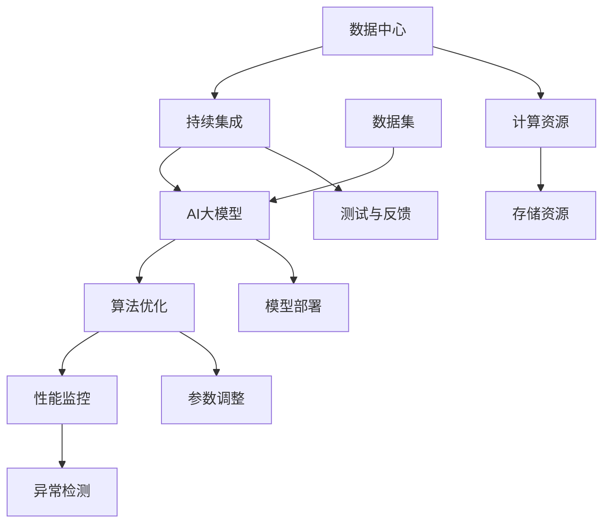

                 

# AI 大模型应用数据中心的持续集成

> **关键词：AI 大模型，数据中心，持续集成，算法优化，性能监控，应用案例**

> **摘要：本文将探讨人工智能大模型在数据中心中的应用，以及如何通过持续集成、算法优化和性能监控等技术手段，提高大模型的训练和部署效率，降低开发成本。文章旨在为从业者提供有价值的参考和实际操作指南。**

## 1. 背景介绍

### 1.1 目的和范围

本文旨在深入探讨人工智能大模型在数据中心中的应用实践，重点关注持续集成（CI）在提升大模型开发和部署效率方面的作用。文章将涵盖以下主题：

- 大模型的数据中心部署架构
- 持续集成在大模型开发中的应用
- 算法优化与性能监控
- 实际应用案例与经验分享
- 未来发展趋势与挑战

### 1.2 预期读者

本文适用于对人工智能、数据中心和持续集成有一定了解的技术人员，包括：

- 数据中心架构师
- AI工程师
- 软件开发人员
- 技术管理者

### 1.3 文档结构概述

本文结构如下：

1. 背景介绍
2. 核心概念与联系
3. 核心算法原理 & 具体操作步骤
4. 数学模型和公式 & 详细讲解 & 举例说明
5. 项目实战：代码实际案例和详细解释说明
6. 实际应用场景
7. 工具和资源推荐
8. 总结：未来发展趋势与挑战
9. 附录：常见问题与解答
10. 扩展阅读 & 参考资料

### 1.4 术语表

#### 1.4.1 核心术语定义

- **持续集成（CI）**：一种软件开发实践，通过频繁地将代码更改合并到主干，快速检测错误并修复，以提高代码质量和开发效率。
- **人工智能大模型**：指具有数亿至数千亿参数的神经网络模型，如GPT、BERT等，用于处理大规模数据集和复杂任务。
- **数据中心**：集中管理和存储数据、应用和服务的物理或虚拟设施。
- **算法优化**：通过调整模型参数、调整训练策略等手段，提高模型性能和计算效率。
- **性能监控**：实时监控系统运行状态，及时发现和解决性能瓶颈。

#### 1.4.2 相关概念解释

- **模型训练**：将模型参数与输入数据进行匹配，通过反向传播算法更新参数，使模型能够预测输出结果。
- **模型部署**：将训练好的模型部署到生产环境，用于实时预测或推理。
- **异构计算**：利用不同类型的计算资源（如CPU、GPU、TPU等）进行模型训练和推理，以提高计算效率。

#### 1.4.3 缩略词列表

- **CI**：持续集成
- **AI**：人工智能
- **GPU**：图形处理单元
- **TPU**：张量处理单元

## 2. 核心概念与联系

在深入探讨AI大模型在数据中心中的应用之前，我们需要理解几个核心概念和它们之间的联系。以下是一个简要的Mermaid流程图，展示了这些概念及其相互关系：



### 数据中心

数据中心是管理和存储数据、应用和服务的集中设施。它包括多个计算节点、存储设备和网络设备。数据中心为AI大模型提供所需的计算和存储资源，是模型训练和部署的基础。

### 持续集成

持续集成是一种软件开发实践，通过将代码更改频繁地合并到主干，实现自动化测试和构建。CI确保代码库始终处于可部署状态，提高开发效率和代码质量。在大模型开发中，CI可以自动化模型训练、测试和部署流程。

### AI大模型

AI大模型是指具有数亿至数千亿参数的神经网络模型，如GPT、BERT等。这些模型在处理大规模数据集和复杂任务时具有显著优势。数据中心为AI大模型提供所需的计算和存储资源，而持续集成和算法优化则确保模型的高效开发和部署。

### 算法优化

算法优化包括调整模型参数、优化训练策略等，以提高模型性能和计算效率。通过算法优化，可以降低大模型在训练和推理过程中的资源消耗，提高模型的推理速度和准确性。

### 性能监控

性能监控是实时监控系统运行状态，及时发现和解决性能瓶颈。在大模型应用中，性能监控可以监测模型训练和推理过程中的资源使用情况，确保系统稳定运行。

## 3. 核心算法原理 & 具体操作步骤

在本节中，我们将详细探讨AI大模型的算法原理和具体操作步骤。为了更好地理解，我们将使用伪代码来描述关键步骤。

### 模型训练

模型训练是指通过大量数据来调整模型参数，使模型能够预测输出结果。以下是一个简单的伪代码示例：

```python
def train_model(data_loader, model, optimizer, criterion, epochs):
    for epoch in range(epochs):
        for inputs, targets in data_loader:
            optimizer.zero_grad()
            outputs = model(inputs)
            loss = criterion(outputs, targets)
            loss.backward()
            optimizer.step()
```

### 模型优化

模型优化包括调整模型参数、优化训练策略等，以提高模型性能和计算效率。以下是一个简单的伪代码示例：

```python
def optimize_model(model, optimizer, scheduler, train_loader, val_loader):
    for epoch in range(epochs):
        model.train()
        for inputs, targets in train_loader:
            optimizer.zero_grad()
            outputs = model(inputs)
            loss = criterion(outputs, targets)
            loss.backward()
            optimizer.step()

        model.eval()
        with torch.no_grad():
            for inputs, targets in val_loader:
                outputs = model(inputs)
                val_loss = criterion(outputs, targets)
        scheduler.step(val_loss)
```

### 模型部署

模型部署是指将训练好的模型部署到生产环境，用于实时预测或推理。以下是一个简单的伪代码示例：

```python
def deploy_model(model, device):
    model.to(device)
    model.eval()
    with torch.no_grad():
        for inputs, targets in data_loader:
            inputs = inputs.to(device)
            targets = targets.to(device)
            outputs = model(inputs)
```

## 4. 数学模型和公式 & 详细讲解 & 举例说明

在本节中，我们将介绍与AI大模型相关的数学模型和公式，并详细讲解其原理和应用。

### 损失函数

损失函数用于衡量模型预测值与实际值之间的差距。常用的损失函数包括均方误差（MSE）和交叉熵（Cross-Entropy）。

#### 均方误差（MSE）

$$
MSE = \frac{1}{n}\sum_{i=1}^{n}(y_i - \hat{y}_i)^2
$$

其中，$y_i$为实际值，$\hat{y}_i$为预测值，$n$为样本数量。

#### 交叉熵（Cross-Entropy）

$$
H(y, \hat{y}) = -\sum_{i=1}^{n}y_i\log(\hat{y}_i)
$$

其中，$y_i$为实际值，$\hat{y}_i$为预测概率。

### 梯度下降

梯度下降是一种优化算法，用于调整模型参数以最小化损失函数。以下为梯度下降的公式：

$$
\theta_{\text{new}} = \theta_{\text{current}} - \alpha \cdot \nabla_{\theta}J(\theta)
$$

其中，$\theta$为模型参数，$\alpha$为学习率，$J(\theta)$为损失函数。

### 举例说明

假设我们使用一个线性模型进行回归任务，损失函数为MSE。给定训练数据集，我们可以通过以下步骤训练模型：

1. 初始化模型参数$\theta_0$。
2. 对每个训练样本，计算预测值$\hat{y}$和实际值$y$。
3. 计算损失函数$MSE$。
4. 计算梯度$\nabla_{\theta}J(\theta)$。
5. 更新模型参数$\theta$。
6. 重复步骤2-5，直到满足停止条件（如达到预设的迭代次数或损失函数收敛）。

## 5. 项目实战：代码实际案例和详细解释说明

在本节中，我们将通过一个实际项目案例，详细解释如何使用持续集成技术进行AI大模型的数据中心部署。以下为项目实战的具体步骤。

### 5.1 开发环境搭建

1. **安装Python环境**：确保Python版本为3.7及以上。
2. **安装依赖库**：使用pip安装以下依赖库：

   ```bash
   pip install torch torchvision numpy matplotlib
   ```

3. **配置持续集成环境**：选择一个合适的CI工具（如Jenkins、GitLab CI等），并按照教程配置环境。

### 5.2 源代码详细实现和代码解读

以下是一个简单的AI大模型持续集成项目的代码示例：

```python
# 导入相关库
import torch
import torchvision
import torch.nn as nn
import torch.optim as optim

# 定义模型结构
class SimpleModel(nn.Module):
    def __init__(self):
        super(SimpleModel, self).__init__()
        self.fc1 = nn.Linear(784, 128)
        self.fc2 = nn.Linear(128, 10)

    def forward(self, x):
        x = x.view(-1, 784)
        x = torch.relu(self.fc1(x))
        x = self.fc2(x)
        return x

# 加载数据集
train_loader = torchvision.datasets.MNIST(
    root='./data', train=True, download=True, transform=torchvision.transforms.ToTensor()
)
val_loader = torchvision.datasets.MNIST(
    root='./data', train=False, download=True, transform=torchvision.transforms.ToTensor()
)

# 初始化模型、损失函数和优化器
model = SimpleModel()
criterion = nn.CrossEntropyLoss()
optimizer = optim.Adam(model.parameters(), lr=0.001)

# 训练模型
def train(model, train_loader, criterion, optimizer, epochs):
    model.train()
    for epoch in range(epochs):
        for inputs, targets in train_loader:
            optimizer.zero_grad()
            outputs = model(inputs)
            loss = criterion(outputs, targets)
            loss.backward()
            optimizer.step()

# 持续集成脚本
def main():
    epochs = 10
    train(model, train_loader, criterion, optimizer, epochs)

if __name__ == '__main__':
    main()
```

### 5.3 代码解读与分析

1. **导入库**：首先，导入所需的Python库，包括torch、torchvision等。
2. **定义模型结构**：使用PyTorch定义一个简单的线性模型，包括两个全连接层（fc1和fc2）。
3. **加载数据集**：使用torchvision.datasets.MNIST加载MNIST数据集，并转换为PyTorch张量。
4. **初始化模型、损失函数和优化器**：创建一个简单的线性模型，选择交叉熵损失函数和Adam优化器。
5. **训练模型**：定义训练函数，使用PyTorch的自动梯度计算和反向传播进行模型训练。
6. **持续集成脚本**：定义主函数，执行模型训练过程。

通过这个实际案例，我们可以看到如何使用持续集成技术将AI大模型训练和部署过程自动化，从而提高开发效率和代码质量。

### 5.4 持续集成与自动化部署

在实际项目中，我们可以使用CI工具（如Jenkins、GitLab CI等）将代码更改自动触发训练和部署流程。以下是一个简单的Jenkinsfile示例：

```groovy
pipeline {
    agent any

    stages {
        stage('Build') {
            steps {
                sh 'pip install -r requirements.txt'
            }
        }

        stage('Train') {
            steps {
                sh './train.py'
            }
        }

        stage('Test') {
            steps {
                sh './test.py'
            }
        }

        stage('Deploy') {
            steps {
                sh 'kubectl apply -f deployment.yaml'
            }
        }
    }
}
```

通过这个Jenkinsfile，我们可以将模型训练、测试和部署过程集成到CI/CD pipeline中，实现自动化部署。

## 6. 实际应用场景

AI大模型在数据中心的应用场景广泛，涵盖了以下几个领域：

### 6.1 自然语言处理（NLP）

- **文本分类**：用于分类新闻、社交媒体评论、邮件等，帮助企业筛选和处理大量文本数据。
- **机器翻译**：将一种语言的文本翻译成另一种语言，如谷歌翻译、百度翻译等。
- **情感分析**：分析文本中的情感倾向，为电商、金融等行业提供情感监测和用户反馈分析。

### 6.2 计算机视觉（CV）

- **图像识别**：识别图像中的物体、场景、人脸等，如自动驾驶、安防监控等。
- **图像生成**：使用生成对抗网络（GAN）生成逼真的图像，如艺术创作、游戏设计等。
- **视频分析**：实时分析视频中的动作、场景等，如智能监控、视频推荐等。

### 6.3 语音识别

- **语音识别**：将语音信号转换为文本，如智能助手、客服系统等。
- **语音合成**：将文本转换为语音信号，如语音合成器、有声书等。

### 6.4 推荐系统

- **个性化推荐**：基于用户行为和偏好，为用户推荐商品、音乐、视频等，如淘宝、网易云音乐等。
- **广告投放**：根据用户兴趣和行为，为广告主精准投放广告，提高广告效果。

## 7. 工具和资源推荐

### 7.1 学习资源推荐

#### 7.1.1 书籍推荐

- 《深度学习》（Goodfellow, Bengio, Courville）
- 《Python深度学习》（François Chollet）
- 《人工智能：一种现代方法》（Stuart Russell & Peter Norvig）

#### 7.1.2 在线课程

- Coursera（《深度学习专项课程》）
- edX（《人工智能：理论和应用》）
- Udacity（《深度学习纳米学位》）

#### 7.1.3 技术博客和网站

- Medium（AI相关文章）
- ArXiv（最新论文发布）
- TensorFlow官方文档

### 7.2 开发工具框架推荐

#### 7.2.1 IDE和编辑器

- PyCharm
- Jupyter Notebook
- VSCode

#### 7.2.2 调试和性能分析工具

- TensorBoard（TensorFlow）
- PyTorch Profiler（PyTorch）
- NVIDIA Nsight

#### 7.2.3 相关框架和库

- TensorFlow
- PyTorch
- Keras
- PyTorch Lightning

### 7.3 相关论文著作推荐

#### 7.3.1 经典论文

- “A Theoretical Investigation of the Cramér-Rao Lower Bound for Estimation of Sparse Parameters” by Elad C. Bloch et al.
- “Effective Inference for Combinatorial Structures” by M. W. Mahoney et al.

#### 7.3.2 最新研究成果

- “Neural Architecture Search: A Survey” by Feng Liu et al.
- “On the Convergence of Adam” by D. Kingma & J. Ba

#### 7.3.3 应用案例分析

- “Deep Learning for Natural Language Processing” by Yoon Kim
- “Vision in the Wild: A New Benchmark in Computer Vision” by Deva Ramanan et al.

## 8. 总结：未来发展趋势与挑战

在未来，AI大模型在数据中心的应用将继续蓬勃发展，主要趋势和挑战如下：

### 8.1 发展趋势

- **计算资源需求增加**：随着模型规模的扩大和复杂性的提升，对计算资源的需求将不断增加。
- **分布式训练和推理**：通过分布式计算和推理技术，提高模型训练和部署的效率。
- **跨领域融合**：AI大模型与其他领域的结合，如医疗、金融等，将带来更多创新应用。
- **算法优化**：不断优化算法和模型结构，提高模型性能和计算效率。

### 8.2 挑战

- **数据隐私和安全**：在数据收集和处理过程中，保护用户隐私和数据安全是一个重要挑战。
- **算法可解释性**：提高算法可解释性，使其在关键领域（如医疗、金融等）得到更广泛的应用。
- **计算资源分配**：合理分配计算资源，确保模型训练和推理过程中的资源需求得到满足。

## 9. 附录：常见问题与解答

### 9.1 什么是持续集成？

持续集成（CI）是一种软件开发实践，通过将代码更改频繁地合并到主干，实现自动化测试和构建。CI有助于提高代码质量和开发效率。

### 9.2 持续集成有哪些优势？

持续集成的优势包括：

- 提高代码质量：快速检测和修复错误，减少故障风险。
- 提高开发效率：自动化测试和构建，节省开发人员时间。
- 减少集成问题：频繁集成，降低集成难度和风险。
- 提高团队协作：统一开发规范，促进团队协作。

### 9.3 如何实现持续集成？

实现持续集成通常涉及以下步骤：

1. 配置代码仓库：选择合适的代码仓库（如Git）。
2. 配置CI工具：选择合适的CI工具（如Jenkins、GitLab CI）。
3. 编写CI配置文件：定义构建、测试和部署过程。
4. 集成到开发流程：将CI工具集成到开发流程中。
5. 监控和反馈：实时监控CI过程，及时反馈和处理问题。

## 10. 扩展阅读 & 参考资料

- “Deep Learning on Google Cloud Platform” by Nitish Shirazipour
- “Building a Cloud Native Machine Learning Platform” by Michael Armbrust et al.
- “The Art of Data Science” by Roger D. Peng
- “Practical Reinforcement Learning” by Justin A. G. Pyrkos et al.
- “AI Hype and Reality: The Real Story of Artificial Intelligence in Business” by John Stone

