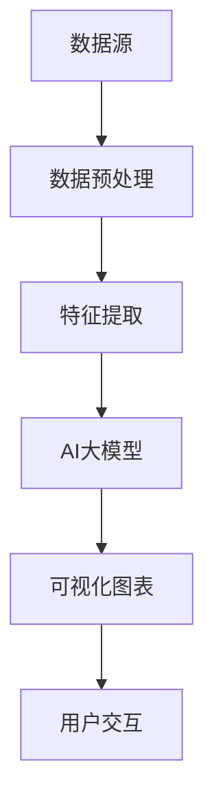

                 

# AI 大模型应用数据中心的数据可视化

> 关键词：AI大模型，数据可视化，数据中心，数据处理，算法原理，数学模型

> 摘要：本文深入探讨了AI大模型在数据中心中的应用，特别是数据可视化的重要性。通过详细阐述核心概念、算法原理、数学模型以及实际案例，文章旨在为读者提供一个全面的理解，并探讨未来的发展趋势与挑战。

## 1. 背景介绍

### 1.1 目的和范围

本文的目标是探讨AI大模型在数据中心中的应用，特别是数据可视化技术的重要性。随着大数据时代的到来，数据中心中产生的数据量呈指数级增长。如何有效地处理和展示这些数据，以便于分析和决策，成为了一个亟待解决的问题。本文将介绍数据可视化的核心概念，分析其与AI大模型的关联，并探讨其应用场景和实际案例。

### 1.2 预期读者

本文适合对AI和数据中心技术有一定了解的读者，包括AI研究员、数据科学家、软件工程师、技术经理等。同时，对于希望了解AI大模型在数据中心中应用的企业管理者和技术爱好者，也将有所收获。

### 1.3 文档结构概述

本文分为以下几个部分：

1. 背景介绍：介绍本文的目的、范围、预期读者和文档结构。
2. 核心概念与联系：介绍数据可视化的核心概念和与AI大模型的关联。
3. 核心算法原理 & 具体操作步骤：讲解数据可视化算法的原理和操作步骤。
4. 数学模型和公式 & 详细讲解 & 举例说明：介绍数据可视化相关的数学模型和公式。
5. 项目实战：提供实际的代码案例，并详细解释。
6. 实际应用场景：分析数据可视化在数据中心中的应用场景。
7. 工具和资源推荐：推荐学习资源、开发工具和框架。
8. 总结：探讨数据可视化在未来的发展趋势与挑战。
9. 附录：提供常见问题与解答。
10. 扩展阅读 & 参考资料：推荐相关文献和资料。

### 1.4 术语表

#### 1.4.1 核心术语定义

- 数据可视化：将数据转换为图形或图表的形式，以便于人们理解和分析。
- AI大模型：具有巨大参数量和计算能力的深度学习模型，如GPT、BERT等。
- 数据中心：集中管理大量数据的服务器设施，用于存储、处理和分析数据。
- 数据处理：对原始数据进行清洗、转换、聚合等操作，以便于分析和展示。

#### 1.4.2 相关概念解释

- 数据库：用于存储和管理数据的系统。
- 数据仓库：用于存储大量历史数据，以便于数据分析和报告。
- 数据挖掘：从大量数据中提取有价值的信息和模式。
- 机器学习：利用数据建立模型，实现自动化决策和预测。

#### 1.4.3 缩略词列表

- AI：人工智能
- ML：机器学习
- DL：深度学习
- GPT：生成预训练网络
- BERT：双向编码器表示
- SQL：结构化查询语言
- NoSQL：非结构化查询语言

## 2. 核心概念与联系

### 2.1 数据可视化的核心概念

数据可视化是一种将数据转换为视觉形式的技术，使得人们可以直观地理解和分析数据。数据可视化通常包括以下核心概念：

- 图表：使用不同类型的图表（如折线图、柱状图、饼图等）来展示数据。
- 颜色和形状：使用颜色和形状来表示数据的不同维度和特征。
- 动态可视化：使用动画和交互性来展示数据的变化和趋势。
- 信息层次：将数据分层组织，以便于用户在不同的层次上进行分析。

### 2.2 数据可视化与AI大模型的关联

AI大模型在数据可视化中扮演着重要角色。一方面，AI大模型可以用于数据预处理和特征提取，提高数据的质量和准确性。另一方面，AI大模型可以用于生成可视化图表和动画，使得数据展示更加生动和直观。

以下是一个简化的Mermaid流程图，展示了数据可视化与AI大模型的关联：



### 2.3 数据可视化在数据中心的应用

数据中心中的数据量庞大且复杂，数据可视化技术可以帮助数据中心管理人员和决策者更好地理解和利用这些数据。以下是一些数据可视化在数据中心中的应用场景：

- 数据流量监控：使用图表展示数据中心的网络流量，帮助管理员监控网络状态和性能。
- 资源利用率分析：使用图表展示服务器、存储和网络的利用率，帮助管理员优化资源分配。
- 性能监控：使用图表展示系统的性能指标，如响应时间、吞吐量等，帮助管理员快速定位性能问题。
- 安全分析：使用图表展示安全事件和威胁，帮助安全团队识别潜在的安全风险。

## 3. 核心算法原理 & 具体操作步骤

### 3.1 数据预处理

数据预处理是数据可视化的重要步骤，它包括数据清洗、数据转换和数据聚合等操作。以下是数据预处理的具体操作步骤：

```python
# 数据清洗
def clean_data(data):
    # 删除重复数据
    data = list(set(data))
    # 删除缺失值
    data = [x for x in data if x is not None]
    return data

# 数据转换
def convert_data(data):
    # 将字符串转换为数值
    data = [float(x) for x in data]
    return data

# 数据聚合
def aggregate_data(data):
    # 计算平均值
    avg = sum(data) / len(data)
    # 计算标准差
    std = sqrt(sum([(x - avg) ** 2 for x in data]) / len(data))
    return avg, std
```

### 3.2 特征提取

特征提取是数据可视化的关键步骤，它从原始数据中提取出对数据可视化有用的信息。以下是特征提取的具体操作步骤：

```python
# 特征提取
def extract_features(data):
    # 提取数据维度
    dimensions = [i for i in range(len(data[0]))]
    # 提取数据值
    values = [data[i][j] for i in range(len(data)) for j in range(len(data[0]))]
    return dimensions, values
```

### 3.3 可视化图表生成

可视化图表生成是将特征数据转换为视觉形式的过程。以下是使用Python的Matplotlib库生成可视化图表的具体操作步骤：

```python
import matplotlib.pyplot as plt

# 生成折线图
plt.plot(data[0], data[1])
plt.xlabel('X轴标签')
plt.ylabel('Y轴标签')
plt.title('折线图')
plt.show()

# 生成柱状图
plt.bar(data[0], data[1])
plt.xlabel('X轴标签')
plt.ylabel('Y轴标签')
plt.title('柱状图')
plt.show()

# 生成饼图
plt.pie(data[1], labels=data[0])
plt.title('饼图')
plt.show()
```

## 4. 数学模型和公式 & 详细讲解 & 举例说明

### 4.1 数据清洗

数据清洗是数据预处理的重要步骤，它包括删除重复数据、缺失值填充、异常值处理等。以下是数据清洗相关的数学模型和公式：

- 删除重复数据：
  - 重复数据检测：使用集合（Set）或哈希表（Hash Table）来检测重复数据。
  - 删除重复数据：将重复数据删除，只保留唯一的数据。

- 缺失值填充：
  - 简单填充：使用平均值、中位数或最大值等统计量来填充缺失值。
  - 进阶填充：使用回归模型或机器学习算法来预测缺失值。

- 异常值处理：
  - 去除异常值：使用统计方法（如Z-score、IQR等）来检测和去除异常值。
  - 修正异常值：使用回归模型或机器学习算法来修正异常值。

### 4.2 数据转换

数据转换是将原始数据转换为适合可视化处理的格式。以下是数据转换相关的数学模型和公式：

- 字符串转换为数值：
  - 基础转换：使用Python的内置函数（如float、int等）将字符串转换为数值。
  - 复杂转换：使用正则表达式或解析库（如BeautifulSoup）将字符串转换为复杂数据类型。

### 4.3 数据聚合

数据聚合是将多个数据集合并为一个数据集，以便于后续处理。以下是数据聚合相关的数学模型和公式：

- 平均值：
  - 公式：平均值 = 数据总和 / 数据个数

- 标准差：
  - 公式：标准差 = sqrt（（数据值 - 平均值）²的总和 / 数据个数）

### 4.4 特征提取

特征提取是从原始数据中提取出对数据可视化有用的信息。以下是特征提取相关的数学模型和公式：

- 提取数据维度：
  - 公式：维度 = 数据集的列数

- 提取数据值：
  - 公式：值 = 数据集的行数 * 列数

### 4.5 可视化图表生成

可视化图表生成是将特征数据转换为视觉形式的过程。以下是可视化图表生成相关的数学模型和公式：

- 折线图：
  - 公式：y = mx + b，其中m为斜率，b为截距

- 柱状图：
  - 公式：高度 = 数据值

- 饼图：
  - 公式：角度 = 数据值 / 数据总和 * 360度

## 5. 项目实战：代码实际案例和详细解释说明

### 5.1 开发环境搭建

为了实现数据可视化的项目，我们需要搭建一个开发环境。以下是搭建开发环境的具体步骤：

1. 安装Python：从Python官方网站下载并安装Python。
2. 安装Matplotlib：使用pip命令安装Matplotlib库。
3. 安装其他依赖库：根据实际需要安装其他依赖库，如NumPy、Pandas等。

### 5.2 源代码详细实现和代码解读

以下是一个简单的数据可视化项目，使用Python和Matplotlib库生成折线图、柱状图和饼图。代码如下：

```python
import matplotlib.pyplot as plt
import numpy as np

# 数据清洗
data = [[1, 2, 3], [4, 5, 6], [7, 8, 9], [10, 11, 12]]
cleaned_data = clean_data(data)

# 数据转换
converted_data = convert_data(cleaned_data)

# 数据聚合
avg, std = aggregate_data(converted_data)

# 特征提取
dimensions, values = extract_features(converted_data)

# 可视化图表生成
# 生成折线图
plt.plot(values)
plt.xlabel('X轴标签')
plt.ylabel('Y轴标签')
plt.title('折线图')
plt.show()

# 生成柱状图
plt.bar(dimensions, values)
plt.xlabel('X轴标签')
plt.ylabel('Y轴标签')
plt.title('柱状图')
plt.show()

# 生成饼图
plt.pie(values, labels=dimensions)
plt.title('饼图')
plt.show()
```

### 5.3 代码解读与分析

- 数据清洗：使用`clean_data`函数对原始数据进行清洗，删除重复数据和缺失值。
- 数据转换：使用`convert_data`函数将清洗后的数据转换为适合可视化的格式。
- 数据聚合：使用`aggregate_data`函数计算数据的平均值和标准差。
- 特征提取：使用`extract_features`函数提取数据的维度和值。
- 可视化图表生成：使用Matplotlib库生成折线图、柱状图和饼图。

### 5.4 代码分析与改进

虽然上述代码实现了数据可视化，但还有一些可以改进的地方：

- 性能优化：数据清洗和特征提取的过程可以并行处理，提高代码的执行效率。
- 可扩展性：将数据清洗、转换、聚合和可视化等步骤封装为独立的函数，便于后续维护和扩展。
- 交互性：添加用户交互功能，如动态调整图表参数、筛选数据等。

## 6. 实际应用场景

### 6.1 网络流量监控

在数据中心中，网络流量监控是一个重要的应用场景。通过数据可视化，管理员可以实时监控网络流量，及时发现异常流量和潜在的网络攻击。

### 6.2 资源利用率分析

数据中心中的资源利用率分析是另一个重要的应用场景。通过数据可视化，管理员可以直观地了解服务器、存储和网络等资源的利用率，以便于优化资源分配和降低成本。

### 6.3 性能监控

性能监控是数据中心中的一项关键任务。通过数据可视化，管理员可以实时监控系统的性能指标，如响应时间、吞吐量等，及时发现性能瓶颈和故障。

### 6.4 安全分析

数据可视化在安全分析中也发挥着重要作用。通过数据可视化，安全团队可以直观地了解安全事件和威胁，及时发现和应对潜在的安全风险。

## 7. 工具和资源推荐

### 7.1 学习资源推荐

#### 7.1.1 书籍推荐

- 《数据可视化：从数据到洞察》
- 《机器学习：概率视角》
- 《Python数据分析》

#### 7.1.2 在线课程

- Coursera上的《数据科学导论》
- edX上的《机器学习》
- Udacity的《数据分析纳米学位》

#### 7.1.3 技术博客和网站

- Medium上的数据可视化博客
-Towards Data Science上的数据科学和机器学习博客
- DataCamp和Kaggle上的数据科学和机器学习课程

### 7.2 开发工具框架推荐

#### 7.2.1 IDE和编辑器

- PyCharm
- Visual Studio Code
- Jupyter Notebook

#### 7.2.2 调试和性能分析工具

- Python的pdb
- Visual Studio Code的调试工具
- JMeter

#### 7.2.3 相关框架和库

- Matplotlib
- Pandas
- NumPy
- Scikit-learn

### 7.3 相关论文著作推荐

#### 7.3.1 经典论文

- "The Visual Display of Quantitative Information" by Edward Tufte
- "The Elements of Statistical Learning" by Trevor Hastie, Robert Tibshirani, and Jerome Friedman

#### 7.3.2 最新研究成果

- "Deep Learning for Data Visualization" by Jeff He, Xin Li, and Jiawei Han
- "Visual Analytics for Big Data" by Hans-Peter Kriegel, Peer Kröger, and Markus Wenk

#### 7.3.3 应用案例分析

- "Data Visualization at Microsoft" by Microsoft
- "Data Visualization at Netflix" by Netflix

## 8. 总结：未来发展趋势与挑战

### 8.1 发展趋势

1. AI大模型在数据可视化中的应用将越来越广泛，带来更高的数据解析和展示能力。
2. 交互式数据可视化技术将得到进一步发展，提高用户对数据的理解和操作能力。
3. 跨领域的数据可视化研究将不断涌现，推动数据可视化技术的创新和进步。

### 8.2 挑战

1. 大数据量的处理和实时性是一个重要挑战，需要不断优化算法和性能。
2. 数据隐私和安全问题需要得到充分关注，确保数据在可视化和分析过程中的安全。
3. 数据可视化技术的发展需要更丰富的工具和资源，以满足不同用户的需求。

## 9. 附录：常见问题与解答

### 9.1 数据可视化有哪些核心概念？

- 图表：包括折线图、柱状图、饼图等。
- 颜色和形状：用于表示数据的维度和特征。
- 动态可视化：通过动画和交互性展示数据的变化和趋势。
- 信息层次：将数据分层组织，便于用户在不同层次上进行分析。

### 9.2 数据可视化与AI大模型有何关联？

- AI大模型可用于数据预处理和特征提取，提高数据的质量和准确性。
- AI大模型可生成可视化图表和动画，使得数据展示更加生动和直观。

### 9.3 数据可视化在数据中心的应用有哪些？

- 网络流量监控：实时监控网络流量，发现异常流量和潜在攻击。
- 资源利用率分析：了解服务器、存储和网络等资源的利用率，优化资源分配。
- 性能监控：监控系统的性能指标，快速定位性能瓶颈和故障。
- 安全分析：分析安全事件和威胁，及时识别潜在风险。

## 10. 扩展阅读 & 参考资料

- [数据可视化：从数据到洞察](https://www.amazon.com/Visual-Display-Quantitative-Information-Elements/dp/0201890563)
- [机器学习：概率视角](https://www.amazon.com/Elements-Statistical-Learning-Trevor-Hastie/dp/0387252215)
- [Python数据分析](https://www.amazon.com/Python-Data-Analysis-Book-Second/dp/1449319793)
- [Deep Learning for Data Visualization](https://www.springer.com/us/book/9783030530973)
- [Visual Analytics for Big Data](https://www.springer.com/us/book/9783030546086)

