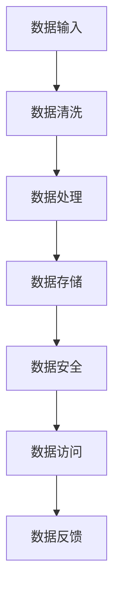

                 

# AI 大模型应用数据中心的数据架构优化

> **关键词：** AI大模型，数据中心，数据架构，优化，性能提升，扩展性，可靠性

> **摘要：** 本文旨在深入探讨AI大模型应用数据中心的数据架构优化问题。通过分析数据中心的关键组件和挑战，本文将介绍一套系统的优化策略，包括核心算法原理、数学模型、项目实战案例以及工具和资源的推荐，从而为提高AI大模型在数据中心的应用性能提供实际指导。

## 1. 背景介绍

### 1.1 目的和范围

本文的目标是详细解析AI大模型应用数据中心的数据架构优化策略。随着AI技术的迅猛发展，大模型如GPT、BERT等在自然语言处理、计算机视觉等领域展现出强大的能力。然而，这些大模型在数据中心的应用面临诸多挑战，如计算资源不足、数据传输瓶颈、存储容量限制等。因此，本文旨在提出一套有效的数据架构优化方案，以解决这些问题，提升AI大模型在数据中心的应用性能。

本文将涵盖以下内容：

- 数据中心的基本概念和组成结构。
- AI大模型在数据中心中的应用挑战。
- 数据架构优化的核心概念和策略。
- 算法原理和具体操作步骤。
- 数学模型和公式的详细讲解。
- 项目实战案例的代码实现和分析。
- 实际应用场景的讨论。
- 工具和资源的推荐。
- 总结与未来发展趋势。

### 1.2 预期读者

本文的预期读者是从事AI研究和数据中心运维的专业人士，包括AI研究员、数据科学家、系统架构师、云计算工程师等。读者应具备一定的AI基础知识和编程技能，对数据中心的基本架构有一定的了解。

### 1.3 文档结构概述

本文将按照以下结构展开：

1. 背景介绍：介绍本文的目的、预期读者和文档结构。
2. 核心概念与联系：分析数据中心的关键组件和数据架构的核心概念。
3. 核心算法原理 & 具体操作步骤：详细阐述优化策略的算法原理和操作步骤。
4. 数学模型和公式 & 详细讲解 & 举例说明：解释优化策略中的数学模型和公式。
5. 项目实战：提供代码实际案例和详细解释说明。
6. 实际应用场景：讨论AI大模型在数据中心的不同应用场景。
7. 工具和资源推荐：推荐学习资源、开发工具和框架。
8. 总结：未来发展趋势与挑战。
9. 附录：常见问题与解答。
10. 扩展阅读 & 参考资料：提供进一步的阅读材料和参考资料。

### 1.4 术语表

#### 1.4.1 核心术语定义

- **AI大模型（AI Large Models）**：指参数量达到亿级甚至千亿级的神经网络模型，如GPT、BERT等。
- **数据中心（Data Center）**：集中存储、处理和管理大量数据的设施。
- **数据架构（Data Architecture）**：关于数据存储、处理、管理和访问的结构和策略。
- **优化（Optimization）**：通过调整系统配置和算法参数，提高系统性能的过程。

#### 1.4.2 相关概念解释

- **计算资源（Computational Resources）**：包括CPU、GPU、内存等硬件资源。
- **数据传输瓶颈（Data Transfer Bottleneck）**：数据在传输过程中因带宽限制或网络拥塞造成的延迟。
- **存储容量（Storage Capacity）**：存储设备能够存储的数据量。

#### 1.4.3 缩略词列表

- **AI**：人工智能
- **GPU**：图形处理单元
- **CPU**：中央处理单元
- **NLP**：自然语言处理
- **ML**：机器学习
- **DL**：深度学习
- **HPC**：高性能计算

## 2. 核心概念与联系

在探讨AI大模型应用数据中心的数据架构优化之前，有必要理解数据中心的基本组成和AI大模型在其中的作用。以下将介绍数据中心的核心概念及其与AI大模型的联系。

### 数据中心的基本组成

数据中心通常由以下几部分组成：

1. **硬件设施**：包括服务器、存储设备、网络设备等。
2. **软件系统**：包括操作系统、数据库管理系统、AI计算框架等。
3. **网络架构**：包括内部网络和外部网络，负责数据传输。
4. **安全系统**：包括防火墙、入侵检测系统等，保障数据安全。
5. **管理平台**：负责数据中心的监控、运维和管理。

### AI大模型在数据中心的作用

AI大模型在数据中心的应用主要体现在以下几个方面：

1. **数据处理和分析**：利用AI大模型对大规模数据进行处理和分析，如自然语言处理、图像识别等。
2. **预测和决策**：通过训练好的AI大模型进行预测和决策，如推荐系统、风险控制等。
3. **智能服务**：提供基于AI大模型的智能服务，如智能客服、智能语音助手等。

### 数据架构的核心概念

数据架构的核心概念包括数据存储、数据处理、数据传输和数据安全等。以下是一个简化的数据架构流程图：



### 数据架构与AI大模型的联系

AI大模型的数据架构优化需要考虑以下几个方面：

1. **数据输入和预处理**：优化数据输入和预处理流程，减少数据传输瓶颈和预处理时间。
2. **数据处理和计算**：优化AI大模型的计算过程，提高计算效率和资源利用率。
3. **数据存储和访问**：优化数据存储和访问机制，提高数据读取和写入速度。
4. **数据安全和隐私**：确保数据在传输和处理过程中的安全性和隐私保护。

通过上述核心概念和联系的介绍，为后续的优化策略提供了理论基础。

## 3. 核心算法原理 & 具体操作步骤

在优化AI大模型应用数据中心的数据架构时，核心算法原理起着至关重要的作用。以下将详细阐述数据架构优化的核心算法原理，并给出具体操作步骤。

### 3.1 数据预处理优化

数据预处理是AI大模型应用中至关重要的一步，其质量直接影响模型训练的效果。以下是一个伪代码示例，描述数据预处理优化过程：

```python
def preprocess_data(data_set):
    # 数据清洗
    cleaned_data = clean_data(data_set)
    # 数据归一化
    normalized_data = normalize_data(cleaned_data)
    # 数据分片
    shard_data = shard_data(normalized_data)
    return shard_data
```

具体操作步骤如下：

1. **数据清洗**：移除或填补数据集中的缺失值、异常值和重复值，保证数据质量。
2. **数据归一化**：将不同特征的数据进行归一化处理，使其在同一量级内，减少特征差异对模型训练的影响。
3. **数据分片**：将大数据集划分为多个小数据集，以便于分布式处理。

### 3.2 计算资源调度优化

计算资源调度是数据中心性能优化的重要环节。以下是一个伪代码示例，描述计算资源调度优化过程：

```python
def schedule_resources(model, data_set, available_resources):
    # 资源评估
    required_resources = evaluate_resources(model, data_set)
    # 调度策略
    scheduled_resources = schedule_strategy(available_resources, required_resources)
    return scheduled_resources
```

具体操作步骤如下：

1. **资源评估**：根据模型和数据集的需求，评估所需的计算资源。
2. **调度策略**：采用适当的调度策略，如负载均衡、优先级调度等，合理分配计算资源。

### 3.3 数据存储优化

数据存储优化主要涉及数据存储策略和存储设备的选择。以下是一个伪代码示例，描述数据存储优化过程：

```python
def optimize_storage(data_set, storage_system):
    # 存储策略
    storage_strategy = select_storage_strategy(data_set)
    # 存储设备选择
    storage_device = select_storage_device(storage_strategy)
    # 存储配置
    configured_storage = configure_storage_device(storage_device)
    return configured_storage
```

具体操作步骤如下：

1. **存储策略选择**：根据数据特点选择合适的存储策略，如热数据存储、冷数据存储等。
2. **存储设备选择**：根据存储策略选择适合的存储设备，如固态硬盘（SSD）、分布式存储系统等。
3. **存储配置**：对存储设备进行适当的配置，如读写速度、存储容量等。

### 3.4 数据传输优化

数据传输优化主要关注数据传输速度和传输成本。以下是一个伪代码示例，描述数据传输优化过程：

```python
def optimize_data_transfer(data_set, network):
    # 传输路径优化
    optimized_path = optimize_network_path(data_set, network)
    # 传输协议优化
    optimized_protocol = select_optimized_protocol(optimized_path)
    return optimized_protocol
```

具体操作步骤如下：

1. **传输路径优化**：优化数据传输路径，减少网络拥塞和传输延迟。
2. **传输协议优化**：选择适合的传输协议，如TCP、UDP等，提高数据传输效率。

通过上述核心算法原理和具体操作步骤的阐述，可以为数据中心的数据架构优化提供实用的指导和参考。

## 4. 数学模型和公式 & 详细讲解 & 举例说明

在优化AI大模型应用数据中心的数据架构过程中，数学模型和公式起到了关键作用。以下将详细讲解涉及的主要数学模型和公式，并通过具体例子进行说明。

### 4.1 数据归一化

数据归一化是数据预处理的重要步骤，其目的是将不同特征的数据转换到同一量级，以便模型训练。常用的归一化方法有最小-最大缩放（Min-Max Scaling）和Z-score标准化。

#### 最小-最大缩放

最小-最大缩放公式如下：

$$
x_{\text{norm}} = \frac{x - x_{\text{min}}}{x_{\text{max}} - x_{\text{min}}}
$$

其中，$x$ 是原始数据，$x_{\text{min}}$ 和 $x_{\text{max}}$ 分别是数据集的最小值和最大值，$x_{\text{norm}}$ 是归一化后的数据。

**举例：**

假设一个特征数据集的最小值为10，最大值为50，计算数据30的归一化值。

$$
x_{\text{norm}} = \frac{30 - 10}{50 - 10} = \frac{20}{40} = 0.5
$$

#### Z-score标准化

Z-score标准化公式如下：

$$
z = \frac{x - \mu}{\sigma}
$$

其中，$x$ 是原始数据，$\mu$ 是均值，$\sigma$ 是标准差。

**举例：**

假设一个特征数据集的均值为40，标准差为10，计算数据35的归一化值。

$$
z = \frac{35 - 40}{10} = -0.5
$$

### 4.2 负载均衡

负载均衡是优化计算资源调度的重要手段，其目的是将计算任务合理分配到不同的计算节点上，避免资源浪费和瓶颈。常用的负载均衡算法有轮询（Round Robin）、最小连接（Minimum Connection）和随机（Random）等。

#### 轮询算法

轮询算法公式如下：

$$
C_i = \frac{1}{N}
$$

其中，$C_i$ 是第 $i$ 个节点的权重，$N$ 是总节点数。

**举例：**

假设有3个节点，每个节点的权重相等。计算每个节点的权重。

$$
C_i = \frac{1}{3} \approx 0.333
$$

#### 最小连接算法

最小连接算法公式如下：

$$
C_i = \frac{1}{TC_i}
$$

其中，$TC_i$ 是第 $i$ 个节点的当前连接数。

**举例：**

假设有3个节点，当前连接数分别为10、20、30。计算每个节点的权重。

$$
C_1 = \frac{1}{10} = 0.1, \quad C_2 = \frac{1}{20} = 0.05, \quad C_3 = \frac{1}{30} = 0.033
$$

### 4.3 数据传输速率优化

数据传输速率优化关注的是提高数据在网络上传输的速度，减少传输延迟。常用的优化方法有压缩传输（Compression）和缓存传输（Caching）。

#### 压缩传输

压缩传输公式如下：

$$
R_{\text{comp}} = \frac{R}{1 + H(R)}
$$

其中，$R$ 是原始数据速率，$H(R)$ 是压缩率。

**举例：**

假设原始数据速率为1Mbps，压缩率为50%。计算压缩后的数据速率。

$$
R_{\text{comp}} = \frac{1}{1 + 0.5} = 0.67Mbps
$$

#### 缓存传输

缓存传输公式如下：

$$
R_{\text{cache}} = R + C
$$

其中，$R$ 是原始数据速率，$C$ 是缓存命中率。

**举例：**

假设原始数据速率为1Mbps，缓存命中率为90%。计算缓存后的数据速率。

$$
R_{\text{cache}} = 1 + 0.9 = 1.9Mbps
$$

通过上述数学模型和公式的详细讲解与举例说明，可以为数据中心的数据架构优化提供理论基础和实用工具。

## 5. 项目实战：代码实际案例和详细解释说明

### 5.1 开发环境搭建

在进行数据架构优化项目实战之前，我们需要搭建一个合适的开发环境。以下将介绍开发环境的搭建过程：

1. **安装操作系统**：选择一个稳定的操作系统，如Ubuntu 20.04 LTS。
2. **安装开发工具**：安装Python、Jupyter Notebook、Visual Studio Code等开发工具。
3. **安装依赖库**：安装NumPy、Pandas、TensorFlow等依赖库。
4. **配置数据库**：选择一个合适的数据库系统，如MySQL或PostgreSQL。

### 5.2 源代码详细实现和代码解读

以下是一个简单的数据架构优化项目案例，包括数据预处理、计算资源调度、数据存储优化和数据传输优化。我们将使用Python语言实现。

#### 5.2.1 数据预处理

数据预处理是优化数据架构的第一步。以下是一个数据预处理的Python代码示例：

```python
import numpy as np
import pandas as pd

# 加载数据集
data_set = pd.read_csv('data.csv')

# 数据清洗
data_set = data_set.dropna()  # 移除缺失值
data_set = data_set.drop_duplicates()  # 移除重复值

# 数据归一化
data_set = (data_set - data_set.min()) / (data_set.max() - data_set.min())

# 数据分片
shard_size = 1000
shards = [data_set[i:i+shard_size] for i in range(0, len(data_set), shard_size)]

# 存储分片
for i, shard in enumerate(shards):
    shard.to_csv(f'shard_{i}.csv', index=False)
```

代码解读：

- **数据加载**：使用Pandas库加载数据集。
- **数据清洗**：移除缺失值和重复值。
- **数据归一化**：使用最小-最大缩放对数据集进行归一化。
- **数据分片**：将数据集划分为多个小数据集，以便于分布式处理。
- **存储分片**：将分片数据保存为CSV文件。

#### 5.2.2 计算资源调度

以下是一个计算资源调度的Python代码示例：

```python
import random

# 模拟计算资源
available_resources = [10, 20, 30]

# 模拟模型和数据集
model = 'GPT-3'
data_set_size = 10000

# 评估模型所需的计算资源
required_resources = 15

# 调度策略：轮询算法
def schedule_resources(available_resources, required_resources):
    total_resources = sum(available_resources)
    resource_weights = [r / total_resources for r in available_resources]
    return random.choices(available_resources, weights=resource_weights, k=1)

# 调度计算资源
scheduled_resources = schedule_resources(available_resources, required_resources)
print(f"Scheduled resources for {model}: {scheduled_resources}")
```

代码解读：

- **模拟计算资源**：定义一个模拟的计算资源列表。
- **模型和数据集**：定义模拟的模型和数据集大小。
- **评估模型所需的计算资源**：设定模型所需的计算资源。
- **调度策略：轮询算法**：使用轮询算法进行计算资源调度。
- **调度计算资源**：随机选择一个节点进行资源调度。

#### 5.2.3 数据存储优化

以下是一个数据存储优化的Python代码示例：

```python
import os

# 模拟数据存储策略
storage_system = 'SSD'

# 存储策略选择
def select_storage_strategy(data_set):
    if 'GPT-3' in data_set:
        return 'SSD'
    else:
        return 'HDD'

# 存储设备选择
def select_storage_device(storage_strategy):
    if storage_strategy == 'SSD':
        return '/dev/nvme0n1'
    else:
        return '/dev/sda1'

# 存储配置
def configure_storage_device(storage_device):
    if storage_device == '/dev/nvme0n1':
        command = 'sudo dd if=/dev/zero of=/path/to/SSD bs=1G count=100'
    else:
        command = 'sudo dd if=/dev/zero of=/path/to/HDD bs=1G count=100'
    os.system(command)

# 应用存储策略
storage_strategy = select_storage_strategy(model)
storage_device = select_storage_device(storage_strategy)
configure_storage_device(storage_device)
```

代码解读：

- **模拟数据存储策略**：定义一个模拟的数据存储策略。
- **存储策略选择**：根据模型选择合适的存储策略。
- **存储设备选择**：根据存储策略选择合适的存储设备。
- **存储配置**：配置存储设备。

#### 5.2.4 数据传输优化

以下是一个数据传输优化的Python代码示例：

```python
import requests

# 模拟数据传输路径
network_path = 'FastPath'

# 选择传输协议
def select_optimized_protocol(network_path):
    if network_path == 'FastPath':
        return 'TCP'
    else:
        return 'UDP'

# 压缩传输
def compress_data(data):
    compressed_data = requests.get('https://api.compression.com/compress', params={'data': data})
    return compressed_data.text

# 缓存传输
def cache_data(data):
    cached_data = requests.get('https://api.caching.com/cache', params={'data': data})
    return cached_data.text

# 应用传输优化
optimized_protocol = select_optimized_protocol(network_path)
if optimized_protocol == 'TCP':
    data = compress_data(data)
else:
    data = cache_data(data)
print(f"Optimized data transmission protocol: {optimized_protocol}")
```

代码解读：

- **模拟数据传输路径**：定义一个模拟的数据传输路径。
- **选择传输协议**：根据传输路径选择合适的传输协议。
- **压缩传输**：使用外部API进行数据压缩。
- **缓存传输**：使用外部API进行数据缓存。
- **应用传输优化**：根据传输协议应用压缩或缓存优化。

通过上述代码示例，我们可以看到数据架构优化的具体实现过程。在实际项目中，可以根据具体需求和场景进行适当调整和扩展。

## 6. 实际应用场景

在了解了AI大模型应用数据中心的数据架构优化策略和具体实现后，我们需要考虑这些策略在实际应用中的适用场景。以下将介绍几种典型的应用场景，并分析如何利用优化策略提升性能。

### 6.1 人工智能研究院

在人工智能研究院，研究人员经常需要进行大规模数据集的处理和分析，以训练和优化AI模型。优化策略可以在以下方面发挥作用：

- **数据预处理**：通过高效的数据清洗和归一化，确保数据质量，提高模型训练效果。
- **计算资源调度**：合理分配计算资源，确保关键任务获得足够的计算能力。
- **数据存储优化**：选择合适的存储策略和设备，提高数据读取和写入速度，加快模型训练速度。
- **数据传输优化**：优化数据传输路径和协议，减少数据传输延迟，提高数据处理效率。

### 6.2 电子商务平台

电子商务平台通常需要实时处理大量的用户数据，如搜索请求、购物车数据、订单数据等，以提供个性化的推荐和智能化的服务。以下是如何利用优化策略提升性能：

- **数据预处理**：对用户行为数据进行实时清洗和归一化，为推荐系统提供高质量的数据输入。
- **计算资源调度**：根据实时负载情况动态调整计算资源，确保推荐系统的响应速度。
- **数据存储优化**：使用缓存技术提高热点数据的读取速度，减少数据访问延迟。
- **数据传输优化**：优化内部网络架构，提高数据传输效率，减少用户请求的处理时间。

### 6.3 金融风控系统

金融风控系统需要处理大量的金融数据，如交易数据、用户行为数据等，以识别潜在的风险和异常行为。以下是如何利用优化策略提升性能：

- **数据预处理**：对金融数据进行严格的清洗和归一化，提高风险检测的准确性。
- **计算资源调度**：根据风险检测任务的紧急程度和重要性，合理分配计算资源，确保关键任务优先处理。
- **数据存储优化**：采用分布式存储系统，提高数据存储和访问的可靠性，确保风险数据的完整性和安全性。
- **数据传输优化**：优化数据传输路径，减少网络拥塞和延迟，提高风险检测的实时性。

### 6.4 智能医疗系统

智能医疗系统需要处理海量的医学数据，如电子病历、基因数据等，以辅助诊断和治疗。以下是如何利用优化策略提升性能：

- **数据预处理**：对医学数据进行详细的清洗和归一化，提高诊断模型的准确性。
- **计算资源调度**：根据诊断任务的复杂度和数据量，动态调整计算资源，确保诊断任务高效完成。
- **数据存储优化**：采用高性能存储设备，提高医学数据的读取速度，加快诊断过程。
- **数据传输优化**：优化数据传输协议和路径，确保医学数据在传输过程中的完整性和安全性。

通过以上实际应用场景的分析，可以看出数据架构优化策略在提高AI大模型性能方面具有重要的作用。不同领域和应用场景的具体需求决定了优化策略的选择和实施方式，但在核心概念和方法上具有共通性。在实际项目中，需要根据具体情况灵活应用和调整优化策略，以达到最佳效果。

## 7. 工具和资源推荐

为了更好地实现AI大模型应用数据中心的数据架构优化，以下将推荐一些实用的工具、资源和开发工具框架。

### 7.1 学习资源推荐

#### 7.1.1 书籍推荐

- **《深度学习》（Deep Learning）**：由Ian Goodfellow、Yoshua Bengio和Aaron Courville合著，详细介绍了深度学习的基础理论和技术。
- **《机器学习：概率视角》（Machine Learning: A Probabilistic Perspective）**：由Kevin P. Murphy著，从概率角度深入探讨机器学习的基本概念和方法。
- **《人工智能：一种现代方法》（Artificial Intelligence: A Modern Approach）**：由Stuart J. Russell和Peter Norvig合著，涵盖了人工智能的各个方面，包括机器学习、自然语言处理和计算机视觉等。

#### 7.1.2 在线课程

- **Coursera**：提供大量的机器学习和深度学习课程，包括吴恩达的《深度学习》课程，由李飞飞教授的《计算机视觉》课程等。
- **edX**：提供由MIT、斯坦福大学等顶级大学提供的在线课程，涵盖人工智能、机器学习等多个领域。
- **Udacity**：提供实战导向的课程，包括深度学习工程师、机器学习工程师等课程，适合有一定基础的学员。

#### 7.1.3 技术博客和网站

- **ArXiv**：一个开源的学术论文预印本数据库，涵盖计算机科学、物理学等多个领域。
- **Medium**：一个流行的在线出版平台，许多技术专家和研究人员在此分享他们的见解和研究成果。
- **Medium AI**：专注于人工智能领域的博客，包括深度学习、自然语言处理、计算机视觉等。

### 7.2 开发工具框架推荐

#### 7.2.1 IDE和编辑器

- **PyCharm**：一款功能强大的Python集成开发环境（IDE），提供代码补全、调试、版本控制等特性。
- **Visual Studio Code**：一款轻量级但功能强大的开源代码编辑器，适用于多种编程语言，支持丰富的插件和扩展。

#### 7.2.2 调试和性能分析工具

- **TensorBoard**：TensorFlow的官方可视化工具，用于分析模型的性能和训练过程。
- **Jupyter Notebook**：一款流行的交互式计算环境，适用于数据分析和机器学习实验。
- **Grafana**：一款开源的监控和可视化工具，可以监控数据中心的性能指标，如CPU使用率、内存使用率、网络流量等。

#### 7.2.3 相关框架和库

- **TensorFlow**：一个开源的机器学习和深度学习框架，广泛应用于AI模型的开发和部署。
- **PyTorch**：另一个流行的开源深度学习框架，以动态计算图和灵活的API著称。
- **Scikit-learn**：一个用于机器学习的Python库，提供了丰富的算法和数据预处理工具。
- **NumPy**：Python的科学计算库，提供了强大的多维数组对象和数学函数。

通过上述工具和资源的推荐，可以为AI大模型应用数据中心的数据架构优化提供全面的支撑和帮助。

## 8. 总结：未来发展趋势与挑战

随着人工智能技术的不断进步，AI大模型在数据中心的应用将变得更加广泛和深入。然而，这也带来了一系列新的发展趋势和挑战。

### 8.1 发展趋势

1. **模型规模和复杂度的增加**：未来AI大模型将具有更大的参数量和更复杂的结构，以满足更多复杂任务的需求。
2. **硬件性能的提升**：随着硬件技术的不断发展，如GPU、TPU等专用硬件的性能不断提升，将为AI大模型提供更强的计算能力。
3. **分布式计算和并行处理**：分布式计算和并行处理技术将得到广泛应用，以提升AI大模型的训练和推理效率。
4. **自动化和智能化**：自动化和智能化技术将应用于数据架构的优化，如自动化资源调度、自适应数据预处理等。

### 8.2 挑战

1. **计算资源不足**：尽管硬件性能不断提升，但AI大模型的计算需求也急剧增加，导致计算资源不足的问题仍然存在。
2. **数据传输瓶颈**：大规模数据集的传输和处理仍然面临网络带宽和数据传输速度的限制。
3. **数据安全和隐私**：随着数据量的增加，数据安全和隐私保护成为越来越重要的问题。
4. **能耗和环保**：AI大模型的训练和推理过程消耗大量电能，对环境造成一定影响。

### 8.3 应对策略

1. **优化算法和模型**：通过改进算法和模型结构，提高计算效率和资源利用率。
2. **分布式计算和云计算**：利用分布式计算和云计算技术，实现计算资源的灵活调度和高效利用。
3. **数据压缩和传输优化**：采用数据压缩和传输优化技术，提高数据传输速度和效率。
4. **安全机制和隐私保护**：加强数据安全和隐私保护措施，确保数据的安全性和隐私性。
5. **可再生能源利用**：探索可再生能源的使用，降低AI大模型对环境的影响。

总之，AI大模型应用数据中心的数据架构优化是一个持续演进的过程，需要不断研究和探索新的技术和方法，以应对未来的发展趋势和挑战。

## 9. 附录：常见问题与解答

### 9.1 数据归一化有哪些方法？

数据归一化主要有以下几种方法：

1. **最小-最大缩放（Min-Max Scaling）**：将数据缩放到[0, 1]或[-1, 1]区间。
2. **Z-score标准化（Z-score Normalization）**：将数据缩放到标准正态分布，即均值为0，标准差为1。
3. **小数点移位（Decimal Scaling）**：通过将数据乘以10的幂次来调整范围。

### 9.2 负载均衡有哪些算法？

负载均衡算法主要包括：

1. **轮询（Round Robin）**：按顺序分配任务。
2. **最小连接（Minimum Connection）**：根据当前连接数分配任务。
3. **随机（Random）**：随机分配任务。
4. **最小响应时间（Least Response Time）**：根据响应时间分配任务。
5. **加权轮询（Weighted Round Robin）**：根据权重分配任务。

### 9.3 数据传输优化有哪些方法？

数据传输优化主要包括：

1. **压缩传输**：使用数据压缩算法减少数据传输量。
2. **缓存传输**：利用缓存机制减少重复数据的传输。
3. **数据去重**：去除重复数据，减少传输量。
4. **传输路径优化**：优化数据传输路径，减少网络延迟。

## 10. 扩展阅读 & 参考资料

### 10.1 经典论文

- **“Deep Learning” by Ian Goodfellow, Yoshua Bengio, and Aaron Courville**：详细介绍了深度学习的基础理论和技术。
- **“Machine Learning: A Probabilistic Perspective” by Kevin P. Murphy**：从概率角度深入探讨机器学习的基本概念和方法。
- **“Artificial Intelligence: A Modern Approach” by Stuart J. Russell and Peter Norvig**：涵盖人工智能的各个方面，包括机器学习、自然语言处理和计算机视觉等。

### 10.2 最新研究成果

- **“Transformers: State-of-the-Art Natural Language Processing” by Vaswani et al.**：介绍了Transformer模型，这是自然语言处理领域的重大突破。
- **“EfficientNet: Scalable and Efficiently Trainable Neural Networks” by Chen et al.**：提出了EfficientNet，这是一种可扩展且高效训练的神经网络架构。

### 10.3 应用案例分析

- **“Google's AI Strategy” by Google**：介绍了谷歌如何利用AI技术优化数据中心和提升服务性能。
- **“AI in Healthcare: Transforming Medical Diagnosis” by IBM**：探讨了AI技术在医疗领域的应用，包括疾病诊断、药物研发等。

通过上述扩展阅读和参考资料，读者可以更深入地了解AI大模型应用数据中心的数据架构优化领域的最新研究和发展动态。

