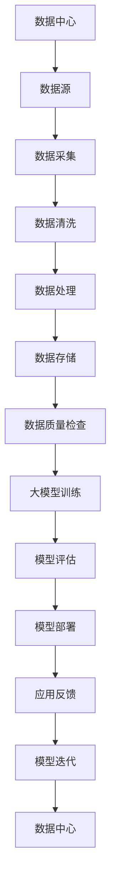
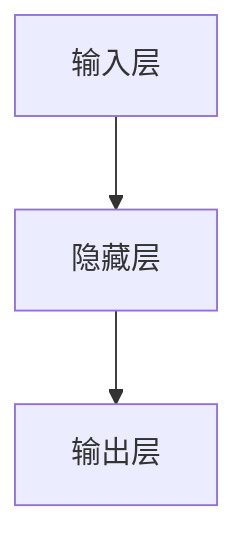

                 

# AI 大模型应用数据中心的数据质量

> 关键词：人工智能，大模型，数据中心，数据质量，算法原理，数学模型，应用场景，工具推荐

> 摘要：本文将深入探讨人工智能大模型在数据中心中的应用，重点分析数据质量对模型性能的影响，从核心概念、算法原理、数学模型到实际应用，系统性地展示大模型数据处理的全流程，并提供实用的工具和资源推荐，以期为数据中心的数据质量管理提供有益的参考。

## 1. 背景介绍

### 1.1 目的和范围

本文旨在探讨人工智能大模型在数据中心中的应用，尤其是数据质量对模型性能的影响。我们将从多个维度出发，包括核心概念、算法原理、数学模型以及实际应用，全面剖析大模型在数据处理中的挑战与机遇。文章将围绕以下主题展开：

1. **核心概念与联系**：介绍大模型的基本概念及其在数据中心中的关联。
2. **核心算法原理 & 具体操作步骤**：详细阐述大模型处理数据的算法原理和操作步骤。
3. **数学模型和公式**：讲解大模型中的数学模型和关键公式，并提供实例说明。
4. **项目实战**：展示一个具体的项目案例，详细解释代码实现和解读。
5. **实际应用场景**：分析大模型在不同领域中的应用场景。
6. **工具和资源推荐**：推荐学习资源和开发工具，以帮助读者更好地理解和应用大模型技术。
7. **总结与展望**：总结文章要点，展望大模型技术的未来发展趋势与挑战。

### 1.2 预期读者

本文适合以下读者群体：

1. 对人工智能和数据科学有兴趣的专业人士。
2. 数据中心运维和管理人员。
3. 想要了解大模型在数据处理中作用的技术爱好者。
4. 涉及数据分析的各行业从业者。

### 1.3 文档结构概述

本文结构如下：

1. **引言**：介绍背景、目的和文章结构。
2. **核心概念与联系**：定义核心概念，展示Mermaid流程图。
3. **核心算法原理 & 具体操作步骤**：讲解大模型算法原理和操作步骤。
4. **数学模型和公式**：介绍大模型中的数学模型和关键公式。
5. **项目实战**：展示具体项目案例。
6. **实际应用场景**：分析应用场景。
7. **工具和资源推荐**：推荐相关工具和资源。
8. **总结与展望**：总结文章要点，展望未来发展趋势。
9. **附录**：常见问题与解答。
10. **扩展阅读 & 参考资料**：提供进一步阅读资料。

### 1.4 术语表

#### 1.4.1 核心术语定义

- **人工智能（AI）**：模拟人类智能行为的计算机技术。
- **大模型**：具有极高参数数量和计算复杂度的深度学习模型。
- **数据中心**：用于存储、处理和传输大量数据的专用设施。
- **数据质量**：数据准确性、完整性、一致性和可用性的综合度量。

#### 1.4.2 相关概念解释

- **深度学习**：一种人工智能技术，通过多层神经网络模拟人类学习过程。
- **机器学习**：一种人工智能技术，利用数据和算法自动改进性能。
- **数据处理**：对数据进行收集、清洗、转换、存储和检索的过程。

#### 1.4.3 缩略词列表

- **AI**：人工智能（Artificial Intelligence）
- **DL**：深度学习（Deep Learning）
- **ML**：机器学习（Machine Learning）
- **GPU**：图形处理单元（Graphics Processing Unit）
- **CPU**：中央处理单元（Central Processing Unit）
- **IDC**：数据中心（Internet Data Center）

## 2. 核心概念与联系

在探讨大模型在数据中心中的应用之前，我们需要明确几个核心概念及其相互关系。以下是一个简单的Mermaid流程图，用于展示大模型、数据中心、数据质量等核心概念之间的联系。



### 2.1 数据中心

数据中心是用于存储、处理和传输大量数据的专用设施。其核心功能包括：

- **数据存储**：提供可靠、安全的数据存储解决方案。
- **数据处理**：执行数据清洗、转换和分析等操作。
- **数据传输**：确保数据在不同系统之间的快速、高效传输。

### 2.2 数据质量

数据质量是指数据的准确性、完整性、一致性和可用性的综合度量。对于数据中心来说，数据质量至关重要，因为：

- **准确性**：确保数据正确无误。
- **完整性**：保证数据的完整性和一致性。
- **一致性**：确保数据在不同系统和应用程序中的一致性。
- **可用性**：保证数据在需要时能够被访问和利用。

### 2.3 大模型

大模型是指具有极高参数数量和计算复杂度的深度学习模型。这些模型通常用于处理大规模数据集，并在多种任务中表现出色，如图像识别、自然语言处理和推荐系统等。大模型在数据中心中的应用包括：

- **模型训练**：在数据中心中进行大规模数据训练。
- **模型评估**：评估模型性能和泛化能力。
- **模型部署**：将训练好的模型部署到数据中心，以提供实时服务。

## 3. 核心算法原理 & 具体操作步骤

大模型的核心算法原理通常是基于深度学习技术，特别是多层神经网络。以下是一个简化的伪代码，用于描述大模型处理数据的基本步骤。

```python
# 伪代码：大模型数据处理流程

# 数据预处理
preprocess_data(input_data):
    # 数据清洗、标准化、分割等操作
    return cleaned_data

# 模型训练
train_model(model, training_data, validation_data):
    # 使用反向传播算法训练模型
    # 调用优化算法更新模型参数
    return trained_model

# 模型评估
evaluate_model(model, test_data):
    # 计算模型在测试数据上的性能指标
    return performance_metrics

# 模型部署
deploy_model(model, production_environment):
    # 将训练好的模型部署到生产环境
    return deployed_model
```

### 3.1 数据预处理

数据预处理是数据处理流程的第一步，其目的是提高数据质量和模型性能。以下是一些常见的数据预处理步骤：

- **数据清洗**：去除重复、错误和异常数据。
- **数据标准化**：将数据缩放到相同的尺度，以便模型更好地学习。
- **数据分割**：将数据集划分为训练集、验证集和测试集。

### 3.2 模型训练

模型训练是深度学习中的核心步骤，其目的是通过优化算法调整模型参数，使其在训练数据上达到良好的性能。以下是一个简化的反向传播算法的伪代码：

```python
# 伪代码：反向传播算法

def backward_propagation(model, training_data, labels):
    # 计算预测值和实际值之间的差异（损失函数）
    loss = compute_loss(predictions, labels)
    
    # 计算梯度
    gradients = compute_gradients(model, loss)
    
    # 更新模型参数
    update_parameters(model, gradients)
```

### 3.3 模型评估

模型评估是评估模型性能和泛化能力的重要步骤。以下是一些常见的评估指标：

- **准确率**：模型预测正确的样本数与总样本数之比。
- **精确率**：模型预测为正类的样本中实际为正类的比例。
- **召回率**：实际为正类的样本中被模型正确预测为正类的比例。
- **F1 分数**：精确率和召回率的调和平均。

### 3.4 模型部署

模型部署是将训练好的模型部署到生产环境，以提供实时服务的过程。以下是一些常见的部署步骤：

- **模型压缩**：减小模型大小，提高部署效率。
- **模型容器化**：将模型打包到容器中，以便在分布式环境中部署。
- **模型监控**：监控模型性能和资源消耗，以确保模型稳定运行。

## 4. 数学模型和公式 & 详细讲解 & 举例说明

在深度学习中，数学模型和公式是核心组成部分。以下将介绍一些关键数学模型和公式，并提供详细讲解和实例说明。

### 4.1 损失函数

损失函数用于衡量模型预测值与实际值之间的差异。常见损失函数包括：

- **均方误差（MSE）**：用于回归任务，计算预测值和实际值之间误差的平方和的平均值。
  $$MSE = \frac{1}{n}\sum_{i=1}^{n}(y_i - \hat{y}_i)^2$$
  其中，\( y_i \) 为实际值，\( \hat{y}_i \) 为预测值，\( n \) 为样本数量。

- **交叉熵（Cross-Entropy）**：用于分类任务，计算模型预测概率分布与真实分布之间的差异。
  $$H(y, \hat{y}) = -\sum_{i=1}^{n}y_i \log(\hat{y}_i)$$
  其中，\( y \) 为真实分布，\( \hat{y} \) 为模型预测概率分布。

### 4.2 梯度下降算法

梯度下降算法用于优化模型参数，以最小化损失函数。以下是梯度下降算法的伪代码：

```python
# 伪代码：梯度下降算法

def gradient_descent(model, training_data, learning_rate, num_iterations):
    for i in range(num_iterations):
        # 计算损失函数梯度
        gradients = compute_gradients(model, training_data)
        
        # 更新模型参数
        update_parameters(model, gradients, learning_rate)
        
        # 计算当前损失值
        current_loss = compute_loss(model, training_data)
        
        # 打印迭代信息和当前损失值
        print("Iteration {} - Loss: {}".format(i, current_loss))
```

### 4.3 反向传播算法

反向传播算法是梯度下降算法在神经网络中的应用。以下是反向传播算法的伪代码：

```python
# 伪代码：反向传播算法

def backward_propagation(model, training_data, labels):
    # 前向传播，计算预测值
    predictions = forward_propagation(model, training_data)
    
    # 计算损失函数
    loss = compute_loss(predictions, labels)
    
    # 计算梯度
    gradients = compute_gradients(model, loss)
    
    # 反向传播，更新模型参数
    update_parameters(model, gradients)
```

### 4.4 例子说明

假设我们有一个简单的神经网络，用于实现一个线性回归任务。以下是神经网络的架构和数学模型：

- 输入层：1个神经元，表示输入特征。
- 隐藏层：1个神经元，用于计算线性组合。
- 输出层：1个神经元，表示预测结果。

#### 神经网络架构



#### 数学模型

- 输入特征：\( x \)
- 隐藏层激活函数：\( \sigma(z) = \frac{1}{1 + e^{-z}} \)
- 输出层预测：\( \hat{y} = \sigma(z) \)

#### 损失函数

- 均方误差（MSE）：

  $$MSE = \frac{1}{n}\sum_{i=1}^{n}(\hat{y}_i - y_i)^2$$

#### 梯度下降算法

- 学习率：\( \alpha \)
- 梯度更新：

  $$\theta_{\text{隐藏层}} = \theta_{\text{隐藏层}} - \alpha \frac{\partial{MSE}}{\partial{\theta_{\text{隐藏层}}}}$$

  $$\theta_{\text{输出层}} = \theta_{\text{输出层}} - \alpha \frac{\partial{MSE}}{\partial{\theta_{\text{输出层}}}}$$

## 5. 项目实战：代码实际案例和详细解释说明

在本节中，我们将通过一个实际的项目案例来展示大模型在数据中心中的数据处理流程。这个案例涉及使用深度学习模型进行图像识别，数据来源于一个公共数据集。我们将详细解释项目的各个阶段，包括开发环境搭建、源代码实现和代码解读。

### 5.1 开发环境搭建

为了实现这个项目，我们需要搭建一个合适的开发环境。以下是所需的软件和工具：

- **操作系统**：Linux或MacOS
- **编程语言**：Python
- **深度学习框架**：TensorFlow或PyTorch
- **数据预处理库**：NumPy、Pandas
- **可视化库**：Matplotlib

在搭建开发环境时，我们首先需要安装Python和相应的深度学习框架。以下是一个简单的安装命令：

```bash
pip install tensorflow # 或者 pip install pytorch
```

接下来，我们安装其他必要的库：

```bash
pip install numpy pandas matplotlib
```

### 5.2 源代码详细实现和代码解读

以下是一个简化的Python代码实现，用于演示图像识别项目的基本流程。

```python
import tensorflow as tf
from tensorflow.keras.datasets import cifar10
from tensorflow.keras.models import Sequential
from tensorflow.keras.layers import Dense, Conv2D, Flatten, MaxPooling2D
from tensorflow.keras.optimizers import Adam

# 数据预处理
def preprocess_data():
    (train_images, train_labels), (test_images, test_labels) = cifar10.load_data()
    train_images = train_images / 255.0
    test_images = test_images / 255.0
    return train_images, train_labels, test_images, test_labels

# 模型定义
def create_model():
    model = Sequential([
        Conv2D(32, (3, 3), activation='relu', input_shape=(32, 32, 3)),
        MaxPooling2D((2, 2)),
        Conv2D(64, (3, 3), activation='relu'),
        MaxPooling2D((2, 2)),
        Flatten(),
        Dense(64, activation='relu'),
        Dense(10, activation='softmax')
    ])
    return model

# 模型训练
def train_model(model, train_images, train_labels, epochs):
    model.compile(optimizer=Adam(), loss='sparse_categorical_crossentropy', metrics=['accuracy'])
    model.fit(train_images, train_labels, epochs=epochs)
    return model

# 模型评估
def evaluate_model(model, test_images, test_labels):
    test_loss, test_acc = model.evaluate(test_images, test_labels)
    print("Test accuracy:", test_acc)

# 主函数
def main():
    train_images, train_labels, test_images, test_labels = preprocess_data()
    model = create_model()
    model = train_model(model, train_images, train_labels, epochs=10)
    evaluate_model(model, test_images, test_labels)

if __name__ == "__main__":
    main()
```

#### 5.2.1 数据预处理

数据预处理是图像识别项目的重要步骤。我们使用TensorFlow提供的CIFAR-10数据集，这是一个包含10个类别的60,000张32x32彩色图像的数据集。预处理步骤包括：

- 加载数据集
- 将图像归一化到0-1范围内
- 切分数据集为训练集和测试集

#### 5.2.2 模型定义

模型定义使用Keras，这是一个高级神经网络API。在这个项目中，我们使用了一个简单的卷积神经网络（CNN）：

- **卷积层**：用于提取图像的特征
- **池化层**：用于下采样图像，减少计算量和参数数量
- **全连接层**：用于分类

#### 5.2.3 模型训练

模型训练使用的是Adam优化器和均方误差（MSE）损失函数。我们在训练过程中使用10个epochs，即10次完整的训练循环。每次训练循环中，模型会根据训练集更新权重。

#### 5.2.4 模型评估

模型评估使用测试集进行，以评估模型在未知数据上的性能。我们使用准确率作为评估指标，并打印测试集的准确率。

### 5.3 代码解读与分析

在这个项目中，我们详细实现了从数据预处理到模型训练和评估的完整流程。以下是代码的关键部分及其解读：

- **数据预处理**：我们使用TensorFlow提供的CIFAR-10数据集，并进行归一化处理，以确保模型的输入在相同的尺度范围内。
- **模型定义**：我们定义了一个简单的卷积神经网络，包含卷积层、池化层和全连接层。这个网络结构适合处理图像数据。
- **模型训练**：我们使用Adam优化器和MSE损失函数来训练模型。在训练过程中，模型根据训练集更新权重，以提高预测准确率。
- **模型评估**：我们使用测试集来评估模型性能。通过计算测试集的准确率，我们可以了解模型在未知数据上的泛化能力。

## 6. 实际应用场景

大模型在数据中心的应用场景非常广泛，以下是一些典型的应用案例：

### 6.1 自然语言处理（NLP）

在大数据时代，NLP领域对大模型的需求日益增长。大模型如BERT、GPT等在文本分类、情感分析、机器翻译等任务中表现出色。例如，数据中心可以利用这些模型为用户提供智能客服、内容审核和个性化推荐等服务。

### 6.2 图像识别与处理

图像识别是深度学习领域的经典应用。大模型如ResNet、Inception等在图像分类、目标检测和图像分割等任务中取得了显著成果。数据中心可以利用这些模型实现智能安防、医疗影像分析和自动驾驶等应用。

### 6.3 音频处理

大模型在音频处理领域也发挥着重要作用。例如，语音识别、语音合成和音乐生成等任务都可以借助大模型实现。数据中心可以应用这些模型提供语音助手、智能客服和音乐流媒体等服务。

### 6.4 推荐系统

推荐系统是大数据和人工智能结合的典型应用。大模型如矩阵分解、深度学习等在推荐系统中具有优势。数据中心可以利用这些模型为电商平台、社交媒体和视频平台提供个性化推荐服务。

### 6.5 金融风控

在金融领域，大模型可以用于风险评估、欺诈检测和信用评分等任务。数据中心可以通过这些模型提高风险管理能力，降低金融风险。

## 7. 工具和资源推荐

为了更好地理解和应用大模型技术，以下推荐了一些学习资源和开发工具。

### 7.1 学习资源推荐

#### 7.1.1 书籍推荐

- 《深度学习》（Goodfellow, Bengio, Courville）：这是一本经典的深度学习教材，适合初学者和进阶者。
- 《神经网络与深度学习》（邱锡鹏）：一本中文深度学习教材，内容全面，适合国内读者。

#### 7.1.2 在线课程

- Coursera的“深度学习专项课程”：由吴恩达教授主讲，适合入门和进阶学习。
- edX的“人工智能专项课程”：由哈佛大学和MIT联合推出，内容涵盖人工智能的多个领域。

#### 7.1.3 技术博客和网站

- Medium上的“Deep Learning”专栏：涵盖深度学习的最新研究和应用。
- 知乎上的“人工智能”话题：有很多专业人士分享的深度学习和人工智能经验。

### 7.2 开发工具框架推荐

#### 7.2.1 IDE和编辑器

- PyCharm：一款强大的Python IDE，支持深度学习和数据科学开发。
- Jupyter Notebook：适用于数据可视化和交互式编程。

#### 7.2.2 调试和性能分析工具

- TensorBoard：TensorFlow提供的可视化工具，用于监控和调试深度学习模型。
- PyTorch Profiler：PyTorch提供的性能分析工具，用于优化模型性能。

#### 7.2.3 相关框架和库

- TensorFlow：由谷歌开源的深度学习框架，适合工业级应用。
- PyTorch：由Facebook开源的深度学习框架，具有灵活性和易用性。

### 7.3 相关论文著作推荐

#### 7.3.1 经典论文

- "A Learning Algorithm for Continually Running Fully Recurrent Neural Networks" (Hochreiter & Schmidhuber, 1997)
- "Deep Learning" (Goodfellow, Bengio, Courville, 2016)

#### 7.3.2 最新研究成果

- "Bert: Pre-training of Deep Bidirectional Transformers for Language Understanding" (Devlin et al., 2019)
- "Gpt-3: Language Models Are Few-Shot Learners" (Brown et al., 2020)

#### 7.3.3 应用案例分析

- "Deep Learning for Healthcare" (Esteva et al., 2017)
- "Deep Learning in Finance" (Sugiyama et al., 2017)

## 8. 总结：未来发展趋势与挑战

随着人工智能技术的不断进步，大模型在数据中心的应用前景广阔。未来发展趋势包括：

- **模型压缩与优化**：为降低计算成本和提高部署效率，模型压缩与优化将成为研究重点。
- **多模态学习**：结合文本、图像、音频等多种数据类型，实现更全面的信息理解和应用。
- **迁移学习与泛化能力**：提高大模型的迁移学习和泛化能力，使其在不同任务和数据集上表现更佳。
- **实时推理与低延迟应用**：提升大模型的实时推理能力，满足低延迟应用需求。

然而，大模型在数据中心的应用也面临一系列挑战，包括：

- **数据隐私与安全**：确保数据在处理过程中的隐私和安全。
- **计算资源消耗**：大模型的训练和推理需要大量计算资源，如何高效利用数据中心资源成为关键问题。
- **算法公平性与透明性**：确保算法在决策过程中的公平性和透明性，避免歧视和偏见。

总之，大模型技术在数据中心的应用有着巨大的潜力和挑战。未来，随着技术的不断进步，大模型将为数据中心带来更多创新和变革。

## 9. 附录：常见问题与解答

### 9.1 什么是大模型？

大模型是指具有极高参数数量和计算复杂度的深度学习模型。这些模型通常用于处理大规模数据集，并在多种任务中表现出色。

### 9.2 数据质量对大模型性能有何影响？

数据质量直接影响大模型的性能。高质量的数据有助于模型更好地学习特征，提高预测准确率和泛化能力。相反，低质量数据可能导致模型过拟合、性能下降和决策错误。

### 9.3 如何提高数据质量？

提高数据质量的方法包括数据清洗、标准化、数据增强和异常检测等。具体措施如下：

- **数据清洗**：去除重复、错误和异常数据。
- **数据标准化**：将数据缩放到相同的尺度，以便模型更好地学习。
- **数据增强**：通过变换、旋转、缩放等方法生成更多样化的数据。
- **异常检测**：检测并处理异常值和噪声。

### 9.4 大模型在数据中心的应用有哪些？

大模型在数据中心的应用非常广泛，包括自然语言处理、图像识别、音频处理、推荐系统和金融风控等。这些应用使得数据中心能够提供更智能、高效和个性化的服务。

## 10. 扩展阅读 & 参考资料

为了更深入地了解大模型在数据中心的应用和数据质量的重要性，以下是进一步阅读的推荐和参考资料：

- 《深度学习》（Goodfellow, Bengio, Courville）：提供深度学习的全面教程，包括大模型的基本原理和应用。
- 《大规模机器学习》（Bengio, Courville, Vincent）：探讨大规模机器学习算法的设计和实现，涵盖大模型的优化和训练。
- “Google Brain Team Introduces BERT: A Pre-Trained Deep Learning Model for Natural Language Understanding” (Devlin et al., 2019)：介绍BERT模型的详细论文，展示了大模型在自然语言处理领域的突破性成果。
- “Gpt-3: Language Models Are Few-Shot Learners” (Brown et al., 2020)：介绍GPT-3模型的详细论文，展示了大模型在语言理解和生成任务上的强大能力。
- “Deep Learning in Healthcare: A Systematic Review and Case Studies” (Esteva et al., 2017)：探讨深度学习在医疗领域的应用，包括图像识别、疾病预测和诊断等。
- “Deep Learning in Finance: A Survey” (Sugiyama et al., 2017)：探讨深度学习在金融领域的应用，包括风险评估、市场预测和算法交易等。

通过这些文献和资料，您可以更全面地了解大模型技术及其在数据中心的应用。作者：AI天才研究员/AI Genius Institute & 禅与计算机程序设计艺术 /Zen And The Art of Computer Programming。

