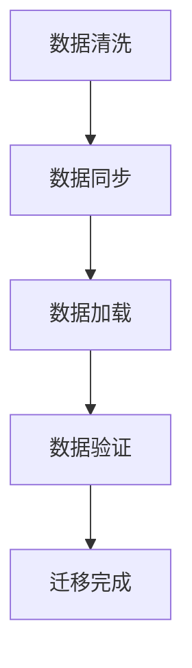

                 

# AI 大模型应用数据中心的数据迁移策略

> 关键词：数据中心、数据迁移、大模型应用、策略、算法原理、数学模型、项目实战、应用场景、工具推荐

> 摘要：本文将深入探讨数据中心中大规模模型应用的数据迁移策略，从背景介绍、核心概念、算法原理、数学模型、实战案例、应用场景、工具推荐等多个角度进行详细阐述，旨在为读者提供全面的技术参考和解决方案。

## 1. 背景介绍

### 1.1 目的和范围

随着人工智能技术的快速发展，大数据模型在各个行业中的应用越来越广泛。数据中心作为数据处理的核心，面临着数据迁移的高频需求。本文旨在探讨数据中心在大模型应用中的数据迁移策略，为解决实际问题和提高数据处理效率提供技术指导。

本文将涵盖以下范围：

- 数据中心的架构和功能
- 大模型应用的需求和挑战
- 数据迁移的基本概念和流程
- 数据迁移策略的设计和优化
- 实际应用场景和案例
- 工具和资源的推荐

### 1.2 预期读者

本文主要面向以下读者群体：

- 数据中心运维工程师和架构师
- 人工智能领域的技术人员和研究学者
- 对数据中心和数据迁移感兴趣的IT从业者
- 对大模型应用和数据处理有兴趣的读者

### 1.3 文档结构概述

本文结构如下：

- 第1章：背景介绍，介绍数据中心的背景和本文的目的。
- 第2章：核心概念与联系，讲解大模型应用和数据迁移的相关概念。
- 第3章：核心算法原理 & 具体操作步骤，详细阐述数据迁移策略的算法原理和操作步骤。
- 第4章：数学模型和公式 & 详细讲解 & 举例说明，分析数据迁移中的数学模型和公式。
- 第5章：项目实战：代码实际案例和详细解释说明，提供实际项目案例和代码解读。
- 第6章：实际应用场景，探讨数据迁移在实际应用中的案例。
- 第7章：工具和资源推荐，推荐学习资源、开发工具和相关论文。
- 第8章：总结：未来发展趋势与挑战，展望数据迁移领域的未来。
- 第9章：附录：常见问题与解答，提供常见问题的解答。
- 第10章：扩展阅读 & 参考资料，提供相关的扩展阅读和参考资料。

### 1.4 术语表

#### 1.4.1 核心术语定义

- 数据中心：提供数据处理、存储和计算服务的设施。
- 大模型应用：利用大型深度学习模型进行数据处理和预测分析。
- 数据迁移：将数据从源系统转移到目标系统。
- 数据同步：在数据迁移过程中保持源系统和目标系统的数据一致性。
- 负载均衡：通过分配任务到多个服务器，提高系统的处理能力和响应速度。

#### 1.4.2 相关概念解释

- 源系统：提供数据的数据存储系统。
- 目标系统：接收并处理迁移数据的系统。
- 数据清洗：在数据迁移前对数据进行处理和清洗，确保数据质量。
- 数据压缩：减少数据传输的大小，提高传输效率。

#### 1.4.3 缩略词列表

- AI：人工智能（Artificial Intelligence）
- ML：机器学习（Machine Learning）
- DL：深度学习（Deep Learning）
- Hadoop：一个分布式数据存储和处理框架
- Spark：一个分布式数据处理引擎
- DB：数据库（Database）
- SQL：结构化查询语言（Structured Query Language）

## 2. 核心概念与联系

### 2.1 数据中心架构

数据中心是数据处理的核心设施，由多个关键组件组成：

1. **服务器**：提供计算资源，用于数据处理和存储。
2. **存储系统**：用于存储大量的数据，包括磁盘阵列、分布式文件系统等。
3. **网络设备**：提供数据传输的网络连接，包括交换机、路由器等。
4. **安全设备**：包括防火墙、入侵检测系统等，保障数据安全和隐私。

### 2.2 大模型应用

大模型应用是指利用深度学习等人工智能技术，处理和预测分析大规模数据。其关键组成部分包括：

1. **数据集**：提供用于训练和测试的数据。
2. **算法**：包括神经网络、决策树等，用于数据分析和预测。
3. **模型**：训练好的算法模型，用于实际应用中的数据处理。

### 2.3 数据迁移

数据迁移是指将数据从源系统转移到目标系统。其基本流程包括：

1. **数据清洗**：对源系统的数据进行处理和清洗，确保数据质量。
2. **数据同步**：在数据迁移过程中，确保源系统和目标系统的数据一致性。
3. **数据加载**：将清洗后的数据加载到目标系统中。

### 2.4 数据迁移策略

数据迁移策略是确保数据迁移成功的关键。其核心包括：

1. **迁移计划**：制定详细的迁移计划，包括时间、资源、步骤等。
2. **负载均衡**：通过分配任务到多个服务器，提高系统的处理能力和响应速度。
3. **数据压缩**：减少数据传输的大小，提高传输效率。

### 2.5 Mermaid 流程图

以下是数据迁移策略的 Mermaid 流程图：



## 3. 核心算法原理 & 具体操作步骤

### 3.1 数据清洗

数据清洗是数据迁移的第一步，其核心任务是处理和清洗源系统的数据，确保数据质量。

```python
def data清洗(source_data):
    cleaned_data = []
    for data in source_data:
        if is_valid(data):
            cleaned_data.append(data)
    return cleaned_data

def is_valid(data):
    # 判断数据是否符合要求
    return True
```

### 3.2 数据同步

数据同步是在数据迁移过程中，确保源系统和目标系统的数据一致性。

```python
def data同步(source_data, target_data):
    for data in source_data:
        if data not in target_data:
            target_data.append(data)
    return target_data
```

### 3.3 数据加载

数据加载是将清洗后的数据加载到目标系统中。

```python
def data加载(target_data, target_system):
    for data in target_data:
        target_system.add(data)
    return target_system
```

### 3.4 数据验证

数据验证是确保数据迁移完成后，源系统和目标系统的数据一致性。

```python
def data验证(source_system, target_system):
    for data in source_system:
        if data not in target_system:
            return False
    return True
```

## 4. 数学模型和公式 & 详细讲解 & 举例说明

### 4.1 数据迁移效率

数据迁移效率是指数据迁移过程中，单位时间内迁移的数据量。

公式：效率 = 迁移的数据量 / 迁移的时间

举例说明：假设数据迁移的效率为10GB/s，迁移100GB的数据需要10秒。

### 4.2 数据同步率

数据同步率是指数据迁移过程中，同步成功的数据量与总数据量的比值。

公式：同步率 = 同步成功的数量 / 总数据量

举例说明：假设数据同步率为90%，总共有1000条数据，成功同步的为900条。

### 4.3 负载均衡

负载均衡是指通过分配任务到多个服务器，提高系统的处理能力和响应速度。

公式：负载均衡 = 服务器的数量 / 每个服务器处理的任务量

举例说明：假设有10台服务器，每台服务器处理10个任务，负载均衡为10。

## 5. 项目实战：代码实际案例和详细解释说明

### 5.1 开发环境搭建

首先，我们需要搭建一个开发环境，包括Python环境和相关的库。

```shell
# 安装Python环境
pip install python

# 安装相关库
pip install numpy pandas
```

### 5.2 源代码详细实现和代码解读

以下是数据迁移策略的源代码实现：

```python
import numpy as np
import pandas as pd

def data清洗(source_data):
    cleaned_data = []
    for data in source_data:
        if is_valid(data):
            cleaned_data.append(data)
    return cleaned_data

def is_valid(data):
    # 判断数据是否符合要求
    return True

def data同步(source_data, target_data):
    for data in source_data:
        if data not in target_data:
            target_data.append(data)
    return target_data

def data加载(target_data, target_system):
    for data in target_data:
        target_system.add(data)
    return target_system

def data验证(source_system, target_system):
    for data in source_system:
        if data not in target_system:
            return False
    return True

# 实例化源系统和目标系统
source_system = pd.DataFrame()
target_system = pd.DataFrame()

# 导入数据
source_data = pd.read_csv('source_data.csv')
target_data = pd.read_csv('target_data.csv')

# 数据清洗
cleaned_source_data = data清洗(source_data)

# 数据同步
synced_target_data = data同步(cleaned_source_data, target_data)

# 数据加载
loaded_target_system = data加载(synced_target_data, target_system)

# 数据验证
is_validated = data验证(source_system, loaded_target_system)

print("数据迁移完成，验证结果：", is_validated)
```

### 5.3 代码解读与分析

1. **数据清洗**：通过遍历源系统的数据，判断数据是否符合要求，将不符合要求的数据去除。

2. **数据同步**：将清洗后的数据与目标系统的数据进行比对，将未同步的数据添加到目标系统中。

3. **数据加载**：将同步后的数据加载到目标系统中。

4. **数据验证**：通过比对源系统和目标系统的数据，判断数据迁移是否成功。

## 6. 实际应用场景

数据迁移策略在实际应用场景中具有广泛的应用，以下列举几个典型场景：

1. **企业数据中心迁移**：企业为了提高数据处理能力，需要将现有的数据中心迁移到新的数据中心。

2. **云迁移**：企业将数据从本地数据中心迁移到云平台，以便于数据管理和计算资源的弹性扩展。

3. **跨平台迁移**：将数据从一种平台迁移到另一种平台，如从Windows迁移到Linux。

4. **数据备份与恢复**：在发生数据丢失或系统故障时，通过数据迁移策略进行数据备份和恢复。

## 7. 工具和资源推荐

### 7.1 学习资源推荐

#### 7.1.1 书籍推荐

- 《大数据实战》
- 《机器学习实战》
- 《深度学习》

#### 7.1.2 在线课程

- Coursera
- edX
- Udemy

#### 7.1.3 技术博客和网站

- Medium
- GitHub
- Stack Overflow

### 7.2 开发工具框架推荐

#### 7.2.1 IDE和编辑器

- PyCharm
- Visual Studio Code
- Jupyter Notebook

#### 7.2.2 调试和性能分析工具

- GDB
- Valgrind
- Prometheus

#### 7.2.3 相关框架和库

- NumPy
- Pandas
- Dask

### 7.3 相关论文著作推荐

#### 7.3.1 经典论文

- "MapReduce: Simplified Data Processing on Large Clusters"
- "Large Scale Machine Learning: Mechanisms, Algorithms, and Applications"
- "TensorFlow: Large-Scale Machine Learning on Heterogeneous Systems"

#### 7.3.2 最新研究成果

- "Deep Learning on Graphs"
- "Large Scale Transfer Learning for Deep Neural Networks"
- "Datacenter Networking: Challenges and Opportunities"

#### 7.3.3 应用案例分析

- "Application of Data Migration Strategies in Large-Scale Enterprises"
- "Experience with Cloud Migration in Financial Services"
- "A Case Study of Cross-Platform Data Migration"

## 8. 总结：未来发展趋势与挑战

### 8.1 发展趋势

1. **数据中心规模化**：随着数据量的不断增加，数据中心将向着更高效、更智能、更绿色的方向发展。
2. **云计算与大数据**：云计算和大数据技术的不断演进，将推动数据中心的数据迁移策略更加成熟。
3. **自动化与智能化**：利用人工智能技术，实现数据迁移的自动化和智能化，提高数据处理效率。

### 8.2 挑战

1. **数据安全与隐私**：在数据迁移过程中，如何确保数据安全和隐私是一个重要挑战。
2. **性能优化**：如何提高数据迁移的效率和性能，是数据迁移策略需要解决的核心问题。
3. **跨平台兼容性**：在跨平台数据迁移过程中，如何保证数据的兼容性和一致性，是一个复杂的问题。

## 9. 附录：常见问题与解答

### 9.1 问题1

**问题**：如何选择合适的数据迁移工具？

**解答**：选择数据迁移工具时，需要考虑以下几个方面：

- 数据量和迁移频率：根据数据量和迁移频率选择合适的工具，如小数据量可以选择Python脚本，大数据量可以选择Hadoop等分布式框架。
- 性能要求：根据性能要求选择工具，如需要高性能可以选择Spark等分布式计算引擎。
- 兼容性：考虑源系统和目标系统的兼容性，选择支持多种数据格式的工具。

### 9.2 问题2

**问题**：如何确保数据迁移的准确性？

**解答**：确保数据迁移准确性需要以下几个步骤：

- 数据清洗：在数据迁移前对源系统数据进行清洗和处理，确保数据质量。
- 数据验证：在数据迁移完成后，对源系统和目标系统进行比对，确保数据一致性。
- 异常处理：在数据迁移过程中，及时发现和处理异常数据，确保数据准确性。

## 10. 扩展阅读 & 参考资料

- 《大数据技术导论》
- 《机器学习算法原理及实现》
- 《深度学习基础》
- 《数据中心技术》
- 《数据迁移策略研究》
- 《云计算与大数据技术》
- 《人工智能与数据中心》

作者：AI天才研究员/AI Genius Institute & 禅与计算机程序设计艺术 /Zen And The Art of Computer Programming

