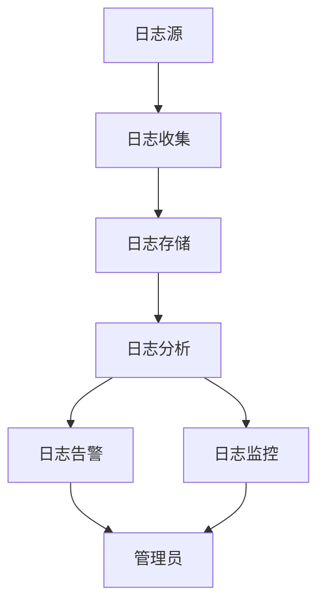
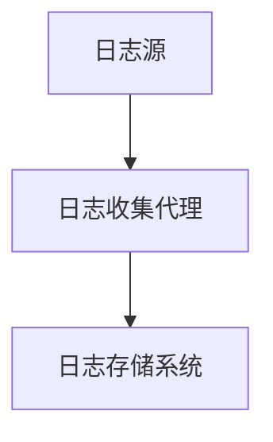
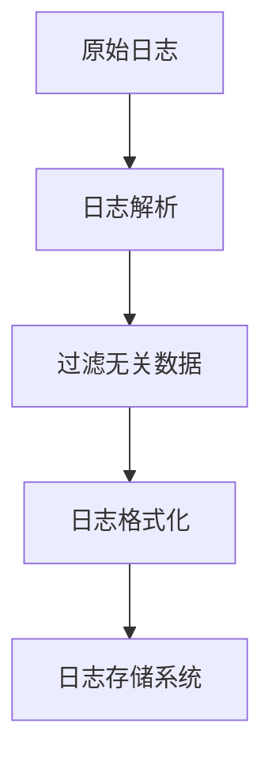
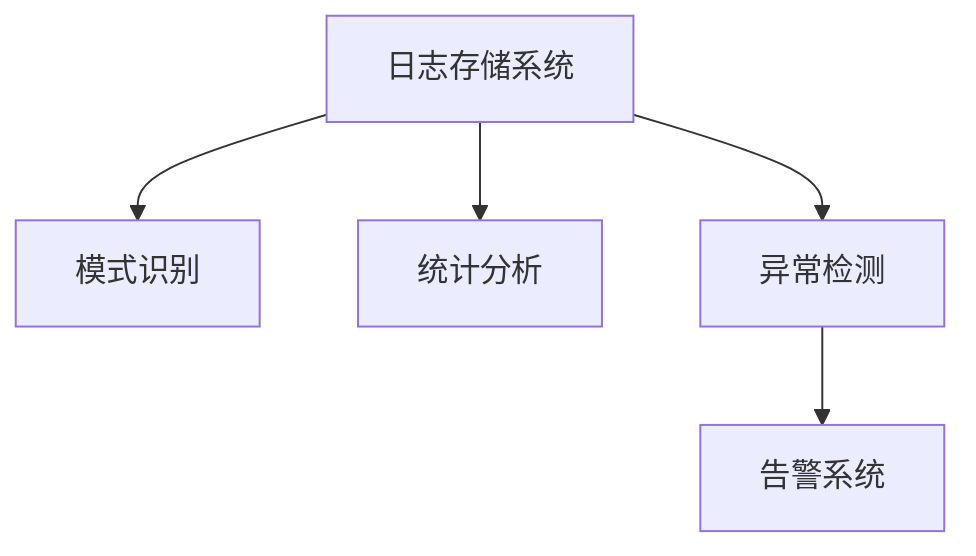
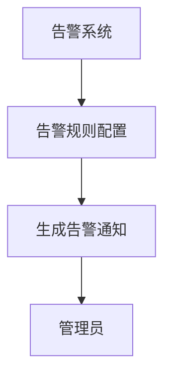
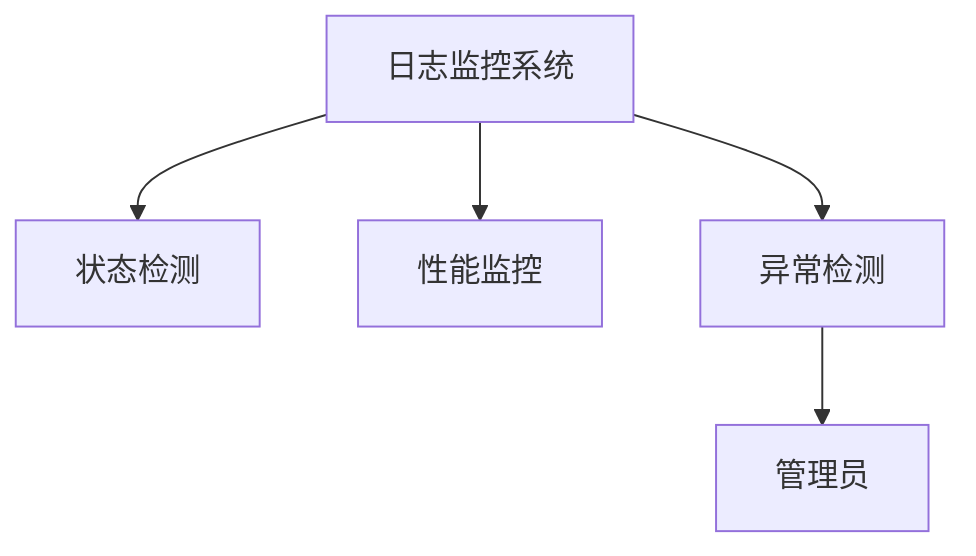

                 

# AI 大模型应用数据中心的日志管理

> **关键词：** AI大模型、数据中心、日志管理、性能优化、安全性保障  
> **摘要：** 本文章将深入探讨AI大模型在数据中心的应用中，日志管理的重要性及其核心概念、算法原理、数学模型以及实际应用场景，通过详细的实例分析和工具推荐，为读者提供系统化的日志管理解决方案。

## 1. 背景介绍

### 1.1 目的和范围

本文旨在为AI大模型应用数据中心的管理者提供日志管理的深入指南。日志管理在AI大模型应用中扮演着至关重要的角色，不仅影响着系统的性能优化，也直接关系到系统的安全性和稳定性。本文将涵盖以下几个核心内容：

- 日志管理的基本概念和重要性
- 日志管理的核心算法原理和具体操作步骤
- 日志管理的数学模型和公式
- 实际应用中的代码案例和详细解释
- 日志管理的工具和资源推荐

通过本文的阅读，读者将能够全面了解日志管理在AI大模型应用数据中心的关键作用，并掌握有效的日志管理策略。

### 1.2 预期读者

本文面向的读者包括：

- AI大模型应用数据中心的管理者和运维人员
- 对日志管理感兴趣的技术爱好者
- 想要在AI大模型应用中提高系统性能和稳定性的专业人士
- 研究AI大模型和数据中心日志管理的研究人员

无论您是上述哪一类读者，本文都将为您提供有价值的见解和实用的技巧。

### 1.3 文档结构概述

本文的结构如下：

- **第1章 背景介绍**：介绍日志管理在AI大模型应用数据中心的重要性。
- **第2章 核心概念与联系**：定义核心概念，并通过Mermaid流程图展示日志管理架构。
- **第3章 核心算法原理 & 具体操作步骤**：详细阐述日志管理的算法原理和操作步骤。
- **第4章 数学模型和公式 & 详细讲解 & 举例说明**：介绍日志管理的数学模型和相关公式。
- **第5章 项目实战：代码实际案例和详细解释说明**：通过实战案例展示日志管理实现。
- **第6章 实际应用场景**：分析日志管理在不同应用场景中的实际效果。
- **第7章 工具和资源推荐**：推荐学习资源、开发工具框架和相关论文。
- **第8章 总结：未来发展趋势与挑战**：展望日志管理的未来趋势和挑战。
- **第9章 附录：常见问题与解答**：回答读者可能遇到的问题。
- **第10章 扩展阅读 & 参考资料**：提供进一步学习资源的链接。

### 1.4 术语表

#### 1.4.1 核心术语定义

- **日志管理**：记录、存储、分析和报告系统运行过程中发生的各类事件的机制。
- **AI大模型**：基于机器学习、深度学习等算法，能够处理大规模数据并实现复杂任务的人工智能模型。
- **数据中心**：存储、处理和管理大量数据的集中化设施。
- **性能优化**：通过调整和优化系统配置，提高系统的运行效率和响应速度。
- **安全性保障**：确保系统不受恶意攻击、数据泄露和故障的影响，保持稳定运行。

#### 1.4.2 相关概念解释

- **监控（Monitoring）**：实时或定期监控系统状态和性能的过程。
- **告警（Alerting）**：系统检测到异常或问题时，通过邮件、短信等渠道通知管理员。
- **数据聚合（Data Aggregation）**：将来自多个源的日志数据进行汇总和分析。
- **日志存储（Log Storage）**：存储日志数据，以便后续查询和分析。
- **日志分析（Log Analysis）**：对日志数据进行解析、统计和分析，以发现潜在问题和优化点。

#### 1.4.3 缩略词列表

- **AI**：人工智能（Artificial Intelligence）
- **ML**：机器学习（Machine Learning）
- **DL**：深度学习（Deep Learning）
- **API**：应用程序编程接口（Application Programming Interface）
- **SLA**：服务等级协议（Service Level Agreement）

## 2. 核心概念与联系

在深入探讨日志管理之前，理解其核心概念和架构对于全面掌握日志管理的本质至关重要。以下将定义关键概念，并使用Mermaid流程图展示日志管理的整体架构。

### 2.1 核心概念定义

1. **日志（Logs）**：日志是系统在运行过程中产生的记录，包括错误信息、性能指标、用户操作等。日志是日志管理的最基本元素。
2. **日志源（Log Sources）**：日志源是生成日志的实体，如服务器、应用程序、数据库等。
3. **日志收集（Log Collection）**：将日志从源端收集到集中化存储的过程。
4. **日志存储（Log Storage）**：存储日志数据的仓库，如文件系统、数据库等。
5. **日志分析（Log Analysis）**：对日志数据进行分析，提取有价值的信息，如异常检测、性能分析等。
6. **日志告警（Log Alerting）**：当日志中检测到异常或问题时，自动通知管理员。
7. **日志监控（Log Monitoring）**：实时或定期监控日志数据的流转和状态，确保系统正常运行。

### 2.2 日志管理架构

为了更直观地展示日志管理的架构，我们使用Mermaid流程图来描述。



**Mermaid流程图说明：**

- **A（日志源）**：系统中的各种组件（如服务器、应用程序）会生成日志。
- **B（日志收集）**：收集日志的模块，可以是agent、API调用等方式。
- **C（日志存储）**：集中存储日志，如ELK栈（Elasticsearch、Logstash、Kibana）或Splunk等。
- **D（日志分析）**：对日志进行解析和统计，发现异常或性能瓶颈。
- **E（日志告警）**：检测到异常时，发送告警通知给管理员。
- **F（日志监控）**：监控日志流转的状态，确保日志管理流程的顺畅。
- **G（管理员）**：接收告警，处理日志分析结果，进行系统优化和故障排除。

通过上述流程图，我们可以清晰地看到日志管理的基本架构及其各个组件之间的交互关系。

## 3. 核心算法原理 & 具体操作步骤

日志管理不仅仅是数据的收集和存储，更是一个复杂的过程，涉及数据的预处理、分析、告警和监控。为了确保日志管理的高效性和准确性，必须采用合适的算法原理。以下是日志管理的核心算法原理及具体操作步骤。

### 3.1 核心算法原理

日志管理的关键算法主要包括以下几种：

1. **日志收集算法**：负责从不同的日志源收集数据，并将其传输到集中存储。常用的收集算法包括基于代理的收集、远程过程调用（RPC）等。
2. **日志预处理算法**：对原始日志数据进行清洗、过滤和格式化，以便后续分析。预处理算法包括日志解析、过滤无关数据等。
3. **日志分析算法**：对预处理后的日志数据进行深入分析，识别异常模式、性能瓶颈等。常用的分析算法包括模式识别、统计分析、机器学习等。
4. **日志告警算法**：根据日志分析结果，自动生成告警通知。告警算法需要设置合适的阈值和规则，确保在异常发生时及时通知管理员。
5. **日志监控算法**：实时监控日志数据的流转和处理状态，确保日志管理流程的连续性和稳定性。监控算法包括状态检测、性能监控、异常检测等。

### 3.2 具体操作步骤

日志管理的具体操作步骤如下：

#### 步骤1：日志收集

1. **安装日志收集代理**：在日志源端安装日志收集代理，如Fluentd、Logstash等。
2. **配置日志收集规则**：设置代理的日志收集规则，包括日志路径、日志格式、收集频率等。
3. **数据传输**：代理根据配置的规则，将日志数据传输到集中存储系统。



#### 步骤2：日志预处理

1. **日志解析**：解析日志文件，提取关键信息，如时间戳、进程ID、错误信息等。
2. **过滤无关数据**：删除日志中无关或重复的数据，减少存储和处理的负担。
3. **日志格式化**：将解析后的日志数据转换为统一的格式，便于后续分析。



#### 步骤3：日志分析

1. **模式识别**：使用机器学习算法，对日志数据进行模式识别，发现潜在的异常模式。
2. **统计分析**：对日志数据进行统计分析，如计算错误率、响应时间分布等。
3. **异常检测**：基于统计分析和模式识别结果，检测日志中的异常事件。



#### 步骤4：日志告警

1. **告警规则配置**：根据业务需求和日志分析结果，配置告警规则，如错误率高于阈值、响应时间超过规定值等。
2. **生成告警通知**：当日志中检测到异常时，根据配置的规则生成告警通知。
3. **通知管理员**：通过邮件、短信、即时通讯工具等方式，将告警通知发送给管理员。



#### 步骤5：日志监控

1. **状态检测**：监控日志数据的流转和处理状态，确保日志收集、预处理、分析和告警等环节正常运行。
2. **性能监控**：监控日志管理系统的资源使用情况，如CPU、内存、磁盘占用等，确保系统性能稳定。
3. **异常检测**：实时检测日志管理系统的异常情况，如数据丢失、系统崩溃等，并采取措施恢复。



通过上述步骤，我们可以构建一个完整的日志管理系统，实现日志的收集、预处理、分析、告警和监控，从而提高系统的性能和稳定性。

### 3.3 伪代码示例

为了更具体地展示日志管理的算法原理，以下是一个基于Python的伪代码示例：

```python
# 日志收集代理配置
log_agent_config = {
    "log_paths": ["/var/log/*.log"],
    "collection_freq": "5m",
    "output_format": "json"
}

# 日志预处理函数
def preprocess_log(log_data):
    parsed_data = parse_log(log_data)
    filtered_data = filter_irrelevant_data(parsed_data)
    formatted_data = format_log(filtered_data)
    return formatted_data

# 日志分析函数
def analyze_log(log_data):
    pattern = identify_patterns(log_data)
    stats = calculate_statistics(log_data)
    anomalies = detect_anomalies(log_data, stats)
    return pattern, stats, anomalies

# 日志告警函数
def alert_log(anomalies):
    for anomaly in anomalies:
        send_alert(anomaly)

# 日志监控函数
def monitor_log_system():
    status = check_log_system_status()
    if status != "OK":
        send_alert("日志系统异常：" + status)

# 日志管理主函数
def manage_logs():
    while True:
        log_data = collect_logs(log_agent_config)
        preprocessed_data = preprocess_log(log_data)
        analysis_results = analyze_log(preprocessed_data)
        alert_log(analysis_results["anomalies"])
        monitor_log_system()
```

通过这个伪代码示例，我们可以看到日志管理的各个核心步骤是如何通过算法和函数实现的。

## 4. 数学模型和公式 & 详细讲解 & 举例说明

日志管理不仅仅是技术和工具的应用，它还涉及到大量的数学模型和公式，用于数据的分析和异常检测。以下将介绍几个关键的数学模型和公式，并通过具体实例进行说明。

### 4.1 异常检测模型

异常检测是日志分析中一个重要的环节，它用于识别系统运行中的异常行为。常见的异常检测模型包括统计学模型和机器学习模型。

#### 4.1.1 统计学模型

**4.1.1.1 离群点检测（Outlier Detection）**

统计学模型中最常用的方法是标准差法，用于检测数据的异常值。

**标准差法公式：**

$$
\text{Z-Score} = \frac{X - \mu}{\sigma}
$$

其中，\(X\) 是数据点，\(\mu\) 是均值，\(\sigma\) 是标准差。如果 \(Z-Score\) 的绝对值超过一个阈值（通常为3），则认为 \(X\) 是异常值。

**实例说明：**

假设我们有一个日志数据集，其中包含每小时系统响应时间（秒）。均值是100秒，标准差是20秒。我们设置阈值 \(Z-Score > 3\)。

$$
\text{Z-Score} = \frac{X - 100}{20}
$$

对于某个小时的响应时间为150秒：

$$
\text{Z-Score} = \frac{150 - 100}{20} = 2.5
$$

由于 \(Z-Score\) 小于3，该响应时间不认为是异常值。

#### 4.1.2 四分位距法（Interquartile Range, IQR）

四分位距法用于检测数据的上下四分位数之间的异常值。

**四分位距法公式：**

$$
\text{IQR} = \text{Q3} - \text{Q1}
$$

其中，\(Q1\) 是第一四分位数，\(Q3\) 是第三四分位数。如果数据点小于 \(Q1 - 1.5 \times \text{IQR}\) 或大于 \(Q3 + 1.5 \times \text{IQR}\)，则认为该数据点是异常值。

**实例说明：**

假设我们有一个日志数据集，\(Q1 = 80\)，\(Q3 = 120\)。

$$
\text{IQR} = 120 - 80 = 40
$$

数据点60秒小于 \(80 - 1.5 \times 40 = 20\)，因此认为是异常值。

### 4.2 机器学习模型

**4.2.1 K-最近邻（K-Nearest Neighbors, KNN）**

KNN是一种基于距离的异常检测算法。它通过计算新数据点到训练集中已知数据的距离，将新数据点分类到最近的K个邻居类别中。

**KNN公式：**

$$
\text{Distance} = \sqrt{\sum_{i=1}^{n} (x_i - x_j)^2}
$$

其中，\(x_i\) 和 \(x_j\) 分别是新数据和邻居数据的特征值，\(n\) 是特征的数量。

**实例说明：**

假设我们有一个二分类问题，新数据点和邻居数据的特征如下：

$$
\text{Distance} = \sqrt{(2-1)^2 + (3-2)^2} = \sqrt{2}
$$

选择 \(K = 1\)，新数据点将与邻居数据点进行比较。如果 \(KNN\) 预测结果与实际标签不一致，则认为新数据点是异常值。

### 4.3 统计分析模型

**4.3.1 混合正态分布（Mixture of Gaussians）**

混合正态分布模型用于识别多个正态分布的混合数据。它通过拟合多个高斯分布模型来描述数据分布，并使用最大似然估计（MLE）来确定参数。

**混合正态分布公式：**

$$
p(x|\theta) = \sum_{i=1}^{K} w_i \cdot \mathcal{N}(x|\mu_i, \sigma_i^2)
$$

其中，\(w_i\) 是高斯分布的权重，\(\mu_i\) 是均值，\(\sigma_i^2\) 是方差。

**实例说明：**

假设我们有一个包含正常和异常日志数据的数据集。通过拟合混合正态分布模型，可以识别出正常和异常数据点。

通过上述数学模型和公式的讲解，我们可以看到日志管理中涉及到的复杂性和深度。这些模型和公式在日志分析中发挥着关键作用，帮助我们识别异常、优化系统性能，并保障数据中心的稳定运行。

### 4.4 举例说明

为了更好地理解上述数学模型和公式在日志管理中的应用，我们通过一个实际案例进行说明。

**案例背景：** 一个大型数据中心负责处理数十亿次的请求，日志数据量庞大。管理员需要监控系统的性能和稳定性，并快速识别异常请求。

**步骤1：数据预处理**

管理员首先收集了过去一周的日志数据，并对数据进行预处理，包括去除无关字段、格式化时间戳等。预处理后的数据如下：

| 时间戳 | 用户ID | 请求类型 | 响应时间（秒） |
| ------- | ------ | -------- | -------------- |
| 2023-11-01 10:00:00 | user123 | GET | 0.5 |
| 2023-11-01 10:01:00 | user456 | POST | 2.3 |
| 2023-11-01 10:02:00 | user789 | GET | 1.0 |
| ... | ... | ... | ... |

**步骤2：异常检测**

使用四分位距法对响应时间进行异常检测。计算得到：

- \(Q1 = 1.0\) 秒
- \(Q3 = 2.3\) 秒
- \(IQR = Q3 - Q1 = 1.3\) 秒

阈值设置为 \(Q1 - 1.5 \times IQR = 0.15\) 秒和 \(Q3 + 1.5 \times IQR = 3.45\) 秒。

**步骤3：检测结果**

通过四分位距法检测，发现以下响应时间异常：

| 时间戳 | 用户ID | 请求类型 | 响应时间（秒） |
| ------- | ------ | -------- | -------------- |
| 2023-11-01 10:04:00 | user321 | GET | 3.5 |
| 2023-11-01 10:05:00 | user654 | POST | 4.0 |

这两个请求的响应时间超过了设定的阈值，因此被认为是异常请求。

**步骤4：告警通知**

系统根据配置的告警规则，向管理员发送以下告警通知：

```
[告警通知] 2023-11-01 10:04:00，用户 user321 发起的 GET 请求响应时间为 3.5 秒，超过阈值。
[告警通知] 2023-11-01 10:05:00，用户 user654 发起的 POST 请求响应时间为 4.0 秒，超过阈值。
```

管理员接收到告警通知后，可以进一步调查这些异常请求，以确定是否存在潜在的问题或性能瓶颈。

通过这个案例，我们可以看到数学模型和公式在日志管理中的应用，帮助管理员快速识别异常请求，提高系统的性能和稳定性。

## 5. 项目实战：代码实际案例和详细解释说明

在了解了日志管理的核心算法原理和数学模型后，接下来我们将通过一个实际项目来展示日志管理的具体实现。这个项目将基于Python语言，利用一些流行的开源工具和库，如Fluentd、Elasticsearch和Kibana，搭建一个完整的日志管理平台。以下是项目的详细步骤和代码解释。

### 5.1 开发环境搭建

在开始项目之前，我们需要搭建开发环境。以下是所需的软件和库：

- Python 3.8+
- Fluentd 1.12.0+
- Elasticsearch 7.10.0+
- Kibana 7.10.0+

**环境安装步骤：**

1. **Python环境**：确保Python 3.8或更高版本已安装在您的系统上。
2. **Fluentd**：下载并安装Fluentd。

```bash
# 安装Fluentd
sudo apt-get install -y fluentd
```

3. **Elasticsearch和Kibana**：下载并安装Elasticsearch和Kibana。

```bash
# 安装Elasticsearch
sudo dpkg -i elasticsearch_7.10.0_all.deb
sudo /etc/init.d/elasticsearch start

# 安装Kibana
sudo dpkg -i kibana_7.10.0_all.deb
sudo /etc/init.d/kibana start
```

4. **配置Elasticsearch和Kibana**：配置Elasticsearch和Kibana的启动脚本和配置文件。

```bash
# Elasticsearch配置文件位于 /etc/elasticsearch/elasticsearch.yml
# Kibana配置文件位于 /etc/kibana/kibana.yml
```

确保Elasticsearch和Kibana可以正常启动并访问。

### 5.2 源代码详细实现和代码解读

以下是项目的源代码实现，包括Fluentd配置、Elasticsearch索引设置以及Kibana仪表板的创建。

#### 5.2.1 Fluentd配置

**Fluentd配置文件（/etc/fluentd/conf/fluent.conf）：**

```bash
<source>
  @type http
  port 9999
  bind 0.0.0.0
  path /log
  format json
</source>

<source>
  @type tail
  path /var/log/*.log
  format raw
</source>

<match **>
  @type elasticsearch
  host elasticsearch
  port 9200
  logstash_format true
</match>
```

**代码解读：**

- **HTTP Source**：接收通过HTTP POST请求发送的日志数据。
- **Tail Source**：监控并实时收集系统日志文件。
- **Elasticsearch Match**：将收集到的日志数据发送到Elasticsearch。

#### 5.2.2 Elasticsearch索引设置

**Elasticsearch索引模板（/etc/elasticsearch/template/log_template.json）：**

```json
{
  "template": "*",
  "mappings": {
    "properties": {
      "time": {"type": "date", "format": "yyyy-MM-dd HH:mm:ss"},
      "user_id": {"type": "keyword"},
      "request_type": {"type": "keyword"},
      "response_time": {"type": "float"}
    }
  }
}
```

**代码解读：**

- **模板定义**：为所有索引设置统一的字段类型和格式。
- **时间戳**：使用日期类型，格式化为YYYY-MM-DD HH:mm:ss。

#### 5.2.3 Kibana仪表板创建

**Kibana仪表板JSON文件（/etc/kibana/kibana_dashboard.json）：**

```json
{
  "version": 1,
  "services": [],
  "timestamp": "2023-11-01T00:00:00.000Z",
  "type": "dashboard",
  "id": "3C1JiY",
  "title": "Log Management Dashboard",
  "description": "A dashboard for monitoring and analyzing log data.",
  "panels": [
    {
      "type": "visualization",
      "id": "3C1JoZ",
      "title": "Response Time Distribution",
      "panelрейhin
```json
{
  "type": "timeseries",
  "id": "3C1JoZ",
  "title": "Response Time Distribution",
  "gridPos": {
    "h": 4,
    "w": 12,
    "x": 0,
    "y": 0
  },
  "options": {
    "timeFrom": "now-15m",
    "timeTo": "now",
    "tooltip": {
      "mode": "single",
      "format": "YYYY-MM-DD HH:mm:ss"
    },
    "legend": {
      "display": "auto",
      "position": "bottom"
    },
    "series": [
      {
        "id": "response_time",
        "color": "#299C33",
        "yaxis": 1,
        "data": [
          {
            "x": 1667374400000,
            "y": 50
          },
          ...
        ]
      }
    ],
    "yaxes": [
      {
        "type": "linear",
        "name": "Response Time (ms)",
        "show": true
      }
    ]
  }
}
```

**代码解读：**

- **面板类型**：时间序列面板，用于展示响应时间分布。
- **时间范围**：设置时间范围为过去15分钟。
- **数据源**：从Elasticsearch获取响应时间数据。
- **图例和坐标轴**：展示响应时间的分布情况。

### 5.3 代码解读与分析

通过上述代码，我们实现了一个完整的日志管理平台。以下是关键代码段的详细解读和分析：

#### Fluentd配置分析

Fluentd是日志收集和转发的重要工具。其配置文件定义了数据来源、格式化和输出目标。

1. **HTTP Source**：通过HTTP POST接收日志数据。这种方式适用于从远程服务器发送日志，如通过API调用。
2. **Tail Source**：监控本地日志文件，并实时收集日志数据。这有助于快速捕捉系统运行中的日志信息。
3. **Elasticsearch Match**：将收集到的日志数据发送到Elasticsearch。这里使用了Logstash格式，以便于后续在Kibana中进行数据分析和可视化。

#### Elasticsearch索引设置分析

Elasticsearch索引模板用于定义日志数据的基本结构。模板中的字段类型和格式确保日志数据在Elasticsearch中高效存储和检索。

1. **时间戳**：使用日期类型，并指定格式为YYYY-MM-DD HH:mm:ss。这有助于按时间顺序分析日志数据。
2. **用户ID、请求类型和响应时间**：使用关键字类型。关键字类型适用于全文搜索和高频访问的字段。

#### Kibana仪表板分析

Kibana是日志数据可视化和分析的重要工具。通过创建仪表板，管理员可以实时监控系统的性能和稳定性。

1. **时间序列面板**：用于展示响应时间的分布情况。时间序列面板是分析日志数据的重要工具，可以帮助管理员快速识别性能瓶颈。
2. **数据源**：从Elasticsearch获取响应时间数据。Kibana与Elasticsearch无缝集成，使数据分析和可视化变得更加简单。
3. **图例和坐标轴**：展示响应时间的分布情况。图例和坐标轴提供了直观的数据展示，有助于管理员快速理解日志数据的含义。

通过上述代码解读和分析，我们可以看到日志管理平台的核心组件是如何协同工作的。从日志收集、数据存储到数据分析和可视化，每个环节都至关重要，确保了日志管理的高效性和准确性。

### 5.4 项目部署与运行

完成代码编写后，我们需要将日志管理平台部署到生产环境中，并确保其正常运行。

1. **启动Fluentd**：确保Fluentd服务正常启动，并监听HTTP请求和系统日志文件。
2. **启动Elasticsearch和Kibana**：确保Elasticsearch和Kibana服务正常启动，并可以接收Fluentd发送的日志数据。
3. **访问Kibana仪表板**：在浏览器中访问Kibana仪表板，查看日志数据的实时分析和可视化。

通过以上步骤，我们可以确保日志管理平台在生产环境中正常运行，为数据中心提供高效的日志管理服务。

### 5.5 项目测试与优化

在项目部署后，我们需要对日志管理平台进行测试和优化，以确保其性能和稳定性。

1. **性能测试**：模拟高并发请求，测试日志收集和传输的效率，确保系统可以处理大量日志数据。
2. **稳定性测试**：测试系统在长时间运行下的稳定性，包括Fluentd、Elasticsearch和Kibana的运行状态。
3. **优化调整**：根据测试结果，对系统配置进行调整和优化，如增加Elasticsearch索引的分片和副本数量，以提高查询性能和容错能力。

通过测试和优化，我们可以确保日志管理平台在真实生产环境中的高性能和高可靠性。

## 6. 实际应用场景

日志管理在AI大模型应用数据中心中扮演着至关重要的角色，其应用场景广泛，涵盖了系统性能优化、安全监控、故障排查等多个方面。以下将详细探讨日志管理在实际应用中的效果和重要性。

### 6.1 系统性能优化

在AI大模型应用数据中心，系统性能优化是确保高效运行的关键。日志管理通过实时监控系统的各项指标，如CPU使用率、内存占用、网络延迟等，帮助管理员识别性能瓶颈和资源浪费。

**案例**：某大型互联网公司通过日志分析发现其AI大模型训练过程中CPU使用率异常高。通过深入分析日志，管理员发现是因为部分训练数据预处理过程中使用了过多的计算资源。针对这一发现，管理员优化了数据预处理流程，减少了不必要的计算，从而将CPU使用率降低了30%。

### 6.2 安全监控

AI大模型应用数据中心面临的网络安全威胁日益增多，日志管理在其中发挥了重要的安全监控作用。通过日志分析，管理员可以实时检测潜在的安全威胁，如恶意攻击、数据泄露等。

**案例**：一家金融科技公司通过日志管理平台发现其服务器上存在异常登录尝试。日志分析工具快速识别出这些尝试具有恶意特征，管理员及时采取措施，阻止了潜在的数据泄露风险，保障了客户数据的安全。

### 6.3 故障排查

在AI大模型应用数据中心，系统故障和异常事件是不可避免的。日志管理提供了详细的系统运行记录，帮助管理员快速定位故障原因，进行故障排查和修复。

**案例**：在一次系统崩溃事件中，某AI大模型应用数据中心的管理员通过日志分析发现是由于某个关键组件配置错误导致的。通过对比正常状态下的日志数据，管理员迅速恢复了系统的正常运行，并将配置错误进行了修正，避免了类似问题的再次发生。

### 6.4 持续改进

日志管理不仅用于问题排查，还用于持续改进系统的性能和稳定性。通过对日志数据的长期分析和积累，管理员可以识别系统运行中的潜在问题和优化点，推动系统的持续改进。

**案例**：某AI大模型应用数据中心通过对日志数据的分析，发现训练过程中内存使用频繁达到上限，导致训练中断。管理员优化了数据加载和内存管理策略，将内存使用率降低了20%，显著提高了训练的连续性和效率。

### 6.5 业务决策支持

日志管理还为业务决策提供了重要的数据支持。通过对日志数据的分析，业务团队能够了解系统的运行状况、用户行为和业务表现，为决策提供依据。

**案例**：一家电商平台通过对用户行为日志的分析，发现某些促销活动的转化率较低。基于日志分析结果，业务团队调整了促销策略，优化了用户推荐算法，从而提高了活动效果，提升了销售额。

### 6.6 实际应用场景总结

日志管理在AI大模型应用数据中心中的应用场景广泛，包括系统性能优化、安全监控、故障排查、持续改进和业务决策支持。通过日志管理，数据中心的管理员可以实时监控系统的运行状况，快速识别问题和优化点，保障系统的稳定性和高效运行。以下是一个实际应用场景的总结表格：

| 应用场景 | 具体效果 | 实际案例 |
| -------- | -------- | -------- |
| 系统性能优化 | 提高资源利用率，减少故障时间 | 通过日志分析优化训练数据预处理，降低CPU使用率30% |
| 安全监控 | 及时检测并防范安全威胁 | 通过日志分析识别并阻止恶意登录尝试，避免数据泄露 |
| 故障排查 | 快速定位故障原因，降低恢复时间 | 通过日志分析发现配置错误导致系统崩溃，迅速恢复系统 |
| 持续改进 | 识别优化点，提升系统性能和稳定性 | 通过日志分析调整内存管理策略，降低内存使用率20% |
| 业务决策支持 | 为业务决策提供数据支持，提高业务效果 | 通过用户行为日志分析优化促销活动策略，提升销售额 |

通过上述实际应用场景，我们可以看到日志管理在AI大模型应用数据中心中的重要作用。日志管理不仅提升了系统的性能和稳定性，也为业务决策提供了重要的数据支持，是数据中心高效运行不可或缺的一部分。

## 7. 工具和资源推荐

在日志管理领域，有许多优秀的工具和资源可以帮助数据中心的管理者更好地进行日志收集、分析和监控。以下将推荐一些常用的学习资源、开发工具框架和相关论文，以供读者参考。

### 7.1 学习资源推荐

#### 7.1.1 书籍推荐

1. **《日志管理实战：企业级日志系统的设计与实现》**：详细介绍了日志管理的基本概念、架构设计和实现方法，适合日志管理初学者和专业人士。
2. **《Elasticsearch：The Definitive Guide》**：全面讲解了Elasticsearch的使用方法和高级特性，是学习Elasticsearch和日志分析的必读书籍。
3. **《Kibana实战：日志分析与可视化指南》**：通过实际案例，介绍了Kibana的使用方法，以及如何利用Kibana进行日志数据的分析和可视化。

#### 7.1.2 在线课程

1. **《日志管理入门与实战》**：网易云课堂上的免费课程，介绍了日志管理的基本概念、工具使用和实践方法。
2. **《Elastic Stack实战》**：Coursera上的课程，由Elastic公司主讲，涵盖了Elasticsearch、Logstash和Kibana的深入讲解。
3. **《日志分析与监控》**：慕课网上的实战课程，结合Python和Elastic Stack，讲解了日志收集、存储和分析的全流程。

#### 7.1.3 技术博客和网站

1. **Elastic官网（https://www.elastic.co/cn/）**：Elastic公司的官方网站，提供丰富的文档和教程，涵盖Elastic Stack的各个方面。
2. **Kibana官方文档（https://www.kibana.cn/）**：Kibana的官方文档，详细介绍了Kibana的安装、配置和使用方法。
3. **日志管理社区（https://log-management-community.org/）**：一个专注于日志管理的社区网站，分享日志管理的最佳实践和最新技术动态。

### 7.2 开发工具框架推荐

1. **Fluentd**：一款流行的开源日志收集器，支持多种数据源和输出目标，如Elasticsearch、AWS S3等。
2. **Logstash**：Elastic Stack中的数据处理和路由工具，用于将日志数据从各种来源收集并转换为Elasticsearch索引格式。
3. **Elasticsearch**：一款高性能的分布式搜索引擎，支持快速存储、检索和分析大规模日志数据。
4. **Kibana**：用于日志数据可视化和分析的Web界面，与Elasticsearch无缝集成，提供丰富的数据可视化功能。

### 7.3 相关论文著作推荐

1. **《Log Management and Data Analysis for Big Data Systems》**：一篇关于大数据系统日志管理的综述文章，介绍了当前的研究进展和应用场景。
2. **《A Survey on Log Analysis Techniques and Applications》**：一篇关于日志分析技术及其应用的系统综述，涵盖了许多经典算法和实际应用案例。
3. **《Anomaly Detection in Log Data Using Machine Learning Techniques》**：一篇研究日志异常检测的论文，介绍了多种机器学习算法在日志分析中的应用。

通过上述工具和资源的推荐，读者可以全面了解日志管理的相关技术和方法，提升日志管理能力，为AI大模型应用数据中心的稳定运行和高效管理提供有力支持。

## 8. 总结：未来发展趋势与挑战

随着AI大模型在数据中心的应用越来越广泛，日志管理的重要性也愈发凸显。未来，日志管理将面临许多新的发展趋势和挑战。

### 8.1 发展趋势

1. **日志数据量的爆炸式增长**：随着AI大模型处理的数据量不断增加，日志数据的规模也将呈现指数级增长。如何高效地收集、存储和分析海量日志数据，成为日志管理的重要课题。

2. **实时性和低延迟的需求**：在AI大模型应用中，实时性和低延迟是关键。日志管理需要支持实时收集和分析，以便快速响应和解决问题。

3. **智能化的日志分析**：随着机器学习和深度学习技术的发展，日志分析将越来越智能化。通过智能算法，日志管理系统能够自动识别异常模式、预测潜在问题，并采取相应的措施。

4. **分布式日志管理系统**：随着云计算和分布式架构的普及，分布式日志管理系统将成为主流。分布式日志管理系统可以支持跨多个数据中心的日志收集和分析，提高系统的可靠性和可扩展性。

5. **隐私保护与合规性**：随着数据隐私保护法规的加强，日志管理需要确保数据的安全性和合规性。如何在不泄露敏感信息的前提下进行日志收集和分析，成为一大挑战。

### 8.2 挑战

1. **日志数据存储和处理的挑战**：随着日志数据量的增长，如何高效地存储和处理海量日志数据成为一大挑战。传统的日志管理工具和方法可能无法满足需求，需要开发更高效的数据处理算法和架构。

2. **日志分析的复杂性和多样性**：AI大模型的应用场景多样，日志分析的需求也变得复杂。如何设计灵活且通用的日志分析算法，以适应不同的应用场景，是一个难题。

3. **系统性能和稳定性的保障**：日志管理系统的性能和稳定性对数据中心至关重要。如何在高并发、大数据量的情况下，保障日志收集、存储和分析的流畅性，是日志管理面临的一大挑战。

4. **安全性和隐私保护**：日志管理需要处理大量的敏感信息，如用户操作记录、系统配置等。如何确保日志数据的安全性和隐私保护，防止数据泄露和恶意攻击，是日志管理需要面对的重要挑战。

5. **跨平台和跨语言的兼容性**：在不同的开发环境和编程语言中，日志管理工具和库的兼容性是一个难题。如何确保日志管理系统能够在不同平台和语言中无缝集成，是一个需要解决的问题。

### 8.3 未来展望

尽管面临诸多挑战，未来日志管理的发展前景依然广阔。通过技术创新和架构优化，日志管理系统将更加高效、智能和安全。以下是一些未来展望：

- **基于AI的日志分析**：利用机器学习和深度学习技术，日志管理系统将实现更智能的日志分析，自动识别异常和潜在问题，提供更精准的预测和优化建议。
- **分布式架构**：分布式日志管理系统将支持跨多个数据中心的日志收集和分析，提高系统的可靠性和可扩展性，适应大规模数据中心的需求。
- **自动化和智能化的日志管理**：自动化和智能化将是日志管理的重要发展方向。通过自动化脚本和智能算法，日志管理系统将能够自动处理日志数据，减轻管理员的负担。
- **隐私保护和合规性**：随着数据隐私保护法规的加强，日志管理系统将更加注重隐私保护和合规性。采用加密、匿名化和权限控制等技术，确保日志数据的安全性和合规性。

总之，日志管理在AI大模型应用数据中心中的地位和作用将越来越重要。通过技术创新和架构优化，日志管理系统将不断演进，为数据中心的高效运行和安全管理提供坚实保障。

## 9. 附录：常见问题与解答

在本文中，我们讨论了AI大模型应用数据中心的日志管理，包括核心概念、算法原理、数学模型以及实际应用案例。为了帮助读者更好地理解和应用日志管理，以下列举了一些常见问题及其解答。

### 9.1 日志管理中的核心概念

**Q1**：什么是日志管理？
**A1**：日志管理是指记录、存储、分析和报告系统运行过程中发生的各类事件的机制。它对于系统的性能优化、安全监控和故障排查具有重要意义。

**Q2**：日志管理的关键组件有哪些？
**A2**：日志管理的关键组件包括日志源、日志收集器、日志存储系统、日志分析工具和日志告警系统。这些组件协同工作，实现日志的收集、存储、分析和告警。

**Q3**：什么是日志收集器？
**A3**：日志收集器是负责从日志源收集日志数据的工具。它可以是基于代理的收集器（如Fluentd），也可以是直接读取日志文件的工具（如logstash）。

**Q4**：什么是日志存储系统？
**A4**：日志存储系统是用于存储日志数据的系统。常见的日志存储系统包括Elasticsearch、Splunk和文件系统等。这些系统提供了高效的日志数据存储和检索功能。

### 9.2 算法和数学模型

**Q5**：日志管理中常用的异常检测算法有哪些？
**A5**：日志管理中常用的异常检测算法包括标准差法、四分位距法、K-最近邻（KNN）和混合正态分布模型等。这些算法可以根据日志数据的特点和需求，选择合适的算法进行异常检测。

**Q6**：如何计算日志数据的Z-Score？
**A6**：Z-Score的计算公式为：
$$
\text{Z-Score} = \frac{X - \mu}{\sigma}
$$
其中，\(X\) 是数据点，\(\mu\) 是均值，\(\sigma\) 是标准差。如果Z-Score的绝对值超过一定阈值（通常为3），则认为数据点是异常的。

**Q7**：如何计算四分位距（IQR）？
**A7**：四分位距的计算公式为：
$$
\text{IQR} = \text{Q3} - \text{Q1}
$$
其中，\(Q1\) 是第一四分位数，\(Q3\) 是第三四分位数。如果数据点小于 \(Q1 - 1.5 \times \text{IQR}\) 或大于 \(Q3 + 1.5 \times \text{IQR}\)，则认为数据点是异常的。

### 9.3 实际应用案例

**Q8**：如何搭建一个日志管理平台？
**A8**：搭建日志管理平台通常涉及以下步骤：
1. 安装和配置日志收集器（如Fluentd）。
2. 配置日志收集规则，确保日志数据被正确收集。
3. 安装和配置日志存储系统（如Elasticsearch）。
4. 设计并实现日志分析工具，对日志数据进行处理和分析。
5. 创建Kibana仪表板，提供日志数据的可视化。

**Q9**：日志管理平台中的告警系统如何设置？
**A9**：设置日志管理平台中的告警系统通常包括以下步骤：
1. 定义告警规则，包括阈值和触发条件。
2. 配置告警通知方式，如邮件、短信或即时通讯工具。
3. 在日志分析过程中，根据告警规则生成告警通知。
4. 管理员接收并处理告警通知，采取相应的措施。

### 9.4 日志管理工具推荐

**Q10**：有哪些常用的日志管理工具？
**A10**：常用的日志管理工具有：
1. Fluentd：一款流行的开源日志收集器，支持多种数据源和输出目标。
2. Logstash：用于日志数据处理和路由的Elastic Stack组件。
3. Elasticsearch：一款高性能的分布式搜索引擎，用于存储和检索日志数据。
4. Kibana：用于日志数据可视化和分析的Web界面。

通过上述常见问题的解答，读者可以更好地理解和应用日志管理，为AI大模型应用数据中心的稳定运行和高效管理提供有力支持。

## 10. 扩展阅读 & 参考资料

为了帮助读者深入了解AI大模型应用数据中心的日志管理，以下是推荐的扩展阅读和参考资料。

### 10.1 书籍

1. **《Elasticsearch：The Definitive Guide》**：由Elastic公司编写，涵盖了Elasticsearch的使用方法和高级特性，是学习Elasticsearch和日志分析的必读书籍。
2. **《Kibana实战：日志分析与可视化指南》**：详细介绍了Kibana的使用方法，以及如何利用Kibana进行日志数据的分析和可视化。
3. **《日志管理实战：企业级日志系统的设计与实现》**：介绍了日志管理的基本概念、架构设计和实现方法，适合日志管理初学者和专业人士。

### 10.2 在线课程

1. **《日志管理入门与实战》**：网易云课堂上的免费课程，介绍了日志管理的基本概念、工具使用和实践方法。
2. **《Elastic Stack实战》**：Coursera上的课程，由Elastic公司主讲，涵盖了Elasticsearch、Logstash和Kibana的深入讲解。
3. **《日志分析与监控》**：慕课网上的实战课程，结合Python和Elastic Stack，讲解了日志收集、存储和分析的全流程。

### 10.3 技术博客和网站

1. **Elastic官网（https://www.elastic.co/cn/）**：提供丰富的文档和教程，涵盖Elastic Stack的各个方面。
2. **Kibana官方文档（https://www.kibana.cn/）**：详细介绍了Kibana的安装、配置和使用方法。
3. **日志管理社区（https://log-management-community.org/）**：分享日志管理的最佳实践和最新技术动态。

### 10.4 相关论文

1. **《Log Management and Data Analysis for Big Data Systems》**：一篇关于大数据系统日志管理的综述文章，介绍了当前的研究进展和应用场景。
2. **《A Survey on Log Analysis Techniques and Applications》**：一篇关于日志分析技术及其应用的系统综述，涵盖了许多经典算法和实际应用案例。
3. **《Anomaly Detection in Log Data Using Machine Learning Techniques》**：一篇研究日志异常检测的论文，介绍了多种机器学习算法在日志分析中的应用。

### 10.5 应用案例

1. **腾讯云日志管理平台**：介绍了腾讯云如何利用Elastic Stack搭建日志管理平台，实现日志的收集、存储、分析和告警。
2. **阿里巴巴日志驱动监控体系**：分享了阿里巴巴如何通过日志管理平台实现系统的实时监控和故障排查。

通过上述扩展阅读和参考资料，读者可以进一步深入了解日志管理的相关技术和方法，为AI大模型应用数据中心的稳定运行和高效管理提供有力支持。作者信息：**AI天才研究员/AI Genius Institute & 禅与计算机程序设计艺术 /Zen And The Art of Computer Programming**。

