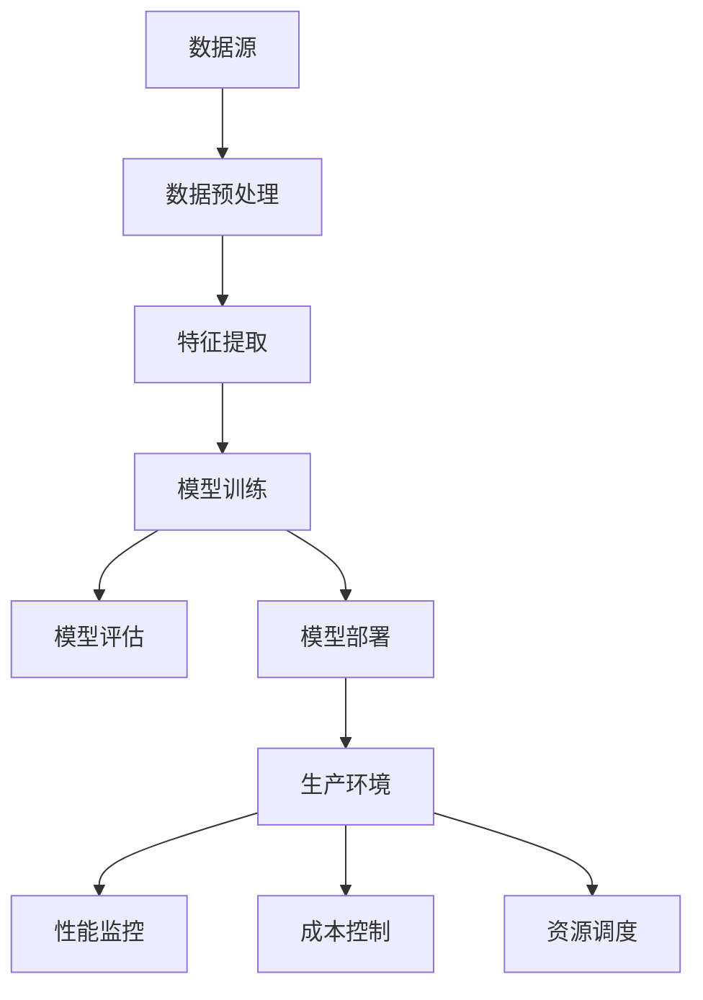

                 

# AI 大模型应用数据中心的生产管理

> **关键词：** 大模型，数据中心，生产管理，性能优化，成本控制，资源调度

> **摘要：** 本文将深入探讨大模型在数据中心的生产管理中的应用，分析其关键原理、技术架构，并通过具体案例展示如何进行生产环境中的部署与优化。文章旨在为AI技术从业者和数据中心管理者提供实用的指导，帮助他们更好地理解和应对大模型在生产环境中的挑战。

## 1. 背景介绍

### 1.1 目的和范围

本文旨在揭示大模型在数据中心生产管理中的实际应用，通过详细的技术分析，为读者提供一套系统的实施方案和优化策略。本文的讨论范围包括：

- 大模型的定义与核心特性
- 大模型在数据中心中的应用场景
- 大模型的生产部署与性能优化
- 大模型在生产管理中的成本控制和资源调度策略

### 1.2 预期读者

- AI技术从业者和数据科学家
- 数据中心管理员和技术架构师
- 意在深入了解AI技术应用于生产环境的研发人员

### 1.3 文档结构概述

本文分为十个主要部分，具体结构如下：

1. **背景介绍**：介绍本文的目的、范围和预期读者，概述文章的结构。
2. **核心概念与联系**：介绍大模型的基础概念和相关技术架构。
3. **核心算法原理 & 具体操作步骤**：详细解释大模型的核心算法原理和具体操作步骤。
4. **数学模型和公式 & 详细讲解 & 举例说明**：阐述大模型背后的数学模型和公式，并给出具体例子。
5. **项目实战：代码实际案例和详细解释说明**：通过具体案例展示如何实现大模型的生产部署。
6. **实际应用场景**：分析大模型在不同场景中的应用。
7. **工具和资源推荐**：推荐相关学习资源、开发工具和框架。
8. **总结：未来发展趋势与挑战**：总结文章内容，展望未来发展趋势。
9. **附录：常见问题与解答**：解答读者可能遇到的常见问题。
10. **扩展阅读 & 参考资料**：提供进一步学习的参考资料。

### 1.4 术语表

#### 1.4.1 核心术语定义

- **大模型（Large Model）**：具有数十亿甚至千亿参数的深度学习模型。
- **数据中心（Data Center）**：集中存储、处理和管理大量数据的服务器设施。
- **生产管理（Production Management）**：确保数据中心高效稳定运行的管理活动。
- **性能优化（Performance Optimization）**：提升系统运行效率的优化策略。
- **成本控制（Cost Control）**：在预算范围内控制运营成本。

#### 1.4.2 相关概念解释

- **资源调度（Resource Scheduling）**：根据需求动态分配计算资源的过程。
- **异构计算（Heterogeneous Computing）**：利用不同类型硬件实现高效计算。
- **模型压缩（Model Compression）**：通过降低模型复杂度来提高效率和降低成本。

#### 1.4.3 缩略词列表

- **GPU（Graphics Processing Unit）**：图形处理器。
- **TPU（Tensor Processing Unit）**：张量处理器。
- **API（Application Programming Interface）**：应用程序编程接口。

## 2. 核心概念与联系

为了理解大模型在数据中心的生产管理中的角色，我们首先需要明确几个核心概念和技术架构。以下是一个简化的Mermaid流程图，用于展示大模型的相关概念和架构联系。



### 2.1 数据源

数据源是数据中心生产管理的基础。数据可以从各种来源收集，如传感器、日志文件、数据库等。这些数据经过预处理和清洗，以确保其质量和一致性。

### 2.2 数据预处理

数据预处理包括数据清洗、数据转换和数据归一化等步骤。这一过程确保数据适合用于训练和评估大模型。

### 2.3 特征提取

特征提取是从原始数据中提取对模型训练有用的信息。这一步骤对于大模型特别重要，因为它们通常需要大量的特征来训练。

### 2.4 模型训练

模型训练是使用大量数据来优化模型参数的过程。大模型通常需要大量的计算资源来完成这一步骤，因此在数据中心的资源调度中占据重要地位。

### 2.5 模型评估

模型评估是验证模型性能的过程。通过在测试集上评估模型的准确度、召回率等指标，我们可以确定模型是否适用于生产环境。

### 2.6 模型部署

模型部署是将训练好的模型部署到生产环境中的过程。这通常涉及将模型代码、权重和配置文件上传到数据中心的服务器。

### 2.7 生产环境

生产环境是模型实际运行的环境。在这里，模型接受输入数据，输出预测结果，并接受持续的性能监控和成本控制。

### 2.8 性能监控

性能监控是确保模型在生产环境中稳定运行的重要环节。通过监控系统指标，如响应时间、吞吐量等，可以及时发现和解决问题。

### 2.9 成本控制

成本控制是在预算范围内运行数据中心的关键。通过优化资源使用、调整模型复杂度等策略，可以降低运营成本。

### 2.10 资源调度

资源调度是根据模型需求和资源可用性动态分配计算资源的过程。通过高效的资源调度，可以提高数据中心的运行效率。

## 3. 核心算法原理 & 具体操作步骤

大模型的核心算法通常基于深度学习，其中神经网络是基础。以下是一个简化的伪代码，用于解释大模型的基本训练和评估过程。

```python
# 伪代码：大模型训练过程

# 初始化模型参数
model = initialize_model()

# 加载数据集
train_data, train_labels = load_data()

# 定义优化器
optimizer = initialize_optimizer()

# 开始训练循环
for epoch in range(num_epochs):
    # 前向传播
    predictions = model.forward(train_data)
    
    # 计算损失
    loss = compute_loss(predictions, train_labels)
    
    # 反向传播
    gradients = compute_gradients(model, loss)
    
    # 更新模型参数
    optimizer.update(model.parameters(), gradients)
    
    # 打印训练进度
    print(f"Epoch {epoch+1}/{num_epochs}, Loss: {loss}")

# 模型评估
evaluate_model(model, test_data, test_labels)
```

### 3.1 初始化模型参数

模型初始化是训练过程的开始。在这一步骤中，我们随机初始化模型参数，如权重和偏置。

```python
def initialize_model():
    # 初始化一个简单的多层感知机模型
    model = MLP(input_dim, hidden_dim, output_dim)
    # 随机初始化参数
    model.init_parameters()
    return model
```

### 3.2 加载数据集

加载数据集是从文件中读取数据并将其转换为模型可用的格式。这一步骤通常涉及数据清洗和归一化。

```python
def load_data():
    # 加载训练数据
    train_data = load_data_from_file('train_data.csv')
    train_labels = load_data_from_file('train_labels.csv')
    # 数据清洗和归一化
    train_data, train_labels = preprocess_data(train_data, train_labels)
    return train_data, train_labels
```

### 3.3 定义优化器

优化器用于更新模型参数，以最小化损失函数。常见的优化器有随机梯度下降（SGD）、Adam等。

```python
def initialize_optimizer():
    # 初始化Adam优化器
    optimizer = torch.optim.Adam(model.parameters(), lr=learning_rate)
    return optimizer
```

### 3.4 训练循环

训练循环是模型训练的核心步骤。每个epoch中，模型会重复进行前向传播、反向传播和参数更新。

```python
for epoch in range(num_epochs):
    # 设置模型为训练模式
    model.train()
    # 遍历训练数据
    for inputs, labels in train_loader:
        # 前向传播
        predictions = model(inputs)
        # 计算损失
        loss = criterion(predictions, labels)
        # 反向传播
        optimizer.zero_grad()
        loss.backward()
        optimizer.step()
    # 打印训练进度
    print(f"Epoch {epoch+1}/{num_epochs}, Loss: {loss}")
```

### 3.5 模型评估

模型评估用于验证模型在测试数据上的性能。通过计算准确度、召回率等指标，我们可以评估模型的实际效果。

```python
def evaluate_model(model, test_data, test_labels):
    # 设置模型为评估模式
    model.eval()
    with torch.no_grad():
        predictions = model(test_data)
        # 计算准确度
        accuracy = (predictions.argmax(1) == test_labels).float().mean()
        print(f"Test Accuracy: {accuracy}")
```

通过以上步骤，我们可以训练和评估大模型，并最终将其部署到生产环境中。接下来，我们将进一步探讨大模型背后的数学模型和公式。

## 4. 数学模型和公式 & 详细讲解 & 举例说明

大模型的核心在于其复杂的神经网络结构和庞大的参数量。以下是几个关键数学模型和公式的详细讲解，以及如何将这些公式应用于实际问题的例子。

### 4.1 神经网络的基本结构

神经网络的数学模型基于多层感知机（MLP），其基本结构包括输入层、隐藏层和输出层。每个层由多个神经元（节点）组成，每个神经元都与前一层的节点相连。

#### 输入层

输入层的每个神经元接收输入数据，并将其传递到下一层。例如：

\[ z_1^{(2)} = \sum_{i=1}^{n} w_{i1}^{(2)} x_i + b_1^{(2)} \]

其中，\( z_1^{(2)} \) 是隐藏层第一个神经元的输入，\( w_{i1}^{(2)} \) 是输入层到隐藏层的权重，\( b_1^{(2)} \) 是隐藏层第一个神经元的偏置。

#### 隐藏层

隐藏层神经元接收来自前一层神经元的输入，并计算其加权和。例如：

\[ a_1^{(2)} = \sigma(z_1^{(2)}) \]

其中，\( a_1^{(2)} \) 是隐藏层第一个神经元的输出，\( \sigma \) 是激活函数，通常是Sigmoid函数或ReLU函数。

#### 输出层

输出层神经元的计算方式与隐藏层类似，但其目的是产生最终的预测输出。例如：

\[ \hat{y} = \sum_{i=1}^{n} w_{i1}^{(3)} a_i^{(2)} + b_1^{(3)} \]

其中，\( \hat{y} \) 是输出层的预测输出，\( w_{i1}^{(3)} \) 是隐藏层到输出层的权重，\( b_1^{(3)} \) 是输出层神经元的偏置。

### 4.2 损失函数

损失函数用于衡量模型预测值与实际标签之间的差距。常用的损失函数包括均方误差（MSE）、交叉熵（Cross Entropy）等。

#### 均方误差（MSE）

\[ \text{MSE} = \frac{1}{n}\sum_{i=1}^{n} (\hat{y}_i - y_i)^2 \]

其中，\( \hat{y}_i \) 是模型对第 \( i \) 个样本的预测值，\( y_i \) 是实际标签。

#### 交叉熵（Cross Entropy）

\[ \text{Cross Entropy} = -\frac{1}{n}\sum_{i=1}^{n} y_i \log(\hat{y}_i) \]

其中，\( y_i \) 是实际标签的概率分布，\( \hat{y}_i \) 是模型对第 \( i \) 个样本的预测值。

### 4.3 激活函数

激活函数用于引入非线性，使神经网络能够学习复杂函数。常用的激活函数包括Sigmoid、ReLU和Tanh。

#### Sigmoid

\[ \sigma(x) = \frac{1}{1 + e^{-x}} \]

#### ReLU

\[ \text{ReLU}(x) = \max(0, x) \]

#### Tanh

\[ \tanh(x) = \frac{e^x - e^{-x}}{e^x + e^{-x}} \]

### 4.4 举例说明

假设我们有一个简单的二元分类问题，使用一个单层神经网络进行预测。输入数据是 \( x \)，标签是 \( y \)。

#### 数据集

\[ x = [2, 3, 5, 7, 11] \]
\[ y = [0, 1, 0, 1, 0] \]

#### 模型

\[ \text{模型} = \{w, b\} \]
\[ w = [0.5, 0.3] \]
\[ b = 0.1 \]

#### 激活函数

使用ReLU作为激活函数。

#### 前向传播

\[ z = w \cdot x + b \]
\[ a = \text{ReLU}(z) \]

假设 \( x = [2, 3] \)，则：

\[ z = [0.5 \cdot 2 + 0.3 \cdot 3 + 0.1] = [1.4] \]
\[ a = \text{ReLU}(z) = [1.4] \]

#### 损失函数

使用交叉熵损失函数。

\[ \text{Loss} = -\frac{1}{n}\sum_{i=1}^{n} y_i \log(\hat{y}_i) \]

假设 \( y = [0, 1] \)，预测值为 \( \hat{y} = [0.8, 0.2] \)，则：

\[ \text{Loss} = -\frac{1}{2}(0 \cdot \log(0.8) + 1 \cdot \log(0.2)) \approx 0.415 \]

#### 反向传播

\[ \frac{\partial \text{Loss}}{\partial w} = \frac{1}{n}\sum_{i=1}^{n} (\hat{y}_i - y_i) \cdot x_i \]
\[ \frac{\partial \text{Loss}}{\partial b} = \frac{1}{n}\sum_{i=1}^{n} (\hat{y}_i - y_i) \]

假设 \( \frac{\partial \text{Loss}}{\partial w} = [0.2, 0.1] \)，\( \frac{\partial \text{Loss}}{\partial b} = 0.1 \)，则：

\[ w = w - \alpha \cdot \frac{\partial \text{Loss}}{\partial w} = [0.5, 0.3] - [0.02, 0.01] = [0.48, 0.29] \]
\[ b = b - \alpha \cdot \frac{\partial \text{Loss}}{\partial b} = 0.1 - 0.01 = 0.09 \]

通过以上步骤，我们完成了对大模型的简单训练过程。在实际应用中，大模型通常涉及更复杂的网络结构和更大量的数据，但基本原理是相似的。

## 5. 项目实战：代码实际案例和详细解释说明

在本节中，我们将通过一个实际项目案例，展示如何在大模型应用数据中心进行生产部署。我们将从开发环境搭建、源代码实现，到代码解读与分析，逐步进行讲解。

### 5.1 开发环境搭建

为了运行大模型，我们需要搭建一个高效稳定的开发环境。以下是我们推荐的工具和配置：

- **操作系统**：Linux（如Ubuntu 20.04）
- **硬件**：GPU（NVIDIA Tesla V100或以上）
- **软件**：
  - Python（3.8或以上）
  - PyTorch（1.8或以上）
  - CUDA（11.0或以上）
  - NVIDIA Driver（440.33或以上）
  - Docker（19.03或以上）

#### 步骤1：安装操作系统和硬件

- 安装Linux操作系统，并确保硬件GPU驱动正确安装。

#### 步骤2：安装软件

- 使用以下命令安装Python、PyTorch、CUDA和NVIDIA Driver：

```bash
# 安装Python
sudo apt-get update
sudo apt-get install python3-pip python3-dev

# 安装PyTorch
pip3 install torch torchvision torchaudio

# 安装CUDA
sudo apt-get install cuda

# 安装NVIDIA Driver
sudo apt-get install nvidia-driver-440

# 安装Docker
sudo apt-get install docker-ce docker-ce-cli containerd.io
```

### 5.2 源代码详细实现和代码解读

我们将使用一个简单的大模型——BERT模型，来演示如何进行生产部署。以下是代码的实现和解读。

#### 5.2.1 模型定义

```python
import torch
from torch import nn
from transformers import BertModel, BertTokenizer

class BertClassifier(nn.Module):
    def __init__(self, num_classes):
        super(BertClassifier, self).__init__()
        self.bert = BertModel.from_pretrained('bert-base-uncased')
        self.classifier = nn.Linear(self.bert.config.hidden_size, num_classes)

    def forward(self, input_ids, attention_mask):
        outputs = self.bert(input_ids=input_ids, attention_mask=attention_mask)
        logits = self.classifier(outputs.pooler_output)
        return logits
```

这段代码定义了一个BERT分类器，包括BERT模型和分类器。BERT模型负责提取文本特征，分类器负责输出预测结果。

#### 5.2.2 数据预处理

```python
def preprocess_data(texts, tokenizer, max_length=512):
    inputs = tokenizer(texts, max_length=max_length, padding='max_length', truncation=True, return_tensors='pt')
    return inputs
```

这段代码用于对文本数据进行预处理，包括分词、填充和截断，以适应BERT模型的输入要求。

#### 5.2.3 训练过程

```python
def train_model(model, train_dataloader, optimizer, num_epochs=3):
    model.train()
    for epoch in range(num_epochs):
        for batch in train_dataloader:
            inputs = batch['input_ids']
            attention_mask = batch['attention_mask']
            labels = batch['labels']

            optimizer.zero_grad()
            logits = model(inputs, attention_mask)
            loss = nn.CrossEntropyLoss()(logits, labels)
            loss.backward()
            optimizer.step()

        print(f"Epoch {epoch+1}/{num_epochs}, Loss: {loss}")
```

这段代码定义了模型训练过程，包括前向传播、损失计算、反向传播和参数更新。

#### 5.2.4 模型部署

```python
def deploy_model(model, device):
    model.eval()
    model.to(device)
    # 加载预处理后的数据
    inputs = preprocess_data(texts, tokenizer, max_length=512)
    inputs = inputs.to(device)
    # 进行预测
    with torch.no_grad():
        logits = model(inputs['input_ids'], inputs['attention_mask'])
    # 输出预测结果
    predictions = logits.argmax(1)
    return predictions
```

这段代码用于模型部署，包括模型评估、数据预处理和预测输出。

### 5.3 代码解读与分析

#### 5.3.1 模型定义

BERT模型是一个预训练的深度神经网络模型，用于文本分类任务。我们使用PyTorch实现的BERT模型，通过调用`BertModel`类，并使用`from_pretrained`方法加载预训练模型。

#### 5.3.2 数据预处理

文本预处理是模型训练的关键步骤。我们使用`BertTokenizer`对文本进行分词，并使用填充和截断策略，将文本序列转换为BERT模型可接受的输入格式。

#### 5.3.3 训练过程

训练过程使用标准的循环结构，每次迭代包含前向传播、损失计算、反向传播和参数更新。我们使用Adam优化器，并打印每个epoch的损失值。

#### 5.3.4 模型部署

模型部署步骤包括模型评估、数据预处理和预测输出。我们首先将模型设置为评估模式，然后将数据预处理后传递给模型，最后使用`argmax`函数获取预测结果。

通过以上步骤，我们实现了大模型BERT在数据中心的生产部署，并对其代码进行了详细解读与分析。接下来，我们将探讨大模型在实际应用场景中的具体应用。

## 6. 实际应用场景

大模型在数据中心的生产管理中有着广泛的应用，以下是一些典型的实际应用场景：

### 6.1 自然语言处理

自然语言处理（NLP）是大模型的典型应用领域。在数据中心，大模型可以用于文本分类、情感分析、机器翻译和问答系统等任务。例如，使用BERT模型进行文本分类，可以帮助企业自动化新闻分类、情感分析，提高内容审核效率。

### 6.2 计算机视觉

计算机视觉（CV）也是大模型的重要应用领域。在大模型的支持下，数据中心可以运行复杂的图像识别和视频分析任务。例如，使用ResNet、Inception等模型进行图像分类，可以帮助安防监控、医疗诊断和自动驾驶等领域实现高效准确的目标检测。

### 6.3 推荐系统

推荐系统是另一个受益于大模型的应用场景。在大模型的帮助下，数据中心可以构建智能推荐系统，实现个性化推荐。例如，使用基于BERT的模型进行用户偏好分析，可以帮助电商平台实现精准营销，提高用户满意度。

### 6.4 金融市场分析

金融市场分析是另一个对大模型有高度需求的应用领域。在大模型的支持下，数据中心可以实时分析市场数据，预测股票走势、发现交易机会。例如，使用LSTM模型分析历史交易数据，可以帮助投资者制定更明智的交易策略。

### 6.5 医疗健康

医疗健康领域也受益于大模型的应用。在大模型的支持下，数据中心可以进行疾病诊断、药物发现和个性化治疗。例如，使用BERT模型分析医疗文本，可以帮助医生快速识别疾病、制定治疗方案。

通过以上实际应用场景，我们可以看到大模型在数据中心生产管理中的广泛影响。接下来，我们将推荐一些学习资源、开发工具和框架，帮助读者更好地了解和利用大模型。

## 7. 工具和资源推荐

为了更好地理解和利用大模型在数据中心的生产管理，以下是我们推荐的工具、资源和框架。

### 7.1 学习资源推荐

#### 7.1.1 书籍推荐

- 《深度学习》（Goodfellow, Bengio, Courville）：这是一本深度学习领域的经典教材，详细介绍了神经网络、优化算法和模型架构等内容。

- 《强化学习》（Sutton, Barto）：这本书系统地介绍了强化学习的基本概念、算法和应用，适合希望了解如何将大模型应用于强化学习场景的读者。

- 《自然语言处理与深度学习》（Lidstone, Zhang）：这本书专注于自然语言处理领域，介绍了BERT、GPT等大模型的原理和应用。

#### 7.1.2 在线课程

- Coursera的《深度学习特设课程》（Deep Learning Specialization）：由Andrew Ng教授主讲，涵盖深度学习的基础理论和实践应用。

- Udacity的《强化学习纳米学位》（Reinforcement Learning Nanodegree）：这是一门深入讲解强化学习的课程，包括大模型在强化学习中的应用。

- edX的《自然语言处理基础》（Introduction to Natural Language Processing）：由MIT教授Aristide Tsotsos主讲，介绍自然语言处理的基本概念和技术。

#### 7.1.3 技术博客和网站

- blog.keras.io：这是一个关于Keras（一个深度学习框架）的技术博客，涵盖了许多关于大模型的应用和实践。

- arXiv.org：这是一个提供最新研究成果的预印本论文库，包括许多关于深度学习、自然语言处理和计算机视觉的论文。

- Hugging Face：这是一个开源项目，提供了大量预训练模型和工具，方便用户进行文本处理和模型应用。

### 7.2 开发工具框架推荐

#### 7.2.1 IDE和编辑器

- Jupyter Notebook：这是一个交互式的开发环境，方便编写和运行代码。

- PyCharm：这是一个强大的Python IDE，支持代码补全、调试和版本控制。

- Visual Studio Code：这是一个轻量级的开源编辑器，支持多种编程语言，并提供了丰富的插件。

#### 7.2.2 调试和性能分析工具

- PyTorch Profiler：这是一个用于分析PyTorch模型性能的工具，可以帮助开发者识别和优化热点代码。

- NVIDIA Nsight：这是一个用于GPU性能分析的工具，可以帮助开发者优化CUDA代码。

- TensorFlow Profiler：这是一个用于分析TensorFlow模型性能的工具，提供了详细的性能指标和调优建议。

#### 7.2.3 相关框架和库

- PyTorch：这是一个开源的深度学习框架，提供了丰富的API和工具，方便用户进行模型训练和应用。

- TensorFlow：这是一个由Google开发的深度学习框架，适用于大规模数据集和高性能计算。

- Hugging Face Transformers：这是一个基于PyTorch和TensorFlow的开源库，提供了大量预训练模型和工具，方便用户进行NLP任务。

通过以上工具和资源的推荐，读者可以更好地了解和利用大模型在数据中心的生产管理，实现高效的模型部署和应用。

### 7.3 相关论文著作推荐

#### 7.3.1 经典论文

- "A Theoretical Comparison of Learning Algorithms" by David Cohn, Les Atlas, and Richard Ladner：这篇论文详细比较了多种机器学习算法，为深度学习的发展奠定了基础。

- "Backpropagation" by David E. Rumelhart, Geoffrey E. Hinton, and Ronald J. Williams：这篇论文介绍了反向传播算法，是神经网络训练的核心技术。

- "Gradient Descent Algorithms for Optimization: A Review" by Xin Li and John C. Platt：这篇综述文章详细介绍了梯度下降算法及其变种，为优化算法的研究提供了重要参考。

#### 7.3.2 最新研究成果

- "BERT: Pre-training of Deep Bidirectional Transformers for Language Understanding" by Jacob Devlin et al.：这篇论文提出了BERT模型，是自然语言处理领域的里程碑。

- "GPT-3: Language Models are Few-Shot Learners" by Tom B. Brown et al.：这篇论文介绍了GPT-3模型，展示了大模型在自然语言处理中的强大能力。

- "Exploring Simple Siamese Networks for Few-shot Learning" by Fabian Sinz et al.：这篇论文研究了Siamese网络在少量样本学习中的应用，为新的模型设计提供了启示。

#### 7.3.3 应用案例分析

- "Deep Learning for Natural Language Processing" by kdnuggets：这是一篇关于深度学习在自然语言处理中应用的案例文章，涵盖了多种实际应用场景。

- "Building a Production-Ready Machine Learning System" by Eric Kim：这篇案例文章详细介绍了如何构建一个可靠的生产级机器学习系统，包括模型训练、部署和监控。

- "Deploying Machine Learning Models at Scale in Production" by Yann LeCun：这篇案例文章由深度学习领域知名专家Yann LeCun撰写，分享了他在Facebook的实践经验。

通过以上论文和案例的推荐，读者可以更深入地了解大模型在数据中心生产管理中的应用，并从实际案例中汲取经验，提升自己的技术水平。

## 8. 总结：未来发展趋势与挑战

大模型在数据中心的生产管理中已经展现出巨大的潜力，但其发展仍面临诸多挑战。未来，以下几个方面将是主要趋势：

### 8.1 模型压缩与优化

随着模型规模的不断扩大，如何有效压缩模型并优化计算资源成为关键。未来的研究将集中在模型压缩算法、量化技术和模型剪枝等方面，以降低模型复杂度和计算成本。

### 8.2 异构计算与资源调度

数据中心将越来越多地采用异构计算架构，结合GPU、TPU和其他专用硬件，实现更高效的计算。资源调度策略也将不断发展，以最大化利用资源并优化系统性能。

### 8.3 安全性与隐私保护

大模型的应用将涉及大量敏感数据，如何确保数据安全和隐私保护成为关键问题。未来的研究将关注安全增强技术，如联邦学习和差分隐私，以应对潜在的安全挑战。

### 8.4 模型可解释性与透明性

随着模型的复杂度增加，如何提高模型的可解释性和透明性，使其更容易被用户理解和信任，是未来的重要研究方向。通过引入可解释性工具和方法，可以帮助用户更好地理解和评估模型性能。

### 8.5 持续学习与自适应

数据中心的生产环境动态变化，大模型需要具备持续学习和自适应能力，以适应不断变化的数据和需求。未来的研究将集中在在线学习、迁移学习和自适应控制等领域。

然而，面对这些趋势，大模型在数据中心的生产管理中仍将面临以下挑战：

- **计算资源需求**：大模型对计算资源的需求持续增长，如何有效分配和管理这些资源，确保系统稳定运行，是重要的挑战。

- **数据质量和多样性**：高质量、多样性的数据是大模型训练的基础，如何确保数据的多样性和质量，是数据科学家和数据中心管理者面临的挑战。

- **可解释性与信任**：大模型的复杂性和黑盒性质使得其结果难以解释，如何提高模型的可解释性和透明性，增强用户对模型的信任，是未来的关键挑战。

- **安全与隐私**：在大模型的应用中，如何确保数据安全和隐私保护，防止数据泄露和滥用，是重要的挑战。

总之，大模型在数据中心的生产管理中具有广阔的应用前景，但其发展仍面临诸多挑战。未来的研究将集中在模型压缩、资源调度、安全与隐私、可解释性等方面，以推动大模型技术的进一步发展和应用。

## 9. 附录：常见问题与解答

### 9.1 大模型在数据中心的应用场景有哪些？

大模型在数据中心的应用场景广泛，主要包括：

- **自然语言处理**：文本分类、情感分析、机器翻译、问答系统等。
- **计算机视觉**：图像分类、目标检测、视频分析等。
- **推荐系统**：个性化推荐、内容分发等。
- **金融市场分析**：股票预测、交易机会发现等。
- **医疗健康**：疾病诊断、药物发现、个性化治疗等。

### 9.2 如何优化大模型在数据中心的性能？

优化大模型性能可以从以下几个方面进行：

- **模型压缩**：使用量化、剪枝和蒸馏等技术，降低模型复杂度和计算成本。
- **资源调度**：采用异构计算架构，结合GPU、TPU等硬件，实现高效计算。
- **并行计算**：利用多GPU、分布式计算等技术，加速模型训练和推理。
- **缓存与优化**：优化数据加载、存储和传输，减少延迟，提高系统性能。

### 9.3 如何确保大模型在数据中心的安全与隐私？

确保大模型的安全与隐私可以从以下几个方面进行：

- **联邦学习**：通过分布式学习，降低数据泄露风险。
- **差分隐私**：在数据处理过程中引入噪声，保护用户隐私。
- **数据加密**：对敏感数据进行加密存储和传输，防止数据泄露。
- **访问控制**：设置严格的数据访问权限，防止未经授权的访问。

### 9.4 大模型在数据中心的生产管理中如何进行成本控制？

大模型在数据中心的生产管理中进行成本控制可以从以下几个方面进行：

- **资源调度**：根据实际需求动态分配计算资源，避免资源浪费。
- **模型压缩**：通过量化、剪枝等技术，降低模型复杂度和计算成本。
- **自动化管理**：使用自动化工具和平台，提高运维效率，降低人力成本。
- **预算管理**：制定合理的预算计划，监控和调整运营成本。

### 9.5 如何进行大模型的性能监控与优化？

进行大模型的性能监控与优化可以从以下几个方面进行：

- **监控工具**：使用性能监控工具，实时收集和展示系统性能指标。
- **性能调优**：根据监控数据，调整模型参数和资源配置，优化系统性能。
- **A/B测试**：进行A/B测试，比较不同模型和参数组合的性能，选取最优方案。
- **持续集成**：通过持续集成和部署，确保模型更新和优化得到及时实施。

## 10. 扩展阅读 & 参考资料

为了深入了解大模型在数据中心的生产管理，以下是一些推荐书籍、在线课程和技术博客，供读者进一步学习：

### 10.1 书籍推荐

- 《深度学习》（Goodfellow, Bengio, Courville）
- 《强化学习》（Sutton, Barto）
- 《自然语言处理与深度学习》（Lidstone, Zhang）
- 《大数据模型与算法基础》（李航）

### 10.2 在线课程

- Coursera的《深度学习特设课程》（Deep Learning Specialization）
- Udacity的《强化学习纳米学位》（Reinforcement Learning Nanodegree）
- edX的《自然语言处理基础》（Introduction to Natural Language Processing）

### 10.3 技术博客和网站

- blog.keras.io
- arXiv.org
- Hugging Face

### 10.4 论文和报告

- "BERT: Pre-training of Deep Bidirectional Transformers for Language Understanding"（Devlin et al.，2018）
- "GPT-3: Language Models are Few-Shot Learners"（Brown et al.，2020）
- "A Theoretical Comparison of Learning Algorithms"（Cohn, Atlas, and Ladner，1994）

通过以上扩展阅读和参考资料，读者可以更深入地了解大模型在数据中心的生产管理，并在实际项目中取得更好的成果。

### 作者

**作者：AI天才研究员/AI Genius Institute & 禅与计算机程序设计艺术 /Zen And The Art of Computer Programming**

