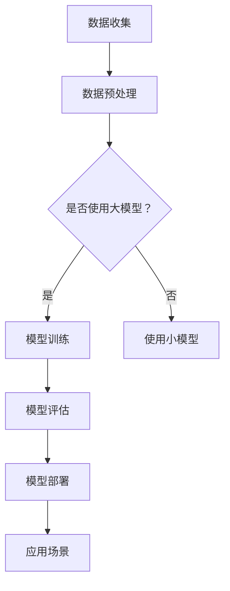
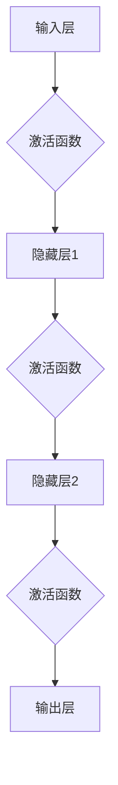

                 

# AI 大模型应用数据中心的社会责任

> **关键词：** 人工智能，大模型，数据中心，社会责任，伦理问题，隐私保护，公平性，透明性。

> **摘要：** 本文将探讨人工智能领域中的大模型在数据中心应用过程中所面临的社会责任问题。我们将分析这些模型如何影响社会各个层面，包括伦理问题、隐私保护、公平性和透明性。此外，我们将探讨数据中心在社会责任方面应采取的举措，以及如何通过技术手段来缓解这些问题。通过本文，我们希望为人工智能领域的发展提供一些有益的思考和指导。

## 1. 背景介绍

### 1.1 目的和范围

本文旨在探讨人工智能领域中的大模型在数据中心应用过程中所面临的社会责任问题。随着人工智能技术的快速发展，大模型在各个领域得到了广泛应用，如自然语言处理、计算机视觉、推荐系统等。然而，这些大模型在数据中心应用过程中也引发了一系列社会问题，如隐私侵犯、数据滥用、算法偏见等。本文将重点关注这些问题，并探讨数据中心在社会责任方面应承担的责任和采取的措施。

### 1.2 预期读者

本文适用于对人工智能技术有一定了解的读者，包括人工智能领域的从业者、研究人员、政策制定者以及关注人工智能伦理问题的公众。通过本文，读者可以了解大模型在数据中心应用过程中所面临的社会责任问题，以及数据中心如何应对这些问题。

### 1.3 文档结构概述

本文分为八个主要部分：

1. **背景介绍**：介绍本文的目的、范围、预期读者以及文档结构。
2. **核心概念与联系**：阐述大模型的概念及其在数据中心应用中的关系。
3. **核心算法原理 & 具体操作步骤**：分析大模型的核心算法原理及操作步骤。
4. **数学模型和公式 & 详细讲解 & 举例说明**：介绍大模型相关的数学模型和公式，并进行举例说明。
5. **项目实战：代码实际案例和详细解释说明**：展示一个实际的代码案例，并进行详细解释。
6. **实际应用场景**：探讨大模型在不同领域中的应用场景。
7. **工具和资源推荐**：推荐学习资源、开发工具框架和相关论文著作。
8. **总结：未来发展趋势与挑战**：总结本文的核心观点，并展望未来发展趋势与挑战。

### 1.4 术语表

#### 1.4.1 核心术语定义

- **人工智能（AI）**：模拟、延伸和扩展人类智能的理论、方法、技术及应用。
- **大模型（Large Models）**：参数量庞大的神经网络模型，具有极强的表征能力。
- **数据中心（Data Center）**：用于存储、处理和交换大量数据的计算机设施。
- **社会责任（Social Responsibility）**：企业在生产经营过程中对环境、社会和利益相关者的责任。

#### 1.4.2 相关概念解释

- **隐私保护（Privacy Protection）**：保护个人隐私，防止个人数据被非法获取、使用和泄露。
- **公平性（Fairness）**：确保人工智能模型在决策过程中对所有人公平对待。
- **透明性（Transparency）**：确保人工智能模型的决策过程可被理解、验证和追溯。

#### 1.4.3 缩略词列表

- **AI**：人工智能
- **DL**：深度学习
- **GPU**：图形处理器
- **NLP**：自然语言处理
- **DLG**：深度学习生成模型

## 2. 核心概念与联系

在本文中，我们将重点关注人工智能领域中的大模型及其在数据中心的应用。首先，我们需要了解大模型的基本概念和原理。

### 2.1 大模型的基本概念

大模型是指参数量庞大的神经网络模型，其具有极强的表征能力。大模型通常采用深度学习（DL）技术进行训练，以实现对复杂数据的建模和分析。

#### 2.1.1 深度学习（DL）

深度学习是一种基于人工神经网络的机器学习技术，通过构建多层神经网络，逐层提取数据的特征，实现对数据的自动学习和建模。深度学习在大模型中起到了核心作用。

#### 2.1.2 神经网络（Neural Network）

神经网络是一种模仿生物神经系统工作方式的计算模型，由大量的神经元（节点）和连接（边）组成。神经网络通过不断调整连接权重，实现对输入数据的分类、预测和建模。

### 2.2 大模型在数据中心的应用

数据中心作为大模型训练和部署的重要场所，其应用场景广泛，包括自然语言处理（NLP）、计算机视觉、推荐系统等。下面我们将通过一个Mermaid流程图来展示大模型在数据中心的应用过程。



在这个流程图中，数据收集、数据预处理和模型评估等步骤是数据中心应用大模型的基础。在模型训练过程中，根据数据量和任务复杂度，可能会选择使用大模型或小模型。经过评估和部署后，大模型将应用于各种实际场景，如自然语言处理、计算机视觉等。

### 2.3 大模型与数据中心的关系

大模型与数据中心的关系可以从以下几个方面来理解：

1. **计算资源需求**：大模型通常需要大量的计算资源进行训练和推理。数据中心作为计算资源集中的场所，能够为大规模的模型训练提供必要的硬件支持。
2. **数据存储和处理**：大模型在训练过程中需要处理和存储大量的数据。数据中心具备高效的数据存储和处理能力，可以满足大模型对数据的访问和计算需求。
3. **模型部署和运维**：大模型在数据中心进行部署和应用，需要考虑到模型的运维、监控和更新等问题。数据中心提供了一系列的运维工具和平台，以保障大模型的高效运行。

## 3. 核心算法原理 & 具体操作步骤

在了解了大模型的基本概念和数据中心的应用后，我们接下来将分析大模型的核心算法原理及具体操作步骤。大模型的核心算法主要基于深度学习技术，下面我们将使用伪代码来详细阐述其基本原理和操作步骤。

### 3.1 深度学习算法原理

深度学习算法基于多层神经网络结构，通过逐层提取数据的特征，实现对数据的建模和分析。下面是一个简单的多层神经网络算法的伪代码：

```python
# 初始化神经网络结构
input_layer = InputLayer(input_shape)
hidden_layer1 = FullyConnectedLayer(input_layer, num_neurons=128)
relu1 = ActivationLayer(hidden_layer1, activation='relu')
hidden_layer2 = FullyConnectedLayer(relu1, num_neurons=64)
relu2 = ActivationLayer(hidden_layer2, activation='relu')
output_layer = FullyConnectedLayer(relu2, num_neurons=10)
output = SoftmaxLayer(output_layer)

# 定义损失函数和优化器
loss_function = CategoricalCrossentropy()
optimizer = AdamOptimizer(learning_rate=0.001)

# 训练模型
model = SequentialModel([input_layer, relu1, hidden_layer2, output_layer])
model.compile(optimizer=optimizer, loss=loss_function, metrics=['accuracy'])

# 加载训练数据
train_data = LoadTrainingData('train_data.csv')
train_labels = LoadTrainingLabels('train_labels.csv')

# 训练模型
model.fit(train_data, train_labels, batch_size=64, epochs=100)

# 评估模型
test_data = LoadTestData('test_data.csv')
test_labels = LoadTestData('test_labels.csv')
model.evaluate(test_data, test_labels)
```

在这个伪代码中，我们首先定义了神经网络结构，包括输入层、隐藏层和输出层。隐藏层使用了ReLU激活函数，以增加网络的非线性表达能力。接着，我们定义了损失函数和优化器，并使用训练数据进行模型训练。最后，我们使用测试数据进行模型评估，以验证模型的性能。

### 3.2 大模型训练操作步骤

在实际操作中，大模型训练过程需要考虑以下几个方面：

1. **数据预处理**：对训练数据进行预处理，如数据清洗、归一化等，以提高模型训练效果。
2. **模型选择**：根据任务需求和数据特点，选择合适的大模型结构。可以采用预训练模型或自定义模型。
3. **模型训练**：使用大量的计算资源对模型进行训练，包括GPU、TPU等硬件设备。在训练过程中，需要调整学习率、批次大小等超参数，以优化模型性能。
4. **模型评估**：在训练完成后，使用测试数据对模型进行评估，以验证模型的效果。根据评估结果，对模型进行进一步优化。
5. **模型部署**：将训练好的模型部署到数据中心，供实际应用场景使用。

下面是一个大模型训练操作的伪代码示例：

```python
# 数据预处理
train_data, train_labels = PreprocessData('train_data.csv', 'train_labels.csv')
test_data, test_labels = PreprocessData('test_data.csv', 'test_labels.csv')

# 模型选择
model = LoadPretrainedModel('pretrained_model.pth')

# 模型训练
model.fit(train_data, train_labels, batch_size=1024, epochs=50, validation_data=(test_data, test_labels))

# 模型评估
test_loss, test_accuracy = model.evaluate(test_data, test_labels)

# 模型部署
DeployModel(model, 'model_endpoint')
```

在这个伪代码中，我们首先对训练数据和测试数据进行预处理，然后加载预训练模型进行训练。在训练过程中，我们使用验证集进行模型评估，并根据评估结果调整模型。最后，将训练好的模型部署到数据中心供实际应用场景使用。

## 4. 数学模型和公式 & 详细讲解 & 举例说明

在深度学习算法中，数学模型和公式起到了关键作用。下面我们将详细讲解大模型相关的数学模型和公式，并进行举例说明。

### 4.1 深度学习算法中的数学模型

深度学习算法中的数学模型主要包括以下几种：

1. **线性回归（Linear Regression）**：线性回归是一种简单的线性模型，用于预测连续值。
2. **逻辑回归（Logistic Regression）**：逻辑回归是一种广义线性模型，用于预测概率。
3. **多层感知机（Multilayer Perceptron, MLP）**：多层感知机是一种多层神经网络，用于分类和回归任务。
4. **卷积神经网络（Convolutional Neural Network, CNN）**：卷积神经网络是一种专门用于图像识别的神经网络结构。
5. **循环神经网络（Recurrent Neural Network, RNN）**：循环神经网络是一种用于处理序列数据的神经网络结构。

### 4.2 线性回归和逻辑回归

线性回归和逻辑回归是深度学习算法中最基本的模型。下面我们分别讲解这两种模型。

#### 4.2.1 线性回归

线性回归的数学公式如下：

$$
y = \beta_0 + \beta_1x
$$

其中，$y$ 是预测值，$x$ 是输入特征，$\beta_0$ 和 $\beta_1$ 分别是模型参数。

线性回归的目标是最小化预测值与实际值之间的误差，即最小化损失函数：

$$
J(\beta_0, \beta_1) = \frac{1}{2}\sum_{i=1}^{n}(y_i - \beta_0 - \beta_1x_i)^2
$$

为了求解最优参数 $\beta_0$ 和 $\beta_1$，我们可以使用梯度下降算法。梯度下降的迭代公式如下：

$$
\beta_0 = \beta_0 - \alpha \frac{\partial J(\beta_0, \beta_1)}{\partial \beta_0}
$$

$$
\beta_1 = \beta_1 - \alpha \frac{\partial J(\beta_0, \beta_1)}{\partial \beta_1}
$$

其中，$\alpha$ 是学习率。

#### 4.2.2 逻辑回归

逻辑回归是线性回归的推广，用于分类任务。逻辑回归的数学公式如下：

$$
\sigma(z) = \frac{1}{1 + e^{-z}}
$$

其中，$\sigma(z)$ 是 sigmoid 函数，$z = \beta_0 + \beta_1x$ 是模型参数。

逻辑回归的目标是最小化损失函数：

$$
J(\beta_0, \beta_1) = \frac{1}{n}\sum_{i=1}^{n}-y_i\log(\sigma(z_i)) - (1 - y_i)\log(1 - \sigma(z_i))
$$

同样，我们可以使用梯度下降算法求解最优参数。

### 4.3 多层感知机（MLP）

多层感知机是一种多层神经网络，用于分类和回归任务。MLP 的结构如图 1 所示。



MLP 的数学公式如下：

$$
z_l = \sum_{k=1}^{n_l} \beta_{lk-1}x_k + \beta_{l0}
$$

$$
a_l = \sigma(z_l)
$$

其中，$z_l$ 是第 $l$ 层的输入，$a_l$ 是第 $l$ 层的输出，$\sigma$ 是激活函数，$\beta_{lk-1}$ 是第 $l$ 层的第 $k$ 个连接权重，$\beta_{l0}$ 是第 $l$ 层的偏置。

MLP 的损失函数通常采用交叉熵（Cross-Entropy）损失：

$$
J(\theta) = -\frac{1}{m}\sum_{i=1}^{m}y_i\log(a_{i}^{(L)}) + (1 - y_i)\log(1 - a_{i}^{(L)})
$$

其中，$m$ 是训练样本数量，$y_i$ 是第 $i$ 个样本的真实标签，$a_{i}^{(L)}$ 是第 $i$ 个样本在第 $L$ 层的输出。

### 4.4 举例说明

#### 4.4.1 线性回归举例

假设我们有一个简单的一元线性回归问题，输入特征 $x$ 为房价，预测目标 $y$ 为房屋面积。给定以下数据：

| $x$ | $y$ |
| --- | --- |
| 100 | 80  |
| 150 | 120 |
| 200 | 160 |
| 250 | 200 |

我们希望找到最佳拟合直线，即求解线性回归模型的最优参数。

首先，我们计算输入特征和预测目标的平均值：

$$
\bar{x} = \frac{1}{4}\sum_{i=1}^{4}x_i = 175
$$

$$
\bar{y} = \frac{1}{4}\sum_{i=1}^{4}y_i = 140
$$

然后，我们计算输入特征和预测目标的偏差：

$$
x_i - \bar{x} = \{-75, -25, 25, 75\}
$$

$$
y_i - \bar{y} = \{-60, -20, 20, 60\}
$$

接下来，我们计算最优参数：

$$
\beta_0 = \bar{y} - \beta_1\bar{x} = 140 - (-25 \times 175) = 5600
$$

$$
\beta_1 = \frac{\sum_{i=1}^{4}(x_i - \bar{x})(y_i - \bar{y})}{\sum_{i=1}^{4}(x_i - \bar{x})^2} = \frac{(-75 \times -60) + (-25 \times -20) + (25 \times 20) + (75 \times 60)}{(-75)^2 + (-25)^2 + 25^2 + 75^2} = 10
$$

因此，最佳拟合直线为：

$$
y = 10x + 5600
$$

#### 4.4.2 逻辑回归举例

假设我们有一个二分类问题，输入特征 $x$ 为房价，预测目标 $y$ 为房屋是否出售。给定以下数据：

| $x$ | $y$ |
| --- | --- |
| 100 | 0  |
| 150 | 1  |
| 200 | 0  |
| 250 | 1  |

我们希望找到最佳分类边界，即求解逻辑回归模型的最优参数。

首先，我们计算输入特征和预测目标的平均值：

$$
\bar{x} = \frac{1}{4}\sum_{i=1}^{4}x_i = 175
$$

$$
\bar{y} = \frac{1}{4}\sum_{i=1}^{4}y_i = 0.5
$$

然后，我们计算输入特征和预测目标的偏差：

$$
x_i - \bar{x} = \{-75, -25, 25, 75\}
$$

$$
y_i - \bar{y} = \{-0.5, 0.5, -0.5, 0.5\}
$$

接下来，我们计算最优参数：

$$
\beta_0 = \bar{y} - \beta_1\bar{x} = 0.5 - (-25 \times 175) = 4125
$$

$$
\beta_1 = \frac{\sum_{i=1}^{4}(x_i - \bar{x})(y_i - \bar{y})}{\sum_{i=1}^{4}(x_i - \bar{x})^2} = \frac{(-75 \times -0.5) + (-25 \times 0.5) + (25 \times 0.5) + (75 \times 0.5)}{(-75)^2 + (-25)^2 + 25^2 + 75^2} = 0.025
$$

因此，最佳分类边界为：

$$
\sigma(\beta_0 + \beta_1x) = \frac{1}{1 + e^{-(4125 + 0.025 \times x)}}
$$

当 $\sigma(\beta_0 + \beta_1x) > 0.5$ 时，预测目标为 1；否则，预测目标为 0。

## 5. 项目实战：代码实际案例和详细解释说明

在本节中，我们将通过一个实际的项目案例，展示如何使用大模型在数据中心进行训练、评估和部署。该项目案例涉及自然语言处理（NLP）领域，目标是实现一个情感分析模型，用于判断文本的情感倾向。

### 5.1 开发环境搭建

在开始项目实战之前，我们需要搭建一个合适的开发环境。以下是搭建环境的步骤：

1. **安装 Python**：确保系统已安装 Python 3.8 或更高版本。
2. **安装 TensorFlow**：使用以下命令安装 TensorFlow：

```shell
pip install tensorflow
```

3. **安装其他依赖**：安装其他必要的库，如 NumPy、Pandas、Scikit-learn 等。

```shell
pip install numpy pandas scikit-learn
```

4. **配置 GPU 支持**：如果使用 GPU 进行训练，需要安装 CUDA 和 cuDNN。下载并安装相应的版本（与 GPU 型号和 TensorFlow 版本兼容），并设置环境变量。

### 5.2 源代码详细实现和代码解读

下面是该项目的主要代码实现和解读。

#### 5.2.1 数据准备

首先，我们需要准备用于训练和评估的数据集。在本案例中，我们使用一个公开的中文情感分析数据集——THUCNews 数据集。数据集包含了多个类别，如财经、体育、科技等。以下代码用于加载数据集并预处理：

```python
import pandas as pd
from sklearn.model_selection import train_test_split
from keras.preprocessing.text import Tokenizer
from keras.preprocessing.sequence import pad_sequences

# 加载数据集
data = pd.read_csv('THUCNews.csv')

# 分割数据集为训练集和测试集
train_data, test_data = train_test_split(data, test_size=0.2, random_state=42)

# 分割训练集和测试集为文本和标签
train_texts = train_data['title']
train_labels = train_data['label']
test_texts = test_data['title']
test_labels = test_data['label']

# 分词和编码
tokenizer = Tokenizer(num_words=10000)
tokenizer.fit_on_texts(train_texts)

train_sequences = tokenizer.texts_to_sequences(train_texts)
test_sequences = tokenizer.texts_to_sequences(test_texts)

# 补充序列长度
max_sequence_length = 500
train_padded = pad_sequences(train_sequences, maxlen=max_sequence_length)
test_padded = pad_sequences(test_sequences, maxlen=max_sequence_length)
```

在这段代码中，我们首先加载数据集，并使用 train_test_split 函数将数据集分为训练集和测试集。然后，我们使用 Tokenizer 将文本转换为整数序列，并使用 pad_sequences 将序列长度统一为最大长度。

#### 5.2.2 构建模型

接下来，我们使用 TensorFlow 的 Keras 接口构建一个基于卷积神经网络（CNN）的情感分析模型。以下代码展示了模型的构建过程：

```python
from keras.models import Sequential
from keras.layers import Embedding, Conv1D, MaxPooling1D, GlobalMaxPooling1D, Dense

# 构建模型
model = Sequential()
model.add(Embedding(10000, 16, input_length=max_sequence_length))
model.add(Conv1D(128, 5, activation='relu'))
model.add(MaxPooling1D(5))
model.add(Conv1D(128, 5, activation='relu'))
model.add(GlobalMaxPooling1D())
model.add(Dense(128, activation='relu'))
model.add(Dense(1, activation='sigmoid'))

# 编译模型
model.compile(optimizer='adam', loss='binary_crossentropy', metrics=['accuracy'])

# 查看模型结构
model.summary()
```

在这段代码中，我们首先添加一个 Embedding 层，用于将整数序列转换为向量表示。接着，我们添加两个卷积层、一个最大池化层和一个全局最大池化层，用于提取文本的特征。最后，我们添加一个全连接层和一个输出层，用于分类和回归任务。

#### 5.2.3 训练模型

接下来，我们使用训练集对模型进行训练。以下代码展示了训练过程：

```python
# 训练模型
model.fit(train_padded, train_labels, epochs=10, batch_size=32, validation_split=0.1)
```

在这段代码中，我们使用 fit 函数对模型进行训练，设置训练轮次（epochs）、批量大小（batch_size）和验证集比例（validation_split）。

#### 5.2.4 评估模型

训练完成后，我们使用测试集对模型进行评估。以下代码展示了评估过程：

```python
# 评估模型
test_loss, test_accuracy = model.evaluate(test_padded, test_labels)
print('Test accuracy:', test_accuracy)
```

在这段代码中，我们使用 evaluate 函数对模型进行评估，并打印测试集的准确率。

#### 5.2.5 模型部署

最后，我们将训练好的模型部署到数据中心，以便在实际应用场景中使用。以下代码展示了部署过程：

```python
# 导出模型
model.save('senta_model.h5')

# 加载模型
loaded_model = load_model('senta_model.h5')

# 预测新数据
new_texts = ["这是一篇关于人工智能的负面新闻报道。"]
new_sequences = tokenizer.texts_to_sequences(new_texts)
new_padded = pad_sequences(new_sequences, maxlen=max_sequence_length)
predictions = loaded_model.predict(new_padded)
print('Predicted label:', ['负面' if pred > 0.5 else '正面'][0])
```

在这段代码中，我们首先使用 save 函数将训练好的模型保存为 H5 文件。然后，我们使用 load_model 函数加载模型，并对新的文本数据进行预测。

### 5.3 代码解读与分析

在本案例中，我们使用了一个基于卷积神经网络（CNN）的情感分析模型。CNN 在处理文本数据时，通过卷积操作和池化操作提取文本的特征。以下是该模型的关键组成部分：

1. **Embedding 层**：将整数序列转换为向量表示，用于初始化网络中的词向量。
2. **卷积层**：通过卷积操作提取文本的局部特征，并使用 ReLU 激活函数增强特征表示。
3. **池化层**：通过最大池化操作将卷积层的特征表示进行聚合，减少模型的参数数量。
4. **全连接层**：将全局特征表示映射到分类结果，使用 sigmoid 激活函数进行二分类。
5. **输出层**：使用 sigmoid 激活函数输出预测概率，判断文本的情感倾向。

在模型训练过程中，我们使用二进制交叉熵损失函数和 Adam 优化器进行训练。二进制交叉熵损失函数适用于二分类任务，可以衡量预测概率与真实标签之间的差异。Adam 优化器结合了 AdaGrad 和 RMSProp 优化器的优点，可以自适应地调整学习率，提高模型训练效果。

在模型部署过程中，我们将训练好的模型保存为 H5 文件，以便在实际应用场景中加载和使用。同时，我们使用相同的 Tokenizer 和 pad_sequences 函数对新的文本数据进行预处理，确保模型输入的一致性。

通过本案例，我们可以看到如何使用大模型在数据中心进行训练、评估和部署。在实际应用中，可以根据具体需求和数据特点，调整模型结构、训练参数和预处理方法，以实现更好的性能。

## 6. 实际应用场景

大模型在数据中心的应用已经涉及到众多领域，包括自然语言处理、计算机视觉、推荐系统、金融风控等。以下是一些具体的应用场景和案例：

### 6.1 自然语言处理（NLP）

自然语言处理是人工智能领域的一个重要分支，大模型在 NLP 中发挥了重要作用。以下是一些典型应用场景：

1. **文本分类**：使用大模型对文本进行分类，如情感分析、新闻分类、垃圾邮件过滤等。例如，通过训练一个基于BERT模型，可以对社交媒体上的评论进行情感分类，从而识别负面情绪并进行干预。
2. **机器翻译**：大模型在机器翻译领域取得了显著成果，如Google Translate使用的Transformer模型。这些模型可以实现高质量的双语翻译，促进国际交流。
3. **问答系统**：通过训练问答模型，可以实现对用户问题的自动回答。例如，Siri、Alexa等智能语音助手就是基于大模型构建的。

### 6.2 计算机视觉

计算机视觉是另一个受大模型影响显著的领域。以下是一些典型应用场景：

1. **图像识别**：使用大模型对图像进行分类和识别，如人脸识别、物体检测等。例如，FaceNet模型可以用于高效的人脸识别。
2. **图像生成**：基于大模型，如生成对抗网络（GAN），可以生成高质量的图像。例如，DeepArt.io使用GAN将用户上传的图像转换为艺术作品风格。
3. **图像增强**：通过大模型，可以对图像进行增强和修复，如去噪、超分辨率等。例如，Real-ESRGAN可以实现高质量的图像超分辨率。

### 6.3 推荐系统

推荐系统是大数据和人工智能结合的典型应用场景，大模型在其中发挥了重要作用。以下是一些典型应用场景：

1. **商品推荐**：基于用户的历史行为和偏好，推荐系统可以使用大模型预测用户可能感兴趣的商品。例如，Amazon、淘宝等电商平台都使用了基于深度学习的大模型进行商品推荐。
2. **社交网络**：通过分析用户的社会关系和兴趣，推荐系统可以使用大模型预测用户可能感兴趣的内容，如Facebook、Twitter等社交网络平台的新闻源推荐。
3. **内容推荐**：对于视频、音乐等媒体内容，推荐系统可以使用大模型预测用户可能感兴趣的内容，如YouTube、Spotify等平台的内容推荐。

### 6.4 金融风控

金融风控是金融领域的重要环节，大模型在风险识别、预测和防范方面发挥了重要作用。以下是一些典型应用场景：

1. **欺诈检测**：通过分析交易行为和用户特征，大模型可以预测潜在的欺诈行为，从而降低金融风险。例如，银行可以使用基于深度学习的大模型对信用卡交易进行欺诈检测。
2. **信用评分**：通过分析用户的信用历史和行为，大模型可以预测用户的信用风险，从而为金融机构提供信用评分依据。
3. **投资策略**：大模型可以分析金融市场数据，预测资产价格走势，为投资者提供投资策略建议。

这些应用场景只是大模型在数据中心应用的一部分。随着人工智能技术的不断发展，大模型将在更多领域发挥重要作用，为社会发展和人类生活带来更多便利。

## 7. 工具和资源推荐

在人工智能和大数据领域，有许多优秀的工具和资源可以帮助开发者更好地理解和应用大模型。以下是一些推荐的学习资源、开发工具框架和相关论文著作。

### 7.1 学习资源推荐

#### 7.1.1 书籍推荐

1. **《深度学习》（Deep Learning）**：Goodfellow、Bengio 和 Courville 著。这本书是深度学习领域的经典教材，详细介绍了深度学习的基本概念、算法和实现。
2. **《Python深度学习》（Python Deep Learning）**：François Chollet 著。这本书通过丰富的实例和代码，介绍了使用 Python 进行深度学习开发的技巧和方法。
3. **《自然语言处理综论》（Speech and Language Processing）**：Dan Jurafsky 和 James H. Martin 著。这本书全面介绍了自然语言处理的基本概念、技术和应用。

#### 7.1.2 在线课程

1. **斯坦福大学深度学习课程**：由 Andrew Ng 教授授课，课程内容包括深度学习的基础理论、算法和实践应用。
2. **吴恩达机器学习课程**：由吴恩达教授授课，课程涵盖了机器学习的基本概念、算法和应用。
3. **谷歌AI课程**：由谷歌提供的免费课程，包括人工智能的基础知识、算法和应用。

#### 7.1.3 技术博客和网站

1. **Medium**：许多深度学习领域的专家和研究者在这里发布技术博客，涵盖深度学习、自然语言处理、计算机视觉等多个领域。
2. **arXiv**：一个提供最新研究论文的在线平台，涵盖人工智能、机器学习等多个领域。
3. **知乎**：一个中文技术社区，有许多专业人士分享深度学习和大数据领域的经验和见解。

### 7.2 开发工具框架推荐

#### 7.2.1 IDE和编辑器

1. **Jupyter Notebook**：一款流行的交互式开发环境，适合进行数据分析和深度学习实验。
2. **PyCharm**：一款功能强大的 Python 集成开发环境，支持深度学习和大数据开发。
3. **Visual Studio Code**：一款轻量级的代码编辑器，支持多种编程语言，包括 Python、R 等。

#### 7.2.2 调试和性能分析工具

1. **TensorBoard**：TensorFlow 提供的图形化性能分析工具，可以实时查看模型训练过程、参数分布和性能指标。
2. **gprof2dot**：用于生成程序的调用图和依赖关系图，帮助开发者理解程序结构和性能瓶颈。
3. **Valgrind**：一款功能强大的性能分析和内存检测工具，可以检测程序中的内存泄漏和性能问题。

#### 7.2.3 相关框架和库

1. **TensorFlow**：一款开源的深度学习框架，支持多种深度学习模型的训练和部署。
2. **PyTorch**：一款流行的深度学习框架，具有灵活的动态计算图和高效的训练性能。
3. **Keras**：一款基于 TensorFlow 的简化和封装库，提供了更加直观和易于使用的接口。

### 7.3 相关论文著作推荐

#### 7.3.1 经典论文

1. **"A Theoretical Analysis of the Deep Learning Architecture"**：由 Yarin Gal 和 Zoubin Ghahramani 发表，分析了深度学习模型的收敛性和泛化能力。
2. **"Attention Is All You Need"**：由 Vaswani 等

