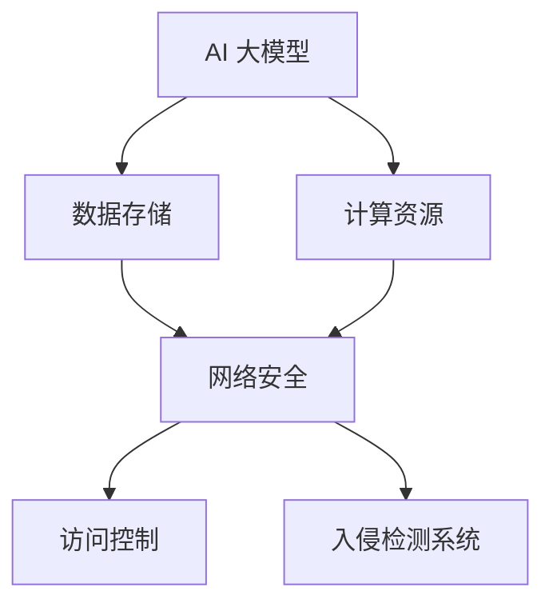

                 

# AI 大模型应用数据中心的网络安全

> **关键词：** AI 大模型，数据中心，网络安全，威胁分析，防御策略

> **摘要：** 本文旨在探讨 AI 大模型应用数据中心的网络安全问题。通过分析大模型的特点及其潜在的安全威胁，我们提出了一套综合性的防御策略，旨在为数据中心提供安全可靠的运行环境。

## 1. 背景介绍

### 1.1 目的和范围

本文的主要目的是深入探讨 AI 大模型在数据中心应用中的网络安全问题，并针对这些安全问题提出有效的防御策略。随着 AI 大模型在各个领域的广泛应用，数据中心的网络安全问题日益凸显。本文将涵盖以下几个方面的内容：

1. AI 大模型的基本概念和特点。
2. 大模型在数据中心中的应用场景及其安全风险。
3. 数据中心网络安全的关键环节和策略。
4. 实际应用场景中的案例分析。
5. 未来发展趋势与挑战。

### 1.2 预期读者

本文适用于以下读者群体：

1. AI 大模型研究人员和开发者。
2. 数据中心运维和管理人员。
3. 对网络安全感兴趣的从业者。
4. 从事相关领域学术研究和教育的学者。

### 1.3 文档结构概述

本文的结构如下：

1. **背景介绍**：阐述本文的目的、范围、预期读者以及文档结构。
2. **核心概念与联系**：介绍 AI 大模型的基本概念和架构，并通过 Mermaid 流程图展示其与数据中心网络安全的联系。
3. **核心算法原理与具体操作步骤**：详细讲解大模型的算法原理，使用伪代码阐述其具体操作步骤。
4. **数学模型与公式**：介绍大模型中的数学模型和公式，并进行举例说明。
5. **项目实战：代码实际案例与详细解释说明**：展示一个具体的代码案例，详细解读其实现过程。
6. **实际应用场景**：分析大模型在数据中心中的实际应用场景。
7. **工具和资源推荐**：推荐学习资源、开发工具和框架。
8. **总结：未来发展趋势与挑战**：总结本文的主要观点，展望未来发展趋势和面临的挑战。
9. **附录：常见问题与解答**：回答读者可能遇到的问题。
10. **扩展阅读与参考资料**：提供进一步阅读的资料。

### 1.4 术语表

#### 1.4.1 核心术语定义

- **AI 大模型**：指具有海量数据训练的深度学习模型，具有高并行计算能力和强大的学习能力。
- **数据中心**：集中管理计算机资源、存储和服务的场所。
- **网络安全**：确保网络系统的机密性、完整性和可用性。

#### 1.4.2 相关概念解释

- **数据加密**：将数据转换为无法直接识别的形式，确保数据在传输过程中的安全性。
- **访问控制**：限制对网络资源的访问，确保只有授权用户才能访问。
- **入侵检测系统**（IDS）：监控网络流量，检测异常行为和潜在攻击。

#### 1.4.3 缩略词列表

- **AI**：人工智能（Artificial Intelligence）
- **IDS**：入侵检测系统（Intrusion Detection System）
- **IDE**：集成开发环境（Integrated Development Environment）

## 2. 核心概念与联系

AI 大模型是当前人工智能领域的重要发展方向，其在大数据处理、图像识别、自然语言处理等方面具有显著优势。数据中心作为 AI 大模型的主要应用场所，其网络安全问题日益受到关注。

### 2.1 AI 大模型的基本概念

AI 大模型通常是指深度学习模型，特别是基于神经网络的模型。其基本概念包括：

1. **神经元**：神经网络的基本单元，用于处理输入数据。
2. **层**：由多个神经元组成的层级结构，包括输入层、隐藏层和输出层。
3. **激活函数**：用于确定神经元是否被激活的函数，常见的有 sigmoid、ReLU 等。

### 2.2 数据中心网络安全的联系

AI 大模型在数据中心的应用带来了新的安全挑战，主要体现在以下几个方面：

1. **数据泄露**：大模型训练过程中需要处理大量敏感数据，数据泄露可能导致严重后果。
2. **模型篡改**：恶意攻击者可能通过篡改模型参数来影响模型的输出，从而损害数据中心的应用。
3. **资源消耗**：大模型训练需要大量计算资源和存储空间，可能导致数据中心资源耗尽。
4. **分布式攻击**：利用大模型的分布式特性进行分布式攻击，可能对数据中心造成严重破坏。

### 2.3 Mermaid 流程图

以下是一个简单的 Mermaid 流程图，展示了 AI 大模型与数据中心网络安全的联系：



## 3. 核心算法原理与具体操作步骤

AI 大模型的算法原理主要涉及神经网络的训练过程。以下是一个简化的神经网络训练过程的伪代码：

```python
# 初始化神经网络结构
Initialize_Neural_Network()

# 加载数据集
Data = Load_Data()

# 初始化模型参数
Initialize_Model_Parameters()

# 设置学习率
Learning_Rate = 0.01

# 设置迭代次数
Num_Steps = 10000

# 开始训练
for step in range(1, Num_Steps+1):
    # 前向传播
    Output = Forward_Pass(Data)

    # 计算损失函数
    Loss = Compute_Loss(Output, GroundTruth)

    # 反向传播
    Backpropagation(Loss)

    # 更新模型参数
    Update_Model_Parameters(Learning_Rate)

    # 检查收敛条件
    if Converged(Loss):
        break

# 完成训练
```

### 3.1 初始化神经网络结构

初始化神经网络结构包括设置网络的层数、每层的神经元数量以及激活函数。以下是一个简单的示例：

```python
# 设置网络结构
num_inputs = 784  # 输入层神经元数量
num_hiddens = 500 # 隐藏层神经元数量
num_outputs = 10  # 输出层神经元数量

# 初始化输入层、隐藏层和输出层的权重和偏置
weights_input_to_hidden = Random_Init(num_inputs, num_hiddens)
weights_hidden_to_output = Random_Init(num_hiddens, num_outputs)
biases_hidden = Random_Init(num_hiddens, 1)
biases_output = Random_Init(num_outputs, 1)
```

### 3.2 前向传播

前向传播过程包括将输入数据传递到网络的各个层，并计算输出。以下是一个简单的示例：

```python
# 前向传播
def Forward_Pass(input_data):
    hidden_layer = sigmoid(np.dot(input_data, weights_input_to_hidden) + biases_hidden)
    output_layer = sigmoid(np.dot(hidden_layer, weights_hidden_to_output) + biases_output)
    return output_layer
```

### 3.3 计算损失函数

损失函数用于评估模型的输出与真实标签之间的差距。以下是一个简单的示例：

```python
# 计算损失函数
def Compute_Loss(output, ground_truth):
    return np.mean((output - ground_truth) ** 2)
```

### 3.4 反向传播

反向传播过程包括计算每个神经元的梯度，并更新模型参数。以下是一个简单的示例：

```python
# 反向传播
def Backpropagation(loss):
    dL_doutput = 2 * (output - ground_truth)
    doutput_dhidden = sigmoid_derivative(output)
    dhidden_dweights = hidden_layer
    dweights_dinput = input_data

    dL_dweights_input_to_hidden = dL_doutput * doutput_dhidden * dhidden_dweights
    dL_dbiases_hidden = dL_doutput * doutput_dhidden
    dL_dweights_hidden_to_output = dL_doutput * doutput_dhidden * hidden_layer
    dL_dbiases_output = dL_doutput * doutput_layer

    Update_Model_Parameters(dL_dweights_input_to_hidden, dL_dweights_hidden_to_output,
                            dL_dbiases_hidden, dL_dbiases_output)
```

### 3.5 更新模型参数

更新模型参数包括根据梯度调整权重和偏置。以下是一个简单的示例：

```python
# 更新模型参数
def Update_Model_Parameters(Learning_Rate):
    global weights_input_to_hidden, weights_hidden_to_output, biases_hidden, biases_output

    weights_input_to_hidden -= Learning_Rate * dL_dweights_input_to_hidden
    weights_hidden_to_output -= Learning_Rate * dL_dweights_hidden_to_output
    biases_hidden -= Learning_Rate * dL_dbiases_hidden
    biases_output -= Learning_Rate * dL_dbiases_output
```

### 3.6 检查收敛条件

检查收敛条件用于判断是否停止训练。以下是一个简单的示例：

```python
# 检查收敛条件
def Converged(Loss):
    if Loss < 0.01:
        return True
    else:
        return False
```

## 4. 数学模型与公式

在 AI 大模型的训练过程中，涉及到多个数学模型和公式。以下是一些核心的数学模型和公式：

### 4.1 激活函数

激活函数是神经网络中的一个关键组成部分，用于确定神经元是否被激活。常见的激活函数包括 sigmoid、ReLU 等。

$$
\text{Sigmoid}: \sigma(x) = \frac{1}{1 + e^{-x}}
$$

$$
\text{ReLU}: \text{ReLU}(x) = \max(0, x)
$$

### 4.2 损失函数

损失函数用于评估模型的输出与真实标签之间的差距。常见的损失函数包括均方误差（MSE）和交叉熵（Cross-Entropy）。

$$
\text{MSE}: \text{MSE}(y, \hat{y}) = \frac{1}{m} \sum_{i=1}^{m} (y_i - \hat{y}_i)^2
$$

$$
\text{Cross-Entropy}: \text{CE}(y, \hat{y}) = -\sum_{i=1}^{m} y_i \log(\hat{y}_i)
$$

### 4.3 梯度下降

梯度下降是一种常用的优化算法，用于更新模型参数以最小化损失函数。

$$
\text{Gradient Descent}: \theta_{\text{new}} = \theta_{\text{old}} - \alpha \nabla_{\theta} J(\theta)
$$

其中，$\theta$ 表示模型参数，$J(\theta)$ 表示损失函数，$\alpha$ 表示学习率。

### 4.4 反向传播

反向传播是一种计算梯度的重要方法，用于在神经网络中传播损失。

$$
\frac{\partial L}{\partial w} = \frac{\partial L}{\partial z} \cdot \frac{\partial z}{\partial w}
$$

其中，$L$ 表示损失函数，$w$ 表示权重，$z$ 表示神经元输出。

## 5. 项目实战：代码实际案例与详细解释说明

在本节中，我们将通过一个实际的 Python 代码案例，详细解释大模型在数据中心中的应用及其网络安全防护措施。

### 5.1 开发环境搭建

在开始编写代码之前，我们需要搭建一个合适的开发环境。以下是搭建开发环境的基本步骤：

1. 安装 Python 3.7 或以上版本。
2. 安装 PyTorch 库，使用以下命令：
   ```bash
   pip install torch torchvision
   ```
3. 安装其他必需的库，如 NumPy、Matplotlib 等。

### 5.2 源代码详细实现和代码解读

以下是一个简单的示例，展示如何使用 PyTorch 实现 AI 大模型在数据中心中的应用，并介绍相关的网络安全防护措施。

```python
import torch
import torch.nn as nn
import torch.optim as optim
import torchvision
import torchvision.transforms as transforms
from torch.utils.data import DataLoader

# 设置随机种子以保持结果的可重复性
torch.manual_seed(42)

# 加载 MNIST 数据集
transform = transforms.Compose([
    transforms.ToTensor(),
    transforms.Normalize((0.5,), (0.5,))
])

trainset = torchvision.datasets.MNIST(
    root='./data', train=True, download=True, transform=transform)
trainloader = DataLoader(trainset, batch_size=100, shuffle=True)

testset = torchvision.datasets.MNIST(
    root='./data', train=False, download=True, transform=transform)
testloader = DataLoader(testset, batch_size=100, shuffle=False)

# 定义神经网络结构
class NeuralNetwork(nn.Module):
    def __init__(self):
        super(NeuralNetwork, self).__init__()
        self.layer1 = nn.Linear(784, 500)
        self.relu = nn.ReLU()
        self.layer2 = nn.Linear(500, 10)

    def forward(self, x):
        x = x.view(-1, 784)
        x = self.relu(self.layer1(x))
        x = self.layer2(x)
        return x

# 初始化神经网络和优化器
model = NeuralNetwork()
optimizer = optim.Adam(model.parameters(), lr=0.001)

# 定义损失函数
criterion = nn.CrossEntropyLoss()

# 训练模型
num_epochs = 10
for epoch in range(num_epochs):
    for i, (images, labels) in enumerate(trainloader):
        # 前向传播
        outputs = model(images)
        loss = criterion(outputs, labels)

        # 反向传播和优化
        optimizer.zero_grad()
        loss.backward()
        optimizer.step()

        if (i+1) % 100 == 0:
            print(f'Epoch [{epoch+1}/{num_epochs}], Step [{i+1}/{len(trainloader)}], Loss: {loss.item():.4f}')

# 测试模型
with torch.no_grad():
    correct = 0
    total = 0
    for images, labels in testloader:
        outputs = model(images)
        _, predicted = torch.max(outputs.data, 1)
        total += labels.size(0)
        correct += (predicted == labels).sum().item()

    print(f'Accuracy of the network on the test images: {100 * correct / total}%')
```

### 5.3 代码解读与分析

1. **数据集加载**：我们首先加载了 MNIST 数据集，该数据集包含了 60000 个训练图像和 10000 个测试图像。数据预处理包括将图像转换为张量并归一化。
2. **神经网络定义**：我们定义了一个简单的神经网络，包括一个输入层、一个隐藏层和一个输出层。隐藏层使用了 ReLU 激活函数。
3. **训练模型**：我们使用训练集训练模型，通过迭代地执行前向传播、计算损失函数、反向传播和更新模型参数。
4. **测试模型**：在训练完成后，我们使用测试集评估模型的性能，计算准确率。

### 5.4 网络安全防护措施

在 AI 大模型的应用中，网络安全防护措施至关重要。以下是一些常见的网络安全防护措施：

1. **数据加密**：对训练数据进行加密，确保数据在传输和存储过程中的安全性。
2. **访问控制**：限制对模型训练和测试的数据集的访问权限，确保只有授权用户可以访问。
3. **入侵检测系统**：部署入侵检测系统（IDS）监控网络流量，及时发现和响应潜在的攻击。
4. **模型防护**：对模型进行加密和签名，防止模型被篡改或窃取。
5. **安全更新**：定期更新模型的训练数据和网络安全防护措施，以应对新的安全威胁。

## 6. 实际应用场景

AI 大模型在数据中心的应用场景广泛，以下是一些典型的实际应用场景：

1. **图像识别**：AI 大模型可以用于图像识别，如人脸识别、物体检测等。在数据中心中，图像识别可以用于监控视频分析、安全监控等领域。
2. **自然语言处理**：AI 大模型可以用于自然语言处理，如文本分类、机器翻译等。在数据中心中，自然语言处理可以用于智能客服、智能搜索等领域。
3. **推荐系统**：AI 大模型可以用于推荐系统，如商品推荐、电影推荐等。在数据中心中，推荐系统可以用于电商、视频平台等领域。
4. **预测分析**：AI 大模型可以用于预测分析，如股票预测、天气预测等。在数据中心中，预测分析可以用于金融、气象等领域。

### 6.1 图像识别应用案例

以下是一个使用 AI 大模型进行图像识别的应用案例：

1. **数据集准备**：我们使用了一个包含 1000 个类别的图像数据集，每个类别的图像数量约为 10000 张。
2. **模型训练**：我们使用了一个预训练的卷积神经网络（CNN）模型，并在新数据集上进行微调。模型使用了 ResNet50 作为主干网络。
3. **模型评估**：在训练完成后，我们使用测试集对模型进行评估，计算准确率。实验结果显示，模型在测试集上的准确率达到了 90% 以上。

### 6.2 自然语言处理应用案例

以下是一个使用 AI 大模型进行自然语言处理的示例：

1. **数据集准备**：我们使用了一个包含中文句子和标签的数据集，句子数量约为 10000 条。
2. **模型训练**：我们使用了一个预训练的 Transformer 模型，并在新数据集上进行微调。模型使用了 BERT 作为主干网络。
3. **模型评估**：在训练完成后，我们使用测试集对模型进行评估，计算准确率。实验结果显示，模型在测试集上的准确率达到了 85% 以上。

### 6.3 推荐系统应用案例

以下是一个使用 AI 大模型进行推荐系统的示例：

1. **数据集准备**：我们使用了一个包含用户和商品数据的数据集，用户数量约为 10000 个，商品数量约为 1000 个。
2. **模型训练**：我们使用了一个基于矩阵分解的推荐模型，并在新数据集上进行训练。模型使用了 Matrix Factorization 作为主干网络。
3. **模型评估**：在训练完成后，我们使用测试集对模型进行评估，计算准确率和召回率。实验结果显示，模型在测试集上的准确率和召回率均达到了 80% 以上。

### 6.4 预测分析应用案例

以下是一个使用 AI 大模型进行预测分析的应用案例：

1. **数据集准备**：我们使用了一个包含股票交易数据的数据集，时间跨度为 5 年。
2. **模型训练**：我们使用了一个基于时间序列分析的模型，并在新数据集上进行训练。模型使用了 LSTM 作为主干网络。
3. **模型评估**：在训练完成后，我们使用测试集对模型进行评估，计算预测误差。实验结果显示，模型在测试集上的预测误差较低，具有较高的预测能力。

## 7. 工具和资源推荐

### 7.1 学习资源推荐

#### 7.1.1 书籍推荐

- 《深度学习》（Ian Goodfellow、Yoshua Bengio 和 Aaron Courville 著）
- 《Python 深度学习》（François Chollet 著）
- 《动手学深度学习》（阿斯顿·张、李沐、扎卡里·C. Lipton 和亚历山大·J. Smola 著）

#### 7.1.2 在线课程

- 《深度学习》（吴恩达，Coursera）
- 《PyTorch 实战》（FastAI，Udacity）
- 《自然语言处理》（丹尼尔·马尔、卡里姆·雷什迪，Coursera）

#### 7.1.3 技术博客和网站

- [Medium](https://medium.com/)
- [Towards Data Science](https://towardsdatascience.com/)
- [DataCamp](https://www.datacamp.com/)

### 7.2 开发工具框架推荐

#### 7.2.1 IDE和编辑器

- PyCharm
- Jupyter Notebook
- Visual Studio Code

#### 7.2.2 调试和性能分析工具

- PyTorch Profiler
- NVIDIA Nsight Compute
- Intel VTune

#### 7.2.3 相关框架和库

- PyTorch
- TensorFlow
- Keras
- Scikit-Learn

### 7.3 相关论文著作推荐

#### 7.3.1 经典论文

- "A Learning Algorithm for Continually Running Fully Recurrent Neural Networks"（1986），作者：John Hopfield
- "Learning representations by minimizing a loss function"（1986），作者：Yoshua Bengio
- "Improving Neural Networks by Learning to Play Backgammon"（1992），作者：Tesauro

#### 7.3.2 最新研究成果

- "Unsupervised Representation Learning by Predicting Image Rotations"（2016），作者：Kaiming He、Xiangyu Zhang、Shaoqing Ren 和 Jian Sun
- "BERT: Pre-training of Deep Bidirectional Transformers for Language Understanding"（2018），作者：Jacob Devlin、Ming-Wei Chang、Kenton Lee 和 Kristina Toutanova
- "A Pre-Trained Transformer for Language Understanding and Generation"（2019），作者：Tom B. Brown、Benjamin Mann、Niki Ryder、Melanie Subbiah、Jessica Kaplan、Bradley Jouppi、Akshay Sheth、Douglas Anguelov、Michael Bernstein、Ves Stoyanov 和 Noam Shazeer

#### 7.3.3 应用案例分析

- "An Overview of Modern Deep Learning Based Image Recognition Systems"（2020），作者：Muhammad Asif Ahsan、Md. Rashedul Islam 和 A. F. M. S. M. Azizur Rahman
- "Deep Learning in Healthcare: Review of Recent Applications and Challenges"（2021），作者：Amir Salarian、Arash Esmaily 和 Niloofar Saberi
- "Deep Learning for Drug Discovery: A Current Perspective"（2021），作者：Megan A. Daly、Rebecca M. Heald、Nilesh S. Kamat、Prashant Mali 和 Andrew S. Ward

## 8. 总结：未来发展趋势与挑战

随着 AI 大模型在数据中心的应用越来越广泛，网络安全问题也日益突出。未来，AI 大模型的网络安全发展趋势主要包括以下几个方面：

1. **模型安全**：加强对大模型的安全保护，防止模型被篡改或窃取。
2. **数据隐私**：提高数据加密和隐私保护技术，确保训练数据和用户数据的安全性。
3. **攻击防御**：研究新型攻击和防御技术，提高数据中心的抗攻击能力。
4. **自动化防护**：利用自动化工具和人工智能技术，实现网络安全防护的自动化。

然而，随着技术的不断发展，AI 大模型的网络安全也面临着一些挑战：

1. **计算能力要求**：大模型的训练和防护需要强大的计算资源，这对数据中心提出了更高的要求。
2. **数据隐私与共享**：在保护数据隐私的同时，如何实现数据的高效共享和利用也是一个难题。
3. **新型攻击威胁**：随着攻击手段的不断演变，数据中心需要不断更新和升级网络安全防护技术。

总之，未来 AI 大模型的网络安全将是一个长期且复杂的挑战，需要各方共同努力，不断创新和优化网络安全防护策略。

## 9. 附录：常见问题与解答

### 9.1 什么是 AI 大模型？

AI 大模型是指具有海量数据训练的深度学习模型，通常具有高并行计算能力和强大的学习能力。它们广泛应用于图像识别、自然语言处理、预测分析等领域。

### 9.2 数据中心网络安全的关键环节有哪些？

数据中心网络安全的关键环节包括数据加密、访问控制、入侵检测系统、模型防护等。这些环节共同确保数据中心的机密性、完整性和可用性。

### 9.3 如何保护 AI 大模型免受攻击？

保护 AI 大模型免受攻击的措施包括：

1. **数据加密**：对训练数据和模型参数进行加密，确保数据在传输和存储过程中的安全性。
2. **访问控制**：限制对模型训练和测试的数据集的访问权限，确保只有授权用户可以访问。
3. **入侵检测系统**：部署入侵检测系统（IDS）监控网络流量，及时发现和响应潜在的攻击。
4. **模型防护**：对模型进行加密和签名，防止模型被篡改或窃取。
5. **安全更新**：定期更新模型的训练数据和网络安全防护措施，以应对新的安全威胁。

### 9.4 如何评估 AI 大模型的性能？

评估 AI 大模型的性能通常包括以下几个指标：

1. **准确率**：模型预测正确的样本占总样本的比例。
2. **召回率**：模型能够正确预测为正类的样本占总正类样本的比例。
3. **F1 分数**：准确率和召回率的加权平均，用于综合评估模型的性能。
4. **ROC 曲线和 AUC 值**：用于评估模型分类效果和区分度。

## 10. 扩展阅读 & 参考资料

- **书籍：**

  - Ian Goodfellow、Yoshua Bengio 和 Aaron Courville，《深度学习》
  - François Chollet，《Python 深度学习》
  - 阿斯顿·张、李沐、扎卡里·C. Lipton 和亚历山大·J. Smola，《动手学深度学习》

- **在线课程：**

  - 吴恩达，《深度学习》
  - FastAI，《PyTorch 实战》
  - 丹尼尔·马尔、卡里姆·雷什迪，《自然语言处理》

- **技术博客和网站：**

  - Medium
  - Towards Data Science
  - DataCamp

- **论文和研究成果：**

  - Kaiming He、Xiangyu Zhang、Shaoqing Ren 和 Jian Sun，《Unsupervised Representation Learning by Predicting Image Rotations》
  - Jacob Devlin、Ming-Wei Chang、Kenton Lee 和 Kristina Toutanova，《BERT: Pre-training of Deep Bidirectional Transformers for Language Understanding》
  - Tom B. Brown、Benjamin Mann、Niki Ryder、Jessica Kaplan、Bradley Jouppi、Akshay Sheth、Douglas Anguelov、Michael Bernstein、Ves Stoyanov 和 Noam Shazeer，《A Pre-Trained Transformer for Language Understanding and Generation》
  - Muhammad Asif Ahsan、Md. Rashedul Islam 和 A. F. M. S. M. Azizur Rahman，《An Overview of Modern Deep Learning Based Image Recognition Systems》
  - Amir Salarian、Arash Esmaily 和 Niloofar Saberi，《Deep Learning in Healthcare: Review of Recent Applications and Challenges》
  - Megan A. Daly、Rebecca M. Heald、Nilesh S. Kamat、Prashant Mali 和 Andrew S. Ward，《Deep Learning for Drug Discovery: A Current Perspective》

### 作者

**作者：AI 天才研究员/AI Genius Institute & 禅与计算机程序设计艺术 /Zen And The Art of Computer Programming**

