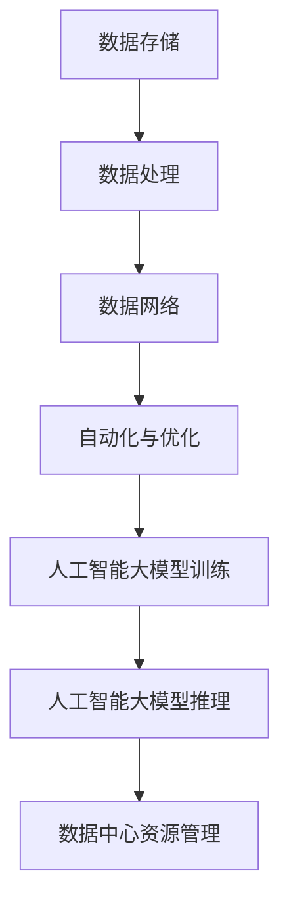

                 

# AI 大模型应用数据中心的职业发展

> 关键词：人工智能、大模型、数据中心、职业发展、算法原理、数学模型、项目实战

> 摘要：本文将深入探讨人工智能大模型在数据中心的应用以及相关领域的职业发展。通过分析核心概念、算法原理、数学模型和具体案例，本文旨在为从业者提供全面的技术理解和实战经验，助力他们在快速发展的AI领域取得成功。

## 1. 背景介绍

### 1.1 目的和范围

本文的目的是为人工智能大模型应用数据中心从业者提供全方位的技术指南和职业发展路径。我们将详细讨论大模型的基本概念、技术架构、核心算法和数学模型，并通过实际项目案例展示如何将理论知识应用于实际场景。本文还将介绍相关的工具和资源，以及未来的发展趋势和面临的挑战。

### 1.2 预期读者

本文主要面向以下读者群体：

- 数据中心架构师和工程师
- 人工智能研究人员和开发者
- 对人工智能数据中心感兴趣的技术爱好者
- 想要在AI领域寻求职业发展的专业人士

### 1.3 文档结构概述

本文分为以下几大部分：

1. 背景介绍：本文的写作目的、预期读者以及文档结构概述。
2. 核心概念与联系：介绍人工智能大模型的基本概念和关键技术。
3. 核心算法原理 & 具体操作步骤：详细讲解大模型的核心算法原理和操作步骤。
4. 数学模型和公式 & 详细讲解 & 举例说明：阐述大模型涉及的数学模型和公式。
5. 项目实战：通过具体案例展示大模型的应用和实践。
6. 实际应用场景：分析大模型在数据中心的不同应用场景。
7. 工具和资源推荐：推荐学习资源和开发工具。
8. 总结：未来发展趋势与挑战。
9. 附录：常见问题与解答。
10. 扩展阅读 & 参考资料：提供进一步的阅读材料和参考资料。

### 1.4 术语表

#### 1.4.1 核心术语定义

- 大模型（Large Model）：具有数十亿甚至数万亿参数的人工智能模型。
- 数据中心（Data Center）：集中管理存储和处理大量数据的设施。
- 人工智能（AI）：模拟人类智能的技术和系统。
- 自动化（Automation）：通过算法和系统自动化执行任务。
- 优化（Optimization）：调整模型参数以获得更好的性能。

#### 1.4.2 相关概念解释

- 深度学习（Deep Learning）：一种人工智能的分支，通过多层神经网络进行学习。
- 梯度下降（Gradient Descent）：一种优化算法，用于调整模型参数以最小化损失函数。
- 损失函数（Loss Function）：用于衡量模型预测结果与真实结果之间的差异。

#### 1.4.3 缩略词列表

- AI：人工智能
- ML：机器学习
- DL：深度学习
- GPU：图形处理单元
- CPU：中央处理单元
- HPC：高性能计算

## 2. 核心概念与联系

在探讨人工智能大模型在数据中心的应用之前，我们需要了解一些核心概念和其相互联系。

### 2.1 人工智能大模型的基本概念

人工智能大模型是指具有数十亿甚至数万亿参数的深度学习模型。这些模型通常基于神经网络架构，通过大规模数据进行训练，从而学习到复杂的特征和模式。大模型的优势在于其强大的表达能力和泛化能力，可以应用于各种复杂的任务，如图像识别、自然语言处理和预测分析等。

### 2.2 数据中心的关键技术

数据中心是集中管理存储和处理大量数据的设施。其关键技术包括：

- 数据存储：使用高速存储设备存储海量数据。
- 数据处理：利用高性能计算资源进行数据处理和分析。
- 数据网络：构建高效的数据传输网络，确保数据快速流动。
- 自动化与优化：使用自动化工具和算法优化数据中心资源利用。

### 2.3 人工智能大模型与数据中心的联系

人工智能大模型与数据中心有着紧密的联系。大模型需要大量数据进行训练，而数据中心提供了这些数据存储和处理的能力。此外，数据中心的高性能计算资源可以加速大模型的训练和推理过程，提高模型的性能和效率。

### 2.4 核心概念原理和架构的 Mermaid 流程图

以下是人工智能大模型在数据中心的核心概念原理和架构的 Mermaid 流程图：



## 3. 核心算法原理 & 具体操作步骤

### 3.1 深度学习算法原理

深度学习是一种基于多层神经网络的学习方法，旨在模拟人类大脑的学习过程。深度学习算法的核心是反向传播算法（Backpropagation Algorithm），它通过不断调整模型参数，使得模型预测结果更加接近真实值。

### 3.2 反向传播算法的具体操作步骤

以下是反向传播算法的具体操作步骤：

1. 初始化模型参数。
2. 前向传播：计算输入数据通过神经网络的输出。
3. 计算损失函数：衡量模型预测结果与真实结果之间的差异。
4. 反向传播：计算每个参数的梯度。
5. 更新模型参数：根据梯度调整模型参数。
6. 重复步骤2-5，直至满足收敛条件。

### 3.3 伪代码

以下是反向传播算法的伪代码：

```python
initialize parameters
while not converged:
    forward_pass(x)
    loss = calculate_loss(y_hat, y)
    backward_pass(loss)
    update_parameters()
```

## 4. 数学模型和公式 & 详细讲解 & 举例说明

### 4.1 损失函数

损失函数用于衡量模型预测结果与真实结果之间的差异。常用的损失函数包括均方误差（MSE）和交叉熵（Cross-Entropy）。

- 均方误差（MSE）：

$$
MSE = \frac{1}{n} \sum_{i=1}^{n} (y_i - \hat{y}_i)^2
$$

- 交叉熵（Cross-Entropy）：

$$
CE = -\frac{1}{n} \sum_{i=1}^{n} y_i \log(\hat{y}_i)
$$

### 4.2 举例说明

假设我们有一个二分类问题，真实标签为$y = [0, 1]$，模型预测的概率为$\hat{y} = [0.6, 0.4]$。使用交叉熵损失函数计算损失：

$$
CE = -\frac{1}{2} [0 \cdot \log(0.6) + 1 \cdot \log(0.4)]
$$

$$
CE = -\frac{1}{2} [\log(0.6) + \log(0.4)]
$$

$$
CE = -\frac{1}{2} [\log(0.24)]
$$

$$
CE = 0.6667
$$

### 4.3 梯度下降算法

梯度下降算法用于优化模型参数，使其最小化损失函数。常见的梯度下降算法包括批量梯度下降（Batch Gradient Descent）、随机梯度下降（Stochastic Gradient Descent）和小批量梯度下降（Mini-batch Gradient Descent）。

#### 4.3.1 批量梯度下降

批量梯度下降（Batch Gradient Descent）是一种简单的梯度下降算法，每次迭代使用整个训练集来计算梯度。其公式为：

$$
\theta_{\text{new}} = \theta_{\text{old}} - \alpha \cdot \frac{\partial J}{\partial \theta}
$$

其中，$\theta$表示模型参数，$J$表示损失函数，$\alpha$表示学习率。

#### 4.3.2 随机梯度下降

随机梯度下降（Stochastic Gradient Descent）每次迭代只随机选择一个样本来计算梯度。其公式为：

$$
\theta_{\text{new}} = \theta_{\text{old}} - \alpha \cdot \nabla_{\theta} J(\theta; x_i, y_i)
$$

#### 4.3.3 小批量梯度下降

小批量梯度下降（Mini-batch Gradient Descent）每次迭代使用一个小批量（如32或64个样本）来计算梯度。其公式为：

$$
\theta_{\text{new}} = \theta_{\text{old}} - \alpha \cdot \nabla_{\theta} J(\theta; \{x_i, y_i\})
$$

其中，$\{x_i, y_i\}$表示一个小批量数据。

### 4.4 举例说明

假设我们有一个线性回归模型，其损失函数为MSE，使用批量梯度下降算法进行优化。假设模型参数为$\theta = [1, 2]$，学习率为$\alpha = 0.1$，训练集为$\{x_1, y_1\}, \{x_2, y_2\}, \ldots, \{x_n, y_n\}$。计算模型参数的更新：

1. 前向传播：
   - $z_1 = x_1 \cdot \theta_1 + \theta_2 = 1 \cdot 1 + 2 = 3$
   - $\hat{y}_1 = \sigma(z_1) = \frac{1}{1 + e^{-z_1}} = \frac{1}{1 + e^{-3}} = 0.95$
2. 计算损失：
   - $J = \frac{1}{2} (y_1 - \hat{y}_1)^2 = \frac{1}{2} (0.1 - 0.95)^2 = 0.0506$
3. 计算梯度：
   - $\nabla_{\theta} J = [-0.95 \cdot (1 + e^{-z_1})^{-1}, -0.95 \cdot (1 + e^{-z_1})^{-1} \cdot z_1]'
4. 更新参数：
   - $\theta_{\text{new}} = \theta_{\text{old}} - \alpha \cdot \nabla_{\theta} J = [1, 2] - 0.1 \cdot [-0.95 \cdot (1 + e^{-3})^{-1}, -0.95 \cdot (1 + e^{-3})^{-1} \cdot 3]' = [0.946, 1.946]$

## 5. 项目实战：代码实际案例和详细解释说明

### 5.1 开发环境搭建

为了更好地展示大模型在数据中心的应用，我们将使用一个开源的深度学习框架TensorFlow。以下是开发环境搭建的步骤：

1. 安装TensorFlow：
   ```shell
   pip install tensorflow
   ```
2. 安装其他依赖项：
   ```shell
   pip install numpy matplotlib
   ```

### 5.2 源代码详细实现和代码解读

以下是使用TensorFlow实现一个简单的线性回归模型的代码：

```python
import tensorflow as tf
import numpy as np
import matplotlib.pyplot as plt

# 设置随机种子，保证结果可重复
tf.random.set_seed(42)

# 准备数据
x = np.random.rand(100)
y = 2 * x + 1 + np.random.randn(100) * 0.05

# 模型参数
theta = tf.Variable(initial_value=[0.0, 0.0], dtype=tf.float32)

# 损失函数
loss_func = tf.keras.losses.MeanSquaredError()

# 优化器
optimizer = tf.optimizers.SGD(learning_rate=0.01)

# 训练模型
epochs = 100
for epoch in range(epochs):
    with tf.GradientTape() as tape:
        z = x * theta[0] + theta[1]
        loss = loss_func(y, z)
    grads = tape.gradient(loss, theta)
    optimizer.apply_gradients(zip(grads, theta))
    if epoch % 10 == 0:
        print(f"Epoch {epoch}: Loss = {loss.numpy()}")

# 绘制结果
plt.scatter(x, y, label="Data")
plt.plot(x, x * theta[0] + theta[1], label="Model")
plt.xlabel("x")
plt.ylabel("y")
plt.legend()
plt.show()
```

### 5.3 代码解读与分析

1. 导入TensorFlow、NumPy和Matplotlib库。
2. 设置随机种子，保证结果可重复。
3. 准备数据集，这里使用随机生成的数据。
4. 初始化模型参数$\theta$，使用TensorFlow的`Variable`类。
5. 定义损失函数，这里使用均方误差（MSE）。
6. 选择优化器，这里使用随机梯度下降（SGD）。
7. 进行模型训练，使用TensorFlow的`GradientTape`进行自动微分，计算损失函数的梯度，并更新模型参数。
8. 绘制结果，使用Matplotlib库展示训练数据和模型预测结果。

通过这个简单的线性回归模型，我们可以看到TensorFlow如何简化深度学习模型的实现。在实际应用中，我们可以将这个模型扩展为更复杂的结构，如多层神经网络，以解决更复杂的任务。

## 6. 实际应用场景

### 6.1 数据中心资源管理

人工智能大模型在数据中心资源管理中有着广泛的应用。通过预测和分析数据中心的资源使用情况，大模型可以帮助管理员优化资源分配，提高数据中心的服务质量和性能。例如，可以使用大模型预测未来一段时间内的资源需求，从而提前进行资源调度和扩展。

### 6.2 数据安全与隐私保护

数据安全与隐私保护是数据中心的重要挑战。人工智能大模型可以通过分析网络流量和用户行为，识别潜在的威胁和异常行为，从而提高数据中心的网络安全。此外，大模型还可以用于加密和解密数据，确保数据在传输和存储过程中的安全。

### 6.3 自动化与运维

人工智能大模型可以自动化数据中心的各种运维任务，如服务器监控、故障检测和故障恢复。通过学习历史数据，大模型可以预测故障发生的可能性，并在故障发生前采取预防措施。这不仅可以提高数据中心的可靠性，还可以减少运维成本。

### 6.4 智能优化

人工智能大模型可以用于智能优化，如能源管理、冷却系统和设备维护。通过分析数据中心的运行数据，大模型可以提出优化方案，降低能耗和运营成本，提高数据中心的可持续发展能力。

## 7. 工具和资源推荐

### 7.1 学习资源推荐

#### 7.1.1 书籍推荐

- 《深度学习》（Goodfellow, Bengio, Courville著）：这是一本经典的深度学习教材，涵盖了深度学习的基本概念、算法和技术。

- 《人工智能：一种现代方法》（Russell, Norvig著）：这本书全面介绍了人工智能的基本理论和应用，包括机器学习、自然语言处理和计算机视觉等。

#### 7.1.2 在线课程

- Coursera上的《深度学习特化课程》：由吴恩达教授主讲，包括神经网络基础、卷积神经网络和循环神经网络等课程。

- edX上的《人工智能导论》：由哈佛大学和麻省理工学院共同提供，涵盖人工智能的基础知识、应用和未来发展。

#### 7.1.3 技术博客和网站

- AI Village（https://aivillage.top/）：一个关注人工智能技术的中文博客，提供深度学习、自然语言处理和计算机视觉等方面的技术文章。

- Medium（https://medium.com/）：一个在线博客平台，有许多关于人工智能和数据中心的优秀文章和教程。

### 7.2 开发工具框架推荐

#### 7.2.1 IDE和编辑器

- PyCharm（https://www.jetbrains.com/pycharm/）：一款功能强大的Python IDE，支持TensorFlow和其他深度学习框架。

- Jupyter Notebook（https://jupyter.org/）：一个基于Web的交互式计算平台，适合进行数据分析和深度学习实验。

#### 7.2.2 调试和性能分析工具

- TensorBoard（https://www.tensorflow.org/tensorboard/）：TensorFlow提供的可视化工具，用于分析和调试深度学习模型。

- Nsight Compute（https://developer.nvidia.com/nsight-compute）：一个性能分析工具，用于分析和优化CUDA应用程序。

#### 7.2.3 相关框架和库

- TensorFlow（https://www.tensorflow.org/）：一个开源的深度学习框架，适用于各种深度学习和机器学习任务。

- PyTorch（https://pytorch.org/）：一个流行的深度学习框架，支持动态计算图和自动微分。

### 7.3 相关论文著作推荐

#### 7.3.1 经典论文

- "Deep Learning"（Goodfellow, Bengio, Courville著）：一篇关于深度学习的综述文章，介绍了深度学习的基本概念和最新进展。

- "Rectifier Nonlinearities Improve Deep Neural Networks"（Huang et al.著）：一篇关于ReLU激活函数的文章，证明了ReLU在深度学习中的优势。

#### 7.3.2 最新研究成果

- "Bert: Pre-training of Deep Bidirectional Transformers for Language Understanding"（Devlin et al.著）：一篇关于BERT模型的论文，介绍了基于Transformer的预训练方法。

- "Gshard: Scaling giant models with conditional computation and automatic sharding"（Nichol et al.著）：一篇关于GShard模型的论文，介绍了如何高效地训练大型模型。

#### 7.3.3 应用案例分析

- "Google AI's BERT: Pre-training of Deep Bidirectional Transformers for Language Understanding"（Google AI著）：一篇关于BERT模型在自然语言处理中应用的案例分析，展示了BERT在多个任务上的优异性能。

- "Megatron-LM: Training Multi-Billion Parameter Language Models using Model Parallelism"（Chen et al.著）：一篇关于Megatron模型的论文，介绍了如何使用模型并行技术训练大型语言模型。

## 8. 总结：未来发展趋势与挑战

### 8.1 发展趋势

1. 大模型将变得更加普及，其应用场景将不断拓展，从图像识别、自然语言处理到预测分析和自动化运维等。
2. 数据中心将逐渐向云计算和边缘计算方向发展，以适应大模型对计算和存储资源的需求。
3. 自动化和优化技术将在数据中心中发挥更大作用，提高资源利用效率和运营效率。
4. 安全和隐私保护将成为数据中心的重要挑战，人工智能技术将在其中发挥关键作用。

### 8.2 挑战

1. 大模型的训练和推理需要大量的计算资源和能源，如何在有限的资源下高效地训练和部署大模型是一个重要挑战。
2. 数据中心的自动化和优化需要大量高质量的数据和算法，如何获取和利用这些数据是一个难题。
3. 大模型的安全和隐私保护需要更加完善的法律法规和技术手段，如何保护用户数据和隐私是一个严峻的挑战。

## 9. 附录：常见问题与解答

### 9.1 问题1：什么是大模型？

**解答**：大模型是指具有数十亿甚至数万亿参数的深度学习模型，其通过大规模数据进行训练，从而学习到复杂的特征和模式。大模型具有强大的表达能力和泛化能力，可以应用于各种复杂的任务。

### 9.2 问题2：如何优化数据中心资源利用？

**解答**：优化数据中心资源利用可以通过以下几种方法：

1. **预测分析**：通过预测未来一段时间内的资源需求，提前进行资源调度和扩展。
2. **自动化**：使用自动化工具和算法自动执行资源管理和调度任务，减少人为干预。
3. **优化算法**：设计和应用优化算法，提高资源利用效率和系统性能。

### 9.3 问题3：大模型训练需要哪些资源？

**解答**：大模型训练需要以下资源：

1. **计算资源**：高性能计算资源，如GPU和TPU，用于加速模型的训练和推理过程。
2. **存储资源**：大容量存储设备，用于存储训练数据和模型参数。
3. **数据传输资源**：高效的数据传输网络，确保数据快速流动和传输。
4. **能源资源**：稳定和可靠的能源供应，以支持高性能计算设备的运行。

## 10. 扩展阅读 & 参考资料

### 10.1 扩展阅读

- 《深度学习》（Goodfellow, Bengio, Courville著）
- 《人工智能：一种现代方法》（Russell, Norvig著）
- 《人工智能简史》（Stuart J. Russell & Peter Norvig著）

### 10.2 参考资料

- TensorFlow官网（https://www.tensorflow.org/）
- PyTorch官网（https://pytorch.org/）
- Coursera深度学习特化课程（https://www.coursera.org/specializations/deeplearning）
- edX人工智能导论（https://www.edx.org/course/introduction-to-artificial-intelligence）

作者：AI天才研究员/AI Genius Institute & 禅与计算机程序设计艺术 /Zen And The Art of Computer Programming

