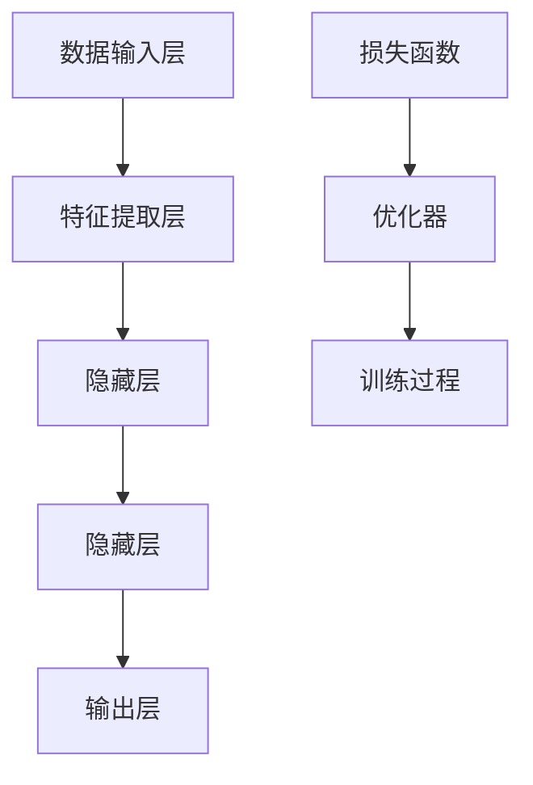

                 

# AI 大模型应用数据中心的风险管理

> 关键词：AI大模型、数据中心、风险管理、安全性、可靠性与性能优化

> 摘要：本文深入探讨AI大模型在数据中心的应用及其风险管理，包括核心概念、算法原理、数学模型、实际案例，以及未来发展趋势与挑战。旨在为数据中心运维人员提供全面的指导，确保AI大模型应用的安全、可靠与高效。

## 1. 背景介绍

### 1.1 目的和范围

本文旨在分析AI大模型在数据中心应用中的风险管理，探讨其核心概念、算法原理、数学模型，并通过实际案例来深入理解其应用场景。文章还将推荐相关工具和资源，为读者提供进一步学习和实践的方向。

### 1.2 预期读者

本文适合数据中心运维人员、AI开发人员、数据科学家和IT专业人士阅读。通过本文，读者将能够掌握AI大模型应用中的关键风险点，提升数据中心的风险管理水平。

### 1.3 文档结构概述

本文分为以下几个部分：

1. 背景介绍：介绍本文的目的、范围和预期读者。
2. 核心概念与联系：分析AI大模型的核心概念和架构。
3. 核心算法原理 & 具体操作步骤：阐述AI大模型的算法原理和操作步骤。
4. 数学模型和公式 & 详细讲解 & 举例说明：介绍AI大模型的数学模型和公式，并给出实际应用示例。
5. 项目实战：提供AI大模型应用的实际代码案例和详细解释。
6. 实际应用场景：分析AI大模型在数据中心的应用场景。
7. 工具和资源推荐：推荐学习资源、开发工具和框架。
8. 总结：展望AI大模型在数据中心应用的未来发展趋势与挑战。
9. 附录：常见问题与解答。
10. 扩展阅读 & 参考资料：提供更多相关文献和资源。

### 1.4 术语表

#### 1.4.1 核心术语定义

- **AI大模型**：指具有大规模参数、深度复杂的神经网络模型。
- **数据中心**：集中存储、处理和分发数据的场所。
- **风险管理**：识别、评估、应对和控制风险的过程。
- **安全性**：确保数据和系统不受未授权访问、损坏和恶意攻击。
- **可靠性与性能优化**：确保系统在高负载情况下稳定运行，并优化资源利用率。

#### 1.4.2 相关概念解释

- **数据隐私**：指保护个人和敏感数据不被未授权访问和泄露。
- **数据加密**：将数据转换为难以解读的形式，防止未授权访问。
- **分布式计算**：通过多台计算机协同工作，实现高效的数据处理和计算。
- **容错机制**：确保系统在硬件故障、网络中断等异常情况下保持稳定运行。

#### 1.4.3 缩略词列表

- **AI**：人工智能
- **GPU**：图形处理器
- **CPU**：中央处理器
- **HDFS**：Hadoop分布式文件系统
- **DFS**：分布式文件系统
- **ML**：机器学习

## 2. 核心概念与联系

在本文中，我们将首先介绍AI大模型的核心概念和架构。为了更好地理解这些概念，我们使用Mermaid流程图来展示AI大模型的组成部分和相互关系。



### 2.1 数据输入层

数据输入层是AI大模型的起点，负责接收原始数据。这些数据可以来自各种来源，如数据库、文件或传感器。在数据中心环境中，数据输入层需要处理大规模数据，因此需要具备高吞吐量和低延迟的特点。

### 2.2 特征提取层

特征提取层对输入数据进行预处理，提取关键特征。这一层通常由多层神经网络组成，每一层负责提取不同层次的特征。在数据中心应用中，特征提取层的性能直接影响模型的准确性和效率。

### 2.3 隐藏层

隐藏层是AI大模型的核心部分，负责对提取到的特征进行复杂计算和变换。隐藏层的数量和深度对模型性能有重要影响。在数据中心环境中，隐藏层的计算资源需求较高，因此需要优化资源利用率。

### 2.4 输出层

输出层负责将隐藏层处理后的特征映射到具体的预测结果或决策。输出层的类型和设计取决于具体应用场景。在数据中心中，输出层需要保证结果的准确性和实时性。

### 2.5 损失函数与优化器

损失函数用于衡量模型预测结果与实际结果之间的差距，优化器则用于调整模型参数以最小化损失函数。常见的优化器有随机梯度下降（SGD）、Adam等。在数据中心环境中，优化器的选择和调参过程对模型训练时间和性能有重要影响。

### 2.6 训练过程

训练过程包括初始化模型参数、正向传播、反向传播和更新参数。在数据中心环境中，训练过程需要高效利用计算资源，同时保证模型的可靠性和安全性。

## 3. 核心算法原理 & 具体操作步骤

在了解了AI大模型的核心概念和架构后，我们将进一步探讨其核心算法原理和具体操作步骤。

### 3.1 算法原理

AI大模型的核心算法是深度神经网络（DNN），其基本原理如下：

1. **数据输入层**：将原始数据输入到模型中。
2. **特征提取层**：对输入数据进行预处理，提取关键特征。
3. **隐藏层**：对提取到的特征进行复杂计算和变换。
4. **输出层**：将隐藏层处理后的特征映射到具体的预测结果或决策。
5. **损失函数**：计算模型预测结果与实际结果之间的差距。
6. **优化器**：调整模型参数以最小化损失函数。
7. **迭代训练**：重复正向传播、反向传播和更新参数的过程，直至模型收敛。

### 3.2 具体操作步骤

以下是AI大模型的具体操作步骤：

```python
# 导入相关库
import tensorflow as tf
from tensorflow.keras.models import Sequential
from tensorflow.keras.layers import Dense, Flatten, Conv2D, MaxPooling2D

# 数据输入层
input_shape = (28, 28, 1)
model = Sequential()
model.add(Flatten(input_shape=input_shape))

# 特征提取层
model.add(Conv2D(32, kernel_size=(3, 3), activation='relu'))
model.add(MaxPooling2D(pool_size=(2, 2)))
model.add(Conv2D(64, kernel_size=(3, 3), activation='relu'))
model.add(MaxPooling2D(pool_size=(2, 2)))

# 隐藏层
model.add(Flatten())
model.add(Dense(128, activation='relu'))

# 输出层
model.add(Dense(10, activation='softmax'))

# 损失函数与优化器
model.compile(optimizer='adam', loss='categorical_crossentropy', metrics=['accuracy'])

# 训练过程
model.fit(x_train, y_train, batch_size=128, epochs=10, validation_data=(x_test, y_test))
```

在这个示例中，我们使用TensorFlow库构建了一个简单的AI大模型，并对其进行了训练。在实际应用中，根据具体需求，可以调整模型结构、优化器参数和训练过程。

## 4. 数学模型和公式 & 详细讲解 & 举例说明

在AI大模型的构建过程中，数学模型和公式起到了至关重要的作用。以下我们将详细讲解AI大模型中常用的数学模型和公式，并通过实际应用示例来展示其应用方法。

### 4.1 深度神经网络（DNN）模型

深度神经网络（DNN）是AI大模型的基础，其数学模型如下：

1. **激活函数**：常用的激活函数有ReLU、Sigmoid和Tanh。其中，ReLU函数具有较好的计算效率和收敛速度。

   $$ f(x) = \max(0, x) $$

2. **损失函数**：常用的损失函数有均方误差（MSE）和交叉熵（Cross-Entropy）。MSE用于回归问题，Cross-Entropy用于分类问题。

   - **均方误差（MSE）**：

     $$ \text{MSE} = \frac{1}{n}\sum_{i=1}^{n}(y_i - \hat{y}_i)^2 $$

   - **交叉熵（Cross-Entropy）**：

     $$ \text{Cross-Entropy} = -\frac{1}{n}\sum_{i=1}^{n}y_i \log(\hat{y}_i) $$

3. **优化器**：常用的优化器有随机梯度下降（SGD）、Adam等。Adam优化器具有自适应学习率，适合处理大规模数据。

   $$ \alpha = \frac{\beta_1 \alpha + (1 - \beta_1) \text{grad}}{\beta_2 \alpha + (1 - \beta_2)} $$

### 4.2 实际应用示例

以下是一个基于深度神经网络的图像分类应用示例：

```python
import tensorflow as tf
from tensorflow.keras.datasets import mnist
from tensorflow.keras.models import Sequential
from tensorflow.keras.layers import Dense, Flatten, Conv2D, MaxPooling2D

# 加载MNIST数据集
(x_train, y_train), (x_test, y_test) = mnist.load_data()

# 数据预处理
x_train = x_train / 255.0
x_test = x_test / 255.0
y_train = tf.keras.utils.to_categorical(y_train, 10)
y_test = tf.keras.utils.to_categorical(y_test, 10)

# 构建模型
model = Sequential([
    Flatten(input_shape=(28, 28, 1)),
    Conv2D(32, kernel_size=(3, 3), activation='relu'),
    MaxPooling2D(pool_size=(2, 2)),
    Conv2D(64, kernel_size=(3, 3), activation='relu'),
    MaxPooling2D(pool_size=(2, 2)),
    Flatten(),
    Dense(128, activation='relu'),
    Dense(10, activation='softmax')
])

# 编译模型
model.compile(optimizer='adam', loss='categorical_crossentropy', metrics=['accuracy'])

# 训练模型
model.fit(x_train, y_train, batch_size=128, epochs=10, validation_data=(x_test, y_test))
```

在这个示例中，我们使用MNIST数据集构建了一个简单的图像分类模型，并对其进行了训练。模型使用了卷积神经网络（CNN）的结构，包括特征提取层、隐藏层和输出层。通过优化器和损失函数，模型能够自适应地调整参数，提高分类准确率。

## 5. 项目实战：代码实际案例和详细解释说明

在本节中，我们将通过一个实际项目案例，详细讲解AI大模型在数据中心的应用过程。该案例将使用TensorFlow库构建一个用于图像分类的深度学习模型，并在数据中心进行训练和部署。

### 5.1 开发环境搭建

在开始项目之前，我们需要搭建一个适合AI大模型训练和部署的开发环境。以下是环境搭建的步骤：

1. **安装TensorFlow**：

   ```bash
   pip install tensorflow
   ```

2. **配置GPU支持**：

   TensorFlow支持GPU加速，我们需要确保NVIDIA驱动和CUDA工具包已正确安装。可以使用以下命令安装CUDA：

   ```bash
   wget https://developer.nvidia.com/cuda-releases/cuda-releases/cuda-11.3.0-local/cuda_11.3.0_450.33.00_linux.run
   sudo sh cuda_11.3.0_450.33.00_linux.run
   ```

3. **配置环境变量**：

   ```bash
   export PATH=/usr/local/cuda-11.3/bin:$PATH
   export LD_LIBRARY_PATH=/usr/local/cuda-11.3/lib64:$LD_LIBRARY_PATH
   ```

### 5.2 源代码详细实现和代码解读

以下是一个用于图像分类的AI大模型项目示例：

```python
import tensorflow as tf
from tensorflow.keras.datasets import mnist
from tensorflow.keras.models import Sequential
from tensorflow.keras.layers import Dense, Flatten, Conv2D, MaxPooling2D

# 加载MNIST数据集
(x_train, y_train), (x_test, y_test) = mnist.load_data()

# 数据预处理
x_train = x_train / 255.0
x_test = x_test / 255.0
y_train = tf.keras.utils.to_categorical(y_train, 10)
y_test = tf.keras.utils.to_categorical(y_test, 10)

# 构建模型
model = Sequential([
    Flatten(input_shape=(28, 28, 1)),
    Conv2D(32, kernel_size=(3, 3), activation='relu'),
    MaxPooling2D(pool_size=(2, 2)),
    Conv2D(64, kernel_size=(3, 3), activation='relu'),
    MaxPooling2D(pool_size=(2, 2)),
    Flatten(),
    Dense(128, activation='relu'),
    Dense(10, activation='softmax')
])

# 编译模型
model.compile(optimizer='adam', loss='categorical_crossentropy', metrics=['accuracy'])

# 训练模型
model.fit(x_train, y_train, batch_size=128, epochs=10, validation_data=(x_test, y_test))

# 评估模型
model.evaluate(x_test, y_test)
```

### 5.3 代码解读与分析

1. **数据加载与预处理**：

   首先，我们从Keras库中加载MNIST数据集。MNIST是一个包含70000个手写数字图像的数据集，每个图像的大小为28x28像素。然后，我们对图像数据进行归一化处理，将像素值缩放到[0, 1]范围内。

   ```python
   (x_train, y_train), (x_test, y_test) = mnist.load_data()
   x_train = x_train / 255.0
   x_test = x_test / 255.0
   ```

2. **模型构建**：

   我们使用Sequential模型构建一个简单的卷积神经网络（CNN）。模型包括两个卷积层、两个最大池化层、一个平坦层、一个全连接层和两个输出层。卷积层用于提取图像特征，全连接层用于分类。

   ```python
   model = Sequential([
       Flatten(input_shape=(28, 28, 1)),
       Conv2D(32, kernel_size=(3, 3), activation='relu'),
       MaxPooling2D(pool_size=(2, 2)),
       Conv2D(64, kernel_size=(3, 3), activation='relu'),
       MaxPooling2D(pool_size=(2, 2)),
       Flatten(),
       Dense(128, activation='relu'),
       Dense(10, activation='softmax')
   ])
   ```

3. **模型编译**：

   我们使用Adam优化器编译模型，并设置损失函数为交叉熵，评估指标为准确率。

   ```python
   model.compile(optimizer='adam', loss='categorical_crossentropy', metrics=['accuracy'])
   ```

4. **模型训练**：

   我们使用fit方法训练模型，设置批量大小为128，训练轮次为10，同时使用测试数据集进行验证。

   ```python
   model.fit(x_train, y_train, batch_size=128, epochs=10, validation_data=(x_test, y_test))
   ```

5. **模型评估**：

   最后，我们使用evaluate方法评估模型在测试数据集上的性能。

   ```python
   model.evaluate(x_test, y_test)
   ```

## 6. 实际应用场景

AI大模型在数据中心的应用场景非常广泛，主要包括以下方面：

1. **图像分类**：如本案例所示，AI大模型可以用于图像分类任务，例如人脸识别、物体检测等。数据中心可以根据实际需求部署相应的模型，提高图像处理效率和准确性。
2. **自然语言处理**：AI大模型可以用于自然语言处理任务，如文本分类、情感分析、机器翻译等。数据中心可以构建大规模语言模型，为用户提供高效的文本分析服务。
3. **推荐系统**：AI大模型可以用于构建推荐系统，如商品推荐、内容推荐等。数据中心可以根据用户行为和偏好数据，实时推荐相关商品或内容，提高用户体验。
4. **预测分析**：AI大模型可以用于预测分析任务，如销售预测、库存管理、金融风控等。数据中心可以构建预测模型，为企业提供精准的决策支持。

## 7. 工具和资源推荐

为了更好地开展AI大模型在数据中心的应用，我们推荐以下工具和资源：

### 7.1 学习资源推荐

#### 7.1.1 书籍推荐

- 《深度学习》（Goodfellow, Bengio, Courville著）
- 《Python机器学习》（Sebastian Raschka著）
- 《TensorFlow实战》（Trevor Hastie、Robert Tibshirani、Jerome Friedman著）

#### 7.1.2 在线课程

- Coursera：机器学习、深度学习等课程
- edX：数据科学、人工智能等课程
- Udacity：深度学习、神经网络等课程

#### 7.1.3 技术博客和网站

- Medium：机器学习、深度学习相关博客
- arXiv：最新研究论文和成果
- AI博客：深度学习、人工智能技术分享

### 7.2 开发工具框架推荐

#### 7.2.1 IDE和编辑器

- PyCharm：Python开发集成环境
- Jupyter Notebook：数据科学和机器学习开发平台
- Visual Studio Code：跨平台代码编辑器

#### 7.2.2 调试和性能分析工具

- TensorBoard：TensorFlow性能分析工具
- PyTorch TensorBoard：PyTorch性能分析工具
- Nsight Compute：NVIDIA GPU性能分析工具

#### 7.2.3 相关框架和库

- TensorFlow：开源深度学习框架
- PyTorch：开源深度学习框架
- Keras：基于TensorFlow和PyTorch的高级API
- Scikit-learn：机器学习算法库

### 7.3 相关论文著作推荐

#### 7.3.1 经典论文

- “Backpropagation”（Rumelhart, Hinton, Williams，1986）
- “Gradient Descent”（Lions, 1983）
- “Convolutional Neural Networks”（LeCun, Bengio, Hinton，1998）

#### 7.3.2 最新研究成果

- arXiv：最新研究论文和成果
- NeurIPS、ICML、JMLR等期刊：顶级会议和期刊论文

#### 7.3.3 应用案例分析

- Google Brain：Google的AI研究团队
- OpenAI：人工智能研究机构
- Baidu AI：百度人工智能研究院

## 8. 总结：未来发展趋势与挑战

AI大模型在数据中心的应用正逐渐成为行业发展的重要趋势。未来，随着计算能力的提升和数据量的增加，AI大模型的应用将更加广泛和深入。然而，这也带来了新的挑战：

1. **安全性**：随着AI大模型的复杂度增加，其安全性问题日益凸显。数据中心需要建立完善的安全体系，确保模型和数据的安全性。
2. **可靠性**：AI大模型在高负载情况下需要保持稳定运行。数据中心需要优化资源调度和容错机制，提高模型的可靠性。
3. **可解释性**：随着AI大模型的广泛应用，可解释性成为一个重要议题。数据中心需要提高模型的透明度和可解释性，以便用户理解和信任。
4. **伦理和隐私**：AI大模型的应用涉及大量敏感数据，需要关注伦理和隐私问题。数据中心需要建立数据隐私保护机制，确保用户隐私不被泄露。

## 9. 附录：常见问题与解答

1. **Q：什么是AI大模型？**

   **A：** AI大模型是指具有大规模参数、深度复杂的神经网络模型。这些模型可以处理海量数据，实现高效的图像识别、自然语言处理和预测分析等任务。

2. **Q：如何提高AI大模型的性能？**

   **A：** 提高AI大模型性能的方法包括优化模型结构、调整超参数、使用更高效的算法和硬件加速等。同时，合理的数据预处理和特征提取也可以提高模型的性能。

3. **Q：AI大模型在数据中心有哪些应用场景？**

   **A：** AI大模型在数据中心的应用场景非常广泛，包括图像分类、自然语言处理、推荐系统和预测分析等。这些应用可以提高数据中心的数据处理效率和准确性。

4. **Q：如何保证AI大模型的安全性？**

   **A：** 保证AI大模型安全性的方法包括数据加密、访问控制、模型加固和监控预警等。数据中心需要建立完善的安全体系，确保模型和数据的安全性。

## 10. 扩展阅读 & 参考资料

1. **扩展阅读**：

   - 《深度学习》（Goodfellow, Bengio, Courville著）
   - 《Python机器学习》（Sebastian Raschka著）
   - 《TensorFlow实战》（Trevor Hastie、Robert Tibshirani、Jerome Friedman著）

2. **参考资料**：

   - Coursera：机器学习、深度学习等课程
   - edX：数据科学、人工智能等课程
   - Udacity：深度学习、神经网络等课程
   - Medium：机器学习、深度学习相关博客
   - arXiv：最新研究论文和成果
   - AI博客：深度学习、人工智能技术分享

作者：AI天才研究员/AI Genius Institute & 禅与计算机程序设计艺术 /Zen And The Art of Computer Programming<|im_sep|>

