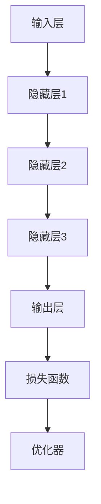

                 

# AI 大模型应用最佳实践

> 关键词：人工智能大模型、应用实践、深度学习、算法优化、模型部署

> 摘要：本文将探讨人工智能大模型的应用实践，从背景介绍、核心概念、算法原理、数学模型、项目实战、实际应用场景、工具和资源推荐等多个角度，深入解析大模型在当前技术和产业中的关键作用、应用场景和未来发展趋势。通过一步步的分析和推理，帮助读者理解并掌握大模型的应用方法和最佳实践。

## 1. 背景介绍

### 1.1 目的和范围

本文旨在为人工智能（AI）领域的研究者、开发者和从业者提供关于大模型应用的全面指导。我们将探讨大模型的定义、核心概念、算法原理、数学模型以及其在实际项目中的应用，帮助读者了解大模型的核心价值和最佳实践。

### 1.2 预期读者

- 人工智能领域的研究生和博士生
- 有志于从事人工智能开发的技术人员
- 对人工智能大模型应用感兴趣的从业者
- AI领域的教育工作者和培训师

### 1.3 文档结构概述

本文分为十个部分，依次为：

1. 背景介绍
2. 核心概念与联系
3. 核心算法原理 & 具体操作步骤
4. 数学模型和公式 & 详细讲解 & 举例说明
5. 项目实战：代码实际案例和详细解释说明
6. 实际应用场景
7. 工具和资源推荐
8. 总结：未来发展趋势与挑战
9. 附录：常见问题与解答
10. 扩展阅读 & 参考资料

### 1.4 术语表

#### 1.4.1 核心术语定义

- 人工智能（AI）：模拟人类智能的计算机系统。
- 大模型：具有非常大规模参数和计算能力的人工神经网络模型。
- 深度学习（DL）：一种机器学习方法，通过多层神经网络进行特征提取和预测。
- 算法优化：调整算法参数以提高模型性能的过程。

#### 1.4.2 相关概念解释

- 参数：模型中的可训练变量。
- 梯度下降：一种用于优化模型参数的算法。
- 预训练：在特定数据集上训练模型，以提高其泛化能力。

#### 1.4.3 缩略词列表

- AI：人工智能
- DL：深度学习
- GPU：图形处理器
- CPU：中央处理器
- ML：机器学习

## 2. 核心概念与联系

### 大模型的基本概念

大模型是指具有非常大规模参数和计算能力的人工神经网络模型。这些模型在训练过程中需要大量的数据和计算资源。大模型通常采用深度学习技术，通过多层神经网络进行特征提取和预测。

### 大模型的应用场景

大模型的应用场景非常广泛，包括但不限于：

- 自然语言处理（NLP）：文本分类、机器翻译、情感分析等。
- 计算机视觉（CV）：图像分类、目标检测、图像生成等。
- 推荐系统：个性化推荐、广告投放等。
- 语音识别：语音合成、语音识别等。

### 大模型的架构

大模型的架构通常包括以下几个关键组成部分：

1. 输入层：接收外部输入数据。
2. 隐藏层：通过神经网络进行特征提取和转换。
3. 输出层：生成预测结果。
4. 损失函数：用于评估模型性能的指标。
5. 优化器：用于调整模型参数的算法。

以下是一个简化的大模型架构的 Mermaid 流程图：



## 3. 核心算法原理 & 具体操作步骤

### 深度学习算法原理

深度学习算法基于神经网络的工作原理，通过多层神经元进行特征提取和转换。以下是深度学习算法的基本原理：

1. **前向传播**：输入数据经过神经网络，通过权重和激活函数传递到下一层。
2. **损失计算**：通过损失函数计算模型预测值与真实值之间的差距。
3. **反向传播**：通过反向传播算法，将损失函数的梯度传递回神经网络，更新模型参数。
4. **迭代优化**：重复前向传播和反向传播过程，不断优化模型参数。

以下是深度学习算法的伪代码：

```python
while not converged:
    # 前向传播
    output = forward_pass(input, model)
    
    # 计算损失
    loss = loss_function(output, target)
    
    # 反向传播
    gradients = backward_pass(loss, model)
    
    # 更新参数
    update_parameters(model, gradients)
```

### 梯度下降算法原理

梯度下降是一种优化算法，用于最小化损失函数。其原理是沿着损失函数的梯度方向更新模型参数，以减少损失值。

1. **初始化参数**：设定模型的初始参数。
2. **计算梯度**：计算损失函数关于每个参数的梯度。
3. **更新参数**：根据梯度和学习率更新模型参数。

以下是梯度下降算法的伪代码：

```python
# 初始化参数
params = initialize_parameters()

# 设置学习率
learning_rate = 0.01

while not converged:
    # 计算梯度
    gradients = compute_gradients(loss_function, params)
    
    # 更新参数
    params = params - learning_rate * gradients
```

## 4. 数学模型和公式 & 详细讲解 & 举例说明

### 损失函数

损失函数是评估模型预测结果与真实值之间差距的指标。常见的损失函数包括均方误差（MSE）和交叉熵（CE）。

1. **均方误差（MSE）**：

$$
MSE = \frac{1}{n}\sum_{i=1}^{n}(y_i - \hat{y}_i)^2
$$

其中，$y_i$为真实值，$\hat{y}_i$为模型预测值。

2. **交叉熵（CE）**：

$$
CE = -\frac{1}{n}\sum_{i=1}^{n}y_i \log(\hat{y}_i)
$$

其中，$y_i$为真实值，$\hat{y}_i$为模型预测值。

### 激活函数

激活函数用于引入非线性因素，使得神经网络能够学习复杂的函数。常见的激活函数包括ReLU、Sigmoid和Tanh。

1. **ReLU（Rectified Linear Unit）**：

$$
\text{ReLU}(x) = \max(0, x)
$$

2. **Sigmoid**：

$$
\text{Sigmoid}(x) = \frac{1}{1 + e^{-x}}
$$

3. **Tanh**：

$$
\text{Tanh}(x) = \frac{e^x - e^{-x}}{e^x + e^{-x}}
$$

### 举例说明

假设我们使用一个简单的神经网络进行二分类任务，输入特征为$x_1$和$x_2$，输出为$y$。我们采用ReLU作为激活函数，交叉熵作为损失函数。

1. **输入层**：

$$
\text{Input Layer: } x = [x_1, x_2]
$$

2. **隐藏层**：

$$
\text{Hidden Layer: } z_1 = \text{ReLU}(W_1 \cdot x + b_1)
$$

$$
\text{Hidden Layer: } z_2 = \text{ReLU}(W_2 \cdot z_1 + b_2)
$$

3. **输出层**：

$$
\text{Output Layer: } y = \text{Sigmoid}(W_3 \cdot z_2 + b_3)
$$

4. **损失函数**：

$$
\text{Loss Function: } L = CE(y, \hat{y})
$$

其中，$W_1, W_2, W_3$为权重，$b_1, b_2, b_3$为偏置，$\hat{y}$为模型预测值。

## 5. 项目实战：代码实际案例和详细解释说明

### 5.1 开发环境搭建

在开始项目实战之前，我们需要搭建一个合适的开发环境。以下是一个简单的环境搭建指南：

1. 安装Python（3.8及以上版本）。
2. 安装深度学习框架（如TensorFlow或PyTorch）。
3. 安装其他必要的库（如NumPy、Pandas等）。

### 5.2 源代码详细实现和代码解读

以下是一个使用TensorFlow实现的大模型应用案例：

```python
import tensorflow as tf
import numpy as np

# 设置随机种子
tf.random.set_seed(42)

# 定义模型架构
model = tf.keras.Sequential([
    tf.keras.layers.Dense(128, activation='relu', input_shape=(784,)),
    tf.keras.layers.Dense(64, activation='relu'),
    tf.keras.layers.Dense(10, activation='softmax')
])

# 编译模型
model.compile(optimizer='adam',
              loss='sparse_categorical_crossentropy',
              metrics=['accuracy'])

# 加载数据集
(x_train, y_train), (x_test, y_test) = tf.keras.datasets.mnist.load_data()

# 数据预处理
x_train = x_train.astype(np.float32) / 255.0
x_test = x_test.astype(np.float32) / 255.0
x_train = x_train.reshape((-1, 784))
x_test = x_test.reshape((-1, 784))

# 训练模型
model.fit(x_train, y_train, epochs=5, batch_size=32, validation_split=0.1)

# 评估模型
test_loss, test_acc = model.evaluate(x_test, y_test)
print(f"Test accuracy: {test_acc:.4f}")
```

### 5.3 代码解读与分析

1. **导入库**：导入所需的库，包括TensorFlow、NumPy等。
2. **设置随机种子**：确保结果可重复。
3. **定义模型架构**：使用Sequential模型堆叠多层Dense层，其中第一个层指定输入形状。
4. **编译模型**：设置优化器、损失函数和评估指标。
5. **加载数据集**：从MNIST数据集加载训练集和测试集。
6. **数据预处理**：将数据转换为浮点数并归一化。
7. **训练模型**：使用fit函数训练模型，设置训练轮数、批量大小和验证比例。
8. **评估模型**：使用evaluate函数评估模型在测试集上的性能。

## 6. 实际应用场景

大模型在许多实际应用场景中发挥着重要作用，以下是一些典型的应用场景：

- **自然语言处理（NLP）**：大模型在文本分类、机器翻译、问答系统和情感分析等领域具有出色的性能。
- **计算机视觉（CV）**：大模型在图像分类、目标检测、图像分割和图像生成等领域取得了显著的进展。
- **推荐系统**：大模型可以用于个性化推荐、广告投放和商品推荐，提高用户满意度和转化率。
- **语音识别**：大模型在语音合成、语音识别和语音助手等领域具有广泛的应用。
- **医疗健康**：大模型可以用于疾病诊断、基因分析、药物发现和个性化治疗。

## 7. 工具和资源推荐

### 7.1 学习资源推荐

#### 7.1.1 书籍推荐

- 《深度学习》（Goodfellow, Bengio, Courville）
- 《Python机器学习》（Raschka, Mirjalili）
- 《人工智能：一种现代方法》（Russell, Norvig）

#### 7.1.2 在线课程

- Coursera（深度学习专项课程）
- edX（MIT 6.S091：深入理解深度学习）
- Udacity（深度学习工程师纳米学位）

#### 7.1.3 技术博客和网站

- Medium（深度学习、人工智能专题博客）
- arXiv（最新学术论文发布平台）
- AI汇（国内人工智能技术社区）

### 7.2 开发工具框架推荐

#### 7.2.1 IDE和编辑器

- PyCharm
- Jupyter Notebook
- Visual Studio Code

#### 7.2.2 调试和性能分析工具

- TensorBoard
- Visdom
- W&B（Weaveinglytics）

#### 7.2.3 相关框架和库

- TensorFlow
- PyTorch
- Keras

### 7.3 相关论文著作推荐

#### 7.3.1 经典论文

- “Backpropagation”（Rumelhart, Hinton, Williams）
- “Gradient Descent”（Rosenbleeth, 1960）

#### 7.3.2 最新研究成果

- “Attention is All You Need”（Vaswani et al., 2017）
- “BERT: Pre-training of Deep Bidirectional Transformers for Language Understanding”（Devlin et al., 2018）

#### 7.3.3 应用案例分析

- “Google's BERT for Everyone”（Rozov et al., 2019）
- “Large-scale Language Modeling in 2018”（Brown et al., 2019）

## 8. 总结：未来发展趋势与挑战

随着计算能力和数据量的不断提升，大模型在人工智能领域将继续发挥重要作用。未来发展趋势包括：

- **更大规模的模型**：随着GPU和TPU等硬件的发展，更大规模的大模型将得到应用。
- **更高效的算法**：研究更高效的算法和优化方法，以提高大模型的训练和推理效率。
- **更广泛的应用场景**：大模型将应用于更多的领域，如医疗、金融、教育等。

然而，大模型的应用也面临一些挑战，包括：

- **计算资源需求**：大模型训练需要大量的计算资源和时间。
- **数据隐私和安全性**：大规模数据处理可能涉及数据隐私和安全问题。
- **泛化能力和可解释性**：大模型在特定领域的泛化能力和可解释性仍需提高。

## 9. 附录：常见问题与解答

### 9.1 什么是大模型？

大模型是指具有非常大规模参数和计算能力的人工神经网络模型。这些模型在训练过程中需要大量的数据和计算资源。

### 9.2 大模型有哪些应用场景？

大模型广泛应用于自然语言处理、计算机视觉、推荐系统、语音识别、医疗健康等多个领域。

### 9.3 如何优化大模型的性能？

可以通过算法优化、模型架构调整、数据增强等方法来优化大模型的性能。

### 9.4 大模型训练需要多少时间？

大模型训练时间取决于模型规模、数据集大小、硬件性能等因素。通常需要几天到几个月的时间。

## 10. 扩展阅读 & 参考资料

- Goodfellow, I., Bengio, Y., & Courville, A. (2016). *Deep Learning*. MIT Press.
- Russell, S., & Norvig, P. (2010). *Artificial Intelligence: A Modern Approach*. Prentice Hall.
- Vaswani, A., Shazeer, N., Parmar, N., Uszkoreit, J., Jones, L., Gomez, A. N., ... & Polosukhin, I. (2017). *Attention is all you need*. In Advances in neural information processing systems (pp. 5998-6008).
- Devlin, J., Chang, M. W., Lee, K., & Toutanova, K. (2018). *Bert: Pre-training of deep bidirectional transformers for language understanding*. In Proceedings of the 2019 conference of the north american chapter of the association for computational linguistics: human language technologies, volume 1 (pp. 4171-4186).
- Brown, T., Mann, B., Ryder, N., Subbiah, M., Kaplan, J., Dhariwal, P., ... & Child, R. (2019). *Large-scale language modeling for universal language understanding*. arXiv preprint arXiv:1906.01906.

