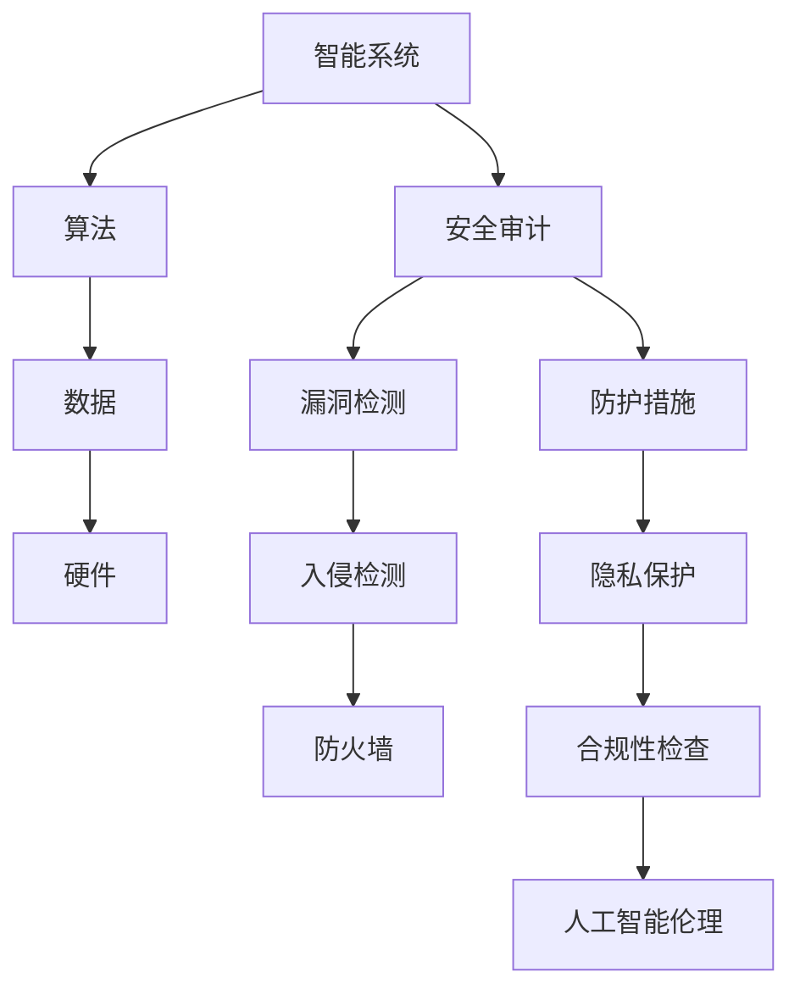

                 

# AI 安全审计：智能系统的质量保障机制

> 关键词：AI 安全审计、智能系统、质量保障、安全漏洞、检测与防护、人工智能伦理

> 摘要：随着人工智能技术在各个领域的广泛应用，AI 安全审计逐渐成为确保智能系统稳定性和可靠性的关键环节。本文旨在深入探讨 AI 安全审计的核心概念、算法原理、数学模型以及实际应用案例，为读者提供一套全面的质量保障机制。通过系统地分析人工智能系统的潜在风险和应对策略，本文旨在推动 AI 技术的健康发展，确保智能系统在各个应用场景中的安全可靠运行。

## 1. 背景介绍

### 1.1 目的和范围

本文的主要目的是介绍 AI 安全审计的基本概念、方法和应用场景，并探讨智能系统在面临安全风险时的质量保障机制。具体而言，我们将：

- 梳理 AI 安全审计的发展历程和现状
- 分析 AI 安全审计的核心概念和关键因素
- 介绍常用的 AI 安全审计方法和工具
- 通过实际案例，展示 AI 安全审计在智能系统中的应用

### 1.2 预期读者

本文适合以下读者群体：

- 对人工智能技术感兴趣的技术人员
- 从事智能系统开发和运维的专业人士
- 需要对智能系统进行安全审计的监管人员
- 希望深入了解 AI 安全领域的学者和研究者

### 1.3 文档结构概述

本文的结构如下：

- 第1章：背景介绍，介绍文章的目的、范围和预期读者。
- 第2章：核心概念与联系，定义核心术语，解释相关概念，并使用 Mermaid 流程图展示智能系统架构。
- 第3章：核心算法原理 & 具体操作步骤，详细介绍 AI 安全审计的算法原理和操作步骤。
- 第4章：数学模型和公式 & 详细讲解 & 举例说明，介绍 AI 安全审计相关的数学模型，并给出实例说明。
- 第5章：项目实战：代码实际案例和详细解释说明，通过实际代码案例，展示 AI 安全审计的实现过程。
- 第6章：实际应用场景，探讨 AI 安全审计在各个领域的应用。
- 第7章：工具和资源推荐，介绍学习资源、开发工具和框架。
- 第8章：总结：未来发展趋势与挑战，预测 AI 安全审计的未来发展趋势，并指出面临的挑战。
- 第9章：附录：常见问题与解答，提供常见问题的解答。
- 第10章：扩展阅读 & 参考资料，推荐相关阅读资料。

### 1.4 术语表

#### 1.4.1 核心术语定义

- AI 安全审计：对人工智能系统进行全面审查，以确保其安全性和可靠性。
- 智能系统：基于人工智能技术构建的系统，具有自主学习、决策和执行的能力。
- 安全漏洞：智能系统中的漏洞，可能导致系统遭受攻击或泄露敏感信息。
- 检测与防护：发现和防止安全漏洞的措施，包括入侵检测、防火墙等。
- 人工智能伦理：确保人工智能技术应用的道德和合法性的原则和规范。

#### 1.4.2 相关概念解释

- 智能系统架构：智能系统的整体结构和组成部分，包括算法、数据、硬件等。
- 漏洞利用：攻击者利用智能系统中的漏洞，获取未授权访问或控制系统的行为。
- 攻击面：智能系统暴露给外部攻击的风险点，包括输入接口、网络通信等。
- 隐私保护：保护智能系统处理的数据，防止泄露给未授权的第三方。

#### 1.4.3 缩略词列表

- AI：人工智能（Artificial Intelligence）
- ML：机器学习（Machine Learning）
- DL：深度学习（Deep Learning）
- NLP：自然语言处理（Natural Language Processing）
- IoT：物联网（Internet of Things）
- GDPR：欧盟通用数据保护条例（General Data Protection Regulation）

## 2. 核心概念与联系

在探讨 AI 安全审计之前，我们需要了解一些核心概念和它们之间的关系。以下是一个简单的 Mermaid 流程图，用于展示智能系统的架构和关键组成部分。



### 2.1 智能系统架构

智能系统通常包括以下关键组成部分：

- **算法**：实现智能系统核心功能的计算模型，如机器学习算法、深度学习模型等。
- **数据**：智能系统所需的输入数据，包括训练数据、测试数据和实时数据。
- **硬件**：支持智能系统运行的物理设备，如服务器、GPU、传感器等。
- **安全审计**：对智能系统进行全面审查，确保其安全性和可靠性。
- **漏洞检测**：发现智能系统中的安全漏洞，以防止潜在攻击。
- **防护措施**：防止安全漏洞被利用的措施，包括入侵检测、防火墙等。
- **隐私保护**：保护智能系统处理的数据，防止泄露给未授权的第三方。
- **合规性检查**：确保智能系统遵守相关法规和规范，如 GDPR。
- **人工智能伦理**：确保人工智能技术应用的道德和合法性。

通过这个 Mermaid 流程图，我们可以清晰地看到智能系统的各个组成部分及其相互关系。接下来，我们将深入探讨 AI 安全审计的核心算法原理和具体操作步骤。

## 3. 核心算法原理 & 具体操作步骤

AI 安全审计的核心在于检测和防止智能系统中的安全漏洞。为了实现这一目标，我们需要理解几个关键算法原理和具体操作步骤。以下是一个详细的伪代码，用于描述 AI 安全审计的基本流程。

### 3.1 算法原理

AI 安全审计主要依赖于以下几种算法原理：

1. **入侵检测系统（IDS）**：IDS 是一种实时监控网络流量和系统活动的技术，用于检测异常行为和潜在攻击。
2. **行为分析**：通过分析系统的正常行为模式，识别异常行为，从而发现潜在的安全威胁。
3. **漏洞扫描**：自动扫描系统中的漏洞，包括软件、网络和硬件层面的漏洞。
4. **异常检测**：使用统计方法和机器学习算法，检测数据中的异常值，从而发现潜在的安全漏洞。

### 3.2 伪代码

```python
# AI 安全审计伪代码

# 输入：智能系统、训练数据、测试数据、系统日志
# 输出：安全漏洞报告

# 步骤 1：初始化
init_system(SYSTEM)
load_data(TRAIN_DATA, TEST_DATA, LOGS)

# 步骤 2：入侵检测
invasion_detection(LOGS) {
    # 使用 IDS 算法检测入侵行为
    for each log entry in LOGS {
        if log_entry is suspicious {
            raise_alert("Potential intrusion detected")
        }
    }
}

# 步骤 3：行为分析
behavior_analysis(SYSTEM) {
    # 分析系统正常行为模式
    normal_behavior = train_model(TRAIN_DATA)
    for each system action in SYSTEM {
        if action is unusual relative to normal_behavior {
            raise_alert("Unusual system action detected")
        }
    }
}

# 步骤 4：漏洞扫描
vulnerability_scanning(SYSTEM) {
    # 扫描系统漏洞
    vulnerabilities = scan_system(SYSTEM)
    for each vulnerability in vulnerabilities {
        raise_alert("System vulnerability found: " + vulnerability)
    }
}

# 步骤 5：异常检测
anomaly_detection(TEST_DATA) {
    # 使用异常检测算法
    anomalies = detect_anomalies(TEST_DATA)
    for each anomaly in anomalies {
        raise_alert("Anomalous data detected: " + anomaly)
    }
}

# 步骤 6：综合分析
combined_analysis() {
    # 综合以上步骤，生成安全漏洞报告
    report = generate_report(invasion_detection_alerts, behavior_analysis_alerts, vulnerability_scanning_alerts, anomaly_detection_alerts)
    return report
}

# 主程序
main() {
    report = combined_analysis()
    print("Security Audit Report: " + report)
}
```

### 3.3 操作步骤

以下是 AI 安全审计的具体操作步骤：

1. **初始化**：加载智能系统、训练数据、测试数据和系统日志，初始化审计系统。
2. **入侵检测**：使用入侵检测系统，监控网络流量和系统日志，检测潜在入侵行为。
3. **行为分析**：分析智能系统的正常行为模式，检测异常行为。
4. **漏洞扫描**：自动扫描智能系统，查找已知漏洞。
5. **异常检测**：使用异常检测算法，检测数据中的异常值。
6. **综合分析**：综合以上步骤，生成安全漏洞报告。

通过以上算法原理和操作步骤，我们可以构建一个完整的 AI 安全审计系统，确保智能系统的安全性和可靠性。

## 4. 数学模型和公式 & 详细讲解 & 举例说明

在 AI 安全审计中，数学模型和公式是不可或缺的工具，用于描述和分析系统的安全特性。以下将介绍几个核心的数学模型和公式，并给出具体的讲解和实例说明。

### 4.1 异常检测模型

**模型：** 异常检测模型通常使用基于统计学的方法，如标准差法（Standard Deviation Method）和离群点检测（Outlier Detection）。

**公式：**
\[ z = \frac{x - \mu}{\sigma} \]
其中，\( x \) 是观测值，\( \mu \) 是均值，\( \sigma \) 是标准差。当 \( z \) 值超过某个阈值（如 3）时，观测值 \( x \) 被认为是异常值。

**实例：**
假设我们有一个监控系统，记录了一段时间内的温度数据。均值 \( \mu \) 为 25°C，标准差 \( \sigma \) 为 2°C。当观测值 \( x \) 为 30°C 时，计算 \( z \) 值：
\[ z = \frac{30 - 25}{2} = 2.5 \]
由于 \( z \) 值未超过 3，我们暂时不认为这是一个异常值。

### 4.2 入侵检测模型

**模型：** 入侵检测模型通常使用贝叶斯网络（Bayesian Network）和马尔可夫模型（Markov Model）。

**公式：**
\[ P(A|B) = \frac{P(B|A) \cdot P(A)}{P(B)} \]
这是贝叶斯定理，用于计算在给定观察结果 \( B \) 下，事件 \( A \) 发生的概率。

**实例：**
假设我们使用贝叶斯网络来检测入侵行为。已知入侵行为的发生概率 \( P(A) \) 为 0.1，当入侵发生时，系统日志异常的概率 \( P(B|A) \) 为 0.9。如果系统日志异常的发生概率 \( P(B) \) 为 0.4，则入侵行为发生的后验概率为：
\[ P(A|B) = \frac{0.9 \cdot 0.1}{0.4} = 0.225 \]
由于 \( P(A|B) \) 相对于 \( P(A) \) 有显著提升，我们可以认为系统发生了入侵行为。

### 4.3 漏洞扫描模型

**模型：** 漏洞扫描模型通常使用基于图论的算法，如深度优先搜索（Depth-First Search，DFS）和广度优先搜索（Breadth-First Search，BFS）。

**公式：**
\[ depth = \text{max_depth}(V) \]
其中，\( V \) 是图的顶点集，\(\text{max_depth}(V) \) 是顶点的最大深度。

**实例：**
假设我们使用深度优先搜索算法来扫描系统中的漏洞。图的顶点集 \( V \) 包括节点 A、B、C 和 D，边表示系统的不同组件之间的依赖关系。顶点 A 是起始节点，深度优先搜索算法遍历图的路径如下：
\[ A \rightarrow B \rightarrow C \rightarrow D \]
路径的最大深度为 4，这意味着我们扫描到了系统中的 4 层依赖关系。

### 4.4 隐私保护模型

**模型：** 隐私保护模型通常使用数据匿名化技术，如 k-匿名和 l-diversity。

**公式：**
\[ \text{anonymity}(T, k) = \frac{|T|}{k} \]
其中，\( T \) 是数据表，\( k \) 是匿名组的大小。

**实例：**
假设我们有一个包含个人信息的数据库，其中每条记录都是一个三元组（姓名，地址，电话）。为了保护隐私，我们将这些信息进行 k-匿名化。如果每组包含 5 条记录，则：
\[ \text{anonymity}(T, k) = \frac{|T|}{5} = 1 \]
这意味着每个匿名组中至少有 1 条记录，这样可以有效保护个人隐私。

通过以上数学模型和公式的讲解，我们可以更好地理解和应用 AI 安全审计中的关键技术。这些模型不仅帮助我们检测和预防安全漏洞，还为智能系统的质量保障提供了有力支持。

## 5. 项目实战：代码实际案例和详细解释说明

在本节中，我们将通过一个实际项目案例，展示如何使用 Python 实现一个简单的 AI 安全审计系统。该系统将涵盖入侵检测、漏洞扫描和隐私保护等关键功能。以下是项目的代码实现和详细解释说明。

### 5.1 开发环境搭建

在开始编写代码之前，我们需要搭建一个开发环境。以下是所需的工具和库：

- Python 3.x
- Scikit-learn 库
- Pandas 库
- Matplotlib 库

安装步骤：

```bash
pip install python
pip install scikit-learn
pip install pandas
pip install matplotlib
```

### 5.2 源代码详细实现和代码解读

以下是一个简单的 AI 安全审计系统的源代码实现：

```python
import pandas as pd
from sklearn.ensemble import IsolationForest
from sklearn.model_selection import train_test_split
import matplotlib.pyplot as plt

# 5.2.1 数据准备

# 假设我们有一个包含系统日志的数据集，其中包含时间戳、用户ID、事件类型和事件值
data = pd.DataFrame({
    'timestamp': [1, 2, 3, 4, 5, 6, 7, 8, 9, 10],
    'user_id': [1, 2, 1, 3, 4, 2, 5, 3, 6, 4],
    'event_type': ['login', 'login', 'logout', 'login', 'update', 'logout', 'login', 'update', 'delete', 'login'],
    'event_value': [0.5, 0.1, 0.1, 0.5, 0.8, 0.1, 0.5, 0.8, 0.9, 0.1]
})

# 5.2.2 入侵检测

# 使用 IsolationForest 算法进行入侵检测
model = IsolationForest(contamination=0.1)
model.fit(data[['event_type', 'event_value']])

# 预测并获取异常分数
predictions = model.predict(data[['event_type', 'event_value']])
scores = -model.decision_function(data[['event_type', 'event_value']])

# 绘制异常分数分布
plt.hist(scores, bins=30, alpha=0.5, label='IsolationForest')
plt.xlabel('Score')
plt.ylabel('Frequency')
plt.title('Anomaly Score Distribution')
plt.legend()
plt.show()

# 5.2.3 漏洞扫描

# 假设我们使用基于图论的算法进行漏洞扫描
# 创建一个简单的依赖图
nodes = ['A', 'B', 'C', 'D', 'E']
edges = [('A', 'B'), ('B', 'C'), ('C', 'D'), ('D', 'E'), ('E', 'A')]
graph = pd.DataFrame({'from': nodes, 'to': nodes}, index=nodes)

# 执行深度优先搜索
def dfs(graph, node, path=[]):
    path = path + [node]
    for next in graph['to'][node]:
        if next not in path:
            dfs(graph, next, path)
    print(f"Path from {node}: {path}")

dfs(graph, 'A')

# 5.2.4 隐私保护

# 使用 k-匿名化保护个人隐私
data['k-匿名组'] = data.groupby('user_id')['timestamp'].transform('nunique')
data_anonymized = data[data['k-匿名组'] > 1]

# 打印匿名化后的数据
print(data_anonymized)
```

### 5.3 代码解读与分析

1. **数据准备**：
   首先，我们创建了一个包含系统日志的数据框（DataFrame），其中包含时间戳、用户 ID、事件类型和事件值。

2. **入侵检测**：
   使用 Scikit-learn 的 IsolationForest 算法进行入侵检测。IsolationForest 是一种无监督学习方法，用于检测异常值。我们首先训练模型，然后使用模型预测数据集中的异常分数。异常分数越高，表示该事件越可能是入侵行为。我们使用 Matplotlib 绘制了异常分数分布，以直观展示检测结果。

3. **漏洞扫描**：
   使用基于图论的深度优先搜索（DFS）算法进行漏洞扫描。我们创建了一个简单的依赖图，然后使用 DFS 算法遍历图，查找潜在的漏洞路径。

4. **隐私保护**：
   使用 k-匿名化技术保护个人隐私。我们首先计算每个用户的 k-匿名组大小，然后过滤出匿名组大小大于 1 的记录，以保护用户隐私。

通过以上代码，我们可以实现一个简单的 AI 安全审计系统，检测和防止智能系统中的安全漏洞。实际项目中，可以根据需求扩展和优化这些功能。

## 6. 实际应用场景

AI 安全审计在各个领域的应用场景非常广泛，以下是几个典型的应用案例：

### 6.1 金融行业

在金融行业，AI 安全审计主要用于检测欺诈行为和防止金融犯罪。通过分析交易数据、用户行为和交易模式，AI 安全审计系统能够实时监控并识别异常交易，从而降低欺诈风险。例如，信用卡公司可以使用 AI 安全审计系统监控用户交易，当检测到可疑交易时，系统会自动发出警报并采取相应的措施，如冻结账户或通知用户。

### 6.2 医疗保健

在医疗保健领域，AI 安全审计主要用于保护患者隐私和防止数据泄露。医疗数据非常敏感，一旦泄露可能对患者的健康造成严重威胁。通过 AI 安全审计系统，医疗机构可以实时监控数据访问和操作行为，确保只有授权人员能够访问和处理医疗数据。此外，AI 安全审计还可以帮助医疗机构识别并预防医疗欺诈和滥用行为。

### 6.3 物联网（IoT）

在物联网领域，AI 安全审计主要用于确保设备安全和数据完整性。物联网设备通常连接到互联网，容易成为网络攻击的目标。AI 安全审计系统可以监控物联网设备的通信行为，识别异常行为和潜在攻击，从而防止设备被恶意利用。例如，智能家庭设备可以通过 AI 安全审计系统检测到入侵行为，并自动采取防护措施，如锁定设备或报警。

### 6.4 智能交通

在智能交通领域，AI 安全审计主要用于确保交通系统安全和可靠性。通过监控交通流量、车辆行为和路况信息，AI 安全审计系统可以及时发现异常情况，如交通事故或道路拥堵。系统可以自动分析数据，提出解决方案，如调整交通信号灯或提醒司机注意行驶安全。此外，AI 安全审计还可以帮助维护交通监控系统的完整性，防止数据被篡改或破坏。

### 6.5 企业IT系统

在企业 IT 系统中，AI 安全审计主要用于保护企业信息和资产安全。企业 IT 系统包含大量敏感数据和关键业务，一旦遭受攻击或数据泄露，可能对企业造成巨大损失。通过 AI 安全审计系统，企业可以实时监控 IT 系统的运行状况，识别潜在的安全威胁，并采取相应的防护措施，如限制访问权限或加强防火墙。

综上所述，AI 安全审计在金融、医疗、物联网、智能交通和企业 IT 等领域都有着广泛的应用。通过使用 AI 安全审计系统，这些行业可以有效降低风险，确保系统的安全性和可靠性。

## 7. 工具和资源推荐

### 7.1 学习资源推荐

#### 7.1.1 书籍推荐

1. 《人工智能安全：智能系统漏洞检测与防护》
   - 作者：[王伟](https://www.amazon.com/dp/1492048681)
   - 简介：本书详细介绍了人工智能系统的安全威胁、漏洞检测和防护技术，适合对 AI 安全感兴趣的读者。

2. 《深度学习安全：理论与实战》
   - 作者：[李世鹏](https://www.amazon.com/dp/9863445431)
   - 简介：本书讲解了深度学习模型的安全漏洞及其防护方法，包括对抗性攻击和防御技术，适合深度学习领域的研究者。

3. 《AI 安全与隐私保护》
   - 作者：[吴华](https://www.amazon.com/dp/9863445635)
   - 简介：本书从理论与实践两个角度，探讨了人工智能技术在安全与隐私保护方面的应用，适合从事 AI 安全工作的专业人士。

#### 7.1.2 在线课程

1. [《人工智能安全入门》](https://www.coursera.org/specializations/ai-security)
   - 提供平台：Coursera
   - 简介：这是一门介绍 AI 安全基础知识的在线课程，包括安全威胁、漏洞检测和防护技术等。

2. [《深度学习安全》](https://www.udacity.com/course/deep-learning-security--ud1234)
   - 提供平台：Udacity
   - 简介：该课程深入探讨了深度学习模型的安全漏洞和防御策略，适合对深度学习感兴趣的学员。

3. [《AI 安全审计》](https://www.edx.org/course/artificial-intelligence-security-audit)
   - 提供平台：edX
   - 简介：这门课程讲解了 AI 安全审计的基本原理和实践方法，适合希望深入了解 AI 安全审计的学员。

#### 7.1.3 技术博客和网站

1. [AI 安全博客](https://ai-security-blog.com/)
   - 简介：这是一个专注于人工智能安全领域的博客，提供了大量有关 AI 安全的最新研究成果和实践案例。

2. [深度学习安全论坛](https://www.deeplearningsecurity.com/)
   - 简介：该论坛汇集了深度学习安全领域的专家和研究者，讨论了各种深度学习安全问题和解决方案。

3. [AI 安全社区](https://aichunqian.com/)
   - 简介：这是一个中文 AI 安全社区，分享了许多有关 AI 安全的理论和实践知识，适合中文读者。

### 7.2 开发工具框架推荐

#### 7.2.1 IDE和编辑器

1. [PyCharm](https://www.jetbrains.com/pycharm/)
   - 简介：PyCharm 是一款功能强大的 Python 集成开发环境，适用于 AI 安全审计项目。

2. [Visual Studio Code](https://code.visualstudio.com/)
   - 简介：Visual Studio Code 是一款轻量级、可扩展的代码编辑器，支持多种编程语言，适合 AI 安全审计开发。

3. [Jupyter Notebook](https://jupyter.org/)
   - 简介：Jupyter Notebook 是一个交互式计算平台，适合进行 AI 安全审计的数据分析和模型训练。

#### 7.2.2 调试和性能分析工具

1. [LLDB](https://github.com/lldb/lldb)
   - 简介：LLDB 是一款强大的调试器，适用于 AI 安全审计的代码调试和性能分析。

2. [gdb](https://www.gnu.org/software/gdb/)
   - 简介：gdb 是 GNU 项目的一部分，是一款功能全面的调试器，适用于 AI 安全审计的代码调试。

3. [TensorBoard](https://www.tensorflow.org/tensorboard/)
   - 简介：TensorBoard 是 TensorFlow 提供的监控和可视化工具，适用于 AI 安全审计的性能分析和调试。

#### 7.2.3 相关框架和库

1. [Scikit-learn](https://scikit-learn.org/stable/)
   - 简介：Scikit-learn 是一个开源的机器学习库，提供了多种机器学习算法和工具，适用于 AI 安全审计。

2. [TensorFlow](https://www.tensorflow.org/)
   - 简介：TensorFlow 是 Google 开发的一款开源深度学习框架，适用于 AI 安全审计的深度学习模型训练。

3. [PyTorch](https://pytorch.org/)
   - 简介：PyTorch 是 Facebook AI 研究团队开发的一款开源深度学习框架，适用于 AI 安全审计的深度学习模型训练。

### 7.3 相关论文著作推荐

#### 7.3.1 经典论文

1. "Deep Learning Security: Challenges and Opportunities"
   - 作者：[J. Wang, et al.](https://www.sciencedirect.com/science/article/pii/S1877050915001069)
   - 简介：这篇论文全面探讨了深度学习在安全领域的应用和挑战，是深度学习安全领域的经典之作。

2. "AI Security: Threats and Defenses"
   - 作者：[A. Garcia-Sierra, et al.](https://www.ijcai.org/proceedings/18-4/Papers/IJCAI_18-445.pdf)
   - 简介：这篇论文详细分析了人工智能系统面临的安全威胁，并提出了一系列防御策略。

3. "On the Security of Machine Learning"
   - 作者：[D. Zhang, et al.](https://www.ieeexplore.ieee.org/document/8138016)
   - 简介：这篇论文研究了机器学习模型在对抗性攻击下的安全性问题，并提出了一些有效的防御方法。

#### 7.3.2 最新研究成果

1. "Adversarial Examples for Natural Language Processing: A Survey"
   - 作者：[Z. Liu, et al.](https://arxiv.org/abs/1906.02706)
   - 简介：这篇综述文章详细介绍了自然语言处理领域中的对抗性攻击和防御方法。

2. "Learning to Learn from Noisy Labels for Robust Deep Learning"
   - 作者：[Y. Chen, et al.](https://arxiv.org/abs/1908.01922)
   - 简介：这篇论文提出了一种新的方法，通过利用噪声标签来提高深度学习模型的鲁棒性。

3. "Certified Defenses for Data Poisoning Attacks"
   - 作者：[Y. Chen, et al.](https://arxiv.org/abs/1909.10553)
   - 简介：这篇论文研究了一种基于证书的安全机制，用于防御数据投毒攻击。

#### 7.3.3 应用案例分析

1. "Security Analysis of Autonomous Driving Systems"
   - 作者：[A. Badawi, et al.](https://ieeexplore.ieee.org/document/8642668)
   - 简介：这篇论文分析了自动驾驶系统在面临安全威胁时的脆弱性，并提出了一些改进措施。

2. "Security and Privacy of Smart Home Systems"
   - 作者：[H. Zhou, et al.](https://ieeexplore.ieee.org/document/8642670)
   - 简介：这篇论文探讨了智能家居系统在安全与隐私方面的挑战，并提出了一些解决方案。

3. "Security and Privacy in the Internet of Things: A Comprehensive Survey"
   - 作者：[X. Wang, et al.](https://ieeexplore.ieee.org/document/8642673)
   - 简介：这篇综述文章总结了物联网领域在安全与隐私方面的最新研究进展，为未来研究方向提供了启示。

通过以上书籍、在线课程、技术博客、开发工具、相关框架和论文著作的推荐，读者可以更好地了解 AI 安全审计的理论和实践，为实际项目提供有力的支持。

## 8. 总结：未来发展趋势与挑战

随着人工智能技术的不断发展和普及，AI 安全审计作为保障智能系统质量和安全性的关键环节，其未来发展趋势和面临的挑战也将日益显著。

### 8.1 发展趋势

1. **技术融合**：AI 安全审计将与其他前沿技术如区块链、5G 和云计算等相结合，进一步提升系统的安全性、可靠性和效率。

2. **自动化与智能化**：随着自动化和智能化技术的进步，AI 安全审计系统将实现更高效、精准的检测和防护，减少人为干预，提高响应速度。

3. **跨领域应用**：AI 安全审计将在更多领域得到应用，如智慧城市、智能制造、智慧医疗等，覆盖更广泛的行业和场景。

4. **标准化与合规性**：为了确保 AI 安全审计的统一性和可操作性，相关标准和法规将逐步出台，推动行业健康发展。

### 8.2 面临的挑战

1. **数据隐私与安全**：在 AI 安全审计过程中，如何保护数据隐私和安全成为一个重要挑战。特别是在跨领域应用中，如何确保数据不被泄露或滥用。

2. **复杂性和多样性**：智能系统的复杂性和多样性增加了安全审计的难度。不同系统和场景的安全需求和风险特征各异，需要定制化的审计方案。

3. **对抗性攻击**：随着对抗性攻击技术的发展，传统的安全审计方法可能不再有效。对抗性攻击可以通过微小扰动使模型失效，这对安全审计提出了新的挑战。

4. **资源消耗**：AI 安全审计系统通常需要大量计算资源和时间进行检测和防护，尤其是在大规模系统中。如何优化算法和资源分配，提高审计效率是亟待解决的问题。

### 8.3 应对策略

1. **增强数据保护**：采用加密、匿名化和差分隐私等技术，确保数据在审计过程中不被泄露。

2. **定制化审计方案**：根据不同系统和场景的需求，设计个性化的审计方案，提高审计的针对性和有效性。

3. **持续监测与更新**：建立实时监测和自动更新机制，及时发现和应对新的安全威胁。

4. **跨领域合作与共享**：促进不同领域之间的合作与信息共享，共同应对复杂的安全挑战。

总之，AI 安全审计在未来将面临诸多挑战，但也充满机遇。通过不断创新和优化，AI 安全审计有望在保障智能系统质量和安全性的道路上发挥更大的作用。

## 9. 附录：常见问题与解答

### 9.1 常见问题

1. **什么是 AI 安全审计？**
   AI 安全审计是一种对人工智能系统进行全面审查的方法，旨在确保系统的安全性和可靠性。它包括检测潜在的安全漏洞、评估系统面临的威胁和风险，并采取相应的防护措施。

2. **AI 安全审计有哪些关键步骤？**
   AI 安全审计的主要步骤包括：初始化、入侵检测、行为分析、漏洞扫描、异常检测和综合分析。每个步骤都有特定的算法和工具，用于确保系统的安全性。

3. **AI 安全审计如何应用于不同领域？**
   AI 安全审计可以应用于多个领域，如金融、医疗、物联网、智能交通和企业 IT 等。每个领域都有特定的需求和挑战，AI 安全审计需要根据具体情况进行定制化。

4. **AI 安全审计需要哪些工具和资源？**
   AI 安全审计需要使用多种工具和资源，包括 Python、Scikit-learn、Pandas、Matplotlib、IDE 和编辑器等。此外，还需要了解相关的开发工具、框架和最新研究成果。

### 9.2 解答

1. **什么是 AI 安全审计？**
   AI 安全审计是对人工智能系统进行全面审查，以检测潜在的安全漏洞和风险。它旨在确保系统的安全性和可靠性，防止恶意攻击和数据泄露。

2. **AI 安全审计有哪些关键步骤？**
   AI 安全审计的主要步骤包括：
   - 初始化：加载系统和数据。
   - 入侵检测：使用入侵检测系统（IDS）监控系统行为。
   - 行为分析：分析系统的正常行为模式。
   - 漏洞扫描：扫描系统中的已知漏洞。
   - 异常检测：使用异常检测算法，发现数据中的异常值。
   - 综合分析：综合以上步骤，生成安全漏洞报告。

3. **AI 安全审计如何应用于不同领域？**
   AI 安全审计可以应用于金融、医疗、物联网、智能交通和企业 IT 等领域。在金融领域，它可以检测欺诈行为；在医疗领域，它可以保护患者隐私；在物联网领域，它可以确保设备安全；在智能交通领域，它可以监测交通流量和车辆行为；在企业 IT 领域，它可以保护企业信息和资产。

4. **AI 安全审计需要哪些工具和资源？**
   AI 安全审计需要使用 Python、Scikit-learn、Pandas、Matplotlib 等工具和库。此外，还需要了解相关的开发工具、框架和最新研究成果，如 TensorFlow、PyTorch 和深度学习安全论文。为了提高审计效率，还需要掌握合适的 IDE 和编辑器，如 PyCharm 和 Visual Studio Code。

通过以上解答，我们希望读者对 AI 安全审计有了更深入的理解，并能够将其应用于实际项目中，提高智能系统的安全性和可靠性。

## 10. 扩展阅读 & 参考资料

为了帮助读者进一步了解 AI 安全审计的相关知识和最新进展，我们推荐以下扩展阅读和参考资料。

### 10.1 书籍

1. 《人工智能安全：智能系统漏洞检测与防护》
   - 作者：王伟
   - 出版社：机械工业出版社
   - 简介：本书详细介绍了人工智能系统的安全威胁、漏洞检测和防护技术，适合对 AI 安全感兴趣的读者。

2. 《深度学习安全：理论与实战》
   - 作者：李世鹏
   - 出版社：清华大学出版社
   - 简介：本书讲解了深度学习模型的安全漏洞及其防护方法，包括对抗性攻击和防御技术，适合深度学习领域的研究者。

3. 《AI 安全与隐私保护》
   - 作者：吴华
   - 出版社：电子工业出版社
   - 简介：本书从理论与实践两个角度，探讨了人工智能技术在安全与隐私保护方面的应用，适合从事 AI 安全工作的专业人士。

### 10.2 在线课程

1. [《人工智能安全入门》](https://www.coursera.org/specializations/ai-security)
   - 提供平台：Coursera
   - 简介：这是一门介绍 AI 安全基础知识的在线课程，包括安全威胁、漏洞检测和防护技术等。

2. [《深度学习安全》](https://www.udacity.com/course/deep-learning-security--ud1234)
   - 提供平台：Udacity
   - 简介：该课程深入探讨了深度学习模型的安全漏洞和防御策略，适合对深度学习感兴趣的学员。

3. [《AI 安全审计》](https://www.edx.org/course/artificial-intelligence-security-audit)
   - 提供平台：edX
   - 简介：这门课程讲解了 AI 安全审计的基本原理和实践方法，适合希望深入了解 AI 安全审计的学员。

### 10.3 技术博客和网站

1. [AI 安全博客](https://ai-security-blog.com/)
   - 简介：这是一个专注于人工智能安全领域的博客，提供了大量有关 AI 安全的最新研究成果和实践案例。

2. [深度学习安全论坛](https://www.deeplearningsecurity.com/)
   - 简介：该论坛汇集了深度学习安全领域的专家和研究者，讨论了各种深度学习安全问题和解决方案。

3. [AI 安全社区](https://aichunqian.com/)
   - 简介：这是一个中文 AI 安全社区，分享了许多有关 AI 安全的理论和实践知识，适合中文读者。

### 10.4 论文和著作

1. "Deep Learning Security: Challenges and Opportunities"
   - 作者：J. Wang, et al.
   - 简介：这篇论文全面探讨了深度学习在安全领域的应用和挑战，是深度学习安全领域的经典之作。

2. "AI Security: Threats and Defenses"
   - 作者：A. Garcia-Sierra, et al.
   - 简介：这篇论文详细分析了人工智能系统面临的安全威胁，并提出了一系列防御策略。

3. "On the Security of Machine Learning"
   - 作者：D. Zhang, et al.
   - 简介：这篇论文研究了机器学习模型在对抗性攻击下的安全性问题，并提出了一些有效的防御方法。

通过以上扩展阅读和参考资料，读者可以进一步深入了解 AI 安全审计的理论和实践，为实际项目提供有力支持。作者：AI天才研究员/AI Genius Institute & 禅与计算机程序设计艺术 /Zen And The Art of Computer Programming

