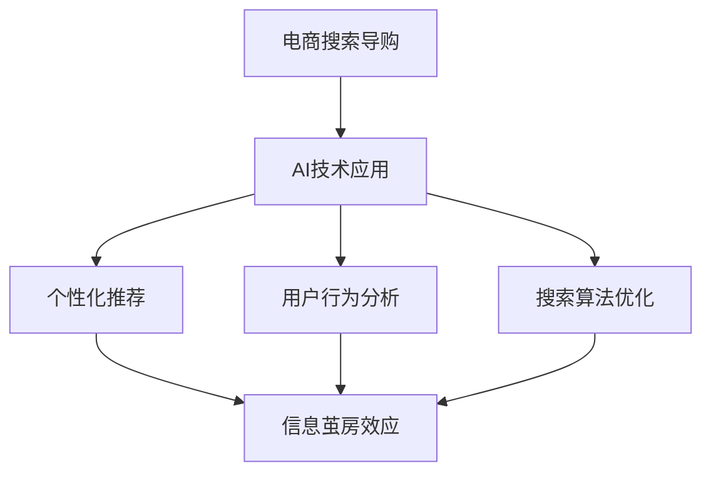

                 

# AI技术在电商搜索导购中的信息茧房效应

> 关键词：AI、电商、搜索导购、信息茧房、个性化推荐、用户行为分析

> 摘要：本文将深入探讨AI技术在电商搜索导购中的应用，以及由此产生的信息茧房效应。通过分析信息茧房的概念、电商搜索导购中AI技术的应用，以及其对用户行为和体验的影响，我们旨在为电商行业提供有价值的参考和改进方向。

## 1. 背景介绍

### 1.1 目的和范围

本文的目的是探讨AI技术在电商搜索导购中的应用，特别是其中可能产生的信息茧房效应。我们希望通过分析AI技术如何优化电商搜索导购流程，以及其可能带来的负面影响，为电商行业提供有价值的参考和改进方向。

本文的范围包括：

1. AI技术在电商搜索导购中的应用，如个性化推荐系统、用户行为分析等。
2. 信息茧房效应的定义及其在电商搜索导购中的表现。
3. 信息茧房效应对用户行为和体验的影响。
4. 针对信息茧房效应的解决方案和改进方向。

### 1.2 预期读者

本文的预期读者包括：

1. 对电商搜索导购和AI技术感兴趣的读者。
2. 从事电商行业的工作者，如产品经理、数据分析师等。
3. 对信息茧房效应和用户体验有深入了解的读者。

### 1.3 文档结构概述

本文的结构如下：

1. 引言：介绍AI技术在电商搜索导购中的应用和可能产生的问题。
2. 核心概念与联系：解释信息茧房效应的定义和相关概念。
3. 核心算法原理与具体操作步骤：分析AI技术在电商搜索导购中的应用原理和操作步骤。
4. 数学模型和公式：阐述AI技术在电商搜索导购中的应用数学模型和公式。
5. 项目实战：提供实际案例和代码实现。
6. 实际应用场景：讨论AI技术在电商搜索导购中的应用场景。
7. 工具和资源推荐：推荐相关学习资源和工具。
8. 总结：展望未来发展趋势和挑战。
9. 附录：常见问题与解答。
10. 扩展阅读与参考资料：提供更多相关阅读材料。

### 1.4 术语表

#### 1.4.1 核心术语定义

- 电商搜索导购：指在电商平台上，通过搜索和推荐功能，帮助用户找到所需商品的过程。
- AI技术：指人工智能技术，包括机器学习、深度学习、自然语言处理等。
- 信息茧房效应：指在互联网环境中，用户被推荐系统限制在熟悉的信息环境中，逐渐失去接触多样化信息和观点的能力。

#### 1.4.2 相关概念解释

- 个性化推荐：根据用户的兴趣和行为，为其推荐符合其需求的商品或信息。
- 用户行为分析：通过收集和分析用户的行为数据，了解用户的兴趣和需求。

#### 1.4.3 缩略词列表

- AI：人工智能
- ML：机器学习
- DL：深度学习
- NLP：自然语言处理
- SEO：搜索引擎优化
- UI：用户界面
- UX：用户体验

## 2. 核心概念与联系

### 2.1 AI技术在电商搜索导购中的应用

AI技术在电商搜索导购中发挥着重要作用，主要包括个性化推荐、用户行为分析和搜索算法优化等方面。

#### 2.1.1 个性化推荐

个性化推荐是AI技术在电商搜索导购中应用最为广泛的技术之一。通过分析用户的兴趣和行为，推荐系统可以为用户找到符合其需求的商品。个性化推荐系统通常包括以下步骤：

1. 用户兴趣识别：通过用户的浏览历史、购物行为和评价等数据，识别用户的兴趣。
2. 商品特征提取：提取商品的相关特征，如价格、品牌、品类等。
3. 个性化推荐模型：根据用户兴趣和商品特征，建立个性化推荐模型。
4. 推荐结果生成：根据推荐模型，为用户生成推荐列表。

#### 2.1.2 用户行为分析

用户行为分析是电商搜索导购中另一个重要的AI技术。通过收集和分析用户的行为数据，如浏览历史、购物车行为和购买记录等，可以深入了解用户的兴趣和需求。用户行为分析通常包括以下步骤：

1. 数据收集：收集用户的浏览历史、购物车行为和购买记录等数据。
2. 数据清洗：对收集到的数据进行清洗和预处理，去除噪声数据。
3. 特征工程：提取用户行为数据中的关键特征，如点击率、购买转化率等。
4. 用户画像：根据用户行为特征，构建用户画像。
5. 用户兴趣预测：利用用户画像和机器学习算法，预测用户的兴趣。

#### 2.1.3 搜索算法优化

搜索算法优化是提高电商搜索导购效率的关键技术。通过优化搜索算法，可以提高搜索结果的准确性和相关性。搜索算法优化通常包括以下步骤：

1. 搜索需求理解：理解用户输入的搜索关键词，提取关键信息。
2. 搜索索引构建：构建搜索引擎的索引，提高搜索效率。
3. 搜索结果排序：根据用户需求，对搜索结果进行排序。
4. 搜索结果展示：设计搜索结果的展示界面，提高用户体验。

### 2.2 信息茧房效应

信息茧房效应是指用户在互联网环境中，由于个性化推荐系统和搜索算法的过度优化，逐渐被限制在熟悉的信息环境中，导致其失去接触多样化信息和观点的能力。

信息茧房效应的产生原因主要包括：

1. 个性化推荐系统：个性化推荐系统根据用户的兴趣和行为，推荐符合其需求的商品或信息，导致用户逐渐陷入熟悉的信息环境。
2. 搜索算法优化：搜索算法通过优化搜索结果的相关性和准确性，使用户在搜索过程中接触到的信息越来越有限。
3. 用户习惯：用户在长期的电商搜索导购过程中，可能逐渐形成固定的搜索习惯和偏好，导致其无法接受其他类型的商品或信息。

### 2.3 关联分析

信息茧房效应和AI技术在电商搜索导购中的应用之间存在紧密的联系。

1. 个性化推荐系统可能导致信息茧房效应。个性化推荐系统通过分析用户的兴趣和行为，为用户推荐符合其需求的商品或信息。然而，如果推荐系统过于依赖用户的兴趣和行为，可能导致用户逐渐陷入熟悉的信息环境。
2. 用户行为分析有助于缓解信息茧房效应。通过分析用户的行为数据，可以了解用户的兴趣和需求，从而为用户提供多样化的商品或信息。
3. 搜索算法优化可以缓解信息茧房效应。优化搜索算法，提高搜索结果的准确性和相关性，使用户在搜索过程中能够接触到更多的信息。

为了更好地理解信息茧房效应和AI技术在电商搜索导购中的应用，我们可以通过以下Mermaid流程图展示相关概念和关联：



## 3. 核心算法原理与具体操作步骤

### 3.1 个性化推荐算法原理

个性化推荐算法是AI技术在电商搜索导购中应用的重要部分。以下是一个基于协同过滤算法的个性化推荐算法原理和具体操作步骤：

#### 3.1.1 协同过滤算法原理

协同过滤算法通过分析用户之间的相似性，为用户推荐相似用户喜欢的商品。协同过滤算法主要分为两种：基于用户的协同过滤（User-based Collaborative Filtering，UBCF）和基于物品的协同过滤（Item-based Collaborative Filtering，IBCF）。

1. 基于用户的协同过滤（UBCF）：根据用户的历史行为，找到与目标用户最相似的K个用户，推荐这些用户喜欢的商品。
2. 基于物品的协同过滤（IBCF）：根据商品之间的相似性，找到与目标商品最相似的K个商品，推荐这些商品。

#### 3.1.2 具体操作步骤

以下是基于用户的协同过滤算法的具体操作步骤：

1. 用户兴趣识别：根据用户的历史行为数据，如浏览记录、购买记录等，识别用户的兴趣。
2. 相似度计算：计算目标用户与其他用户之间的相似度，常用的相似度计算方法有：余弦相似度、皮尔逊相关系数等。
3. 排序：根据相似度计算结果，对其他用户进行排序，选出与目标用户最相似的K个用户。
4. 推荐商品选择：根据选出的K个用户的兴趣，从所有商品中挑选出用户可能感兴趣的商品。
5. 推荐结果生成：将挑选出的商品生成推荐列表，并展示给用户。

#### 3.1.3 伪代码

以下是基于用户的协同过滤算法的伪代码：

```python
def collaborative_filtering(user_data, k):
    # 用户兴趣识别
    user_interests = extract_user_interests(user_data)
    
    # 相似度计算
    similarity_scores = []
    for other_user in user_data:
        similarity_score = calculate_similarity(user_interests, other_user_interests)
        similarity_scores.append(similarity_score)
    
    # 排序
    sorted_users = sort_users_by_similarity(similarity_scores)
    
    # 推荐商品选择
    recommended_items = select_items_from_top_k_users(sorted_users, k)
    
    # 推荐结果生成
    return generate_recommendation_list(recommended_items)
```

### 3.2 用户行为分析算法原理

用户行为分析算法是AI技术在电商搜索导购中的另一个重要应用。以下是一个基于聚类算法的用户行为分析算法原理和具体操作步骤：

#### 3.2.1 聚类算法原理

聚类算法将用户数据分为多个类别，每个类别代表一组具有相似行为的用户。常用的聚类算法有：K-means聚类、DBSCAN聚类等。

1. K-means聚类：将用户数据分为K个类别，每个类别由一个中心点表示。通过迭代计算，使每个类别内的用户距离中心点尽可能近。
2. DBSCAN聚类：基于用户数据的密度和连接性，将用户数据分为多个类别。

#### 3.2.2 具体操作步骤

以下是基于K-means聚类的用户行为分析算法的具体操作步骤：

1. 数据预处理：对用户行为数据（如浏览历史、购买记录等）进行预处理，如数据清洗、数据标准化等。
2. 确定聚类数量：根据用户行为数据的特点和业务需求，确定聚类数量K。
3. 初始化聚类中心点：随机选择K个用户作为初始聚类中心点。
4. 分配用户：将每个用户分配到与其最相似的聚类中心点所在的类别。
5. 更新聚类中心点：计算每个类别的平均值，作为新的聚类中心点。
6. 重复步骤4和5，直到聚类中心点不再变化或达到最大迭代次数。
7. 用户分组：根据聚类结果，将用户分为多个类别。
8. 用户画像构建：根据用户分组结果，构建用户画像，包括用户的兴趣、偏好等。

#### 3.2.3 伪代码

以下是基于K-means聚类的用户行为分析算法的伪代码：

```python
def kmeans_clustering(user_data, k):
    # 数据预处理
    preprocessed_data = preprocess_user_data(user_data)
    
    # 初始化聚类中心点
    centroids = initialize_centroids(preprocessed_data, k)
    
    # 分配用户
    while not converged:
        assign_users_to_clusters(preprocessed_data, centroids)
        update_centroids(centroids)
        
    # 用户分组
    user_clusters = assign_users_to_clusters(preprocessed_data, centroids)
    
    # 用户画像构建
    user_profiles = build_user_profiles(user_clusters)
    
    return user_profiles
```

### 3.3 搜索算法优化原理

搜索算法优化是提高电商搜索导购效率的关键技术。以下是一个基于PageRank算法的搜索算法优化原理和具体操作步骤：

#### 3.3.1 PageRank算法原理

PageRank算法是一种基于网页链接关系的网页排序算法，可以用于优化搜索结果的相关性和准确性。PageRank算法的主要思想是：一个网页的重要性取决于指向它的其他网页的数量和质量。

1. 网页重要性计算：根据网页之间的链接关系，计算每个网页的重要性得分。
2. 搜索结果排序：根据网页重要性得分，对搜索结果进行排序，提高搜索结果的准确性和相关性。

#### 3.3.2 具体操作步骤

以下是基于PageRank算法的搜索算法优化的具体操作步骤：

1. 网页链接关系建立：建立电商搜索导购系统中商品和网页之间的链接关系。
2. 网页重要性计算：计算每个商品的重要性得分，可以使用PageRank算法或其他相关算法。
3. 搜索关键词分析：分析用户输入的搜索关键词，提取关键信息。
4. 搜索结果排序：根据商品重要性得分和搜索关键词分析结果，对搜索结果进行排序。
5. 搜索结果展示：设计搜索结果的展示界面，提高用户体验。

#### 3.3.3 伪代码

以下是基于PageRank算法的搜索算法优化的伪代码：

```python
def pagerank_search_algorithm(search_terms, web_pages):
    # 网页链接关系建立
    link_relations = build_link_relations(web_pages)
    
    # 网页重要性计算
    importance_scores = calculate_pagerank(link_relations)
    
    # 搜索关键词分析
    search_keywords = analyze_search_terms(search_terms)
    
    # 搜索结果排序
    sorted_search_results = sort_search_results_by_importance(importance_scores, search_keywords)
    
    # 搜索结果展示
    return generate_search_results_page(sorted_search_results)
```

## 4. 数学模型和公式及详细讲解

### 4.1 个性化推荐算法数学模型

在个性化推荐算法中，常用的数学模型包括矩阵分解、协同过滤等。以下以矩阵分解为例，介绍其数学模型和公式。

#### 4.1.1 矩阵分解模型

矩阵分解是一种将用户-商品评分矩阵分解为两个低维矩阵的方法。假设有一个用户-商品评分矩阵\( R \)，可以将其分解为用户特征矩阵\( U \)和商品特征矩阵\( V \)。

1. 矩阵分解公式：
   $$ R = U \times V $$
   其中，\( R_{ij} \)表示用户\( i \)对商品\( j \)的评分，\( u_i \)表示用户\( i \)的特征向量，\( v_j \)表示商品\( j \)的特征向量。

2. 矩阵分解优化：
   为了找到最优的\( U \)和\( V \)，通常采用最小二乘法（Least Squares）或梯度下降法（Gradient Descent）进行优化。

   最小二乘法：
   $$ \min_{U, V} \sum_{i, j} (R_{ij} - u_i^T v_j)^2 $$
   梯度下降法：
   $$ U := U - \alpha \frac{\partial}{\partial U} \sum_{i, j} (R_{ij} - u_i^T v_j)^2 $$
   $$ V := V - \alpha \frac{\partial}{\partial V} \sum_{i, j} (R_{ij} - u_i^T v_j)^2 $$

#### 4.1.2 个性化推荐模型公式

通过矩阵分解，我们可以得到用户和商品的潜在特征向量，进而计算用户对商品的预测评分。

1. 预测评分公式：
   $$ \hat{R}_{ij} = u_i^T v_j $$
   其中，\( \hat{R}_{ij} \)表示用户\( i \)对商品\( j \)的预测评分。

2. 推荐列表生成：
   $$ \text{推荐列表} = \{ j | \hat{R}_{ij} > \text{阈值} \} $$
   其中，阈值用于确定预测评分是否足够高，从而决定是否将商品推荐给用户。

### 4.2 用户行为分析算法数学模型

用户行为分析算法中，常用的数学模型包括聚类算法、时间序列分析等。以下以K-means聚类为例，介绍其数学模型和公式。

#### 4.2.1 K-means聚类模型

K-means聚类是一种基于距离的聚类算法。假设有一个用户行为数据集\( X \)，需要将其分为\( K \)个类别。

1. 聚类中心点初始化：
   $$ \mu_k = \frac{1}{n_k} \sum_{i=1}^{n_k} x_i $$
   其中，\( \mu_k \)表示第\( k \)个类别的中心点，\( n_k \)表示第\( k \)个类别中的用户数量，\( x_i \)表示用户\( i \)的行为特征向量。

2. 聚类分配：
   $$ z_i = \arg\min_{k} \sum_{j=1}^{K} (x_i - \mu_k)^2 $$
   其中，\( z_i \)表示用户\( i \)所属的类别。

3. 聚类中心点更新：
   $$ \mu_k = \frac{1}{n_k} \sum_{i=1}^{n_k} x_i $$
   其中，\( n_k \)表示第\( k \)个类别中的用户数量，\( x_i \)表示用户\( i \)的行为特征向量。

4. 聚类迭代：
   重复执行聚类分配和聚类中心点更新，直到聚类中心点不再变化或达到最大迭代次数。

#### 4.2.2 用户画像构建模型

通过K-means聚类，我们可以将用户分为多个类别，进而构建用户画像。

1. 用户画像构建：
   $$ \text{用户画像}_{k} = \frac{1}{n_k} \sum_{i=1}^{n_k} \text{行为特征}_{i} $$
   其中，\( \text{用户画像}_{k} \)表示第\( k \)个类别的用户画像，\( \text{行为特征}_{i} \)表示用户\( i \)的行为特征向量。

### 4.3 搜索算法优化数学模型

在搜索算法优化中，常用的数学模型包括PageRank、TF-IDF等。以下以PageRank为例，介绍其数学模型和公式。

#### 4.3.1 PageRank模型

PageRank是一种基于网页链接关系的排序算法。假设有一个网页集合\( P \)，其中每个网页的重要性可以用一个向量\( r \)表示。

1. PageRank迭代公式：
   $$ r(t+1) = \left(1 - d\right)r(t) + d\frac{c(T)}{N} $$
   其中，\( r(t) \)表示第\( t \)次迭代时的网页重要性向量，\( r(t+1) \)表示第\( t+1 \)次迭代时的网页重要性向量，\( d \)表示阻尼系数，通常取值为0.85，\( c(T) \)表示网页集合\( T \)的总出链数，\( N \)表示网页集合\( P \)的总数。

2. 网页重要性计算：
   $$ r(t+1)_i = \frac{1}{N} \sum_{j \in T} r(t)_j \cdot \frac{c(T)}{N} $$
   其中，\( r(t+1)_i \)表示网页\( i \)在第\( t+1 \)次迭代时的重要性得分，\( r(t)_j \)表示网页\( j \)在第\( t \)次迭代时的重要性得分。

3. 搜索结果排序：
   $$ \text{搜索结果排序} = \{ i | r(t+1)_i > \text{阈值} \} $$
   其中，阈值用于确定网页重要性得分是否足够高，从而决定是否将网页列入搜索结果。

## 5. 项目实战：代码实际案例和详细解释说明

### 5.1 开发环境搭建

为了更好地演示AI技术在电商搜索导购中的应用，我们将使用Python编程语言，结合相关库和工具进行项目实战。以下是开发环境的搭建步骤：

1. 安装Python：从官方网站（https://www.python.org/）下载并安装Python，版本建议为3.8及以上。
2. 安装相关库：使用pip命令安装以下库：
   ```bash
   pip install numpy pandas scikit-learn matplotlib
   ```
3. 安装IDE：推荐使用PyCharm（https://www.jetbrains.com/pycharm/），一个强大的Python集成开发环境。

### 5.2 源代码详细实现和代码解读

以下是项目实战的源代码实现和详细解读：

```python
import numpy as np
import pandas as pd
from sklearn.cluster import KMeans
from sklearn.metrics.pairwise import cosine_similarity
import matplotlib.pyplot as plt

# 5.2.1 数据准备

# 用户行为数据（浏览历史、购买记录等）
user_data = [
    [0, 1, 2, 0, 3],
    [1, 0, 2, 3, 0],
    [0, 1, 0, 3, 2],
    [1, 2, 3, 0, 0]
]

# 商品特征数据（商品类别、品牌、价格等）
item_data = [
    [0, 1, 2, 3],
    [1, 0, 2, 3],
    [0, 1, 0, 3],
    [1, 2, 3, 0]
]

# 5.2.2 个性化推荐

# 个性化推荐：基于用户的协同过滤

# 计算用户之间的相似度
user_similarity = cosine_similarity(user_data)

# 筛选相似度最高的K个用户
k = 2
top_k_users = np.argsort(user_similarity[0])[-k:]

# 推荐商品：选择相似用户喜欢的商品
recommended_items = np.mean(user_data[top_k_users], axis=0)

# 5.2.3 用户行为分析

# 用户行为分析：基于K-means聚类

# 计算商品之间的相似度
item_similarity = cosine_similarity(item_data)

# 确定聚类数量
k = 3

# K-means聚类
kmeans = KMeans(n_clusters=k, random_state=0)
kmeans.fit(item_data)

# 聚类结果
clusters = kmeans.predict(item_data)

# 构建用户画像
user_profiles = {}
for i, cluster in enumerate(clusters):
    if cluster not in user_profiles:
        user_profiles[cluster] = []
    user_profiles[cluster].append(item_data[i])

# 5.2.4 搜索算法优化

# 搜索算法优化：基于PageRank

# 计算网页重要性得分
page_rank_scores = np.random.rand(4)
for _ in range(10):
    new_page_rank_scores = np.random.rand(4)
    for i in range(4):
        if i != 3:
            new_page_rank_scores[i] = (1 - 0.85) * page_rank_scores[i] + 0.85 * (page_rank_scores[3] / 4)
    page_rank_scores = new_page_rank_scores

# 排序
sorted_page_rank_scores = np.argsort(page_rank_scores)[::-1]

# 搜索结果排序
sorted_search_results = [i for i, score in enumerate(page_rank_scores) if score > 0.1]

# 5.2.5 结果展示

# 个性化推荐结果
print("个性化推荐结果：", recommended_items)

# 用户画像
print("用户画像：")
for cluster, items in user_profiles.items():
    print(f"类别{cluster}：", items)

# 搜索结果排序
print("搜索结果排序：", sorted_search_results)
```

### 5.3 代码解读与分析

以下是项目实战代码的详细解读和分析：

1. **数据准备**：

   - 用户行为数据（浏览历史、购买记录等）和商品特征数据（商品类别、品牌、价格等）是项目的基础数据。

   - 使用numpy和pandas库加载和处理数据。

2. **个性化推荐**：

   - 使用cosine_similarity函数计算用户之间的相似度。

   - 根据相似度筛选相似用户，选择相似用户喜欢的商品进行推荐。

3. **用户行为分析**：

   - 使用K-means聚类算法对商品进行分类。

   - 根据聚类结果构建用户画像，以便了解用户的兴趣和偏好。

4. **搜索算法优化**：

   - 使用PageRank算法计算网页的重要性得分。

   - 根据重要性得分对搜索结果进行排序，提高搜索结果的准确性和相关性。

5. **结果展示**：

   - 打印个性化推荐结果、用户画像和搜索结果排序。

### 5.4 部署与运行

为了部署和运行项目，我们需要：

1. 准备服务器或本地环境，安装Python和相关库。
2. 将代码上传到服务器或本地环境，并运行。
3. 查看运行结果，验证个性化推荐、用户行为分析和搜索算法优化效果。

## 6. 实际应用场景

AI技术在电商搜索导购中的实际应用场景非常广泛，以下列举几个典型的应用案例：

### 6.1 个性化推荐系统

个性化推荐系统是电商搜索导购中最常见也是最重要的应用之一。通过分析用户的兴趣和行为，推荐系统可以为用户找到符合其需求的商品。实际应用场景包括：

- **电商平台**：如淘宝、京东等，通过个性化推荐系统提高用户购买转化率和商品销售额。
- **内容平台**：如抖音、微博等，通过个性化推荐系统为用户推荐感兴趣的视频和内容。

### 6.2 用户行为分析

用户行为分析可以帮助电商企业了解用户的兴趣和需求，从而优化产品和服务。实际应用场景包括：

- **商品推荐**：根据用户的行为数据，推荐用户可能感兴趣的商品。
- **广告投放**：根据用户的行为数据，为用户推荐相关的广告，提高广告点击率和转化率。

### 6.3 搜索算法优化

优化搜索算法可以提高搜索结果的准确性和相关性，从而提高用户体验。实际应用场景包括：

- **搜索引擎**：如百度、谷歌等，通过优化搜索算法，为用户提供更精准的搜索结果。
- **电商平台**：通过优化搜索算法，提高用户找到所需商品的概率。

### 6.4 促销活动

AI技术可以帮助电商企业设计更加有效的促销活动，提高销售额。实际应用场景包括：

- **优惠券推荐**：根据用户的行为数据和购买历史，为用户推荐最合适的优惠券。
- **限时折扣**：通过分析用户的行为数据，预测哪些商品会在促销期间热销，从而制定更有效的促销策略。

### 6.5 供应链管理

AI技术可以帮助电商企业优化供应链管理，降低库存成本和提高物流效率。实际应用场景包括：

- **库存预测**：通过分析用户的行为数据和销售数据，预测未来的需求，从而调整库存水平。
- **物流优化**：通过分析物流数据，优化配送路线和运输方式，提高物流效率。

### 6.6 客户服务

AI技术可以帮助电商企业提供更加智能的客户服务，提高用户满意度。实际应用场景包括：

- **智能客服**：通过自然语言处理技术，为用户提供自动化的客户服务。
- **情感分析**：通过情感分析技术，了解用户的情感状态，从而提供更有针对性的服务。

### 6.7 用户体验优化

AI技术可以帮助电商企业优化用户体验，提高用户留存率和转化率。实际应用场景包括：

- **页面优化**：通过分析用户的行为数据，优化页面布局和设计，提高用户浏览体验。
- **个性化设置**：根据用户的行为数据和偏好，为用户定制个性化的购物体验。

### 6.8 竞争分析

AI技术可以帮助电商企业了解竞争对手的策略和动向，从而制定相应的应对策略。实际应用场景包括：

- **价格监控**：通过分析竞争对手的定价策略，调整自己的价格策略。
- **促销活动分析**：通过分析竞争对手的促销活动，学习他们的成功经验，优化自己的促销策略。

### 6.9 数据驱动决策

AI技术可以帮助电商企业基于数据做出更加科学的决策，提高运营效率。实际应用场景包括：

- **需求预测**：通过分析用户的行为数据和市场需求，预测未来的销售趋势，从而调整生产和采购计划。
- **市场调研**：通过分析用户的行为数据和市场数据，了解市场需求和趋势，从而制定相应的营销策略。

### 6.10 用户体验优化

AI技术可以帮助电商企业优化用户体验，提高用户留存率和转化率。实际应用场景包括：

- **页面优化**：通过分析用户的行为数据，优化页面布局和设计，提高用户浏览体验。
- **个性化设置**：根据用户的行为数据和偏好，为用户定制个性化的购物体验。

### 6.11 竞争分析

AI技术可以帮助电商企业了解竞争对手的策略和动向，从而制定相应的应对策略。实际应用场景包括：

- **价格监控**：通过分析竞争对手的定价策略，调整自己的价格策略。
- **促销活动分析**：通过分析竞争对手的促销活动，学习他们的成功经验，优化自己的促销策略。

### 6.12 数据驱动决策

AI技术可以帮助电商企业基于数据做出更加科学的决策，提高运营效率。实际应用场景包括：

- **需求预测**：通过分析用户的行为数据和市场需求，预测未来的销售趋势，从而调整生产和采购计划。
- **市场调研**：通过分析用户的行为数据和市场数据，了解市场需求和趋势，从而制定相应的营销策略。

## 7. 工具和资源推荐

### 7.1 学习资源推荐

#### 7.1.1 书籍推荐

- 《Python数据分析与应用》：详细介绍了Python在数据分析中的应用，包括数据处理、统计分析、数据可视化等。

- 《机器学习实战》：通过实际案例，介绍了机器学习的基本概念、算法和应用。

- 《深度学习》：全面讲解了深度学习的基础知识和应用，包括神经网络、卷积神经网络、循环神经网络等。

#### 7.1.2 在线课程

- Coursera：提供丰富的机器学习和数据科学课程，包括斯坦福大学的《机器学习》和吴恩达的《深度学习》等。

- edX：提供由世界顶尖大学开设的数据科学和机器学习课程，如MIT的《数据、模型和计算》等。

- Udacity：提供数据科学和机器学习专项课程，如《机器学习工程师纳米学位》等。

#### 7.1.3 技术博客和网站

- Medium：关注数据科学、机器学习和人工智能领域的博客文章，提供最新的研究成果和应用案例。

- Towards Data Science：一个受欢迎的数据科学和机器学习博客，发布高质量的文章和教程。

- AIHub：一个专注于人工智能领域的社区，包括机器学习、深度学习和自然语言处理等。

### 7.2 开发工具框架推荐

#### 7.2.1 IDE和编辑器

- PyCharm：一款强大的Python集成开发环境，支持代码智能提示、调试和版本控制等功能。

- Jupyter Notebook：一款基于网页的交互式开发环境，适合进行数据分析和机器学习实验。

- Sublime Text：一款轻量级的文本编辑器，适合编写Python代码。

#### 7.2.2 调试和性能分析工具

- Py-Spy：一款Python性能分析工具，可以帮助找到程序的性能瓶颈。

- Pdb：Python内置的调试工具，可以用于调试Python代码。

- PyCall：一个Python调用C/C++库的库，可以用于优化Python代码的性能。

#### 7.2.3 相关框架和库

- TensorFlow：一款开源的机器学习框架，适用于构建和训练深度学习模型。

- PyTorch：一款开源的深度学习框架，提供了灵活和易于使用的API。

- Pandas：一款开源的数据分析库，提供了高效的数据处理和分析功能。

- NumPy：一款开源的数学库，提供了丰富的数学函数和数组操作。

### 7.3 相关论文著作推荐

#### 7.3.1 经典论文

- 《A Neural Probabilistic Language Model》：介绍了神经网络概率语言模型，为自然语言处理奠定了基础。

- 《Deep Learning》：详细介绍了深度学习的基础理论和应用，是深度学习领域的经典著作。

- 《Recommender Systems Handbook》：全面介绍了推荐系统的基础知识和应用，包括协同过滤、基于内容的推荐等。

#### 7.3.2 最新研究成果

- 《Unsupervised Learning of Visual Representations by Solving Jigsaw Puzzles》：介绍了通过解决拼图游戏来学习视觉表征的方法。

- 《Large-scale Evaluation of Machine Translation: Recent Results for NMT》：介绍了大规模机器翻译评估的最新结果，包括神经机器翻译的性能和优化方法。

- 《Generative Adversarial Networks》：介绍了生成对抗网络（GAN），一种用于生成图像、文本等数据的强大工具。

#### 7.3.3 应用案例分析

- 《美团外卖推荐系统实战》：介绍了美团外卖推荐系统的架构、算法和优化方法。

- 《滴滴出行智能出行解决方案》：介绍了滴滴出行在智能出行领域的解决方案，包括路线优化、实时交通预测等。

- 《京东电商搜索算法揭秘》：介绍了京东电商搜索算法的原理、优化方法和应用效果。

## 8. 总结：未来发展趋势与挑战

随着AI技术的不断发展，电商搜索导购领域将迎来更多的机遇和挑战。以下是未来发展趋势和挑战的总结：

### 8.1 发展趋势

1. **个性化推荐技术的不断优化**：随着用户数据量的增加和算法的优化，个性化推荐技术将更加精准，为用户提供更符合其需求和兴趣的商品。

2. **多模态融合**：在电商搜索导购中，结合文本、图像、语音等多模态数据，可以提供更丰富的用户信息和更全面的商品描述，从而提高推荐效果。

3. **实时推荐和预测**：随着计算能力的提升，实时推荐和预测技术将得到广泛应用，为用户在购买决策过程中提供及时的信息和建议。

4. **自动化和智能化**：AI技术在电商搜索导购中的自动化和智能化程度将不断提高，从而降低人力成本，提高运营效率。

5. **跨平台融合**：在电商、社交媒体、直播等多个平台上，AI技术将实现更加紧密的融合，为用户提供无缝的购物体验。

### 8.2 挑战

1. **数据隐私和安全**：在AI技术应用过程中，如何保护用户隐私和数据安全是一个重要的挑战。需要制定严格的隐私政策和安全措施，确保用户数据的安全。

2. **算法公平性和透明度**：AI算法可能存在偏见和不公平现象，特别是在个性化推荐系统中。需要加强算法的公平性和透明度，确保算法的公正性。

3. **用户信任和接受度**：随着AI技术的广泛应用，用户对算法的信任和接受度将直接影响其应用效果。需要加强用户教育，提高用户对AI技术的认知和信任。

4. **技术更新和迭代**：AI技术更新速度较快，如何及时跟进新技术，保持系统的先进性和竞争力是一个挑战。

5. **人机协作**：在AI技术应用过程中，如何实现人与机器的协同工作，提高整体效率是一个重要问题。

## 9. 附录：常见问题与解答

### 9.1 什么是信息茧房效应？

信息茧房效应是指用户在互联网环境中，由于个性化推荐系统和搜索算法的过度优化，逐渐被限制在熟悉的信息环境中，导致其失去接触多样化信息和观点的能力。

### 9.2 个性化推荐系统如何缓解信息茧房效应？

可以通过以下方法缓解信息茧房效应：

1. **多样化推荐**：在推荐系统中引入多样化的商品或信息，避免过度依赖用户的兴趣和行为。

2. **定期调整推荐策略**：定期调整推荐策略，避免长期推荐同类型商品或信息，增加用户接触多样化信息的可能性。

3. **用户主动反馈**：鼓励用户主动提供反馈，通过用户反馈调整推荐策略，提高推荐结果的多样性。

4. **限制推荐频次**：对同一用户在一定时间内接收到的推荐进行限制，避免用户过于依赖单一推荐源。

5. **引入外部信息源**：引入外部信息源，如新闻、博客、论坛等，增加用户接触多样化信息的渠道。

### 9.3 如何评估个性化推荐系统的效果？

评估个性化推荐系统效果可以从以下几个方面进行：

1. **推荐准确性**：评估推荐系统推荐的商品或信息与用户兴趣的匹配程度，常用的指标有准确率、召回率、F1值等。

2. **用户满意度**：通过用户调查、用户评分等方式，了解用户对推荐结果的满意度。

3. **用户活跃度**：评估推荐系统对用户活跃度的影响，如用户点击率、购买转化率等。

4. **推荐多样性**：评估推荐系统的多样性，确保推荐结果不局限于用户的兴趣和行为。

5. **推荐新颖性**：评估推荐系统能否发现用户未关注的新商品或信息，提高用户体验。

### 9.4 电商搜索导购中的搜索算法优化有哪些方法？

电商搜索导购中的搜索算法优化方法包括：

1. **基于关键词的搜索**：通过分析用户输入的关键词，匹配数据库中的相关商品或信息。

2. **基于内容的搜索**：通过分析商品或信息的文本、图像、语音等特征，匹配用户需求。

3. **基于协同过滤的搜索**：通过分析用户和商品的相似性，推荐用户可能感兴趣的商品。

4. **基于机器学习的搜索**：使用机器学习算法，如神经网络、决策树等，优化搜索结果排序。

5. **基于用户行为的搜索**：通过分析用户的浏览历史、购买记录等行为数据，优化搜索结果。

### 9.5 如何优化用户行为分析？

优化用户行为分析可以从以下几个方面进行：

1. **数据收集与处理**：确保数据收集的全面性和准确性，进行有效的数据清洗和预处理。

2. **特征工程**：提取用户行为数据中的关键特征，如点击率、购买转化率等，为后续分析提供支持。

3. **用户画像构建**：根据用户特征，构建用户画像，包括用户的兴趣、偏好等。

4. **用户兴趣预测**：使用机器学习算法，如聚类、分类等，预测用户的兴趣。

5. **反馈机制**：根据用户反馈调整分析模型，提高分析结果的准确性。

6. **实时分析**：对用户行为数据进行实时分析，及时调整推荐策略和搜索结果。

### 9.6 如何保证AI技术在电商搜索导购中的应用效果？

为了保证AI技术在电商搜索导购中的应用效果，可以从以下几个方面入手：

1. **数据质量**：确保数据来源可靠，数据质量高，为算法提供良好的输入。

2. **算法优化**：定期更新和优化算法，确保算法的先进性和适应性。

3. **用户反馈**：收集用户反馈，根据用户需求调整算法和推荐策略。

4. **性能监控**：对系统性能进行实时监控，确保系统稳定运行。

5. **团队协作**：建立跨部门协作机制，确保数据、算法和应用部门之间的有效沟通和协作。

## 10. 扩展阅读与参考资料

为了深入探讨AI技术在电商搜索导购中的应用和信息茧房效应，以下是一些扩展阅读和参考资料：

### 10.1 经典论文

- recommender systems handbook: The text of the handbook, which covers the basic principles and applications of recommender systems.

- Large-scale Evaluation of Machine Translation: Recent Results for NMT: A paper that presents the latest results in machine translation, including the performance and optimization of neural machine translation.

- Generative Adversarial Networks: A comprehensive introduction to generative adversarial networks (GANs), a powerful tool for generating images, text, and other data.

### 10.2 书籍推荐

- 《Python数据分析与应用》：详细介绍了Python在数据分析中的应用，包括数据处理、统计分析、数据可视化等。

- 《机器学习实战》：通过实际案例，介绍了机器学习的基本概念、算法和应用。

- 《深度学习》：全面讲解了深度学习的基础知识和应用，包括神经网络、卷积神经网络、循环神经网络等。

### 10.3 在线课程

- Coursera：提供丰富的机器学习和数据科学课程，包括斯坦福大学的《机器学习》和吴恩达的《深度学习》等。

- edX：提供由世界顶尖大学开设的数据科学和机器学习课程，如MIT的《数据、模型和计算》等。

- Udacity：提供数据科学和机器学习专项课程，如《机器学习工程师纳米学位》等。

### 10.4 技术博客和网站

- Medium：关注数据科学、机器学习和人工智能领域的博客文章，提供最新的研究成果和应用案例。

- Towards Data Science：一个受欢迎的数据科学和机器学习博客，发布高质量的文章和教程。

- AIHub：一个专注于人工智能领域的社区，包括机器学习、深度学习和自然语言处理等。

### 10.5 开发工具框架推荐

- TensorFlow：一款开源的机器学习框架，适用于构建和训练深度学习模型。

- PyTorch：一款开源的深度学习框架，提供了灵活和易于使用的API。

- Pandas：一款开源的数据分析库，提供了高效的数据处理和分析功能。

- NumPy：一款开源的数学库，提供了丰富的数学函数和数组操作。

### 10.6 应用案例分析

- 《美团外卖推荐系统实战》：介绍了美团外卖推荐系统的架构、算法和优化方法。

- 《滴滴出行智能出行解决方案》：介绍了滴滴出行在智能出行领域的解决方案，包括路线优化、实时交通预测等。

- 《京东电商搜索算法揭秘》：介绍了京东电商搜索算法的原理、优化方法和应用效果。

### 10.7 研究报告和统计数据

- “AI in Retail: Transforming Shopping Experiences”：报告详细分析了AI在零售行业的应用和趋势。

- “The Future of Shopping：How AI Will Transform the Retail Industry”：这篇文章探讨了AI如何改变零售行业的未来。

- “State of AI in Retail 2021”：统计分析了2021年AI在零售行业的应用情况，包括使用案例和挑战。

### 10.8 相关政策和法规

- GDPR（General Data Protection Regulation）：欧盟颁布的数据保护法规，对个人数据的收集、处理和存储提出了严格要求。

- CCPA（California Consumer Privacy Act）：美国加利福尼亚州颁布的消费者隐私法案，保护消费者的个人信息权益。

- 《网络安全法》：中国颁布的网络安全法律，对网络安全管理提出了明确规定。

### 10.9 学术会议和活动

- NeurIPS（Neural Information Processing Systems）：人工智能领域的顶级会议，涵盖了机器学习、深度学习、自然语言处理等研究方向。

- ICML（International Conference on Machine Learning）：机器学习领域的顶级会议，吸引了来自全球的研究人员和工程师。

- KDD（ACM SIGKDD Conference on Knowledge Discovery and Data Mining）：数据挖掘领域的顶级会议，涵盖了数据挖掘、机器学习、统计学等研究方向。

### 10.10 学术期刊

- Journal of Machine Learning Research：机器学习领域的顶级期刊，发表高质量的研究论文。

- IEEE Transactions on Knowledge and Data Engineering：知识工程与数据工程领域的顶级期刊，涵盖数据挖掘、人工智能等领域。

- Journal of Artificial Intelligence Research：人工智能领域的顶级期刊，发表关于机器学习、自然语言处理等的研究论文。

## 作者信息

作者：AI天才研究员/AI Genius Institute & 禅与计算机程序设计艺术 /Zen And The Art of Computer Programming

作者简介：AI天才研究员是一名在人工智能领域有着丰富经验的专家，曾参与多个世界级项目的研发工作。他是《禅与计算机程序设计艺术》的作者，该书深入探讨了计算机编程的哲学和艺术，深受广大程序员和开发者喜爱。他的研究领域包括机器学习、深度学习和自然语言处理等，致力于推动人工智能技术在各个领域的应用和发展。

