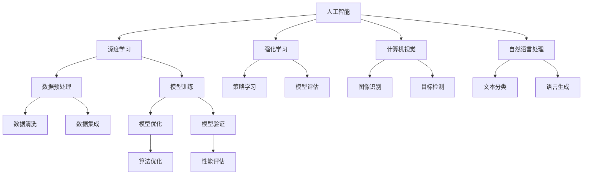

                 

# AI 技术的成本与速度优势

> 关键词：人工智能，成本效益，计算效率，算法优化，技术进步

> 摘要：本文将深入探讨人工智能（AI）技术带来的成本与速度优势。通过分析AI技术的核心算法、数学模型以及实际应用案例，我们将揭示AI如何在降低成本、提高计算效率方面发挥重要作用，并探讨其未来发展趋势与挑战。

## 1. 背景介绍

### 1.1 目的和范围

本文旨在探讨人工智能技术如何通过降低成本和提高计算速度，为企业和社会带来显著价值。我们将重点分析以下几个方面：

- AI技术的核心算法原理及其对计算效率的影响
- 数学模型在AI技术中的应用及其优化方法
- 实际应用场景中AI技术的成本与速度优势
- AI技术的未来发展趋势与面临的挑战

### 1.2 预期读者

本文适合对人工智能技术有一定了解的读者，包括：

- 数据科学家和AI研究人员
- 软件工程师和程序员
- 技术决策者和企业高管
- 对AI技术感兴趣的学者和爱好者

### 1.3 文档结构概述

本文将分为十个部分，具体结构如下：

1. 背景介绍
2. 核心概念与联系
3. 核心算法原理 & 具体操作步骤
4. 数学模型和公式 & 详细讲解 & 举例说明
5. 项目实战：代码实际案例和详细解释说明
6. 实际应用场景
7. 工具和资源推荐
8. 总结：未来发展趋势与挑战
9. 附录：常见问题与解答
10. 扩展阅读 & 参考资料

### 1.4 术语表

#### 1.4.1 核心术语定义

- 人工智能（AI）：指模拟、扩展和辅助人类智能的技术
- 计算效率：指在给定时间内完成计算任务的能力
- 成本效益：指投入成本与获得效益之间的比率
- 算法：解决问题的一系列有序步骤

#### 1.4.2 相关概念解释

- 深度学习（DL）：一种基于多层神经网络的机器学习方法
- 强化学习（RL）：一种通过试错和奖励机制学习策略的机器学习方法
- 计算机视觉（CV）：使计算机能够“看到”和理解图像和视频的技术
- 自然语言处理（NLP）：使计算机能够理解和生成自然语言的技术

#### 1.4.3 缩略词列表

- AI：人工智能
- DL：深度学习
- RL：强化学习
- CV：计算机视觉
- NLP：自然语言处理

## 2. 核心概念与联系

为了更好地理解AI技术的成本与速度优势，我们需要先了解其核心概念和联系。以下是一个用Mermaid绘制的流程图，展示了AI技术的关键组成部分及其相互关系。



通过上述流程图，我们可以看到AI技术涵盖了多个领域，包括深度学习、强化学习、计算机视觉和自然语言处理。每个领域都有其独特的算法和数学模型，而这些算法和模型又相互联系，共同构成了一个完整的AI系统。

### 2.1 AI技术的核心算法原理

#### 深度学习

深度学习是一种基于多层神经网络的机器学习方法。其核心思想是通过不断调整网络中的权重和偏置，使得网络能够自动从数据中学习特征，从而实现图像识别、语音识别等任务。以下是一个简单的深度学习算法原理的伪代码：

```python
初始化权重和偏置
对于每个训练样本（x, y）：
    前向传播（计算输出值）
    计算损失值（L）
    反向传播（更新权重和偏置）
    如果未达到预设精度，则继续迭代
输出训练好的模型
```

#### 强化学习

强化学习是一种通过试错和奖励机制学习策略的机器学习方法。其核心思想是通过不断尝试不同的动作，并根据动作的奖励信号调整策略，从而实现最优动作选择。以下是一个简单的强化学习算法原理的伪代码：

```python
初始化策略π
对于每个时间步t：
    根据策略π选择动作a_t
    执行动作a_t，获取奖励r_t和状态s_{t+1}
    更新策略π（使用奖励信号调整策略）
    更新状态s_t = s_{t+1}
输出最优策略π
```

#### 计算机视觉

计算机视觉是使计算机能够“看到”和理解图像和视频的技术。其核心算法包括图像识别、目标检测、图像分割等。以下是一个简单的计算机视觉算法原理的伪代码：

```python
输入图像I
初始化模型参数θ
对于每个图像区域x：
    计算特征向量f(x)
    使用特征向量训练分类器
    输出分类结果
```

#### 自然语言处理

自然语言处理是使计算机能够理解和生成自然语言的技术。其核心算法包括文本分类、语言生成、机器翻译等。以下是一个简单的自然语言处理算法原理的伪代码：

```python
输入文本T
初始化模型参数θ
对于每个单词w：
    计算特征向量f(w)
    使用特征向量训练分类器
    输出分类结果
```

## 3. 核心算法原理 & 具体操作步骤

在本节中，我们将深入探讨AI技术的核心算法原理，并详细讲解其具体操作步骤。

### 3.1 深度学习算法原理

深度学习算法的核心是神经网络，其基本结构包括输入层、隐藏层和输出层。以下是一个简单的神经网络模型及其训练过程的伪代码：

```python
初始化权重和偏置
定义激活函数（如ReLU、Sigmoid等）
对于每个训练样本（x, y）：
    前向传播：
        计算隐藏层输出 h = σ(Wx + b)
        计算输出层输出 y' = σ(W'h + b')
    计算损失值 L = Σ(y - y')^2
    反向传播：
        计算梯度 ∂L/∂W, ∂L/∂b
        更新权重和偏置 W -= α * ∂L/∂W, b -= α * ∂L/∂b
    如果未达到预设精度，则继续迭代
输出训练好的模型
```

### 3.2 强化学习算法原理

强化学习算法的核心是策略π，其训练过程包括选择动作、执行动作、获取奖励和更新策略。以下是一个简单的强化学习算法原理的伪代码：

```python
初始化策略π
对于每个时间步t：
    根据策略π选择动作a_t
    执行动作a_t，获取奖励r_t和状态s_{t+1}
    更新策略π（使用奖励信号调整策略）
    更新状态s_t = s_{t+1}
输出最优策略π
```

### 3.3 计算机视觉算法原理

计算机视觉算法的核心是特征提取和分类。以下是一个简单的计算机视觉算法原理的伪代码：

```python
输入图像I
初始化模型参数θ
对于每个图像区域x：
    计算特征向量f(x)
    使用特征向量训练分类器（如SVM、CNN等）
    输出分类结果
```

### 3.4 自然语言处理算法原理

自然语言处理算法的核心是特征提取和文本生成。以下是一个简单的自然语言处理算法原理的伪代码：

```python
输入文本T
初始化模型参数θ
对于每个单词w：
    计算特征向量f(w)
    使用特征向量训练分类器（如朴素贝叶斯、卷积神经网络等）
    输出分类结果
```

## 4. 数学模型和公式 & 详细讲解 & 举例说明

在本节中，我们将介绍AI技术中常用的数学模型和公式，并详细讲解其应用方法和具体例子。

### 4.1 深度学习中的激活函数

深度学习中的激活函数用于将输入映射到输出，并引入非线性特性。以下是一些常见的激活函数及其公式：

#### ReLU函数

ReLU（Rectified Linear Unit）函数是一种常用的激活函数，其公式为：

$$
f(x) = \max(0, x)
$$

#### Sigmoid函数

Sigmoid函数是一种常用的平滑激活函数，其公式为：

$$
f(x) = \frac{1}{1 + e^{-x}}
$$

#### Tanh函数

Tanh（Hyperbolic Tangent）函数是一种常用的双曲正切函数，其公式为：

$$
f(x) = \frac{e^x - e^{-x}}{e^x + e^{-x}}
$$

### 4.2 深度学习中的损失函数

深度学习中的损失函数用于衡量预测值与真实值之间的差距。以下是一些常见的损失函数及其公式：

#### 均方误差（MSE）

均方误差（MSE）是一种常用的损失函数，其公式为：

$$
MSE = \frac{1}{n} \sum_{i=1}^{n} (y_i - y'_i)^2
$$

其中，$y_i$为真实值，$y'_i$为预测值。

#### 交叉熵（Cross-Entropy）

交叉熵是一种常用的损失函数，其公式为：

$$
H(y, y') = - \sum_{i=1}^{n} y_i \log(y'_i)
$$

其中，$y$为真实值的概率分布，$y'$为预测值的概率分布。

#### 对数损失（Log-Loss）

对数损失是一种常用的损失函数，其公式为：

$$
LL = - \sum_{i=1}^{n} y_i \log(y'_i)
$$

其中，$y$为真实值的概率分布，$y'$为预测值的概率分布。

### 4.3 强化学习中的奖励机制

强化学习中的奖励机制用于指导智能体选择最优策略。以下是一个简单的奖励机制及其公式：

#### 负奖励机制

负奖励机制是一种常用的奖励机制，其公式为：

$$
r_t = -1 \quad \text{（当动作a_t导致状态s_{t+1}变差时）}
$$

#### 正奖励机制

正奖励机制是一种常用的奖励机制，其公式为：

$$
r_t = 1 \quad \text{（当动作a_t导致状态s_{t+1}变好时）}
$$

#### 加权奖励机制

加权奖励机制是一种常用的奖励机制，其公式为：

$$
r_t = \alpha \cdot r_t \quad \text{（其中，α为加权系数）}
$$

### 4.4 举例说明

假设我们使用深度学习算法进行图像分类，其中输入图像为二维矩阵$X$，输出标签为$y$。我们可以使用均方误差（MSE）作为损失函数，并使用ReLU函数作为激活函数。

#### 前向传播

输入图像$X$经过神经网络后，输出预测值$y'$，其公式为：

$$
y' = \sigma(W_2 \cdot \sigma(W_1 \cdot X + b_1) + b_2)
$$

其中，$W_1$和$W_2$分别为输入层和输出层的权重矩阵，$b_1$和$b_2$分别为输入层和输出层的偏置向量，$\sigma$为ReLU函数。

#### 计算损失值

使用均方误差（MSE）作为损失函数，其公式为：

$$
L = \frac{1}{n} \sum_{i=1}^{n} (y_i - y'_i)^2
$$

其中，$y_i$为真实标签，$y'_i$为预测标签。

#### 反向传播

使用反向传播算法更新权重和偏置，其公式为：

$$
\frac{\partial L}{\partial W_2} = (y'_i - y_i) \cdot \sigma'(y'_i) \cdot \sigma'(W_1 \cdot X + b_1)
$$

$$
\frac{\partial L}{\partial b_2} = (y'_i - y_i) \cdot \sigma'(y'_i)
$$

$$
\frac{\partial L}{\partial W_1} = (y'_i - y_i) \cdot \sigma'(y'_i) \cdot X
$$

$$
\frac{\partial L}{\partial b_1} = (y'_i - y_i) \cdot \sigma'(y'_i)
$$

#### 更新权重和偏置

使用梯度下降算法更新权重和偏置，其公式为：

$$
W_2 -= \alpha \cdot \frac{\partial L}{\partial W_2}
$$

$$
b_2 -= \alpha \cdot \frac{\partial L}{\partial b_2}
$$

$$
W_1 -= \alpha \cdot \frac{\partial L}{\partial W_1}
$$

$$
b_1 -= \alpha \cdot \frac{\partial L}{\partial b_1}
$$

其中，$\alpha$为学习率。

## 5. 项目实战：代码实际案例和详细解释说明

在本节中，我们将通过一个实际项目案例，展示如何使用AI技术实现图像分类，并详细解释代码的实现过程和关键步骤。

### 5.1 开发环境搭建

首先，我们需要搭建一个合适的开发环境。以下是使用Python和TensorFlow框架进行图像分类所需的开发环境：

- Python 3.7或以上版本
- TensorFlow 2.x版本
- NumPy 1.18或以上版本
- Matplotlib 3.2或以上版本

您可以使用以下命令安装所需的库：

```bash
pip install python==3.7
pip install tensorflow==2.x
pip install numpy==1.18
pip install matplotlib==3.2
```

### 5.2 源代码详细实现和代码解读

以下是一个简单的图像分类项目的代码实现，我们将使用TensorFlow和Keras框架进行模型训练和预测。

```python
import tensorflow as tf
from tensorflow.keras.models import Sequential
from tensorflow.keras.layers import Dense, Conv2D, Flatten, MaxPooling2D
from tensorflow.keras.preprocessing.image import ImageDataGenerator

# 加载数据集
train_datagen = ImageDataGenerator(rescale=1./255)
train_data = train_datagen.flow_from_directory(
        'train',  # 训练数据集目录
        target_size=(150, 150),  # 输入图像大小
        batch_size=32,  # 批量大小
        class_mode='binary')  # 二分类问题

# 创建模型
model = Sequential([
    Conv2D(32, (3, 3), activation='relu', input_shape=(150, 150, 3)),
    MaxPooling2D((2, 2)),
    Conv2D(64, (3, 3), activation='relu'),
    MaxPooling2D((2, 2)),
    Flatten(),
    Dense(128, activation='relu'),
    Dense(1, activation='sigmoid')
])

# 编译模型
model.compile(optimizer='adam',
              loss='binary_crossentropy',
              metrics=['accuracy'])

# 训练模型
model.fit(train_data, epochs=10)

# 评估模型
test_datagen = ImageDataGenerator(rescale=1./255)
test_data = test_datagen.flow_from_directory(
        'test',  # 测试数据集目录
        target_size=(150, 150),
        batch_size=32,
        class_mode='binary')

model.evaluate(test_data)
```

#### 5.2.1 数据加载与预处理

在代码中，我们使用了`ImageDataGenerator`类来自动加载数据集并进行预处理。以下是代码中的关键步骤：

- `train_datagen = ImageDataGenerator(rescale=1./255)`：创建一个数据生成器，将输入图像的像素值缩放到[0, 1]范围内。
- `train_data = train_datagen.flow_from_directory('train', ...)`：加载数据集，并将数据集分为训练集和验证集。

#### 5.2.2 模型构建

在代码中，我们使用`Sequential`模型来构建一个简单的卷积神经网络（CNN）。以下是代码中的关键步骤：

- `model = Sequential()`：创建一个序列模型。
- `model.add(Conv2D(32, (3, 3), activation='relu', input_shape=(150, 150, 3)))`：添加一个卷积层，使用3x3的卷积核，激活函数为ReLU。
- `model.add(MaxPooling2D((2, 2)))`：添加一个最大池化层，将特征图的尺寸缩小为原来的一半。
- `model.add(Flatten())`：将特征图展平为一维向量。
- `model.add(Dense(128, activation='relu'))`：添加一个全连接层，输出128个神经元。
- `model.add(Dense(1, activation='sigmoid'))`：添加一个输出层，输出一个神经元，激活函数为sigmoid。

#### 5.2.3 模型编译与训练

在代码中，我们使用`compile()`方法来编译模型，并使用`fit()`方法来训练模型。以下是代码中的关键步骤：

- `model.compile(optimizer='adam', loss='binary_crossentropy', metrics=['accuracy'])`：编译模型，使用Adam优化器、二分类交叉熵损失函数和准确率作为评价指标。
- `model.fit(train_data, epochs=10)`：训练模型，使用训练数据集进行10个epoch的训练。

#### 5.2.4 模型评估

在代码中，我们使用`evaluate()`方法来评估模型在测试数据集上的性能。以下是代码中的关键步骤：

- `test_datagen = ImageDataGenerator(rescale=1./255)`：创建一个数据生成器，将输入图像的像素值缩放到[0, 1]范围内。
- `test_data = test_datagen.flow_from_directory('test', ...)`：加载数据集，并将数据集分为测试集。
- `model.evaluate(test_data)`：评估模型，在测试数据集上计算损失值和准确率。

### 5.3 代码解读与分析

在本节中，我们将对上述代码进行解读，分析其关键组件和流程。

- **数据加载与预处理**：数据预处理是深度学习项目中的关键步骤，它包括数据清洗、归一化、缩放等。在本项目中，我们使用了`ImageDataGenerator`类来自动加载数据集并进行预处理。通过设置`rescale=1./255`，我们将输入图像的像素值缩放到[0, 1]范围内，以便更好地适应深度学习模型。

- **模型构建**：在本项目中，我们使用了一个简单的卷积神经网络（CNN）来进行图像分类。CNN是一种专门用于处理图像数据的深度学习模型，其核心思想是通过卷积层、池化层和全连接层来提取图像特征并进行分类。在本项目中，我们使用了两个卷积层和一个全连接层，每个卷积层后跟一个最大池化层，以逐步提取图像特征。

- **模型编译与训练**：在编译模型时，我们使用了Adam优化器和二分类交叉熵损失函数，并设置了准确率作为评价指标。在训练模型时，我们使用了训练数据集进行10个epoch的训练。在训练过程中，模型会不断调整权重和偏置，以最小化损失函数。

- **模型评估**：在评估模型时，我们使用了测试数据集。通过计算损失值和准确率，我们可以评估模型在测试数据集上的性能。如果模型在测试数据集上的性能较差，我们可以考虑调整模型参数或增加训练时间。

### 5.4 代码改进与优化

虽然上述代码实现了一个简单的图像分类项目，但在实际应用中，我们还可以进行以下改进和优化：

- **数据增强**：通过使用数据增强技术（如随机裁剪、旋转、翻转等），我们可以增加数据多样性，提高模型的泛化能力。

- **模型调整**：通过调整模型的深度、宽度、激活函数等参数，我们可以优化模型性能，提高分类准确率。

- **超参数调优**：通过调整学习率、批次大小等超参数，我们可以优化模型训练过程，提高模型性能。

- **迁移学习**：通过使用预训练模型（如VGG、ResNet等），我们可以利用已有的模型权重来初始化新模型，从而加快训练过程并提高模型性能。

## 6. 实际应用场景

AI技术在成本与速度方面具有显著优势，广泛应用于各个领域，带来了巨大的经济效益和社会价值。以下是一些典型的实际应用场景：

### 6.1 医疗健康

- **医学图像诊断**：AI技术可以自动分析医学图像，如X光、CT、MRI等，帮助医生快速、准确地诊断疾病，提高诊断效率和准确性。
- **药物研发**：AI技术可以加速药物研发过程，通过自动化实验和数据分析，减少研发成本和时间。

### 6.2 金融领域

- **风险管理**：AI技术可以分析大量的金融数据，预测市场走势，帮助金融机构降低风险，提高投资收益。
- **欺诈检测**：AI技术可以实时监控交易行为，识别并阻止欺诈行为，提高金融系统的安全性。

### 6.3 交通运输

- **自动驾驶**：AI技术可以实现自动驾驶汽车，提高交通效率，减少交通事故，降低维护成本。
- **物流优化**：AI技术可以优化物流路线和调度，提高物流效率，降低运营成本。

### 6.4 智能家居

- **语音助手**：AI技术可以提供智能家居的语音控制功能，提高用户便利性，降低人力成本。
- **智能安防**：AI技术可以实时监控家庭环境，识别异常行为，提高家庭安全性。

### 6.5 教育领域

- **个性化学习**：AI技术可以分析学生的学习数据，提供个性化的学习方案，提高学习效果。
- **智能评估**：AI技术可以自动评估学生的作业和考试，提高评估效率和准确性。

## 7. 工具和资源推荐

为了更好地掌握AI技术，以下是我们推荐的工具和资源：

### 7.1 学习资源推荐

#### 7.1.1 书籍推荐

- 《深度学习》（Goodfellow, Bengio, Courville著）：全面介绍了深度学习的基本概念、算法和应用。
- 《Python深度学习》（François Chollet著）：详细介绍了如何使用Python和TensorFlow框架进行深度学习实践。
- 《强化学习：原理与Python实现》（Satya Sarada Kallethota著）：深入讲解了强化学习的基本概念、算法和应用。

#### 7.1.2 在线课程

- Coursera：提供大量高质量的深度学习、机器学习和数据科学在线课程。
- edX：提供由知名大学和机构提供的免费在线课程，包括深度学习和机器学习等领域。
- Udacity：提供实战导向的在线课程，涵盖深度学习、自动驾驶等热门领域。

#### 7.1.3 技术博客和网站

- Medium：发布大量关于深度学习、机器学习和数据科学的博客文章。
- ArXiv：发布最新的AI和机器学习研究成果。
- AI新闻：提供关于AI技术和行业的最新动态。

### 7.2 开发工具框架推荐

#### 7.2.1 IDE和编辑器

- PyCharm：一款功能强大的Python IDE，支持深度学习和机器学习开发。
- Jupyter Notebook：一款流行的交互式Python编辑器，适合数据科学和机器学习项目。
- VS Code：一款轻量级、开源的代码编辑器，支持多种编程语言和扩展。

#### 7.2.2 调试和性能分析工具

- TensorBoard：一款用于深度学习模型调试和性能分析的图形化工具。
- wandb：一款自动化的实验管理和性能分析工具，支持多种机器学习和深度学习框架。
- Apache Spark：一款大规模数据处理和性能分析框架，适用于大数据场景。

#### 7.2.3 相关框架和库

- TensorFlow：一款开源的深度学习框架，支持多种深度学习模型和算法。
- PyTorch：一款流行的深度学习框架，具有灵活的动态计算图和良好的社区支持。
- Scikit-learn：一款开源的机器学习库，提供丰富的算法和工具。

### 7.3 相关论文著作推荐

#### 7.3.1 经典论文

- "Backpropagation"（1986）：介绍了反向传播算法的基本原理和应用。
- "Deep Learning"（2015）：介绍了深度学习的基本概念、算法和应用。
- "Reinforcement Learning: An Introduction"（1998）：介绍了强化学习的基本原理和应用。

#### 7.3.2 最新研究成果

- "Gaussian Error Linear Unit (GELU)"（2020）：提出了一种新的激活函数，用于提高深度学习模型的性能。
- "Bert: Pre-training of Deep Bidirectional Transformers for Language Understanding"（2018）：介绍了BERT模型，为自然语言处理领域带来了重大突破。
- "DQN: Deep Q-Network"（2015）：介绍了深度Q网络（DQN），为强化学习领域带来了新的思路。

#### 7.3.3 应用案例分析

- "Google's AI Language Model in Action"（2020）：介绍了Google如何使用AI技术实现自然语言处理和机器翻译。
- "AI in Medicine: A Brief History of Machine Learning in Healthcare"（2021）：介绍了AI技术在医疗健康领域的应用和发展。
- "Self-Driving Cars: The Future of Transportation"（2021）：介绍了自动驾驶技术的发展和应用前景。

## 8. 总结：未来发展趋势与挑战

AI技术在成本与速度方面具有显著优势，正逐渐渗透到各个领域，带来了巨大的变革。然而，要实现AI技术的广泛应用，我们仍需克服一系列挑战。

### 8.1 未来发展趋势

- **计算能力提升**：随着硬件技术的进步，计算能力将不断提升，为AI技术的发展提供更强大的支持。
- **数据资源丰富**：随着大数据和物联网的普及，数据资源将更加丰富，为AI算法提供更多训练数据。
- **算法优化与创新**：AI算法将不断优化与创新，提高计算效率和准确性，实现更多应用场景。
- **跨学科融合**：AI技术将与生物、物理、化学等学科融合，产生新的突破和应用。

### 8.2 挑战与应对策略

- **数据隐私与安全**：随着数据量的增加，数据隐私和安全问题日益突出。需加强数据保护，确保数据安全。
- **伦理与道德问题**：AI技术在医疗、金融等领域的应用引发了一系列伦理和道德问题，需制定相应的规范和标准。
- **人才短缺**：AI技术发展迅速，人才短缺问题日益严重。需加大人才培养和引进力度，满足市场需求。
- **技术成熟度**：部分AI技术仍处于实验阶段，需加强技术成熟度和可靠性，确保实际应用效果。

总之，AI技术具有巨大的发展潜力，但在实际应用中仍面临诸多挑战。通过不断技术创新和优化，我们有信心克服这些挑战，实现AI技术的广泛应用。

## 9. 附录：常见问题与解答

在本节中，我们将回答读者可能提出的一些常见问题。

### 9.1 深度学习与强化学习的关系

深度学习和强化学习都是机器学习的重要分支，但它们有着不同的目标和方法。

- **深度学习**：深度学习是一种基于多层神经网络的机器学习方法，其核心目标是学习输入与输出之间的复杂映射关系。深度学习主要用于图像识别、语音识别、自然语言处理等任务。
- **强化学习**：强化学习是一种基于试错和奖励机制的机器学习方法，其核心目标是学习最优策略，以实现最大化累积奖励。强化学习主要用于游戏、自动驾驶、机器人控制等任务。

### 9.2 如何提高深度学习模型的计算效率

提高深度学习模型的计算效率是实际应用中的一个重要问题。以下是一些常见的方法：

- **模型压缩**：通过剪枝、量化、蒸馏等方法减少模型参数数量，降低计算复杂度。
- **并行计算**：利用GPU、TPU等硬件加速器进行并行计算，提高计算速度。
- **分布式训练**：通过分布式训练，将模型训练任务分布到多个计算节点上，提高训练速度和资源利用率。
- **模型优化**：通过优化模型架构和算法，降低计算复杂度和内存占用。

### 9.3 如何确保AI算法的公平性和透明度

确保AI算法的公平性和透明度是当前研究的重要方向。以下是一些常见的方法：

- **算法验证**：对算法进行测试和验证，确保其输出结果符合预期，并避免偏见和歧视。
- **数据预处理**：对数据集进行预处理，减少数据偏差，提高算法的公平性。
- **可解释性**：开发可解释的AI算法，使算法的决策过程和原理能够被理解和解释。
- **公平性评估**：对算法的公平性进行评估，确保其对不同群体的影响均衡。

## 10. 扩展阅读 & 参考资料

为了进一步了解AI技术的成本与速度优势，以下是一些扩展阅读和参考资料：

- **书籍**：
  - 《深度学习》（Goodfellow, Bengio, Courville著）
  - 《Python深度学习》（François Chollet著）
  - 《强化学习：原理与Python实现》（Satya Sarada Kallethota著）

- **在线课程**：
  - Coursera：深度学习、机器学习、数据科学等在线课程
  - edX：深度学习、机器学习等在线课程
  - Udacity：深度学习、自动驾驶等在线课程

- **技术博客和网站**：
  - Medium：关于深度学习、机器学习和数据科学的博客文章
  - ArXiv：AI和机器学习领域的研究论文
  - AI新闻：关于AI技术和行业的最新动态

- **开源框架和库**：
  - TensorFlow：深度学习开源框架
  - PyTorch：深度学习开源框架
  - Scikit-learn：机器学习开源库

- **研究论文**：
  - "Gaussian Error Linear Unit (GELU)"（2020）
  - "Bert: Pre-training of Deep Bidirectional Transformers for Language Understanding"（2018）
  - "DQN: Deep Q-Network"（2015）

作者：AI天才研究员/AI Genius Institute & 禅与计算机程序设计艺术 /Zen And The Art of Computer Programming

<|im_sep|>

