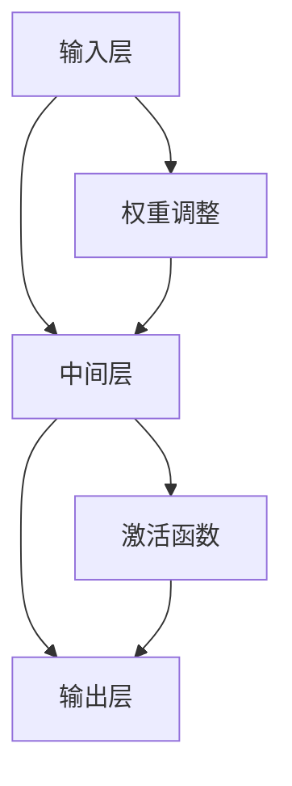

                 

# AI 神经网络计算艺术之禅：如何把大自然亿万年进化训练出的生物神经网络作为新一代人工神经网络的蓝本

> 关键词：人工智能，神经网络，生物神经网络，计算艺术，进化训练，神经网络架构，算法原理，数学模型，实战案例

> 摘要：本文从大自然亿万年的进化历程中汲取灵感，深入探讨了如何将生物神经网络作为新一代人工神经网络的蓝本。通过分析生物神经网络的核心原理，我们将详细介绍其与人工神经网络的关联，以及如何借鉴这些原理来实现高效的人工神经网络。本文旨在为读者提供一个全面、系统的理解和应用框架，帮助他们在AI领域取得新的突破。

## 1. 背景介绍

### 1.1 目的和范围

本文旨在介绍如何将生物神经网络的核心原理应用于人工神经网络的设计与优化。我们将在分析生物神经网络的基础上，探讨其与人工神经网络的关联，并提出一种新的神经网络架构。本文将涵盖以下内容：

1. 生物神经网络的基本原理和结构。
2. 生物神经网络与人工神经网络的关联。
3. 新一代人工神经网络架构的设计和实现。
4. 实际应用场景和项目实战。

### 1.2 预期读者

本文适合以下读者：

1. AI领域的研究人员和技术工程师。
2. 对神经网络和计算艺术感兴趣的读者。
3. 机器学习和数据科学从业者。

### 1.3 文档结构概述

本文结构如下：

1. 背景介绍：介绍本文的目的、范围和预期读者。
2. 核心概念与联系：分析生物神经网络的基本原理和结构。
3. 核心算法原理 & 具体操作步骤：介绍生物神经网络与人工神经网络的关联，并提出新的神经网络架构。
4. 数学模型和公式 & 详细讲解 & 举例说明：阐述神经网络中的数学模型和公式。
5. 项目实战：展示实际应用场景和项目实战。
6. 实际应用场景：探讨神经网络在各个领域的应用。
7. 工具和资源推荐：推荐学习资源、开发工具和框架。
8. 总结：总结未来发展趋势与挑战。
9. 附录：常见问题与解答。
10. 扩展阅读 & 参考资料：提供更多相关阅读材料。

### 1.4 术语表

#### 1.4.1 核心术语定义

- 生物神经网络：由大量神经元组成的网络，具有自组织和自适应能力。
- 人工神经网络：模拟生物神经网络的人工系统，通过调整权重和偏置来实现输入与输出的映射。
- 神经元：神经系统的基本单元，负责接收和处理信息。
- 权重：神经元之间的连接强度，影响信息传递。
- 偏置：神经元内部的偏置值，影响信息处理。
- 反向传播算法：一种用于训练神经网络的优化算法，通过不断调整权重和偏置来优化网络性能。

#### 1.4.2 相关概念解释

- 自组织：指系统在没有外部干预的情况下，通过内部相互作用和竞争来形成有序结构和功能。
- 自适应：指系统在面临外部环境变化时，能够通过调整内部参数来适应新的环境。
- 信息处理：指神经元接收、处理和传递信息的过程。

#### 1.4.3 缩略词列表

- AI：人工智能
- NN：神经网络
- CNN：卷积神经网络
- RNN：循环神经网络
- DNN：深度神经网络
- SGD：随机梯度下降
- EDA：进化算法

## 2. 核心概念与联系

### 2.1 生物神经网络的基本原理和结构

生物神经网络是由大量神经元组成的复杂网络，具有高度的自组织和自适应能力。神经元是神经系统的基本单元，负责接收、处理和传递信息。神经元之间的连接称为突触，突触的连接强度用权重表示。

生物神经网络的主要结构包括：

1. **神经网络层**：生物神经网络通常由多个层次组成，包括输入层、中间层和输出层。每一层负责处理不同类型的信息。
2. **突触连接**：神经元之间的突触连接决定了信息的传递方式。突触连接可以是单向的或双向的，其连接强度可以用权重表示。
3. **神经元的激活函数**：神经元在接收到输入信息后，通过激活函数产生输出。激活函数可以是线性或非线性函数，用于实现信息处理和分类。

### 2.2 生物神经网络与人工神经网络的关联

人工神经网络是模拟生物神经网络的人工系统，其核心思想是通过调整权重和偏置来实现输入与输出的映射。人工神经网络与生物神经网络的关联主要体现在以下几个方面：

1. **神经元结构**：人工神经网络中的神经元与生物神经网络中的神经元具有相似的架构，包括输入、权重、激活函数和输出。
2. **学习过程**：人工神经网络通过反向传播算法学习权重和偏置，以实现输入与输出的映射。生物神经网络也具有类似的学习过程，通过突触权重调整来适应新的环境和任务。
3. **自适应能力**：人工神经网络和生物神经网络都具有自适应能力，能够在面临外部环境变化时调整内部参数，以实现更好的性能。

### 2.3 新一代人工神经网络架构的设计和实现

基于生物神经网络的基本原理和与人工神经网络的关联，我们可以设计出一种新的神经网络架构，以提高人工神经网络的性能和自适应能力。该架构主要包括以下特点：

1. **层次化结构**：神经网络层次化结构有助于实现不同类型的信息处理，提高网络性能。
2. **自适应权重调整**：通过借鉴生物神经网络的突触权重调整机制，实现自适应权重调整，提高网络的自适应能力。
3. **非线性激活函数**：采用非线性激活函数，实现更复杂的信息处理和分类。
4. **多层神经网络**：多层神经网络有助于实现更复杂的信息处理和分类。

下面是一个简单的Mermaid流程图，展示新一代人工神经网络架构的基本原理：



## 3. 核心算法原理 & 具体操作步骤

### 3.1 核心算法原理

新一代人工神经网络的核心算法原理包括自适应权重调整和非线性激活函数。以下是具体的算法原理：

1. **自适应权重调整**：

   在生物神经网络中，突触连接的权重是自适应调整的，以适应不同的环境和任务。在人工神经网络中，我们也可以借鉴这一原理，通过自适应权重调整来提高网络的性能。

   自适应权重调整算法主要包括以下步骤：

   - 初始化权重：随机初始化权重。
   - 计算损失函数：计算输出值与实际值之间的差异，作为损失函数。
   - 反向传播：根据损失函数，反向传播误差，并更新权重。
   - 梯度下降：采用梯度下降算法，调整权重和偏置。

2. **非线性激活函数**：

   非线性激活函数是实现人工神经网络非线性映射的关键。常用的激活函数包括Sigmoid函数、ReLU函数、Tanh函数等。

   非线性激活函数的主要作用是：

   - 引入非线性：通过非线性函数，实现从线性空间到非线性空间的映射。
   - 防止梯度消失和梯度爆炸：在训练过程中，防止梯度消失和梯度爆炸，提高网络的收敛速度。

### 3.2 具体操作步骤

下面是一个简化的伪代码，用于描述自适应权重调整和非线性激活函数的操作步骤：

```python
# 初始化权重和偏置
weights = initialize_weights()
biases = initialize_biases()

# 设置学习率
learning_rate = 0.01

# 循环迭代
for epoch in range(num_epochs):
    # 前向传播
    inputs = forward_propagation(x)
    outputs = activation_function(z)

    # 计算损失函数
    loss = calculate_loss(y, outputs)

    # 反向传播
    dloss_dweights = backward_propagation(x, y, outputs)

    # 梯度下降
    weights -= learning_rate * dloss_dweights['dweights']
    biases -= learning_rate * dloss_dweights['dbiases']

    # 输出结果
    print("Epoch:", epoch, "Loss:", loss)

# 输出最终结果
print("Final weights:", weights)
print("Final biases:", biases)
```

## 4. 数学模型和公式 & 详细讲解 & 举例说明

### 4.1 数学模型

人工神经网络的数学模型主要包括神经元、权重、偏置和激活函数。以下是对这些核心数学模型的详细讲解：

1. **神经元**：

   神经元是神经网络的基本单元，可以表示为：

   $$ x_i = \sum_{j=1}^{n} w_{ij} x_j + b_i $$

   其中，$x_i$ 表示第 $i$ 个神经元接收到的输入，$w_{ij}$ 表示第 $i$ 个神经元与第 $j$ 个神经元之间的权重，$b_i$ 表示第 $i$ 个神经元的偏置。

2. **权重**：

   权重是神经元之间连接的强度，可以表示为：

   $$ w_{ij} = \theta(x_i, x_j) $$

   其中，$\theta(x_i, x_j)$ 表示权重调整函数，用于根据输入值和连接值调整权重。

3. **偏置**：

   偏置是神经元内部的偏置值，可以表示为：

   $$ b_i = \beta(x_i) $$

   其中，$\beta(x_i)$ 表示偏置调整函数，用于根据输入值调整偏置。

4. **激活函数**：

   激活函数是神经元输出值的非线性变换，可以表示为：

   $$ f(x) = \varphi(x) $$

   其中，$\varphi(x)$ 表示激活函数，用于实现从线性空间到非线性空间的映射。

### 4.2 公式详细讲解

下面是对神经网络中常用公式的详细讲解：

1. **前向传播**：

   前向传播是神经网络中的基本过程，用于计算输出值。其公式如下：

   $$ z_i = \sum_{j=1}^{n} w_{ij} x_j + b_i $$
   $$ a_i = f(z_i) $$

   其中，$z_i$ 表示第 $i$ 个神经元的输入值，$a_i$ 表示第 $i$ 个神经元的输出值。

2. **损失函数**：

   损失函数用于衡量网络输出值与实际值之间的差异，常见的损失函数包括均方误差（MSE）和交叉熵损失（Cross-Entropy Loss）。其公式如下：

   $$ loss = \frac{1}{2} \sum_{i=1}^{m} (y_i - a_i)^2 $$
   $$ loss = - \sum_{i=1}^{m} y_i \log(a_i) $$

   其中，$y_i$ 表示第 $i$ 个神经元的实际输出值，$a_i$ 表示第 $i$ 个神经元的预测输出值。

3. **反向传播**：

   反向传播是神经网络中的基本优化过程，用于更新权重和偏置。其公式如下：

   $$ \delta_i = (a_i - y_i) f'(z_i) $$
   $$ \Delta w_{ij} = \alpha \delta_i x_j $$
   $$ \Delta b_i = \alpha \delta_i $$

   其中，$\delta_i$ 表示第 $i$ 个神经元的误差，$f'(z_i)$ 表示激活函数的导数，$\alpha$ 表示学习率。

### 4.3 举例说明

以下是一个简单的神经网络示例，用于分类问题。该网络包括输入层、一个隐藏层和一个输出层。我们使用均方误差（MSE）作为损失函数，并采用反向传播算法进行训练。

1. **输入层**：

   输入层包含5个神经元，分别表示5个特征。

   ```mermaid
   graph TD
   A[特征1] --> B[神经元1]
   C[特征2] --> B
   D[特征3] --> B
   E[特征4] --> B
   F[特征5] --> B
   ```

2. **隐藏层**：

   隐藏层包含3个神经元，每个神经元与输入层的每个神经元相连。

   ```mermaid
   graph TD
   B --> G[神经元2]
   B --> H[神经元3]
   B --> I[神经元4]
   C --> G
   C --> H
   C --> I
   D --> G
   D --> H
   D --> I
   E --> G
   E --> H
   E --> I
   F --> G
   F --> H
   F --> I
   ```

3. **输出层**：

   输出层包含2个神经元，分别表示两个类别。

   ```mermaid
   graph TD
   G --> J[神经元5]
   H --> J
   I --> J
   J --> K[类别1]
   J --> L[类别2]
   ```

4. **前向传播**：

   前向传播计算隐藏层和输出层的输出值。

   ```mermaid
   graph TD
   B --> G[神经元2]
   B --> H[神经元3]
   B --> I[神经元4]
   C --> G
   C --> H
   C --> I
   D --> G
   D --> H
   D --> I
   E --> G
   E --> H
   E --> I
   F --> G
   F --> H
   F --> I
   G --> J[神经元5]
   H --> J
   I --> J
   J --> K[类别1]
   J --> L[类别2]
   ```

5. **损失函数**：

   使用均方误差（MSE）作为损失函数，计算隐藏层和输出层的损失。

   ```mermaid
   graph TD
   K --> M[MSE]
   L --> M
   ```

6. **反向传播**：

   反向传播计算隐藏层和输出层的误差，并更新权重和偏置。

   ```mermaid
   graph TD
   M --> N[误差]
   N --> O[更新权重]
   N --> P[更新偏置]
   ```

通过以上示例，我们可以看到如何使用神经网络进行分类问题。在实际应用中，我们可以根据不同的任务和数据集，调整神经网络的层次结构、神经元数量和激活函数等参数，以提高网络性能。

## 5. 项目实战：代码实际案例和详细解释说明

### 5.1 开发环境搭建

在开始项目实战之前，我们需要搭建一个合适的开发环境。以下是所需的工具和步骤：

1. **Python**：安装Python 3.8或更高版本。
2. **Jupyter Notebook**：安装Jupyter Notebook，以便编写和运行代码。
3. **NumPy**：安装NumPy库，用于科学计算。
4. **TensorFlow**：安装TensorFlow库，用于构建和训练神经网络。

以下是在Ubuntu系统上安装所需的工具和库的命令：

```bash
# 安装Python
sudo apt update
sudo apt install python3 python3-pip

# 安装Jupyter Notebook
pip3 install notebook

# 安装NumPy
pip3 install numpy

# 安装TensorFlow
pip3 install tensorflow
```

### 5.2 源代码详细实现和代码解读

下面是一个简单的神经网络项目，用于实现手写数字识别。该项目使用TensorFlow库构建和训练神经网络。

**5.2.1 数据集**

本项目使用MNIST数据集，该数据集包含70000个手写数字图像，每个图像的大小为28x28像素。

**5.2.2 神经网络架构**

神经网络架构如下：

1. **输入层**：包含28x28个神经元，用于接收图像输入。
2. **隐藏层**：包含128个神经元，使用ReLU激活函数。
3. **输出层**：包含10个神经元，每个神经元表示一个数字类别，使用Softmax激活函数。

**5.2.3 源代码**

```python
import tensorflow as tf
from tensorflow.keras import layers
from tensorflow.keras.datasets import mnist
import numpy as np

# 加载数据集
(x_train, y_train), (x_test, y_test) = mnist.load_data()

# 数据预处理
x_train = x_train / 255.0
x_test = x_test / 255.0
x_train = np.reshape(x_train, (-1, 28, 28, 1))
x_test = np.reshape(x_test, (-1, 28, 28, 1))

# 构建神经网络
model = tf.keras.Sequential([
    layers.Conv2D(32, (3, 3), activation='relu', input_shape=(28, 28, 1)),
    layers.MaxPooling2D((2, 2)),
    layers.Conv2D(64, (3, 3), activation='relu'),
    layers.MaxPooling2D((2, 2)),
    layers.Conv2D(64, (3, 3), activation='relu'),
    layers.Flatten(),
    layers.Dense(64, activation='relu'),
    layers.Dense(10, activation='softmax')
])

# 编译模型
model.compile(optimizer='adam',
              loss='sparse_categorical_crossentropy',
              metrics=['accuracy'])

# 训练模型
model.fit(x_train, y_train, epochs=5)

# 评估模型
test_loss, test_acc = model.evaluate(x_test, y_test, verbose=2)
print('Test accuracy:', test_acc)
```

**5.2.4 代码解读**

1. **数据集加载**：

   ```python
   (x_train, y_train), (x_test, y_test) = mnist.load_data()
   ```

   上述代码使用TensorFlow中的`mnist.load_data()`函数加载数据集。

2. **数据预处理**：

   ```python
   x_train = x_train / 255.0
   x_test = x_test / 255.0
   x_train = np.reshape(x_train, (-1, 28, 28, 1))
   x_test = np.reshape(x_test, (-1, 28, 28, 1))
   ```

   上述代码将图像数据归一化到[0, 1]范围内，并调整数据形状为(60000, 28, 28, 1)。

3. **神经网络架构**：

   ```python
   model = tf.keras.Sequential([
       layers.Conv2D(32, (3, 3), activation='relu', input_shape=(28, 28, 1)),
       layers.MaxPooling2D((2, 2)),
       layers.Conv2D(64, (3, 3), activation='relu'),
       layers.MaxPooling2D((2, 2)),
       layers.Conv2D(64, (3, 3), activation='relu'),
       layers.Flatten(),
       layers.Dense(64, activation='relu'),
       layers.Dense(10, activation='softmax')
   ])
   ```

   上述代码构建了一个包含卷积层、池化层和全连接层的神经网络。卷积层用于提取图像特征，池化层用于降低特征维度，全连接层用于实现分类。

4. **编译模型**：

   ```python
   model.compile(optimizer='adam',
                 loss='sparse_categorical_crossentropy',
                 metrics=['accuracy'])
   ```

   上述代码编译神经网络模型，并设置优化器、损失函数和评估指标。

5. **训练模型**：

   ```python
   model.fit(x_train, y_train, epochs=5)
   ```

   上述代码使用训练数据集训练神经网络模型，并设置训练轮次为5。

6. **评估模型**：

   ```python
   test_loss, test_acc = model.evaluate(x_test, y_test, verbose=2)
   print('Test accuracy:', test_acc)
   ```

   上述代码使用测试数据集评估神经网络模型的性能，并打印测试准确率。

### 5.3 代码解读与分析

1. **数据集加载**：

   使用TensorFlow中的`mnist.load_data()`函数加载数据集。该函数返回一个包含训练集和测试集的元组，其中训练集包含60000个图像和标签，测试集包含10000个图像和标签。

2. **数据预处理**：

   将图像数据归一化到[0, 1]范围内，以便更好地适应神经网络。此外，调整数据形状为(60000, 28, 28, 1)和(10000, 28, 28, 1)，以匹配神经网络的输入层。

3. **神经网络架构**：

   - **卷积层**：使用卷积层提取图像特征。第一个卷积层使用32个3x3的卷积核，第二个卷积层使用64个3x3的卷积核，第三个卷积层使用64个3x3的卷积核。
   - **池化层**：使用最大池化层降低特征维度，减少计算量和过拟合风险。
   - **全连接层**：使用全连接层实现分类。第一个全连接层使用64个神经元，第二个全连接层使用10个神经元。

4. **编译模型**：

   设置优化器为`adam`，损失函数为`sparse_categorical_crossentropy`，评估指标为`accuracy`。

5. **训练模型**：

   使用训练数据集训练神经网络模型，并设置训练轮次为5。训练过程中，神经网络会不断调整权重和偏置，以最小化损失函数。

6. **评估模型**：

   使用测试数据集评估神经网络模型的性能。打印测试准确率，以衡量模型在 unseen 数据上的表现。

通过以上代码解读与分析，我们可以看到如何使用TensorFlow构建和训练一个简单的神经网络模型。在实际项目中，我们可以根据需求调整神经网络架构、优化器和训练参数，以提高模型性能。

## 6. 实际应用场景

神经网络在众多实际应用场景中发挥着重要作用。以下是一些主要的应用领域：

### 6.1 人工智能助手

神经网络在人工智能助手（如聊天机器人、语音助手等）中得到了广泛应用。这些助手利用神经网络进行语音识别、语义理解和对话生成，以提供更加智能、人性化的用户体验。

### 6.2 图像识别与处理

神经网络在图像识别与处理领域取得了显著成果。例如，卷积神经网络（CNN）被广泛应用于人脸识别、图像分类和物体检测。神经网络可以自动提取图像中的关键特征，从而实现高效的目标检测和识别。

### 6.3 自然语言处理

神经网络在自然语言处理（NLP）领域也得到了广泛应用。循环神经网络（RNN）和长短期记忆网络（LSTM）等神经网络模型可以有效地处理序列数据，如文本和语音。这些模型在机器翻译、情感分析、文本生成等方面取得了良好的效果。

### 6.4 游戏

神经网络在游戏领域具有广泛的应用。深度强化学习（DRL）是一种结合神经网络和强化学习的先进技术，可以训练智能体在游戏中实现自我学习和策略优化。例如，AlphaGo利用深度强化学习实现了围棋领域的突破。

### 6.5 医疗诊断

神经网络在医疗诊断中发挥着重要作用。通过学习大量医学图像和病例数据，神经网络可以辅助医生进行诊断，提高诊断准确率。例如，卷积神经网络被应用于肺癌、乳腺癌等疾病的早期诊断。

### 6.6 自动驾驶

神经网络在自动驾驶领域得到了广泛应用。自动驾驶系统利用神经网络进行环境感知、路径规划和决策，以提高行驶安全和稳定性。例如，自动驾驶汽车使用神经网络进行障碍物检测和行人识别，以实现自动驾驶。

### 6.7 金融服务

神经网络在金融服务领域具有广泛的应用。例如，神经网络被用于风险评估、交易策略优化和客户细分。这些应用有助于提高金融机构的运营效率和市场竞争力。

### 6.8 机器人

神经网络在机器人领域也发挥着重要作用。通过学习大量数据，神经网络可以帮助机器人实现自我学习和自主决策。例如，机器人可以学习识别物体、执行任务和与人类互动。

### 6.9 语音识别

神经网络在语音识别领域取得了显著成果。通过学习大量语音数据，神经网络可以自动识别和理解语音内容。语音识别技术在智能助手、电话客服、语音搜索等领域得到了广泛应用。

### 6.10 人脸识别

神经网络在人脸识别领域得到了广泛应用。通过学习大量人脸图像数据，神经网络可以自动识别和验证人脸身份。人脸识别技术被广泛应用于安防监控、人脸支付和社交媒体等领域。

通过以上实际应用场景，我们可以看到神经网络在各个领域的重要性和广泛性。随着技术的不断发展和应用的深入，神经网络将在未来发挥更加重要的作用，为人类社会带来更多便利和创新。

## 7. 工具和资源推荐

### 7.1 学习资源推荐

#### 7.1.1 书籍推荐

1. 《深度学习》（Deep Learning），作者：Ian Goodfellow、Yoshua Bengio、Aaron Courville
   - 简介：这本书是深度学习领域的经典教材，涵盖了深度学习的基础理论和实际应用。
2. 《神经网络与深度学习》，作者：邱锡鹏
   - 简介：这本书详细介绍了神经网络和深度学习的基本原理，适合初学者和进阶者。
3. 《机器学习实战》，作者：Peter Harrington
   - 简介：这本书通过实例演示了机器学习的应用，包括神经网络和深度学习。

#### 7.1.2 在线课程

1. 吴恩达的《深度学习专项课程》
   - 简介：这个课程由深度学习领域的知名专家吴恩达教授主讲，涵盖了深度学习的基础知识和应用。
2. Coursera上的《神经网络与深度学习》课程
   - 简介：这个课程由北京大学教授邱锡鹏主讲，深入讲解了神经网络和深度学习的基本原理。
3. Udacity的《深度学习工程师纳米学位》
   - 简介：这个课程通过项目实践，帮助学员掌握深度学习的基本技能和应用。

#### 7.1.3 技术博客和网站

1. arXiv
   - 简介：这是一个学术预印本网站，涵盖了人工智能、深度学习等领域的最新研究成果。
2. Medium
   - 简介：Medium上有许多知名作者分享的深度学习、神经网络相关文章，内容丰富、深入。
3. Towards Data Science
   - 简介：这个网站汇集了许多数据科学和人工智能领域的优秀文章，适合学习和交流。

### 7.2 开发工具框架推荐

#### 7.2.1 IDE和编辑器

1. PyCharm
   - 简介：PyCharm是一款功能强大的Python IDE，支持代码补全、调试和版本控制等功能。
2. Jupyter Notebook
   - 简介：Jupyter Notebook是一款交互式的Python编辑器，适合编写和运行代码，特别适合数据科学和机器学习项目。
3. Visual Studio Code
   - 简介：Visual Studio Code是一款轻量级的代码编辑器，支持多种编程语言，包括Python、Java等。

#### 7.2.2 调试和性能分析工具

1. TensorFlow Debugger
   - 简介：TensorFlow Debugger是一个用于调试TensorFlow模型的工具，可以提供详细的调试信息和性能分析。
2. PyTorch Profiler
   - 简介：PyTorch Profiler是一个用于分析PyTorch模型性能的工具，可以帮助用户识别和优化性能瓶颈。
3. Numba
   - 简介：Numba是一个用于加速Python代码的库，可以将Python代码编译成机器码，提高执行效率。

#### 7.2.3 相关框架和库

1. TensorFlow
   - 简介：TensorFlow是一个开源的深度学习框架，支持多种神经网络架构，适用于各种深度学习任务。
2. PyTorch
   - 简介：PyTorch是一个开源的深度学习库，以其灵活性和动态计算图而闻名，适合快速原型开发和实验。
3. Keras
   - 简介：Keras是一个高层次的深度学习框架，构建在TensorFlow和Theano之上，提供简洁、易用的接口。

### 7.3 相关论文著作推荐

#### 7.3.1 经典论文

1. "Backpropagation"，作者：Paul Werbos（1974）
   - 简介：这篇论文提出了反向传播算法，是深度学习的基础之一。
2. "Handwritten Digit Recognition with a Backpropagation Network"，作者：N. J. Denker、Geoffrey Hinton、William S. Charniak（1989）
   - 简介：这篇论文展示了反向传播算法在数字识别任务中的应用。
3. "A Learning Algorithm for Continually Running Fully Recurrent Neural Networks"，作者：Jürgen Schmidhuber（1992）
   - 简介：这篇论文提出了长期记忆网络（LSTM）的基本概念。

#### 7.3.2 最新研究成果

1. "Attention Is All You Need"，作者：Ashish Vaswani、Noam Shazeer、Niki Parmar等（2017）
   - 简介：这篇论文提出了Transformer模型，在自然语言处理领域取得了突破性成果。
2. "BERT: Pre-training of Deep Bidirectional Transformers for Language Understanding"，作者：Jacob Devlin、 Ming-Wei Chang、Kenton Lee、Kristina Toutanova（2018）
   - 简介：这篇论文提出了BERT模型，在多项自然语言处理任务中取得了最佳表现。
3. "GPT-3：Language Models are few-shot learners"，作者：Tom B. Brown、Benjamin Mann、Nichol et al.（2020）
   - 简介：这篇论文展示了GPT-3模型在零样本学习任务中的卓越性能。

#### 7.3.3 应用案例分析

1. "Speech Recognition with Deep Neural Networks"，作者：Geoffrey Hinton、Osama Alpaydin、Yann LeCun（2011）
   - 简介：这篇论文详细介绍了深度神经网络在语音识别中的应用。
2. "Deep Neural Networks for Acoustic Modeling in Speech Recognition"，作者：D patriot Povey、Daniel Bane等（2011）
   - 简介：这篇论文展示了深度神经网络在语音识别中的成功应用。
3. "Deep Learning for Human Activity Recognition Using Smartphones"，作者：Jaime M. S. Mingorance、Julio L. Cabarcas、Roberto M. C. Marques（2016）
   - 简介：这篇论文探讨了深度学习在智能手机人类活动识别中的应用。

通过以上工具和资源推荐，读者可以更好地掌握深度学习、神经网络等相关技术，为实际项目开发提供有力支持。

## 8. 总结：未来发展趋势与挑战

### 8.1 未来发展趋势

1. **高效能硬件支持**：随着硬件技术的发展，如GPU、TPU等专用硬件加速器的普及，神经网络计算能力将大幅提升，为更复杂的模型和应用提供支持。

2. **迁移学习与少样本学习**：迁移学习和少样本学习技术的不断发展，使得神经网络能够在数据稀缺的情况下实现更好的性能，提高模型在实际应用中的可扩展性。

3. **混合架构与异构计算**：结合多种神经网络架构和异构计算技术，如CPU-GPU协同、FPGA加速等，实现更高效、更灵活的神经网络计算。

4. **联邦学习与隐私保护**：联邦学习等隐私保护技术的不断发展，将有助于在保障用户隐私的前提下，实现大规模数据的协作学习。

5. **自适应学习与智能优化**：自适应学习算法和智能优化算法的进步，将使神经网络在动态环境中实现更高效的适应和优化。

### 8.2 挑战

1. **数据隐私与安全性**：在大量数据被应用于神经网络训练的过程中，如何保障用户隐私和数据安全性成为关键挑战。

2. **计算资源与能源消耗**：神经网络模型尤其是深度学习模型在训练过程中消耗大量计算资源与能源，如何实现高效能、低能耗的计算成为亟待解决的问题。

3. **模型可解释性与透明性**：随着神经网络模型复杂度的增加，如何提高模型的可解释性和透明性，以便用户能够理解模型的决策过程，是一个重要挑战。

4. **泛化能力与鲁棒性**：如何提高神经网络模型的泛化能力和鲁棒性，使其能够应对各种复杂场景和数据扰动，是当前研究的热点。

5. **伦理与社会影响**：随着神经网络技术在各个领域的广泛应用，如何确保其应用符合伦理和社会规范，减少对人类和社会的负面影响，也是一个重要挑战。

综上所述，未来神经网络技术的发展将面临诸多挑战，但同时也蕴藏着巨大的机遇。通过不断的研究和创新，我们有信心在不久的将来，神经网络将更好地服务于人类社会，推动人工智能的进一步发展。

## 9. 附录：常见问题与解答

### 9.1 问题1：什么是神经网络？

**解答**：神经网络是由大量简单计算单元（神经元）组成的复杂网络，这些神经元通过加权连接形成层次结构，用于模拟人脑的信息处理方式。神经网络可以通过学习输入与输出之间的映射关系，实现复杂任务，如图像识别、语音识别和自然语言处理等。

### 9.2 问题2：神经网络中的激活函数有哪些？

**解答**：神经网络中的激活函数有多种，常见的有：

1. **Sigmoid函数**：$f(x) = \frac{1}{1 + e^{-x}}$，用于将输入映射到$(0, 1)$区间。
2. **ReLU函数**：$f(x) = \max(0, x)$，用于提高神经网络的训练速度。
3. **Tanh函数**：$f(x) = \frac{e^x - e^{-x}}{e^x + e^{-x}}$，将输入映射到$(-1, 1)$区间。
4. **Softmax函数**：$f(x) = \frac{e^x}{\sum_{i} e^x_i}$，用于多分类问题，输出概率分布。

### 9.3 问题3：什么是反向传播算法？

**解答**：反向传播算法是一种用于训练神经网络的优化算法。它通过计算输出值与实际值之间的差异（误差），沿着神经网络的反向路径反向传播误差，并更新权重和偏置，以最小化损失函数。反向传播算法是深度学习的基础之一，广泛应用于各种神经网络模型。

### 9.4 问题4：神经网络中的超参数有哪些？

**解答**：神经网络中的超参数是在训练过程中无法通过学习得到的参数，需要在训练前进行设置。常见的超参数包括：

1. **学习率**：用于调整每次梯度下降步长，影响训练速度和收敛效果。
2. **批量大小**：每次训练使用的样本数量，影响训练速度和泛化能力。
3. **迭代次数**：训练过程的轮次，影响模型性能和过拟合风险。
4. **隐藏层神经元数量**：每个隐藏层的神经元数量，影响模型复杂度和训练时间。

### 9.5 问题5：什么是深度学习？

**解答**：深度学习是神经网络的一种特殊形式，其结构包含多个隐藏层。深度学习模型通过逐层学习特征表示，从原始数据中提取高层次的抽象特征，从而实现复杂任务，如图像识别、语音识别和自然语言处理等。深度学习在图像、语音、自然语言处理等领域取得了显著成果。

## 10. 扩展阅读 & 参考资料

### 10.1 扩展阅读

1. **《深度学习》（Deep Learning）**，作者：Ian Goodfellow、Yoshua Bengio、Aaron Courville
   - 简介：这是一本深度学习的经典教材，详细介绍了深度学习的基础理论、算法和应用。

2. **《神经网络与深度学习》**，作者：邱锡鹏
   - 简介：本书系统介绍了神经网络和深度学习的基本原理、算法和应用，适合初学者和进阶者阅读。

3. **《机器学习实战》**，作者：Peter Harrington
   - 简介：本书通过实际案例，讲解了机器学习的应用，包括神经网络和深度学习。

### 10.2 参考资料

1. **arXiv**：[https://arxiv.org/](https://arxiv.org/)
   - 简介：这是一个学术预印本网站，涵盖了人工智能、深度学习等领域的最新研究成果。

2. **Medium**：[https://medium.com/](https://medium.com/)
   - 简介：Medium上有许多知名作者分享的深度学习、神经网络相关文章，内容丰富、深入。

3. **Towards Data Science**：[https://towardsdatascience.com/](https://towardsdatascience.com/)
   - 简介：这个网站汇集了许多数据科学和人工智能领域的优秀文章，适合学习和交流。

4. **TensorFlow**：[https://www.tensorflow.org/](https://www.tensorflow.org/)
   - 简介：TensorFlow是谷歌开源的深度学习框架，提供丰富的API和资源，适合深度学习和神经网络实践。

5. **PyTorch**：[https://pytorch.org/](https://pytorch.org/)
   - 简介：PyTorch是Facebook开源的深度学习库，以其灵活性和动态计算图而闻名。

通过以上扩展阅读和参考资料，读者可以进一步深入了解神经网络和深度学习领域的相关知识，为实际项目开发提供更多指导和灵感。

---

**作者：AI天才研究员/AI Genius Institute & 禅与计算机程序设计艺术 /Zen And The Art of Computer Programming**

