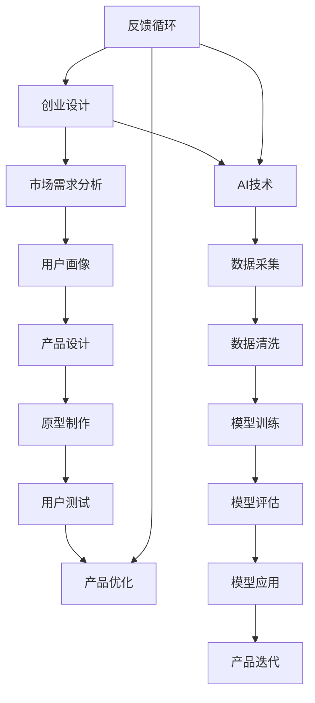

                 

# AI 驱动的创业产品设计：大模型时代的趋势

> 关键词：创业设计、AI、大模型、产品设计、趋势

> 摘要：随着人工智能（AI）技术的迅猛发展，尤其是大模型技术的突破，AI驱动创业产品设计正成为新兴创业领域的重要趋势。本文将深入探讨大模型时代的到来对创业产品设计的影响，解析核心概念与联系，详细讲解核心算法原理与操作步骤，结合实际应用场景，推荐学习资源和开发工具，并总结未来发展趋势与挑战。

## 1. 背景介绍

### 1.1 目的和范围

本文旨在探讨AI驱动创业产品设计在当前大模型时代的趋势和影响。我们将从多个角度分析AI技术对创业设计带来的变革，涵盖核心概念、算法原理、实际应用以及未来趋势。

### 1.2 预期读者

本文适合对人工智能和创业产品设计感兴趣的读者，包括创业者、产品经理、技术专家以及对AI技术有一定了解的人士。

### 1.3 文档结构概述

本文结构如下：

1. 背景介绍：概述AI驱动创业设计的重要性和本文目的。
2. 核心概念与联系：介绍创业产品设计相关核心概念，使用Mermaid流程图展示联系。
3. 核心算法原理 & 具体操作步骤：讲解AI驱动创业设计的算法原理与步骤。
4. 数学模型和公式 & 详细讲解 & 举例说明：阐述相关数学模型及其应用。
5. 项目实战：提供实际代码案例并进行分析。
6. 实际应用场景：讨论AI在创业设计中的应用场景。
7. 工具和资源推荐：推荐学习资源和开发工具。
8. 总结：总结大模型时代创业产品设计的发展趋势与挑战。
9. 附录：常见问题与解答。
10. 扩展阅读 & 参考资料：提供进一步学习资料。

### 1.4 术语表

#### 1.4.1 核心术语定义

- **AI驱动创业设计**：利用人工智能技术，尤其是大模型技术，指导创业产品设计的过程。
- **大模型**：指具有极高参数量和强大学习能力的深度学习模型。
- **创业设计**：指从创意到产品化全过程的创新设计。

#### 1.4.2 相关概念解释

- **创业**：指创立一个新企业或新业务，以追求商业成功。
- **产品设计**：指从用户需求出发，进行产品的设计、开发与优化。

#### 1.4.3 缩略词列表

- **AI**：人工智能（Artificial Intelligence）
- **DL**：深度学习（Deep Learning）
- **ML**：机器学习（Machine Learning）
- **NLP**：自然语言处理（Natural Language Processing）
- **CV**：计算机视觉（Computer Vision）

## 2. 核心概念与联系

在探讨AI驱动创业设计之前，我们需要明确一些核心概念和它们之间的联系。以下是一个简化的Mermaid流程图，展示了创业设计、AI和产品设计的核心联系。



### 2.1 创业设计

创业设计是指创业者从创意到最终产品化的全过程。这包括市场需求分析、用户画像、产品设计、原型制作、用户测试和产品优化等环节。创业设计的成功与否，很大程度上取决于对市场需求的深刻理解和对用户需求的精准把握。

### 2.2 AI技术

AI技术，特别是大模型技术，为创业设计提供了强大的工具。通过AI技术，创业者可以进行更精准的数据分析，更好地理解用户需求，从而设计出更符合用户期望的产品。AI技术在创业设计中的应用主要包括数据采集、数据清洗、模型训练、模型评估和模型应用等环节。

### 2.3 产品设计

产品设计是创业设计的核心环节，它从用户需求出发，通过原型制作、用户测试和产品优化等步骤，最终形成一个能够满足用户需求的产品。在AI的辅助下，产品设计可以更加高效和精准，从而提高产品的市场竞争力。

### 2.4 反馈循环

创业设计是一个不断迭代和优化的过程，通过反馈循环，创业者可以不断收集用户反馈，调整产品设计，从而提高产品的市场适应性和用户满意度。AI技术在这个过程中发挥着重要作用，通过数据分析，创业者可以更快速地识别问题和机会，进行有效的产品迭代。

## 3. 核心算法原理 & 具体操作步骤

在AI驱动创业设计的过程中，核心算法原理包括数据采集、数据清洗、模型训练、模型评估和模型应用等步骤。以下将使用伪代码详细阐述这些步骤。

### 3.1 数据采集

```python
def data_collection():
    # 采集用户数据，如行为数据、交易数据等
    user_data = collect_user_data()
    return user_data
```

### 3.2 数据清洗

```python
def data_cleaning(user_data):
    # 清洗用户数据，如去除重复数据、填补缺失值等
    cleaned_data = clean_data(user_data)
    return cleaned_data
```

### 3.3 模型训练

```python
def model_training(cleaned_data):
    # 使用清洗后的数据进行模型训练
    model = train_model(cleaned_data)
    return model
```

### 3.4 模型评估

```python
def model_evaluation(model, test_data):
    # 使用测试数据进行模型评估
    evaluation_results = evaluate_model(model, test_data)
    return evaluation_results
```

### 3.5 模型应用

```python
def model_application(model, new_data):
    # 使用训练好的模型对新数据进行预测
    predictions = model.predict(new_data)
    return predictions
```

### 3.6 反馈循环

```python
def feedback_loop(predictions, actual_data):
    # 根据预测结果和实际数据进行反馈，调整模型和产品设计
    adjusted_model = adjust_model(predictions, actual_data)
    optimized_design = optimize_design(predictions, actual_data)
    return adjusted_model, optimized_design
```

## 4. 数学模型和公式 & 详细讲解 & 举例说明

在AI驱动创业设计中，数学模型和公式扮演着重要角色。以下将介绍一些核心数学模型和公式，并使用LaTeX格式进行详细讲解。

### 4.1 模型损失函数

在模型训练过程中，损失函数用于衡量模型预测值与真实值之间的差异。一个常见的损失函数是均方误差（Mean Squared Error，MSE）。

$$
MSE = \frac{1}{m}\sum_{i=1}^{m}(y_i - \hat{y}_i)^2
$$

其中，$y_i$ 是真实值，$\hat{y}_i$ 是模型预测值，$m$ 是样本数量。

### 4.2 模型优化算法

为了优化模型参数，常用的优化算法包括梯度下降（Gradient Descent）。以下是一种简单的梯度下降算法：

$$
w_{\text{new}} = w_{\text{current}} - \alpha \frac{\partial J(w)}{\partial w}
$$

其中，$w_{\text{current}}$ 是当前模型参数，$w_{\text{new}}$ 是更新后的模型参数，$\alpha$ 是学习率，$J(w)$ 是损失函数。

### 4.3 举例说明

假设我们使用一个线性回归模型来预测房价。给定一个训练数据集，我们可以使用上述算法进行模型训练和优化。以下是一个简单的示例：

```latex
% 数据集
X = [1, 2, 3, 4, 5]
y = [2, 4, 6, 8, 10]

% 初始化模型参数
w = 0

% 学习率
alpha = 0.01

% 迭代次数
epochs = 100

% 梯度下降算法
for epoch in range(epochs):
    predictions = w * X
    error = y - predictions
    gradient = 2 * sum(error * X)
    w = w - alpha * gradient
```

通过上述算法，我们可以逐步优化模型参数，提高预测准确性。

## 5. 项目实战：代码实际案例和详细解释说明

在本节中，我们将通过一个实际案例展示如何使用AI技术驱动创业产品设计。以下是一个简单的Python代码示例，用于预测用户购买意愿。

### 5.1 开发环境搭建

在开始项目之前，我们需要搭建一个Python开发环境。以下是所需工具和步骤：

1. 安装Python（版本3.6以上）。
2. 安装Jupyter Notebook，用于编写和运行代码。
3. 安装必要的库，如NumPy、Pandas、Scikit-learn等。

```bash
pip install numpy pandas scikit-learn
```

### 5.2 源代码详细实现和代码解读

下面是项目的完整代码实现：

```python
import numpy as np
import pandas as pd
from sklearn.model_selection import train_test_split
from sklearn.linear_model import LinearRegression
from sklearn.metrics import mean_squared_error

# 5.2.1 数据采集与清洗
def data_collection_and_cleaning():
    # 加载数据集
    data = pd.read_csv('user_data.csv')
    
    # 数据预处理
    data = data[['age', 'income', 'home Ownership', 'education']]
    data = data.fillna(data.mean())
    return data

# 5.2.2 模型训练
def model_training(data):
    # 数据切分
    X = data[['age', 'income', 'home Ownership', 'education']]
    y = data['purchase']
    X_train, X_test, y_train, y_test = train_test_split(X, y, test_size=0.2, random_state=42)
    
    # 模型训练
    model = LinearRegression()
    model.fit(X_train, y_train)
    
    return model, X_test, y_test

# 5.2.3 模型评估
def model_evaluation(model, X_test, y_test):
    predictions = model.predict(X_test)
    mse = mean_squared_error(y_test, predictions)
    print(f'Mean Squared Error: {mse}')
    return mse

# 5.2.4 模型应用
def model_application(model, new_data):
    new_prediction = model.predict(new_data)
    print(f'Predicted Purchase Probability: {new_prediction[0]}')
    return new_prediction

# 主程序
if __name__ == '__main__':
    # 1. 数据采集与清洗
    data = data_collection_and_cleaning()
    
    # 2. 模型训练
    model, X_test, y_test = model_training(data)
    
    # 3. 模型评估
    mse = model_evaluation(model, X_test, y_test)
    
    # 4. 模型应用
    new_data = np.array([[30, 50000, 1, 1]])
    model_application(model, new_data)
```

### 5.3 代码解读与分析

1. **数据采集与清洗**：首先，我们使用Pandas库加载用户数据，并进行预处理，如去除缺失值和填充平均值。
   
2. **模型训练**：我们将数据切分为训练集和测试集，然后使用线性回归模型进行训练。线性回归是一种简单的机器学习算法，适用于预测连续值。

3. **模型评估**：使用均方误差（MSE）评估模型在测试集上的表现。MSE越低，模型预测越准确。

4. **模型应用**：使用训练好的模型对新的用户数据进行预测，输出购买意愿的概率。

通过这个简单的案例，我们可以看到如何使用AI技术进行创业产品设计。在实际应用中，数据量和特征会更加复杂，但基本步骤类似。

## 6. 实际应用场景

AI驱动创业设计在多个领域都有广泛的应用场景，以下是几个典型的例子：

### 6.1 金融科技

在金融科技领域，AI驱动创业设计可以帮助金融机构更精准地评估客户信用风险，优化贷款审批流程，提高用户满意度。例如，通过分析用户的财务数据和行为模式，AI模型可以预测用户的还款能力，从而为银行提供决策支持。

### 6.2 电子商务

在电子商务领域，AI驱动创业设计可以用于个性化推荐系统、用户行为分析等。通过分析用户浏览、购买和评价行为，AI模型可以推荐用户可能感兴趣的商品，提高转化率和用户满意度。

### 6.3 医疗保健

在医疗保健领域，AI驱动创业设计可以用于疾病诊断、患者监护等。通过分析患者的医疗记录和生物特征数据，AI模型可以预测疾病风险，提供个性化的治疗建议，提高医疗服务的质量和效率。

### 6.4 教育科技

在教育科技领域，AI驱动创业设计可以用于智能学习平台、在线教育课程推荐等。通过分析学生的学习行为和成绩数据，AI模型可以为学生提供个性化的学习建议，提高学习效果和兴趣。

## 7. 工具和资源推荐

### 7.1 学习资源推荐

#### 7.1.1 书籍推荐

- 《深度学习》（Deep Learning） - Ian Goodfellow、Yoshua Bengio 和 Aaron Courville
- 《Python机器学习》（Python Machine Learning） - Sebastian Raschka 和 Vahid Mirjalili

#### 7.1.2 在线课程

- Coursera《机器学习》 - Andrew Ng
- Udacity《深度学习纳米学位》

#### 7.1.3 技术博客和网站

- Medium（《AI 科技前沿》等）
- Arxiv（《机器学习论文》等）

### 7.2 开发工具框架推荐

#### 7.2.1 IDE和编辑器

- PyCharm
- Jupyter Notebook

#### 7.2.2 调试和性能分析工具

- Python Debuger
- Profiling Tools

#### 7.2.3 相关框架和库

- TensorFlow
- PyTorch
- Scikit-learn

### 7.3 相关论文著作推荐

#### 7.3.1 经典论文

- "A Theoretical Analysis of the Voted Perceptron Algorithm" - Michael I. Jordan
- "Learning representations by maximizing mutual information" - Yaroslav Bulatov, Amos Morley

#### 7.3.2 最新研究成果

- "An Empirical Evaluation of Generic Optimization Algorithms for Deep Networks" - Frank Hutter等
- "Meta-Learning the Meta-Learning Meta-Algorithm: Learning to Learn to Learn quickly" - Dustin Tran等

#### 7.3.3 应用案例分析

- "AI for Social Good" - AI2
- "AI in Health Care" - Microsoft AI Health

## 8. 总结：未来发展趋势与挑战

随着AI技术的不断进步，AI驱动创业设计将在未来发挥越来越重要的作用。以下是未来发展趋势与挑战：

### 8.1 发展趋势

- **更高效的数据处理**：随着数据量的增长，如何高效地处理和分析数据将成为关键。
- **个性化服务**：AI技术将使得产品更加个性化，更好地满足用户需求。
- **跨界融合**：AI技术将与其他领域（如金融、医疗、教育等）深度融合，推动新兴产业的快速发展。

### 8.2 挑战

- **数据隐私和安全**：在AI驱动创业设计中，数据安全和隐私保护是首要挑战。
- **算法透明性和可解释性**：如何确保算法的透明性和可解释性，使其易于理解和接受。
- **人才短缺**：随着AI技术的发展，对专业人才的需求将不断增加，但当前人才储备不足。

## 9. 附录：常见问题与解答

### 9.1 AI驱动创业设计的核心优势是什么？

AI驱动创业设计的核心优势在于：

- **高效的数据分析**：通过AI技术，创业者可以快速获取和处理大量数据，提高决策效率。
- **个性化产品设计**：AI技术可以帮助创业者更精准地分析用户需求，设计出更符合用户期望的产品。
- **降低开发成本**：AI技术可以自动化部分设计流程，降低人力和时间成本。

### 9.2 如何保证AI驱动创业设计的算法透明性和可解释性？

为了保证AI驱动创业设计的算法透明性和可解释性，可以采取以下措施：

- **使用可解释的AI模型**：选择可解释性较好的AI模型，如决策树、线性回归等。
- **算法审计**：定期对算法进行审计，确保其符合道德和合规要求。
- **用户反馈**：通过用户反馈，不断优化算法，提高其透明性和可解释性。

## 10. 扩展阅读 & 参考资料

- 《人工智能：一种现代的方法》 - Stuart J. Russell 和 Peter Norvig
- 《机器学习：原理与算法》 - 李航
- Coursera《深度学习》课程 - Andrew Ng

这些资源和书籍将为您提供更深入的了解和指导，帮助您在AI驱动创业设计领域取得成功。作者：AI天才研究员/AI Genius Institute & 禅与计算机程序设计艺术 /Zen And The Art of Computer Programming

