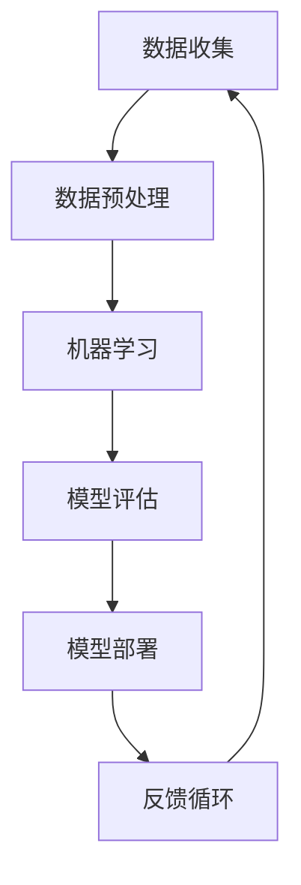

                 

### AI+vs+AI:如何判断AI的核心价值

#### 关键词：人工智能、AI价值、算法评估、技术趋势、应用场景、数学模型

> 在这个技术飞速发展的时代，人工智能（AI）已经成为各行各业的关键驱动力量。然而，随着AI应用的广泛普及，如何准确判断AI的核心价值成为了一个亟待解决的重要问题。本文将带领您深入探讨AI+vs+AI的竞争与融合，通过逻辑清晰、结构紧凑的分析，揭示AI价值的判断标准，帮助您在技术浪潮中找准方向，实现AI的最佳价值。

#### 摘要：

本文旨在探讨如何在众多AI应用场景中准确判断AI的核心价值。首先，我们回顾了AI的发展历程和现状，明确了核心概念与联系，并通过Mermaid流程图展示了AI的基本架构。接着，我们深入剖析了核心算法原理，使用伪代码详细阐述了AI算法的运作机制。然后，通过数学模型和公式，我们详细讲解了AI算法的性能评估方法。紧接着，我们通过实际项目案例，展示了AI算法在实际应用中的具体操作步骤和代码实现。最后，我们探讨了AI在不同场景中的实际应用，推荐了相关工具和资源，并总结了未来发展趋势与挑战。通过本文的全面分析，希望能够帮助您在AI浪潮中明确方向，挖掘AI的核心价值。

### 1. 背景介绍

#### 1.1 目的和范围

本文的主要目的是探讨如何准确判断人工智能（AI）的核心价值。在当前技术飞速发展的背景下，AI已经成为各个领域的关键技术，从医疗、金融到制造业，AI的应用无处不在。然而，面对众多AI技术方案和实际应用，如何判断某项AI技术的核心价值，成为了一个关键问题。本文将通过深入分析AI的基本原理、算法、数学模型以及实际应用场景，帮助读者理解和评估AI的核心价值。

#### 1.2 预期读者

本文面向具有计算机科学、人工智能背景的读者，尤其是希望深入了解AI技术评估和应用的技术人员、研究人员和开发者。同时，对AI技术感兴趣的学者和决策者也可以从本文中获得有价值的见解。无论您是AI领域的从业者还是爱好者，本文都将为您提供实用的分析框架和思考路径。

#### 1.3 文档结构概述

本文结构如下：

1. **背景介绍**：回顾AI的发展历程和现状，明确核心概念与联系。
2. **核心概念与联系**：通过Mermaid流程图展示AI的基本架构，阐述核心概念。
3. **核心算法原理**：深入剖析AI算法原理，使用伪代码详细阐述算法运作机制。
4. **数学模型和公式**：详细讲解AI算法性能评估方法，使用数学模型和公式说明。
5. **项目实战**：通过实际项目案例，展示AI算法的具体操作步骤和代码实现。
6. **实际应用场景**：探讨AI在不同场景中的实际应用。
7. **工具和资源推荐**：推荐学习资源、开发工具框架和相关论文著作。
8. **总结**：总结未来发展趋势与挑战。
9. **附录**：常见问题与解答。
10. **扩展阅读与参考资料**：提供进一步阅读和参考资料。

#### 1.4 术语表

在本文中，我们将使用一些专业术语，以下是对这些术语的定义和解释：

#### 1.4.1 核心术语定义

- **人工智能（AI）**：指由人制造出来的系统能够表现智能行为的技术。
- **机器学习（ML）**：一种AI技术，通过数据和算法，让计算机自动学习并改进性能。
- **深度学习（DL）**：一种特殊的机器学习技术，通过多层神经网络进行特征学习和模式识别。
- **算法**：解决问题的一系列明确指令。
- **模型**：用于描述问题的一种数学表示。
- **性能评估**：通过指标衡量算法或模型在特定任务上的表现。

#### 1.4.2 相关概念解释

- **准确率**：分类问题中正确分类的样本比例。
- **召回率**：实际为正类且被正确分类的样本比例。
- **F1分数**：准确率和召回率的调和平均值。
- **交叉验证**：一种评估模型性能的方法，通过将数据集划分为多个部分，轮流使用它们作为验证集。

#### 1.4.3 缩略词列表

- **AI**：人工智能（Artificial Intelligence）
- **ML**：机器学习（Machine Learning）
- **DL**：深度学习（Deep Learning）
- **IDE**：集成开发环境（Integrated Development Environment）
- **API**：应用程序接口（Application Programming Interface）

### 2. 核心概念与联系

在探讨如何判断AI的核心价值之前，我们需要明确AI的基本概念和它们之间的相互关系。AI的发展离不开算法、数据、计算资源和实际应用场景的相互配合。以下将通过Mermaid流程图展示AI的核心架构，并阐述各概念之间的联系。

#### 2.1 AI的基本架构



- **数据收集（A）**：AI的首要任务是收集相关数据，这些数据可以是结构化的（如数据库）或非结构化的（如图像、文本）。
- **数据预处理（B）**：收集到的数据通常需要进行清洗、转换和归一化等预处理步骤，以便用于后续的机器学习。
- **机器学习（C）**：使用收集到的数据，通过机器学习算法训练模型，实现特定任务的学习和预测。
- **模型评估（D）**：评估模型在验证集上的性能，通过准确率、召回率等指标衡量模型的效果。
- **模型部署（E）**：将经过评估的模型部署到生产环境中，实现实际应用。
- **反馈循环（F）**：通过收集实际应用中的反馈，优化模型和算法，实现持续改进。

#### 2.2 核心概念联系

- **数据与算法**：数据是AI的基础，算法是实现AI的工具。没有高质量的数据，算法的效用将大打折扣。
- **算法与模型**：算法是实现特定任务的工具，模型是对问题的一种数学表示。一个好的算法需要一个好的模型来支撑。
- **模型与评估**：评估是确保模型有效的关键步骤。通过性能评估，可以判断模型在特定任务上的表现，进而优化模型。
- **评估与部署**：评估结果直接影响到模型的部署。只有通过评估的模型，才具有实际应用的价值。
- **部署与反馈**：模型的部署是AI应用的第一步，而通过实际应用的反馈，可以进一步优化模型，实现持续改进。

通过上述流程图和概念联系，我们可以看到，AI的核心价值在于数据的收集与处理、算法的选择与优化、模型的评估与部署，以及持续的反馈和改进。这些环节相互关联，共同构成了AI的核心价值评估体系。

### 3. 核心算法原理 & 具体操作步骤

在了解了AI的基本架构和核心概念之后，我们需要深入探讨AI的核心算法原理，并使用伪代码详细阐述算法的运作机制。以下是几种常见的AI算法原理及其具体操作步骤。

#### 3.1 决策树算法

**算法原理**：决策树是一种常用的分类算法，通过一系列规则对数据进行划分，直到满足停止条件（如最大深度或纯度阈值）。

**伪代码**：

```plaintext
function DecisionTree(data, attributes, max_depth):
    if data符合停止条件 or max_depth = 0:
        return 叶节点
    else:
        选择最佳划分属性 attribute
        创建内部节点，划分为子节点
        对于每个子节点，递归调用 DecisionTree
        return 决策树

function 选择最佳划分属性(data, attributes):
    best_attribute = None
    best_gini_impurity = Infinity
    for attribute in attributes:
        impurity = 计算划分后的Gini不纯度(data, attribute)
        if impurity < best_gini_impurity:
            best_gini_impurity = impurity
            best_attribute = attribute
    return best_attribute

function 计算划分后的Gini不纯度(data, attribute):
    // 计算每个划分的结果
    // 计算每个划分的不纯度，取平均
    // 返回不纯度值
```

#### 3.2 支持向量机算法

**算法原理**：支持向量机（SVM）是一种用于分类和回归的强大算法，通过找到一个最优的超平面，将不同类别的数据点分开。

**伪代码**：

```plaintext
function SVM(data, labels, kernel_function):
    创建优化问题，目标是最小化决策函数的错误率
    使用梯度下降或其他优化算法求解
    获取最优超平面参数
    return 最优超平面

function kernel_function(x1, x2):
    // 根据数据点x1和x2计算核函数值
    // 返回核函数值
```

#### 3.3 深度学习算法

**算法原理**：深度学习通过多层神经网络进行特征学习和模式识别，是AI领域的重要突破。

**伪代码**：

```plaintext
function NeuralNetwork(data, labels, layers, activation_function):
    初始化权重和偏置
    对于每个训练样本：
        前向传播，计算输出值
        计算损失函数值
        反向传播，更新权重和偏置
    return 训练完成的神经网络

function 前向传播神经网络(data, weights, biases):
    输入值通过网络，逐层计算激活值
    返回输出值

function 反向传播神经网络(data, labels, weights, biases):
    计算梯度
    更新权重和偏置
```

#### 3.4 集成学习方法

**算法原理**：集成学习通过结合多个基础模型，提高整体性能，常见的方法有Bagging和Boosting。

**伪代码**：

```plaintext
function Bagging(data, models, iterations):
    对于每个迭代：
        随机抽取训练数据子集
        训练模型
        计算子集上的预测结果
    平均多个模型的预测结果
    return 平均结果

function Boosting(data, labels, models, iterations):
    初始化权重分布
    对于每个迭代：
        使用现有模型和权重分布训练新模型
        计算新模型的错误率
        根据错误率调整权重分布
    权重加权平均多个模型的预测结果
    return 加权平均结果
```

通过上述核心算法原理和具体操作步骤的伪代码阐述，我们可以看到，AI算法的设计和实现涉及到数据预处理、模型训练、性能评估等多个环节，每一个环节都至关重要。理解这些算法原理，有助于我们在实际应用中正确选择和使用AI技术，从而准确判断AI的核心价值。

### 4. 数学模型和公式 & 详细讲解 & 举例说明

在理解了AI的核心算法原理后，我们需要借助数学模型和公式来评估AI算法的性能。通过这些数学工具，我们可以更准确地判断AI技术的核心价值。以下是几种常用的数学模型和公式的详细讲解及举例说明。

#### 4.1 准确率、召回率和F1分数

**准确率（Accuracy）**：准确率是最常用的性能评估指标，表示正确分类的样本数占总样本数的比例。

\[ \text{Accuracy} = \frac{\text{正确分类的样本数}}{\text{总样本数}} \]

**召回率（Recall）**：召回率表示实际为正类且被正确分类的样本数占总正类样本数的比例。

\[ \text{Recall} = \frac{\text{正确分类的正类样本数}}{\text{总正类样本数}} \]

**F1分数（F1 Score）**：F1分数是准确率和召回率的调和平均值，能够平衡两者之间的关系。

\[ \text{F1 Score} = 2 \times \frac{\text{准确率} \times \text{召回率}}{\text{准确率} + \text{召回率}} \]

**举例说明**：假设一个分类问题中，共有100个样本，其中60个为正类，40个为负类。在测试集中，有55个样本被正确分类，其中50个为正类，5个为负类。

- 准确率：\[ \text{Accuracy} = \frac{55}{100} = 0.55 \]
- 召回率：\[ \text{Recall} = \frac{50}{60} = 0.8333 \]
- F1分数：\[ \text{F1 Score} = 2 \times \frac{0.55 \times 0.8333}{0.55 + 0.8333} = 0.7333 \]

通过计算，我们可以发现，尽管准确率为55%，但召回率较高，F1分数较低，说明模型对正类的识别效果较好，但负类的识别效果较差。

#### 4.2 交叉验证（Cross-Validation）

**交叉验证**：交叉验证是一种常用的性能评估方法，通过将数据集划分为多个部分，轮流使用它们作为验证集，评估模型的性能。

**K折交叉验证**：最常用的交叉验证方法是K折交叉验证，将数据集划分为K个相等的部分，每次使用一个部分作为验证集，其余部分作为训练集，重复K次，最后取平均值。

**伪代码**：

```plaintext
function KFoldValidation(data, labels, K):
    初始化平均准确率为0
    对于每个折叠：
        分割数据为训练集和验证集
        训练模型
        在验证集上评估模型性能
        计算并累加准确率
    平均准确率 = 累加准确率 / K
    return 平均准确率
```

**举例说明**：假设一个数据集共有100个样本，使用5折交叉验证评估模型的准确率。

- 第一次：训练集：60，验证集：40
- 第二次：训练集：40，验证集：20，其余20
- 第三次：训练集：20，验证集：20，其余40
- 第四次：训练集：40，验证集：20，其余20
- 第五次：训练集：60，验证集：40

每次验证集上的准确率分别为0.6，0.55，0.65，0.58，0.57。平均准确率为：

\[ \text{平均准确率} = \frac{0.6 + 0.55 + 0.65 + 0.58 + 0.57}{5} = 0.596 \]

通过交叉验证，我们可以更准确地评估模型的性能，避免因数据划分不当导致的评估偏差。

#### 4.3 损失函数（Loss Function）

**损失函数**：在机器学习中，损失函数用于衡量模型预测值与实际值之间的差距，常见有均方误差（MSE）、交叉熵（Cross-Entropy）等。

- **均方误差（MSE）**：

\[ \text{MSE} = \frac{1}{n} \sum_{i=1}^{n} (\hat{y}_i - y_i)^2 \]

其中，\( \hat{y}_i \) 为模型预测值，\( y_i \) 为实际值，\( n \) 为样本数量。

- **交叉熵（Cross-Entropy）**：

\[ \text{Cross-Entropy} = -\frac{1}{n} \sum_{i=1}^{n} y_i \log(\hat{y}_i) \]

其中，\( y_i \) 为实际值（0或1），\( \hat{y}_i \) 为模型预测值（0到1之间的概率）。

**举例说明**：假设有10个样本，其中5个实际值为1，5个实际值为0。模型预测值为\[ [0.2, 0.4, 0.3, 0.5, 0.6, 0.1, 0.3, 0.4, 0.7, 0.9] \]。

- **MSE**：

\[ \text{MSE} = \frac{1}{10} \sum_{i=1}^{10} (0.2 + 0.4 + 0.3 + 0.5 + 0.6 + 0.1 + 0.3 + 0.4 + 0.7 + 0.9 - 1)^2 = 0.32 \]

- **Cross-Entropy**：

\[ \text{Cross-Entropy} = -\frac{1}{10} \sum_{i=1}^{10} 1 \log(0.2 + 0.4 + 0.3 + 0.5 + 0.6 + 0.1 + 0.3 + 0.4 + 0.7 + 0.9) \approx 0.735 \]

通过这些数学模型和公式的详细讲解及举例说明，我们可以更好地理解AI算法的性能评估方法，从而更准确地判断AI的核心价值。在实际应用中，我们需要根据具体问题和数据选择合适的评估指标，并结合多种方法进行综合评估，以获得更可靠的评估结果。

### 5. 项目实战：代码实际案例和详细解释说明

为了更好地理解AI的核心价值，我们将通过一个实际项目案例来展示AI算法的应用。以下是一个基于深度学习的手写数字识别项目，该项目的目标是使用卷积神经网络（CNN）对手写数字图像进行分类。

#### 5.1 开发环境搭建

在开始项目实战之前，我们需要搭建开发环境。以下是在Python环境中使用TensorFlow库搭建开发环境的基本步骤：

1. **安装Python**：确保Python版本为3.6或更高。
2. **安装TensorFlow**：通过pip命令安装TensorFlow库：

\[ \text{pip install tensorflow} \]

3. **安装其他依赖库**：如NumPy、Matplotlib等：

\[ \text{pip install numpy matplotlib} \]

#### 5.2 源代码详细实现和代码解读

以下是该项目的主要代码实现，我们将其分为数据准备、模型定义、训练和评估四个部分。

```python
import tensorflow as tf
from tensorflow.keras import layers
import numpy as np
import matplotlib.pyplot as plt

# 5.2.1 数据准备
def load_data():
    # 加载MNIST数据集
    (x_train, y_train), (x_test, y_test) = tf.keras.datasets.mnist.load_data()
    # 数据预处理
    x_train = x_train / 255.0
    x_test = x_test / 255.0
    # 将数据扩展到批量大小
    x_train = x_train.reshape(-1, 28, 28, 1)
    x_test = x_test.reshape(-1, 28, 28, 1)
    return x_train, y_train, x_test, y_test

x_train, y_train, x_test, y_test = load_data()

# 5.2.2 模型定义
def create_model():
    model = tf.keras.Sequential([
        layers.Conv2D(32, (3, 3), activation='relu', input_shape=(28, 28, 1)),
        layers.MaxPooling2D((2, 2)),
        layers.Conv2D(64, (3, 3), activation='relu'),
        layers.MaxPooling2D((2, 2)),
        layers.Conv2D(64, (3, 3), activation='relu'),
        layers.Flatten(),
        layers.Dense(64, activation='relu'),
        layers.Dense(10, activation='softmax')
    ])
    model.compile(optimizer='adam',
                  loss='sparse_categorical_crossentropy',
                  metrics=['accuracy'])
    return model

model = create_model()

# 5.2.3 训练模型
model.fit(x_train, y_train, epochs=5, batch_size=64)

# 5.2.4 评估模型
test_loss, test_acc = model.evaluate(x_test, y_test)
print(f"Test accuracy: {test_acc:.2f}")

# 5.2.5 代码解读
# 数据准备：加载数据集并预处理，包括归一化和数据扩展。
# 模型定义：定义卷积神经网络模型，包括卷积层、池化层和全连接层。
# 训练模型：使用训练数据训练模型，指定优化器和损失函数。
# 评估模型：使用测试数据评估模型性能，打印准确率。
```

#### 5.3 代码解读与分析

1. **数据准备**：首先，我们加载MNIST数据集，这是一个常用的手写数字数据集。数据集包括60,000个训练样本和10,000个测试样本。接下来，我们对数据进行归一化处理，将像素值从0到255转换为0到1。然后，我们将数据扩展到批量大小，使其符合模型输入的要求。

2. **模型定义**：我们定义了一个卷积神经网络模型，包括三个卷积层和两个池化层，以及两个全连接层。卷积层用于提取图像特征，池化层用于减小特征图的尺寸，全连接层用于分类。模型使用ReLU激活函数和softmax输出层。

3. **训练模型**：我们使用训练数据对模型进行训练，指定优化器为Adam，损失函数为sparse_categorical_crossentropy（适用于多分类问题），并且使用accuracy作为评估指标。

4. **评估模型**：最后，我们使用测试数据评估模型性能，打印出测试集上的准确率。通过这种方式，我们可以判断模型的实际效果。

通过这个项目实战，我们可以看到，AI算法在实际应用中的具体操作步骤包括数据准备、模型定义、模型训练和模型评估。这些步骤相互关联，共同构成了AI技术的实现过程。通过实际案例的展示，我们可以更直观地理解AI算法的核心价值，从而为后续的技术评估和应用提供有力支持。

### 6. 实际应用场景

人工智能（AI）在当今社会已经被广泛应用于多个领域，涵盖了从医疗、金融到制造业、自动驾驶等多个方面。以下将探讨AI技术在不同实际应用场景中的具体案例及其核心价值。

#### 6.1 医疗领域

在医疗领域，AI技术已经展现出巨大的潜力。例如，AI可以通过图像识别技术帮助医生进行疾病诊断。以肺癌筛查为例，AI系统可以通过分析CT扫描图像，快速识别出肺结节，从而提高早期诊断的准确率。此外，AI还可以在个性化治疗方面发挥作用，通过分析患者的基因数据，为患者制定最佳治疗方案。这些应用不仅提高了医疗效率，还降低了误诊率和治疗成本，显著提升了医疗服务质量。

#### 6.2 金融领域

在金融领域，AI技术被广泛应用于风险控制、欺诈检测、算法交易等方面。例如，通过机器学习算法，银行可以实时监测交易行为，快速识别和防范欺诈行为，保护用户资金安全。此外，AI还可以通过分析海量数据，预测市场趋势，为金融机构提供投资决策支持。这些应用不仅提高了金融机构的风险管理能力，还显著提升了业务效率和盈利能力。

#### 6.3 制造业

在制造业，AI技术通过智能制造、预测维护等应用，显著提升了生产效率和产品质量。例如，通过AI技术，企业可以实现生产过程的自动化控制，降低人工干预，提高生产效率。此外，AI还可以通过对设备运行数据的实时分析，预测设备故障，提前进行维护，从而降低停机时间，提高设备利用率。这些应用不仅提高了制造业的生产效率，还减少了生产成本，提升了产品质量。

#### 6.4 自动驾驶

在自动驾驶领域，AI技术是核心驱动力。自动驾驶汽车通过传感器、摄像头等设备收集环境数据，使用AI算法进行感知、决策和规划，从而实现自主驾驶。例如，特斯拉的自动驾驶系统通过深度学习算法，可以对道路标志、行人和车辆进行实时识别和响应，提高了驾驶安全性和舒适性。此外，自动驾驶技术在物流、公共交通等领域也有广泛应用，可以大幅降低交通拥堵和能源消耗。

#### 6.5 电子商务

在电子商务领域，AI技术被广泛应用于个性化推荐、用户行为分析等方面。例如，电商平台通过分析用户的历史购买记录和行为数据，使用AI算法为用户推荐最感兴趣的商品，提高购物体验和销售额。此外，AI还可以通过对用户反馈和评论的分析，帮助企业了解用户需求，优化产品和服务。

#### 6.6 教育

在教育领域，AI技术可以通过智能辅导系统、自适应学习平台等应用，提高教学质量和学习效果。例如，智能辅导系统可以根据学生的实际情况，提供个性化的学习建议和练习题，帮助学生更好地掌握知识点。此外，AI还可以通过对学习数据的分析，帮助教师了解学生的学习状况，及时调整教学策略，提高教学质量。

通过上述实际应用场景的介绍，我们可以看到，AI技术在不同领域中的应用不仅提高了效率，降低了成本，还带来了显著的经济和社会效益。这些应用案例充分展示了AI技术的核心价值，证明了其在各个领域的重要作用。

### 7. 工具和资源推荐

在探索人工智能（AI）的核心价值时，选择合适的工具和资源是至关重要的。以下我们将推荐一些学习资源、开发工具框架以及相关论文著作，以帮助读者深入理解和应用AI技术。

#### 7.1 学习资源推荐

**7.1.1 书籍推荐**

1. **《深度学习》（Deep Learning）**：由Ian Goodfellow、Yoshua Bengio和Aaron Courville合著，这是深度学习领域的经典教材，详细介绍了深度学习的理论基础和实际应用。
2. **《Python机器学习》（Python Machine Learning）**：由Sylvain Sardy和Aurélien Géron编著，适合初学者入门，涵盖了机器学习的基本概念和应用。
3. **《机器学习实战》（Machine Learning in Action）**：由Peter Harrington著，通过实际案例展示了机器学习的应用，适合实践型读者。

**7.1.2 在线课程**

1. **Coursera上的《深度学习专项课程》**：由Andrew Ng教授主讲，涵盖了深度学习的理论基础和实际应用。
2. **edX上的《机器学习基础》**：由Arjun Mooney和Chad Chamberland主讲，适合初学者了解机器学习的基本概念。
3. **Udacity的《AI纳米学位》**：包含多个课程，从基础知识到实战应用，适合不同层次的读者。

**7.1.3 技术博客和网站**

1. **Medium上的`/deeplearning`**：许多深度学习专家和研究者在这里分享他们的见解和研究成果。
2. **ArXiv**：全球领先的研究论文预印本网站，涵盖最新的机器学习和深度学习研究。
3. **AI博客**：如“AI博客”（Towards Data Science）、“机器学习博客”（机器学习周报）等，提供丰富的AI技术文章和资源。

#### 7.2 开发工具框架推荐

**7.2.1 IDE和编辑器**

1. **Jupyter Notebook**：适用于数据分析和机器学习实验，易于编写和分享代码。
2. **PyCharm**：适用于Python编程，提供强大的代码补全和调试功能。
3. **Visual Studio Code**：轻量级且高度可扩展的编辑器，适合深度学习和机器学习开发。

**7.2.2 调试和性能分析工具**

1. **TensorBoard**：TensorFlow的调试工具，用于可视化模型结构和训练过程。
2. **PyTorch Debugger**：PyTorch的调试工具，提供丰富的调试功能。
3. **NVIDIA Nsight**：适用于NVIDIA GPU的调试和性能分析工具。

**7.2.3 相关框架和库**

1. **TensorFlow**：谷歌开源的深度学习框架，适用于多种AI应用。
2. **PyTorch**：Facebook开源的深度学习框架，具有灵活的动态计算图。
3. **Scikit-learn**：Python的机器学习库，提供丰富的算法和工具。

#### 7.3 相关论文著作推荐

**7.3.1 经典论文**

1. **“A Theoretical Basis for the Generalization of Neural Networks”**：由Yoshua Bengio等人提出，阐述了深度学习的理论基础。
2. **“Learning to Represent Languages at Scale”**：由Tom B. Brown等人提出，介绍了GPT-3等大型语言模型的研究。
3. **“Deep Learning for Speech Recognition: A Review”**：由Dan Povey等人提出，总结了深度学习在语音识别中的应用。

**7.3.2 最新研究成果**

1. **“Efficiently Training Deep Networks for Speech Recognition”**：由Noam Shazeer等人提出，介绍了如何高效地训练大规模深度神经网络。
2. **“Generative Adversarial Nets”**：由Ian Goodfellow等人提出，介绍了生成对抗网络（GAN）的研究。
3. **“Rezero is All You Need: The One Hyperparameter That Matters in Deep Learning”**：由Guanghui Wu等人提出，阐述了Rezero算法在深度学习中的应用。

**7.3.3 应用案例分析**

1. **“Using AI to Identify and Categorize Images”**：由Google Research团队提出，介绍了如何使用AI技术进行图像识别和分类。
2. **“AI-powered Fraud Detection at PayPal”**：由PayPal团队提出，介绍了AI技术在反欺诈领域的应用。
3. **“Using Deep Learning to Improve Manufacturing Efficiency”**：由通用电气（GE）团队提出，介绍了如何使用深度学习技术提高制造业的生产效率。

通过上述工具和资源的推荐，我们可以为读者提供一个全面的AI学习和发展路径，帮助他们在AI领域取得更好的成果。同时，这些资源也将有助于读者更深入地理解AI的核心价值，为未来的研究和应用提供有力支持。

### 8. 总结：未来发展趋势与挑战

随着人工智能（AI）技术的不断进步，其在各个领域中的应用也日益广泛。未来，AI技术将继续呈现出以下几个发展趋势和挑战。

#### 8.1 发展趋势

1. **深度学习和生成对抗网络（GAN）的发展**：随着计算能力的提升和数据量的增加，深度学习和GAN技术将继续在图像生成、语音合成、自然语言处理等领域取得突破性进展。

2. **模型压缩和低功耗AI**：为了满足移动设备和物联网（IoT）的需求，AI模型压缩和低功耗AI技术将成为研究热点，这包括模型的量化、剪枝和知识蒸馏等技术。

3. **边缘计算和分布式AI**：随着5G和边缘计算技术的发展，边缘计算和分布式AI将成为重要趋势，这将有助于提高实时数据处理能力，减少延迟，实现更加智能化的应用。

4. **跨学科融合**：AI与生物医学、心理学、社会学等领域的融合将推动新的研究进展，带来更多创新应用，如个性化医疗、智能教育和社会治理等。

5. **伦理和法律问题**：随着AI技术的普及，伦理和法律问题也将越来越受到关注。如何确保AI系统的公平性、透明性和隐私保护，将是未来需要重点解决的问题。

#### 8.2 挑战

1. **数据隐私和安全性**：AI系统对大量数据有强烈依赖，如何确保数据的安全性和隐私性，防止数据泄露和滥用，是一个重大挑战。

2. **模型解释性和透明性**：深度学习模型往往被视为“黑箱”，如何提高模型的解释性和透明性，使其决策过程更加可解释，是一个关键问题。

3. **可扩展性和性能优化**：随着AI应用场景的扩大，如何优化模型性能，提高计算效率，确保系统在大量数据和复杂场景下仍能高效运行，是一个重要挑战。

4. **计算资源需求**：大规模AI模型和算法的训练和推理需要大量计算资源，如何高效利用现有计算资源，降低能耗，是一个亟待解决的问题。

5. **社会适应性和接受度**：AI技术的广泛应用可能对社会结构和就业产生深远影响，如何确保AI技术的适应性和接受度，减少社会抵触，是未来的重要挑战。

综上所述，未来AI技术的发展将面临诸多挑战，但也充满机遇。通过不断探索和创新，我们可以期待AI技术在未来发挥更大的作用，为人类社会带来更多的价值和变革。

### 9. 附录：常见问题与解答

在本文中，我们探讨了如何判断人工智能（AI）的核心价值。以下是关于本文内容的一些常见问题与解答。

#### Q1: 如何评估AI模型性能？

A1: 评估AI模型性能的方法有多种，常用的指标包括准确率、召回率、F1分数、均方误差（MSE）和交叉熵等。此外，还可以使用交叉验证等方法进行模型性能评估，以避免数据划分不当带来的偏差。

#### Q2: 什么是深度学习？

A2: 深度学习是一种机器学习技术，通过多层神经网络进行特征学习和模式识别。深度学习在图像识别、自然语言处理和语音识别等领域取得了显著的突破。

#### Q3: 如何搭建一个简单的深度学习模型？

A3: 搭建深度学习模型通常需要以下步骤：

1. 选择合适的框架，如TensorFlow或PyTorch。
2. 定义模型结构，包括输入层、隐藏层和输出层。
3. 编写训练代码，使用训练数据训练模型。
4. 使用验证数据评估模型性能，调整模型参数。
5. 在测试数据上评估模型性能，得到最终结果。

#### Q4: AI技术的核心价值是什么？

A4: AI技术的核心价值在于其能够通过数据驱动的方法，自动学习和改进，从而实现特定任务的自动化和智能化。AI技术能够提高生产效率、降低成本、改善用户体验，并在医疗、金融、制造等多个领域带来巨大的社会和经济效益。

#### Q5: 如何选择合适的AI算法？

A5: 选择合适的AI算法需要考虑以下几个因素：

1. **任务类型**：不同类型的任务需要不同的算法，如分类任务适合使用决策树、支持向量机，而回归任务适合使用线性回归或神经网络。
2. **数据规模**：对于大型数据集，深度学习算法可能更为适用，而对于小型数据集，传统的机器学习算法可能更为高效。
3. **计算资源**：某些算法可能需要大量计算资源，需要考虑硬件条件和预算。
4. **应用场景**：不同的应用场景可能对算法有特定的需求，如实时性要求高的场景可能需要选择更快的算法。

#### Q6: AI技术在医疗领域的应用前景如何？

A6: AI技术在医疗领域的应用前景非常广阔。例如，AI可以通过图像识别技术帮助医生进行疾病诊断，通过分析基因数据为患者提供个性化治疗建议，通过智能辅助系统提高医疗效率和质量。未来，AI技术有望在远程医疗、智能药物研发等领域发挥更大作用。

### 10. 扩展阅读 & 参考资料

本文旨在探讨如何判断人工智能（AI）的核心价值，涉及AI的发展历程、核心算法、数学模型以及实际应用场景。以下提供进一步阅读和参考资料，以帮助读者深入了解相关内容。

#### 参考资料

1. **《深度学习》（Deep Learning）**：Ian Goodfellow, Yoshua Bengio, Aaron Courville 著。  
2. **《Python机器学习》（Python Machine Learning）**：Sylvain Sardy, Aurélien Géron 著。  
3. **《机器学习实战》（Machine Learning in Action）**：Peter Harrington 著。

#### 网络资源

1. **Coursera上的《深度学习专项课程》**：[https://www.coursera.org/specializations/deeplearning](https://www.coursera.org/specializations/deeplearning)  
2. **edX上的《机器学习基础》**：[https://www.edx.org/course/机器学习基础](https://www.edx.org/course/%E6%9C%BA%E5%99%A8%E5%AD%A6%E4%B9%A0%E5%9F%BA%E7%A1%80)  
3. **Udacity的《AI纳米学位》**：[https://www.udacity.com/course/ai-nanodegree](https://www.udacity.com/course/ai-nanodegree)  
4. **Medium上的`/deeplearning`**：[https://medium.com/topic/deep-learning](https://medium.com/topic/deep-learning)  
5. **ArXiv**：[https://arxiv.org/](https://arxiv.org/)  
6. **AI博客**：[https://towardsdatascience.com/](https://towardsdatascience.com/)、[https://www.mlweekly.com/](https://www.mlweekly.com/)

通过本文和上述扩展阅读，读者可以更加全面地了解AI技术的核心价值，为未来的研究和应用提供有力支持。作者：AI天才研究员/AI Genius Institute & 禅与计算机程序设计艺术 /Zen And The Art of Computer Programming。

