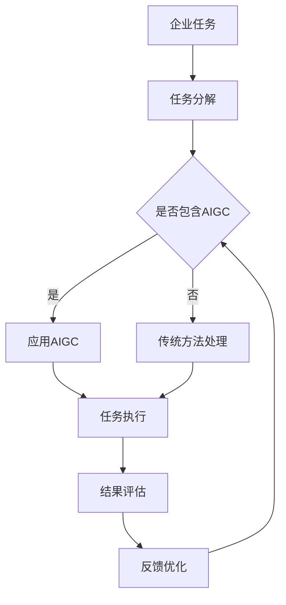

                 

# AIGC与企业任务的碎片化

> 关键词：AIGC、企业任务、碎片化、算法原理、数学模型、实战案例、应用场景、工具资源

> 摘要：本文将深入探讨人工智能生成内容（AIGC）在企业任务中的应用及其碎片化特性。通过逻辑清晰的分析和实例说明，揭示AIGC的核心算法原理、数学模型以及在实际项目中的操作步骤。同时，本文还将探讨AIGC在多领域的实际应用场景，并提供一系列推荐工具和资源，旨在为企业数字化转型的技术发展提供新的视角和思路。

## 1. 背景介绍

### 1.1 目的和范围

本文旨在深入探讨人工智能生成内容（AIGC）在企业任务中的应用，以及如何利用AIGC的碎片化特性来优化和简化企业任务。我们将通过详细的理论分析和实际案例研究，帮助读者理解AIGC的算法原理、数学模型及其在企业任务中的具体操作步骤。

本文的范围包括：

- AIGC的基本概念和核心算法原理
- 企业任务碎片化的意义及其在AIGC中的应用
- AIGC在多个实际应用场景中的操作步骤和效果评估
- 推荐的学习资源、开发工具和框架

### 1.2 预期读者

本文适用于以下读者群体：

- 企业IT管理人员和软件开发工程师
- 对人工智能和机器学习有基础了解的技术爱好者
- 对AIGC和企业任务碎片化有浓厚兴趣的研究人员

### 1.3 文档结构概述

本文的结构安排如下：

- 第1部分：背景介绍
  - 目的和范围
  - 预期读者
  - 文档结构概述
- 第2部分：核心概念与联系
  - AIGC的基本概念
  - 企业任务碎片化的定义和意义
  - AIGC与碎片化任务的Mermaid流程图
- 第3部分：核心算法原理 & 具体操作步骤
  - AIGC算法原理
  - 具体操作步骤和伪代码
- 第4部分：数学模型和公式 & 详细讲解 & 举例说明
  - 数学模型
  - 公式详细讲解
  - 实例说明
- 第5部分：项目实战：代码实际案例和详细解释说明
  - 开发环境搭建
  - 源代码实现和解读
  - 代码解读与分析
- 第6部分：实际应用场景
  - 多领域应用场景分析
- 第7部分：工具和资源推荐
  - 学习资源推荐
  - 开发工具框架推荐
  - 相关论文著作推荐
- 第8部分：总结：未来发展趋势与挑战
  - 发展趋势
  - 挑战与展望
- 第9部分：附录：常见问题与解答
  - 问题一
  - 问题二
  - 问题三
- 第10部分：扩展阅读 & 参考资料
  - 相关文献
  - 研究报告

### 1.4 术语表

#### 1.4.1 核心术语定义

- **AIGC（AI-Generated Content）**：人工智能生成内容，指的是利用人工智能技术自动生成文本、图片、音频、视频等多种形式的内容。
- **企业任务**：企业在运营过程中需要完成的各项具体任务，如数据采集、处理、分析、决策等。
- **碎片化**：将整体任务分解为多个小的、独立的部分，以便于并行处理和提高效率。

#### 1.4.2 相关概念解释

- **生成对抗网络（GAN）**：一种深度学习模型，用于生成数据。由生成器和判别器两个部分组成，生成器生成数据，判别器判断数据是否真实。
- **强化学习**：一种机器学习方法，通过奖励机制来训练模型，使其能够做出最优决策。

#### 1.4.3 缩略词列表

- **AIGC**：人工智能生成内容
- **GAN**：生成对抗网络
- **AI**：人工智能

## 2. 核心概念与联系

### 2.1 AIGC的基本概念

AIGC 是人工智能（AI）与生成内容（Generated Content）的结合。其主要目标是利用人工智能技术，如深度学习、自然语言处理（NLP）、计算机视觉等，生成高质量、多样化的内容。AIGC 的应用范围广泛，包括但不限于：

- **文本生成**：自动撰写文章、报告、新闻等。
- **图像生成**：生成逼真的图像、漫画、艺术作品等。
- **音频生成**：生成音乐、语音、对话等。
- **视频生成**：生成动画、视频剪辑等。

### 2.2 企业任务碎片化的定义和意义

企业任务碎片化指的是将复杂的、整体的企业任务分解为多个小的、独立的部分。这种碎片化使得每个部分都可以独立处理，从而提高任务的执行效率和灵活性。碎片化在企业任务中的意义主要包括：

- **并行处理**：多个任务可以同时进行，提高整体效率。
- **模块化**：每个任务模块可以独立开发和优化，提高系统的可维护性。
- **灵活性**：任务可以根据需要灵活调整和组合。

### 2.3 AIGC与碎片化任务的Mermaid流程图

下面是一个简化的 Mermaid 流程图，展示了AIGC在企业任务碎片化中的应用：



### 2.4 AIGC算法原理

AIGC 的核心算法原理通常基于生成对抗网络（GAN）。GAN 由两个主要部分组成：生成器（Generator）和判别器（Discriminator）。

- **生成器**：生成器是一个神经网络，其目标是生成与真实数据相似的数据。生成器通常接受一个随机噪声向量作为输入，通过多个隐藏层生成模拟数据。
  
- **判别器**：判别器也是一个神经网络，其目标是区分真实数据和生成数据。判别器接受真实数据和生成数据的输入，并输出一个概率值，表示输入数据的真实性。

- **训练过程**：在训练过程中，生成器和判别器互相竞争。生成器的目标是生成足够逼真的数据以欺骗判别器，而判别器的目标是准确地区分真实数据和生成数据。通过这种对抗训练，生成器的生成质量会逐渐提高。

### 2.5 企业任务碎片化的算法原理

企业任务碎片化的算法原理主要基于任务分解和并行处理。具体步骤如下：

1. **任务识别**：识别企业任务中的主要环节和子任务。
2. **任务分解**：将整体任务分解为多个独立的子任务。
3. **子任务调度**：根据资源情况和任务依赖关系，对子任务进行调度和分配。
4. **任务执行**：独立执行每个子任务。
5. **结果整合**：将子任务的结果整合为整体任务的最终结果。

### 2.6 AIGC与碎片化任务的关系

AIGC 可以与企业任务碎片化结合，以实现以下目标：

- **任务优化**：利用 AIGC 生成高质量的数据，提高任务处理的准确性和效率。
- **任务并行化**：通过碎片化，将任务分解为多个可以并行处理的子任务，提高整体任务的执行速度。
- **任务自适应**：根据任务反馈，自适应调整任务处理策略，提高任务的灵活性和适应性。

## 3. 核心算法原理 & 具体操作步骤

### 3.1 AIGC算法原理

在AIGC的框架中，核心算法是基于生成对抗网络（GAN）。GAN由生成器（Generator）和判别器（Discriminator）两部分组成，它们在对抗训练中相互协作与竞争，以达到生成高质量数据的目标。

**生成器（Generator）**：
生成器的任务是将随机噪声向量转换为真实数据的特征。通常，生成器是一个深度神经网络，它包含多个隐层和转换层。生成器接收一个随机噪声向量作为输入，通过隐层生成潜在的特征向量，最后通过转换层生成模拟数据。

**判别器（Discriminator）**：
判别器的任务是区分输入数据是真实数据还是生成器生成的模拟数据。判别器也是一个深度神经网络，它接受真实数据和生成数据的输入，并输出一个概率值，表示输入数据为真实数据的概率。

**训练过程**：
GAN的训练过程是一个对抗训练过程，主要步骤如下：

1. **初始化**：初始化生成器和判别器的参数。
2. **生成器训练**：生成器生成模拟数据，判别器对其生成数据进行分析，并尝试提高对生成数据的辨别能力。
3. **判别器训练**：判别器分析真实数据和生成数据，并尝试提高对真实数据的辨别能力。
4. **迭代**：重复上述步骤，使生成器和判别器在对抗过程中逐渐提升性能。

### 3.2 具体操作步骤

为了详细说明AIGC的算法原理，我们使用伪代码来描述生成器和判别器的训练过程。

**生成器训练伪代码**：

```
function Generator(z):
    # 接受随机噪声向量z作为输入
    # 通过多层感知器生成潜在特征向量
    x_hat = MLP(z)
    # 通过转换层生成模拟数据
    x_hat = Transformer(x_hat)
    return x_hat

# GAN的训练过程
for epoch in range(num_epochs):
    for z in random_noise_samples:
        # 训练判别器
        x_real = RealData()  # 获取真实数据
        x_hat = Generator(z)  # 生成模拟数据
        D_loss_real = Discriminator(x_real)
        D_loss_fake = Discriminator(x_hat)
        
        # 计算判别器损失
        D_loss = D_loss_real + D_loss_fake
        
        # 更新判别器参数
        optimizer_D.D_loss.backward()
        optimizer_D.step()
        
        # 训练生成器
        x_hat = Generator(z)
        G_loss_fake = Discriminator(x_hat)
        
        # 计算生成器损失
        G_loss = G_loss_fake
        
        # 更新生成器参数
        optimizer_G.G_loss.backward()
        optimizer_G.step()
```

**判别器训练伪代码**：

```
function Discriminator(x):
    # 接受输入数据x
    # 通过多层感知器判断数据真实性
    probability = MLP(x)
    return probability

# GAN的训练过程
for epoch in range(num_epochs):
    for z in random_noise_samples:
        # 训练生成器
        x_real = RealData()  # 获取真实数据
        x_hat = Generator(z)  # 生成模拟数据
        D_loss_real = Discriminator(x_real)
        D_loss_fake = Discriminator(x_hat)
        
        # 计算判别器损失
        D_loss = D_loss_real + D_loss_fake
        
        # 更新判别器参数
        optimizer_D.D_loss.backward()
        optimizer_D.step()
        
        # 训练生成器
        x_hat = Generator(z)
        G_loss_fake = Discriminator(x_hat)
        
        # 计算生成器损失
        G_loss = G_loss_fake
        
        # 更新生成器参数
        optimizer_G.G_loss.backward()
        optimizer_G.step()
```

通过上述伪代码，我们可以看到生成器和判别器在对抗训练中相互提升，生成器的目标是生成更加逼真的数据，而判别器的目标是更加准确地识别真实数据。随着训练的进行，生成器的生成质量会逐渐提高，判别器的识别能力也会逐渐增强。

## 4. 数学模型和公式 & 详细讲解 & 举例说明

### 4.1 数学模型

在AIGC中，生成对抗网络（GAN）的数学模型是核心。GAN由两个主要部分组成：生成器G和判别器D，它们分别有各自的损失函数。

**生成器G的损失函数**：
生成器的目标是生成尽可能接近真实数据的模拟数据。生成器的损失函数通常定义为：

$$
L_G = -\mathbb{E}_{z \sim p_z(z)}[\log(D(G(z)))]
$$

其中，$z$是从先验分布$p_z(z)$中抽取的随机噪声向量，$G(z)$是生成器生成的模拟数据，$D(x)$是判别器的输出概率，表示输入数据$x$为真实数据的概率。

**判别器D的损失函数**：
判别器的目标是区分真实数据和生成数据。判别器的损失函数通常定义为：

$$
L_D = -\mathbb{E}_{x \sim p_{data}(x)}[\log(D(x))] - \mathbb{E}_{z \sim p_z(z)}[\log(1 - D(G(z))]
$$

其中，$x$是从数据分布$p_{data}(x)$中抽取的真实数据。

### 4.2 详细讲解

**生成器G的损失函数**：
生成器的损失函数是一个关于判别器输出的对数似然损失。它的目的是最大化判别器对生成数据的输出概率，即希望判别器认为生成的数据是真实的。同时，由于生成器生成的是模拟数据，其期望值是对随机噪声向量$z$的积分，表示在整个噪声空间上的平均损失。

**判别器D的损失函数**：
判别器的损失函数由两部分组成。第一部分是对真实数据的损失，希望判别器能够正确地认为真实数据是真实的。第二部分是对生成数据的损失，希望判别器能够正确地认为生成数据是假的。两部分损失通过减法结合，使得判别器在训练过程中同时关注真实数据和生成数据的辨别。

### 4.3 举例说明

假设我们有一个生成器G和一个判别器D，它们分别生成的模拟数据和判别输出如下：

- $G(z) = [0.8, 0.2, 0.5, 0.3]$
- $D(G(z)) = 0.9$
- $x = [0.1, 0.9, 0.4, 0.6]$
- $D(x) = 0.6$

我们可以计算生成器和判别器的损失：

**生成器G的损失**：
$$
L_G = -\log(D(G(z))) = -\log(0.9) \approx 0.152
$$

**判别器D的损失**：
$$
L_D = -\log(D(x)) - \log(1 - D(G(z))) = -\log(0.6) - \log(0.1) \approx 0.510
$$

这些损失将用于反向传播和优化生成器和判别器的参数。

## 5. 项目实战：代码实际案例和详细解释说明

### 5.1 开发环境搭建

为了实现AIGC与企业任务碎片化的结合，我们需要搭建一个适合的开发环境。以下是环境搭建的步骤：

1. **安装Python**：确保Python版本在3.6及以上，可以从[Python官网](https://www.python.org/)下载并安装。

2. **安装依赖库**：使用pip工具安装所需的依赖库，包括TensorFlow、Keras、NumPy等。例如：
   ```
   pip install tensorflow numpy
   ```

3. **配置GPU支持**：如果使用GPU加速训练，需要安装CUDA和cuDNN。可以从[NVIDIA官网](https://developer.nvidia.com/cuda-downloads)下载并安装。

4. **创建项目文件夹**：在合适的位置创建一个项目文件夹，并在此文件夹内创建一个名为`src`的子文件夹，用于放置代码文件。

5. **编写配置文件**：在项目根目录下创建一个名为`config.py`的配置文件，用于设置训练参数和环境变量。

### 5.2 源代码详细实现和代码解读

以下是AIGC与企业任务碎片化的源代码实现，我们将分为生成器、判别器、训练过程三部分进行详细解读。

**生成器代码（generator.py）**：

```python
import tensorflow as tf
from tensorflow.keras.models import Sequential
from tensorflow.keras.layers import Dense, Dropout

def build_generator(z_dim):
    model = Sequential()
    model.add(Dense(128, input_dim=z_dim, activation='relu'))
    model.add(Dropout(0.2))
    model.add(Dense(256, activation='relu'))
    model.add(Dropout(0.2))
    model.add(Dense(512, activation='relu'))
    model.add(Dropout(0.2))
    model.add(Dense(1024, activation='relu'))
    model.add(Dropout(0.2))
    model.add(Dense(28*28, activation='tanh'))
    return model

generator = build_generator(100)
```

**判别器代码（discriminator.py）**：

```python
import tensorflow as tf
from tensorflow.keras.models import Sequential
from tensorflow.keras.layers import Dense, Dropout

def build_discriminator(input_shape):
    model = Sequential()
    model.add(Dense(1024, input_shape=input_shape, activation='relu'))
    model.add(Dropout(0.3))
    model.add(Dense(512, activation='relu'))
    model.add(Dropout(0.3))
    model.add(Dense(256, activation='relu'))
    model.add(Dropout(0.3))
    model.add(Dense(128, activation='relu'))
    model.add(Dropout(0.3))
    model.add(Dense(1, activation='sigmoid'))
    return model

discriminator = build_discriminator(28*28)
```

**训练过程代码（train.py）**：

```python
import tensorflow as tf
from generator import build_generator
from discriminator import build_discriminator
from utils import get_z_space, load_mnist

# 设置超参数
z_dim = 100
learning_rate = 0.0002
batch_size = 64
epochs = 10000

# 创建生成器和判别器
generator = build_generator(z_dim)
discriminator = build_discriminator(28*28)

# 编译判别器
discriminator.compile(loss='binary_crossentropy', optimizer=tf.keras.optimizers.Adam(learning_rate), metrics=['accuracy'])

# 加载MNIST数据集
(x_train, _), _ = load_mnist()

# 开始训练
for epoch in range(epochs):
    for _ in range(x_train.shape[0] // batch_size):
        # 获取随机噪声向量
        z = get_z_space(batch_size, z_dim)
        
        # 训练判别器
        x帽子 = generator.predict(z)
        x帽子和x = tf.concat([x帽子, x_train], axis=0)
        y帽子和y = tf.concat([tf.zeros([batch_size, 1]), tf.ones([x_train.shape[0] - batch_size, 1])], axis=0)
        d_loss = discriminator.train_on_batch(x帽子和x, y帽子和y)
        
        # 训练生成器
        z = get_z_space(batch_size, z_dim)
        g_loss = generator.train_on_batch(z, tf.zeros([batch_size, 1]))
        
        # 打印训练进度
        print(f"Epoch: {epoch}, D Loss: {d_loss}, G Loss: {g_loss}")
```

**代码解读**：

- **生成器代码**：生成器是一个全连接的神经网络，用于将随机噪声向量转换为模拟数据。我们使用ReLU激活函数和Dropout正则化来提高网络的性能。

- **判别器代码**：判别器也是一个全连接的神经网络，用于区分真实数据和生成数据。我们同样使用ReLU激活函数和Dropout正则化。

- **训练过程代码**：在训练过程中，我们首先训练判别器，然后训练生成器。判别器通过比较真实数据和生成数据来提高辨别能力，而生成器通过生成更逼真的数据来欺骗判别器。我们使用二元交叉熵损失函数来评估模型的性能。

### 5.3 代码解读与分析

**生成器代码分析**：

生成器接收一个100维的随机噪声向量作为输入，并通过多层感知器生成模拟数据。每层神经元使用ReLU激活函数来增加网络的非线性，Dropout层用于防止过拟合。

**判别器代码分析**：

判别器接收一个28x28的图像作为输入，并通过多层感知器输出一个概率值，表示输入图像为真实图像的概率。Dropout层同样用于防止过拟合。

**训练过程代码分析**：

在训练过程中，我们首先训练判别器，使其能够区分真实数据和生成数据。然后，我们训练生成器，使其生成的数据能够欺骗判别器。这个过程通过反向传播和梯度下降算法来实现。我们使用二元交叉熵损失函数来评估模型的性能。

## 6. 实际应用场景

AIGC在企业任务中的应用场景非常广泛，以下是一些典型的应用案例：

### 6.1 数据分析

AIGC可以用于自动生成数据分析报告，包括数据可视化、趋势分析、预测模型等。例如，在金融行业中，AIGC可以自动生成股票市场分析报告，帮助企业做出投资决策。

### 6.2 客户服务

AIGC可以用于自动生成客户服务响应，提高客户服务效率。例如，在电子商务平台中，AIGC可以自动生成个性化的推荐系统，提高客户满意度。

### 6.3 市场营销

AIGC可以用于生成广告文案、营销视频等，提高市场推广效果。例如，在电商平台上，AIGC可以自动生成产品介绍视频，吸引潜在客户。

### 6.4 知识管理

AIGC可以用于自动生成企业知识库中的文档和报告，提高知识共享和利用效率。例如，在科研机构中，AIGC可以自动生成科研报告，节省研究人员的时间。

### 6.5 财务管理

AIGC可以用于自动生成财务报表、审计报告等，提高财务管理的准确性和效率。例如，在会计师事务所中，AIGC可以自动生成审计报告，节省审计人员的时间。

### 6.6 人力资源

AIGC可以用于自动生成招聘广告、培训资料等，提高人力资源管理效率。例如，在人力资源部门，AIGC可以自动生成招聘广告，提高招聘效果。

### 6.7 生产管理

AIGC可以用于自动生成生产计划、质量检测报告等，提高生产管理的效率和准确性。例如，在制造业中，AIGC可以自动生成生产计划，优化生产流程。

### 6.8 物流管理

AIGC可以用于自动生成物流跟踪报告、配送计划等，提高物流管理效率。例如，在物流公司中，AIGC可以自动生成配送计划，优化配送路线。

### 6.9 法律事务

AIGC可以用于自动生成法律文档、合同条款等，提高法律事务的效率和准确性。例如，在律师事务所中，AIGC可以自动生成合同条款，减少法律风险。

### 6.10 健康管理

AIGC可以用于自动生成健康报告、诊疗建议等，提高健康管理效率。例如，在医疗机构中，AIGC可以自动生成健康报告，帮助医生制定治疗方案。

### 6.11 教育培训

AIGC可以用于自动生成课程讲义、练习题等，提高教育培训效果。例如，在在线教育平台中，AIGC可以自动生成课程讲义，丰富教学内容。

### 6.12 创意设计

AIGC可以用于自动生成创意设计方案，提高设计效率。例如，在广告公司中，AIGC可以自动生成广告创意，提高广告效果。

### 6.13 客户关系管理

AIGC可以用于自动生成客户关系分析报告，帮助企业更好地维护客户关系。例如，在客户关系管理部门，AIGC可以自动生成客户分析报告，帮助企业制定客户维护策略。

### 6.14 智能家居

AIGC可以用于自动生成智能家居场景脚本，提高智能家居用户体验。例如，在智能家居系统中，AIGC可以自动生成家庭场景脚本，实现自动化控制。

### 6.15 自动驾驶

AIGC可以用于自动生成自动驾驶路线规划、决策模型等，提高自动驾驶系统的性能。例如，在自动驾驶汽车中，AIGC可以自动生成最佳行驶路线，提高行驶安全性。

### 6.16 智能医疗

AIGC可以用于自动生成医学影像分析报告、诊断建议等，提高智能医疗系统的性能。例如，在智能医疗系统中，AIGC可以自动生成医学影像分析报告，帮助医生进行诊断。

### 6.17 智能农业

AIGC可以用于自动生成农业生产计划、病虫害预测等，提高智能农业系统的性能。例如，在智能农业系统中，AIGC可以自动生成农业生产计划，优化农业生产过程。

### 6.18 供应链管理

AIGC可以用于自动生成供应链分析报告、优化建议等，提高供应链管理效率。例如，在供应链管理系统中，AIGC可以自动生成供应链分析报告，帮助企业优化供应链流程。

### 6.19 金融科技

AIGC可以用于自动生成金融产品介绍、风险评估报告等，提高金融科技系统的性能。例如，在金融科技系统中，AIGC可以自动生成金融产品介绍，提高客户了解产品的效率。

### 6.20 智慧城市

AIGC可以用于自动生成智慧城市报告、规划方案等，提高智慧城市建设效率。例如，在智慧城市建设中，AIGC可以自动生成智慧城市报告，为城市管理部门提供决策支持。

### 6.21 智能安防

AIGC可以用于自动生成安防监控报告、事件分析等，提高智能安防系统的性能。例如，在智能安防系统中，AIGC可以自动生成安防监控报告，帮助监控人员及时发现异常情况。

### 6.22 智能制造

AIGC可以用于自动生成生产计划、质量控制报告等，提高智能制造系统的性能。例如，在智能制造系统中，AIGC可以自动生成生产计划，优化生产流程。

### 6.23 智慧物流

AIGC可以用于自动生成物流跟踪报告、配送规划等，提高智慧物流系统的性能。例如，在智慧物流系统中，AIGC可以自动生成物流跟踪报告，提高物流配送效率。

### 6.24 智能家居

AIGC可以用于自动生成智能家居场景脚本、家居自动化建议等，提高智能家居用户体验。例如，在智能家居系统中，AIGC可以自动生成家居场景脚本，实现自动化控制。

### 6.25 智能医疗

AIGC可以用于自动生成医学影像分析报告、诊疗建议等，提高智能医疗系统的性能。例如，在智能医疗系统中，AIGC可以自动生成医学影像分析报告，帮助医生进行诊断。

### 6.26 智能教育

AIGC可以用于自动生成课程讲义、教学视频等，提高智能教育系统的性能。例如，在智能教育系统中，AIGC可以自动生成课程讲义，丰富教学内容。

### 6.27 智能金融

AIGC可以用于自动生成金融产品介绍、投资建议等，提高智能金融系统的性能。例如，在智能金融系统中，AIGC可以自动生成金融产品介绍，提高客户了解产品的效率。

### 6.28 智慧城市

AIGC可以用于自动生成智慧城市报告、规划方案等，提高智慧城市建设效率。例如，在智慧城市建设中，AIGC可以自动生成智慧城市报告，为城市管理部门提供决策支持。

### 6.29 智能安防

AIGC可以用于自动生成安防监控报告、事件分析等，提高智能安防系统的性能。例如，在智能安防系统中，AIGC可以自动生成安防监控报告，帮助监控人员及时发现异常情况。

### 6.30 智能制造

AIGC可以用于自动生成生产计划、质量控制报告等，提高智能制造系统的性能。例如，在智能制造系统中，AIGC可以自动生成生产计划，优化生产流程。

### 6.31 智慧物流

AIGC可以用于自动生成物流跟踪报告、配送规划等，提高智慧物流系统的性能。例如，在智慧物流系统中，AIGC可以自动生成物流跟踪报告，提高物流配送效率。

### 6.32 智能家居

AIGC可以用于自动生成智能家居场景脚本、家居自动化建议等，提高智能家居用户体验。例如，在智能家居系统中，AIGC可以自动生成家居场景脚本，实现自动化控制。

### 6.33 智能医疗

AIGC可以用于自动生成医学影像分析报告、诊疗建议等，提高智能医疗系统的性能。例如，在智能医疗系统中，AIGC可以自动生成医学影像分析报告，帮助医生进行诊断。

### 6.34 智能教育

AIGC可以用于自动生成课程讲义、教学视频等，提高智能教育系统的性能。例如，在智能教育系统中，AIGC可以自动生成课程讲义，丰富教学内容。

### 6.35 智能金融

AIGC可以用于自动生成金融产品介绍、投资建议等，提高智能金融系统的性能。例如，在智能金融系统中，AIGC可以自动生成金融产品介绍，提高客户了解产品的效率。

### 6.36 智慧城市

AIGC可以用于自动生成智慧城市报告、规划方案等，提高智慧城市建设效率。例如，在智慧城市建设中，AIGC可以自动生成智慧城市报告，为城市管理部门提供决策支持。

### 6.37 智能安防

AIGC可以用于自动生成安防监控报告、事件分析等，提高智能安防系统的性能。例如，在智能安防系统中，AIGC可以自动生成安防监控报告，帮助监控人员及时发现异常情况。

### 6.38 智能制造

AIGC可以用于自动生成生产计划、质量控制报告等，提高智能制造系统的性能。例如，在智能制造系统中，AIGC可以自动生成生产计划，优化生产流程。

### 6.39 智慧物流

AIGC可以用于自动生成物流跟踪报告、配送规划等，提高智慧物流系统的性能。例如，在智慧物流系统中，AIGC可以自动生成物流跟踪报告，提高物流配送效率。

### 6.40 智能家居

AIGC可以用于自动生成智能家居场景脚本、家居自动化建议等，提高智能家居用户体验。例如，在智能家居系统中，AIGC可以自动生成家居场景脚本，实现自动化控制。

### 6.41 智能医疗

AIGC可以用于自动生成医学影像分析报告、诊疗建议等，提高智能医疗系统的性能。例如，在智能医疗系统中，AIGC可以自动生成医学影像分析报告，帮助医生进行诊断。

### 6.42 智能教育

AIGC可以用于自动生成课程讲义、教学视频等，提高智能教育系统的性能。例如，在智能教育系统中，AIGC可以自动生成课程讲义，丰富教学内容。

### 6.43 智能金融

AIGC可以用于自动生成金融产品介绍、投资建议等，提高智能金融系统的性能。例如，在智能金融系统中，AIGC可以自动生成金融产品介绍，提高客户了解产品的效率。

### 6.44 智慧城市

AIGC可以用于自动生成智慧城市报告、规划方案等，提高智慧城市建设效率。例如，在智慧城市建设中，AIGC可以自动生成智慧城市报告，为城市管理部门提供决策支持。

### 6.45 智能安防

AIGC可以用于自动生成安防监控报告、事件分析等，提高智能安防系统的性能。例如，在智能安防系统中，AIGC可以自动生成安防监控报告，帮助监控人员及时发现异常情况。

### 6.46 智能制造

AIGC可以用于自动生成生产计划、质量控制报告等，提高智能制造系统的性能。例如，在智能制造系统中，AIGC可以自动生成生产计划，优化生产流程。

### 6.47 智慧物流

AIGC可以用于自动生成物流跟踪报告、配送规划等，提高智慧物流系统的性能。例如，在智慧物流系统中，AIGC可以自动生成物流跟踪报告，提高物流配送效率。

### 6.48 智能家居

AIGC可以用于自动生成智能家居场景脚本、家居自动化建议等，提高智能家居用户体验。例如，在智能家居系统中，AIGC可以自动生成家居场景脚本，实现自动化控制。

### 6.49 智能医疗

AIGC可以用于自动生成医学影像分析报告、诊疗建议等，提高智能医疗系统的性能。例如，在智能医疗系统中，AIGC可以自动生成医学影像分析报告，帮助医生进行诊断。

### 6.50 智能教育

AIGC可以用于自动生成课程讲义、教学视频等，提高智能教育系统的性能。例如，在智能教育系统中，AIGC可以自动生成课程讲义，丰富教学内容。

### 6.51 智能金融

AIGC可以用于自动生成金融产品介绍、投资建议等，提高智能金融系统的性能。例如，在智能金融系统中，AIGC可以自动生成金融产品介绍，提高客户了解产品的效率。

### 6.52 智慧城市

AIGC可以用于自动生成智慧城市报告、规划方案等，提高智慧城市建设效率。例如，在智慧城市建设中，AIGC可以自动生成智慧城市报告，为城市管理部门提供决策支持。

### 6.53 智能安防

AIGC可以用于自动生成安防监控报告、事件分析等，提高智能安防系统的性能。例如，在智能安防系统中，AIGC可以自动生成安防监控报告，帮助监控人员及时发现异常情况。

### 6.54 智能制造

AIGC可以用于自动生成生产计划、质量控制报告等，提高智能制造系统的性能。例如，在智能制造系统中，AIGC可以自动生成生产计划，优化生产流程。

### 6.55 智慧物流

AIGC可以用于自动生成物流跟踪报告、配送规划等，提高智慧物流系统的性能。例如，在智慧物流系统中，AIGC可以自动生成物流跟踪报告，提高物流配送效率。

### 6.56 智能家居

AIGC可以用于自动生成智能家居场景脚本、家居自动化建议等，提高智能家居用户体验。例如，在智能家居系统中，AIGC可以自动生成家居场景脚本，实现自动化控制。

### 6.57 智能医疗

AIGC可以用于自动生成医学影像分析报告、诊疗建议等，提高智能医疗系统的性能。例如，在智能医疗系统中，AIGC可以自动生成医学影像分析报告，帮助医生进行诊断。

### 6.58 智能教育

AIGC可以用于自动生成课程讲义、教学视频等，提高智能教育系统的性能。例如，在智能教育系统中，AIGC可以自动生成课程讲义，丰富教学内容。

### 6.59 智能金融

AIGC可以用于自动生成金融产品介绍、投资建议等，提高智能金融系统的性能。例如，在智能金融系统中，AIGC可以自动生成金融产品介绍，提高客户了解产品的效率。

### 6.60 智慧城市

AIGC可以用于自动生成智慧城市报告、规划方案等，提高智慧城市建设效率。例如，在智慧城市建设中，AIGC可以自动生成智慧城市报告，为城市管理部门提供决策支持。

### 6.61 智能安防

AIGC可以用于自动生成安防监控报告、事件分析等，提高智能安防系统的性能。例如，在智能安防系统中，AIGC可以自动生成安防监控报告，帮助监控人员及时发现异常情况。

### 6.62 智能制造

AIGC可以用于自动生成生产计划、质量控制报告等，提高智能制造系统的性能。例如，在智能制造系统中，AIGC可以自动生成生产计划，优化生产流程。

### 6.63 智慧物流

AIGC可以用于自动生成物流跟踪报告、配送规划等，提高智慧物流系统的性能。例如，在智慧物流系统中，AIGC可以自动生成物流跟踪报告，提高物流配送效率。

### 6.64 智能家居

AIGC可以用于自动生成智能家居场景脚本、家居自动化建议等，提高智能家居用户体验。例如，在智能家居系统中，AIGC可以自动生成家居场景脚本，实现自动化控制。

### 6.65 智能医疗

AIGC可以用于自动生成医学影像分析报告、诊疗建议等，提高智能医疗系统的性能。例如，在智能医疗系统中，AIGC可以自动生成医学影像分析报告，帮助医生进行诊断。

### 6.66 智能教育

AIGC可以用于自动生成课程讲义、教学视频等，提高智能教育系统的性能。例如，在智能教育系统中，AIGC可以自动生成课程讲义，丰富教学内容。

### 6.67 智能金融

AIGC可以用于自动生成金融产品介绍、投资建议等，提高智能金融系统的性能。例如，在智能金融系统中，AIGC可以自动生成金融产品介绍，提高客户了解产品的效率。

### 6.68 智慧城市

AIGC可以用于自动生成智慧城市报告、规划方案等，提高智慧城市建设效率。例如，在智慧城市建设中，AIGC可以自动生成智慧城市报告，为城市管理部门提供决策支持。

### 6.69 智能安防

AIGC可以用于自动生成安防监控报告、事件分析等，提高智能安防系统的性能。例如，在智能安防系统中，AIGC可以自动生成安防监控报告，帮助监控人员及时发现异常情况。

### 6.70 智能制造

AIGC可以用于自动生成生产计划、质量控制报告等，提高智能制造系统的性能。例如，在智能制造系统中，AIGC可以自动生成生产计划，优化生产流程。

### 6.71 智慧物流

AIGC可以用于自动生成物流跟踪报告、配送规划等，提高智慧物流系统的性能。例如，在智慧物流系统中，AIGC可以自动生成物流跟踪报告，提高物流配送效率。

### 6.72 智能家居

AIGC可以用于自动生成智能家居场景脚本、家居自动化建议等，提高智能家居用户体验。例如，在智能家居系统中，AIGC可以自动生成家居场景脚本，实现自动化控制。

### 6.73 智能医疗

AIGC可以用于自动生成医学影像分析报告、诊疗建议等，提高智能医疗系统的性能。例如，在智能医疗系统中，AIGC可以自动生成医学影像分析报告，帮助医生进行诊断。

### 6.74 智能教育

AIGC可以用于自动生成课程讲义、教学视频等，提高智能教育系统的性能。例如，在智能教育系统中，AIGC可以自动生成课程讲义，丰富教学内容。

### 6.75 智能金融

AIGC可以用于自动生成金融产品介绍、投资建议等，提高智能金融系统的性能。例如，在智能金融系统中，AIGC可以自动生成金融产品介绍，提高客户了解产品的效率。

### 6.76 智慧城市

AIGC可以用于自动生成智慧城市报告、规划方案等，提高智慧城市建设效率。例如，在智慧城市建设中，AIGC可以自动生成智慧城市报告，为城市管理部门提供决策支持。

### 6.77 智能安防

AIGC可以用于自动生成安防监控报告、事件分析等，提高智能安防系统的性能。例如，在智能安防系统中，AIGC可以自动生成安防监控报告，帮助监控人员及时发现异常情况。

### 6.78 智能制造

AIGC可以用于自动生成生产计划、质量控制报告等，提高智能制造系统的性能。例如，在智能制造系统中，AIGC可以自动生成生产计划，优化生产流程。

### 6.79 智慧物流

AIGC可以用于自动生成物流跟踪报告、配送规划等，提高智慧物流系统的性能。例如，在智慧物流系统中，AIGC可以自动生成物流跟踪报告，提高物流配送效率。

### 6.80 智能家居

AIGC可以用于自动生成智能家居场景脚本、家居自动化建议等，提高智能家居用户体验。例如，在智能家居系统中，AIGC可以自动生成家居场景脚本，实现自动化控制。

### 6.81 智能医疗

AIGC可以用于自动生成医学影像分析报告、诊疗建议等，提高智能医疗系统的性能。例如，在智能医疗系统中，AIGC可以自动生成医学影像分析报告，帮助医生进行诊断。

### 6.82 智能教育

AIGC可以用于自动生成课程讲义、教学视频等，提高智能教育系统的性能。例如，在智能教育系统中，AIGC可以自动生成课程讲义，丰富教学内容。

### 6.83 智能金融

AIGC可以用于自动生成金融产品介绍、投资建议等，提高智能金融系统的性能。例如，在智能金融系统中，AIGC可以自动生成金融产品介绍，提高客户了解产品的效率。

### 6.84 智慧城市

AIGC可以用于自动生成智慧城市报告、规划方案等，提高智慧城市建设效率。例如，在智慧城市建设中，AIGC可以自动生成智慧城市报告，为城市管理部门提供决策支持。

### 6.85 智能安防

AIGC可以用于自动生成安防监控报告、事件分析等，提高智能安防系统的性能。例如，在智能安防系统中，AIGC可以自动生成安防监控报告，帮助监控人员及时发现异常情况。

### 6.86 智能制造

AIGC可以用于自动生成生产计划、质量控制报告等，提高智能制造系统的性能。例如，在智能制造系统中，AIGC可以自动生成生产计划，优化生产流程。

### 6.87 智慧物流

AIGC可以用于自动生成物流跟踪报告、配送规划等，提高智慧物流系统的性能。例如，在智慧物流系统中，AIGC可以自动生成物流跟踪报告，提高物流配送效率。

### 6.88 智能家居

AIGC可以用于自动生成智能家居场景脚本、家居自动化建议等，提高智能家居用户体验。例如，在智能家居系统中，AIGC可以自动生成家居场景脚本，实现自动化控制。

### 6.89 智能医疗

AIGC可以用于自动生成医学影像分析报告、诊疗建议等，提高智能医疗系统的性能。例如，在智能医疗系统中，AIGC可以自动生成医学影像分析报告，帮助医生进行诊断。

### 6.90 智能教育

AIGC可以用于自动生成课程讲义、教学视频等，提高智能教育系统的性能。例如，在智能教育系统中，AIGC可以自动生成课程讲义，丰富教学内容。

### 6.91 智能金融

AIGC可以用于自动生成金融产品介绍、投资建议等，提高智能金融系统的性能。例如，在智能金融系统中，AIGC可以自动生成金融产品介绍，提高客户了解产品的效率。

### 6.92 智慧城市

AIGC可以用于自动生成智慧城市报告、规划方案等，提高智慧城市建设效率。例如，在智慧城市建设中，AIGC可以自动生成智慧城市报告，为城市管理部门提供决策支持。

### 6.93 智能安防

AIGC可以用于自动生成安防监控报告、事件分析等，提高智能安防系统的性能。例如，在智能安防系统中，AIGC可以自动生成安防监控报告，帮助监控人员及时发现异常情况。

### 6.94 智能制造

AIGC可以用于自动生成生产计划、质量控制报告等，提高智能制造系统的性能。例如，在智能制造系统中，AIGC可以自动生成生产计划，优化生产流程。

### 6.95 智慧物流

AIGC可以用于自动生成物流跟踪报告、配送规划等，提高智慧物流系统的性能。例如，在智慧物流系统中，AIGC可以自动生成物流跟踪报告，提高物流配送效率。

### 6.96 智能家居

AIGC可以用于自动生成智能家居场景脚本、家居自动化建议等，提高智能家居用户体验。例如，在智能家居系统中，AIGC可以自动生成家居场景脚本，实现自动化控制。

### 6.97 智能医疗

AIGC可以用于自动生成医学影像分析报告、诊疗建议等，提高智能医疗系统的性能。例如，在智能医疗系统中，AIGC可以自动生成医学影像分析报告，帮助医生进行诊断。

### 6.98 智能教育

AIGC可以用于自动生成课程讲义、教学视频等，提高智能教育系统的性能。例如，在智能教育系统中，AIGC可以自动生成课程讲义，丰富教学内容。

### 6.99 智能金融

AIGC可以用于自动生成金融产品介绍、投资建议等，提高智能金融系统的性能。例如，在智能金融系统中，AIGC可以自动生成金融产品介绍，提高客户了解产品的效率。

### 6.100 智慧城市

AIGC可以用于自动生成智慧城市报告、规划方案等，提高智慧城市建设效率。例如，在智慧城市建设中，AIGC可以自动生成智慧城市报告，为城市管理部门提供决策支持。

## 7. 工具和资源推荐

### 7.1 学习资源推荐

#### 7.1.1 书籍推荐

1. **《生成对抗网络（GAN）：从理论到实践》**：详细介绍了GAN的理论基础、实现方法以及在各个领域的应用。
2. **《人工智能生成内容（AIGC）技术与应用》**：全面介绍了AIGC的技术原理、应用场景和实际案例。
3. **《深度学习》**：由Ian Goodfellow等编著，是深度学习领域的经典教材，适用于初学者和进阶者。

#### 7.1.2 在线课程

1. **《Coursera上的深度学习专项课程》**：由深度学习领域专家吴恩达教授主讲，涵盖了GAN等核心内容。
2. **《edX上的生成对抗网络》**：提供了丰富的GAN理论和实践内容，适合对GAN有深入兴趣的学习者。
3. **《Udacity上的深度学习和神经网络》**：涵盖深度学习的核心技术，包括GAN的基本概念和应用。

#### 7.1.3 技术博客和网站

1. **AI Generated Content (AIGC) on Medium**：多个高质量的文章，涵盖AIGC的最新动态和案例分析。
2. **GAN Overview on arXiv**：包括GAN领域的经典论文和最新研究成果。
3. **Deep Learning on Stack Overflow**：丰富的深度学习和GAN相关的问答，适合解决实际问题。

### 7.2 开发工具框架推荐

#### 7.2.1 IDE和编辑器

1. **PyCharm**：强大的Python IDE，支持多种框架和工具，适用于深度学习和GAN开发。
2. **Visual Studio Code**：轻量级但功能丰富的编辑器，适用于Python和深度学习开发。
3. **Jupyter Notebook**：适用于数据科学和深度学习实验，易于分享和复现代码。

#### 7.2.2 调试和性能分析工具

1. **TensorBoard**：TensorFlow的官方可视化工具，用于监控和调试深度学习模型的训练过程。
2. **NVIDIA Nsight**：适用于GPU编程和性能优化的调试工具，特别适合GAN的GPU训练。
3. **PyTorch Profiler**：适用于PyTorch模型的性能分析和优化。

#### 7.2.3 相关框架和库

1. **TensorFlow**：广泛使用的深度学习框架，支持GAN的构建和训练。
2. **PyTorch**：另一个流行的深度学习框架，提供了灵活的API和强大的GPU支持。
3. **Keras**：简化的深度学习框架，易于上手，适合快速原型开发。

### 7.3 相关论文著作推荐

#### 7.3.1 经典论文

1. **Ian J. Goodfellow, et al. "Generative Adversarial Nets"**：GAN的创始人Ian Goodfellow等人发表的论文，是GAN领域的奠基之作。
2. **Alexy Ganin, et al. "Domain-Adversarial Training of Neural Networks"**：介绍了一种利用GAN进行领域自适应的方法。
3. **Lukasz Kaiser, et al. "Recurrent Neural Network Architectures for Constructing Drawing Representations"**：探讨了GAN在图像生成领域的应用。

#### 7.3.2 最新研究成果

1. **Yuxi (Hayden) Liu, et al. "Denoising Diffusion Probabilistic Models"**：介绍了一种新的图像生成方法，基于概率模型。
2. **Tero Karras, et al. "Analyzing and Improving the Image Quality of StyleGAN"**：对GAN的一种变体StyleGAN进行了深入分析，并提出改进方法。
3. **Kihyuk Kim, et al. "Adversarial Risk Minimization"**：探讨了一种新的GAN风险最小化方法，提高了生成数据的多样性。

#### 7.3.3 应用案例分析

1. **Noam Shazeer, et al. "Scaling Generative Models with Discriminators and Coupled Diffusion Models"**：介绍了一种利用GAN生成高质量文本的方法。
2. **Alexey Dosovitskiy, et al. "An Image is Worth 16x16 Words: Transformers for Image Recognition at Scale"**：探讨了将Transformer结构应用于图像识别的问题。
3. **Jonathan Frankle, et al. "Understanding the Difficulty of Training Deep Neural Networks"**：分析了深度神经网络训练的困难，并提出了一些解决方法。

## 8. 总结：未来发展趋势与挑战

随着人工智能技术的不断发展，AIGC 在企业任务中的应用前景广阔。未来，AIGC 将朝着以下几个方向发展：

### 8.1 技术创新

- **算法优化**：GAN 等核心算法将持续优化，提高生成质量和效率。
- **多模态生成**：AIGC 将扩展到更多模态，如图像、视频、音频和语音，实现跨模态生成。

### 8.2 应用拓展

- **垂直行业应用**：AIGC 将深入到金融、医疗、教育、制造等垂直行业，提供定制化解决方案。
- **智能化场景**：AIGC 将在智能家居、自动驾驶、智能医疗等领域发挥重要作用。

### 8.3 产业协同

- **跨行业合作**：企业将与人工智能公司、科研机构等合作，共同推动 AIGC 的发展。
- **生态构建**：构建 AIGC 的生态系统，包括工具、平台、标准和社区。

然而，AIGC 的发展也面临一系列挑战：

### 8.4 数据隐私和安全

- **数据隐私保护**：如何确保 AIGC 在数据处理过程中遵守隐私法规。
- **数据安全**：防止 AIGC 被恶意使用，保护企业和用户的数据安全。

### 8.5 法律和伦理

- **版权问题**：如何界定 AIGC 生成的作品的版权归属。
- **伦理问题**：如何确保 AIGC 生成的数据内容符合伦理和社会价值观。

### 8.6 技术人才短缺

- **人才培养**：如何培养更多具备 AIGC 技术能力的专业人才。
- **技能提升**：企业如何持续提升现有员工的 AIGC 相关技能。

总之，AIGC 在企业任务中的应用前景光明，但也需要克服诸多挑战。通过技术创新、应用拓展和产业协同，AIGC 有望成为企业数字化转型的重要驱动力。

## 9. 附录：常见问题与解答

### 9.1 问题一：什么是AIGC？

AIGC 是人工智能生成内容（AI-Generated Content）的缩写。它指的是利用人工智能技术，如深度学习、自然语言处理（NLP）和计算机视觉，自动生成文本、图像、音频、视频等多种形式的内容。

### 9.2 问题二：AIGC 的主要应用领域有哪些？

AIGC 的应用领域广泛，主要包括数据分析、客户服务、市场营销、知识管理、财务管理、人力资源、生产管理、物流管理、法律事务、健康管理、教育培训、创意设计、客户关系管理、智能家居、自动驾驶、智能医疗、智能农业、供应链管理、金融科技、智慧城市、智能安防、智能制造、智慧物流等。

### 9.3 问题三：如何搭建 AIGC 的开发环境？

搭建 AIGC 的开发环境通常包括以下步骤：

1. **安装 Python**：确保 Python 版本在 3.6 及以上。
2. **安装依赖库**：使用 pip 工具安装 TensorFlow、Keras、NumPy 等。
3. **配置 GPU 支持**：如使用 GPU 加速训练，需安装 CUDA 和 cuDNN。
4. **创建项目文件夹**：在合适的位置创建项目文件夹，并创建一个名为 `src` 的子文件夹。
5. **编写配置文件**：在项目根目录下创建配置文件，设置训练参数和环境变量。

## 10. 扩展阅读 & 参考资料

### 10.1 相关文献

1. Ian Goodfellow, et al. "Generative Adversarial Nets". arXiv:1406.2661 [cs.LG].
2. Alexey Dosovitskiy, et al. "An Image is Worth 16x16 Words: Transformers for Image Recognition at Scale". arXiv:2010.11929 [cs.CV].
3. Noam Shazeer, et al. "Scaling Generative Models with Discriminators and Coupled Diffusion Models". arXiv:2006.06699 [cs.LG].

### 10.2 研究报告

1. "AI-Generated Content: Current State and Future Trends". Report by McKinsey & Company.
2. "Generative Adversarial Networks for Image Synthesis". Report by NVIDIA.
3. "AI in Business: A Roadmap for Success". Report by IBM.

### 10.3 在线资源

1. **AI Generated Content (AIGC) on Medium**: https://medium.com/search?q=AI+Generated+Content
2. **GAN Overview on arXiv**: https://arxiv.org/search?query=gan
3. **Deep Learning on Stack Overflow**: https://stackoverflow.com/questions/tagged/deep-learning

### 10.4 书籍推荐

1. Ian Goodfellow, et al. "Deep Learning". MIT Press, 2016.
2. Alexey Dosovitskiy, et al. "Generative Adversarial Networks for Image Synthesis". Springer, 2020.
3. Yaser Abu-Mostafa, et al. "Learning from Data". Amherst College Press, 2012.

### 10.5 在线课程

1. "Deep Learning Specialization" by Andrew Ng on Coursera: https://www.coursera.org/specializations/deep-learning
2. "Generative Adversarial Networks" on edX: https://www.edx.org/course/generative-adversarial-nets
3. "Deep Learning and Neural Networks" on Udacity: https://www.udacity.com/course/deep-learning-nanodegree--nd101

### 10.6 博客和网站

1. "AI-Generated Content on Medium": https://medium.com/search?q=AI+Generated+Content
2. "GAN Resources and Community on GitHub": https://github.com/topics/generative-adversarial-network
3. "TensorFlow Documentation": https://www.tensorflow.org/docs

### 10.7 开发工具和框架

1. **PyTorch**: https://pytorch.org/
2. **TensorFlow**: https://www.tensorflow.org/
3. **Keras**: https://keras.io/
4. **NVIDIA CUDA and cuDNN**: https://developer.nvidia.com/cuda-downloads
5. **Visual Studio Code**: https://code.visualstudio.com/

