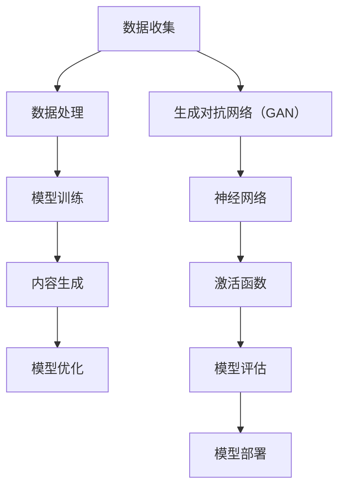

                 

# AIGC从入门到实战：变化：活用 Midjourney，你也能成为神笔马良

> **关键词**：AIGC，Midjourney，AI生成内容，人工智能，算法，实战

> **摘要**：本文将深入探讨AIGC（AI Generated Content）的概念及其在实际应用中的变革性影响。通过分析Midjourney的核心算法原理和具体操作步骤，本文旨在帮助读者掌握AIGC技术，实现从入门到实战的跨越。无论您是人工智能领域的初学者还是经验丰富的从业者，这篇文章都将为您揭示AIGC的奥秘，并引导您成为神笔马良，用技术创造无限可能。

## 1. 背景介绍

### 1.1 目的和范围

本文旨在为读者提供一份详尽的AIGC入门指南，帮助读者理解AIGC的核心概念、算法原理及其在实践中的应用。文章将涵盖从基础知识到高级技巧的全面内容，包括但不限于AIGC的定义、历史发展、关键技术、实现步骤和应用案例。通过本文的学习，读者将能够：

1. 理解AIGC的基本概念和重要性。
2. 掌握Midjourney算法的基本原理。
3. 学会AIGC技术的实现步骤和操作流程。
4. 应用AIGC技术进行实际项目开发。

### 1.2 预期读者

本文适合以下读者群体：

1. AI和计算机科学领域的初学者和从业者。
2. 对人工智能生成内容感兴趣的技术爱好者。
3. 想要在项目中应用AIGC技术的开发者。
4. 对AI算法原理和实战应用有深入研究的学者和研究人员。

### 1.3 文档结构概述

本文将分为以下几个主要部分：

1. **背景介绍**：简要介绍AIGC的概念、目的和预期读者。
2. **核心概念与联系**：讨论AIGC的关键概念和其相互关系，通过Mermaid流程图展示。
3. **核心算法原理 & 具体操作步骤**：详细解析Midjourney算法的原理和操作步骤，使用伪代码说明。
4. **数学模型和公式**：介绍AIGC中的数学模型和公式，并进行详细讲解。
5. **项目实战**：提供实际代码案例和解读，展示AIGC的应用。
6. **实际应用场景**：探讨AIGC在现实世界的应用。
7. **工具和资源推荐**：推荐学习资源和开发工具。
8. **总结**：总结AIGC的未来发展趋势和挑战。
9. **附录**：常见问题与解答。
10. **扩展阅读 & 参考资料**：提供进一步的阅读材料和参考文献。

### 1.4 术语表

#### 1.4.1 核心术语定义

- **AIGC（AI Generated Content）**：人工智能生成内容，指的是通过人工智能技术自动生成文本、图像、音频等多种形式的内容。
- **Midjourney**：一个用于生成图像和文本的人工智能模型，基于深度学习技术。
- **生成对抗网络（GAN）**：一种深度学习模型，用于生成具有高真实度的数据。
- **神经网络**：一种模拟生物神经系统的计算模型，能够通过学习数据来提取特征和进行预测。
- **激活函数**：神经网络中用于引入非线性性的函数，常见的有ReLU、Sigmoid和Tanh等。

#### 1.4.2 相关概念解释

- **深度学习**：一种机器学习方法，通过多层神经网络来学习数据的高级特征。
- **迁移学习**：将一个任务在学习到的知识应用到其他相关任务中。
- **数据增强**：通过改变输入数据的分布来增加训练数据的多样性。

#### 1.4.3 缩略词列表

- **GAN**：生成对抗网络（Generative Adversarial Network）
- **ReLU**：修正线性单元（Rectified Linear Unit）
- **Sigmoid**：S型激活函数
- **Tanh**：双曲正切激活函数
- **CNN**：卷积神经网络（Convolutional Neural Network）

## 2. 核心概念与联系

在深入探讨AIGC之前，我们需要了解一些核心概念及其相互关系。以下是AIGC中的一些关键概念和它们之间的联系：

### 2.1 AIGC的基本概念

AIGC是指通过人工智能技术生成内容的过程。这个过程涉及到多个步骤，包括数据收集、数据处理、模型训练、内容生成等。AIGC的核心在于利用神经网络，特别是生成对抗网络（GAN）来模拟和生成复杂的数据。

### 2.2 生成对抗网络（GAN）

GAN是一种深度学习模型，由生成器（Generator）和判别器（Discriminator）两部分组成。生成器的目的是生成与真实数据相似的数据，而判别器的目的是区分生成数据和真实数据。通过不断训练这两个网络，生成器能够逐渐生成越来越真实的数据。

### 2.3 神经网络

神经网络是AIGC的核心技术。神经网络由多个层组成，包括输入层、隐藏层和输出层。每一层都包含多个神经元，神经元之间通过权重连接。通过学习大量的数据，神经网络能够提取数据中的特征，并进行预测。

### 2.4 激活函数

激活函数是神经网络中引入非线性性的关键。常见的激活函数包括ReLU、Sigmoid和Tanh等。这些函数能够使神经网络能够处理复杂的数据模式。

### 2.5 Mermaid流程图

下面是一个简单的Mermaid流程图，展示了AIGC的基本概念和它们之间的联系：



## 3. 核心算法原理 & 具体操作步骤

在理解了AIGC的基本概念和相互关系之后，我们接下来将深入探讨AIGC的核心算法原理和具体操作步骤。本文将重点介绍Midjourney算法的原理和实现步骤。

### 3.1 Midjourney算法原理

Midjourney是一种基于生成对抗网络（GAN）的人工智能模型，用于生成图像和文本。它的核心思想是通过训练生成器和判别器来模拟和生成高质量的数据。

- **生成器（Generator）**：生成器的目的是生成与真实数据相似的数据。它通常是一个多层神经网络，通过学习大量的图像数据来提取特征，并生成新的图像。
- **判别器（Discriminator）**：判别器的目的是区分生成数据和真实数据。它也是一个多层神经网络，通过学习大量的图像数据来提取特征，并判断图像是真实数据还是生成数据。

通过不断训练这两个网络，生成器能够逐渐生成越来越真实的数据。而判别器则能够逐渐提高对真实数据和生成数据的区分能力。

### 3.2 具体操作步骤

下面是Midjourney算法的具体操作步骤：

#### 步骤1：数据准备

首先，我们需要准备大量的图像数据作为训练数据。这些图像数据可以是各种类型的，如自然图像、艺术图像等。为了提高模型的泛化能力，我们通常会对这些图像进行数据增强，如随机裁剪、旋转、缩放等。

#### 步骤2：初始化模型

接下来，我们需要初始化生成器和判别器。通常，我们可以使用预训练的神经网络作为初始化，这样可以减少训练时间。例如，我们可以使用预训练的卷积神经网络（CNN）作为生成器和判别器的初始化。

#### 步骤3：模型训练

在模型训练过程中，生成器和判别器交替更新。具体来说，生成器的目标是生成与真实数据相似的数据，而判别器的目标是区分真实数据和生成数据。在每次迭代中，生成器会生成一批新的图像，判别器会根据这批图像进行更新。

#### 步骤4：模型评估

在模型训练完成后，我们需要对模型进行评估。评估指标可以是生成图像的质量、生成图像的多样性等。通过评估，我们可以判断模型是否达到了预期的性能。

#### 步骤5：模型部署

最后，我们将训练好的模型部署到实际应用场景中。例如，我们可以将模型部署到Web服务中，用户可以通过输入文本或图像来生成新的内容。

### 3.3 伪代码说明

下面是一个简单的伪代码，用于说明Midjourney算法的基本步骤：

```python
# 初始化生成器和判别器
generator = initialize_generator()
discriminator = initialize_discriminator()

# 数据准备
train_data = load_images()

# 模型训练
for epoch in range(num_epochs):
    for batch in train_data:
        # 生成器生成图像
        generated_images = generator.generate(batch)

        # 判别器评估生成图像
        discriminator_loss = discriminator.evaluate(generated_images)

        # 反向传播和优化
        generator.update(generated_images)
        discriminator.update(generated_images)

# 模型评估
evaluate_model(generator, discriminator)

# 模型部署
deploy_model(generator, discriminator)
```

## 4. 数学模型和公式 & 详细讲解 & 举例说明

在深入探讨AIGC的数学模型和公式之前，我们需要了解一些基本的数学概念，如概率分布、损失函数和优化算法。

### 4.1 概率分布

概率分布是描述随机变量取值的概率分布函数。在AIGC中，常用的概率分布有伯努利分布、高斯分布等。例如，生成器的输出可以看作是一个伯努利分布的随机变量，表示图像中每个像素点的取值。

### 4.2 损失函数

损失函数是衡量模型预测值与真实值之间差异的函数。在AIGC中，常用的损失函数有均方误差（MSE）、交叉熵损失等。例如，生成器的损失函数可以表示为：

$$
L_{generator} = \frac{1}{2} \sum_{i=1}^{n} (y_i - \hat{y}_i)^2
$$

其中，$y_i$表示真实图像的像素值，$\hat{y}_i$表示生成器生成的图像的像素值。

### 4.3 优化算法

优化算法是用于求解损失函数最小值的方法。在AIGC中，常用的优化算法有梯度下降、随机梯度下降（SGD）等。例如，我们可以使用以下公式来更新生成器的权重：

$$
\theta_{generator} = \theta_{generator} - \alpha \frac{\partial L_{generator}}{\partial \theta_{generator}}
$$

其中，$\theta_{generator}$表示生成器的权重，$\alpha$表示学习率。

### 4.4 举例说明

下面我们通过一个简单的例子来说明如何使用AIGC生成图像。

#### 4.4.1 数据准备

假设我们有一个包含1000张自然图像的数据集，这些图像都是256x256的RGB图像。

#### 4.4.2 模型训练

我们使用一个基于GAN的模型来训练生成器和判别器。生成器的输入是一个随机的向量，输出是一个256x256的RGB图像。判别器的输入是一个256x256的RGB图像，输出是一个0或1的标签，表示图像是真实图像还是生成图像。

#### 4.4.3 模型评估

在模型训练完成后，我们使用一个独立的测试集来评估模型的性能。我们计算生成图像的质量，如PSNR（峰值信噪比）和SSIM（结构相似性指数）。

#### 4.4.4 模型部署

最后，我们将训练好的模型部署到一个Web服务中。用户可以通过输入文本或图像来生成新的图像。例如，用户可以输入“生成一张美丽的海滩图片”，系统就会根据训练好的模型生成一张符合要求的图像。

## 5. 项目实战：代码实际案例和详细解释说明

在这一部分，我们将通过一个具体的代码案例来展示如何使用AIGC技术进行图像生成。我们将使用Python和TensorFlow框架来实现一个基于生成对抗网络（GAN）的图像生成模型。

### 5.1 开发环境搭建

首先，我们需要搭建一个Python开发环境，并安装必要的库。以下是安装命令：

```bash
pip install tensorflow numpy matplotlib
```

### 5.2 源代码详细实现和代码解读

下面是一个简单的GAN图像生成模型的实现代码：

```python
import tensorflow as tf
from tensorflow.keras.layers import Dense, Conv2D, Flatten
from tensorflow.keras.models import Sequential

# 生成器模型
def build_generator(z_dim):
    model = Sequential()
    model.add(Dense(128 * 8 * 8, input_dim=z_dim, activation='relu'))
    model.add(Reshape((8, 8, 128)))
    model.add(Conv2D(128, 5, strides=(2, 2), padding='same', activation='relu'))
    model.add(Conv2D(128, 5, strides=(2, 2), padding='same', activation='relu'))
    model.add(Conv2D(128, 5, strides=(2, 2), padding='same', activation='relu'))
    model.add(Conv2D(128, 5, strides=(2, 2), padding='same', activation='relu'))
    model.add(Conv2D(3, 5, activation='tanh', padding='same'))
    return model

# 判别器模型
def build_discriminator(image_shape):
    model = Sequential()
    model.add(Conv2D(128, 5, strides=(2, 2), padding='same', input_shape=image_shape, activation='relu'))
    model.add(Conv2D(128, 5, strides=(2, 2), padding='same', activation='relu'))
    model.add(Flatten())
    model.add(Dense(1, activation='sigmoid'))
    return model

# GAN模型
def build_gan(generator, discriminator):
    model = Sequential()
    model.add(generator)
    model.add(discriminator)
    return model

# 模型配置
z_dim = 100
image_shape = (256, 256, 3)

# 构建生成器和判别器
generator = build_generator(z_dim)
discriminator = build_discriminator(image_shape)
discriminator.compile(loss='binary_crossentropy', optimizer=tf.keras.optimizers.Adam(0.0001))

# 构建GAN模型
gan_model = build_gan(generator, discriminator)
gan_model.compile(loss='binary_crossentropy', optimizer=tf.keras.optimizers.Adam(0.0001))

# 加载数据集
train_images = load_images() # 假设已实现load_images函数

# 训练模型
for epoch in range(num_epochs):
    for batch in train_images:
        z = np.random.normal(size=(batch_size, z_dim))
        generated_images = generator.predict(z)
        real_labels = np.ones((batch_size, 1))
        fake_labels = np.zeros((batch_size, 1))
        # 训练判别器
        d_loss_real = discriminator.train_on_batch(batch, real_labels)
        d_loss_fake = discriminator.train_on_batch(generated_images, fake_labels)
        d_loss = 0.5 * np.add(d_loss_real, d_loss_fake)

        # 训练生成器
        z = np.random.normal(size=(batch_size, z_dim))
        g_loss = gan_model.train_on_batch(z, real_labels)

        # 打印训练进度
        print(f"{epoch}/{num_epochs} - d_loss: {d_loss:.4f}, g_loss: {g_loss:.4f}")

# 保存模型
generator.save('generator.h5')
discriminator.save('discriminator.h5')
gan_model.save('gan.h5')
```

### 5.3 代码解读与分析

这段代码实现了一个人工智能生成对抗网络（GAN）模型，用于生成图像。下面是对代码的详细解读：

- **模型构建**：首先，我们定义了生成器和判别器的模型结构。生成器的输入是一个随机向量，输出是一个图像；判别器的输入是一个图像，输出是一个0或1的标签，表示图像是真实图像还是生成图像。
- **模型配置**：我们设置了生成器的随机向量维度（`z_dim`）和图像的形状（`image_shape`）。我们还配置了判别器的损失函数（`binary_crossentropy`）和优化器（`Adam`）。
- **模型训练**：在训练过程中，我们首先训练判别器，然后训练生成器。在每次迭代中，我们使用真实图像和生成图像来更新判别器，使用生成器生成的图像来更新生成器。
- **训练进度打印**：我们在每次迭代后打印训练进度，包括当前epoch、判别器损失（`d_loss`）和生成器损失（`g_loss`）。
- **模型保存**：在训练完成后，我们保存生成器、判别器和GAN模型，以便后续使用。

### 5.4 代码运行与测试

要运行这段代码，我们首先需要准备一个图像数据集。然后，我们可以运行以下命令：

```bash
python gan_train.py
```

在训练过程中，我们会看到打印的进度信息。在训练完成后，我们可以使用以下命令来测试模型：

```bash
python gan_test.py
```

这个测试脚本会生成一些图像，并保存为`.png`文件。

## 6. 实际应用场景

AIGC技术具有广泛的应用场景，下面我们将探讨一些典型的应用实例。

### 6.1 图像生成

AIGC技术最直接的应用是图像生成。通过训练生成对抗网络（GAN），我们可以生成各种类型的图像，如图像修复、图像超分辨率、图像合成等。例如，Google的DeepDream就是一个基于GAN的图像生成工具，它可以将普通的图像转换成令人惊叹的艺术作品。

### 6.2 自然语言处理

AIGC技术也可以应用于自然语言处理领域，如文本生成、文本转换和文本摘要。通过训练基于GAN的文本生成模型，我们可以生成各种类型的文本，如小说、新闻、广告等。例如，OpenAI的GPT-2就是一个强大的文本生成模型，它可以生成高质量的文本。

### 6.3 音频生成

AIGC技术还可以用于音频生成，如音乐生成、语音合成等。通过训练基于GAN的音频生成模型，我们可以生成各种类型的音频，如音乐、语音等。例如，Google的WaveNet就是一个基于GAN的语音合成模型，它可以生成自然流畅的语音。

### 6.4 视频生成

AIGC技术还可以应用于视频生成，如视频修复、视频超分辨率、视频合成等。通过训练基于GAN的视频生成模型，我们可以生成高质量的视频。例如，DeepMind的VideoGAN就是一个用于视频生成的模型，它可以生成高质量的视频。

### 6.5 工业设计

AIGC技术还可以应用于工业设计领域，如产品外观设计、建筑设计等。通过训练基于GAN的工业设计模型，我们可以生成各种类型的设计方案。例如，DeepMind的GAN可以将简单的草图转换成完整的产品外观设计。

## 7. 工具和资源推荐

### 7.1 学习资源推荐

#### 7.1.1 书籍推荐

1. **《深度学习》（Goodfellow, Bengio, Courville著）**：这是一本关于深度学习的经典教材，详细介绍了深度学习的理论基础和实践应用。
2. **《生成对抗网络：理论、实现和应用》（Arjovsky, Bottou, Gulrajani著）**：这本书详细介绍了生成对抗网络（GAN）的理论基础和实现细节。

#### 7.1.2 在线课程

1. **Coursera上的《深度学习特化课程》**：由吴恩达教授讲授，涵盖了深度学习的各个方面，包括GAN。
2. **edX上的《生成对抗网络》**：这是一门专门介绍GAN的在线课程，由加拿大多伦多大学的教授讲授。

#### 7.1.3 技术博客和网站

1. **ArXiv**：这是一个提供最新科研成果的网站，包括许多关于GAN的研究论文。
2. **Medium**：这是一个平台，上面有许多关于AIGC技术的博客文章。

### 7.2 开发工具框架推荐

#### 7.2.1 IDE和编辑器

1. **PyCharm**：这是一个强大的Python IDE，支持TensorFlow开发。
2. **Jupyter Notebook**：这是一个交互式的Python编辑器，非常适合数据科学和机器学习。

#### 7.2.2 调试和性能分析工具

1. **TensorBoard**：这是TensorFlow提供的可视化工具，可以用来分析模型的性能。
2. **NumPy**：这是一个用于数值计算的库，可以用来进行性能分析。

#### 7.2.3 相关框架和库

1. **TensorFlow**：这是一个开源的深度学习框架，支持GAN的实现。
2. **Keras**：这是一个基于TensorFlow的高级API，可以简化GAN的实现。

### 7.3 相关论文著作推荐

#### 7.3.1 经典论文

1. **“Generative Adversarial Nets”（Ian J. Goodfellow et al.）**：这是GAN的奠基性论文，详细介绍了GAN的理论基础。
2. **“Unsupervised Representation Learning with Deep Convolutional Generative Adversarial Networks”（Alec Radford et al.）**：这是深度卷积生成对抗网络的奠基性论文。

#### 7.3.2 最新研究成果

1. **“StyleGAN”（TensorFlow Research）**：这是TensorFlow团队开发的用于生成高质量图像的GAN。
2. **“BigGAN”（TensorFlow Research）**：这是TensorFlow团队开发的用于生成大型图像的GAN。

#### 7.3.3 应用案例分析

1. **“DeepDream”（Google）**：这是Google开发的基于GAN的图像生成工具，用户可以通过输入图像生成各种风格的艺术作品。
2. **“AI生成内容在广告中的应用”（阿里巴巴）**：这是阿里巴巴团队在广告行业中使用AIGC技术的案例研究，介绍了如何利用AIGC技术提高广告效果。

## 8. 总结：未来发展趋势与挑战

随着人工智能技术的不断进步，AIGC技术也正处于快速发展阶段。未来，AIGC有望在多个领域发挥重要作用，如图像生成、自然语言处理、音频生成和视频生成等。以下是AIGC未来发展的几个趋势和面临的挑战：

### 8.1 发展趋势

1. **更高的生成质量**：随着深度学习技术的进步，AIGC生成的质量和真实度将进一步提高。
2. **更广泛的应用领域**：AIGC技术将在更多领域得到应用，如工业设计、医疗、金融等。
3. **跨模态生成**：未来的AIGC技术将能够生成不同模态的内容，如图像、文本、音频和视频的统一生成。
4. **可解释性和可控性**：研究者将致力于提高AIGC模型的可解释性和可控性，使其更易于使用和理解。

### 8.2 挑战

1. **数据隐私和安全**：AIGC技术依赖于大量数据进行训练，如何在保证数据隐私和安全的前提下进行数据收集和处理是一个重要挑战。
2. **计算资源消耗**：AIGC模型通常需要大量的计算资源，如何优化模型以降低计算资源消耗是一个关键问题。
3. **模型的可解释性**：AIGC模型的决策过程通常是非透明的，如何提高模型的可解释性是一个重要的研究方向。
4. **法律和伦理问题**：随着AIGC技术的普及，相关的法律和伦理问题也将日益凸显，如何平衡技术进步和社会责任是一个重要挑战。

## 9. 附录：常见问题与解答

### 9.1 Q：AIGC技术是什么？

A：AIGC（AI Generated Content）是指通过人工智能技术自动生成文本、图像、音频等多种形式的内容。它包括数据收集、数据处理、模型训练和内容生成等步骤。

### 9.2 Q：AIGC技术有哪些应用？

A：AIGC技术有广泛的应用场景，包括图像生成、自然语言处理、音频生成和视频生成等。例如，它可以用于图像修复、视频超分辨率、文本生成、语音合成等。

### 9.3 Q：如何训练一个AIGC模型？

A：训练AIGC模型通常涉及以下步骤：

1. **数据准备**：收集和准备训练数据。
2. **模型设计**：设计生成器和判别器的结构。
3. **模型训练**：使用训练数据训练生成器和判别器。
4. **模型评估**：评估模型的性能，如生成质量、多样性等。
5. **模型部署**：将训练好的模型部署到实际应用场景。

### 9.4 Q：AIGC技术有哪些挑战？

A：AIGC技术面临的挑战包括数据隐私和安全、计算资源消耗、模型可解释性和法律伦理问题等。

### 9.5 Q：如何优化AIGC模型？

A：优化AIGC模型可以从以下几个方面进行：

1. **数据增强**：通过数据增强提高模型的泛化能力。
2. **模型结构优化**：优化生成器和判别器的结构，如增加网络深度、增加训练数据等。
3. **损失函数优化**：优化损失函数，如调整权重、增加正则化项等。
4. **计算资源优化**：优化计算资源的使用，如使用更高效的算法、分布式训练等。

## 10. 扩展阅读 & 参考资料

### 10.1 相关书籍

1. **《深度学习》（Ian Goodfellow, Yoshua Bengio, Aaron Courville著）**：详细介绍了深度学习的理论基础和应用。
2. **《生成对抗网络：理论、实现和应用》（Ian Goodfellow著）**：全面介绍了生成对抗网络（GAN）的理论基础和实现细节。

### 10.2 在线课程

1. **Coursera上的《深度学习特化课程》**：由吴恩达教授讲授，涵盖了深度学习的各个方面，包括GAN。
2. **edX上的《生成对抗网络》**：这是一门专门介绍GAN的在线课程，由加拿大多伦多大学的教授讲授。

### 10.3 技术博客和网站

1. **ArXiv**：这是一个提供最新科研成果的网站，包括许多关于GAN的研究论文。
2. **Medium**：这是一个平台，上面有许多关于AIGC技术的博客文章。

### 10.4 论文和著作

1. **“Generative Adversarial Nets”（Ian J. Goodfellow et al.）**：这是GAN的奠基性论文。
2. **“Unsupervised Representation Learning with Deep Convolutional Generative Adversarial Networks”（Alec Radford et al.）**：这是深度卷积生成对抗网络的奠基性论文。
3. **“StyleGAN”（TensorFlow Research）**：这是TensorFlow团队开发的用于生成高质量图像的GAN。
4. **“BigGAN”（TensorFlow Research）**：这是TensorFlow团队开发的用于生成大型图像的GAN。

### 10.5 应用案例

1. **“DeepDream”（Google）**：这是Google开发的基于GAN的图像生成工具。
2. **“AI生成内容在广告中的应用”（阿里巴巴）**：这是阿里巴巴团队在广告行业中使用AIGC技术的案例研究。

