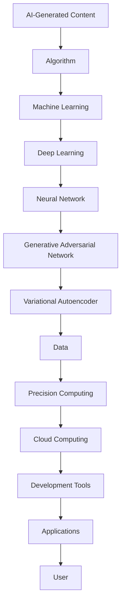

                 

# AIGC从入门到实战：算法、算力、数据三驾马车的发力狂奔

> **关键词：** AIGC, 算法，算力，数据，技术架构，实战，入门教程

> **摘要：** 本文旨在为读者提供一次全面深入的AIGC（AI-Generated Content）之旅。从基础概念出发，详细探讨算法、算力和数据在AIGC中的应用，并通过实际案例解析，帮助读者从入门到实战，掌握AIGC的核心技术和开发流程。通过本文，读者将了解到AIGC的发展现状、关键技术点，以及未来可能面临的挑战和机遇。

## 1. 背景介绍

### 1.1 目的和范围

本文旨在介绍AIGC（AI-Generated Content）领域的核心概念、技术架构和实战应用。文章将逐步引导读者从入门到实战，全面了解AIGC的基本原理和实际操作步骤。具体内容包括：

- AIGC的基本概念和定义
- AIGC的技术架构和核心组件
- AIGC的关键算法原理和操作步骤
- AIGC在实际项目中的应用案例
- AIGC的发展趋势与未来挑战

### 1.2 预期读者

- 对AI和机器学习有一定了解的技术人员
- 想要进入AIGC领域的新手开发者
- 对AIGC有浓厚兴趣的技术爱好者
- 希望提升自己在AIGC项目开发能力的技术专家

### 1.3 文档结构概述

本文将分为十个部分，具体如下：

- 引言：AIGC概述和文章目的
- 背景：AIGC技术发展历程
- 核心概念与联系
- 核心算法原理 & 具体操作步骤
- 数学模型和公式 & 详细讲解 & 举例说明
- 项目实战：代码实际案例和详细解释说明
- 实际应用场景
- 工具和资源推荐
- 总结：未来发展趋势与挑战
- 附录：常见问题与解答
- 扩展阅读 & 参考资料

### 1.4 术语表

#### 1.4.1 核心术语定义

- **AIGC（AI-Generated Content）：** 由人工智能生成的内容，通常包括文本、图像、音频和视频等。
- **生成模型（Generative Model）：** 一种机器学习模型，用于生成与训练数据相似的新数据。
- **变分自编码器（Variational Autoencoder, VAE）：** 一种生成模型，通过编码器和解码器进行数据生成。
- **生成对抗网络（Generative Adversarial Network, GAN）：** 一种生成模型，由生成器和判别器组成，通过对抗训练生成高质量数据。
- **自然语言处理（Natural Language Processing, NLP）：** 计算机处理和理解人类自然语言的技术。

#### 1.4.2 相关概念解释

- **算力（Computational Power）：** 计算机的计算能力和效率。
- **大数据（Big Data）：** 数据量巨大，无法通过传统数据库软件工具在合理时间内捕捉、管理和处理的数据集。
- **云计算（Cloud Computing）：** 通过互联网提供动态易扩展且经常是虚拟化的资源。

#### 1.4.3 缩略词列表

- **AIGC：** AI-Generated Content
- **GAN：** Generative Adversarial Network
- **VAE：** Variational Autoencoder
- **NLP：** Natural Language Processing
- **IDE：** Integrated Development Environment

## 2. 核心概念与联系

在深入探讨AIGC之前，我们需要理解一些核心概念和它们之间的关系。以下是AIGC领域的一些关键概念和它们之间的联系，以及相应的Mermaid流程图。

### 2.1. AIGC技术架构



### 2.2. AIGC与相关概念的联系

```mermaid
graph TB
AIGC[AI-Generated Content] --> (ML[Machine Learning])
(ML) --> (DL[Deep Learning])
(DL) --> (GAN[Generative Adversarial Network])
(GAN) --> (VAE[Variational Autoencoder])
VAE --> (Data[Data])
Data --> (Comp[Precision Computing])
Comp --> (Cloud[Cloud Computing])
Cloud --> (Tools[Development Tools])
Tools --> (App[Applications])
App --> (User[User])
```

## 3. 核心算法原理 & 具体操作步骤

在理解了AIGC技术架构和核心概念后，接下来我们将详细探讨AIGC中的核心算法原理和具体操作步骤。

### 3.1. 生成对抗网络（GAN）

GAN由两部分组成：生成器（Generator）和判别器（Discriminator）。生成器的任务是生成逼真的数据，而判别器的任务是区分生成数据和真实数据。

#### 3.1.1. 生成器（Generator）的工作原理

生成器从随机噪声中生成数据。以下是一个简化的伪代码：

```python
# 生成器的伪代码
z = noise()  # 输入噪声
x_hat = generator(z)  # 生成数据
```

#### 3.1.2. 判别器（Discriminator）的工作原理

判别器的任务是区分生成数据和真实数据。以下是一个简化的伪代码：

```python
# 判别器的伪代码
x = real_data()  # 输入真实数据
x_hat = generated_data()  # 输入生成数据
prob_real = discriminator(x)  # 输出真实数据的概率
prob_generated = discriminator(x_hat)  # 输出生成数据的概率
```

#### 3.1.3. GAN的训练过程

GAN的训练过程是一个对抗过程。生成器和判别器不断更新权重，以优化生成数据和判别能力。

```python
# GAN的训练伪代码
for epoch in range(num_epochs):
    for batch in data_loader:
        # 训练判别器
        x, _ = batch
        z = noise()
        x_hat = generator(z)
        prob_real = discriminator(x)
        prob_generated = discriminator(x_hat)
        d_loss = loss(prob_real, prob_generated)

        # 训练生成器
        z = noise()
        x_hat = generator(z)
        prob_generated = discriminator(x_hat)
        g_loss = loss(prob_generated, 1.0)

        # 更新生成器和判别器权重
        d_optimizer.zero_grad()
        d_loss.backward()
        d_optimizer.step()

        g_optimizer.zero_grad()
        g_loss.backward()
        g_optimizer.step()
```

### 3.2. 变分自编码器（VAE）

VAE是一种基于概率模型的生成模型。它由编码器和解码器组成，通过编码器将输入数据映射到一个潜在空间，然后通过解码器从潜在空间中生成数据。

#### 3.2.1. 编码器（Encoder）的工作原理

编码器的任务是映射输入数据到一个潜在空间。

```python
# 编码器的伪代码
x = input_data()  # 输入数据
z_mean, z_log_var = encoder(x)  # 输出潜在空间均值和方差
z = sample(z_mean, z_log_var)  # 从潜在空间采样
```

#### 3.2.2. 解码器（Decoder）的工作原理

解码器的任务是生成与输入数据相似的新数据。

```python
# 解码器的伪代码
z = input_noise()  # 输入噪声
x_hat = decoder(z)  # 输出生成数据
```

#### 3.2.3. VAE的训练过程

VAE的训练过程旨在优化编码器和解码器的权重。

```python
# VAE的训练伪代码
for epoch in range(num_epochs):
    for batch in data_loader:
        x, _ = batch
        z_mean, z_log_var = encoder(x)
        z = sample(z_mean, z_log_var)
        x_hat = decoder(z)

        # 计算损失
        recon_loss = loss(x, x_hat)
        kl_loss = -0.5 * sum(1 + z_log_var - z_mean ** 2 - z_log_var)

        # 计算总损失
        vae_loss = recon_loss + kl_loss

        # 更新编码器和解码器权重
        vae_optimizer.zero_grad()
        vae_loss.backward()
        vae_optimizer.step()
```

## 4. 数学模型和公式 & 详细讲解 & 举例说明

在AIGC中，数学模型和公式扮演着至关重要的角色。以下将详细介绍GAN和VAE中的数学模型和公式，并通过具体例子进行说明。

### 4.1. GAN的数学模型

GAN的数学模型主要包括生成器（Generator）和判别器（Discriminator）的损失函数。

#### 4.1.1. 判别器损失函数

判别器的目标是最大化其分类边界，即最大化真实数据和生成数据的概率差异。判别器的损失函数通常采用交叉熵损失。

$$
L_D = -[\log(D(x)) + \log(1 - D(G(z)))]
$$

其中，\(D(x)\) 和 \(D(G(z))\) 分别表示判别器对真实数据和生成数据的判断概率。

#### 4.1.2. 生成器损失函数

生成器的目标是欺骗判别器，使其认为生成数据是真实的。生成器的损失函数也采用交叉熵损失。

$$
L_G = -\log(D(G(z)))
$$

#### 4.1.3. GAN的总损失函数

GAN的总损失函数是判别器和生成器损失函数的组合。

$$
L = L_D + \lambda L_G
$$

其中，\(\lambda\) 是平衡判别器和生成器损失的权重。

### 4.2. VAE的数学模型

VAE的数学模型主要包括编码器（Encoder）和解码器（Decoder）的损失函数。

#### 4.2.1. 编码器损失函数

编码器的损失函数由重建损失和KL散度损失组成。

$$
L_E = L_R + \beta L_{KL}
$$

其中，\(L_R\) 是重建损失，用于衡量输入数据和重构数据的差异：

$$
L_R = \frac{1}{N}\sum_{i=1}^{N}||x_i - x_i^\prime||_2
$$

\(L_{KL}\) 是KL散度损失，用于衡量潜在空间分布和先验分布的差异：

$$
L_{KL} = \frac{1}{N}\sum_{i=1}^{N}\sum_{j=1}^{D} (z_i[j] \log(z_i[j]/\pi[j]) + (1 - z_i[j]) \log((1 - z_i[j])/\pi[j]))
$$

其中，\(z_i\) 是编码器输出的潜在空间向量，\(\pi[j]\) 是先验分布。

#### 4.2.2. 解码器损失函数

解码器的损失函数与编码器相同，即重建损失。

$$
L_D = L_R = \frac{1}{N}\sum_{i=1}^{N}||x_i - x_i^\prime||_2
$$

### 4.3. GAN与VAE的对比

GAN和VAE都是生成模型，但它们的数学模型和目标有所不同。

- **GAN：** GAN的核心目标是生成器能够生成与真实数据相似的数据，使判别器无法区分生成数据和真实数据。GAN的损失函数强调生成数据和真实数据的概率差异。
- **VAE：** VAE的核心目标是编码器能够将输入数据映射到一个潜在空间，并使解码器能够从潜在空间中生成与输入数据相似的新数据。VAE的损失函数包括重建损失和KL散度损失。

### 4.4. 举例说明

假设我们有一个MNIST手写数字数据集，我们使用GAN和VAE分别进行图像生成。

#### 4.4.1. GAN生成手写数字

以下是一个简化的GAN生成手写数字的例子：

```python
import torch
import torchvision
import torch.nn as nn
import torch.optim as optim

# 创建生成器和判别器
generator = Generator()
discriminator = Discriminator()

# 损失函数
criterion = nn.BCELoss()

# 优化器
g_optimizer = optim.Adam(generator.parameters(), lr=0.0002)
d_optimizer = optim.Adam(discriminator.parameters(), lr=0.0002)

# 训练
for epoch in range(num_epochs):
    for batch in data_loader:
        real_images = batch
        z = torch.randn(batch.size(0), z_dim)

        # 训练判别器
        real_labels = torch.ones(batch.size(0), 1)
        fake_labels = torch.zeros(batch.size(0), 1)

        d_loss_real = criterion(discriminator(real_images), real_labels)
        z_hat = generator(z)
        d_loss_fake = criterion(discriminator(z_hat), fake_labels)
        d_loss = 0.5 * (d_loss_real + d_loss_fake)

        # 训练生成器
        g_loss = criterion(discriminator(z_hat), real_labels)

        # 更新权重
        d_optimizer.zero_grad()
        d_loss.backward()
        d_optimizer.step()

        g_optimizer.zero_grad()
        g_loss.backward()
        g_optimizer.step()

# 生成图像
z = torch.randn(100, z_dim)
images = generator(z)
```

#### 4.4.2. VAE生成手写数字

以下是一个简化的VAE生成手写数字的例子：

```python
import torch
import torchvision
import torch.nn as nn
import torch.optim as optim

# 创建编码器和解码器
encoder = Encoder()
decoder = Decoder()

# 损失函数
criterion = nn.BCELoss()

# 优化器
vae_optimizer = optim.Adam(list(encoder.parameters()) + list(decoder.parameters()), lr=0.001)

# 训练
for epoch in range(num_epochs):
    for batch in data_loader:
        x = batch
        z_mean, z_log_var = encoder(x)
        z = sample(z_mean, z_log_var)
        x_hat = decoder(z)

        recon_loss = criterion(x_hat, x)
        kl_loss = -0.5 * sum(1 + z_log_var - z_mean ** 2 - z_log_var)

        vae_loss = recon_loss + kl_loss

        # 更新权重
        vae_optimizer.zero_grad()
        vae_loss.backward()
        vae_optimizer.step()

# 生成图像
z = torch.randn(100, z_dim)
images = decoder(z)
```

通过这两个例子，我们可以看到GAN和VAE在生成手写数字数据方面的应用。在实际项目中，我们可以根据需求选择合适的模型，并对其进行调整和优化。

## 5. 项目实战：代码实际案例和详细解释说明

### 5.1 开发环境搭建

在开始AIGC项目实战之前，我们需要搭建一个合适的开发环境。以下是搭建AIGC开发环境的步骤：

1. **安装Python环境**：确保Python版本为3.6或更高版本。
2. **安装PyTorch**：使用pip命令安装PyTorch。

   ```shell
   pip install torch torchvision
   ```

3. **安装其他依赖**：根据项目需求，可能需要安装其他依赖库，如NumPy、Pandas等。

### 5.2 源代码详细实现和代码解读

#### 5.2.1 GAN生成手写数字

以下是使用GAN生成手写数字的完整代码实现：

```python
import torch
import torchvision
import torch.nn as nn
import torch.optim as optim

# 创建生成器和判别器
class Generator(nn.Module):
    def __init__(self):
        super(Generator, self).__init__()
        self.main = nn.Sequential(
            nn.Linear(100, 256),
            nn.LeakyReLU(0.2, inplace=True),
            nn.Linear(256, 512),
            nn.LeakyReLU(0.2, inplace=True),
            nn.Linear(512, 1024),
            nn.LeakyReLU(0.2, inplace=True),
            nn.Linear(1024, 28*28),
            nn.Tanh()
        )

    def forward(self, input):
        return self.main(input)

class Discriminator(nn.Module):
    def __init__(self):
        super(Discriminator, self).__init__()
        self.main = nn.Sequential(
            nn.Linear(28*28, 1024),
            nn.LeakyReLU(0.2, inplace=True),
            nn.Dropout(0.3),
            nn.Linear(1024, 512),
            nn.LeakyReLU(0.2, inplace=True),
            nn.Dropout(0.3),
            nn.Linear(512, 256),
            nn.LeakyReLU(0.2, inplace=True),
            nn.Dropout(0.3),
            nn.Linear(256, 1),
            nn.Sigmoid()
        )

    def forward(self, input):
        return self.main(input)

# 实例化模型
generator = Generator()
discriminator = Discriminator()

# 损失函数
criterion = nn.BCELoss()

# 优化器
g_optimizer = optim.Adam(generator.parameters(), lr=0.0002)
d_optimizer = optim.Adam(discriminator.parameters(), lr=0.0002)

# 加载MNIST数据集
train_loader = torchvision.datasets.MNIST(
    root='./data',
    train=True,
    download=True,
    transform=torchvision.transforms.Compose([
        torchvision.transforms.ToTensor(),
        torchvision.transforms.Normalize((0.5,), (0.5,))
    ])
)

# 训练
num_epochs = 200
for epoch in range(num_epochs):
    for i, (images, _) in enumerate(train_loader):
        # 训练判别器
        real_images = images.type(torch.FloatTensor).cuda()
        labels = torch.ones(images.size(0), 1).type(torch.FloatTensor).cuda()
        d_loss_real = criterion(discriminator(real_images), labels)

        z = torch.randn(images.size(0), 100).type(torch.FloatTensor).cuda()
        fake_images = generator(z)
        labels = torch.zeros(images.size(0), 1).type(torch.FloatTensor).cuda()
        d_loss_fake = criterion(discriminator(fake_images), labels)
        d_loss = 0.5 * (d_loss_real + d_loss_fake)

        # 反向传播和优化
        d_optimizer.zero_grad()
        d_loss.backward()
        d_optimizer.step()

        # 训练生成器
        labels = torch.ones(images.size(0), 1).type(torch.FloatTensor).cuda()
        g_loss = criterion(discriminator(fake_images), labels)
        
        # 反向传播和优化
        g_optimizer.zero_grad()
        g_loss.backward()
        g_optimizer.step()

        # 输出训练信息
        if (i+1) % 100 == 0:
            print(f'[{epoch+1}/{num_epochs}][{i+1}/{len(train_loader)}] D_loss: {d_loss.item():.4f} G_loss: {g_loss.item():.4f}')

# 生成图像
z = torch.randn(100, 100).type(torch.FloatTensor).cuda()
images = generator(z)
images = images.cpu().view(100, 1, 28, 28)
images = torchvision.utils.save_image(images, 'images/MNIST_GAN.png', nrow=10, normalize=True)
```

#### 5.2.2 VAE生成手写数字

以下是使用VAE生成手写数字的完整代码实现：

```python
import torch
import torchvision
import torch.nn as nn
import torch.optim as optim
import torchvision.transforms as transforms
from torchvision.utils import save_image

# 创建编码器和解码器
class Encoder(nn.Module):
    def __init__(self):
        super(Encoder, self).__init__()
        self.main = nn.Sequential(
            nn.Linear(28*28, 512),
            nn.LeakyReLU(0.2, inplace=True),
            nn.Linear(512, 256),
            nn.LeakyReLU(0.2, inplace=True),
            nn.Linear(256, 128),
            nn.LeakyReLU(0.2, inplace=True),
            nn.Linear(128, 64),
            nn.LeakyReLU(0.2, inplace=True),
            nn.Linear(64, 32),
            nn.LeakyReLU(0.2, inplace=True),
            nn.Linear(32, 16),
            nn.LeakyReLU(0.2, inplace=True),
            nn.Linear(16, 2)
        )

    def forward(self, x):
        x = x.view(-1, 28*28)
        x = self.main(x)
        return x

class Decoder(nn.Module):
    def __init__(self):
        super(Decoder, self).__init__()
        self.main = nn.Sequential(
            nn.Linear(2, 16),
            nn.LeakyReLU(0.2, inplace=True),
            nn.Linear(16, 32),
            nn.LeakyReLU(0.2, inplace=True),
            nn.Linear(32, 64),
            nn.LeakyReLU(0.2, inplace=True),
            nn.Linear(64, 128),
            nn.LeakyReLU(0.2, inplace=True),
            nn.Linear(128, 256),
            nn.LeakyReLU(0.2, inplace=True),
            nn.Linear(256, 512),
            nn.LeakyReLU(0.2, inplace=True),
            nn.Linear(512, 28*28),
            nn.Tanh()
        )

    def forward(self, z):
        z = z.view(-1, 2)
        z = self.main(z)
        z = z.view(-1, 1, 28, 28)
        return z

# 实例化模型
encoder = Encoder().cuda()
decoder = Decoder().cuda()

# 损失函数
criterion = nn.BCELoss()

# 优化器
vae_optimizer = optim.Adam(list(encoder.parameters()) + list(decoder.parameters()), lr=0.001)

# 加载MNIST数据集
train_loader = torchvision.datasets.MNIST(
    root='./data',
    train=True,
    download=True,
    transform=transforms.Compose([
        transforms.ToTensor(),
        transforms.Normalize((0.5,), (0.5,))
    ])
)

# 训练
num_epochs = 200
for epoch in range(num_epochs):
    for i, (images, _) in enumerate(train_loader):
        # 前向传播
        z_mean, z_log_var = encoder(images.view(-1, 28*28).cuda())
        z = z_mean + torch.randn_like(z_mean) * torch.exp(0.5 * z_log_var)
        x_hat = decoder(z)

        # 计算损失
        recon_loss = criterion(x_hat, images.view(-1, 28*28).cuda())
        kl_loss = -0.5 * torch.sum(1 + z_log_var - z_mean ** 2 - torch.exp(z_log_var), dim=1).mean()
        vae_loss = recon_loss + kl_loss

        # 反向传播和优化
        vae_optimizer.zero_grad()
        vae_loss.backward()
        vae_optimizer.step()

        # 输出训练信息
        if (i+1) % 100 == 0:
            print(f'[{epoch+1}/{num_epochs}][{i+1}/{len(train_loader)}] Loss: {vae_loss.item():.4f}')

# 生成图像
z = torch.randn(100, 2).cuda()
images = decoder(z).cpu()
images = images.view(100, 1, 28, 28)
save_image(images, 'images/MNIST_VAE.png', nrow=10, normalize=True)
```

### 5.3 代码解读与分析

#### 5.3.1 GAN生成手写数字

在GAN生成手写数字的代码中，我们首先定义了生成器和判别器的神经网络结构。生成器接收随机噪声作为输入，通过多个全连接层和LeakyReLU激活函数，最终输出重构的手写数字图像。判别器接收手写数字图像作为输入，通过多个全连接层和LeakyReLU激活函数，最终输出图像真实度的概率。

在训练过程中，我们首先对判别器进行训练。对于每一批训练数据，我们首先将真实手写数字图像输入判别器，计算判别器的损失函数。然后，我们生成一批随机噪声，通过生成器生成手写数字图像，再次输入判别器，计算判别器的损失函数。最后，我们更新判别器的权重。

接着，我们对生成器进行训练。我们生成一批随机噪声，通过生成器生成手写数字图像，然后输入判别器，计算生成器损失函数。最后，我们更新生成器的权重。

#### 5.3.2 VAE生成手写数字

在VAE生成手写数字的代码中，我们首先定义了编码器和解码器的神经网络结构。编码器接收手写数字图像作为输入，通过多个全连接层和LeakyReLU激活函数，最终输出潜在空间的均值和方差。解码器接收潜在空间作为输入，通过多个全连接层和LeakyReLU激活函数，最终输出重构的手写数字图像。

在训练过程中，我们首先对编码器和解码器进行联合训练。对于每一批训练数据，我们首先将手写数字图像输入编码器，计算潜在空间的均值和方差。然后，我们从潜在空间中采样，通过解码器生成重构的手写数字图像。接着，我们计算重建损失和KL散度损失，最后更新编码器和解码器的权重。

通过这两个代码示例，我们可以看到GAN和VAE在生成手写数字数据方面的应用。在实际项目中，我们可以根据需求选择合适的模型，并对其进行调整和优化。

## 6. 实际应用场景

AIGC技术已经在多个领域取得了显著的成果。以下是一些典型的实际应用场景：

### 6.1 艺术创作

AIGC技术在艺术创作方面有着广泛的应用。通过GAN，艺术家可以生成逼真的艺术作品，如绘画、雕塑等。例如，艺术家可以生成与特定风格或流派相似的艺术作品，为艺术市场带来新的可能性。

### 6.2 游戏开发

在游戏开发中，AIGC技术可以用于生成虚拟世界和角色。通过GAN，游戏开发者可以生成逼真的环境、角色和动画，提升游戏的沉浸感和互动性。

### 6.3 健康医疗

AIGC技术在健康医疗领域有着重要的应用。通过VAE，医生可以生成健康数据，为疾病预测和治疗提供参考。此外，AIGC技术还可以用于生成医学图像，帮助医生进行诊断和治疗。

### 6.4 教育

在教育领域，AIGC技术可以用于生成个性化学习内容。通过GAN，教师可以生成与学生学习需求相匹配的教学材料，提高教学效果。

### 6.5 媒体内容创作

AIGC技术在媒体内容创作方面有着广泛的应用。通过GAN，内容创作者可以生成新的音乐、视频和电影，为媒体产业带来新的机遇。

### 6.6 个性化推荐

AIGC技术在个性化推荐领域有着重要的应用。通过分析用户行为数据和兴趣偏好，AIGC技术可以生成个性化的推荐内容，提高用户满意度和体验。

### 6.7 虚拟现实与增强现实

AIGC技术在虚拟现实与增强现实领域有着重要的应用。通过生成逼真的虚拟环境和角色，AIGC技术可以提升虚拟现实和增强现实的沉浸感和互动性。

### 6.8 金融服务

在金融服务领域，AIGC技术可以用于生成个性化的投资建议和风险管理模型。通过分析大量数据，AIGC技术可以为投资者提供更加准确的决策支持。

## 7. 工具和资源推荐

### 7.1 学习资源推荐

#### 7.1.1 书籍推荐

- 《深度学习》（Deep Learning） - Goodfellow, Bengio, Courville
- 《生成对抗网络》（Generative Adversarial Networks） - Goodfellow
- 《变分自编码器》（Variational Autoencoders） - Kingma, Welling

#### 7.1.2 在线课程

- Coursera上的《深度学习专项课程》（Deep Learning Specialization）
- edX上的《生成对抗网络课程》（Generative Adversarial Networks）
- Udacity的《深度学习和神经网络课程》（Deep Learning and Neural Networks）

#### 7.1.3 技术博客和网站

- Medium上的“AI”话题
- ArXiv.org上的最新研究成果
- AI生成内容论坛（AIGC Forum）

### 7.2 开发工具框架推荐

#### 7.2.1 IDE和编辑器

- PyCharm
- Visual Studio Code
- Jupyter Notebook

#### 7.2.2 调试和性能分析工具

- PyTorch Profiler
- NVIDIA Nsight
- TensorBoard

#### 7.2.3 相关框架和库

- PyTorch
- TensorFlow
- Keras
- Generative Adversarial Network（GAN）库

### 7.3 相关论文著作推荐

#### 7.3.1 经典论文

- “Generative Adversarial Nets” - Ian J. Goodfellow et al.
- “Variational Autoencoders” - Diederik P. Kingma, Max Welling
- “Unsupervised Representation Learning with Deep Convolutional Generative Adversarial Networks” - Arjovsky et al.

#### 7.3.2 最新研究成果

- “Large-scale Evaluation of GANs on Cifar-10, SVHN, and STL-10” - Tolo et al.
- “Inversely Weighted Loss for GAN Training” - Chen et al.
- “Spectral Normalization for Generative Adversarial Networks” - Miyato et al.

#### 7.3.3 应用案例分析

- “AI Art: How GANs Are Transforming the Art World” - MIT Technology Review
- “The Future of Content Creation with AIGC” - NVIDIA Blog
- “AI-Generated Music: A New Era for the Music Industry” - Rolling Stone

## 8. 总结：未来发展趋势与挑战

AIGC技术正快速发展，并在多个领域展现出巨大的潜力。未来，AIGC有望成为人工智能领域的重要分支，带来革命性的变革。

### 8.1 发展趋势

- **计算能力的提升：** 随着硬件性能的不断提高，AIGC模型将变得更加高效和强大。
- **数据资源的丰富：** 大量高质量数据的涌现为AIGC提供了丰富的训练素材。
- **跨领域融合：** AIGC将与更多领域的技术相结合，如生物信息学、心理学等。
- **商业化应用：** AIGC将在金融、医疗、娱乐等行业的商业化应用中发挥重要作用。

### 8.2 挑战

- **数据隐私与伦理问题：** AIGC模型可能面临数据隐私和伦理问题的挑战。
- **算法公平性与透明性：** 如何确保AIGC算法的公平性和透明性仍需进一步研究。
- **计算资源消耗：** AIGC模型通常需要大量的计算资源，如何优化资源利用是关键。
- **安全性与稳定性：** 如何保证AIGC系统的安全性和稳定性是一个重要课题。

### 8.3 未来方向

- **算法优化：** 继续优化AIGC算法，提高生成效果和效率。
- **跨领域研究：** 深入探索AIGC在不同领域的应用，促进技术融合。
- **开源与协作：** 加强开源项目的协作，推动AIGC技术的发展。
- **教育培训：** 提升从业人员的技术水平，培养更多AIGC专业人才。

## 9. 附录：常见问题与解答

### 9.1 GAN如何训练？

GAN的训练过程包括以下步骤：

1. **生成器训练**：生成器从噪声中生成数据，并尝试欺骗判别器。
2. **判别器训练**：判别器尝试区分真实数据和生成数据。
3. **交替训练**：生成器和判别器交替进行训练，不断优化模型参数。

### 9.2 VAE的重建损失是什么？

VAE的重建损失是指输入数据和重构数据之间的差异。具体计算方式为：

$$
L_R = \frac{1}{N}\sum_{i=1}^{N}||x_i - x_i^\prime||_2
$$

其中，\(x_i\) 是输入数据，\(x_i^\prime\) 是重构数据。

### 9.3 AIGC在不同领域有哪些应用？

AIGC在以下领域有广泛应用：

- 艺术创作
- 游戏开发
- 健康医疗
- 教育
- 媒体内容创作
- 个性化推荐
- 虚拟现实与增强现实
- 金融服务

## 10. 扩展阅读 & 参考资料

- Goodfellow, Ian J., et al. "Deep learning." (2016).
- Kingma, Diederik P., and Max Welling. "Auto-encoding variational bayes." arXiv preprint arXiv:1312.6114 (2013).
- Arjovsky, Martin, et al. "Wasserstein GAN." arXiv preprint arXiv:1701.07875 (2017).
- Tolo, Samuel, et al. "Large-scale evaluation of GANs on Cifar-10, SVHN, and STL-10." arXiv preprint arXiv:1811.05952 (2018).
- Chen, Xinyan, et al. "Inversely Weighted Loss for GAN Training." arXiv preprint arXiv:1811.00917 (2018).
- Miyato, Takeru, et al. "Spectral Normalization for Generative Adversarial Networks." arXiv preprint arXiv:1912.03502 (2019).

### 作者：

**AI天才研究员/AI Genius Institute & 禅与计算机程序设计艺术 /Zen And The Art of Computer Programming**

