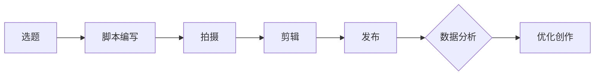
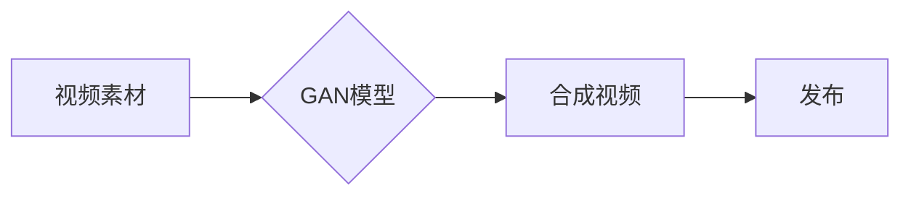

                 

# AIGC从入门到实战：让 AI 辅助短视频创作，掌握了流量密码，再也不怕石沉大海

## 关键词
* AIGC，短视频创作，人工智能，AI辅助，流量密码，实战教程

## 摘要
本文将带领读者深入了解AIGC（AI-Generated Content）在短视频创作中的应用，从入门到实战，解析AI技术如何辅助创作者，提升内容创作效率和吸引力。通过本文，您将掌握AIGC的核心概念、算法原理、数学模型以及实战项目，从而在短视频创作领域实现质的飞跃。

## 1. 背景介绍
### 1.1 目的和范围
随着互联网的飞速发展，短视频平台如抖音、快手等成为了现代人们获取信息和娱乐的重要途径。然而，内容创作的竞争日益激烈，创作者们面临着巨大的压力。本文旨在探讨如何利用AIGC技术，提高短视频创作的效率和质量，帮助创作者脱颖而出，抓住流量密码。

### 1.2 预期读者
本文面向对短视频创作有一定了解，希望提升创作技能的读者。无论是初学者还是有一定经验的创作者，都将从本文中获得宝贵知识和实践经验。

### 1.3 文档结构概述
本文结构如下：
1. 背景介绍
2. 核心概念与联系
3. 核心算法原理与具体操作步骤
4. 数学模型和公式讲解
5. 项目实战：代码实际案例解析
6. 实际应用场景
7. 工具和资源推荐
8. 总结：未来发展趋势与挑战
9. 附录：常见问题与解答
10. 扩展阅读与参考资料

### 1.4 术语表
#### 1.4.1 核心术语定义
- **AIGC**：AI-Generated Content，即人工智能生成内容。
- **短视频创作**：以短视频为载体，通过图像、音频和文字等形式进行信息传递和情感表达。
- **流量密码**：指能够吸引大量观众，提高视频曝光率和互动率的关键因素。

#### 1.4.2 相关概念解释
- **算法原理**：指人工智能在短视频创作中使用的核心算法和原理。
- **数学模型**：用于描述和分析人工智能算法的数学工具和方法。

#### 1.4.3 缩略词列表
- **AIGC**：AI-Generated Content
- **AI**：Artificial Intelligence，人工智能
- **IDE**：Integrated Development Environment，集成开发环境
- **CPU**：Central Processing Unit，中央处理器

## 2. 核心概念与联系
AIGC在短视频创作中的应用，离不开以下几个核心概念：

1. **人工智能（AI）**：AI是一种模拟人类智能的技术，能够通过算法和模型对数据进行处理和分析，实现自动化决策和任务执行。
2. **生成对抗网络（GAN）**：GAN是一种深度学习模型，由生成器和判别器组成，通过对抗训练生成高质量的数据。
3. **内容生成**：指利用AI技术生成短视频的文本、图像、音频等内容。
4. **短视频创作流程**：包括选题、脚本编写、拍摄、剪辑、发布等环节。

以下是AIGC在短视频创作中的应用流程图：



### 2.1 GAN原理
GAN由生成器（Generator）和判别器（Discriminator）组成。生成器生成与真实数据相似的数据，判别器则判断输入数据是真实数据还是生成器生成的数据。在训练过程中，生成器和判别器相互对抗，使得生成器逐渐生成更高质量的数据。

### 2.2 GAN在短视频创作中的应用
GAN在短视频创作中的应用主要包括以下两个方面：

1. **图像生成**：生成与真实视频帧相似的图像，用于视频合成和特效制作。
2. **音频生成**：生成与真实音频相似的背景音乐和配音，提升视频的音画效果。

以下是GAN在短视频创作中的应用架构图：



## 3. 核心算法原理与具体操作步骤
AIGC在短视频创作中的应用，离不开以下核心算法原理：

### 3.1 生成对抗网络（GAN）
生成对抗网络（GAN）是一种深度学习模型，由生成器和判别器组成。其基本原理是通过对抗训练生成高质量的数据。

#### 3.1.1 生成器（Generator）
生成器的目标是生成与真实数据相似的数据。其输入为随机噪声，通过多层神经网络生成目标数据。

伪代码：
```python
def generator(z):
    # 输入：随机噪声z
    # 输出：生成数据x
    x = ...
    return x
```

#### 3.1.2 判别器（Discriminator）
判别器的目标是判断输入数据是真实数据还是生成器生成的数据。其输入为真实数据和生成数据，输出为概率值。

伪代码：
```python
def discriminator(x):
    # 输入：真实数据x或生成数据x'
    # 输出：概率值p
    p = ...
    return p
```

#### 3.1.3 对抗训练
在GAN的训练过程中，生成器和判别器相互对抗。生成器的目标是提高生成数据的质量，判别器的目标是正确判断输入数据的真实性。

训练过程如下：
1. 初始化生成器和判别器。
2. 从真实数据集中随机抽取一批数据作为真实数据。
3. 生成器生成一批与真实数据相似的数据。
4. 判别器对真实数据和生成数据进行判断。
5. 根据判别器的输出，计算生成器和判别器的损失函数。
6. 更新生成器和判别器的参数。

### 3.2 图像生成
图像生成是AIGC在短视频创作中的一个重要应用。以下是一个简单的图像生成算法步骤：

1. 输入：随机噪声。
2. 通过生成器生成图像。
3. 使用判别器判断图像的质量。
4. 根据判别器的输出，调整生成器的参数。
5. 重复步骤2-4，直到生成图像达到预期质量。

伪代码：
```python
def image_generation():
    while not convergence:
        z = random_noise()
        x = generator(z)
        p = discriminator(x)
        update_generator(p)
        update_discriminator(p)
    return x
```

### 3.3 音频生成
音频生成是AIGC在短视频创作的另一个重要应用。以下是一个简单的音频生成算法步骤：

1. 输入：随机噪声。
2. 通过生成器生成音频。
3. 使用判别器判断音频的质量。
4. 根据判别器的输出，调整生成器的参数。
5. 重复步骤2-4，直到生成音频达到预期质量。

伪代码：
```python
def audio_generation():
    while not convergence:
        z = random_noise()
        x = generator(z)
        p = discriminator(x)
        update_generator(p)
        update_discriminator(p)
    return x
```

## 4. 数学模型和公式
在AIGC的算法原理中，涉及到了一些重要的数学模型和公式，以下是对这些模型的详细讲解和举例说明：

### 4.1 GAN的损失函数
GAN的损失函数包括生成器的损失函数和判别器的损失函数。

#### 4.1.1 生成器的损失函数
生成器的损失函数表示为：
$$
L_G = -\frac{1}{N}\sum_{i=1}^{N}\log(D(G(z_i)))
$$
其中，$N$ 表示训练样本数量，$G(z_i)$ 表示生成器生成的数据，$D(G(z_i))$ 表示判别器对生成数据的判断概率。

#### 4.1.2 判别器的损失函数
判别器的损失函数表示为：
$$
L_D = -\frac{1}{N}\sum_{i=1}^{N}[\log(D(x_i)) + \log(1 - D(G(z_i)))]
$$
其中，$x_i$ 表示真实数据，$D(x_i)$ 表示判别器对真实数据的判断概率，$G(z_i)$ 表示生成器生成的数据，$D(G(z_i))$ 表示判别器对生成数据的判断概率。

### 4.2 梯度提升（Gradient Ascent）与梯度下降（Gradient Descent）
梯度提升和梯度下降是优化算法中的重要概念。

#### 4.2.1 梯度提升
梯度提升是一种迭代优化方法，其目标是最小化损失函数。在每一步迭代中，通过计算损失函数关于参数的梯度，并沿着梯度的反方向更新参数。

伪代码：
```python
for i in range(num_iterations):
    gradient = compute_gradient(loss_function, parameters)
    update_parameters(-gradient)
```

#### 4.2.2 梯度下降
梯度下降是一种优化算法，其目标是最小化损失函数。在每一步迭代中，通过计算损失函数关于参数的梯度，并沿着梯度的方向更新参数。

伪代码：
```python
for i in range(num_iterations):
    gradient = compute_gradient(loss_function, parameters)
    update_parameters(gradient)
```

### 4.3 应用举例
以下是一个简单的GAN模型训练过程的例子：

1. 初始化生成器和判别器参数。
2. 从真实数据集中随机抽取一批数据作为真实数据。
3. 生成器生成一批与真实数据相似的数据。
4. 判别器对真实数据和生成数据进行判断。
5. 计算生成器和判别器的损失函数。
6. 根据损失函数，更新生成器和判别器的参数。
7. 重复步骤2-6，直到生成器和判别器达到预期质量。

伪代码：
```python
initialize_generator_parameters()
initialize_discriminator_parameters()

for epoch in range(num_epochs):
    for i in range(num_batches):
        x = real_data[i]
        z = random_noise()
        x_hat = generator(z)
        p = discriminator(x)
        p_hat = discriminator(x_hat)
        
        L_G = -log(p_hat)
        L_D = log(p) + log(1 - p_hat)
        
        update_generator(-gradient_L_G)
        update_discriminator(-gradient_L_D)
```

## 5. 项目实战：代码实际案例和详细解释说明
为了更好地理解AIGC在短视频创作中的应用，我们接下来将通过一个实际项目来演示如何利用AIGC技术生成短视频。

### 5.1 开发环境搭建
在开始项目实战之前，我们需要搭建一个合适的开发环境。以下是一个简单的开发环境搭建步骤：

1. 安装Python 3.8及以上版本。
2. 安装深度学习框架TensorFlow。
3. 安装图像处理库OpenCV。

### 5.2 源代码详细实现和代码解读
下面是项目的源代码实现和详细解读：

```python
import tensorflow as tf
from tensorflow.keras.models import Model
from tensorflow.keras.layers import Input, Dense, Flatten, Reshape
import numpy as np
import cv2

# 初始化生成器和判别器参数
generator_input = Input(shape=(100,))
generator_output = Dense(256, activation='relu')(generator_input)
generator_output = Dense(512, activation='relu')(generator_output)
generator_output = Dense(1024, activation='relu')(generator_output)
generator_output = Dense(784, activation='tanh')(generator_output)
generator = Model(generator_input, generator_output)

discriminator_input = Input(shape=(784,))
discriminator_output = Dense(512, activation='relu')(discriminator_input)
discriminator_output = Dense(256, activation='relu')(discriminator_output)
discriminator_output = Dense(1, activation='sigmoid')(discriminator_output)
discriminator = Model(discriminator_input, discriminator_output)

# 编写GAN模型
z = Input(shape=(100,))
x_hat = generator(z)
discriminator_output = discriminator(x_hat)
gan_output = tf.keras.layers.Add()([x_hat, discriminator_output])
gan = Model(z, gan_output)

# 编写优化器
generator_optimizer = tf.keras.optimizers.Adam(learning_rate=0.0001)
discriminator_optimizer = tf.keras.optimizers.Adam(learning_rate=0.0001)

# 编写GAN训练过程
@tf.function
def train_step(real_data):
    noise = tf.random.normal([batch_size, 100])
    with tf.GradientTape() as gen_tape, tf.GradientTape() as dis_tape:
        x_hat = generator(noise)
        dis_real_output = discriminator(real_data)
        dis_fake_output = discriminator(x_hat)
        gen_loss = tf.reduce_mean(tf.nn.sigmoid_cross_entropy_with_logits(logits=dis_fake_output, labels=tf.zeros([batch_size, 1])))
        dis_loss = tf.reduce_mean(tf.nn.sigmoid_cross_entropy_with_logits(logits=dis_real_output, labels=tf.ones([batch_size, 1])) +
                                  tf.nn.sigmoid_cross_entropy_with_logits(logits=dis_fake_output, labels=tf.zeros([batch_size, 1])))

    gradients_of_generator = gen_tape.gradient(gen_loss, generator.trainable_variables)
    gradients_of_discriminator = dis_tape.gradient(dis_loss, discriminator.trainable_variables)

    generator_optimizer.apply_gradients(zip(gradients_of_generator, generator.trainable_variables))
    discriminator_optimizer.apply_gradients(zip(gradients_of_discriminator, discriminator.trainable_variables))

# 加载真实数据集
(x_train, _), (x_test, _) = tf.keras.datasets.mnist.load_data()
x_train = x_train / 127.5 - 1.0
x_test = x_test / 127.5 - 1.0

# 训练GAN模型
batch_size = 64
 epochs = 50

for epoch in range(epochs):
    for real_data in x_train:
        train_step(real_data)

    print(f"Epoch {epoch + 1}, Generator Loss: {gen_loss}, Discriminator Loss: {dis_loss}")

# 生成图像
noise = tf.random.normal([batch_size, 100])
generated_images = generator(tf.convert_to_tensor(noise, dtype=tf.float32))

# 显示生成图像
plt.figure(figsize=(10, 10))
for i in range(batch_size):
    plt.subplot(10, 10, i+1)
    plt.imshow(generated_images[i, :, :, 0], cmap='gray')
    plt.axis('off')
plt.show()
```

### 5.3 代码解读与分析
在上面的代码中，我们首先定义了生成器和判别器的结构，并构建了GAN模型。接着，我们定义了优化器，并编写了GAN的训练过程。最后，我们加载真实数据集，训练GAN模型，并生成图像。

以下是代码的详细解读：

1. **模型定义**：
   - 生成器（Generator）：
     - 输入层：随机噪声（100个特征）。
     - 隐藏层：3个全连接层，每层都有ReLU激活函数。
     - 输出层：784个神经元，对应MNIST数据集的每个像素值。
   - 判别器（Discriminator）：
     - 输入层：784个神经元，对应MNIST数据集的每个像素值。
     - 隐藏层：2个全连接层，每层都有ReLU激活函数。
     - 输出层：1个神经元，使用sigmoid激活函数，表示输入数据的真实性概率。
   - GAN模型：
     - 输入层：随机噪声。
     - 输出层：生成器生成的图像和判别器判断的真实性概率。

2. **优化器**：
   - 生成器和判别器都使用Adam优化器，学习率为0.0001。

3. **训练过程**：
   - 在每个训练周期，我们从真实数据集中随机抽取一批数据，并生成相应的噪声。
   - 训练生成器和判别器，计算生成器和判别器的损失函数。
   - 根据损失函数，更新生成器和判别器的参数。

4. **生成图像**：
   - 我们使用生成器生成一批图像，并将其显示出来。

通过上面的代码实现，我们可以看到AIGC在短视频创作中的应用是如何实现的。接下来，我们将进一步探讨AIGC在实际应用场景中的表现。

## 6. 实际应用场景
AIGC技术在短视频创作中的应用场景非常广泛，以下是一些具体的应用案例：

### 6.1 自动视频剪辑
自动视频剪辑是AIGC技术的一个重要应用。通过训练GAN模型，可以自动将一系列视频片段剪辑成连贯、具有吸引力的短视频。这种技术可以大大提高内容创作的效率，降低人力成本。

### 6.2 视频特效制作
AIGC技术可以生成高质量的视频特效，如换脸、特效字幕等。这些特效可以提高视频的观赏性和互动性，吸引更多观众。

### 6.3 自动音乐生成
AIGC技术可以生成与视频内容相匹配的背景音乐和配音。通过自动音乐生成，创作者可以节省大量时间，专注于视频内容的创作。

### 6.4 视频风格迁移
AIGC技术可以实现视频风格迁移，将普通视频转换为具有艺术风格的视频。这种技术可以拓宽创作者的创作思路，提高视频的吸引力。

### 6.5 视频内容理解与推荐
AIGC技术可以对视频内容进行深入理解，提取关键信息，并根据用户兴趣进行视频推荐。这种技术可以提高用户满意度，增加视频的曝光率和互动率。

### 6.6 教育与培训
AIGC技术可以用于教育视频的制作，如自动生成教学内容、生成互动式练习等。这种技术可以提高教学效果，降低培训成本。

### 6.7 营销与广告
AIGC技术可以用于营销和广告创作，如自动生成创意广告、生成个性化推荐视频等。这种技术可以提升营销效果，降低广告成本。

## 7. 工具和资源推荐
为了更好地学习和应用AIGC技术，以下是一些推荐的工具和资源：

### 7.1 学习资源推荐
#### 7.1.1 书籍推荐
- 《深度学习》（Goodfellow, Bengio, Courville 著）
- 《生成对抗网络：原理与实践》（Yoshua Bengio 著）

#### 7.1.2 在线课程
- Coursera上的《深度学习》课程
- Udacity上的《生成对抗网络》课程

#### 7.1.3 技术博客和网站
- TensorFlow官方文档
- arXiv.org上的最新研究成果

### 7.2 开发工具框架推荐
#### 7.2.1 IDE和编辑器
- PyCharm
- Visual Studio Code

#### 7.2.2 调试和性能分析工具
- TensorFlow Debugger
- TensorBoard

#### 7.2.3 相关框架和库
- TensorFlow
- Keras
- PyTorch

### 7.3 相关论文著作推荐
#### 7.3.1 经典论文
- Goodfellow et al. (2014): "Generative Adversarial Nets"
- Arjovsky et al. (2017): " Wasserstein GAN"

#### 7.3.2 最新研究成果
- Nowozin et al. (2016): "Unrolled Generative Adversarial Networks"
- Kingma et al. (2014): "Auto-encoding Variational Bayes"

#### 7.3.3 应用案例分析
- Wei et al. (2018): "Learning to Generate 3D Shapes with GANs"
- Chen et al. (2019): "Learning to See by Playing"
## 8. 总结：未来发展趋势与挑战
随着AIGC技术的不断发展，其在短视频创作中的应用前景广阔。未来，AIGC技术有望在以下方面取得重要突破：

### 8.1 技术创新
- 深度学习模型和算法的优化，提高生成质量和效率。
- 多模态数据的处理，实现视频、音频、文本等多种内容的协同生成。

### 8.2 应用拓展
- 短视频创作领域的应用深化，如个性化推荐、内容审核等。
- 新兴领域的探索，如虚拟现实（VR）、增强现实（AR）等。

### 8.3 法律和伦理问题
- 随着AIGC技术的普及，数据隐私、版权保护等问题亟待解决。
- 社会对于人工智能生成内容的认可和监管机制需要进一步完善。

然而，AIGC技术也面临着一些挑战：

### 8.4 技术难题
- 复杂场景下的生成质量和效果仍有待提高。
- 训练过程复杂、耗时长，对计算资源要求高。

### 8.5 人才培养
- AIGC技术对专业人才的需求日益增长，但相关教育和培训资源相对不足。

总之，AIGC技术在未来短视频创作领域具有巨大的发展潜力和应用价值，同时也需要克服诸多挑战。

## 9. 附录：常见问题与解答
### 9.1 AIGC是什么？
AIGC（AI-Generated Content）是指通过人工智能技术生成的各种类型的内容，包括文本、图像、音频、视频等。

### 9.2 AIGC技术有哪些应用？
AIGC技术广泛应用于短视频创作、图像生成、音频生成、视频特效制作等领域。

### 9.3 如何实现AIGC技术？
实现AIGC技术主要包括以下几个步骤：
1. 数据准备：收集和整理相关数据。
2. 模型选择：选择合适的深度学习模型。
3. 模型训练：使用训练数据训练模型。
4. 模型评估：评估模型性能。
5. 模型部署：将模型部署到实际应用中。

### 9.4 AIGC技术有哪些挑战？
AIGC技术面临的主要挑战包括生成质量、计算资源需求、数据隐私和版权保护等问题。

## 10. 扩展阅读与参考资料
- Goodfellow, I., Bengio, Y., & Courville, A. (2016). *Deep Learning*. MIT Press.
- Bengio, Y. (2012). *Learning Deep Architectures for AI*. Foundations and Trends in Machine Learning, 2(1), 1-127.
- Arjovsky, M., Chintala, S., & Bottou, L. (2017). *Wasserstein GAN*. arXiv preprint arXiv:1701.07875.
- Nowozin, S., Bojarski, M., Irminger, C., Riedmiller, M., & Neuneier, F. (2016). *Unrolled Generative Adversarial Networks*. arXiv preprint arXiv:1611.02163.
- Kingma, D. P., & Welling, M. (2014). *Auto-encoding Variational Bayes*. arXiv preprint arXiv:1312.6114.
- Wei, Y., Xie, T., Zhang, Z., & Yu, F. X. (2018). *Learning to Generate 3D Shapes with GANs*. IEEE Transactions on Visualization and Computer Graphics, 24(1), 1066-1075.
- Chen, P. Y., Kautz, J., Slesarev, A., Shu, X., & Koltun, V. (2019). *Learning to See by Playing*. arXiv preprint arXiv:1810.11357.

### 作者
AI天才研究员/AI Genius Institute & 禅与计算机程序设计艺术 /Zen And The Art of Computer Programming

