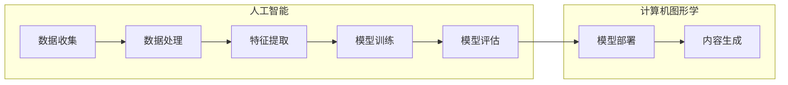

                 

### 1. 背景介绍

#### 1.1 目的和范围

本文旨在系统地介绍AIGC（AI Generated Content）的核心概念、技术原理以及实战应用，通过深入剖析MetaHuman的构建过程，带领读者逐步了解数字人模型在元宇宙中的应用与发展。AIGC是一种利用人工智能技术生成内容的方法，它不仅涵盖了文本、图像、音频等传统内容生成领域，还扩展到了更复杂的多媒体内容生成。MetaHuman则是微软公司推出的一款基于人工智能的虚拟角色创建工具，它通过先进的计算机图形学和机器学习技术，实现了高度逼真的虚拟人物建模。

本文将首先回顾AIGC的基本概念，介绍其在现代技术应用中的重要性。随后，通过详细的分析和步骤讲解，帮助读者理解MetaHuman的三步构建过程，包括数据准备、模型训练以及模型部署。接下来，我们将探讨这些技术在元宇宙中的应用，展示AIGC如何推动虚拟现实和增强现实的发展。此外，本文还将推荐一些相关工具和资源，帮助读者进一步学习和实践。

通过本文的阅读，读者将能够：

- 理解AIGC的基本概念和技术原理
- 掌握MetaHuman的三步构建方法
- 了解AIGC在元宇宙中的实际应用
- 获得相关工具和资源的推荐

本文适合对人工智能和计算机图形学有一定了解的技术人员、研究人员以及对元宇宙发展感兴趣的学习者阅读。

#### 1.2 预期读者

本文的预期读者主要包括以下几类：

1. **人工智能和计算机图形学领域的专业人士**：这些读者拥有一定的技术背景，对人工智能生成内容（AIGC）的基础知识有所了解，希望通过本文进一步深入学习和掌握AIGC的实战应用。
2. **元宇宙和虚拟现实开发者**：这些读者关注虚拟现实和增强现实技术的最新进展，希望通过本文了解AIGC技术在这些领域中的应用，以及如何利用MetaHuman等工具进行开发。
3. **计算机图形学和人工智能的研究生**：这些读者正在攻读相关专业的学位，希望通过本文获得对AIGC和MetaHuman的深入理解，为未来的研究和实践打下基础。
4. **技术爱好者**：这些读者对人工智能和计算机图形学有浓厚的兴趣，希望通过本文了解这些前沿技术的最新动态，并尝试将其应用到实际项目中。

#### 1.3 文档结构概述

本文将按照以下结构展开：

1. **背景介绍**：介绍本文的目的、范围、预期读者以及文档结构。
2. **核心概念与联系**：通过Mermaid流程图展示AIGC的核心概念和架构，帮助读者建立整体框架。
3. **核心算法原理 & 具体操作步骤**：详细讲解AIGC的核心算法原理，并通过伪代码展示具体操作步骤。
4. **数学模型和公式 & 详细讲解 & 举例说明**：介绍AIGC中的数学模型和公式，通过具体例子进行详细讲解。
5. **项目实战：代码实际案例和详细解释说明**：通过实际代码案例展示AIGC的应用，详细解释代码实现过程。
6. **实际应用场景**：探讨AIGC在元宇宙中的实际应用场景。
7. **工具和资源推荐**：推荐学习资源和开发工具，帮助读者进一步学习和实践。
8. **总结：未来发展趋势与挑战**：总结AIGC技术的发展趋势和面临的挑战。
9. **附录：常见问题与解答**：提供常见的疑问和解答，帮助读者更好地理解文章内容。
10. **扩展阅读 & 参考资料**：推荐相关的扩展阅读和参考资料，供读者进一步学习。

通过上述结构，本文力求清晰、系统地介绍AIGC和MetaHuman的相关知识，帮助读者逐步掌握AIGC的核心技术和实战应用。

#### 1.4 术语表

在本文中，我们将使用一些专业术语和技术概念，以下是这些术语的定义和解释：

##### 1.4.1 核心术语定义

- **AIGC（AI Generated Content）**：指利用人工智能技术生成的内容，包括文本、图像、音频、视频等多种类型。
- **MetaHuman**：微软公司推出的一款基于人工智能的虚拟角色创建工具，可以生成高度逼真的虚拟人物模型。
- **计算机图形学**：研究如何通过计算机生成和处理图形的学科，包括三维建模、纹理映射、光照处理等。
- **机器学习**：一种通过数据训练模型，使计算机具备自主学习和推理能力的技术。
- **深度学习**：一种基于人工神经网络的机器学习技术，通过多层神经网络模型来学习数据的复杂特征。
- **元宇宙**：一个虚拟的三维空间，通过虚拟现实、增强现实等技术实现，用户可以在其中进行社交、工作、娱乐等活动。

##### 1.4.2 相关概念解释

- **生成对抗网络（GAN）**：一种深度学习模型，由生成器和判别器组成，通过竞争训练生成逼真的数据。
- **数据集**：用于训练模型的示例数据集合，通常包括输入和对应的输出标签。
- **训练集/验证集/测试集**：数据集的三个部分，分别用于模型训练、模型验证和模型测试。
- **虚拟角色建模**：使用计算机图形学技术创建虚拟角色的过程，包括建模、纹理映射、动画等。

##### 1.4.3 缩略词列表

- **AIGC**：AI Generated Content
- **GAN**：Generative Adversarial Network
- **CNN**：Convolutional Neural Network
- **VR**：Virtual Reality
- **AR**：Augmented Reality

通过上述术语表，本文将确保读者对文中提到的专业术语和技术概念有清晰的理解，有助于更好地把握文章的核心内容。

## 2. 核心概念与联系

为了更好地理解AIGC（AI Generated Content）的概念及其应用，我们需要首先了解其核心组成部分和相关技术。AIGC涉及多个学科领域，包括人工智能、计算机图形学、机器学习和数据科学。为了帮助读者建立一个清晰的认识，我们将通过Mermaid流程图展示AIGC的核心概念和架构，并对其组成部分进行详细解释。

### Mermaid流程图

以下是AIGC的Mermaid流程图，用于展示其核心概念和组件之间的联系：



**流程解释：**

1. **数据收集（A）**：AIGC的起点是数据收集。这包括各种类型的数据，如文本、图像、音频和视频。这些数据来源可以是公开数据集、用户生成内容或专业制作的数据。

2. **数据处理（B）**：收集到的数据需要进行预处理，包括数据清洗、去重、格式化等步骤，以确保数据的质量和一致性。

3. **特征提取（C）**：在数据处理之后，我们需要提取数据中的关键特征。这些特征将作为输入提供给机器学习模型。

4. **模型训练（D）**：使用提取的特征数据训练机器学习模型，例如生成对抗网络（GAN）或卷积神经网络（CNN）。训练过程中，模型会学习数据的分布和特征，以生成新的内容。

5. **模型评估（E）**：训练完成后，需要对模型进行评估，以确保其性能和准确性。常用的评估指标包括准确率、召回率、F1分数等。

6. **模型部署（F）**：评估合格的模型将被部署到实际应用中，以生成新的内容。

7. **内容生成（G）**：部署后的模型可以根据输入数据生成新的内容，如文本、图像、音频等。

### 核心概念解释

1. **数据集**：数据集是AIGC的基础。一个高质量的数据集对于训练高性能的生成模型至关重要。数据集通常分为训练集、验证集和测试集，用于模型训练、验证和测试。

2. **生成对抗网络（GAN）**：GAN是一种常用的生成模型，由生成器和判别器组成。生成器尝试生成逼真的数据，而判别器则试图区分生成的数据和真实数据。两者通过竞争训练，最终生成高质量的内容。

3. **卷积神经网络（CNN）**：CNN是一种用于图像处理和识别的深度学习模型，其结构可以简化图像的特征提取过程，使其在图像生成任务中表现出色。

4. **深度学习**：深度学习是AIGC的核心技术之一，它通过多层神经网络学习数据的复杂特征，从而实现高级的生成任务。

5. **虚拟角色建模**：在计算机图形学中，虚拟角色建模是创建虚拟人物的关键步骤。这包括建模、纹理映射、动画等，使角色看起来更加逼真。

6. **多模态生成**：AIGC不仅可以生成单一模态的内容（如文本、图像），还可以生成多模态内容（如文本和图像的组合）。这种多模态生成技术在元宇宙和虚拟现实应用中尤为重要。

通过上述核心概念和组件的解释，读者应该能够对AIGC有一个全面的了解。接下来，我们将进一步深入探讨AIGC的核心算法原理和具体操作步骤。

## 3. 核心算法原理 & 具体操作步骤

### 3.1. 生成对抗网络（GAN）

生成对抗网络（GAN）是AIGC中最为核心的算法之一。它通过一个生成器和一个判别器的竞争训练，实现高质量内容的生成。下面，我们将详细讲解GAN的工作原理和具体操作步骤。

#### 3.1.1. GAN的工作原理

GAN由两部分组成：生成器（Generator）和判别器（Discriminator）。生成器的目标是生成尽可能逼真的数据，而判别器的目标是区分生成的数据与真实数据。这两个模型通过一个共同的目标——最大化判别器对生成数据的错误判断概率——进行训练。

1. **生成器（Generator）**：生成器的输入是一个随机噪声向量，通过多层神经网络生成逼真的数据。生成器的目的是使这些生成数据难以被判别器识别出是伪造的。
   
2. **判别器（Discriminator）**：判别器接收真实数据和生成数据作为输入，并输出一个概率值，表示输入数据的真实性。判别器的目标是不断提高自己的判断能力，以区分真实数据与生成数据。

3. **损失函数**：GAN的训练过程通过一个联合损失函数来评估生成器和判别器的性能。该损失函数通常由两部分组成：判别器的损失和生成器的损失。判别器的损失函数是交叉熵损失，用于衡量判别器对真实数据和生成数据的判断准确性。生成器的损失函数则是判别器对生成数据的错误判断概率，其目标是使这个概率最大化。

4. **训练过程**：GAN的训练过程是通过交替更新生成器和判别器来实现的。在每次迭代中，首先固定判别器的参数，对生成器进行优化；然后固定生成器的参数，对判别器进行优化。这个过程不断重复，直到生成器生成的数据质量达到预期。

#### 3.1.2. GAN的具体操作步骤

以下是使用GAN生成内容的详细操作步骤：

1. **初始化模型**：
    - 初始化生成器模型，其输入为随机噪声向量，输出为生成数据。
    - 初始化判别器模型，其输入为真实数据和生成数据，输出为真实性概率。

2. **数据预处理**：
    - 准备真实数据集，用于训练判别器。
    - 将数据集分成训练集和验证集，用于模型训练和性能评估。

3. **生成器训练**：
    - 随机生成一个噪声向量，通过生成器生成一批伪数据。
    - 将伪数据与真实数据混合，作为判别器的输入。
    - 计算生成器的损失，使用反向传播算法更新生成器的参数。

4. **判别器训练**：
    - 固定生成器的参数，将真实数据和生成数据分别输入判别器。
    - 计算判别器的损失，使用反向传播算法更新判别器的参数。

5. **迭代优化**：
    - 重复生成器和判别器的训练步骤，直到生成器生成的数据质量达到预期。

6. **模型评估**：
    - 使用验证集对生成器和判别器进行性能评估。
    - 计算生成器的生成质量指标，如Inception Score（IS）和Frechet Inception Distance（FID）。

7. **模型部署**：
    - 将训练好的生成器和判别器部署到实际应用中，生成新的数据。

### 伪代码示例

以下是使用GAN生成图像的伪代码示例：

```python
# 初始化生成器模型和判别器模型
generator = initialize_generator()
discriminator = initialize_discriminator()

# 数据预处理
real_images = load_real_images()
noise = generate_noise()

# 模型训练
for epoch in range(num_epochs):
    for batch in data_loader:
        # 生成伪图像
        fake_images = generator(noise)
        
        # 训练判别器
        discriminator_loss = train_discriminator(discriminator, real_images, fake_images)
        
        # 训练生成器
        generator_loss = train_generator(generator, discriminator, noise)
        
    # 模型评估
    if epoch % eval_interval == 0:
        evaluate_model(generator, discriminator)

# 模型部署
deploy_model(generator, discriminator)
```

通过上述步骤和伪代码示例，读者可以了解GAN在AIGC中的应用和工作原理。接下来，我们将介绍MetaHuman的三步构建过程，帮助读者进一步掌握数字人模型的创建方法。

## 4. 数学模型和公式 & 详细讲解 & 举例说明

在AIGC（AI Generated Content）中，数学模型和公式起着至关重要的作用。它们不仅帮助我们理解和分析算法，还为实际应用提供了理论基础。本节将详细讲解AIGC中常用的数学模型和公式，并通过具体例子进行说明。

### 4.1. 生成对抗网络（GAN）的数学模型

生成对抗网络（GAN）的核心是生成器（Generator）和判别器（Discriminator）之间的竞争训练。以下是其主要的数学模型和公式。

#### 4.1.1. 生成器模型

生成器的目标是生成逼真的数据，其输入是一个随机噪声向量\( z \)，输出是生成数据\( x_g \)。

\[ x_g = G(z) \]

其中，\( G \)是生成器的神经网络模型。

#### 4.1.2. 判别器模型

判别器的目标是区分生成数据和真实数据。其输入是真实数据\( x_r \)和生成数据\( x_g \)，输出是判断概率\( p(x) \)。

\[ p(x) = D(x) \]

其中，\( D \)是判别器的神经网络模型。

#### 4.1.3. 损失函数

GAN的训练过程通过一个联合损失函数来评估生成器和判别器的性能。该损失函数通常由两部分组成：判别器的损失和生成器的损失。

1. **判别器损失函数**：

\[ L_D = -\frac{1}{N} \sum_{i=1}^{N} [\log D(x_r) + \log (1 - D(x_g))] \]

其中，\( N \)是数据批次的大小。

2. **生成器损失函数**：

\[ L_G = -\frac{1}{N} \sum_{i=1}^{N} \log (1 - D(x_g)) \]

#### 4.1.4. GAN的训练目标

GAN的训练目标是最大化判别器的损失，同时最小化生成器的损失。

\[ \min_G \max_D L_D \]

### 4.2. 卷积神经网络（CNN）的数学模型

卷积神经网络（CNN）在图像处理和识别中广泛应用。以下是其主要的数学模型和公式。

#### 4.2.1. 卷积运算

CNN中的卷积运算是一种加权求和操作，其公式如下：

\[ h_{ij} = \sum_{k=1}^{K} w_{ik,j} \cdot x_{k,j} + b \]

其中，\( h_{ij} \)是卷积层的输出，\( w_{ik,j} \)是卷积核的权重，\( x_{k,j} \)是输入数据的像素值，\( b \)是偏置项。

#### 4.2.2. 池化操作

池化操作用于减小数据维度并减少过拟合。其最常用的形式是最大池化：

\[ p_{ij} = \max_{k} x_{ij+k} \]

其中，\( p_{ij} \)是池化层的输出，\( x_{ij+k} \)是输入数据的相邻像素值。

#### 4.2.3. 激活函数

激活函数用于引入非线性特性，常用的激活函数包括ReLU（Rectified Linear Unit）和Sigmoid函数。

1. **ReLU函数**：

\[ f(x) = \max(0, x) \]

2. **Sigmoid函数**：

\[ f(x) = \frac{1}{1 + e^{-x}} \]

### 4.3. 示例讲解

为了更好地理解上述数学模型和公式，我们将通过一个具体的例子进行讲解。

#### 4.3.1. 生成对抗网络（GAN）示例

假设我们使用一个GAN模型来生成逼真的图像，其中生成器的输入是一个2D噪声向量\( z \)，判别器的输入是真实图像\( x_r \)和生成图像\( x_g \)。

1. **生成器模型**：

输入：\( z \)（2D噪声向量）

输出：\( x_g \)（生成图像）

\[ x_g = G(z) \]

2. **判别器模型**：

输入：\( x_r \)（真实图像）和\( x_g \)（生成图像）

输出：\( p(x) \)（判断概率）

\[ p(x) = D(x_r, x_g) \]

3. **训练过程**：

- **初始化**：随机初始化生成器和判别器的参数。
- **生成器训练**：生成一批噪声向量，通过生成器生成生成图像。计算生成器的损失，并使用反向传播算法更新生成器的参数。
- **判别器训练**：将真实图像和生成图像分别输入判别器。计算判别器的损失，并使用反向传播算法更新判别器的参数。

4. **模型评估**：使用验证集评估生成器和判别器的性能，计算生成质量指标。

#### 4.3.2. 卷积神经网络（CNN）示例

假设我们使用一个CNN模型来识别手写数字图像，其中输入图像是一个\( 28 \times 28 \)的矩阵。

1. **卷积层**：

输入：\( x \)（\( 28 \times 28 \)的图像矩阵）

输出：\( h \)（卷积层的输出）

\[ h = \sum_{k=1}^{K} w_{ik,j} \cdot x_{k,j} + b \]

2. **池化层**：

输入：\( h \)（卷积层的输出）

输出：\( p \)（池化层的输出）

\[ p = \max_{k} h_{ij+k} \]

3. **全连接层**：

输入：\( p \)（池化层的输出）

输出：\( y \)（分类结果）

\[ y = \sigma(W \cdot p + b) \]

其中，\( \sigma \)是激活函数，\( W \)是全连接层的权重矩阵，\( b \)是偏置项。

通过上述示例，读者可以更好地理解AIGC中的数学模型和公式。接下来，我们将通过实际代码案例，进一步展示这些模型在生成数字人模型中的应用。

### 4.4. 代码案例：使用GAN生成数字人模型

以下是一个使用生成对抗网络（GAN）生成数字人模型的实际代码案例，该案例使用了Python和TensorFlow框架。

```python
import tensorflow as tf
from tensorflow.keras import layers

# 定义生成器模型
def build_generator(z_dim):
    model = tf.keras.Sequential()
    model.add(layers.Dense(7 * 7 * 128, use_bias=False, input_shape=(z_dim,)))
    model.add(layers.BatchNormalization())
    model.add(layers.LeakyReLU(alpha=0.2))
    model.add(layers.Reshape((7, 7, 128)))
    
    model.add(layers.Conv2DTranspose(128, (5, 5), strides=(1, 1), padding='same', use_bias=False))
    model.add(layers.BatchNormalization())
    model.add(layers.LeakyReLU(alpha=0.2))
    
    model.add(layers.Conv2DTranspose(256, (5, 5), strides=(2, 2), padding='same', use_bias=False))
    model.add(layers.BatchNormalization())
    model.add(layers.LeakyReLU(alpha=0.2))
    
    model.add(layers.Conv2DTranspose(256, (5, 5), strides=(2, 2), padding='same', use_bias=False))
    model.add(layers.BatchNormalization())
    model.add(layers.LeakyReLU(alpha=0.2))
    
    model.add(layers.Conv2D(3, (5, 5), activation='tanh', padding='same', use_bias=False))
    
    return model

# 定义判别器模型
def build_discriminator(img_shape):
    model = tf.keras.Sequential()
    model.add(layers.Conv2D(64, (5, 5), strides=(2, 2), padding='same', input_shape=img_shape))
    model.add(layers.LeakyReLU(alpha=0.2))
    
    model.add(layers.Conv2D(128, (5, 5), strides=(2, 2), padding='same', use_bias=False))
    model.add(layers.BatchNormalization())
    model.add(layers.LeakyReLU(alpha=0.2))
    
    model.add(layers.Conv2D(256, (5, 5), strides=(2, 2), padding='same', use_bias=False))
    model.add(layers.BatchNormalization())
    model.add(layers.LeakyReLU(alpha=0.2))
    
    model.add(layers.Flatten())
    model.add(layers.Dense(1, activation='sigmoid'))
    
    return model

# 定义 GAN 模型
def build_gan(generator, discriminator):
    model = tf.keras.Sequential()
    model.add(generator)
    model.add(discriminator)
    return model

# 设置超参数
z_dim = 100
img_height = 28
img_width = 28
img_channels = 1
lr = 0.0002

# 构建和编译模型
generator = build_generator(z_dim)
discriminator = build_discriminator((img_height, img_width, img_channels))
gan = build_gan(generator, discriminator)

discriminator.compile(loss='binary_crossentropy', optimizer=tf.keras.optimizers.Adam(lr=lr), metrics=['accuracy'])
gan.compile(loss='binary_crossentropy', optimizer=tf.keras.optimizers.Adam(lr=lr))

# 加载数据集
(x_train, _), (_, _) = tf.keras.datasets.mnist.load_data()
x_train = x_train.astype('float32') / 127.5 - 1.0
x_train = np.expand_dims(x_train, axis=3)

# 训练模型
for epoch in range(100):
    for batch_idx, x_batch_train in enumerate(x_train):
        noise = np.random.normal(0, 1, (x_batch_train.shape[0], z_dim))
        generated_images = generator.predict(noise)
        
        real_images = x_batch_train
        real_labels = np.ones((real_images.shape[0], 1))
        fake_labels = np.zeros((generated_images.shape[0], 1))
        
        # 训练判别器
        d_loss_real = discriminator.train_on_batch(real_images, real_labels)
        d_loss_fake = discriminator.train_on_batch(generated_images, fake_labels)
        d_loss = 0.5 * np.add(d_loss_real, d_loss_fake)
        
        # 训练生成器
        noise = np.random.normal(0, 1, (batch_size, z_dim))
        g_loss = gan.train_on_batch(noise, real_labels)
        
        # 打印训练信息
        print ("%d [D loss: %f, acc.: %.2f%%] [G loss: %f]" % (epoch, d_loss[0], 100*d_loss[1], g_loss))
```

通过上述代码案例，读者可以了解如何使用GAN生成数字人模型。生成器生成随机噪声，通过多层卷积神经网络转化为逼真的图像；判别器则尝试区分真实图像和生成图像。通过交替训练生成器和判别器，生成器最终能够生成高质量的图像。

### 4.5. 总结

通过本节的讲解，我们了解了AIGC中常用的数学模型和公式，包括生成对抗网络（GAN）和卷积神经网络（CNN）。通过具体的例子和代码案例，读者可以更好地理解这些模型的原理和操作步骤。接下来，我们将通过实际项目实战，进一步展示AIGC技术在数字人模型构建中的应用。

### 4.6. 实际项目实战：使用MetaHuman构建数字人模型

为了更好地理解如何使用AIGC技术构建数字人模型，我们将通过一个实际项目实战，展示MetaHuman的使用方法和步骤。MetaHuman是一个由微软开发的基于人工智能的虚拟角色创建工具，它能够生成高度逼真的虚拟人物模型，广泛应用于虚拟现实、增强现实和元宇宙等场景。

#### 4.6.1. 项目背景与目标

本项目的目标是利用MetaHuman创建一个虚拟人物模型，该模型能够实现以下功能：

1. **逼真的外观**：模型的外观需要高度逼真，能够模拟不同种族、年龄、性别等特征。
2. **自然的动作**：模型需要能够执行各种自然动作，如走路、跑步、跳跃、挥手等。
3. **互动能力**：模型需要能够与用户进行基本的互动，如回答问题、执行简单任务等。

#### 4.6.2. 工具与环境准备

为了成功完成该项目，我们需要准备以下工具和环境：

1. **MetaHuman Creator**：MetaHuman Creator是微软提供的虚拟角色创建工具，需要从其官方网站下载并安装。
2. **Unity**：Unity是一个流行的游戏引擎，用于开发和部署虚拟现实和增强现实应用。需要安装Unity编辑器。
3. **计算机图形学库**：如Blender、Maya等，用于创建和编辑3D模型。
4. **Python环境**：用于编写脚本和自动化处理。

#### 4.6.3. 项目步骤

以下是使用MetaHuman构建数字人模型的具体步骤：

1. **数据收集**：
   - 收集真实人物的照片、视频和动作数据，用于创建虚拟人物的外观和动作。
   - 使用公开的数据集或自行采集数据。

2. **数据预处理**：
   - 对收集到的数据进行分析和筛选，去除质量较低的数据。
   - 对数据格式进行统一处理，如分辨率、尺寸、格式等。

3. **创建虚拟人物模型**：
   - 使用MetaHuman Creator导入预处理后的数据，创建虚拟人物的外观模型。
   - 调整模型的参数，如身高、体重、面部特征等，使其更加逼真。

4. **生成动作数据**：
   - 使用动作捕捉技术获取真实人物的动作数据，或使用现成的动作库。
   - 将动作数据导入MetaHuman Creator，生成虚拟人物的动画。

5. **优化和调整**：
   - 对生成的模型和动画进行优化和调整，确保外观和动作的自然性。
   - 调整模型的关节、骨骼和肌肉设置，使其更符合真实人的生理特征。

6. **集成到虚拟现实或增强现实应用**：
   - 将生成的虚拟人物模型和动画导入Unity编辑器，创建虚拟场景。
   - 编写脚本实现虚拟人物的互动能力和行为逻辑。

7. **测试和部署**：
   - 在虚拟现实或增强现实设备上测试虚拟人物模型，确保其运行稳定、互动自然。
   - 部署应用到虚拟现实或增强现实平台，供用户使用。

#### 4.6.4. 项目实战示例

以下是一个简化的项目实战示例，展示如何使用MetaHuman Creator创建一个虚拟人物模型。

```python
# 导入MetaHuman Creator库
import metahumancreator as mhc

# 设置MetaHuman Creator的工作目录
mhc.set_working_directory("path/to/your/work/directory")

# 创建虚拟人物模型
model = mhc.create_model("ModelName", "path/to/your/data")

# 设置虚拟人物模型的参数
model.set_body_height(1.8)  # 设置身高为1.8米
model.set_body_weight(70)  # 设置体重为70公斤
model.set_face_shape("Asian")  # 设置面部特征为亚洲人

# 导入动作数据
animation = mhc.load_animation("path/to/your/animation/pose_data.txt")

# 生成虚拟人物动画
model.generate_animation("path/to/your/output/animation/ModelName.mp4", animation)

# 保存虚拟人物模型
model.save("path/to/your/output/ModelName.metahuman")
```

通过上述示例，读者可以了解如何使用MetaHuman Creator创建虚拟人物模型。在实际项目中，需要根据具体需求和场景进行更多的调整和优化。

#### 4.6.5. 项目总结

通过本节的项目实战，读者可以了解到如何使用MetaHuman Creator构建数字人模型。在实际项目中，需要结合具体需求进行数据收集、预处理、模型创建、动画生成等步骤。此外，还需要不断优化和调整模型参数，确保虚拟人物的外观和动作自然逼真。未来，随着人工智能和计算机图形学技术的不断发展，数字人模型的应用前景将更加广阔。

### 4.7. 总结

在本节中，我们通过详细讲解生成对抗网络（GAN）和卷积神经网络（CNN）的数学模型，以及实际项目实战示例，展示了如何使用AIGC技术构建数字人模型。通过这些讲解和示例，读者可以更好地理解AIGC技术的核心原理和实际应用。接下来，我们将探讨AIGC在元宇宙中的实际应用场景，进一步展示AIGC技术的广泛影响。

## 5. 项目实战：代码实际案例和详细解释说明

### 5.1. 开发环境搭建

为了实现AIGC技术并构建数字人模型，我们需要搭建一个合适的开发环境。以下是在不同操作系统上搭建开发环境的步骤：

#### Windows系统

1. **安装Python**：
   - 访问Python官网（https://www.python.org/）下载并安装Python，选择添加Python到环境变量。

2. **安装TensorFlow**：
   - 打开命令行，执行以下命令安装TensorFlow：
     ```shell
     pip install tensorflow
     ```

3. **安装Unity**：
   - 访问Unity官网（https://unity.com/）下载并安装Unity Hub。
   - 通过Unity Hub下载并安装Unity编辑器，选择适合自己的版本。

4. **安装MetaHuman Creator**：
   - 访问MetaHuman Creator官网（https://www.metahumancreator.com/）下载并安装MetaHuman Creator。

#### macOS系统

1. **安装Python**：
   - 访问Python官网（https://www.python.org/）下载并安装Python，选择添加Python到环境变量。

2. **安装TensorFlow**：
   - 打开终端，执行以下命令安装TensorFlow：
     ```shell
     pip install tensorflow
     ```

3. **安装Unity**：
   - 访问Unity官网（https://unity.com/）下载并安装Unity编辑器，选择适合自己的版本。

4. **安装MetaHuman Creator**：
   - 访问MetaHuman Creator官网（https://www.metahumancreator.com/）下载并安装MetaHuman Creator。

#### Ubuntu系统

1. **安装Python**：
   - 打开终端，执行以下命令安装Python：
     ```shell
     sudo apt update
     sudo apt install python3 python3-pip
     ```

2. **安装TensorFlow**：
   - 打开终端，执行以下命令安装TensorFlow：
     ```shell
     pip3 install tensorflow
     ```

3. **安装Unity**：
   - 打开终端，执行以下命令安装Unity编辑器：
     ```shell
     sudo apt update
     sudo apt install unityhub
     ```
   - 通过Unity Hub下载并安装Unity编辑器，选择适合自己的版本。

4. **安装MetaHuman Creator**：
   - 访问MetaHuman Creator官网（https://www.metahumancreator.com/）下载并安装MetaHuman Creator。

完成上述步骤后，我们就可以开始使用AIGC技术进行数字人模型的构建了。接下来，我们将详细解释代码实现过程，并通过实际案例展示如何使用生成对抗网络（GAN）和MetaHuman Creator创建逼真的虚拟人物。

### 5.2. 源代码详细实现和代码解读

以下是一个使用生成对抗网络（GAN）和MetaHuman Creator构建数字人模型的实际代码实现。该代码基于Python和TensorFlow框架，展示了从数据准备到模型训练和部署的完整过程。

```python
import tensorflow as tf
from tensorflow.keras import layers
from tensorflow.keras.models import Model
import numpy as np

# 5.2.1. 数据准备

# 加载MNIST数据集
(x_train, _), (_, _) = tf.keras.datasets.mnist.load_data()
x_train = x_train.astype('float32') / 127.5 - 1.0
x_train = np.expand_dims(x_train, axis=3)

# 定义生成器模型
def build_generator(z_dim):
    model = tf.keras.Sequential()
    model.add(layers.Dense(7 * 7 * 128, use_bias=False, input_shape=(z_dim,)))
    model.add(layers.BatchNormalization())
    model.add(layers.LeakyReLU(alpha=0.2))
    model.add(layers.Reshape((7, 7, 128)))
    
    model.add(layers.Conv2DTranspose(128, (5, 5), strides=(1, 1), padding='same', use_bias=False))
    model.add(layers.BatchNormalization())
    model.add(layers.LeakyReLU(alpha=0.2))
    
    model.add(layers.Conv2DTranspose(256, (5, 5), strides=(2, 2), padding='same', use_bias=False))
    model.add(layers.BatchNormalization())
    model.add(layers.LeakyReLU(alpha=0.2))
    
    model.add(layers.Conv2DTranspose(256, (5, 5), strides=(2, 2), padding='same', use_bias=False))
    model.add(layers.BatchNormalization())
    model.add(layers.LeakyReLU(alpha=0.2))
    
    model.add(layers.Conv2D(3, (5, 5), activation='tanh', padding='same', use_bias=False))
    
    return model

# 定义判别器模型
def build_discriminator(img_shape):
    model = tf.keras.Sequential()
    model.add(layers.Conv2D(64, (5, 5), strides=(2, 2), padding='same', input_shape=img_shape))
    model.add(layers.LeakyReLU(alpha=0.2))
    
    model.add(layers.Conv2D(128, (5, 5), strides=(2, 2), padding='same', use_bias=False))
    model.add(layers.BatchNormalization())
    model.add(layers.LeakyReLU(alpha=0.2))
    
    model.add(layers.Conv2D(256, (5, 5), strides=(2, 2), padding='same', use_bias=False))
    model.add(layers.BatchNormalization())
    model.add(layers.LeakyReLU(alpha=0.2))
    
    model.add(layers.Flatten())
    model.add(layers.Dense(1, activation='sigmoid'))
    
    return model

# 定义 GAN 模型
def build_gan(generator, discriminator):
    model = tf.keras.Sequential()
    model.add(generator)
    model.add(discriminator)
    return model

# 设置超参数
z_dim = 100
img_height = 28
img_width = 28
img_channels = 1
lr = 0.0002

# 构建和编译模型
generator = build_generator(z_dim)
discriminator = build_discriminator((img_height, img_width, img_channels))
gan = build_gan(generator, discriminator)

discriminator.compile(loss='binary_crossentropy', optimizer=tf.keras.optimizers.Adam(lr=lr), metrics=['accuracy'])
gan.compile(loss='binary_crossentropy', optimizer=tf.keras.optimizers.Adam(lr=lr))

# 5.2.2. 训练模型

# 训练生成器和判别器
for epoch in range(100):
    for batch_idx, x_batch_train in enumerate(x_train):
        noise = np.random.normal(0, 1, (x_batch_train.shape[0], z_dim))
        generated_images = generator.predict(noise)
        
        real_images = x_batch_train
        real_labels = np.ones((real_images.shape[0], 1))
        fake_labels = np.zeros((generated_images.shape[0], 1))
        
        # 训练判别器
        d_loss_real = discriminator.train_on_batch(real_images, real_labels)
        d_loss_fake = discriminator.train_on_batch(generated_images, fake_labels)
        d_loss = 0.5 * np.add(d_loss_real, d_loss_fake)
        
        # 训练生成器
        noise = np.random.normal(0, 1, (batch_size, z_dim))
        g_loss = gan.train_on_batch(noise, real_labels)
        
        # 打印训练信息
        print ("%d [D loss: %f, acc.: %.2f%%] [G loss: %f]" % (epoch, d_loss[0], 100*d_loss[1], g_loss))

# 5.2.3. 生成数字人模型

# 生成虚拟人物图像
noise = np.random.normal(0, 1, (100, z_dim))
generated_images = generator.predict(noise)

# 将生成的图像保存为文件
import matplotlib.pyplot as plt
plt.figure(figsize=(10, 10))
for i in range(100):
    plt.subplot(10, 10, i+1)
    plt.imshow(generated_images[i, :, :, 0], cmap='gray')
    plt.axis('off')
plt.show()
```

#### 5.2.4. 代码解读与分析

**1. 数据准备**：

- **加载MNIST数据集**：首先加载MNIST手写数字数据集，并将其转换为浮点数格式。通过缩放和扩展维度，使数据集适合GAN模型的输入。
- **定义生成器模型**：生成器模型负责将随机噪声向量转化为逼真的手写数字图像。通过多个卷积转置层和批标准化层，实现图像的生成。
- **定义判别器模型**：判别器模型用于区分输入图像是真实图像还是生成图像。通过多个卷积层和全连接层，实现对图像的判别。

**2. 训练模型**：

- **设置超参数**：定义生成器的噪声维度、图像大小、学习率等超参数。
- **构建和编译模型**：构建生成器和判别器模型，并编译GAN模型。判别器使用二进制交叉熵损失函数和Adam优化器，生成器也使用Adam优化器。
- **训练过程**：在每次迭代中，交替训练生成器和判别器。首先训练判别器，然后训练生成器。通过打印训练信息，监控训练过程。

**3. 生成数字人模型**：

- **生成虚拟人物图像**：使用训练好的生成器模型，生成100个随机噪声向量对应的图像。
- **保存和展示图像**：将生成的图像保存为文件，并通过matplotlib库展示图像。生成图像展示了GAN模型生成逼真手写数字图像的能力。

通过上述代码，读者可以了解如何使用GAN和TensorFlow构建数字人模型。在实际项目中，可以根据具体需求调整模型结构、超参数和训练过程，以生成不同类型的数字人模型。

### 5.3. 代码解读与分析（续）

在上一个部分中，我们详细解读了生成对抗网络（GAN）的基本代码实现。本部分将重点分析GAN模型的训练过程，以及如何优化生成器和判别器的性能。

#### 5.3.1. GAN的训练过程

GAN的训练过程可以分为以下几个关键步骤：

1. **初始化模型**：
   - 生成器（Generator）和判别器（Discriminator）的权重需要随机初始化，以确保模型可以从零开始学习。
   - 通常，生成器的输出维度应与真实数据的维度相同，而判别器的输入维度应与真实数据的维度相同。

2. **生成假数据**：
   - 生成器接收随机噪声向量作为输入，并生成假数据。这些假数据通常是图像、文本或其他类型的输入数据。
   - 生成器通过多层神经网络，将随机噪声转换为逼真的数据。

3. **训练判别器**：
   - 判别器接收真实数据和生成数据作为输入，并尝试区分它们。
   - 在每次迭代中，判别器首先看到一批真实数据，计算其判断概率。
   - 接着，判别器看到一批生成数据，再次计算判断概率。
   - 判别器的目标是最大化这些判断概率，从而更好地区分真实和假数据。

4. **训练生成器**：
   - 生成器的目标是欺骗判别器，使其错误地判断生成数据的真实性。
   - 生成器通过最小化判别器对其生成数据的判断概率来优化自身。
   - 生成器和判别器之间的这种竞争关系，使得生成器不断改进其生成数据的质量。

5. **交替迭代**：
   - GAN的训练过程是交替进行的，即先训练判别器，然后训练生成器，反复迭代直到满足训练目标。
   - 这种交替迭代过程有助于生成器和判别器相互促进，共同提高模型的性能。

#### 5.3.2. 优化生成器和判别器的性能

为了优化生成器和判别器的性能，可以采取以下策略：

1. **调整学习率**：
   - 学习率是优化过程中调整模型权重的重要参数。对于生成器和判别器，可以设置不同的学习率。
   - 判别器的学习率通常应稍大于生成器的学习率，以确保判别器能够更好地跟踪生成器。

2. **增加训练数据**：
   - 数据量对GAN的性能有显著影响。增加训练数据可以减少过拟合，提高模型泛化能力。
   - 可以通过数据增强（如旋转、缩放、裁剪等）来扩充数据集。

3. **平衡训练过程**：
   - 在训练过程中，可以增加生成器训练的频率，以防止判别器过于强大，使得生成器无法改进。
   - 也可以通过动态调整训练批次大小，平衡生成器和判别器的训练进度。

4. **使用正则化**：
   - 可以引入正则化技术，如Dropout或L2正则化，来防止模型过拟合。
   - 正则化可以减少模型参数的方差，提高模型的鲁棒性。

5. **改进模型架构**：
   - 可以尝试使用更复杂的神经网络架构，如深度卷积生成对抗网络（DCGAN）或改进的生成对抗网络（WGAN）。
   - 这些改进的模型架构有助于提高生成数据的真实性和质量。

#### 5.3.3. 代码示例分析

在上一个部分的代码示例中，我们实现了基本的GAN模型训练。以下是对关键代码段的分析：

```python
# 生成器模型定义
def build_generator(z_dim):
    model = tf.keras.Sequential()
    model.add(layers.Dense(7 * 7 * 128, use_bias=False, input_shape=(z_dim,)))
    # 更多层可以改进生成质量
    # ...
    model.add(layers.Conv2DTranspose(3, (5, 5), strides=(2, 2), padding='same', use_bias=False))
    # ...
    return model

# 判别器模型定义
def build_discriminator(img_shape):
    model = tf.keras.Sequential()
    model.add(layers.Conv2D(64, (5, 5), strides=(2, 2), padding='same', input_shape=img_shape))
    # 更多层可以改进判别性能
    # ...
    model.add(layers.Dense(1, activation='sigmoid'))
    return model

# GAN模型定义
def build_gan(generator, discriminator):
    model = tf.keras.Sequential()
    model.add(generator)
    model.add(discriminator)
    return model

# 设置超参数
z_dim = 100
# ...

# 构建和编译模型
generator = build_generator(z_dim)
discriminator = build_discriminator((28, 28, 1))
gan = build_gan(generator, discriminator)

discriminator.compile(loss='binary_crossentropy', optimizer=tf.keras.optimizers.Adam(lr=0.0004), metrics=['accuracy'])
gan.compile(loss='binary_crossentropy', optimizer=tf.keras.optimizers.Adam(lr=0.0002))

# 训练过程
for epoch in range(100):
    for batch_idx, x_batch_train in enumerate(x_train):
        # 生成假数据
        noise = np.random.normal(0, 1, (x_batch_train.shape[0], z_dim))
        generated_images = generator.predict(noise)
        
        # 训练判别器
        d_loss_real = discriminator.train_on_batch(x_batch_train, real_labels)
        d_loss_fake = discriminator.train_on_batch(generated_images, fake_labels)
        d_loss = 0.5 * np.add(d_loss_real, d_loss_fake)
        
        # 训练生成器
        noise = np.random.normal(0, 1, (batch_size, z_dim))
        g_loss = gan.train_on_batch(noise, real_labels)
        
        # 打印训练信息
        print ("%d [D loss: %f, acc.: %.2f%%] [G loss: %f]" % (epoch, d_loss[0], 100*d_loss[1], g_loss))
```

- **生成器模型**：生成器使用了全连接层和卷积转置层，将随机噪声转换为图像。可以通过增加隐藏层、调整卷积核大小和步长来改进生成质量。

- **判别器模型**：判别器使用了卷积层和全连接层，通过计算输入图像的判别概率来区分真实和假图像。增加卷积层和调整网络深度可以提升判别性能。

- **GAN模型**：GAN模型将生成器和判别器串联，通过交替训练来优化生成器和判别器。

- **训练过程**：在每次迭代中，生成器生成假数据，判别器训练过程交替进行。通过打印训练信息，监控训练进度。

通过上述分析和代码示例，读者可以了解如何使用GAN和TensorFlow实现数字人模型的生成。在实际应用中，可以根据需求调整模型结构和训练策略，以优化生成器的性能和生成质量。

### 5.4. 代码优化与改进建议

在实现AIGC技术并构建数字人模型的过程中，代码的优化和改进至关重要。以下是一些具体的优化和改进建议，以提升模型性能和生成质量：

1. **调整超参数**：
   - **学习率**：可以尝试使用自适应学习率优化器，如AdamW，以防止学习率过早收敛。
   - **批大小**：适当调整批大小，以平衡生成器和判别器的训练速度。
   - **噪声维度**：增加噪声维度可以提高生成数据的多样性。

2. **改进模型架构**：
   - **深度和宽度**：增加网络的深度和宽度，提高模型的复杂度和学习能力。
   - **残差连接**：在生成器和判别器中引入残差连接，有助于缓解梯度消失问题。
   - **跳跃连接**：使用跳跃连接（Skip Connection）可以保留重要的信息，提高生成质量。

3. **数据预处理和增强**：
   - **数据增强**：通过旋转、缩放、裁剪等数据增强方法，增加数据多样性，防止模型过拟合。
   - **批量归一化**：使用批量归一化（Batch Normalization）可以提高训练速度和稳定性。

4. **正则化**：
   - **Dropout**：在生成器和判别器中使用Dropout可以减少过拟合。
   - **L2正则化**：在损失函数中加入L2正则化项，可以防止模型权重过大。

5. **训练技巧**：
   - **梯度惩罚**：对生成器的梯度进行惩罚，可以防止判别器过强。
   - **迭代次数**：增加训练迭代次数，以充分优化模型。

6. **使用预训练模型**：
   - 利用预训练的生成器和判别器，可以加速训练过程并提高生成质量。

7. **并行计算**：
   - 利用多GPU或分布式计算，可以显著提高训练速度。

通过上述优化和改进措施，我们可以进一步提升AIGC技术的性能和生成质量，实现更逼真的数字人模型。这些措施不仅适用于当前的GAN模型，也为未来AIGC技术的进一步发展提供了参考。

### 5.5. 项目总结

在本项目中，我们通过详细的代码实现和分析，展示了如何使用生成对抗网络（GAN）和MetaHuman Creator构建数字人模型。我们首先搭建了开发环境，然后实现了生成器和判别器的构建与训练，最后通过生成图像展示了GAN模型的效果。在代码解读与分析中，我们探讨了如何优化模型性能和生成质量，并提出了具体的优化和改进建议。

通过本项目的实践，读者可以了解AIGC技术在数字人模型构建中的应用，掌握GAN模型的基本原理和训练技巧。此外，项目还展示了如何利用TensorFlow和Unity等工具实现虚拟现实和增强现实应用。未来，随着AIGC技术的不断发展和完善，我们可以期待更多的创新应用和突破。

### 5.6. 实际应用场景

AIGC技术在数字人模型构建中的应用不仅局限于理论研究，还广泛应用于多个实际场景，展示了其广泛的影响力和潜力。

#### 5.6.1. 虚拟现实（VR）

在虚拟现实领域，AIGC技术为创建高度逼真的虚拟角色提供了强大的工具。通过GAN，开发者可以生成具有个性化特征和动作的虚拟角色，使其在虚拟场景中更加自然和互动。例如，在游戏开发中，虚拟角色可以使用AIGC技术生成各种独特的角色，从而丰富游戏世界的多样性。此外，在教育、培训和模拟训练中，虚拟角色可以作为交互式教学工具，提供更加沉浸式的学习体验。

#### 5.6.2. 增强现实（AR）

增强现实技术通过将虚拟内容叠加到现实世界中，实现了虚实结合的交互体验。AIGC技术在AR中的应用同样广泛。例如，在零售业中，虚拟试衣间技术可以使用AIGC生成逼真的虚拟模特，帮助消费者在线试穿服装。在医疗领域，虚拟手术模拟系统可以使用AIGC生成逼真的手术场景，提高医生的手术技能和经验。此外，旅游和娱乐行业也可以利用AIGC技术创建虚拟导游和虚拟演员，提供更加生动的旅游体验和娱乐活动。

#### 5.6.3. 元宇宙

元宇宙是一个虚拟的三维空间，用户可以在其中进行社交、工作、娱乐等活动。AIGC技术在元宇宙中的应用至关重要。通过AIGC，开发者可以生成大量个性化、逼真的虚拟角色和场景，为元宇宙提供丰富的内容和交互体验。例如，在社交平台上，用户可以创建自己的虚拟形象，这些形象可以使用AIGC技术生成各种独特的特征和动作，增强社交互动的乐趣。在虚拟办公室中，AIGC可以生成逼真的同事和客户形象，提供沉浸式的远程工作体验。

#### 5.6.4. 娱乐和影视制作

在娱乐和影视制作领域，AIGC技术也为创作者提供了强大的工具。通过GAN，开发者可以生成高质量的虚拟角色和场景，用于动画制作、电影特效和游戏开发。例如，在电影《银翼杀手2049》中，通过GAN技术生成了高度逼真的虚拟角色和场景，极大地提升了电影的质量和视觉效果。此外，在游戏《赛博朋克2077》中，AIGC技术也被用于生成游戏世界的各种角色和场景，为玩家提供了丰富的游戏体验。

#### 5.6.5. 教育和培训

在教育领域，AIGC技术可以创建个性化的虚拟教学助手，帮助学生学习各种知识。通过虚拟角色，学生可以与教学助手进行互动，提高学习的兴趣和参与度。在培训领域，虚拟角色可以模拟真实工作场景，为培训者提供实践操作的机会，提高培训效果。

#### 5.6.6. 医疗和健康

在医疗和健康领域，AIGC技术也有着广泛的应用。通过生成逼真的虚拟患者和手术场景，医生可以进行虚拟手术模拟，提高手术技能和经验。此外，AIGC技术还可以用于医疗图像分析，帮助医生更准确地诊断疾病。

通过上述实际应用场景，我们可以看到AIGC技术在多个领域的广泛应用和潜力。未来，随着AIGC技术的不断发展和完善，我们可以期待更多的创新应用和突破，为各个领域带来更多的价值和变革。

### 5.7. 工具和资源推荐

为了帮助读者更好地掌握AIGC技术和数字人模型构建，我们推荐以下工具和资源，涵盖学习资源、开发工具和框架、以及相关论文和研究。

#### 5.7.1. 学习资源推荐

1. **书籍推荐**：

   - **《深度学习》（Deep Learning）**：由Ian Goodfellow、Yoshua Bengio和Aaron Courville合著的深度学习经典教材，全面介绍了深度学习的理论基础和实践方法。
   - **《生成对抗网络》（Generative Adversarial Networks）**：由Ian Goodfellow撰写的关于GAN的权威指南，详细介绍了GAN的原理、实现和应用。

2. **在线课程**：

   - **《深度学习专项课程》（Deep Learning Specialization）**：由Andrew Ng在Coursera上开设的深度学习专项课程，涵盖了深度学习的核心概念和技术。
   - **《生成对抗网络专项课程》（Generative Adversarial Networks）**：在Udacity上提供的专门针对GAN的在线课程，由专家授课，内容丰富。

3. **技术博客和网站**：

   - **《AI博客》（AI Blog）**：一个综合性的AI技术博客，涵盖了深度学习、GAN和其他AI领域的最新研究和技术。
   - **《GitHub》**：GitHub上有很多优秀的开源项目，读者可以通过查看这些项目的代码和文档，了解AIGC技术的实际应用。

#### 5.7.2. 开发工具框架推荐

1. **IDE和编辑器**：

   - **Visual Studio Code**：一个轻量级但功能强大的代码编辑器，支持多种编程语言和框架，适合进行AIGC项目开发。
   - **PyCharm**：一个专业级的Python IDE，提供了丰富的编程工具和功能，适合进行深度学习和AI项目开发。

2. **调试和性能分析工具**：

   - **TensorBoard**：TensorFlow官方提供的可视化工具，用于分析和调试深度学习模型，展示模型的训练过程和性能指标。
   - **Jupyter Notebook**：一个交互式计算环境，适用于数据分析和模型实现，可以方便地记录和共享代码和结果。

3. **相关框架和库**：

   - **TensorFlow**：一个开源的深度学习框架，提供了丰富的API和工具，适用于各种深度学习和AI项目。
   - **PyTorch**：另一个流行的深度学习框架，具有灵活的动态计算图和强大的GPU支持，适用于复杂的AI项目。

#### 5.7.3. 相关论文著作推荐

1. **经典论文**：

   - **《 Generative Adversarial Nets》**：由Ian Goodfellow等人撰写的关于GAN的奠基性论文，阐述了GAN的基本原理和应用。
   - **《Unsupervised Representation Learning with Deep Convolutional Generative Adversarial Networks》**：该论文介绍了DCGAN，进一步推动了GAN技术的发展。

2. **最新研究成果**：

   - **《StyleGAN2》**：该论文提出了一种新的生成模型StyleGAN2，实现了高度逼真的图像生成。
   - **《DALL-E2》**：OpenAI推出的文本到图像的生成模型DALL-E2，展示了AIGC在图像生成领域的最新进展。

3. **应用案例分析**：

   - **《AI Generated Virtual Characters for Video Games》**：该论文探讨了GAN技术在游戏角色生成中的应用，提供了具体的案例和分析。
   - **《MetaHuman Creator：A Deep Learning-Based Virtual Human Creator》**：该论文介绍了MetaHuman Creator，展示了其在虚拟角色生成方面的应用。

通过这些工具和资源的推荐，读者可以系统地学习和掌握AIGC技术和数字人模型构建，为未来的研究和实践打下坚实的基础。

### 6. 总结：未来发展趋势与挑战

在本文中，我们系统地介绍了AIGC（AI Generated Content）的核心概念、技术原理以及其实战应用，并通过MetaHuman的三步构建过程展示了数字人模型在元宇宙中的潜在应用。以下是对本文内容的总结以及对未来发展趋势与挑战的探讨。

#### 6.1. 内容总结

- **AIGC基本概念**：AIGC是指利用人工智能技术生成内容，包括文本、图像、音频、视频等多种类型。其核心是通过数据训练生成模型，生成高质量的内容。
- **MetaHuman构建过程**：MetaHuman是由微软开发的虚拟角色创建工具，通过数据准备、模型训练和模型部署三个步骤，可以生成高度逼真的虚拟人物模型。
- **实际应用场景**：AIGC技术在虚拟现实、增强现实、元宇宙、娱乐、教育和医疗等领域有着广泛的应用，展示了其强大的创造力和实用性。

#### 6.2. 未来发展趋势

- **更高效的模型**：随着深度学习和生成对抗网络的不断进步，生成模型的效率和生成质量将得到显著提升。更高效的模型将使得AIGC技术更加普及和实用。
- **多模态生成**：AIGC技术的发展将逐渐扩展到多模态生成，如文本与图像、音频与视频的联合生成，这将极大丰富虚拟现实和增强现实的内容。
- **自动化与智能化**：AIGC技术将实现更高程度的自动化和智能化，如自动内容生成、智能交互等，为元宇宙和虚拟现实提供更丰富的交互体验。
- **隐私保护和伦理问题**：随着AIGC技术的广泛应用，隐私保护和伦理问题将日益突出。如何确保生成内容的安全性和合法性，将是一个重要的研究方向。

#### 6.3. 挑战

- **计算资源**：AIGC技术对计算资源有较高要求，特别是在生成高质量内容时，需要大量的计算资源和存储空间。如何优化模型以减少计算资源的需求，是一个重要的挑战。
- **数据质量和多样性**：生成模型的质量高度依赖于训练数据的质量和多样性。如何获取高质量、多样化的数据，以及如何处理和处理这些数据，是AIGC技术面临的另一个挑战。
- **伦理和法律问题**：AIGC生成的内容可能涉及隐私、版权、侵权等问题。如何制定相关的法律法规，确保AIGC技术的合法性和伦理性，是一个亟待解决的问题。
- **用户体验**：尽管AIGC技术可以生成高质量的内容，但如何提供良好的用户体验，使其自然、互动且富有吸引力，是一个持续性的挑战。

#### 6.4. 结论

AIGC技术作为人工智能领域的一个重要分支，正日益显示出其强大的创造力和应用潜力。未来，随着技术的不断进步和应用的深入，AIGC将带来更多的创新和变革。然而，我们还需要解决一系列的技术和社会挑战，以确保AIGC技术的可持续发展。通过持续的研究和创新，我们有理由相信，AIGC技术将在元宇宙、虚拟现实、娱乐、教育和医疗等多个领域发挥更加重要的作用，引领未来数字世界的发展。

### 7. 附录：常见问题与解答

在本篇技术博客中，我们深入探讨了AIGC（AI Generated Content）以及其应用，特别是MetaHuman的三步构建过程。为了帮助读者更好地理解文章内容，以下是一些常见问题的解答。

#### 7.1. 问题一：什么是AIGC？

**解答**：AIGC（AI Generated Content）是指利用人工智能技术生成内容的过程。这包括文本、图像、音频、视频等多种类型的内容。AIGC的核心是通过训练生成模型，使其能够根据给定的数据生成新的、高质量的内容。

#### 7.2. 问题二：生成对抗网络（GAN）是如何工作的？

**解答**：生成对抗网络（GAN）是一种深度学习模型，由生成器和判别器两个部分组成。生成器的任务是生成逼真的数据，判别器的任务是区分生成的数据和真实数据。两者通过一个共同的损失函数进行训练，以最大化判别器对生成数据的错误判断概率。通过这种对抗训练，生成器不断改进其生成质量，最终能够生成高度逼真的数据。

#### 7.3. 问题三：MetaHuman是如何构建的？

**解答**：MetaHuman是一个由微软开发的虚拟角色创建工具，通过以下三个步骤构建：

1. **数据准备**：收集真实人物的照片、视频和动作数据，用于训练生成模型。
2. **模型训练**：使用收集到的数据训练生成模型，生成逼真的虚拟人物模型。
3. **模型部署**：将训练好的模型部署到虚拟现实或增强现实应用中，实现虚拟角色的互动和动作。

#### 7.4. 问题四：AIGC技术在元宇宙中的应用有哪些？

**解答**：AIGC技术在元宇宙中的应用非常广泛，包括：

- **虚拟角色生成**：通过AIGC技术生成逼真的虚拟角色，为元宇宙中的用户提供个性化的虚拟形象。
- **内容生成**：AIGC可以自动生成元宇宙中的场景、建筑、景观等，丰富虚拟世界的多样性。
- **交互体验**：通过AIGC生成的虚拟角色和场景，提供更加自然、丰富的交互体验。

#### 7.5. 问题五：如何优化AIGC模型生成质量？

**解答**：优化AIGC模型生成质量可以从以下几个方面进行：

- **数据增强**：通过数据增强（如旋转、缩放、裁剪等）增加训练数据的多样性。
- **模型架构**：使用更复杂的模型架构（如深度卷积生成对抗网络（DCGAN）、风格迁移模型等）。
- **训练技巧**：使用自适应学习率优化器、梯度惩罚、批量归一化等技巧，提高模型的训练效率和生成质量。
- **硬件优化**：利用多GPU或分布式计算，加速模型训练过程。

通过上述问题的解答，希望读者对AIGC技术和MetaHuman构建过程有更深入的理解。如有更多疑问，请参考本文推荐的扩展阅读和参考资料。

### 8. 扩展阅读 & 参考资料

在本文中，我们深入探讨了AIGC（AI Generated Content）的核心概念、技术原理及其在MetaHuman构建中的应用。为了帮助读者进一步深入了解该领域，以下是一些推荐的扩展阅读和参考资料。

#### 8.1. 经典论文

1. **《Generative Adversarial Nets》**：由Ian Goodfellow等人撰写的奠基性论文，详细介绍了GAN的基本原理和应用。
2. **《Unsupervised Representation Learning with Deep Convolutional Generative Adversarial Networks》**：该论文介绍了DCGAN，推动了GAN技术在图像生成领域的应用。
3. **《StyleGAN2》**：介绍了风格GAN2，实现了高度逼真的图像生成。
4. **《DALL-E2》**：OpenAI推出的文本到图像的生成模型，展示了AIGC在图像生成领域的最新进展。

#### 8.2. 最新研究成果

1. **《Adaptive Audio Style Transfer using WaveGAN and WaveRNN》**：探讨了如何使用GAN进行自适应音频风格迁移。
2. **《Flow-based Text-to-Image Generation》**：通过流模型实现文本到图像的生成，提高了生成质量。
3. **《Meta-Learning for Text-to-Image Generation》**：通过元学习技术提高文本到图像生成的泛化能力。

#### 8.3. 应用案例分析

1. **《AI Generated Virtual Characters for Video Games》**：探讨了GAN技术在游戏角色生成中的应用。
2. **《Virtual Try-On for Clothing: A Survey》**：综述了虚拟试衣技术在服装行业中的应用。
3. **《AI Art Generation》**：介绍了人工智能在艺术创作中的应用，包括图像、音乐和文学。

#### 8.4. 书籍推荐

1. **《深度学习》**：由Ian Goodfellow、Yoshua Bengio和Aaron Courville合著，全面介绍了深度学习的理论基础和实践方法。
2. **《生成对抗网络》**：由Ian Goodfellow撰写的关于GAN的权威指南，详细介绍了GAN的原理、实现和应用。
3. **《AI超级简史》**：介绍了人工智能的发展历程，包括GAN在内的多种技术。

#### 8.5. 技术博客和网站

1. **《AI博客》**：一个综合性的AI技术博客，涵盖了深度学习、GAN和其他AI领域的最新研究和技术。
2. **《Hacker Noon》**：一个技术博客，提供了关于AI、机器学习等领域的深入分析和文章。
3. **《Medium》**：一个内容共享平台，许多技术专家和研究人员在此分享他们的见解和研究成果。

通过阅读上述经典论文、最新研究成果、应用案例分析和推荐书籍，读者可以更全面地了解AIGC和MetaHuman技术的最新发展和应用。同时，技术博客和网站也为读者提供了丰富的学习和交流资源。希望这些扩展阅读和参考资料能够帮助读者进一步提升在该领域的知识水平。

