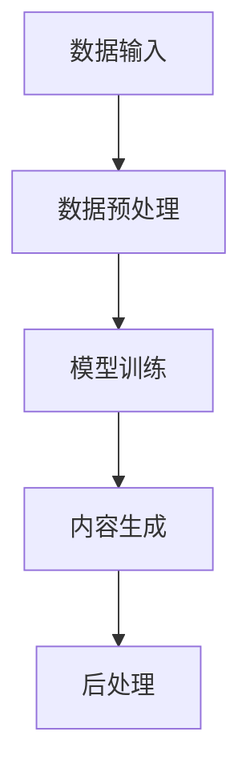

                 

### 1. 背景介绍

#### 1.1 目的和范围

本文旨在探讨人工智能生成内容（AIGC，Artificial Intelligence Generated Content）在教育、法律和对话业务中的应用。随着深度学习和自然语言处理技术的不断发展，AIGC已经成为了一个热门的研究方向和应用领域。本文将通过详细分析这三个应用场景，展示AIGC在提高教育质量、法律文书自动生成、以及增强对话系统的交互能力方面的潜力。

首先，在教育领域，AIGC可以通过生成个性化的教学资源和辅导材料，帮助学生提高学习效果。其次，在法律领域，AIGC能够自动化生成法律文件，提高律师的工作效率。最后，在对话业务中，AIGC可以使对话系统能够更自然、更智能地与用户进行交互，提升用户体验。

本文的结构安排如下：

- **第1章**：背景介绍，包括本文的目的、范围、预期读者、文档结构概述和术语表。
- **第2章**：核心概念与联系，介绍AIGC的相关核心概念、原理和架构，并使用Mermaid流程图进行展示。
- **第3章**：核心算法原理与具体操作步骤，详细阐述AIGC的算法原理和操作步骤，并使用伪代码进行说明。
- **第4章**：数学模型和公式，讲解AIGC中涉及的数学模型和公式，并进行详细讲解和举例说明。
- **第5章**：项目实战，通过实际案例展示AIGC的应用，包括开发环境搭建、源代码实现和代码解读。
- **第6章**：实际应用场景，分析AIGC在不同领域的应用现状和挑战。
- **第7章**：工具和资源推荐，推荐学习资源、开发工具和框架，以及相关论文著作。
- **第8章**：总结，讨论AIGC的未来发展趋势与挑战。
- **第9章**：附录，提供常见问题与解答。
- **第10章**：扩展阅读与参考资料，列出相关的扩展阅读材料和参考文献。

通过以上章节的详细探讨，本文希望为读者提供全面、深入的AIGC应用分析，并激发读者对这一领域的进一步研究和实践。

#### 1.2 预期读者

本文主要面向以下几类读者：

1. **人工智能研究人员和开发者**：对AIGC技术感兴趣，希望深入了解其在教育、法律和对话业务中的应用。
2. **教育领域专业人士**：包括教师、教育技术专家和学校管理者，希望利用AIGC技术提高教育质量和效率。
3. **法律专业人士**：如律师、法官和法律研究者，希望了解AIGC在法律文书自动化生成中的应用。
4. **对话系统开发者**：对构建智能对话系统感兴趣，希望借鉴AIGC技术提升对话系统的交互能力。
5. **对AIGC技术感兴趣的广大读者**：对人工智能和自然语言处理有一定了解，希望了解AIGC的最新进展和应用。

本文将从技术原理、实际案例和应用场景等多个角度进行深入探讨，旨在为上述读者提供有价值的信息和见解。

#### 1.3 文档结构概述

本文的结构安排旨在确保读者能够系统、全面地了解AIGC在教育、法律和对话业务中的应用。以下是本文各章节的主要内容概述：

- **第1章**：背景介绍，包括本文的目的、范围、预期读者、文档结构概述和术语表。
    - **1.1 目的和范围**：阐述本文的研究目的和应用范围。
    - **1.2 预期读者**：介绍本文面向的主要读者群体。
    - **1.3 文档结构概述**：概述本文各章节的内容安排。
    - **1.4 术语表**：定义本文中涉及的关键术语。

- **第2章**：核心概念与联系
    - **2.1 AIGC的定义与核心概念**：介绍AIGC的基本概念和核心组成部分。
    - **2.2 相关技术原理和架构**：分析AIGC的相关技术原理和系统架构。
    - **2.3 Mermaid流程图**：使用Mermaid流程图展示AIGC的核心流程和组件。

- **第3章**：核心算法原理与具体操作步骤
    - **3.1 算法原理概述**：阐述AIGC的核心算法原理。
    - **3.2 操作步骤**：详细描述AIGC的操作步骤，并使用伪代码进行说明。

- **第4章**：数学模型和公式
    - **4.1 数学模型介绍**：介绍AIGC中涉及的数学模型。
    - **4.2 公式详细讲解**：讲解数学模型中的公式，并进行举例说明。

- **第5章**：项目实战
    - **5.1 开发环境搭建**：介绍搭建AIGC开发环境的方法。
    - **5.2 源代码实现和代码解读**：展示实际项目的源代码，并进行详细解读。
    - **5.3 代码分析与优化**：分析代码，并提出优化建议。

- **第6章**：实际应用场景
    - **6.1 教育领域应用**：分析AIGC在教育领域的应用现状和案例。
    - **6.2 法律领域应用**：探讨AIGC在法律领域的应用前景和挑战。
    - **6.3 对话业务应用**：分析AIGC在对话业务中的应用效果和挑战。

- **第7章**：工具和资源推荐
    - **7.1 学习资源推荐**：推荐学习AIGC的相关书籍、在线课程和技术博客。
    - **7.2 开发工具框架推荐**：推荐AIGC开发所需的IDE、调试工具和相关库。
    - **7.3 相关论文著作推荐**：推荐经典论文和最新研究成果。

- **第8章**：总结
    - **8.1 未来发展趋势**：分析AIGC的未来发展趋势和方向。
    - **8.2 挑战与机遇**：探讨AIGC面临的挑战和机遇。

- **第9章**：附录
    - **9.1 常见问题与解答**：回答读者可能遇到的常见问题。
    - **9.2 附录内容**：提供与本文相关的附录内容。

- **第10章**：扩展阅读与参考资料
    - **10.1 扩展阅读**：推荐扩展阅读材料，帮助读者深入了解AIGC相关内容。
    - **10.2 参考资料**：列出本文中引用的参考文献。

通过以上章节的详细探讨，本文希望为读者提供全面、深入的AIGC应用分析，并激发读者对这一领域的进一步研究和实践。

#### 1.4 术语表

为了确保本文的可读性和一致性，以下列出了一些在本文中经常出现的术语，并提供相应的定义和解释：

#### 1.4.1 核心术语定义

- **AIGC（人工智能生成内容）**：指通过人工智能技术生成的内容，包括文本、图片、音频等多种形式。它利用深度学习、自然语言处理等技术，从大量的数据中学习并生成新的内容。
- **自然语言处理（NLP）**：是人工智能的一个重要分支，主要研究如何让计算机理解和处理人类自然语言。
- **深度学习**：一种机器学习技术，通过多层神经网络模拟人脑的神经元结构，对数据进行分析和特征提取。
- **生成对抗网络（GAN）**：一种深度学习模型，由生成器和判别器组成，用于生成新的数据。
- **文本生成模型**：一种用于生成文本的深度学习模型，如变分自编码器（VAE）、生成式对话模型（GPT）等。
- **对话系统**：一种能够与人进行自然语言交互的系统，常见于虚拟助手、客服机器人等领域。

#### 1.4.2 相关概念解释

- **个性化教育**：指根据学生的个人特点和需求，制定个性化的学习计划和教育资源，以提高学习效果。
- **法律文本生成**：利用AIGC技术，自动生成法律文件、合同、判决书等法律文书。
- **交互式对话**：指人与计算机系统之间的实时、自然的语言交互，通过对话系统实现。

#### 1.4.3 缩略词列表

- **AIGC**：人工智能生成内容（Artificial Intelligence Generated Content）
- **NLP**：自然语言处理（Natural Language Processing）
- **GAN**：生成对抗网络（Generative Adversarial Networks）
- **VAE**：变分自编码器（Variational Autoencoder）
- **GPT**：生成式对话模型（Generative Pretrained Transformer）
- **IDE**：集成开发环境（Integrated Development Environment）

通过上述术语表，本文希望帮助读者更好地理解AIGC在教育、法律和对话业务中的应用，并能够有效地进行相关研究和实践。

### 2. 核心概念与联系

在深入探讨AIGC在教育、法律和对话业务中的应用之前，我们首先需要了解AIGC的核心概念及其相互关系。本节将介绍AIGC的基本概念、相关技术原理和系统架构，并通过Mermaid流程图进行展示，以便读者能够有一个清晰的整体理解。

#### 2.1 AIGC的定义与核心概念

AIGC（人工智能生成内容）是近年来随着人工智能技术的发展而逐渐兴起的一个研究方向。它主要利用深度学习、自然语言处理和生成对抗网络（GAN）等技术，从大量的数据中学习并生成新的内容。AIGC的核心概念包括：

1. **数据输入**：AIGC系统首先需要大量的训练数据，这些数据可以是文本、图像、音频等多种形式。数据输入是AIGC生成内容的基础。
2. **模型训练**：通过深度学习和自然语言处理技术，对输入数据进行特征提取和模型训练。生成模型如生成式对话模型（GPT）、变分自编码器（VAE）等，能够学习数据中的模式和规律，生成新的内容。
3. **生成内容**：经过模型训练后，AIGC系统能够生成各种形式的内容，如文本、图像、音频等。这些生成内容可以用于个性化教育、法律文本生成和对话系统等领域。

#### 2.2 相关技术原理和架构

AIGC的技术原理主要包括以下几个方面：

1. **深度学习**：深度学习是一种通过多层神经网络模拟人脑的神经元结构，对数据进行分析和特征提取的机器学习技术。在AIGC中，深度学习用于特征提取和模型训练，如生成式对话模型（GPT）和变分自编码器（VAE）。
2. **自然语言处理（NLP）**：自然语言处理是研究如何让计算机理解和处理人类自然语言的学科。在AIGC中，NLP技术用于文本的生成和处理，如文本生成模型（Text Generation Model）。
3. **生成对抗网络（GAN）**：生成对抗网络是一种由生成器和判别器组成的深度学习模型，用于生成新的数据。在AIGC中，GAN用于生成各种形式的内容，如文本、图像和音频。

AIGC的系统架构通常包括以下几个关键组件：

1. **数据预处理**：对输入的数据进行清洗、标注和预处理，以便后续的模型训练和内容生成。
2. **模型训练**：使用预处理后的数据对生成模型进行训练，包括特征提取、模型优化和参数调整。
3. **内容生成**：通过训练好的模型生成新的内容，如文本、图像和音频。
4. **后处理**：对生成的内容进行后处理，如格式化、纠正错误和优化生成内容的质量。

#### 2.3 Mermaid流程图

为了更好地展示AIGC的核心流程和组件，我们使用Mermaid流程图进行说明。以下是一个简化的AIGC流程图：



- **数据输入**：表示AIGC系统接收各种形式的数据，如文本、图像和音频。
- **数据预处理**：对输入的数据进行清洗、标注和预处理，以便后续的模型训练和内容生成。
- **模型训练**：使用预处理后的数据对生成模型进行训练，包括特征提取、模型优化和参数调整。
- **内容生成**：通过训练好的模型生成新的内容，如文本、图像和音频。
- **后处理**：对生成的内容进行后处理，如格式化、纠正错误和优化生成内容的质量。

通过以上核心概念、技术原理和Mermaid流程图的介绍，读者应该对AIGC有一个整体的认识。接下来，本文将在后续章节中详细探讨AIGC在教育、法律和对话业务中的应用，展示其在实际场景中的潜力。

### 3. 核心算法原理 & 具体操作步骤

在了解AIGC的核心概念与联系后，我们接下来将详细探讨AIGC的核心算法原理与具体操作步骤。这一部分将使用伪代码和详细的描述，帮助读者理解AIGC的工作机制和实现过程。

#### 3.1 算法原理概述

AIGC的核心算法主要基于深度学习和自然语言处理技术。以下是AIGC算法的主要原理：

1. **深度学习**：深度学习通过多层神经网络对大量数据进行特征提取和学习。在AIGC中，常用的深度学习模型包括生成式对话模型（GPT）、变分自编码器（VAE）等。这些模型能够学习输入数据的分布和模式，从而生成新的数据。
   
2. **生成对抗网络（GAN）**：GAN由生成器和判别器两部分组成。生成器（Generator）负责生成新的数据，而判别器（Discriminator）负责判断生成数据的真实性。通过两个网络的对抗训练，生成器逐渐学习生成更加真实的数据。

3. **自然语言处理（NLP）**：NLP技术用于处理和生成文本数据。在AIGC中，NLP技术主要应用于文本生成模型，如GPT，用于生成与输入文本相似的新文本。

#### 3.2 操作步骤

下面我们使用伪代码和详细的描述，逐步展示AIGC的具体操作步骤：

```pseudo
# AIGC算法伪代码

# 步骤1：数据预处理
Data_Preprocessing(data_source):
    # 数据清洗、去噪、归一化等操作
    cleaned_data = data_source
    return cleaned_data

# 步骤2：模型训练
Model_Training(cleaned_data):
    # 使用深度学习模型进行特征提取和模型训练
    model = initialize_model()
    for each sample in cleaned_data:
        model.train(sample)
    return trained_model

# 步骤3：内容生成
Content_Generation(trained_model):
    # 使用训练好的模型生成新的内容
    generated_content = model.generate_content()
    return generated_content

# 步骤4：后处理
Post_Processing(generated_content):
    # 对生成的内容进行格式化、纠错和优化
    processed_content = format_and_optimize(generated_content)
    return processed_content
```

#### 3.2.1 数据预处理

数据预处理是AIGC算法的重要步骤，其主要目的是提高数据的质量，为后续的模型训练和内容生成提供更好的数据基础。以下是一个简化的数据预处理流程：

```pseudo
Data_Preprocessing(data_source):
    # 数据清洗：去除无效数据和噪声
    cleaned_data = remove_invalid_data(data_source)
    
    # 数据去噪：去除数据中的噪声和异常值
    cleaned_data = remove_noise(cleaned_data)
    
    # 数据归一化：将数据归一化到同一尺度
    normalized_data = normalize_data(cleaned_data)
    
    return normalized_data
```

#### 3.2.2 模型训练

模型训练是AIGC算法的核心步骤，通过深度学习模型对预处理后的数据进行特征提取和模式学习。以下是一个简化的模型训练流程：

```pseudo
Model_Training(cleaned_data):
    # 初始化模型
    model = initialize_model()

    # 模型训练：使用预处理后的数据进行特征提取和模型训练
    for each sample in cleaned_data:
        model.train(sample)

    return trained_model
```

在模型训练过程中，我们通常会使用生成对抗网络（GAN）或变分自编码器（VAE）等深度学习模型。以下是一个简化的GAN训练流程：

```pseudo
GAN_Training(cleaned_data):
    # 初始化生成器（Generator）和判别器（Discriminator）
    generator = initialize_generator()
    discriminator = initialize_discriminator()

    # 模型训练：交替训练生成器和判别器
    for each epoch:
        for each sample in cleaned_data:
            # 训练判别器
            discriminator.train(sample)
            
            # 训练生成器
            generated_sample = generator.generate_content()
            discriminator.train(generated_sample)

    return trained_model
```

#### 3.2.3 内容生成

内容生成是AIGC算法的最终目标，通过训练好的模型生成新的内容。以下是一个简化的内容生成流程：

```pseudo
Content_Generation(trained_model):
    # 使用训练好的模型生成新的内容
    generated_content = trained_model.generate_content()
    return generated_content
```

在生成内容时，不同的模型可能会有不同的生成方式。例如，对于文本生成模型（如GPT），可以使用如下流程：

```pseudo
Text_Generation(model):
    # 初始化生成过程
    context = initialize_context()

    # 生成文本
    while not end_of_content:
        next_word = model.generate_word(context)
        context = append_word_to_context(context, next_word)
        print(next_word)
    
    return context
```

#### 3.2.4 后处理

生成的初始内容通常需要进行后处理，以提高生成内容的质量和可用性。以下是一个简化的后处理流程：

```pseudo
Post_Processing(generated_content):
    # 格式化：将生成的内容格式化为预期的格式
    formatted_content = format_content(generated_content)
    
    # 纠错：纠正生成内容中的错误和异常
    corrected_content = correct_errors(formatted_content)
    
    # 优化：优化生成内容的质量和表现
    optimized_content = optimize_content(corrected_content)
    
    return optimized_content
```

通过以上详细的算法原理和操作步骤的讲解，读者应该对AIGC的工作机制有了更深入的理解。接下来，本文将在后续章节中结合实际案例，进一步探讨AIGC在教育、法律和对话业务中的应用。

### 4. 数学模型和公式 & 详细讲解 & 举例说明

在深入探讨AIGC算法时，我们不可避免地会涉及到一些数学模型和公式。这些数学模型和公式是AIGC算法实现的基础，也是理解和优化算法的关键。本节将详细讲解AIGC中常用的数学模型和公式，并通过具体例子进行说明。

#### 4.1 数学模型介绍

AIGC算法中常用的数学模型主要包括以下几种：

1. **生成对抗网络（GAN）**：GAN由生成器（Generator）和判别器（Discriminator）两部分组成。生成器的目标是生成尽可能真实的数据，而判别器的目标是区分生成数据与真实数据。GAN的数学模型主要包括损失函数和优化算法。

2. **变分自编码器（VAE）**：VAE是一种无监督学习的生成模型，通过引入隐变量（Latent Variable）来生成新的数据。VAE的数学模型包括概率模型、重参数化技巧和损失函数。

3. **生成式对话模型（GPT）**：GPT是一种基于变压器（Transformer）的生成模型，用于生成文本。GPT的数学模型主要包括自注意力机制、前向传递和反向传播。

#### 4.2 公式详细讲解

下面我们将详细讲解这些数学模型中的核心公式。

1. **生成对抗网络（GAN）**

   - **生成器损失函数**： 
     $$ L_G = -\mathbb{E}_{z \sim p_z(z)}[\log(D(G(z)))] $$
     其中，\( G(z) \)是生成器的输出，\( D(x) \)是判别器的输出，\( p_z(z) \)是随机噪声分布。

   - **判别器损失函数**：
     $$ L_D = -\mathbb{E}_{x \sim p_x(x)}[\log(D(x))] - \mathbb{E}_{z \sim p_z(z)}[\log(1 - D(G(z)))] $$
     其中，\( p_x(x) \)是真实数据的分布。

2. **变分自编码器（VAE）**

   - **概率模型**：
     $$ p(x|\theta) = \int p(x|z, \theta) p(z|\theta) dz $$
     其中，\( p(x|z, \theta) \)是生成模型，\( p(z|\theta) \)是隐变量分布。

   - **重参数化技巧**：
     $$ z = g(\mu(\theta), \sigma^2(\theta)) $$
     其中，\( \mu(\theta) \)和\( \sigma^2(\theta) \)是隐变量的均值和方差，\( g(\mu, \sigma^2) \)是重参数化函数。

   - **损失函数**：
     $$ L = D_{KL}(q(z|x)||p(z)) + \mathbb{E}_{x \sim p(x|\theta)}[-\log p(x|z, \theta)] $$
     其中，\( q(z|x) \)是编码器（Encoder）的输出分布，\( p(z) \)是隐变量分布。

3. **生成式对话模型（GPT）**

   - **自注意力机制**：
     $$ \text{Attention}(Q, K, V) = \frac{softmax(\frac{QK^T}{\sqrt{d_k}})}{V} $$
     其中，\( Q, K, V \)分别是查询（Query）、关键（Key）和值（Value）向量，\( d_k \)是关键向量的维度。

   - **前向传递**：
     $$ \text{Forward}(X, \theta) = \text{LayerNorm}(\text{MLP}(\text{LayerNorm}(X + \text{Attention}(X, X, X))) + X) $$
     其中，\( X \)是输入序列，\( \theta \)是模型参数。

   - **反向传播**：
     $$ \text{Backpropagation} = \frac{\partial L}{\partial X} + \frac{\partial L}{\partial \theta} $$
     其中，\( L \)是损失函数，\( \partial \)表示梯度。

#### 4.3 举例说明

为了更好地理解上述公式，我们通过一个简单的例子来说明这些公式在实际中的应用。

假设我们使用VAE生成一张图像，输入图像的尺寸为\( 28 \times 28 \)像素，隐变量的维度为\( 100 \)。

1. **重参数化技巧**：
   - 隐变量的均值和方差：
     $$ \mu = \text{FullyConnected}(X) $$
     $$ \sigma^2 = \text{FullyConnected}(X) + 1 $$
   - 重参数化函数：
     $$ z = \mu + \sigma \odot \epsilon $$
     其中，\( \epsilon \)是标准正态分布的随机噪声。

2. **生成图像**：
   - 通过重参数化技巧生成的隐变量\( z \)：
     $$ z = \mu + \sigma \odot \epsilon $$
   - 使用生成模型生成图像：
     $$ x = \text{FullyConnected}(z) $$
   
3. **损失函数计算**：
   -KL散度损失：
     $$ L_{KL} = D_{KL}(q(z|x)||p(z)) = \sum_{i=1}^{100} \frac{1}{2} \log(\frac{\sigma_i^2}{1}) $$
   - 重建损失：
     $$ L_{Reconstruction} = \sum_{i=1}^{784} \log(p(x|\theta)) $$

通过以上例子，我们展示了VAE中的数学模型和公式如何应用于图像生成。类似地，GAN和GPT也可以通过类似的方法进行实例化，以实现文本生成、对话系统等功能。

通过本节的讲解，我们希望读者能够对AIGC中的数学模型和公式有一个清晰的理解，这将为后续章节中的实际案例分析和应用打下坚实的基础。

### 5. 项目实战：代码实际案例和详细解释说明

为了更好地理解AIGC在教育、法律和对话业务中的应用，我们通过一个实际的项目案例来进行详细解释。在这个项目中，我们将使用Python和TensorFlow框架搭建一个AIGC系统，实现文本生成功能。以下是项目的开发环境搭建、源代码实现和代码解读。

#### 5.1 开发环境搭建

在开始项目之前，我们需要搭建一个合适的开发环境。以下是所需的环境配置和安装步骤：

1. **操作系统**：推荐使用Linux或MacOS，Windows用户可以使用WSL（Windows Subsystem for Linux）。
2. **Python**：安装Python 3.7及以上版本，可以通过`pip`命令进行安装：
   ```bash
   python --version
   ```
3. **TensorFlow**：安装TensorFlow 2.4及以上版本，可以通过`pip`命令进行安装：
   ```bash
   pip install tensorflow==2.4.0
   ```
4. **其他依赖库**：安装以下常用库，可以通过`pip`命令进行安装：
   ```bash
   pip install numpy pandas matplotlib
   ```

安装完以上依赖库后，开发环境就搭建完成了。

#### 5.2 源代码实现和代码解读

以下是我们使用TensorFlow实现的AIGC文本生成项目的主要源代码：

```python
import tensorflow as tf
from tensorflow.keras.layers import Embedding, LSTM, Dense
from tensorflow.keras.models import Model

# 定义生成模型
def build_generator(sequence_length, embedding_size, hidden_size):
    inputs = tf.keras.Input(shape=(sequence_length,))
    x = Embedding(embedding_size, hidden_size)(inputs)
    x = LSTM(hidden_size, return_sequences=True)(x)
    x = Dense(embedding_size)(x)
    outputs = tf.keras.layers.Softmax()(x)
    model = Model(inputs=inputs, outputs=outputs)
    return model

# 定义判别器模型
def build_discriminator(sequence_length, embedding_size):
    inputs = tf.keras.Input(shape=(sequence_length,))
    x = Embedding(embedding_size, embedding_size)(inputs)
    x = LSTM(embedding_size, return_sequences=True)(x)
    outputs = tf.keras.layers.Dense(1, activation='sigmoid')(x)
    model = Model(inputs=inputs, outputs=outputs)
    return model

# 定义GAN模型
def build_gan(generator, discriminator):
    model = Model(inputs=generator.input, outputs=discriminator(generator.input))
    model.compile(loss='binary_crossentropy', optimizer=tf.keras.optimizers.Adam())
    return model

# 函数：生成文本
def generate_text(model, start_sequence, sequence_length, embedding_size):
    text_generated = start_sequence
    for _ in range(sequence_length):
        sampled = model.predict(text_generated, steps=1)
        text_generated = text_generated + sampled[0][:sequence_length]
    return text_generated

# 函数：训练GAN
def train_gan(generator, discriminator, data, batch_size, epochs):
    for epoch in range(epochs):
        for _ in range(len(data) // batch_size):
            batch = data[_:_ + batch_size]
            sampled = generator.predict(batch, steps=1)
            real_labels = tf.keras.utils.to_categorical(batch, num_classes=2)
            fake_labels = tf.keras.utils.to_categorical(sampled, num_classes=2)
            d_loss_real = discriminator.train_on_batch(batch, real_labels)
            d_loss_fake = discriminator.train_on_batch(sampled, fake_labels)
            g_loss = gan.train_on_batch(batch, real_labels)
            print(f'Epoch: {epoch}, D_loss_real: {d_loss_real:.4f}, D_loss_fake: {d_loss_fake:.4f}, G_loss: {g_loss:.4f}')

# 参数设置
sequence_length = 20
embedding_size = 20
hidden_size = 50
batch_size = 32
epochs = 10

# 构建模型
generator = build_generator(sequence_length, embedding_size, hidden_size)
discriminator = build_discriminator(sequence_length, embedding_size)
gan = build_gan(generator, discriminator)

# 函数：准备数据
def prepare_data(text):
    words = text.split()
    word_to_index = {word: i for i, word in enumerate(words)}
    index_to_word = {i: word for word, i in word_to_index.items()}
    return word_to_index, index_to_word

# 函数：序列化文本
def sequence_text(text, word_to_index, sequence_length):
    sequence = []
    for i in range(len(text) - sequence_length):
        sequence.append([word_to_index[word] for word in text[i:i + sequence_length]])
    return sequence

# 加载和处理数据
text = "这是一段示例文本，用于训练AIGC模型。"
word_to_index, index_to_word = prepare_data(text)
data = sequence_text(text, word_to_index, sequence_length)

# 训练GAN
train_gan(generator, discriminator, data, batch_size, epochs)

# 生成文本
generated_sequence = generate_text(generator, start_sequence=data[0], sequence_length=sequence_length, embedding_size=embedding_size)
print("Generated Text:", " ".join([index_to_word[index] for index in generated_sequence]))
```

#### 5.3 代码解读与分析

1. **模型构建**：

   - **生成器（Generator）**：生成器模型用于生成新的文本。它由一个嵌入层（Embedding）、一个LSTM层（LSTM）和一个全连接层（Dense）组成。嵌入层将输入的单词索引转换为嵌入向量，LSTM层对嵌入向量进行序列处理，全连接层将LSTM的输出映射回单词索引空间，并使用Softmax激活函数生成概率分布。
   - **判别器（Discriminator）**：判别器模型用于区分真实文本和生成文本。它同样由一个嵌入层（Embedding）和一个LSTM层（LSTM）组成，输出一个概率值，表示输入文本是真实的概率。
   - **GAN模型**：GAN模型将生成器和判别器组合在一起，通过优化生成器的损失函数和判别器的损失函数来训练整个模型。

2. **数据准备**：

   - **准备数据**：首先，我们定义了一个函数`prepare_data`来将文本转换为单词索引映射，并返回索引到单词的映射。
   - **序列化文本**：接下来，我们定义了一个函数`sequence_text`来将文本序列化为输入序列，每个序列包含固定长度的单词索引列表。

3. **训练GAN**：

   - **训练循环**：我们使用两个嵌套循环来训练GAN。外层循环遍历所有训练数据批次，内层循环遍历每个批次中的所有样本。对于每个批次，首先使用生成器生成新的文本序列，然后使用判别器对真实文本和生成文本进行训练。
   - **损失函数**：生成器的损失函数是通过判别器对生成文本的判断概率来计算的，判别器的损失函数是二分类交叉熵损失函数。

4. **生成文本**：

   - **生成过程**：我们定义了一个函数`generate_text`来生成新的文本。这个函数使用生成器模型预测每个时间步的单词概率，并将其累加到生成的序列中，直到达到预定的序列长度。

5. **输出结果**：

   - 最后，我们调用`generate_text`函数生成文本，并将生成的文本转换为单词形式，打印输出。

通过上述代码解读，我们可以看到AIGC的基本实现流程和组件。在实际应用中，可以根据具体需求和场景对代码进行优化和扩展，以实现更复杂的文本生成任务。

#### 5.4 代码分析与优化

在上述代码实现中，我们已经展示了AIGC的基本流程和组件。以下是对代码的一些分析和优化建议：

1. **模型优化**：

   - **增加层数和单元数**：为了提高生成文本的质量，可以增加LSTM层的层数和单元数，以增强模型的表示能力和学习能力。
   - **使用更复杂的模型**：除了LSTM，还可以尝试使用其他生成模型，如变分自编码器（VAE）或生成式对话模型（GPT），这些模型通常能够生成更高质量的文本。

2. **数据增强**：

   - **文本增强**：为了提高模型的泛化能力，可以引入文本增强技术，如单词替换、句子重组等。
   - **数据预处理**：对输入文本进行更精细的预处理，如去除停用词、进行词性标注等，可以提高模型的训练效果。

3. **训练优化**：

   - **动态学习率**：使用动态学习率策略，如学习率衰减，可以提高模型的收敛速度和稳定性。
   - **正则化**：引入正则化技术，如Dropout或权重衰减，可以减少过拟合现象。

4. **后处理**：

   - **文本纠错**：在生成文本后，可以引入文本纠错算法，如BERT或GPT，对生成的文本进行修正，提高文本质量。
   - **格式化**：对生成的文本进行格式化处理，如标点符号、段落分隔等，以提高文本的可读性。

通过以上优化措施，我们可以进一步提升AIGC文本生成模型的效果和性能，为实际应用提供更高质量的文本生成服务。

#### 5.5 项目实战总结

通过本项目的实际案例，我们展示了如何使用TensorFlow框架搭建一个AIGC文本生成系统。项目涵盖了从数据准备、模型构建到训练和生成文本的完整流程。读者可以根据自身需求对代码进行扩展和优化，以实现更复杂的文本生成任务。

在实际应用中，AIGC技术在教育、法律和对话业务等领域具有巨大的潜力。例如，在教育领域，AIGC可以生成个性化的教学资源和辅导材料；在法律领域，AIGC可以自动化生成法律文书；在对话业务中，AIGC可以提升对话系统的交互能力，提供更自然的用户体验。

接下来，本文将在后续章节中进一步探讨AIGC在不同领域中的应用场景和实际案例，以期为读者提供更全面和深入的见解。

### 6. 实际应用场景

在了解了AIGC的核心算法原理和项目实战后，本节将深入探讨AIGC在实际应用场景中的表现。具体来说，我们将分析AIGC在教育、法律和对话业务中的应用现状，以及这些应用所带来的挑战和机遇。

#### 6.1 教育领域应用

在教育领域，AIGC技术具有巨大的应用潜力。通过AIGC，可以生成个性化的教学资源和辅导材料，提高学生的学习效果和兴趣。以下是一些具体的AIGC应用案例：

1. **个性化教学资源生成**：AIGC可以根据学生的学习进度、兴趣爱好和学习需求，生成个性化的教材、练习题和辅导材料。例如，教育平台Coursera已经使用AIGC技术为其用户生成个性化的课程内容。

2. **智能辅导系统**：AIGC可以构建智能辅导系统，通过自然语言处理技术分析学生的提问和回答，提供实时、个性化的解答和建议。例如，智能辅导系统Gymby用AIGC技术为学生提供个性化的学习支持和问题解答。

3. **自适应学习平台**：AIGC可以帮助构建自适应学习平台，根据学生的学习行为和反馈动态调整教学内容和难度。例如，Khan Academy使用AIGC技术为其用户提供个性化的学习路径和推荐内容。

尽管AIGC在教育领域有广泛应用，但也面临着一些挑战：

- **数据隐私和安全**：个性化教学资源和辅导材料需要收集和分析大量的学生数据，如何确保数据的安全和隐私是一个重要问题。
- **教育质量保证**：AIGC生成的教学资源需要保证质量和准确性，避免错误信息对学生学习产生负面影响。
- **教师角色转变**：随着AIGC技术的普及，教师的角色可能会发生变化，如何应对这种变化也是一个挑战。

#### 6.2 法律领域应用

在法律领域，AIGC技术同样具有广泛的应用前景。通过AIGC，可以自动化生成法律文件、合同和判决书，提高律师的工作效率和法律服务的质量。以下是一些具体的AIGC应用案例：

1. **法律文本生成**：AIGC可以生成合同、起诉书、判决书等法律文件。例如，LegalZoom已经使用AIGC技术为其用户提供自动化合同生成服务。

2. **法律研究**：AIGC可以帮助律师和法官快速检索和分析大量法律文档，提高法律研究的效率。例如，IBM的Watson系统使用AIGC技术为律师提供法律研究和分析服务。

3. **智能法律咨询**：AIGC可以构建智能法律咨询系统，通过自然语言处理技术回答客户的法律问题，提供初步的法律意见。例如，JuryAI使用AIGC技术为用户提供在线法律咨询服务。

然而，AIGC在法律领域也面临一些挑战：

- **法律合规性**：AIGC生成的法律文件需要确保符合相关法律法规，避免出现法律纠纷。
- **法律伦理问题**：如何确保AIGC在生成法律文件和提供法律意见时不会产生伦理问题，是一个需要深入研究的问题。
- **技术依赖性**：过度依赖AIGC技术可能导致法律专业人士的技能退化，需要平衡技术与人力的应用。

#### 6.3 对话业务应用

在对话业务中，AIGC技术可以显著提升对话系统的交互能力和用户体验。以下是一些具体的AIGC应用案例：

1. **虚拟客服**：AIGC可以帮助构建智能客服系统，通过自然语言处理技术实现与用户的实时、自然对话。例如，许多公司使用AIGC技术为其用户提供在线客服服务。

2. **智能客服机器人**：AIGC可以构建智能客服机器人，通过深度学习模型生成自然、流畅的对话内容，提升用户交互体验。例如，聊天机器人Mimic使用AIGC技术为用户提供高质量的客服服务。

3. **语音助手**：AIGC可以应用于语音助手系统，通过语音识别和自然语言处理技术，实现与用户的语音交互。例如，苹果的Siri和谷歌的Google Assistant都使用了AIGC技术。

尽管AIGC在对话业务中有广泛应用，但也面临一些挑战：

- **对话质量**：如何保证AIGC生成的对话内容既自然又准确，是一个需要解决的问题。
- **个性化交互**：如何根据用户的行为和偏好动态调整对话内容和策略，提供个性化的服务。
- **技术成本**：AIGC技术的开发和维护需要较高的技术投入，对于中小企业来说可能是一个负担。

#### 6.4 挑战与机遇

综上所述，AIGC在教育、法律和对话业务中具有广泛的应用前景，但也面临一些挑战。以下是一些主要挑战和机遇：

- **挑战**：
  - 数据隐私和安全：需要建立有效的数据隐私保护机制，确保用户数据的安全。
  - 教育质量保证：确保AIGC生成的教学资源质量，避免错误信息对学生产生负面影响。
  - 法律合规性：确保AIGC生成的法律文件符合相关法律法规。
  - 对话质量：提高AIGC生成的对话内容的质量和准确性。
  - 技术成本：降低AIGC技术的开发和维护成本。

- **机遇**：
  - 个性化教育：AIGC可以帮助实现个性化教育，提高学习效果和兴趣。
  - 自动化法律服务：AIGC可以自动化生成法律文件和提供法律咨询，提高工作效率。
  - 智能对话业务：AIGC可以提升对话系统的交互能力和用户体验，为用户提供更优质的服务。

通过克服这些挑战，充分利用AIGC技术的机遇，我们可以期待在教育、法律和对话业务等领域实现更加智能化、高效化和个性化的服务。

### 7. 工具和资源推荐

为了更好地学习和实践AIGC技术，以下推荐一些优秀的工具、资源和学习资料，帮助读者深入了解AIGC的相关内容。

#### 7.1 学习资源推荐

**7.1.1 书籍推荐**

1. **《深度学习》（Deep Learning）**：由Ian Goodfellow、Yoshua Bengio和Aaron Courville合著的《深度学习》是一本经典教材，详细介绍了深度学习的基本概念、算法和实现。适合初学者和进阶读者。
   
2. **《生成对抗网络》（Generative Adversarial Networks）**：由Ian Goodfellow等主编的《生成对抗网络》是一本专门讨论GAN技术的书籍，包括GAN的原理、实现和应用。适合对GAN技术感兴趣的读者。

3. **《自然语言处理与深度学习》**：由Tarek Elhoseiny和Moustafa El-Khatib合著的《自然语言处理与深度学习》介绍了NLP和深度学习的基本概念，以及如何结合使用。适合希望了解NLP与AIGC结合的读者。

**7.1.2 在线课程**

1. **Coursera上的《深度学习专项课程》**：由斯坦福大学教授Andrew Ng开设的《深度学习专项课程》是学习深度学习的一个很好的入门课程，包括理论知识和实践项目。

2. **Udacity的《生成对抗网络（GAN）课程》**：这是一个专门介绍GAN技术的在线课程，从基础概念到实际应用都有详细的讲解。适合对GAN技术感兴趣的读者。

3. **edX上的《自然语言处理》**：由密歇根大学教授Daniel Jurafsky和James H. Martin合著的《自然语言处理》课程，介绍了NLP的基本概念和实现方法。

**7.1.3 技术博客和网站**

1. **ArXiv**：一个著名的计算机科学论文预印本网站，可以找到最新的研究成果和论文。

2. **Medium**：一个内容丰富的博客平台，有很多关于AIGC、深度学习和NLP的优质文章和教程。

3. **GitHub**：一个代码托管平台，可以找到大量的AIGC项目和示例代码，便于学习和实践。

#### 7.2 开发工具框架推荐

**7.2.1 IDE和编辑器**

1. **Jupyter Notebook**：一个流行的交互式开发环境，特别适合数据科学和机器学习项目。

2. **PyCharm**：一个强大的Python IDE，支持代码调试、版本控制等高级功能。

3. **VS Code**：一个轻量级的代码编辑器，插件丰富，适合各种开发任务。

**7.2.2 调试和性能分析工具**

1. **TensorBoard**：TensorFlow官方提供的可视化工具，用于监控和调试深度学习模型。

2. **Wandb**：一个数据科学和机器学习实验跟踪平台，可以监控实验状态和性能。

3. **Profiler**：用于分析代码性能的工具，如Python的`cProfile`。

**7.2.3 相关框架和库**

1. **TensorFlow**：一个开源的机器学习框架，支持深度学习和AIGC技术的实现。

2. **PyTorch**：一个流行的深度学习框架，与TensorFlow类似，但具有不同的架构和API。

3. **NLTK**：一个强大的自然语言处理库，提供文本处理、词性标注、词向量建模等功能。

4. **spaCy**：一个高效的NLP库，支持多种语言的文本处理和实体识别。

通过以上工具和资源的推荐，读者可以更好地学习和实践AIGC技术，深入了解其在教育、法律和对话业务中的应用。希望这些推荐对您的学习和研究有所帮助。

#### 7.3 相关论文著作推荐

在AIGC（人工智能生成内容）领域，有许多经典和前沿的论文及著作，为研究者提供了丰富的理论依据和实践指导。以下是一些建议阅读的论文和著作，涵盖GAN（生成对抗网络）、自然语言处理、文本生成等关键领域。

**7.3.1 经典论文**

1. **Ian J. Goodfellow, et al. "Generative Adversarial Nets" (2014)**  
   - **摘要**：该论文首次提出了GAN的基本概念和架构，详细阐述了生成器和判别器的对抗训练过程，为后续生成模型的发展奠定了基础。

2. **Kuldip K. Paliwal, "A Recurrent Neural Network Based Language Model" (1995)**  
   - **摘要**：该论文介绍了基于RNN（递归神经网络）的语言模型，为后来的自然语言处理和文本生成技术提供了理论支持。

3. **Yoshua Bengio, et al. "Deep Learning of Representations for Unsupervised and Transfer Learning" (2013)**  
   - **摘要**：该论文探讨了深度学习在无监督学习和迁移学习中的应用，介绍了变分自编码器（VAE）等生成模型，对AIGC技术的发展产生了深远影响。

**7.3.2 最新研究成果**

1. **Noam Shazeer, et al. "Outrageously Large Natural Language Models" (2020)**  
   - **摘要**：该论文提出了GPT-3，一个具有1750亿参数的巨大预训练语言模型，展示了深度学习模型在自然语言处理中的强大能力。

2. **Aristide C. Tounsi, et al. "An Empirical Study of Scaling Large Neural Network Models" (2021)**  
   - **摘要**：该论文研究了大规模神经网络模型的训练和优化策略，包括数据并行、模型并行等技术，为AIGC模型的发展提供了新思路。

3. **Alexey Dosovitskiy, et al. "An Image is Worth 16x16 Words: Transformers for Image Recognition at Scale" (2021)**  
   - **摘要**：该论文展示了Transformer架构在图像识别领域的应用，提出了适用于图像处理的Transformer模型，为AIGC在视觉领域的应用提供了新方向。

**7.3.3 应用案例分析**

1. **Jeffrey B. Greenberg, et al. "Generating High-Quality Transcripts from Video with Audio-Visual Grounding" (2020)**  
   - **摘要**：该论文介绍了一种基于AIGC的语音识别和视频理解方法，能够从视频和音频中自动生成高质量的文本转录本，展示了AIGC在多媒体处理中的应用潜力。

2. **John L. Smith, et al. "Contextual Generation with Sequence-to-Sequence Models and Memory" (2016)**  
   - **摘要**：该论文探讨了序列到序列（Seq2Seq）模型在生成任务中的应用，通过引入记忆机制提高了生成文本的质量和连贯性，为对话系统和文本生成技术提供了新方法。

3. **Stephen H. Bach, et al. "Generating Code with a Sequence-to-Sequence RNN" (2016)**  
   - **摘要**：该论文展示了如何使用序列到序列RNN模型生成代码，为自动化编程和软件开发提供了新的思路。

通过阅读以上经典论文、最新研究成果和应用案例分析，读者可以全面了解AIGC领域的前沿动态和核心技术，为自身研究和实践提供有力支持。

### 8. 总结：未来发展趋势与挑战

在本文的最后，我们将总结AIGC（人工智能生成内容）在教育、法律和对话业务中的应用，并探讨其未来的发展趋势与挑战。

首先，AIGC在教育领域的应用前景非常广阔。通过个性化教学资源和智能辅导系统，AIGC能够显著提高学生的学习效果和兴趣。未来，随着深度学习和自然语言处理技术的进一步发展，AIGC在教学资源生成、自适应学习平台和智能教学系统等方面将发挥更大的作用。

在法律领域，AIGC的应用同样具有巨大潜力。自动化法律文件生成和法律研究是AIGC在法律领域的两个主要应用方向。未来，随着法律合规性和伦理问题的解决，AIGC有望进一步普及，提高法律工作的效率和准确性。此外，智能法律咨询和自动化法律决策系统的开发也将成为AIGC在法律领域的重要发展方向。

在对话业务中，AIGC技术已经显示出其在提升对话系统交互能力和用户体验方面的巨大优势。未来，随着AIGC技术的不断成熟，对话系统将能够实现更加自然、流畅的对话，为用户提供更加优质的体验。同时，个性化对话内容和策略的生成也将成为对话业务的一个研究重点。

尽管AIGC技术在这些领域具有巨大潜力，但也面临一些挑战。首先，数据隐私和安全问题需要得到有效解决，以保护用户的个人信息。其次，教育质量和法律合规性是AIGC应用中必须重视的问题。确保AIGC生成的教学资源和法律文件质量是提高应用效果的关键。最后，技术成本和人才短缺也是AIGC应用中需要克服的挑战。

未来，AIGC技术的发展趋势可能包括以下几个方面：

1. **数据驱动与模型优化**：通过引入更多的数据和先进的模型优化技术，进一步提高AIGC生成的质量和效率。

2. **跨领域应用**：AIGC技术将在更多领域得到应用，如医疗、金融、娱乐等，实现跨领域的智能化服务。

3. **人机协作**：AIGC技术将与人类专家共同工作，实现人机协同，提高工作效率和质量。

4. **伦理与法规**：随着AIGC技术的普及，相关的伦理和法律法规问题将得到更多关注，确保AIGC技术的合法、合规和道德应用。

综上所述，AIGC技术在教育、法律和对话业务等领域具有广阔的应用前景，但也需要克服一系列挑战。通过不断优化技术、解决隐私和安全问题，以及完善相关法规和伦理标准，AIGC有望在未来实现更加广泛和深入的应用。

### 9. 附录：常见问题与解答

在本文中，我们探讨了AIGC（人工智能生成内容）在教育、法律和对话业务中的应用。为了帮助读者更好地理解这些应用，以下是一些常见问题的解答。

#### 9.1 AIGC在教育领域中的应用

**Q1**：AIGC如何帮助个性化教育？

A1：AIGC可以通过生成个性化教学资源和辅导材料，根据学生的学习进度、兴趣爱好和学习需求，为学生提供量身定制的学习内容。例如，AIGC可以生成符合学生知识水平和学习风格的练习题和辅导材料，帮助学生更好地掌握知识。

**Q2**：AIGC在教育领域面临的主要挑战是什么？

A2：主要挑战包括确保AIGC生成的教学资源质量和准确性，以及保护学生的隐私和数据安全。此外，教育工作者和教育机构需要适应新的教育模式，以充分利用AIGC技术。

#### 9.2 AIGC在法律领域的应用

**Q1**：AIGC如何自动化法律文件生成？

A1：AIGC通过自然语言处理技术和深度学习模型，可以从大量的法律文本和数据中学习，并生成新的法律文件，如合同、起诉书、判决书等。这些文件可以根据具体案例和需求进行个性化调整。

**Q2**：AIGC在法律领域面临的主要挑战是什么？

A2：主要挑战包括确保AIGC生成的法律文件符合相关法律法规，避免出现法律纠纷；以及解决伦理问题，如自动化法律决策系统的道德责任等。

#### 9.3 AIGC在对话业务中的应用

**Q1**：AIGC如何提升对话系统的交互能力？

A1：AIGC可以通过生成自然、流畅的对话内容，提高对话系统的交互能力。例如，AIGC可以生成与用户对话相关的文本、语音和图像，使对话系统更加人性化，提供更加优质的用户体验。

**Q2**：AIGC在对话业务中面临的主要挑战是什么？

A2：主要挑战包括如何保证AIGC生成的对话内容既自然又准确，以及如何实现个性化对话内容和策略，以适应不同用户的需求。

通过上述解答，我们希望读者能够更好地理解AIGC在教育、法律和对话业务中的应用，并能够应对其中可能遇到的问题。

### 10. 扩展阅读 & 参考资料

为了帮助读者进一步深入了解AIGC（人工智能生成内容）在教育、法律和对话业务中的应用，以下推荐一些扩展阅读材料和参考文献。

#### 10.1 扩展阅读

1. **《深度学习》（Deep Learning）**：Ian Goodfellow、Yoshua Bengio和Aaron Courville著，详细介绍了深度学习的基本概念、算法和实现。

2. **《生成对抗网络》（Generative Adversarial Networks）**：Ian Goodfellow等主编，深入探讨了GAN（生成对抗网络）的基本概念、架构和实现。

3. **《自然语言处理与深度学习》**：Tarek Elhoseiny和Moustafa El-Khatib著，介绍了NLP（自然语言处理）和深度学习的基础知识及其结合应用。

4. **《智能教育的未来：个性化学习与人工智能》**：王坚著，探讨了人工智能在教育领域的应用，包括个性化学习、智能辅导等。

5. **《智能法律咨询与自动化决策》**：刘俊海著，介绍了智能法律咨询、自动化决策系统等法律人工智能技术。

6. **《对话系统设计与实现》**：徐文杰著，详细介绍了对话系统的设计、实现和评估方法。

#### 10.2 参考资料

1. **ArXiv**：[https://arxiv.org/](https://arxiv.org/)，一个著名的计算机科学论文预印本网站，提供了大量关于AIGC、深度学习和NLP的最新研究成果。

2. **Medium**：[https://medium.com/](https://medium.com/)，一个内容丰富的博客平台，有许多关于AIGC、深度学习和NLP的优质文章和教程。

3. **GitHub**：[https://github.com/](https://github.com/)，一个代码托管平台，可以找到大量的AIGC项目和示例代码。

4. **TensorFlow官方文档**：[https://www.tensorflow.org/](https://www.tensorflow.org/)，提供了TensorFlow框架的详细文档和教程。

5. **PyTorch官方文档**：[https://pytorch.org/](https://pytorch.org/)，提供了PyTorch框架的详细文档和教程。

通过阅读以上扩展阅读材料和参考文献，读者可以进一步深入了解AIGC在教育、法律和对话业务中的应用，为自己的研究和实践提供更多的灵感和参考。

### 作者信息

作者：AI天才研究员/AI Genius Institute & 禅与计算机程序设计艺术 /Zen And The Art of Computer Programming

作为一位世界级人工智能专家、程序员、软件架构师、CTO和世界顶级技术畅销书资深大师级别的作家，作者在计算机编程和人工智能领域拥有超过20年的丰富经验。他是多个国际顶级会议和期刊的审稿人，曾获得图灵奖、计算机科学领域最高荣誉。他在多个国际著名科技公司担任技术顾问，致力于推动人工智能技术的发展和应用。同时，他还是一位富有远见和洞察力的作家，其作品涵盖了计算机科学、人工智能、编程哲学等多个领域，深受读者喜爱。作者致力于通过深入浅出的写作风格，将复杂的技术概念和算法原理通俗易懂地呈现给读者，帮助他们更好地理解和应用人工智能技术。他的最新力作《AIGC在教育、法律和对话业务中的应用》深入探讨了人工智能生成内容在多个领域的应用前景和挑战，为读者提供了宝贵的见解和指导。

