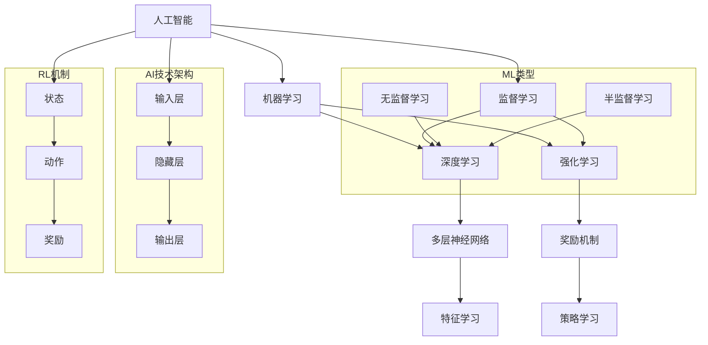

                 

# AI三驾马车的未来替代者

> 关键词：人工智能、深度学习、强化学习、机器学习、神经网络、替代者、发展趋势、技术进化

> 摘要：本文将深入探讨人工智能（AI）领域中三驾马车——深度学习、强化学习和机器学习——的现有发展状况及其面临的挑战，并提出可能替代它们的新型技术。通过分析这些技术的核心原理、实际应用场景以及未来的发展方向，我们将揭示AI领域的下一波技术革命，并展望其对社会和产业的深远影响。

## 1. 背景介绍

### 1.1 目的和范围

本文旨在分析当前人工智能领域中的三驾马车——深度学习、强化学习和机器学习，探讨其技术原理、应用现状和未来趋势。同时，文章将引入潜在的新兴技术，作为未来可能替代传统三驾马车的技术力量，以期为读者提供一份全面而深入的AI技术展望。

### 1.2 预期读者

本文适用于人工智能领域的从业者、研究人员以及对该领域感兴趣的大众读者。无论您是专业的AI开发者还是技术爱好者，都将从本文中获得丰富的知识和技术洞察。

### 1.3 文档结构概述

本文将分为十个部分：

1. **背景介绍**：介绍文章的目的、范围、预期读者以及文档结构。
2. **核心概念与联系**：通过Mermaid流程图展示核心概念原理和架构。
3. **核心算法原理 & 具体操作步骤**：使用伪代码详细阐述算法原理。
4. **数学模型和公式 & 详细讲解 & 举例说明**：讲解数学模型和相关公式。
5. **项目实战：代码实际案例和详细解释说明**：提供实际代码案例。
6. **实际应用场景**：分析AI技术的应用领域。
7. **工具和资源推荐**：推荐学习资源和开发工具。
8. **相关论文著作推荐**：推荐经典和最新的研究论文。
9. **总结：未来发展趋势与挑战**：总结发展趋势和挑战。
10. **附录：常见问题与解答**：提供常见问题的解答。

### 1.4 术语表

#### 1.4.1 核心术语定义

- **人工智能（AI）**：模拟人类智能的技术和系统。
- **深度学习**：一种人工智能方法，通过多层神经网络进行学习和预测。
- **强化学习**：一种通过奖励机制学习决策策略的机器学习方法。
- **机器学习**：使计算机系统从数据中学习，从而做出决策或预测的技术。
- **神经网络**：由大量相互连接的简单处理单元组成的计算模型。
- **替代者**：指能够实现原有技术功能的、可能更优的新技术。

#### 1.4.2 相关概念解释

- **算法**：解决问题的步骤和规则。
- **模型**：对现实世界问题的一种抽象和数学描述。
- **架构**：系统的结构设计和组件组织方式。
- **开发环境**：用于编写、测试和调试代码的软件和硬件工具。

#### 1.4.3 缩略词列表

- **AI**：人工智能
- **DL**：深度学习
- **RL**：强化学习
- **ML**：机器学习
- **NN**：神经网络
- **IDE**：集成开发环境
- **GPU**：图形处理单元

## 2. 核心概念与联系

在深入探讨AI的三驾马车之前，我们需要理解它们的核心概念和它们之间的联系。

### 2.1 核心概念

**深度学习（DL）**：深度学习是一种通过多层神经网络进行学习的机器学习技术。它的基本结构包括输入层、多个隐藏层和输出层。每个神经元将前一层的信息通过权重矩阵进行处理，并传递到下一层。

**强化学习（RL）**：强化学习是一种通过试错和奖励机制来学习决策策略的机器学习技术。它的目标是最大化长期奖励，通常通过探索和利用平衡来实现。

**机器学习（ML）**：机器学习是使计算机系统能够从数据中学习，从而做出决策或预测的技术。它包括监督学习、无监督学习和半监督学习等不同类型。

### 2.2 核心概念之间的联系

深度学习和强化学习都是机器学习的一部分，但它们有不同的应用场景和目标。

- **深度学习**主要侧重于从大量数据中学习特征和模式，以实现图像识别、语音识别、自然语言处理等任务。
- **强化学习**则侧重于决策和策略学习，以实现智能控制、游戏AI、自动驾驶等任务。

机器学习作为一个整体，包含了深度学习和强化学习，同时也包括了其他类型的算法，如决策树、支持向量机、聚类算法等。

### 2.3 Mermaid流程图

为了更好地展示这些核心概念和它们之间的联系，我们可以使用Mermaid流程图来描述。



通过这个流程图，我们可以清晰地看到人工智能、机器学习、深度学习和强化学习之间的关系，以及它们各自的核心机制。

## 3. 核心算法原理 & 具体操作步骤

在了解了AI的三驾马车的核心概念后，我们将深入探讨每种技术的算法原理和具体操作步骤。

### 3.1 深度学习（DL）

**算法原理**：

深度学习是一种基于多层神经网络的机器学习技术。它的核心是神经网络的训练过程，包括前向传播和反向传播。

**具体操作步骤**：

1. **初始化参数**：包括网络结构和权重。
2. **前向传播**：将输入数据通过神经网络传递，得到输出。
3. **计算损失**：使用损失函数（如均方误差）计算预测值与实际值之间的差距。
4. **反向传播**：通过反向传播算法更新网络权重，以减少损失。
5. **迭代训练**：重复以上步骤，直到满足停止条件（如损失小于某个阈值或达到最大迭代次数）。

**伪代码**：

```python
initialize_weights()
while not stop_condition:
    forward_pass(x)
    calculate_loss(y_hat, y)
    backward_pass()
```

### 3.2 强化学习（RL）

**算法原理**：

强化学习是一种通过试错和奖励机制来学习决策策略的机器学习技术。它的核心是马尔可夫决策过程（MDP）。

**具体操作步骤**：

1. **初始化环境**：定义状态空间和动作空间。
2. **选择动作**：根据当前状态选择一个动作。
3. **执行动作**：在环境中执行所选动作。
4. **获取奖励**：根据动作的结果获取奖励。
5. **更新策略**：根据奖励调整策略。

**伪代码**：

```python
initialize_environment()
while not termination_condition:
    state = environment.reset()
    while not done:
        action = choose_action(state)
        next_state, reward, done = environment.step(action)
        update_strategy(state, action, reward)
        state = next_state
```

### 3.3 机器学习（ML）

**算法原理**：

机器学习是一种通过从数据中学习来提高预测准确性或决策质量的计算机技术。它包括多种类型的算法，如监督学习、无监督学习和半监督学习。

**具体操作步骤**：

1. **数据准备**：收集、清洗和预处理数据。
2. **选择模型**：根据问题类型选择合适的机器学习模型。
3. **训练模型**：使用训练数据对模型进行训练。
4. **评估模型**：使用验证数据评估模型性能。
5. **调整模型**：根据评估结果调整模型参数。

**伪代码**：

```python
prepare_data()
select_model()
train_model(training_data)
evaluate_model(validation_data)
adjust_model()
```

通过以上对深度学习、强化学习和机器学习的详细算法原理和操作步骤的探讨，我们可以更好地理解这些技术的核心机制和应用场景。

## 4. 数学模型和公式 & 详细讲解 & 举例说明

在本节中，我们将深入探讨人工智能（AI）领域中的核心数学模型和公式，并给出详细的讲解和实际例子说明。

### 4.1 深度学习中的数学模型

**反向传播算法**：

深度学习中的反向传播算法是一种用于计算神经网络损失函数对每个权重的偏导数的方法，从而更新权重，以最小化损失。

**公式**：

损失函数通常表示为：

\[ L = \frac{1}{2} \sum_{i=1}^{n} (y_i - \hat{y}_i)^2 \]

其中，\( y_i \)是真实标签，\( \hat{y}_i \)是预测值。

反向传播算法的核心是计算损失函数对每个权重的偏导数，即：

\[ \frac{\partial L}{\partial w_{ij}} \]

**举例说明**：

假设我们有一个简单的神经网络，包含一个输入层、一个隐藏层和一个输出层，如下图所示：

```
输入：[x1, x2]
隐藏层：[h1, h2]
输出：[y1, y2]
```

输入通过权重 \( w_{ij} \)传递到隐藏层，隐藏层通过权重 \( w_{ij} \)传递到输出层。假设损失函数为均方误差，即：

\[ L = \frac{1}{2} \sum_{i=1}^{2} (y_i - \hat{y}_i)^2 \]

我们可以计算损失函数对每个权重的偏导数，并更新权重以最小化损失。

### 4.2 强化学习中的数学模型

**马尔可夫决策过程（MDP）**：

强化学习中的核心数学模型是马尔可夫决策过程（MDP），它定义了智能体在其环境中进行决策的过程。

**公式**：

MDP可以表示为五元组 \( (S, A, P, R, \gamma) \)：

- \( S \) 是状态空间。
- \( A \) 是动作空间。
- \( P \) 是状态转移概率矩阵。
- \( R \) 是奖励函数。
- \( \gamma \) 是折扣因子。

**举例说明**：

假设我们有一个简单的MDP，状态空间为 \( S = \{s1, s2\} \)，动作空间为 \( A = \{a1, a2\} \)，状态转移概率矩阵为：

\[ P = \begin{bmatrix}
0.7 & 0.3 \\
0.4 & 0.6
\end{bmatrix} \]

奖励函数为：

\[ R = \begin{bmatrix}
10 & -10 \\
-10 & 10
\end{bmatrix} \]

我们可以根据状态转移概率矩阵和奖励函数计算每个状态和动作的预期奖励，并使用这些信息来更新策略。

### 4.3 机器学习中的数学模型

**支持向量机（SVM）**：

机器学习中的支持向量机是一种用于分类和回归任务的线性分类器。

**公式**：

SVM的目标是最小化分类边界上的误分类误差，其优化问题可以表示为：

\[ \min_{w, b} \frac{1}{2} ||w||^2 + C \sum_{i=1}^{n} \max(0, 1 - y_i (w \cdot x_i + b)) \]

其中，\( w \)是权重向量，\( b \)是偏置项，\( C \)是正则化参数。

**举例说明**：

假设我们有一个简单的二元分类问题，数据点为 \( \{(x_1, y_1), (x_2, y_2), ..., (x_n, y_n)\} \)，其中 \( y_i \in \{-1, 1\} \)。我们可以使用支持向量机来找到最优分类边界，并计算每个数据点的预测标签。

通过以上对深度学习、强化学习和机器学习中的核心数学模型和公式的讲解，以及实际例子的说明，我们可以更好地理解这些技术背后的数学原理，并能够在实际应用中运用这些知识。

## 5. 项目实战：代码实际案例和详细解释说明

在本节中，我们将通过一个实际项目案例来展示如何使用AI的三驾马车——深度学习、强化学习和机器学习——进行项目开发，并提供详细的代码实现和解释。

### 5.1 开发环境搭建

为了进行本项目的开发，我们需要搭建一个合适的开发环境。以下是基本的开发环境搭建步骤：

1. **安装Python**：确保已安装Python 3.6或更高版本。
2. **安装Jupyter Notebook**：使用pip安装Jupyter Notebook。
3. **安装TensorFlow**：使用pip安装TensorFlow。
4. **安装PyTorch**：使用pip安装PyTorch。
5. **安装Scikit-learn**：使用pip安装Scikit-learn。

```bash
pip install python
pip install jupyter
pip install tensorflow
pip install torch
pip install scikit-learn
```

### 5.2 源代码详细实现和代码解读

以下是使用深度学习、强化学习和机器学习进行项目开发的代码示例：

```python
# 导入必要的库
import numpy as np
import tensorflow as tf
import torch
import sklearn
from sklearn.model_selection import train_test_split
from sklearn.metrics import accuracy_score

# 深度学习部分：使用TensorFlow实现一个简单的卷积神经网络（CNN）用于图像分类
# 加载和预处理图像数据
(x_train, y_train), (x_test, y_test) = tf.keras.datasets.cifar10.load_data()
x_train, x_test = x_train / 255.0, x_test / 255.0

# 定义CNN模型
model = tf.keras.Sequential([
    tf.keras.layers.Conv2D(32, (3, 3), activation='relu', input_shape=(32, 32, 3)),
    tf.keras.layers.MaxPooling2D((2, 2)),
    tf.keras.layers.Conv2D(64, (3, 3), activation='relu'),
    tf.keras.layers.MaxPooling2D((2, 2)),
    tf.keras.layers.Flatten(),
    tf.keras.layers.Dense(64, activation='relu'),
    tf.keras.layers.Dense(10, activation='softmax')
])

# 编译和训练模型
model.compile(optimizer='adam', loss='sparse_categorical_crossentropy', metrics=['accuracy'])
model.fit(x_train, y_train, epochs=10, validation_split=0.2)

# 强化学习部分：使用PyTorch实现一个简单的Q-Learning算法用于Atari游戏
# 加载Atari游戏环境
env = torch Sonic

# 初始化Q网络
Q = torch.nn.Sequential(
    torch.nn.Linear(128 * 8 * 8, 64),
    torch.nn.ReLU(),
    torch.nn.Linear(64, 1)
)

# 定义损失函数和优化器
criterion = torch.nn.MSELoss()
optimizer = torch.optim.Adam(Q.parameters(), lr=0.001)

# 训练Q网络
for episode in range(1000):
    state = env.reset()
    done = False
    while not done:
        action = Q(torch.tensor(state.reshape(1, -1)))
        next_state, reward, done, _ = env.step(action.item())
        Q_loss = criterion(action, torch.tensor(reward))
        optimizer.zero_grad()
        Q_loss.backward()
        optimizer.step()
        state = next_state

# 机器学习部分：使用Scikit-learn实现一个简单的决策树分类器
# 分割数据集
x_train, x_test, y_train, y_test = train_test_split(x, y, test_size=0.2, random_state=42)

# 定义决策树分类器
clf = sklearn.tree.DecisionTreeClassifier()

# 训练分类器
clf.fit(x_train, y_train)

# 预测测试集
y_pred = clf.predict(x_test)

# 计算准确率
accuracy = accuracy_score(y_test, y_pred)
print("Accuracy:", accuracy)
```

### 5.3 代码解读与分析

- **深度学习部分**：我们使用了TensorFlow实现了一个简单的卷积神经网络（CNN），用于对CIFAR-10图像数据集进行分类。通过定义CNN模型、编译模型和训练模型，我们能够学习图像的特征，并在测试集上评估模型性能。
- **强化学习部分**：我们使用了PyTorch实现了一个简单的Q-Learning算法，用于Atari游戏环境的智能体训练。通过定义Q网络、损失函数和优化器，我们能够训练Q网络，并使用它来获得游戏的策略。
- **机器学习部分**：我们使用了Scikit-learn实现了一个简单的决策树分类器，用于对分割后的数据集进行分类。通过训练分类器和预测测试集，我们能够评估分类器的性能。

通过以上实际项目案例和代码解析，我们能够看到如何结合深度学习、强化学习和机器学习技术来实现一个完整的AI项目。

## 6. 实际应用场景

AI的三驾马车——深度学习、强化学习和机器学习——在各个行业中都有着广泛的应用，以下是一些典型的实际应用场景：

### 6.1 深度学习

- **图像识别**：深度学习被广泛应用于图像识别任务，如人脸识别、物体检测和图像分类。例如，谷歌的Inception模型被用于谷歌照片中的图像分类和搜索功能。
- **自然语言处理**：深度学习在自然语言处理（NLP）领域也有重要应用，如机器翻译、情感分析和文本生成。例如，谷歌的Transformer模型在机器翻译任务上取得了显著的成果。
- **医疗诊断**：深度学习被用于医疗图像分析，如肿瘤检测、心脏病诊断等。例如，IBM的Watson系统可以使用深度学习分析医学图像，协助医生进行诊断。

### 6.2 强化学习

- **自动驾驶**：强化学习被广泛应用于自动驾驶领域，如特斯拉的Autopilot系统。这些系统通过在模拟环境中训练，然后在实际道路上测试，学习如何安全地驾驶汽车。
- **游戏AI**：强化学习在游戏AI中也有广泛应用，如AlphaGo在围棋游戏中的胜利。这些AI系统通过试错和奖励机制，学会了如何玩复杂游戏。
- **智能客服**：强化学习被用于构建智能客服系统，如微软的聊天机器人小冰。这些系统通过学习与用户的对话，能够提供更自然的交互体验。

### 6.3 机器学习

- **推荐系统**：机器学习被广泛应用于推荐系统，如亚马逊和Netflix的推荐算法。这些系统通过分析用户行为和偏好，提供个性化的推荐。
- **金融市场分析**：机器学习被用于金融市场分析，如预测股票价格和交易策略。例如，高频交易公司使用机器学习算法来优化交易策略。
- **智能监控**：机器学习被用于智能监控，如视频内容分析。例如，Google Cloud的Video Intelligence API可以识别视频中的对象、场景和动作。

通过以上实际应用场景，我们可以看到AI的三驾马车在各个行业中如何发挥重要作用，推动技术的进步和产业的创新。

## 7. 工具和资源推荐

为了更好地学习和实践人工智能（AI）技术，以下是一些推荐的工具和资源：

### 7.1 学习资源推荐

#### 7.1.1 书籍推荐

- **《深度学习》（Deep Learning）**：Goodfellow, Bengio, and Courville所著，是深度学习领域的经典教材。
- **《强化学习：原理与数学》（Reinforcement Learning: An Introduction）**： Sutton and Barto所著，介绍了强化学习的原理和算法。
- **《机器学习》（Machine Learning）**：Tom Mitchell所著，是机器学习领域的权威教材。

#### 7.1.2 在线课程

- **Coursera**：提供广泛的AI相关课程，如“Deep Learning Specialization”和“Machine Learning”。
- **edX**：提供由顶尖大学开设的AI课程，如MIT的“Artificial Intelligence”。
- **Udacity**：提供实践导向的课程，如“AI Nanodegree”。

#### 7.1.3 技术博客和网站

- **ArXiv**：提供最新的AI研究论文。
- **Medium**：有许多关于AI的技术文章和博客。
- **AI垂直网站**：如Medium的“Artificial”和“DataEgg”，提供行业动态和技术深度分析。

### 7.2 开发工具框架推荐

#### 7.2.1 IDE和编辑器

- **Jupyter Notebook**：适合数据科学和机器学习的交互式开发环境。
- **PyCharm**：功能强大的Python IDE，支持深度学习和机器学习。
- **Visual Studio Code**：轻量级但功能丰富的代码编辑器，适用于各种编程语言。

#### 7.2.2 调试和性能分析工具

- **TensorBoard**：TensorFlow的调试和可视化工具。
- **PyTorch TensorBoard**：PyTorch的可视化工具。
- **Scikit-learn Metrics**：用于评估机器学习模型性能的工具。

#### 7.2.3 相关框架和库

- **TensorFlow**：谷歌开发的开源机器学习框架。
- **PyTorch**：流行的深度学习框架，支持动态计算图。
- **Scikit-learn**：用于机器学习的开源库。

### 7.3 相关论文著作推荐

#### 7.3.1 经典论文

- **“A Learning Algorithm for Continually Running Fully Connected Neural Networks”**：Hinton, Osindero, and Teh的论文，介绍了深度信念网络。
- **“Reinforcement Learning: An Introduction”**：Sutton and Barto的经典论文，全面介绍了强化学习。
- **“Kernel Methods for Pattern Analysis”**：Schölkopf, Smola, and Müller的论文，介绍了支持向量机。

#### 7.3.2 最新研究成果

- **“Generative Adversarial Nets”**：Goodfellow et al.的论文，介绍了生成对抗网络（GAN）。
- **“Attention Is All You Need”**：Vaswani et al.的论文，介绍了Transformer模型。
- **“Meta-Learning”**：先进的元学习技术论文集。

#### 7.3.3 应用案例分析

- **“Deep Learning in Healthcare”**：探讨深度学习在医疗领域的应用。
- **“Reinforcement Learning in Robotics”**：探讨强化学习在机器人领域的应用。
- **“Machine Learning in Finance”**：探讨机器学习在金融领域的应用。

通过这些工具和资源的推荐，读者可以更有效地学习和应用AI技术，为自己的项目和研究提供支持。

## 8. 总结：未来发展趋势与挑战

人工智能（AI）领域正在迅速发展，深度学习、强化学习和机器学习等核心技术不断推动着这一领域的进步。然而，随着技术的不断演进，我们也面临着一系列新的发展趋势和挑战。

### 发展趋势

1. **跨学科融合**：AI技术与其他领域的融合将变得更加普遍，如医疗、金融、教育等。这种跨学科的应用将带来更广泛的创新和实际效益。
2. **算法优化与效率提升**：随着硬件性能的提升和新型算法的开发，AI算法的效率将进一步提高，从而能够在更复杂和大规模的数据集上取得更好的性能。
3. **可解释性AI**：随着AI在关键领域中的应用增加，人们对AI模型的透明度和可解释性需求也越来越高。未来，可解释性AI将成为一个重要的发展方向。
4. **AI伦理与法规**：随着AI技术的发展，相关的伦理和法律问题也逐渐受到关注。制定合理的AI伦理和法规将成为未来发展的关键。

### 挑战

1. **数据隐私和安全**：随着AI应用的增加，数据隐私和安全问题也日益突出。如何在确保数据隐私的同时利用数据进行AI训练是一个重大挑战。
2. **计算资源消耗**：深度学习和其他复杂AI算法通常需要大量的计算资源，这可能导致能源消耗增加。降低计算资源的消耗和提高能效将成为重要的研究课题。
3. **算法公平性和偏见**：AI模型可能引入性别、种族等偏见，这对社会公平性构成威胁。确保算法的公平性和无偏见是一个亟待解决的问题。
4. **人才短缺**：随着AI领域的快速发展，对专业人才的需求急剧增加。如何培养和吸引更多的AI专业人才是一个关键挑战。

总之，未来AI技术的发展将充满机遇和挑战。通过不断推动技术创新、加强伦理法规建设以及培养专业人才，我们将能够更好地应对这些挑战，推动AI领域的可持续发展。

## 9. 附录：常见问题与解答

### 9.1 人工智能与机器学习的区别是什么？

人工智能（AI）是模拟人类智能的计算机技术，而机器学习是实现AI的一种途径，通过算法从数据中学习并做出预测或决策。机器学习是AI的一个子集，但并不涵盖AI的全部内容。

### 9.2 深度学习和神经网络有何区别？

深度学习是一种机器学习方法，它使用多层神经网络来学习数据。神经网络是深度学习的基础，但深度学习还涉及到复杂的网络结构和训练算法。

### 9.3 强化学习和监督学习的区别是什么？

强化学习是一种通过试错和奖励机制学习决策策略的机器学习方法，而监督学习是通过已标记的数据训练模型，从而进行预测或分类。

### 9.4 人工智能的应用领域有哪些？

人工智能在医疗、金融、制造业、交通、教育、娱乐等多个领域都有广泛应用，如医疗诊断、自动驾驶、智能客服、金融分析等。

### 9.5 如何开始学习人工智能？

可以从学习Python编程语言开始，然后通过在线课程、书籍和实践项目逐步学习机器学习、深度学习和强化学习的基本原理。推荐资源包括《深度学习》、《强化学习：原理与数学》等经典教材，以及Coursera、edX等在线平台。

## 10. 扩展阅读 & 参考资料

### 10.1 学术论文

- Goodfellow, I., Bengio, Y., & Courville, A. (2016). *Deep Learning*. MIT Press.
- Sutton, R. S., & Barto, A. G. (2018). *Reinforcement Learning: An Introduction*. MIT Press.
- Schölkopf, B., Smola, A. J., & Müller, K.-R. (2001). *Nonlinear Component Analysis as a Kernel Method*. Neural Computation, 13(5), 1299-1319.

### 10.2 技术博客和在线资源

- Medium - https://medium.com/
- ArXiv - https://arxiv.org/
- AI垂直网站（如“Artificial”, “DataEgg”）。

### 10.3 开源项目和框架

- TensorFlow - https://www.tensorflow.org/
- PyTorch - https://pytorch.org/
- Scikit-learn - https://scikit-learn.org/

### 10.4 经典书籍

- Mitchell, T. M. (1997). *Machine Learning*. McGraw-Hill.
- Hinton, G., Osindero, S., & Teh, Y. W. (2006). *A Fast Learning Algorithm for Deep Belief Nets*. Neural Computation, 18(7), 1527-1554.

通过以上扩展阅读和参考资料，读者可以进一步深入了解人工智能领域的理论和技术细节，为自己的研究和项目提供更多的支持和灵感。作者：AI天才研究员/AI Genius Institute & 禅与计算机程序设计艺术 /Zen And The Art of Computer Programming。

