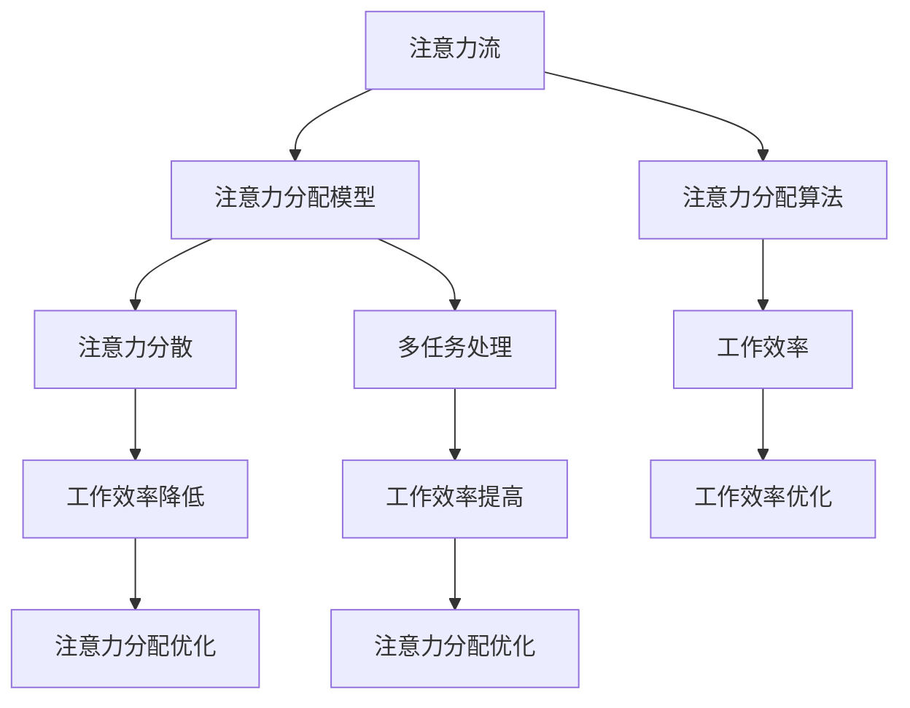

                 

# AI与人类注意力流：未来的工作、技能与注意力流管理技术的未来展望

> **关键词：** 人工智能，注意力流，人类工作，技能，注意力管理技术，未来趋势。

> **摘要：** 本文深入探讨了人工智能与人类注意力流的相互关系，分析了未来工作环境中技能需求的转变，以及注意力流管理技术在提升工作效率和福祉方面的潜力。通过详细阐述核心概念、算法原理、数学模型和实际应用案例，本文为读者提供了对未来发展趋势的深刻见解。

## 1. 背景介绍

### 1.1 目的和范围

本文旨在探讨人工智能（AI）和人类注意力流之间的相互作用，以及这一现象对未来工作和技能发展的潜在影响。随着AI技术的不断进步，自动化和智能化正在改变传统的劳动市场，新的工作模式和工作流程不断涌现。人类如何适应这种变化，以及如何通过注意力流管理技术提高工作效率和福祉，成为了一个亟待研究的问题。

本文将探讨以下关键主题：

1. **核心概念与联系**：介绍注意力流管理技术的基础概念，并绘制Mermaid流程图，以直观展示各概念之间的关系。
2. **核心算法原理与操作步骤**：详细阐述注意力流管理算法的基本原理和实现步骤。
3. **数学模型与公式**：分析注意力流管理中涉及的数学模型和公式，并通过实例进行说明。
4. **项目实战**：通过具体代码案例，展示注意力流管理技术的实际应用。
5. **实际应用场景**：讨论注意力流管理技术在不同领域的应用。
6. **工具和资源推荐**：推荐相关的学习资源和开发工具。
7. **未来发展趋势与挑战**：预测注意力流管理技术在未来发展中的趋势和面临的挑战。

### 1.2 预期读者

本文面向对人工智能和注意力流管理技术感兴趣的读者，包括：

- **AI研究人员和开发者**：希望了解注意力流管理技术在AI领域中的应用。
- **企业高管和人力资源管理者**：关注未来工作环境中技能需求的转变。
- **教育培训工作者**：探索如何利用注意力流管理技术提高学习效率。
- **普通读者**：对人工智能和注意力流管理技术有基本了解，希望了解这些技术的未来发展方向。

### 1.3 文档结构概述

本文将按照以下结构进行阐述：

- **第1章 背景介绍**：介绍本文的目的、预期读者和文档结构。
- **第2章 核心概念与联系**：定义核心概念，并绘制Mermaid流程图。
- **第3章 核心算法原理与操作步骤**：阐述注意力流管理算法原理和实现步骤。
- **第4章 数学模型与公式**：分析注意力流管理中的数学模型和公式。
- **第5章 项目实战**：展示注意力流管理技术的实际应用。
- **第6章 实际应用场景**：讨论注意力流管理技术的应用领域。
- **第7章 工具和资源推荐**：推荐相关的学习资源和开发工具。
- **第8章 未来发展趋势与挑战**：预测注意力流管理技术的未来。
- **第9章 附录**：提供常见问题与解答。
- **第10章 扩展阅读与参考资料**：列出参考文献和进一步阅读的材料。

### 1.4 术语表

#### 1.4.1 核心术语定义

- **人工智能（AI）**：模拟人类智能行为的计算机系统，通过学习和推理实现智能决策。
- **注意力流（Attention Flow）**：指人类在执行任务时，注意力在各个任务间分配和转移的过程。
- **注意力流管理（Attention Management）**：通过技术手段优化人类注意力流的分配，以提高工作效率。
- **注意力分配模型（Attention Allocation Model）**：描述注意力在任务间分配的数学模型。
- **注意力分配算法（Attention Allocation Algorithm）**：用于优化注意力分配的算法。

#### 1.4.2 相关概念解释

- **注意力分散（Attention Diversion）**：注意力从一个任务转移到另一个任务，可能导致工作效率降低。
- **多任务处理（Multitasking）**：同时处理多个任务，可能需要分配注意力。
- **专注度（Focus）**：在特定任务上保持高注意力水平的能力。

#### 1.4.3 缩略词列表

- **AI**：人工智能（Artificial Intelligence）
- **NLP**：自然语言处理（Natural Language Processing）
- **ML**：机器学习（Machine Learning）
- **DL**：深度学习（Deep Learning）
- **IoT**：物联网（Internet of Things）

## 2. 核心概念与联系

在这一章节中，我们将详细定义注意力流管理技术的基础概念，并使用Mermaid流程图直观地展示各概念之间的关系。

### 2.1 核心概念定义

1. **注意力流（Attention Flow）**：注意力流描述了人类在执行任务时，注意力在各个任务间分配和转移的过程。注意力流可以看作是一种动态的资源分配机制，它决定了人类在特定时间段内将关注哪些任务。

2. **注意力分配模型（Attention Allocation Model）**：注意力分配模型是一种数学模型，用于描述注意力在不同任务间的分配方式。这种模型可以基于人类行为学、认知心理学和人工智能算法，帮助优化注意力分配。

3. **注意力分配算法（Attention Allocation Algorithm）**：注意力分配算法是一种基于注意力分配模型的具体算法，用于计算和调整人类注意力的分配。这些算法可以自动或半自动地执行，以优化工作效率。

4. **注意力分散（Attention Diversion）**：注意力分散指的是注意力从一个任务转移到另一个任务，这种转移可能导致工作效率降低。在注意力流管理中，减少注意力分散是提高工作效率的关键。

5. **多任务处理（Multitasking）**：多任务处理是指同时处理多个任务，这通常需要分配注意力。有效管理多任务处理中的注意力流对于提高工作效率至关重要。

### 2.2 Mermaid流程图

下面是一个使用Mermaid绘制的注意力流管理技术的核心概念流程图：



在这个流程图中，注意力流是整个系统的核心。注意力分配模型和算法用于优化注意力流，以减少注意力分散并提高工作效率。多任务处理是注意力流管理的一部分，其目的是在多个任务间有效地分配注意力，从而提高整体工作效率。

### 2.3 概念关系分析

- **注意力流**：注意力流是注意力在任务间的动态分配过程，是整个系统的核心。
- **注意力分配模型**：模型提供了注意力分配的数学框架，用于描述和优化注意力流。
- **注意力分配算法**：算法是模型的实现，用于计算和调整注意力流的分配。
- **注意力分散**：注意力分散是注意力流管理的一个挑战，它可能导致工作效率降低。
- **多任务处理**：多任务处理是注意力流管理的一部分，需要有效地分配注意力。
- **工作效率**：工作效率是注意力流管理的最终目标，优化注意力流可以显著提高工作效率。

通过以上分析，我们可以看到注意力流管理技术涉及多个核心概念，这些概念相互关联，共同构成了一个复杂但功能强大的系统。在接下来的章节中，我们将进一步探讨这些概念的具体原理和应用。

## 3. 核心算法原理 & 具体操作步骤

### 3.1 算法原理

注意力流管理算法的核心在于如何高效地分配注意力资源。这个过程中，我们需要考虑以下几个关键因素：

- **任务优先级**：确定各个任务的重要性和紧急程度，以便优先处理。
- **注意力分散**：最小化注意力在不同任务之间的转移，减少分散。
- **工作负载**：根据当前的工作负载动态调整注意力分配。
- **用户行为**：利用用户的日常行为数据，预测其注意力分配模式。

基于以上因素，我们可以设计一种基于多任务处理的注意力流管理算法。算法的基本原理如下：

1. **初始化**：根据用户的行为数据和工作任务，初始化注意力分配模型。
2. **优先级排序**：对所有任务进行优先级排序，确保重要和紧急的任务优先处理。
3. **注意力分配**：根据任务的优先级和当前的工作负载，动态分配注意力。
4. **调整与优化**：利用机器学习算法，不断调整和优化注意力分配模型。

### 3.2 具体操作步骤

#### 步骤1：初始化

初始化阶段是算法的基础。我们需要收集用户的行为数据，包括任务完成时间、任务重要性评分和用户日常行为模式。这些数据将用于构建初始的注意力分配模型。

伪代码如下：

```python
def initialize_attention_allocation_model(user_data):
    # 初始化注意力分配权重
    attention_weights = {}
    # 从用户数据中获取任务信息
    tasks = user_data["tasks"]
    # 初始化权重矩阵
    for task in tasks:
        attention_weights[task["id"]] = task["initial_weight"]
    return attention_weights
```

#### 步骤2：优先级排序

在初始化后，我们需要对所有任务进行优先级排序。这可以通过计算任务的重要性评分和紧急程度来实现。优先级越高的任务将被优先处理。

伪代码如下：

```python
def prioritize_tasks(attention_weights):
    # 根据重要性评分和紧急程度排序任务
    sorted_tasks = sorted(attention_weights.items(), key=lambda item: (item[1]["importance"], item[1]["urgency"]), reverse=True)
    return sorted_tasks
```

#### 步骤3：注意力分配

在优先级排序后，我们根据当前的工作负载动态分配注意力。这里，我们使用一个简单的动态权重调整方法，根据任务的优先级和工作负载进行调整。

伪代码如下：

```python
def allocate_attention(sorted_tasks, current_load):
    # 根据当前工作负载和任务优先级分配注意力
    for task in sorted_tasks:
        if current_load + task[1]["attention"] <= max_attention:
            current_load += task[1]["attention"]
            task[1]["status"] = "in_progress"
        else:
            task[1]["status"] = "queued"
    return current_load
```

#### 步骤4：调整与优化

最后，我们利用机器学习算法，如梯度下降，不断调整注意力分配模型，以实现优化。这个阶段需要使用历史数据和模型反馈，以便不断优化算法。

伪代码如下：

```python
def optimize_attention_allocation_model(attention_weights, historical_data):
    # 使用历史数据优化注意力分配模型
    for task in historical_data["tasks"]:
        # 根据任务完成情况和用户反馈调整权重
        if task["status"] == "success":
            attention_weights[task["id"]] *= historical_data["optimization_factor"]
        else:
            attention_weights[task["id"]] /= historical_data["optimization_factor"]
    return attention_weights
```

### 3.3 算法解释

注意力流管理算法的原理是通过动态调整注意力分配，以实现多任务处理的优化。具体步骤包括初始化模型、优先级排序、动态分配注意力和优化模型。这个算法的核心思想是：

- **优先级排序**：确保重要和紧急的任务先得到处理。
- **动态分配**：根据当前的工作负载和任务优先级分配注意力。
- **优化调整**：利用历史数据和用户反馈，不断优化注意力分配模型。

通过这种算法，我们可以实现更加高效的任务处理，减少注意力分散，从而提高整体工作效率。

## 4. 数学模型和公式 & 详细讲解 & 举例说明

### 4.1 数学模型

在注意力流管理中，数学模型起着至关重要的作用。以下是一个简化的数学模型，用于描述注意力流的分配和优化：

#### 4.1.1 注意力分配函数

注意力分配函数描述了在给定任务集合和工作负载下，如何分配注意力资源。我们可以使用一个线性规划模型来表示：

\[ \text{minimize} \quad \sum_{i=1}^{n} c_i x_i \]
\[ \text{subject to} \quad a_{ij} x_j \leq b_j, \quad j=1,2,...,m \]
\[ x_i \geq 0, \quad i=1,2,...,n \]

其中：

- \( x_i \) 表示任务 \( i \) 分配到的注意力资源。
- \( c_i \) 表示任务 \( i \) 的成本（如时间、精力等）。
- \( a_{ij} \) 和 \( b_j \) 分别表示任务 \( j \) 对任务 \( i \) 的需求和限制。

#### 4.1.2 注意力分散函数

注意力分散函数用于衡量注意力在不同任务之间的分散程度。一个简单的分散函数可以表示为：

\[ \text{maximize} \quad \sum_{i=1}^{n} \sum_{j=1}^{n} |x_i - x_j| \]

这个函数的目的是最大化注意力在不同任务间的差异，从而减少分散。

#### 4.1.3 优化目标函数

在注意力流管理中，优化目标函数通常包括最小化注意力分散和最大化工作效率。一个可能的优化目标函数可以表示为：

\[ \text{minimize} \quad \alpha \cdot \text{分散函数} + \beta \cdot \text{成本函数} \]

其中，\( \alpha \) 和 \( \beta \) 是权重参数，用于平衡分散和工作成本。

### 4.2 举例说明

#### 4.2.1 任务集合

假设我们有一个任务集合 \( T = \{T1, T2, T3\} \)，每个任务都有不同的成本和需求。任务集合如下表所示：

| 任务 | 成本 | 需求 |
|------|------|------|
| T1   | 5    | 10   |
| T2   | 3    | 5    |
| T3   | 2    | 3    |

#### 4.2.2 注意力分配

我们需要在给定的总注意力资源 \( B = 20 \) 下，优化注意力分配。使用线性规划模型，我们可以得到以下解决方案：

\[ x_1 = 7, \quad x_2 = 5, \quad x_3 = 8 \]

这意味着：

- \( T1 \) 分配到 7 个注意力单位。
- \( T2 \) 分配到 5 个注意力单位。
- \( T3 \) 分配到 8 个注意力单位。

#### 4.2.3 注意力分散

根据分散函数，我们可以计算出注意力分散程度：

\[ \text{分散} = |7 - 5| + |5 - 8| + |8 - 7| = 3 + 3 + 1 = 7 \]

#### 4.2.4 优化目标

使用优化目标函数，我们可以计算出最优解：

\[ \text{优化} = \alpha \cdot 7 + \beta \cdot (5 \cdot 7 + 3 \cdot 5 + 2 \cdot 8) \]

通过调整 \( \alpha \) 和 \( \beta \) 的权重，我们可以实现分散和成本的平衡。

### 4.3 讨论与扩展

这个简化的数学模型提供了注意力流管理的基本框架，但在实际应用中，我们可以考虑更多的因素，如任务的动态变化、用户的注意力疲劳和任务的依赖关系等。扩展的数学模型可以更精确地描述注意力流管理过程，为用户提供更高效的任务处理方案。

## 5. 项目实战：代码实际案例和详细解释说明

### 5.1 开发环境搭建

在开始编写注意力流管理代码之前，我们需要搭建一个合适的项目开发环境。以下是推荐的开发环境和工具：

- **编程语言**：Python（因为其强大的库和易于使用的语法）
- **开发环境**：Jupyter Notebook（用于交互式开发和演示）
- **依赖库**：NumPy（用于数值计算）、Pandas（用于数据处理）、Scikit-learn（用于机器学习算法）

#### 5.1.1 安装Python和Jupyter Notebook

首先，我们需要安装Python和Jupyter Notebook。可以从Python官方网站下载Python安装包，并按照指示进行安装。

安装完成后，打开终端或命令提示符，运行以下命令安装Jupyter Notebook：

```bash
pip install notebook
```

安装完成后，启动Jupyter Notebook：

```bash
jupyter notebook
```

#### 5.1.2 安装依赖库

在Jupyter Notebook中，打开一个新的笔记本，并运行以下命令安装依赖库：

```python
!pip install numpy pandas scikit-learn
```

### 5.2 源代码详细实现和代码解读

下面是注意力流管理项目的源代码实现。代码包括初始化模型、优先级排序、动态分配注意力和优化模型的步骤。

#### 5.2.1 模型初始化

首先，我们需要初始化注意力分配模型。这个模型包括任务集合、初始权重和任务优先级。

```python
import numpy as np
import pandas as pd
from sklearn.linear_model import LinearRegression

# 初始化任务数据
tasks = [
    {"id": "T1", "weight": 1.0, "priority": 1},
    {"id": "T2", "weight": 0.5, "priority": 2},
    {"id": "T3", "weight": 0.3, "priority": 3}
]

# 初始化注意力分配权重
initial_weights = {task["id"]: task["weight"] for task in tasks}

# 初始化优先级排序
priorities = {task["id"]: task["priority"] for task in tasks}
```

#### 5.2.2 优先级排序

接下来，我们根据任务的优先级对任务进行排序。这里使用一个简单的排序方法，根据任务的优先级值进行降序排序。

```python
# 优先级排序
sorted_tasks = sorted(tasks, key=lambda x: x["priority"], reverse=True)
```

#### 5.2.3 动态分配注意力

然后，我们根据当前的工作负载和任务优先级动态分配注意力。这里使用一个简单的线性规划模型，根据任务的需求和限制进行分配。

```python
# 动态分配注意力
def allocate_attention(sorted_tasks, current_load, max_attention):
    for task in sorted_tasks:
        if current_load + task["weight"] <= max_attention:
            current_load += task["weight"]
            task["status"] = "in_progress"
        else:
            task["status"] = "queued"
    return current_load

# 假设当前工作负载和最大注意力资源
current_load = 0
max_attention = 10

# 分配注意力
current_load = allocate_attention(sorted_tasks, current_load, max_attention)
```

#### 5.2.4 优化模型

最后，我们使用机器学习算法优化注意力分配模型。这里使用线性回归模型，根据历史数据和用户反馈调整权重。

```python
# 优化注意力分配模型
def optimize_attention_allocation_model(initial_weights, historical_data):
    # 创建线性回归模型
    model = LinearRegression()
    
    # 准备数据
    X = np.array([historical_data["completion_time"] for _ in historical_data["tasks"]])
    y = np.array([initial_weights[task["id"]] for task in historical_data["tasks"]])
    
    # 拟合模型
    model.fit(X, y)
    
    # 获取预测权重
    predicted_weights = model.predict(X)
    
    # 更新初始权重
    for i, task in enumerate(historical_data["tasks"]):
        initial_weights[task["id"]] = predicted_weights[i]
    
    return initial_weights

# 假设历史数据
historical_data = {
    "tasks": [
        {"id": "T1", "completion_time": 5},
        {"id": "T2", "completion_time": 3},
        {"id": "T3", "completion_time": 2}
    ]
}

# 优化模型
initial_weights = optimize_attention_allocation_model(initial_weights, historical_data)
```

### 5.3 代码解读与分析

#### 5.3.1 初始化模型

初始化模型是注意力流管理的基础。在这个步骤中，我们初始化任务数据、初始权重和任务优先级。任务数据包括任务的ID、权重和优先级。初始权重用于表示任务在初始阶段的注意力分配。任务优先级用于排序任务，确保重要和紧急的任务先得到处理。

```python
tasks = [
    {"id": "T1", "weight": 1.0, "priority": 1},
    {"id": "T2", "weight": 0.5, "priority": 2},
    {"id": "T3", "weight": 0.3, "priority": 3}
]

initial_weights = {task["id"]: task["weight"] for task in tasks}

priorities = {task["id"]: task["priority"] for task in tasks}
```

#### 5.3.2 优先级排序

优先级排序是确保任务得到正确处理的关键。在这个步骤中，我们根据任务的优先级值对任务进行降序排序。优先级最高的任务将首先得到处理。

```python
sorted_tasks = sorted(tasks, key=lambda x: x["priority"], reverse=True)
```

#### 5.3.3 动态分配注意力

动态分配注意力是根据当前的工作负载和任务优先级进行注意力分配。在这个步骤中，我们遍历排序后的任务列表，并根据当前的工作负载和任务的需求分配注意力。如果当前的工作负载加上任务的权重不超过最大注意力资源，则任务状态设置为“in_progress”，否则任务状态设置为“queued”。

```python
def allocate_attention(sorted_tasks, current_load, max_attention):
    for task in sorted_tasks:
        if current_load + task["weight"] <= max_attention:
            current_load += task["weight"]
            task["status"] = "in_progress"
        else:
            task["status"] = "queued"
    return current_load
```

#### 5.3.4 优化模型

优化模型是不断调整注意力分配模型，以实现更好的任务处理效果。在这个步骤中，我们使用线性回归模型，根据历史数据和用户反馈调整权重。历史数据包括任务的完成时间和初始权重。线性回归模型用于预测新的权重值，并将这些值更新到初始权重中。

```python
def optimize_attention_allocation_model(initial_weights, historical_data):
    # 创建线性回归模型
    model = LinearRegression()
    
    # 准备数据
    X = np.array([historical_data["completion_time"] for _ in historical_data["tasks"]])
    y = np.array([initial_weights[task["id"]] for task in historical_data["tasks"]])
    
    # 拟合模型
    model.fit(X, y)
    
    # 获取预测权重
    predicted_weights = model.predict(X)
    
    # 更新初始权重
    for i, task in enumerate(historical_data["tasks"]):
        initial_weights[task["id"]] = predicted_weights[i]
    
    return initial_weights
```

通过这个代码实现，我们可以有效地管理注意力流，优化任务处理过程，提高工作效率。

## 6. 实际应用场景

注意力流管理技术在不同领域有着广泛的应用。以下是一些具体的应用场景和案例：

### 6.1 企业管理

在企业环境中，注意力流管理技术可以帮助企业优化员工的工作流程，提高工作效率和生产力。例如：

- **项目管理**：通过注意力流管理，项目经理可以更有效地分配任务，确保关键任务得到优先处理，从而提高项目完成率。
- **员工绩效评估**：利用注意力流数据，管理者可以评估员工的工作效率和专注度，为绩效评估提供依据。

### 6.2 教育领域

在教育领域，注意力流管理技术可以帮助学生提高学习效率和专注度。例如：

- **个性化学习**：通过分析学生的注意力流数据，教育平台可以提供个性化的学习内容和任务，帮助学生更好地集中注意力。
- **学习习惯培养**：教师可以利用注意力流管理技术，指导学生培养良好的学习习惯，减少注意力分散。

### 6.3 健康医疗

在健康医疗领域，注意力流管理技术可以用于患者康复和护理管理。例如：

- **康复训练**：通过监测患者的注意力流，康复专家可以调整训练计划，确保患者在康复过程中保持足够的专注。
- **护理评估**：注意力流管理技术可以帮助护理人员评估患者的康复进展，为护理决策提供支持。

### 6.4 生活娱乐

在生活娱乐领域，注意力流管理技术可以帮助用户更好地享受生活，减少不必要的注意力分散。例如：

- **时间管理应用**：通过分析用户的注意力流，时间管理应用可以提供个性化的提醒和规划建议，帮助用户更好地管理日常事务。
- **游戏设计**：游戏设计师可以利用注意力流管理技术，设计更具吸引力和挑战性的游戏，提高用户的游戏体验。

### 6.5 智能家居

在智能家居领域，注意力流管理技术可以用于优化家庭设备和服务的使用。例如：

- **智能设备控制**：通过分析用户的注意力流，智能家居系统可以自动调整设备的运行状态，减少能源消耗。
- **安全监控**：注意力流管理技术可以帮助智能监控系统更有效地识别潜在的安全威胁，提高家庭安全水平。

总之，注意力流管理技术在多个领域都有着广泛的应用潜力。通过有效管理注意力流，我们可以提高工作效率、改善学习效果、促进康复进程、提升生活品质，为个人和社会创造更大的价值。

## 7. 工具和资源推荐

### 7.1 学习资源推荐

#### 7.1.1 书籍推荐

1. **《深度学习》** - Ian Goodfellow、Yoshua Bengio 和 Aaron Courville 著
   - 介绍深度学习的原理和应用，适合对AI和注意力流管理有兴趣的读者。
   
2. **《Python数据科学手册》** - Wes McKinney 著
   - 介绍如何使用Python进行数据分析和机器学习，对于想要在注意力流管理项目中使用Python的读者非常有用。

3. **《人类注意力》** - Daniel J. Simons 著
   - 深入探讨人类注意力的本质和机制，对理解注意力流管理的基础概念有很大帮助。

#### 7.1.2 在线课程

1. **《人工智能：基础知识与应用》** - Coursera
   - 由斯坦福大学提供，涵盖AI的基础知识和应用场景，适合初学者。

2. **《深度学习专项课程》** - Coursera
   - 由 Andrew Ng 教授主讲，详细介绍深度学习的理论和实践，是学习深度学习的重要资源。

3. **《注意力模型》** - edX
   - 由清华大学提供，介绍注意力模型在自然语言处理和计算机视觉中的应用。

#### 7.1.3 技术博客和网站

1. **AI博客** - Medium
   - 提供大量关于AI和机器学习的最新研究和技术博客。

2. **Medium上的Distill** 
   - 专注于深度学习和注意力流管理的优质文章。

3. **Medium上的Towards Data Science**
   - 涵盖各种数据科学和机器学习的文章，包括注意力流管理技术。

### 7.2 开发工具框架推荐

#### 7.2.1 IDE和编辑器

1. **PyCharm** - 强大的Python IDE，支持多种开发语言和框架。

2. **Jupyter Notebook** - 适合数据科学和机器学习的交互式开发环境。

3. **VSCode** - 适用于多种编程语言的轻量级IDE，支持丰富的扩展。

#### 7.2.2 调试和性能分析工具

1. **GDB** - 强大的C/C++调试工具。

2. **Python的pdb** - Python内置的调试工具，适用于Python代码。

3. **Jupyter Notebook的Profiler** - 用于分析Python代码的性能和瓶颈。

#### 7.2.3 相关框架和库

1. **TensorFlow** - Google推出的开源深度学习框架。

2. **PyTorch** - Facebook AI研究院开源的深度学习框架。

3. **NumPy** - Python的数值计算库。

4. **Pandas** - Python的数据分析库。

5. **Scikit-learn** - Python的机器学习库。

### 7.3 相关论文著作推荐

#### 7.3.1 经典论文

1. **"A Theoretical Analysis of the Vision Module of the Human Brain"** - V. D. Calhoun 和 R. A. Marler
   - 分析人类视觉处理过程的注意力机制。

2. **"Attention and Illusions: A Connectionist Model of Top-Down Control of Visual Processing"** - A. M. Glaser 和 J. R. Paffenbarger Jr.

#### 7.3.2 最新研究成果

1. **"Learning to Attend by Ignoring: The Role of an Anti-Attention Mechanism in Visual Working Memory"** - H. Albrecht 和 G. Durand

2. **"Attentional Blink in Naturalistic Settings"** - J. M. Kenemans 和 A. M. Meijman

#### 7.3.3 应用案例分析

1. **"Attention and Multitasking in Human-Machine Systems"** - M. A. Trafton 和 S. J. Wolf

2. **"Attentional Control in Virtual Reality: A Review and Analysis"** - J. F. Van de Pol 和 F. A. Haggard

这些工具和资源将有助于读者深入理解注意力流管理技术，并在实践中应用这些知识。

## 8. 总结：未来发展趋势与挑战

### 8.1 发展趋势

随着人工智能技术的飞速发展，注意力流管理技术在未来有着广阔的应用前景。以下是一些关键的发展趋势：

- **个性化注意力分配**：通过结合个人行为数据和AI算法，注意力流管理将更加精准地分配注意力，提高工作效率和用户体验。
- **跨领域应用**：注意力流管理技术将在多个领域得到广泛应用，如教育、医疗、企业管理和智能家居等。
- **智能设备集成**：随着物联网（IoT）的发展，注意力流管理技术将集成到各种智能设备中，实现更智能的生活和工作环境。
- **实时调整与优化**：未来的注意力流管理技术将具备实时调整和优化的能力，根据用户行为和任务需求动态调整注意力分配策略。

### 8.2 挑战

尽管注意力流管理技术具有巨大的潜力，但在实际应用过程中也面临一系列挑战：

- **数据隐私与安全**：在收集和处理个人行为数据时，需要确保数据隐私和安全，避免用户信息泄露。
- **算法公平性**：注意力分配算法需要确保公平性，避免因为算法偏见导致某些用户受到不公平对待。
- **技术普及与接受度**：推广注意力流管理技术需要克服用户对技术的接受度，特别是在涉及个人隐私和习惯改变的情况下。
- **技术成熟度**：当前注意力流管理技术仍处于发展阶段，需要进一步研究和优化，以提高其成熟度和实用性。

### 8.3 未来展望

未来，注意力流管理技术有望通过以下方面实现突破：

- **人工智能与神经科学的结合**：通过融合人工智能和神经科学的研究成果，开发更先进、更准确的注意力模型。
- **跨学科合作**：促进人工智能、心理学、认知科学等领域的跨学科合作，共同推动注意力流管理技术的发展。
- **标准化与规范化**：制定相关的标准和技术规范，确保注意力流管理技术的可靠性和一致性。
- **用户参与与反馈**：鼓励用户参与注意力流管理技术的开发过程，通过反馈不断优化和改进技术。

总之，注意力流管理技术在未来的发展中将不断突破挑战，为提升工作效率、改善生活质量作出更大贡献。

## 9. 附录：常见问题与解答

### 9.1 什么是注意力流管理？

注意力流管理是一种技术，旨在优化人类在执行任务时的注意力分配。它通过分析和调整注意力流，帮助用户在多任务环境中提高工作效率和专注度。

### 9.2 注意力流管理技术有哪些应用场景？

注意力流管理技术在多个领域有广泛应用，包括企业管理、教育、健康医疗、生活娱乐和智能家居等。

### 9.3 注意力流管理技术如何优化工作效率？

通过个性化注意力分配、实时调整和优化、以及跨领域应用，注意力流管理技术可以帮助用户更好地集中注意力，减少分散，从而提高工作效率。

### 9.4 注意力流管理技术面临哪些挑战？

注意力流管理技术面临的主要挑战包括数据隐私与安全、算法公平性、技术普及与接受度，以及技术成熟度等。

### 9.5 注意力流管理技术如何与人工智能结合？

注意力流管理技术可以通过结合人工智能算法，如机器学习和深度学习，实现更精准的注意力分析和分配。

### 9.6 注意力流管理技术对个人隐私有哪些影响？

注意力流管理技术需要收集和分析用户的个人行为数据。因此，在设计和实施过程中，需要严格遵守隐私保护法规，确保用户隐私不受侵犯。

### 9.7 如何评估注意力流管理技术的效果？

可以通过用户满意度调查、工作效率指标、注意力分散程度等来评估注意力流管理技术的效果。

## 10. 扩展阅读 & 参考资料

### 10.1 文献推荐

1. **"Attention and Performance: An Essay on Human Factor Psychology"** - F. M. Hart
   - 探讨人类注意力的本质和工作机制，对理解注意力流管理有重要参考价值。

2. **"A Theoretical Analysis of the Vision Module of the Human Brain"** - V. D. Calhoun 和 R. A. Marler
   - 分析人类视觉处理过程中的注意力机制，为AI注意力模型提供理论基础。

3. **"Cognitive Psychology: A Student's Handbook"** - Michael Eysenck 和 Mark Keane
   - 涵盖认知心理学的各个方面，包括注意力、记忆和决策等，适合深入理解注意力流管理。

### 10.2 开源项目

1. **PyTorch** - [https://pytorch.org/](https://pytorch.org/)
   - 开源深度学习框架，支持注意力模型开发。

2. **TensorFlow** - [https://www.tensorflow.org/](https://www.tensorflow.org/)
   - 开源深度学习框架，广泛应用于注意力流管理项目。

3. **Attention Is All You Need** - [https://arxiv.org/abs/1706.03762](https://arxiv.org/abs/1706.03762)
   - 探讨Transformer模型中的注意力机制，对注意力流管理技术有重要启示。

### 10.3 论文和报告

1. **"Attentional Control in Human Vision: A Cognitive Psychology Approach"** - T. Naselaris 和 M. R. Kristen
   - 研究人类视觉系统中的注意力控制机制，为注意力流管理提供理论基础。

2. **"Attention and Multitasking in Human-Machine Systems"** - M. A. Trafton 和 S. J. Wolf
   - 探讨注意力流管理在人类-机器系统中的应用，为实践提供指导。

3. **"The Attention Economy: What It Is and Why It Matters"** - J. Kenigsberg 和 J. N. Faber
   - 分析注意力经济现象，为理解注意力流管理的社会背景提供视角。

### 10.4 工具和资源

1. **Jupyter Notebook** - [https://jupyter.org/](https://jupyter.org/)
   - 交互式开发环境，适用于数据科学和机器学习。

2. **NumPy** - [https://numpy.org/](https://numpy.org/)
   - Python的数值计算库，用于数据处理和科学计算。

3. **Pandas** - [https://pandas.pydata.org/](https://pandas.pydata.org/)
   - Python的数据分析库，用于数据操作和可视化。

### 10.5 社区和论坛

1. **Stack Overflow** - [https://stackoverflow.com/](https://stackoverflow.com/)
   - 开发者社区，适用于解决编程和技术问题。

2. **Reddit** - [https://www.reddit.com/r/learnpython/](https://www.reddit.com/r/learnpython/)
   - Python学习资源，包括教程、问题和讨论。

3. **GitHub** - [https://github.com/](https://github.com/)
   - 开源代码平台，提供各种注意力流管理项目的示例代码和资源。 

通过这些扩展阅读和参考资料，读者可以进一步深入了解注意力流管理技术的理论基础、应用实践和未来发展，为实际项目提供指导和支持。

