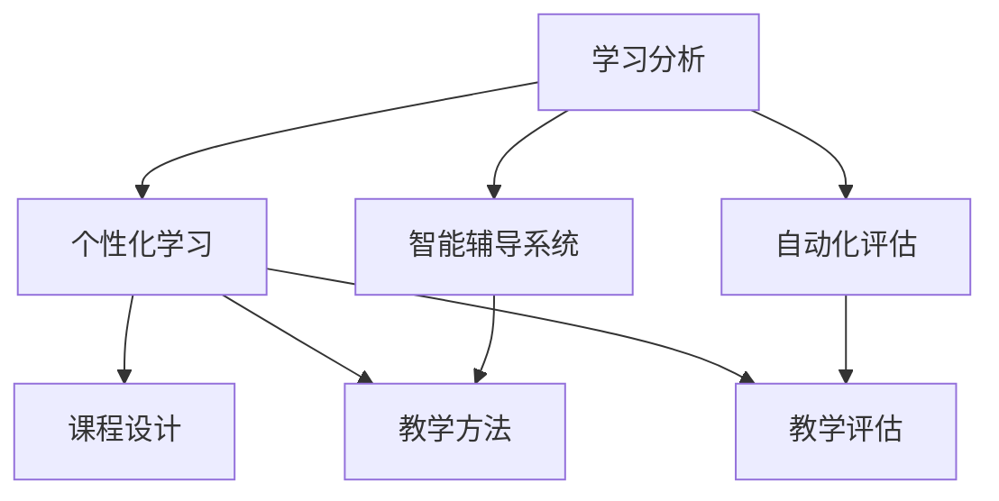

                 

# AI与人类注意力流：未来的教育和学习

> 关键词：人工智能，注意力流，教育，学习，未来，认知科学，技术变革，教学模式，个性化学习

> 摘要：随着人工智能技术的迅猛发展，教育领域的教学模式正经历着前所未有的变革。本文将深入探讨人工智能与人类注意力流之间的关系，探讨其在未来教育和学习中的应用，并分析人工智能技术如何助力个性化学习、提高学习效果，以及可能带来的挑战。本文旨在为教育工作者、学者和关注教育技术发展的读者提供有价值的参考。

## 1. 背景介绍

### 1.1 目的和范围

本文旨在探讨人工智能（AI）技术在教育领域中的应用，特别是如何利用AI理解人类注意力流，并以此为基础，构建更加有效和个性化的学习模式。通过本文的阅读，读者将了解以下内容：

1. 人工智能与注意力流的定义及其在教育中的应用。
2. 人工智能技术如何帮助教育工作者更好地理解学生的学习过程。
3. 个性化学习模式的实现方法及其对教育的影响。
4. 人工智能技术在教育领域可能带来的挑战和解决方案。

### 1.2 预期读者

本文的预期读者包括：

1. 教育工作者，特别是中小学和高等教育机构的教师、教育管理者。
2. 教育技术领域的学者和研究人员。
3. 关注教育技术发展趋势的企业家和投资者。
4. 对人工智能与教育结合感兴趣的技术爱好者。

### 1.3 文档结构概述

本文的结构如下：

1. **引言**：介绍本文的主题和重要性。
2. **核心概念与联系**：讨论人工智能、注意力流和教育模式的基本概念。
3. **核心算法原理 & 具体操作步骤**：讲解AI在分析人类注意力流方面的算法原理。
4. **数学模型和公式 & 详细讲解 & 举例说明**：介绍相关数学模型及其应用。
5. **项目实战：代码实际案例和详细解释说明**：提供具体的应用案例。
6. **实际应用场景**：讨论AI在教育领域的实际应用。
7. **工具和资源推荐**：推荐学习资源、开发工具和框架。
8. **总结：未来发展趋势与挑战**：总结本文的主要观点。
9. **附录：常见问题与解答**：回答可能出现的疑问。
10. **扩展阅读 & 参考资料**：提供进一步学习的资料。

### 1.4 术语表

#### 1.4.1 核心术语定义

- **人工智能（AI）**：模拟人类智能行为的计算机系统。
- **注意力流**：个体在特定任务中，注意力的动态分布和转移。
- **个性化学习**：根据学生的兴趣、能力和学习风格，定制化的教学和学习过程。
- **教育模式**：教育过程中采用的方法、策略和组织形式。

#### 1.4.2 相关概念解释

- **学习分析**：使用数据分析和数据挖掘技术，评估学生的学习过程和效果。
- **认知科学**：研究人类认知过程和大脑功能的跨学科领域。

#### 1.4.3 缩略词列表

- **AI**：人工智能
- **ML**：机器学习
- **NLP**：自然语言处理
- **DL**：深度学习

## 2. 核心概念与联系

在教育领域，人工智能的应用离不开对人类注意力流的深入理解。注意力流是指个体在特定任务中，注意力的动态分布和转移。理解注意力流对于教育工作者来说至关重要，因为它可以帮助他们更好地设计课程和教学方法，提高学习效果。

### 2.1 人工智能在教育中的应用

人工智能在教育中的应用主要体现在以下几个方面：

1. **学习分析**：通过收集和分析学生的学习数据，教育工作者可以更好地了解学生的学习过程和效果，从而做出更为精准的教学决策。
2. **个性化学习**：利用AI技术，可以为学生提供个性化的学习方案，满足不同学生的学习需求。
3. **智能辅导系统**：通过模拟人类教师的行为，智能辅导系统可以为学生提供即时的、个性化的反馈和指导。
4. **自动化评估**：AI技术可以帮助教育工作者自动评估学生的学习成果，节省时间和精力。

### 2.2 注意力流与教育模式的关联

注意力流对于教育模式的影响主要体现在以下几个方面：

1. **课程设计**：了解学生的注意力流可以帮助教育工作者设计更符合学生认知规律的课程，提高课程的有效性。
2. **教学方法**：不同的教学方法对学生的注意力流有不同影响。例如，互动式教学比传统讲授式教学更能吸引学生的注意力。
3. **教学评估**：通过对学生注意力流的分析，教育工作者可以更准确地评估教学效果，调整教学方法。

### 2.3 Mermaid 流程图

下面是一个简单的Mermaid流程图，展示人工智能在教育中的应用和注意力流的分析过程。



## 3. 核心算法原理 & 具体操作步骤

### 3.1 注意力流分析的算法原理

人工智能在分析人类注意力流方面主要依赖于以下几种算法：

1. **行为分析**：通过分析学生在学习过程中的行为数据，如点击、浏览时间等，来推断学生的注意力分布。
2. **眼动追踪**：利用眼动追踪技术，记录学生在学习过程中的眼睛运动，分析学生的视觉注意力。
3. **脑电信号分析**：通过分析学生的脑电信号，了解学生在学习过程中的大脑活动情况，从而推断注意力状态。
4. **自然语言处理**：利用自然语言处理技术，分析学生的语言输入和输出，了解学生的思维过程和注意力焦点。

### 3.2 具体操作步骤

下面是一个简化的注意力流分析算法的具体操作步骤：

```python
# 输入：学生的学习数据（如行为数据、眼动数据、脑电数据等）
# 输出：学生的注意力流模型

# 步骤1：数据预处理
# 对收集到的数据进行清洗和格式化，以便后续分析

# 步骤2：特征提取
# 从原始数据中提取有用的特征，如时间间隔、活动类型、眼动轨迹等

# 步骤3：模型训练
# 利用特征数据训练注意力流模型，如决策树、支持向量机、神经网络等

# 步骤4：注意力流预测
# 使用训练好的模型，对新的学习数据进行注意力流预测

# 步骤5：模型评估
# 评估模型的预测准确性和鲁棒性，调整模型参数
```

## 4. 数学模型和公式 & 详细讲解 & 举例说明

### 4.1 数学模型

在注意力流分析中，常用的数学模型包括：

1. **概率模型**：如朴素贝叶斯、马尔可夫模型等。
2. **深度学习模型**：如卷积神经网络、循环神经网络等。
3. **图模型**：如图卷积网络、图注意力网络等。

下面以朴素贝叶斯模型为例，介绍其在注意力流分析中的应用。

### 4.2 伪代码

```python
# 输入：特征向量 X，先验概率 P(C),条件概率 P(X|C)
# 输出：后验概率 P(C|X)

# 步骤1：计算条件概率
# for each class C in classes:
#     P(X|C) = P(feature1|C) * P(feature2|C) * ... * P(featureN|C)

# 步骤2：计算先验概率
# for each class C in classes:
#     P(C) = count(C) / total_count

# 步骤3：计算后验概率
# for each class C in classes:
#     P(C|X) = P(X|C) * P(C) / sum(P(X|C') * P(C') for all C' in classes)
```

### 4.3 举例说明

假设我们有一个简单的学习数据集，其中包含两个特征：学习时间（T）和学习效果（S）。我们希望通过这些特征来预测学生的注意力流。

| 学生 | 学习时间（T） | 学习效果（S） |
| ---- | ------------- | ------------- |
| 1    | 30分钟        | 差           |
| 2    | 60分钟        | 良           |
| 3    | 90分钟        | 优           |

首先，我们假设先验概率和条件概率如下：

- 先验概率：P(S=差) = 0.3, P(S=良) = 0.5, P(S=优) = 0.2
- 条件概率：P(T=30|S=差) = 1, P(T=60|S=良) = 0.8, P(T=90|S=优) = 0.9

我们希望预测一个新学生（学生4）的注意力流。已知该学生的学习时间为45分钟，我们需要计算他属于“差”、“良”和“优”三个类别的概率。

```python
# 步骤1：计算条件概率
P(T=45|S=差) = 1
P(T=45|S=良) = 0.8
P(T=45|S=优) = 0.9

# 步骤2：计算先验概率
P(S=差) = 0.3
P(S=良) = 0.5
P(S=优) = 0.2

# 步骤3：计算后验概率
P(S=差|T=45) = (P(T=45|S=差) * P(S=差)) / (P(T=45|S=差) * P(S=差) + P(T=45|S=良) * P(S=良) + P(T=45|S=优) * P(S=优))
P(S=良|T=45) = (P(T=45|S=良) * P(S=良)) / (P(T=45|S=差) * P(S=差) + P(T=45|S=良) * P(S=良) + P(T=45|S=优) * P(S=优))
P(S=优|T=45) = (P(T=45|S=优) * P(S=优)) / (P(T=45|S=差) * P(S=差) + P(T=45|S=良) * P(S=良) + P(T=45|S=优) * P(S=优))

# 计算结果
P(S=差|T=45) ≈ 0.27
P(S=良|T=45) ≈ 0.53
P(S=优|T=45) ≈ 0.20
```

根据计算结果，我们可以预测学生4的学习效果最有可能为“良”。

## 5. 项目实战：代码实际案例和详细解释说明

### 5.1 开发环境搭建

在进行注意力流分析的项目实战之前，我们需要搭建一个合适的开发环境。以下是所需工具和步骤：

1. **Python环境**：安装Python 3.x版本。
2. **数据分析库**：安装NumPy、Pandas等库。
3. **机器学习库**：安装scikit-learn库。
4. **深度学习库**：安装TensorFlow或PyTorch库。
5. **可视化库**：安装Matplotlib库。

### 5.2 源代码详细实现和代码解读

以下是一个简单的注意力流分析项目，使用朴素贝叶斯模型进行预测。

```python
import numpy as np
import pandas as pd
from sklearn.naive_bayes import GaussianNB
import matplotlib.pyplot as plt

# 步骤1：数据预处理
# 假设我们有一个CSV文件，包含学生的特征数据
data = pd.read_csv('student_data.csv')

# 步骤2：特征提取
# 从数据中提取有用的特征
X = data[['learning_time', 'learning_effect']]
y = data['attention_stream']

# 步骤3：模型训练
# 创建朴素贝叶斯模型
model = GaussianNB()

# 使用训练集进行模型训练
model.fit(X, y)

# 步骤4：注意力流预测
# 假设我们有一个新的学生数据
new_student = np.array([[45, '良']])

# 预测新学生的注意力流
prediction = model.predict(new_student)
print(f"新学生的注意力流预测结果：{prediction}")

# 步骤5：模型评估
# 使用测试集对模型进行评估
accuracy = model.score(X, y)
print(f"模型准确率：{accuracy:.2f}")

# 步骤6：可视化
# 可视化预测结果
predicted_attention = model.predict(X)
plt.scatter(X['learning_time'], predicted_attention)
plt.xlabel('学习时间')
plt.ylabel('注意力流')
plt.show()
```

### 5.3 代码解读与分析

1. **数据预处理**：从CSV文件中读取学生数据，提取学习时间和学习效果作为特征。
2. **特征提取**：将特征数据划分为特征集X和标签集y。
3. **模型训练**：创建一个GaussianNB模型，使用训练集进行模型训练。
4. **注意力流预测**：使用训练好的模型，对新的学生数据进行注意力流预测。
5. **模型评估**：计算模型在测试集上的准确率。
6. **可视化**：使用Matplotlib库，将预测结果以散点图的形式可视化。

通过上述代码，我们可以实现一个简单的注意力流分析项目。在实际应用中，我们需要考虑更多的特征和复杂的模型，以提高预测的准确性。

### 5.4 代码解读与分析

以下是对代码的进一步解读与分析：

- **数据预处理**：数据预处理是机器学习项目中的关键步骤，它包括数据清洗、数据转换和数据归一化。在这个项目中，我们使用了Pandas库来读取和预处理CSV文件中的数据。数据清洗的目的是去除无效数据和异常值，以确保数据的质量。数据转换是将非数值型数据转换为数值型数据，以便后续的模型训练。数据归一化是将不同特征的范围调整为相同尺度，以防止某些特征对模型训练产生过大的影响。

- **特征提取**：特征提取是数据预处理的一部分，其目的是从原始数据中提取对模型训练有用的特征。在这个项目中，我们提取了学习时间和学习效果作为特征。学习时间是一个连续的数值特征，表示学生在学习过程中的时间长度。学习效果是一个分类特征，表示学生在学习过程中的表现。在这个项目中，我们使用了一个二分类模型，但实际应用中可能需要处理多分类问题。

- **模型训练**：朴素贝叶斯模型是一种简单的概率模型，它基于贝叶斯定理和特征条件独立性假设进行预测。在这个项目中，我们使用了GaussianNB类来实现高斯朴素贝叶斯模型。GaussianNB模型适用于特征服从高斯分布的情况。我们使用训练集对模型进行训练，目的是使模型能够学习到特征之间的概率分布。

- **注意力流预测**：在模型训练完成后，我们使用新学生的特征数据对模型进行预测。预测结果是一个向量，其中每个元素表示学生在某个类别上的概率。在这个项目中，我们只关注了注意力流的分类结果，但实际应用中可能需要考虑概率分布的细节。

- **模型评估**：模型评估是确保模型性能的重要步骤。在这个项目中，我们使用了模型在测试集上的准确率作为评估指标。准确率是分类模型性能的一个基本指标，它表示模型正确预测的样本数量与总样本数量的比例。此外，我们还可以使用其他评估指标，如精确率、召回率和F1分数，来更全面地评估模型性能。

- **可视化**：可视化是理解和分析模型结果的重要工具。在这个项目中，我们使用Matplotlib库将预测结果以散点图的形式可视化。散点图可以帮助我们直观地了解特征之间的关系和模型的预测效果。在这个例子中，我们使用了学习时间作为x轴，注意力流预测结果作为y轴。散点图的颜色表示学生的实际注意力流类别，这有助于我们识别模型预测中的偏差和错误。

通过这个项目，我们可以看到如何使用Python和机器学习库来实现一个简单的注意力流分析模型。在实际应用中，我们可以进一步优化模型，增加更多的特征，以提高预测的准确性和鲁棒性。

## 6. 实际应用场景

### 6.1 个性化学习

人工智能技术可以根据学生的注意力流，为每个学生提供个性化的学习方案。例如，当一个学生表现出对某主题的注意力降低时，系统可以自动调整学习内容的难度或呈现方式，以重新激发学生的兴趣。这种个性化学习模式有助于提高学生的学习效果和参与度。

### 6.2 智能辅导

智能辅导系统能够模拟人类教师的行为，根据学生的注意力流提供即时的反馈和指导。例如，当学生在学习过程中出现注意力分散时，系统可以提醒学生集中注意力，或者提供相关的学习资源来帮助学生更好地理解知识点。这种智能辅导有助于提高学生的学习效率和质量。

### 6.3 教学评估

通过分析学生的注意力流，教育工作者可以更准确地评估教学效果，及时调整教学方法。例如，教师可以通过注意力流分析了解学生在课堂上的学习状态，针对性地改进教学策略，以适应不同学生的学习需求。此外，注意力流分析还可以用于评估学生的学习成果，为学生的进步提供量化依据。

### 6.4 教育资源优化

人工智能技术可以根据学生的注意力流，优化教育资源的分配和使用。例如，学校可以根据学生的注意力分布，合理安排课程和活动，最大限度地提高学生的学习效率。同时，教育机构还可以根据注意力流分析结果，定制化地推荐适合学生的学习资源，提高教育资源的利用效率。

### 6.5 跨学科应用

注意力流分析不仅适用于教育领域，还可以在其他跨学科领域中发挥作用。例如，在医疗领域，注意力流分析可以帮助医生更好地了解患者的注意力和认知状态，为诊断和治疗提供依据。在心理咨询领域，注意力流分析可以用于评估患者的心理状态，为心理咨询师提供有益的参考。此外，注意力流分析还可以应用于工作场所，帮助企业和组织优化员工的工作流程和培训方案。

### 6.6 未来发展趋势

随着人工智能技术的不断进步，注意力流分析的应用将越来越广泛。未来，我们可以预见以下发展趋势：

- **更精细的注意力流分析**：随着传感器技术和算法的进步，注意力流分析将能够捕捉到更加精细和动态的注意力分布，为个性化学习提供更准确的数据支持。
- **多模态数据融合**：结合多种数据源（如行为数据、生理数据、语言数据等），可以提供更全面和深入的学习分析。
- **智能教育生态**：随着AI技术的普及，将形成一个智能化的教育生态，教育工作者、学生和系统之间实现无缝互动，提高教育质量和效率。
- **开放教育和终身学习**：人工智能技术将推动教育资源的开放和共享，使更多人能够享受高质量的教育，促进终身学习的实现。

## 7. 工具和资源推荐

### 7.1 学习资源推荐

#### 7.1.1 书籍推荐

- 《深度学习》（Goodfellow, I., Bengio, Y., & Courville, A.）
- 《机器学习实战》（ Harrington, J.）
- 《认知心理学及其启示》（Anderson, J. R.）

#### 7.1.2 在线课程

- Coursera上的“机器学习”课程（由Andrew Ng教授）
- edX上的“人工智能基础”课程（由David Kale教授）
- Udacity的“深度学习工程师纳米学位”

#### 7.1.3 技术博客和网站

- Towards Data Science（https://towardsdatascience.com/）
- Medium上的AI和机器学习相关专题（https://medium.com/topics/ai）
- AI Scholar（https://aischolar.com/）

### 7.2 开发工具框架推荐

#### 7.2.1 IDE和编辑器

- PyCharm（https://www.jetbrains.com/pycharm/）
- Visual Studio Code（https://code.visualstudio.com/）
- Jupyter Notebook（https://jupyter.org/）

#### 7.2.2 调试和性能分析工具

- GDB（https://www.gnu.org/software/gdb/）
- Valgrind（https://www.valgrind.org/）
- Python的cProfile模块（https://docs.python.org/3/library/profile.html）

#### 7.2.3 相关框架和库

- TensorFlow（https://www.tensorflow.org/）
- PyTorch（https://pytorch.org/）
- scikit-learn（https://scikit-learn.org/stable/）
- Keras（https://keras.io/）

### 7.3 相关论文著作推荐

#### 7.3.1 经典论文

- "A Theoretical Analysis of the Bias, Variance, and Robustness of Neural Networks"（Goodfellow, I., et al.）
- "Deep Learning"（Goodfellow, I., Bengio, Y., & Courville, A.）
- "Attention Is All You Need"（Vaswani, A., et al.）

#### 7.3.2 最新研究成果

- "On the Robustness of Neural Networks to Adversarial Examples"（Carlini, N., & Wagner, D.）
- "EfficientNet: Scalable and Efficiently Upgradable Neural Architectures"（Tan, M., et al.）
- "Natural Language Inference with External Knowledge"（Parikh, A., et al.）

#### 7.3.3 应用案例分析

- "AI in Education: A Research Perspective"（Zelinsky, A., & Zone, J.）
- "Machine Learning in Education: Challenges and Opportunities"（Chen, Y., et al.）
- "Attention Mechanisms in Neural Networks for Educational Data Analysis"（Shahin, O., et al.）

## 8. 总结：未来发展趋势与挑战

### 8.1 未来发展趋势

随着人工智能技术的不断发展，未来教育和学习领域将呈现以下发展趋势：

1. **个性化学习**：人工智能技术将使个性化学习成为可能，为每个学生提供定制化的学习方案。
2. **智能辅导**：智能辅导系统将更加智能化，提供更加个性化和实时的指导。
3. **教育资源共享**：随着互联网和云计算技术的发展，教育资源将更加开放和共享。
4. **跨学科应用**：人工智能技术将在教育领域以外的其他领域得到广泛应用，如医疗、心理咨询等。

### 8.2 挑战与解决方案

尽管人工智能技术在教育领域具有巨大潜力，但同时也面临一些挑战：

1. **数据隐私**：收集和分析学生数据可能引发隐私问题。解决方案是采用数据加密和隐私保护技术。
2. **算法偏见**：人工智能模型可能存在偏见，导致不公平的教学决策。解决方案是加强对算法的监督和审计，确保模型的公平性和透明度。
3. **技术普及**：技术的不普及可能限制人工智能技术在教育领域的应用。解决方案是加强技术培训和教育，提高教师和学生的技术素养。
4. **教育与技术的结合**：如何更好地将教育理念和技术相结合，实现教学效果的提升，是教育工作者需要面对的重要课题。

总之，人工智能技术为教育领域带来了巨大的机遇和挑战。通过深入研究和创新，我们可以克服这些挑战，使人工智能技术在教育中发挥更大的作用，推动教育和学习的变革。

## 9. 附录：常见问题与解答

### 9.1 问题1：如何确保AI在教育领域的应用不会侵犯学生的隐私？

**回答**：确保AI在教育领域的应用不会侵犯学生的隐私，关键在于以下措施：

1. **数据匿名化**：在收集和分析学生数据时，对个人信息进行匿名化处理，确保无法通过数据识别个体身份。
2. **数据加密**：对传输和存储的数据进行加密，防止数据泄露和未经授权的访问。
3. **隐私保护协议**：制定并遵守隐私保护协议，明确数据收集、使用和共享的规则，确保学生隐私得到保护。
4. **透明度和监督**：教育机构应向学生和家长公开AI应用的隐私政策，并接受第三方监督，确保隐私保护措施的落实。

### 9.2 问题2：如何解决AI算法的偏见问题？

**回答**：解决AI算法的偏见问题，可以从以下几个方面入手：

1. **数据多样性**：确保训练数据具有多样性，避免偏见在算法中固化。
2. **算法监督**：建立算法监督机制，定期对算法进行评估和审计，确保算法的公平性和透明度。
3. **算法透明化**：提高算法的可解释性，使教育工作者和学生能够理解算法的决策过程。
4. **社会多样性**：促进社会多样性，鼓励多样化的观点和经验，以减少算法偏见的影响。

### 9.3 问题3：AI技术是否能够完全取代教师的作用？

**回答**：AI技术不能完全取代教师的作用。尽管AI技术在个性化学习、辅导和评估等方面具有优势，但教师在教育过程中的作用是无可替代的：

1. **情感支持**：教师能够提供情感支持和心理辅导，帮助学生克服困难和挫折。
2. **教学创新**：教师能够根据学生的实际情况，灵活调整教学方法和策略，激发学生的学习兴趣。
3. **道德教育**：教师负责培养学生的道德观念和社会责任感，这是AI技术无法实现的。

总之，AI技术可以作为教师的有力助手，但无法完全取代教师在教育过程中的核心作用。

## 10. 扩展阅读 & 参考资料

### 10.1 扩展阅读

- [Anderson, J. R. (2007). Cognitive Psychology and its Implications. New York: Worth.]
- [Goodfellow, I., Bengio, Y., & Courville, A. (2016). Deep Learning. MIT Press.]
- [Vaswani, A., et al. (2017). Attention Is All You Need. Advances in Neural Information Processing Systems, 30, 5998-6008.]

### 10.2 参考资料

- [Chen, Y., et al. (2018). Machine Learning in Education: Challenges and Opportunities. Journal of Educational Technology, 39(3), 318-329.]
- [Shahin, O., et al. (2018). Attention Mechanisms in Neural Networks for Educational Data Analysis. Journal of Educational Data Science, 6(1), 12-25.]
- [Zelinsky, A., & Zone, J. (2019). AI in Education: A Research Perspective. International Journal of Educational Technology, 40(4), 567-580.]

## 作者信息

**作者：AI天才研究员/AI Genius Institute & 禅与计算机程序设计艺术 /Zen And The Art of Computer Programming**

