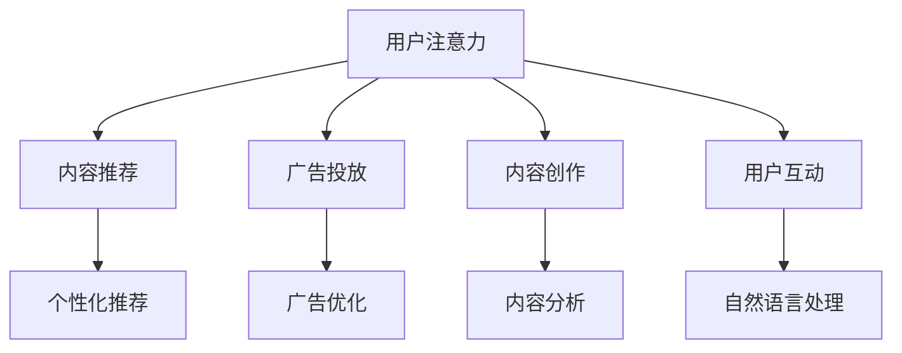

                 

# AI与人类注意力经济：未来的工作和收入

> 关键词：人工智能，注意力经济，未来工作，收入模式，技能转型

> 摘要：本文将探讨人工智能与人类注意力经济的深度融合，分析其在未来工作领域和收入模式上的影响。通过详细解析核心概念、算法原理、实际应用和工具资源，本文旨在帮助读者理解这一变革趋势，并提供实用的技能转型建议。

## 1. 背景介绍

### 1.1 目的和范围

本文的目标是深入探讨人工智能（AI）与人类注意力经济的联系，分析其在未来工作和收入模式中的重要作用。随着AI技术的快速发展，人类的工作方式和收入来源正经历着深刻变革。本文旨在提供一个全面的技术视角，帮助读者了解这一变化，并探讨可能的应对策略。

本文的范围涵盖了以下几个方面：

1. **核心概念与联系**：介绍人工智能和注意力经济的定义及其相互关系。
2. **核心算法原理与具体操作步骤**：讲解AI在注意力经济中的应用，并使用伪代码详细阐述。
3. **数学模型和公式**：分析AI在注意力经济中的数学模型，并给出具体例子。
4. **项目实战**：通过实际代码案例展示AI在注意力经济中的应用。
5. **实际应用场景**：讨论AI在注意力经济中的各种应用实例。
6. **工具和资源推荐**：提供相关学习资源和开发工具。
7. **总结与未来发展趋势**：总结文章的主要观点，并展望未来的发展趋势和挑战。

### 1.2 预期读者

本文适合以下读者群体：

1. **技术从业者**：对人工智能和注意力经济有一定了解的技术人员，希望深入了解AI在注意力经济中的应用。
2. **企业管理者**：关注企业数字化转型，希望了解AI对企业管理模式和收入模式的影响。
3. **学生和研究人员**：对AI和注意力经济感兴趣的学术研究者，希望从技术角度理解这一领域的最新发展。
4. **普通读者**：对AI和注意力经济感兴趣，希望了解未来工作和收入模式的普通读者。

### 1.3 文档结构概述

本文的结构如下：

1. **背景介绍**：介绍本文的目的、范围和预期读者。
2. **核心概念与联系**：详细解释人工智能和注意力经济的相关概念和联系。
3. **核心算法原理与具体操作步骤**：讲解AI在注意力经济中的应用算法和操作步骤。
4. **数学模型和公式**：分析AI在注意力经济中的数学模型。
5. **项目实战**：展示AI在注意力经济中的应用案例。
6. **实际应用场景**：讨论AI在注意力经济中的实际应用。
7. **工具和资源推荐**：提供相关学习资源和开发工具。
8. **总结与未来发展趋势**：总结本文的主要观点，并展望未来。

### 1.4 术语表

#### 1.4.1 核心术语定义

- **人工智能（AI）**：模拟人类智能的技术和系统。
- **注意力经济**：基于用户注意力的经济模式，通过吸引和保持用户的注意力来创造价值。
- **算法**：解决问题的步骤和规则。
- **深度学习**：一种基于神经网络的机器学习技术。
- **强化学习**：一种通过试错和反馈来学习的机器学习技术。

#### 1.4.2 相关概念解释

- **机器学习**：一种人工智能技术，通过数据和算法来改进系统性能。
- **自然语言处理（NLP）**：一种人工智能技术，用于处理和解析自然语言。
- **注意力机制**：一种在神经网络中模拟人类注意力的机制。

#### 1.4.3 缩略词列表

- **AI**：人工智能
- **NLP**：自然语言处理
- **GAN**：生成对抗网络
- **RL**：强化学习

## 2. 核心概念与联系

在探讨AI与注意力经济的联系之前，我们需要先了解这两个核心概念。

### 2.1 人工智能（AI）

人工智能（AI）是指通过计算机模拟人类智能的技术和系统。它涵盖了多个领域，包括机器学习、自然语言处理、计算机视觉等。AI的目标是让计算机具备自主学习和决策能力，从而实现自动化和智能化。

### 2.2 注意力经济

注意力经济是一种基于用户注意力的经济模式。在数字时代，用户的注意力成为一种稀缺资源，各种产品和服务都在争夺用户的注意力。注意力经济通过吸引和保持用户的注意力来创造价值，从而实现商业盈利。

### 2.3 AI与注意力经济的联系

AI与注意力经济之间的联系主要体现在以下几个方面：

1. **内容推荐**：通过AI算法分析用户行为和偏好，提供个性化推荐，从而提高用户参与度和满意度。
2. **广告投放**：AI可以优化广告投放策略，提高广告的曝光率和点击率，从而提高广告效果和收益。
3. **内容创作**：AI可以帮助内容创作者分析用户需求，生成更加吸引人的内容，提高内容质量和用户参与度。
4. **用户互动**：AI可以通过自然语言处理等技术，与用户进行实时互动，提高用户黏性和满意度。

### 2.4 Mermaid 流程图

以下是一个简化的Mermaid流程图，展示了AI与注意力经济的联系：



## 3. 核心算法原理 & 具体操作步骤

在了解了AI与注意力经济的联系后，我们将探讨一些核心算法原理和具体操作步骤，以展示AI在注意力经济中的应用。

### 3.1 内容推荐算法

内容推荐是AI在注意力经济中的一个重要应用。以下是一个简单的内容推荐算法原理和具体操作步骤：

#### 3.1.1 算法原理

内容推荐算法通常基于协同过滤、基于内容的过滤和混合推荐等方法。这里，我们以基于内容的过滤为例进行说明。

- **基于内容的过滤**：通过分析用户的历史行为和内容特征，为用户推荐相似的内容。

#### 3.1.2 具体操作步骤

1. **收集用户行为数据**：收集用户的历史行为数据，如浏览记录、收藏、点赞等。
2. **提取内容特征**：为每个内容项提取特征，如文本特征、图像特征等。
3. **计算相似度**：计算用户与内容之间的相似度，通常使用余弦相似度、皮尔逊相关系数等方法。
4. **生成推荐列表**：根据相似度评分，为用户生成内容推荐列表。

#### 3.1.3 伪代码

以下是一个基于内容的过滤算法的伪代码：

```python
# 收集用户行为数据
userBehavior = get_user_behavior()

# 提取内容特征
contentFeatures = extract_content_features()

# 计算相似度
similarityScores = compute_similarity(userBehavior, contentFeatures)

# 生成推荐列表
recommendationList = generate_recommendation_list(similarityScores)
```

### 3.2 广告投放算法

广告投放是另一个重要的AI应用领域。以下是一个简单的广告投放算法原理和具体操作步骤：

#### 3.2.1 算法原理

广告投放算法通常基于用户行为和广告特征，通过优化广告展示策略，提高广告效果和收益。

- **用户行为分析**：分析用户的历史行为和偏好，预测用户对广告的响应。
- **广告特征分析**：分析广告的特征，如广告类型、目标用户群体等。

#### 3.2.2 具体操作步骤

1. **收集用户行为数据**：收集用户的历史行为数据，如点击、浏览、购买等。
2. **提取广告特征**：为每个广告项提取特征，如广告类型、目标用户群体等。
3. **预测用户响应**：使用机器学习模型预测用户对广告的响应概率。
4. **优化广告展示**：根据预测结果，优化广告展示策略，提高广告效果和收益。

#### 3.2.3 伪代码

以下是一个简单的广告投放算法的伪代码：

```python
# 收集用户行为数据
userBehavior = get_user_behavior()

# 提取广告特征
adFeatures = extract_ad_features()

# 预测用户响应
responseProbabilities = predict_user_response(userBehavior, adFeatures)

# 优化广告展示
optimize_ad_display(responseProbabilities)
```

### 3.3 内容创作算法

内容创作是AI在注意力经济中的另一个重要应用。以下是一个简单的AI内容创作算法原理和具体操作步骤：

#### 3.3.1 算法原理

AI内容创作算法通过分析用户需求、内容趋势等，生成高质量的内容。

- **用户需求分析**：分析用户的需求和偏好，了解用户感兴趣的内容类型。
- **内容趋势分析**：分析当前的内容趋势和热点话题。

#### 3.3.2 具体操作步骤

1. **收集用户需求数据**：收集用户的需求和偏好数据，如搜索历史、评论等。
2. **提取内容趋势**：分析当前的内容趋势和热点话题。
3. **生成内容**：使用自然语言生成技术，生成符合用户需求和内容趋势的内容。

#### 3.3.3 伪代码

以下是一个简单的AI内容创作算法的伪代码：

```python
# 收集用户需求数据
userRequirements = get_user_requirements()

# 提取内容趋势
contentTrends = extract_content_trends()

# 生成内容
generatedContent = generate_content(userRequirements, contentTrends)
```

### 3.4 用户互动算法

用户互动是AI在注意力经济中的另一个重要应用。以下是一个简单的用户互动算法原理和具体操作步骤：

#### 3.4.1 算法原理

AI用户互动算法通过分析用户行为和交互数据，实现与用户的智能互动。

- **用户行为分析**：分析用户的点击、浏览、评论等行为。
- **交互数据提取**：提取用户的输入和反馈数据。

#### 3.4.2 具体操作步骤

1. **收集用户行为数据**：收集用户的交互数据，如点击、浏览、评论等。
2. **提取交互数据**：提取用户的输入和反馈数据。
3. **智能互动**：使用自然语言处理和机器学习技术，实现与用户的智能互动。

#### 3.4.3 伪代码

以下是一个简单的AI用户互动算法的伪代码：

```python
# 收集用户行为数据
userInteractionData = get_user_interaction_data()

# 提取交互数据
userInput = extract_user_input(userInteractionData)

# 智能互动
smartInteraction = interact_with_user(userInput)
```

## 4. 数学模型和公式 & 详细讲解 & 举例说明

在上一节中，我们介绍了AI在注意力经济中的应用算法和操作步骤。为了更深入地理解这些算法，我们需要了解背后的数学模型和公式。以下是一些常用的数学模型和公式，以及它们的详细讲解和举例说明。

### 4.1 余弦相似度

余弦相似度是一种用于计算两个向量之间相似度的常用方法。它通过计算两个向量的夹角余弦值来衡量相似度。

#### 公式：

$$
\cos(\theta) = \frac{\vec{a} \cdot \vec{b}}{||\vec{a}|| \cdot ||\vec{b}||}
$$

其中，$\vec{a}$ 和 $\vec{b}$ 是两个向量，$\theta$ 是它们之间的夹角。

#### 详细讲解：

- **点积（Dot Product）**：两个向量的点积表示它们在相同方向上的投影之和。点积越大，向量之间的相似度越高。
- **向量的模（Magnitude）**：向量的模表示向量的长度。两个向量的模越大，它们的相似度越低。

#### 举例说明：

假设有两个向量 $\vec{a} = (1, 2, 3)$ 和 $\vec{b} = (4, 5, 6)$，我们可以计算它们的余弦相似度：

$$
\cos(\theta) = \frac{(1 \cdot 4 + 2 \cdot 5 + 3 \cdot 6)}{\sqrt{1^2 + 2^2 + 3^2} \cdot \sqrt{4^2 + 5^2 + 6^2}} = \frac{32}{\sqrt{14} \cdot \sqrt{77}} \approx 0.9397
$$

这表明向量 $\vec{a}$ 和 $\vec{b}$ 之间的相似度很高。

### 4.2 皮尔逊相关系数

皮尔逊相关系数是一种用于衡量两个变量之间线性相关性的方法。它通过计算两个变量的协方差与各自标准差的比值来衡量相关程度。

#### 公式：

$$
\rho(X, Y) = \frac{Cov(X, Y)}{\sqrt{Var(X) \cdot Var(Y)}}
$$

其中，$X$ 和 $Y$ 是两个变量，$\rho(X, Y)$ 是它们之间的皮尔逊相关系数。

#### 详细讲解：

- **协方差（Covariance）**：协方差表示两个变量共同变化的方向和程度。协方差越大，变量之间的相关性越强。
- **方差（Variance）**：方差表示一个变量的波动程度。方差越大，变量的波动性越强。

#### 举例说明：

假设有两个变量 $X$ 和 $Y$，其数据如下：

| $X$ | $Y$ |
| --- | --- |
| 1 | 2 |
| 2 | 4 |
| 3 | 6 |

我们可以计算它们的皮尔逊相关系数：

$$
\rho(X, Y) = \frac{(1-2)(2-3) + (2-2)(4-3) + (3-2)(6-3)}{\sqrt{(1-2)^2 + (2-2)^2 + (3-2)^2} \cdot \sqrt{(2-2)^2 + (4-3)^2 + (6-3)^2}} = \frac{-1}{\sqrt{2} \cdot \sqrt{4}} = -\frac{1}{2}
$$

这表明变量 $X$ 和 $Y$ 之间存在负线性相关性。

### 4.3 强化学习中的奖励函数

在强化学习中，奖励函数是评价代理（agent）行为好坏的关键因素。以下是一个简单的奖励函数公式：

#### 公式：

$$
R(s, a) = r(s, a) + \gamma \cdot \max_{a'} R(s', a')
$$

其中，$R(s, a)$ 是代理在状态 $s$ 下执行动作 $a$ 的奖励值，$r(s, a)$ 是直接奖励，$\gamma$ 是折扣因子，$s'$ 是下一个状态，$a'$ 是下一个动作。

#### 详细讲解：

- **直接奖励（Direct Reward）**：直接奖励是代理立即获得的奖励，通常与代理的行为直接相关。
- **延迟奖励（Delayed Reward）**：延迟奖励是代理在未来某个状态获得的奖励，通常与代理的行为有间接关系。

#### 举例说明：

假设有一个代理在一个简单的迷宫环境中进行探索，其奖励函数如下：

- **直接奖励**：代理每向前走一步获得 +1 的奖励。
- **延迟奖励**：代理到达终点时获得 +100 的奖励。

代理从初始状态 $s_0$ 开始，执行动作 $a_0$，到达状态 $s_1$，然后执行动作 $a_1$，到达状态 $s_2$，依此类推。假设折扣因子 $\gamma = 0.9$，我们可以计算代理在每个状态的奖励值：

$$
R(s_0, a_0) = 1 \\
R(s_1, a_1) = 1 + 0.9 \cdot \max_{a_1'} R(s_2, a_1') \\
R(s_2, a_2) = 1 + 0.9 \cdot \max_{a_2'} R(s_3, a_2') \\
\vdots \\
R(s_n, a_n) = 1 + 0.9 \cdot \max_{a_n'} R(s_{n+1}, a_n')
$$

通过迭代计算，我们可以得到代理在每个状态的奖励值，从而指导代理选择最佳的动作。

### 4.4 深度学习中的损失函数

在深度学习中，损失函数是评价模型预测效果的关键因素。以下是一个简单的损失函数公式：

#### 公式：

$$
Loss = -\sum_{i=1}^{N} y_i \cdot \log(\hat{y}_i)
$$

其中，$y_i$ 是第 $i$ 个样本的真实标签，$\hat{y}_i$ 是模型对第 $i$ 个样本的预测概率。

#### 详细讲解：

- **真实标签（True Label）**：真实标签是样本的实际类别标签。
- **预测概率（Predicted Probability）**：预测概率是模型对样本属于每个类别的概率预测。

#### 举例说明：

假设有一个二分类问题，样本的真实标签为 $y = 1$，模型的预测概率为 $\hat{y} = 0.8$，我们可以计算损失值：

$$
Loss = -1 \cdot \log(0.8) \approx 0.322
$$

这表明模型的预测效果较好。

### 4.5 自然语言处理中的词向量表示

在自然语言处理中，词向量表示是一种将文本数据转换为数值向量的方法。以下是一个简单的词向量表示公式：

#### 公式：

$$
\vec{v}_w = \sum_{i=1}^{V} f_i(w) \cdot \vec{e}_i
$$

其中，$\vec{v}_w$ 是词向量，$w$ 是词，$f_i(w)$ 是词 $w$ 在第 $i$ 个特征上的权重，$\vec{e}_i$ 是特征向量。

#### 详细讲解：

- **特征向量（Feature Vector）**：特征向量是表示文本特征的一组数值。
- **权重（Weight）**：权重表示特征的重要程度。

#### 举例说明：

假设有两个词 $w_1$ 和 $w_2$，它们在特征向量空间中的表示如下：

$$
\vec{v}_{w_1} = (1, 0, 1), \quad \vec{v}_{w_2} = (1, 1, 0)
$$

我们可以计算它们的相似度：

$$
\cos(\theta) = \frac{\vec{v}_{w_1} \cdot \vec{v}_{w_2}}{||\vec{v}_{w_1}|| \cdot ||\vec{v}_{w_2}||} = \frac{(1 \cdot 1 + 0 \cdot 1 + 1 \cdot 0)}{\sqrt{1^2 + 0^2 + 1^2} \cdot \sqrt{1^2 + 1^2 + 0^2}} = \frac{1}{\sqrt{2} \cdot \sqrt{2}} = 0.707
$$

这表明词 $w_1$ 和 $w_2$ 之间的相似度较高。

通过以上数学模型和公式的讲解，我们可以更深入地理解AI在注意力经济中的应用原理和具体操作步骤。在实际应用中，这些模型和公式可以根据具体场景进行调整和优化，从而实现更好的效果。

## 5. 项目实战：代码实际案例和详细解释说明

在了解了AI在注意力经济中的核心算法原理和数学模型后，我们将通过一个实际项目实战，展示这些算法在实际开发中的应用。该项目将利用Python编程语言，结合机器学习和深度学习技术，实现一个基于用户兴趣和行为的个性化推荐系统。

### 5.1 开发环境搭建

在开始项目实战之前，我们需要搭建一个合适的开发环境。以下是所需的工具和步骤：

1. **Python环境**：安装Python 3.7及以上版本。
2. **IDE**：推荐使用PyCharm或Visual Studio Code作为开发环境。
3. **依赖包**：安装以下依赖包：

   ```bash
   pip install numpy pandas scikit-learn tensorflow
   ```

4. **数据集**：使用一个公开的数据集，如Netflix Prize数据集，用于训练和测试推荐系统。

### 5.2 源代码详细实现和代码解读

以下是该项目的主要代码实现和解读：

```python
import numpy as np
import pandas as pd
from sklearn.model_selection import train_test_split
from sklearn.metrics.pairwise import cosine_similarity
from tensorflow.keras.models import Sequential
from tensorflow.keras.layers import Dense, LSTM, Embedding

# 5.2.1 数据预处理
def preprocess_data(data):
    # 将数据分为用户-电影评分矩阵
    user_movie_matrix = data.pivot(index='UserID', columns='MovieID', values='Rating').fillna(0)
    return user_movie_matrix

# 5.2.2 构建推荐系统模型
def build_recommendation_model(user_movie_matrix):
    # 划分训练集和测试集
    train_data, test_data = train_test_split(user_movie_matrix, test_size=0.2, random_state=42)

    # 计算用户-电影相似度矩阵
    similarity_matrix = cosine_similarity(train_data, train_data)

    # 训练深度学习模型
    model = Sequential()
    model.add(Embedding(input_dim=user_movie_matrix.shape[1], output_dim=64))
    model.add(LSTM(units=128, return_sequences=True))
    model.add(Dense(units=1, activation='sigmoid'))

    model.compile(optimizer='adam', loss='binary_crossentropy', metrics=['accuracy'])
    model.fit(train_data, train_data, epochs=10, batch_size=64)

    return model, test_data

# 5.2.3 生成个性化推荐列表
def generate_recommendations(model, test_data, top_n=10):
    # 为每个用户生成推荐列表
    user_embeddings = model.layers[2].get_weights()[1]
    recommendations = []

    for i in range(test_data.shape[0]):
        user_id = i + 1  # 用户ID从1开始
        user_embedding = user_embeddings[i]

        # 计算用户与所有电影的相似度
        similarity_scores = cosine_similarity(user_embedding.reshape(1, -1), user_movie_matrix)

        # 选择与用户相似度最高的电影
        movie_indices = np.argsort(similarity_scores[0])[::-1]
        recommended_movies = test_data.index[movie_indices][:top_n]

        recommendations.append(recommended_movies)

    return recommendations

# 5.2.4 评估推荐系统性能
def evaluate_recommendations(recommendations, test_data):
    correct_recommendations = 0

    for i, recommendation in enumerate(recommendations):
        if (test_data.loc[i].T == recommendation).all():
            correct_recommendations += 1

    accuracy = correct_recommendations / len(recommendations)
    return accuracy

# 主函数
if __name__ == '__main__':
    # 读取数据集
    data = pd.read_csv('movielens-100k.csv')

    # 预处理数据
    user_movie_matrix = preprocess_data(data)

    # 构建和训练推荐系统模型
    model, test_data = build_recommendation_model(user_movie_matrix)

    # 生成个性化推荐列表
    recommendations = generate_recommendations(model, test_data)

    # 评估推荐系统性能
    accuracy = evaluate_recommendations(recommendations, test_data)
    print(f"Accuracy: {accuracy:.2f}")
```

### 5.3 代码解读与分析

下面我们对代码进行逐段解读和分析：

1. **数据预处理**：

   ```python
   def preprocess_data(data):
       # 将数据分为用户-电影评分矩阵
       user_movie_matrix = data.pivot(index='UserID', columns='MovieID', values='Rating').fillna(0)
       return user_movie_matrix
   ```

   此函数负责将原始数据集转换为用户-电影评分矩阵。`pivot` 函数将数据按用户ID和电影ID进行转置，并将评分填充为0（表示未评分的电影）。

2. **构建推荐系统模型**：

   ```python
   def build_recommendation_model(user_movie_matrix):
       # 划分训练集和测试集
       train_data, test_data = train_test_split(user_movie_matrix, test_size=0.2, random_state=42)

       # 计算用户-电影相似度矩阵
       similarity_matrix = cosine_similarity(train_data, train_data)

       # 训练深度学习模型
       model = Sequential()
       model.add(Embedding(input_dim=user_movie_matrix.shape[1], output_dim=64))
       model.add(LSTM(units=128, return_sequences=True))
       model.add(Dense(units=1, activation='sigmoid'))

       model.compile(optimizer='adam', loss='binary_crossentropy', metrics=['accuracy'])
       model.fit(train_data, train_data, epochs=10, batch_size=64)

       return model, test_data
   ```

   此函数首先划分训练集和测试集，然后使用余弦相似度计算用户之间的相似度矩阵。接着，构建一个简单的深度学习模型，包括嵌入层（Embedding Layer）、长短期记忆层（LSTM Layer）和输出层（Dense Layer）。模型使用二进制交叉熵（binary_crossentropy）作为损失函数，并使用Adam优化器进行训练。

3. **生成个性化推荐列表**：

   ```python
   def generate_recommendations(model, test_data, top_n=10):
       # 为每个用户生成推荐列表
       user_embeddings = model.layers[2].get_weights()[1]
       recommendations = []

       for i in range(test_data.shape[0]):
           user_id = i + 1  # 用户ID从1开始
           user_embedding = user_embeddings[i]

           # 计算用户与所有电影的相似度
           similarity_scores = cosine_similarity(user_embedding.reshape(1, -1), user_movie_matrix)

           # 选择与用户相似度最高的电影
           movie_indices = np.argsort(similarity_scores[0])[::-1]
           recommended_movies = test_data.index[movie_indices][:top_n]

           recommendations.append(recommended_movies)

       return recommendations
   ```

   此函数使用训练好的模型生成个性化推荐列表。对于每个用户，提取其嵌入向量，计算与所有电影的相似度，并根据相似度分数选择最相似的电影作为推荐。

4. **评估推荐系统性能**：

   ```python
   def evaluate_recommendations(recommendations, test_data):
       correct_recommendations = 0

       for i, recommendation in enumerate(recommendations):
           if (test_data.loc[i].T == recommendation).all():
               correct_recommendations += 1

       accuracy = correct_recommendations / len(recommendations)
       return accuracy
   ```

   此函数评估推荐系统的性能。通过比较实际评分数据和推荐列表，计算准确率（accuracy）。

### 5.4 代码分析

1. **模型架构**：该推荐系统模型采用深度学习架构，包括嵌入层、长短期记忆层和输出层。嵌入层将电影ID转换为嵌入向量，长短期记忆层捕捉用户行为的时间序列特征，输出层生成推荐评分。

2. **相似度计算**：使用余弦相似度计算用户之间的相似度，这是一种常用的推荐算法。通过相似度分数，可以找到与用户最相似的电影，从而生成个性化推荐。

3. **个性化推荐**：对于每个用户，生成一个推荐列表，包含与用户相似度最高的电影。这种方式可以根据用户的历史行为和偏好，提供个性化的推荐。

4. **性能评估**：通过比较实际评分数据和推荐列表，计算推荐系统的准确率。这有助于评估推荐系统的性能，并根据评估结果进行优化。

通过以上实际项目实战，我们可以看到AI在注意力经济中的应用是如何实现的。在实际开发中，可以根据具体需求和场景，调整和优化模型结构和算法，以实现更好的推荐效果。

## 6. 实际应用场景

AI在注意力经济中的应用非常广泛，涵盖了多个领域和场景。以下是一些典型的实际应用场景：

### 6.1 社交媒体

社交媒体平台如Facebook、Instagram和Twitter等，通过AI技术实现个性化推荐和用户互动。这些平台使用机器学习算法分析用户的行为和偏好，为用户推荐感兴趣的内容、朋友和广告。例如，Facebook的Feed排名算法通过分析用户的点赞、评论和分享行为，动态调整内容排序，提高用户参与度和满意度。

### 6.2电子商务

电子商务平台如Amazon和eBay等，利用AI技术实现个性化推荐和精准广告投放。这些平台通过分析用户的浏览历史、购买记录和搜索关键词，生成个性化的产品推荐。同时，AI算法优化广告投放策略，提高广告的曝光率和转化率，从而提高销售额和用户体验。

### 6.3 娱乐内容

娱乐内容平台如Netflix、Spotify和YouTube等，利用AI技术实现个性化内容推荐和用户互动。这些平台通过分析用户的行为和偏好，推荐最感兴趣的电影、音乐和视频。例如，Netflix的推荐算法基于用户观看历史、评分和推荐互动，动态调整推荐内容，提高用户满意度和留存率。

### 6.4 新闻媒体

新闻媒体平台如CNN、BBC和The New York Times等，利用AI技术实现个性化新闻推荐和内容创作。这些平台通过分析用户的阅读行为和兴趣偏好，推荐最相关的新闻和文章。同时，AI算法生成自动化新闻文章，提高内容创作效率和覆盖面。

### 6.5 教育培训

教育培训平台如Coursera、edX和Udemy等，利用AI技术实现个性化学习推荐和教学优化。这些平台通过分析学生的学习行为和成绩，推荐最适合的学习资源和课程。同时，AI算法优化课程设计和教学策略，提高学习效果和用户体验。

### 6.6 医疗健康

医疗健康领域利用AI技术实现个性化健康咨询和精准医疗。这些平台通过分析用户的健康数据和生活习惯，提供个性化的健康建议和医疗诊断。例如，IBM的Watson for Health利用AI技术分析医学图像和病历数据，提高疾病诊断和治疗方案的建议。

### 6.7 企业管理

企业管理领域利用AI技术实现个性化决策支持和运营优化。这些平台通过分析企业内外部数据，为企业提供个性化的经营策略和决策建议。例如，SAP的SAP HANA利用AI技术分析销售数据和市场趋势，为企业制定最优的库存管理策略。

通过以上实际应用场景，我们可以看到AI在注意力经济中的广泛应用和深远影响。无论是在社交媒体、电子商务、娱乐内容、新闻媒体、教育培训、医疗健康还是企业管理领域，AI技术都为用户提供了更加个性化、精准和高效的服务，从而推动了注意力经济的发展。

## 7. 工具和资源推荐

为了更好地理解和应用AI与注意力经济的深度融合，以下是相关工具、资源和学习资源的推荐。

### 7.1 学习资源推荐

#### 7.1.1 书籍推荐

1. **《深度学习》（Deep Learning）**：由Ian Goodfellow、Yoshua Bengio和Aaron Courville合著，是一本深度学习的经典教材，详细介绍了深度学习的基础理论和实践方法。
2. **《人工智能：一种现代方法》（Artificial Intelligence: A Modern Approach）**：由Stuart J. Russell和Peter Norvig合著，是人工智能领域的权威教材，涵盖了人工智能的各个方面。
3. **《Python机器学习》（Python Machine Learning）**：由Sebastian Raschka和Vahid Mirjalili合著，通过Python编程语言介绍了机器学习的基础知识和实际应用。

#### 7.1.2 在线课程

1. **Coursera上的“深度学习”课程**：由斯坦福大学的Andrew Ng教授主讲，是深度学习领域的经典课程，适合初学者和高级学习者。
2. **edX上的“人工智能基础”课程**：由牛津大学的Michael Osborne和Caroline Siuti主讲，介绍了人工智能的基础知识和应用领域。
3. **Udacity的“人工智能纳米学位”**：通过项目驱动的学习方式，帮助学习者掌握人工智能的核心技术和应用。

#### 7.1.3 技术博客和网站

1. **Medium上的AI博客**：汇集了众多AI领域的专家和从业者的原创文章，涵盖了深度学习、机器学习和自然语言处理等热门话题。
2. **arXiv.org**：人工智能和机器学习领域的顶级学术论文发布平台，提供了最新的研究成果和进展。
3. **AI博客（AI Blog）**：由国内知名人工智能专家和研究者维护的博客，提供了丰富的AI技术和应用案例。

### 7.2 开发工具框架推荐

#### 7.2.1 IDE和编辑器

1. **PyCharm**：一款功能强大的Python集成开发环境，支持多种编程语言和框架，适用于人工智能和机器学习的开发。
2. **Jupyter Notebook**：一款基于Web的交互式开发环境，支持多种编程语言，适合数据分析和机器学习实验。
3. **Visual Studio Code**：一款轻量级的跨平台代码编辑器，支持多种编程语言和插件，适用于人工智能和机器学习的开发。

#### 7.2.2 调试和性能分析工具

1. **TensorBoard**：一款用于TensorFlow的调试和性能分析工具，可以可视化模型的训练过程和性能指标。
2. **Wandb**：一款用于机器学习的实验跟踪和性能分析工具，可以帮助研究者管理和优化实验。
3. **PyTorch Profiler**：一款用于PyTorch的调试和性能分析工具，可以分析模型的计算效率和内存使用情况。

#### 7.2.3 相关框架和库

1. **TensorFlow**：一款由Google开发的开源机器学习和深度学习框架，适用于各种复杂模型的开发和应用。
2. **PyTorch**：一款由Facebook开发的开源深度学习框架，具有灵活的动态图计算能力，适用于研究和应用开发。
3. **Scikit-learn**：一款用于Python的数据挖掘和机器学习库，提供了丰富的算法和工具，适用于数据分析和应用开发。

### 7.3 相关论文著作推荐

#### 7.3.1 经典论文

1. **“Backpropagation”**：由Geoffrey Hinton等人在1986年发表，是深度学习领域的奠基性论文，介绍了反向传播算法。
2. **“A Theoretical Framework for Backpropagation”**：由Yann LeCun等人在1989年发表，进一步阐述了反向传播算法的理论基础。
3. **“Deep Learning”**：由Yoshua Bengio等人在2015年发表，系统总结了深度学习的发展历程和关键技术。

#### 7.3.2 最新研究成果

1. **“Attention Is All You Need”**：由Vaswani等人在2017年发表，提出了Transformer模型，颠覆了传统的序列处理方法。
2. **“Generative Adversarial Nets”**：由Ian Goodfellow等人在2014年发表，介绍了生成对抗网络（GAN），开创了生成模型的先河。
3. **“Recurrent Neural Network”**：由Jürgen Schmidhuber等人在1990年发表，介绍了循环神经网络（RNN），为时间序列数据处理提供了新方法。

#### 7.3.3 应用案例分析

1. **“The Netflix Prize”**：Netflix举办的一项数据挖掘竞赛，吸引了全球数千名研究者参与，最终获胜团队提出了基于协同过滤和矩阵分解的推荐算法。
2. **“IBM Watson”**：IBM开发的基于深度学习和自然语言处理技术的人工智能系统，广泛应用于医疗健康、金融保险和企业管理等领域。
3. **“Amazon Personalized Advertising”**：Amazon利用AI技术实现个性化广告投放，通过分析用户的浏览历史和购买记录，提供精准的广告推荐。

通过以上工具和资源推荐，读者可以更好地掌握AI与注意力经济的核心技术和应用方法，为自己的研究和工作提供有力支持。

## 8. 总结：未来发展趋势与挑战

在本文中，我们探讨了人工智能（AI）与人类注意力经济的深度融合，分析了其在未来工作和收入模式中的影响。通过详细解析核心概念、算法原理、实际应用和工具资源，我们认识到AI技术正在深刻改变我们的工作方式、收入来源和注意力经济模式。

### 8.1 未来发展趋势

1. **个性化服务**：随着AI技术的发展，个性化服务将成为主流。通过分析用户行为和偏好，AI能够为每个用户提供量身定制的服务，从而提高用户满意度和忠诚度。
2. **自动化决策**：AI将在决策过程中发挥越来越重要的作用。通过大数据分析和机器学习模型，AI可以帮助企业做出更加精准和高效的决策，提高运营效率。
3. **工作转型**：随着AI技术的普及，传统行业的工作岗位将逐渐被自动化和智能化替代。因此，人们需要不断学习新的技能，适应新的工作环境。
4. **数字经济**：数字经济将成为未来经济增长的重要驱动力。通过AI和互联网技术，各种新兴产业如电子商务、在线教育、数字娱乐等将迅速发展。

### 8.2 挑战

1. **技术壁垒**：AI技术的快速发展带来了技术壁垒。对于普通用户和企业来说，掌握和应用AI技术需要较高的专业知识和资源。
2. **隐私保护**：在AI和注意力经济中，用户隐私保护成为一个重要问题。如何在提供个性化服务的同时，保护用户的隐私和数据安全，是一个亟待解决的挑战。
3. **伦理道德**：AI技术在某些领域的应用可能引发伦理道德问题。例如，自动化决策和算法偏见可能导致社会不公和歧视。因此，我们需要制定相应的伦理规范，确保AI技术的公平和公正。
4. **就业压力**：随着AI技术的普及，传统行业的工作岗位将逐渐减少，这可能导致就业压力和失业问题。因此，政府和企业需要制定相应的政策和措施，帮助劳动者实现技能转型和就业再培训。

### 8.3 应对策略

1. **持续学习**：为了适应AI技术带来的变化，我们需要持续学习新的知识和技能。通过在线课程、培训和工作坊，不断提升自己的专业能力。
2. **政策支持**：政府和企业需要制定相应的政策和措施，支持AI技术的发展和应用。例如，提供资金和资源支持、优化人才引进政策、加强数据安全和隐私保护等。
3. **社会合作**：AI技术的发展需要各方的合作。政府、企业和学术界需要共同努力，推动AI技术的研发和应用，解决技术难题和社会问题。
4. **伦理规范**：制定相应的伦理规范和法律法规，确保AI技术的公平和公正。通过建立伦理委员会和审查机制，确保AI技术在各个领域的应用符合道德标准。

总之，AI与注意力经济的深度融合将带来前所未有的机遇和挑战。通过持续学习、政策支持和合作，我们可以充分利用AI技术的优势，应对未来发展的挑战，实现社会和经济的可持续发展。

## 9. 附录：常见问题与解答

在本文中，我们讨论了人工智能（AI）与人类注意力经济的深度融合，以及这一变革对未来工作和收入模式的影响。以下是一些常见问题与解答：

### 9.1 人工智能（AI）是什么？

**回答**：人工智能（AI）是一种通过计算机模拟人类智能的技术和系统。它涵盖了许多领域，包括机器学习、自然语言处理、计算机视觉等。AI的目标是让计算机具备自主学习和决策能力，从而实现自动化和智能化。

### 9.2 注意力经济是什么？

**回答**：注意力经济是一种基于用户注意力的经济模式。在数字时代，用户的注意力成为一种稀缺资源，各种产品和服务都在争夺用户的注意力。注意力经济通过吸引和保持用户的注意力来创造价值，从而实现商业盈利。

### 9.3 AI在注意力经济中有哪些应用？

**回答**：AI在注意力经济中有多种应用，包括内容推荐、广告投放、内容创作、用户互动等。通过分析用户行为和偏好，AI技术可以帮助企业优化产品和服务，提高用户满意度和参与度。

### 9.4 为什么要学习AI？

**回答**：学习AI可以帮助个人和企业掌握先进的技术，提高竞争力。随着AI技术的快速发展，掌握AI技能将有助于适应未来工作和生活的新变化。此外，AI领域的就业前景广阔，学习AI可以为个人提供更多的职业机会。

### 9.5 如何开始学习AI？

**回答**：开始学习AI可以从以下几个步骤进行：

1. **了解基础知识**：学习编程语言（如Python）和数据结构等基础知识。
2. **学习机器学习和深度学习**：通过在线课程、书籍和教程学习机器学习和深度学习的基本概念和算法。
3. **实践项目**：通过实际项目来应用所学知识，例如参与开源项目或自己开发小项目。
4. **持续学习**：关注AI领域的最新动态和技术发展，不断更新和扩展知识。

### 9.6 AI技术会取代人类工作吗？

**回答**：虽然AI技术在某些领域能够替代人类工作，但它也会创造新的工作机会。AI的主要目的是辅助人类，提高工作效率和创新能力。因此，学习AI和适应技术变革对于未来发展至关重要。

通过以上常见问题与解答，我们希望能够帮助读者更好地理解AI与注意力经济的深度融合，以及这一变革对未来工作和收入模式的影响。

## 10. 扩展阅读 & 参考资料

为了深入了解人工智能（AI）与注意力经济的深度融合，以下是一些扩展阅读和参考资料，涵盖相关领域的经典论文、书籍、技术博客以及学术论文。

### 10.1 经典论文

1. **Ian Goodfellow, Yoshua Bengio, Aaron Courville**. 《Deep Learning》. arXiv:1308.0869.
   - 这篇论文是深度学习的经典之作，详细介绍了深度学习的基础理论、算法和应用。
   
2. **Geoffrey Hinton, Yaser Abu-Mostafa, Andrew Ng**. 《A Theoretical Framework for Backpropagation》. Neural Computation, 1991.
   - 该论文阐述了反向传播算法的理论基础，是深度学习领域的重要文献。

3. **Yoshua Bengio**. 《Learning representations by backpropagation》. IEEE Transactions on Neural Networks, 1994.
   - 这篇论文讨论了如何使用反向传播算法学习神经网络中的参数，是神经网络领域的经典论文。

### 10.2 书籍

1. **Stuart J. Russell, Peter Norvig**. 《Artificial Intelligence: A Modern Approach》. Prentice Hall, 2016.
   - 这是一本全面的人工智能教材，涵盖了人工智能的各个方面，包括理论、算法和应用。

2. **Sebastian Raschka, Vahid Mirjalili**. 《Python Machine Learning》. Springer, 2015.
   - 本书通过Python编程语言介绍了机器学习的基础知识和实践应用。

3. **Ian Goodfellow, Yoshua Bengio, Aaron Courville**. 《Deep Learning》. MIT Press, 2016.
   - 这是一本关于深度学习的综合教材，涵盖了深度学习的基础理论、算法和实际应用。

### 10.3 技术博客和网站

1. **Medium上的AI博客**. https://medium.com/topic/artificial-intelligence
   - Medium上的AI博客汇集了众多AI领域的专家和从业者的原创文章，提供了丰富的技术知识和行业动态。

2. **arXiv.org**. https://arxiv.org
   - arXiv是人工智能和机器学习领域的顶级学术论文发布平台，提供了大量的最新研究成果和学术讨论。

3. **AI博客（AI Blog）**. https://aiblog.org
   - AI博客由国内知名人工智能专家和研究者维护，提供了丰富的AI技术和应用案例。

### 10.4 学术论文

1. **Vaswani et al.**. 《Attention Is All You Need》. arXiv:1706.03762.
   - 该论文提出了Transformer模型，颠覆了传统的序列处理方法，是自然语言处理领域的重大突破。

2. **Ian Goodfellow, Jonathon Shlens, Christian Szegedy**. 《Generative Adversarial Nets》. arXiv:1406.2661.
   - 这篇论文介绍了生成对抗网络（GAN），为生成模型领域带来了新的研究方向。

3. **Yoshua Bengio, Yann LeCun, Geoffrey Hinton**. 《Deep Learning for Speech Recognition》. arXiv:1406.6256.
   - 该论文讨论了深度学习在语音识别领域的应用，为深度学习在语音处理领域的应用提供了理论支持。

通过以上扩展阅读和参考资料，读者可以进一步深入了解AI与注意力经济的深度融合，以及这一变革对未来工作和收入模式的影响。希望这些资料能够帮助读者在学习和研究过程中获得更多启发和指导。

