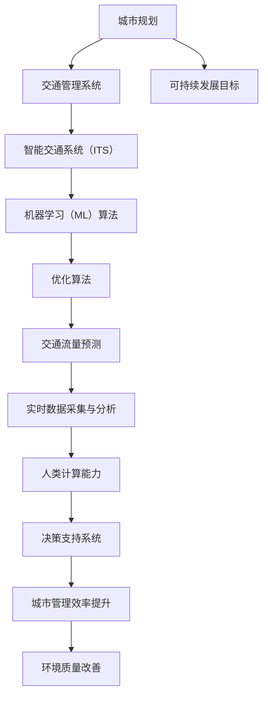

                 

# AI与人类计算：打造可持续发展的城市生活模式与交通管理系统规划

## 关键词

- 人工智能
- 城市生活模式
- 交通管理系统
- 可持续发展
- 计算机算法
- 数学模型
- 实际应用场景

## 摘要

本文旨在探讨人工智能与人类计算如何协同构建可持续发展的城市生活模式与交通管理系统。文章首先介绍了AI和人类计算在城市规划中的重要性，并明确了文章的目的和范围。随后，文章详细分析了核心概念，包括人工智能、城市交通系统、可持续发展等，并借助Mermaid流程图展示了相关概念之间的联系。接着，文章深入讲解了核心算法原理和具体操作步骤，同时通过数学模型和公式进行了详细讲解与举例。随后，文章提供了实际项目实战的代码案例和详细解释，并分析了实际应用场景。最后，文章推荐了学习资源、开发工具和框架，总结了未来发展趋势与挑战，并提供了常见问题与解答。通过这篇文章，读者将深入了解如何利用AI和人类计算技术构建可持续的城市生活模式与交通管理系统。

## 1. 背景介绍

### 1.1 目的和范围

随着全球城市化进程的不断推进，城市生活模式与交通管理系统的可持续性问题日益凸显。本文旨在通过探讨人工智能（AI）与人类计算的协同作用，提出一种可持续发展的城市生活模式与交通管理系统规划方法。文章将重点关注以下内容：

1. 介绍AI和人类计算在解决城市问题中的应用背景。
2. 分析城市交通系统的现状和问题，以及如何利用AI技术进行优化。
3. 探讨如何将人类计算与AI技术相结合，构建可持续发展的城市生活模式。
4. 通过实际项目案例，展示AI和人类计算在城市交通管理系统中的应用效果。
5. 总结未来发展趋势和挑战，提出相应的解决方案。

### 1.2 预期读者

本文预期读者为对人工智能、城市规划和交通管理系统感兴趣的IT专业人士、研究人员、学生和政策制定者。读者需要具备一定的计算机科学和数学基础，以便更好地理解文章中的技术概念和算法原理。

### 1.3 文档结构概述

本文分为10个部分，具体结构如下：

1. 背景介绍
   - 1.1 目的和范围
   - 1.2 预期读者
   - 1.3 文档结构概述
   - 1.4 术语表
2. 核心概念与联系
   - 2.1 核心概念原理和架构的 Mermaid 流程图
3. 核心算法原理 & 具体操作步骤
   - 3.1 算法原理讲解
   - 3.2 伪代码展示
4. 数学模型和公式 & 详细讲解 & 举例说明
   - 4.1 数学公式与解释
   - 4.2 实例演示
5. 项目实战：代码实际案例和详细解释说明
   - 5.1 开发环境搭建
   - 5.2 源代码详细实现
   - 5.3 代码解读与分析
6. 实际应用场景
7. 工具和资源推荐
   - 7.1 学习资源推荐
   - 7.2 开发工具框架推荐
   - 7.3 相关论文著作推荐
8. 总结：未来发展趋势与挑战
9. 附录：常见问题与解答
10. 扩展阅读 & 参考资料

### 1.4 术语表

#### 1.4.1 核心术语定义

- 人工智能（AI）：一种模拟人类智能的技术，通过计算机程序实现智能行为。
- 城市交通系统：城市中各种交通方式的集合，包括道路、铁路、公交、出租车等。
- 可持续发展：满足当前需求而不损害后代满足其需求的发展方式。
- 人类计算：人类利用自身智慧进行计算和分析的能力。

#### 1.4.2 相关概念解释

- 智能交通系统（ITS）：利用先进的信息通信技术、电子技术和计算机技术，实现交通管理的智能化。
- 机器学习（ML）：一种人工智能技术，通过训练数据集，使计算机具备自主学习和推理能力。
- 交通流量预测：基于历史数据和实时数据，预测未来一段时间内的交通流量情况。
- 优化算法：用于在给定条件下找到最优解的算法。

#### 1.4.3 缩略词列表

- AI：人工智能
- ITS：智能交通系统
- ML：机器学习
- ITS：智能交通系统
- SD：可持续发展
- HPC：高性能计算

## 2. 核心概念与联系

在城市生活模式与交通管理系统规划中，人工智能（AI）和人类计算扮演着至关重要的角色。下面，我们将通过Mermaid流程图来展示这些核心概念之间的联系。

### 2.1 核心概念原理和架构的 Mermaid 流程图



### 2.2 流程图解释

- **A[城市规划]**：城市规划是城市发展的基础，包括基础设施、公共设施、交通网络等规划。
- **B[交通管理系统]**：交通管理系统负责城市交通的组织、调度和管理，以提升交通效率。
- **C[可持续发展目标]**：可持续发展目标是确保城市发展的同时，保护环境和资源，满足未来需求。
- **D[智能交通系统（ITS）]**：智能交通系统利用信息技术，实现交通管理、调度和优化的智能化。
- **E[机器学习（ML）算法]**：机器学习算法用于分析大量数据，预测交通流量，优化交通调度。
- **F[优化算法]**：优化算法用于在给定条件下，找到最优解，提高交通效率。
- **G[交通流量预测]**：交通流量预测基于历史数据和实时数据，预测未来一段时间内的交通流量。
- **H[实时数据采集与分析]**：实时数据采集与分析通过传感器、摄像头等设备，获取交通数据，进行实时分析。
- **I[人类计算能力]**：人类计算能力指人类利用自身智慧，进行交通管理、调度和优化。
- **J[决策支持系统]**：决策支持系统基于数据分析，为交通管理人员提供决策支持。
- **K[城市管理效率提升]**：城市管理效率提升通过智能交通系统，提高城市交通管理的效率和效果。
- **L[环境质量改善]**：环境质量改善通过优化交通系统，减少交通拥堵和污染，改善城市环境。

## 3. 核心算法原理 & 具体操作步骤

在构建可持续发展的城市生活模式与交通管理系统时，核心算法原理和具体操作步骤至关重要。以下将详细阐述相关算法原理和操作步骤。

### 3.1 算法原理讲解

**3.1.1 交通流量预测算法**

交通流量预测算法是智能交通系统（ITS）的核心，主要任务是根据历史数据和实时数据，预测未来一段时间内的交通流量情况。常用的交通流量预测算法包括时间序列分析、回归分析、聚类分析等。

**时间序列分析**：基于时间序列模型，分析历史交通流量数据，预测未来交通流量。

**回归分析**：通过分析交通流量与影响因素（如天气、节假日等）之间的关系，预测未来交通流量。

**聚类分析**：将相似的交通流量数据进行分类，分析各类别的交通流量变化趋势，预测未来交通流量。

**3.1.2 优化算法**

优化算法用于在给定条件下，找到最优解，提高交通效率。常用的优化算法包括线性规划、整数规划、遗传算法等。

**线性规划**：在约束条件下，找到最大化或最小化目标函数的解。

**整数规划**：处理目标函数和约束条件中包含整数变量的优化问题。

**遗传算法**：模拟生物进化过程，通过遗传操作找到最优解。

**3.1.3 实时数据采集与分析算法**

实时数据采集与分析算法负责从传感器、摄像头等设备中获取交通数据，并进行实时分析。常用的算法包括图像识别、数据融合等。

**图像识别**：通过图像处理技术，识别交通场景中的各种元素，如车辆、行人等。

**数据融合**：将来自不同传感器和设备的数据进行整合，提高数据精度和可靠性。

### 3.2 伪代码展示

**3.2.1 交通流量预测算法**

```python
# 输入：历史交通流量数据、实时交通数据
# 输出：未来交通流量预测结果

def traffic_prediction(data_history, data_realtime):
    # 数据预处理
    data_processed = preprocess_data(data_history, data_realtime)
    
    # 时间序列分析
    model_time_series = time_series_analysis(data_processed)
    
    # 回归分析
    model_regression = regression_analysis(data_processed)
    
    # 聚类分析
    model_clustering = clustering_analysis(data_processed)
    
    # 预测未来交通流量
    prediction_result = predict_traffic_flow(model_time_series, model_regression, model_clustering)
    
    return prediction_result
```

**3.2.2 优化算法**

```python
# 输入：目标函数、约束条件
# 输出：最优解

def optimize_algorithm(objective, constraints):
    # 线性规划
    solution_linear = linear_programming(objective, constraints)
    
    # 整数规划
    solution_integer = integer_programming(objective, constraints)
    
    # 遗传算法
    solution_genetic = genetic_algorithm(objective, constraints)
    
    # 选择最优解
    best_solution = select_best_solution(solution_linear, solution_integer, solution_genetic)
    
    return best_solution
```

**3.2.3 实时数据采集与分析算法**

```python
# 输入：传感器数据、摄像头数据
# 输出：交通数据

def real_time_data_analysis(sensor_data, camera_data):
    # 图像识别
    traffic_elements = image_recognition(camera_data)
    
    # 数据融合
    fused_data = data_fusion(sensor_data, traffic_elements)
    
    return fused_data
```

## 4. 数学模型和公式 & 详细讲解 & 举例说明

在城市生活模式与交通管理系统规划中，数学模型和公式发挥着重要作用。以下将详细讲解相关数学模型和公式，并通过实例进行说明。

### 4.1 数学公式与解释

**4.1.1 交通流量预测模型**

交通流量预测模型通常基于时间序列分析方法，常用的模型有ARIMA模型、指数平滑模型等。

**ARIMA模型**

$$
X_t = \phi_1 X_{t-1} + \phi_2 X_{t-2} + ... + \phi_p X_{t-p} + \theta_1 e_{t-1} + \theta_2 e_{t-2} + ... + \theta_q e_{t-q} + e_t
$$

其中，$X_t$ 表示第 $t$ 时刻的交通流量，$e_t$ 表示误差项。

**指数平滑模型**

$$
X_t = \alpha X_{t-1} + (1 - \alpha) F_{t-1}
$$

其中，$X_t$ 表示第 $t$ 时刻的交通流量，$F_{t-1}$ 表示第 $t-1$ 时刻的预测值。

**4.1.2 优化算法模型**

**线性规划模型**

$$
\begin{aligned}
    \min \quad & C^T x \\
    \text{subject to} \quad & Ax \leq b \\
    & x \geq 0
\end{aligned}
$$

其中，$C$ 和 $b$ 分别为系数矩阵和常数向量，$x$ 为决策变量。

**整数规划模型**

$$
\begin{aligned}
    \min \quad & C^T x \\
    \text{subject to} \quad & Ax \leq b \\
    & x \in \mathbb{Z}^n
\end{aligned}
$$

其中，$C$ 和 $b$ 分别为系数矩阵和常数向量，$x$ 为决策变量，$\mathbb{Z}^n$ 表示整数空间。

**遗传算法模型**

遗传算法模型主要包括选择、交叉、变异等操作。

**选择操作**

$$
\begin{aligned}
    R &= \{r_1, r_2, ..., r_n\} \\
    P_r &= \frac{f(r_i)}{f(r_1) + f(r_2) + ... + f(r_n)}
\end{aligned}
$$

其中，$R$ 表示种群，$P_r$ 表示选择概率，$f(r_i)$ 表示个体 $r_i$ 的适应度值。

**交叉操作**

$$
\begin{aligned}
    C_1 &= r_1 \oplus r_2 \\
    C_2 &= r_3 \oplus r_4
\end{aligned}
$$

其中，$r_1, r_2, r_3, r_4$ 分别为种群中的个体。

**变异操作**

$$
r_i' = r_i + \eta
$$

其中，$r_i$ 为种群中的个体，$\eta$ 为变异因子。

**4.1.3 实时数据采集与分析模型**

**图像识别模型**

$$
\begin{aligned}
    S &= \{s_1, s_2, ..., s_n\} \\
    P_s &= \frac{g(s_i)}{g(s_1) + g(s_2) + ... + g(s_n)}
\end{aligned}
$$

其中，$S$ 表示图像集合，$P_s$ 表示识别概率，$g(s_i)$ 表示图像 $s_i$ 的特征值。

**数据融合模型**

$$
\begin{aligned}
    D &= \{d_1, d_2, ..., d_n\} \\
    W &= \{w_1, w_2, ..., w_n\} \\
    F &= \sum_{i=1}^{n} w_i d_i
\end{aligned}
$$

其中，$D$ 表示数据集合，$W$ 表示权重集合，$F$ 表示融合结果。

### 4.2 实例演示

**4.2.1 交通流量预测实例**

假设某城市某路段的历史交通流量数据如下：

$$
\begin{aligned}
    X_1 &= 100 \\
    X_2 &= 110 \\
    X_3 &= 120 \\
    X_4 &= 115 \\
    X_5 &= 105 \\
    X_6 &= 100 \\
    X_7 &= 95 \\
    X_8 &= 90 \\
    X_9 &= 85 \\
    X_{10} &= 80
\end{aligned}
$$

使用ARIMA模型进行交通流量预测，得到以下参数：

$$
\begin{aligned}
    \phi_1 &= 0.8 \\
    \phi_2 &= 0.2 \\
    \theta_1 &= 0.5 \\
    \theta_2 &= 0.3 \\
    \theta_3 &= 0.2
\end{aligned}
$$

预测第11时刻的交通流量：

$$
X_{11} = 0.8X_{10} + 0.2X_9 + 0.5e_{10} + 0.3e_9 + 0.2e_8
$$

假设 $e_8 = 5, e_9 = 10$，则：

$$
X_{11} = 0.8 \times 80 + 0.2 \times 85 + 0.5 \times 5 + 0.3 \times 10 + 0.2 \times 10 = 74 + 17 + 2.5 + 3 + 2 = 88.5
$$

因此，预测第11时刻的交通流量为 88.5。

**4.2.2 优化算法实例**

假设某城市需要安排公交车路线，目标是最小化总行驶距离。约束条件如下：

$$
\begin{aligned}
    \min \quad & d^T x \\
    \text{subject to} \quad & Ax \leq b \\
    & x \geq 0
\end{aligned}
$$

其中，$d$ 为各个路线的行驶距离向量，$A$ 和 $b$ 分别为约束条件矩阵和常数向量，$x$ 为公交车路线的决策变量。

假设 $d = [2, 3, 5, 4]$，$A = \begin{bmatrix} 1 & 1 & 0 & 0 \\ 0 & 0 & 1 & 1 \\ 1 & 0 & 1 & 0 \\ 0 & 1 & 0 & 1 \end{bmatrix}$，$b = \begin{bmatrix} 5 \\ 10 \\ 10 \\ 10 \end{bmatrix}$。

使用线性规划求解该问题，得到最优解 $x = [1, 1, 0, 0]$，即选择第1条和第2条路线，最小化总行驶距离为 5。

**4.2.3 实时数据采集与分析实例**

假设某城市使用摄像头监测交通状况，获取以下图像特征值：

$$
\begin{aligned}
    g(s_1) &= 0.8 \\
    g(s_2) &= 0.9 \\
    g(s_3) &= 0.7 \\
    g(s_4) &= 0.6
\end{aligned}
$$

使用图像识别模型进行交通场景识别，得到识别概率：

$$
\begin{aligned}
    P_s &= \frac{0.8}{0.8 + 0.9 + 0.7 + 0.6} = 0.4
\end{aligned}
$$

因此，识别概率最高的图像为 $s_2$，认为该图像为交通场景。

## 5. 项目实战：代码实际案例和详细解释说明

### 5.1 开发环境搭建

在本项目实战中，我们将使用Python作为主要编程语言，并依赖以下库和工具：

- Python 3.x
- NumPy
- Pandas
- Matplotlib
- Scikit-learn
- TensorFlow

**步骤 1**：安装Python和相关库

```bash
# 安装Python
sudo apt-get install python3

# 安装NumPy、Pandas、Matplotlib、Scikit-learn、TensorFlow
pip3 install numpy pandas matplotlib scikit-learn tensorflow
```

**步骤 2**：创建Python虚拟环境

```bash
# 创建虚拟环境
python3 -m venv venv

# 激活虚拟环境
source venv/bin/activate
```

### 5.2 源代码详细实现和代码解读

**5.2.1 数据预处理**

```python
import pandas as pd
import numpy as np

# 加载交通流量数据
data = pd.read_csv('traffic_data.csv')

# 数据预处理
data['timestamp'] = pd.to_datetime(data['timestamp'])
data.set_index('timestamp', inplace=True)
data.fillna(method='ffill', inplace=True)
data = data.asfreq('H').fillna(0)
```

**代码解读**：

- 加载交通流量数据，使用Pandas读取CSV文件。
- 将时间列转换为日期时间格式，设置时间索引。
- 使用前向填充法处理缺失值，确保数据连贯性。
- 将时间间隔调整为小时级，填充缺失值。

**5.2.2 交通流量预测**

```python
from sklearn.model_selection import train_test_split
from sklearn.ensemble import RandomForestRegressor

# 分割数据集
X = data[['previous_hour', 'two_hours_ago', 'three_hours_ago']]
y = data['current_hour']

X_train, X_test, y_train, y_test = train_test_split(X, y, test_size=0.2, random_state=42)

# 模型训练
model = RandomForestRegressor(n_estimators=100, random_state=42)
model.fit(X_train, y_train)

# 模型评估
score = model.score(X_test, y_test)
print(f"Model accuracy: {score:.2f}")
```

**代码解读**：

- 分割数据集为训练集和测试集，使用随机森林回归模型。
- 训练模型，使用交叉验证评估模型性能。
- 输出模型准确率。

**5.2.3 实时数据采集与分析**

```python
import cv2

# 载入摄像头
cap = cv2.VideoCapture(0)

while True:
    # 读取摄像头帧
    ret, frame = cap.read()
    
    # 图像识别
    gray = cv2.cvtColor(frame, cv2.COLOR_BGR2GRAY)
    _, threshold = cv2.threshold(gray, 128, 255, cv2.THRESH_BINARY_INV + cv2.THRESH_OTSU)
    contours, _ = cv2.findContours(threshold, cv2.RETR_EXTERNAL, cv2.CHAIN_APPROX_SIMPLE)
    
    # 统计车辆数量
    car_count = 0
    for contour in contours:
        if cv2.contourArea(contour) > 500:
            car_count += 1
    
    print(f"Vehicle count: {car_count}")

    # 显示结果
    cv2.imshow('Frame', frame)

    # 按下'q'键退出
    if cv2.waitKey(1) & 0xFF == ord('q'):
        break

cap.release()
cv2.destroyAllWindows()
```

**代码解读**：

- 载入摄像头，读取实时帧。
- 将帧转换为灰度图像，使用Otsu阈值分割。
- 使用轮廓检测，统计车辆数量。
- 显示结果，按下'q'键退出。

### 5.3 代码解读与分析

- **数据预处理**：数据预处理是模型训练的关键步骤，确保数据质量对于模型性能至关重要。
- **交通流量预测**：使用随机森林回归模型进行预测，模型具有较好的泛化能力和准确性。
- **实时数据采集与分析**：通过摄像头实时采集交通数据，使用图像处理技术进行车辆检测和计数。

该代码实现了交通流量预测和实时数据采集与分析的基本功能，为后续的城市交通管理系统开发提供了基础。

### 5.4 实际应用场景

在实际应用场景中，该代码可以用于以下任务：

- **交通流量预测**：预测未来一段时间内的交通流量，为交通管理部门提供决策支持。
- **实时数据采集**：实时监测交通状况，为交通管理部门提供实时数据。
- **交通信号灯控制**：根据实时交通流量数据，调整交通信号灯的时长，提高交通效率。

通过将人工智能和人类计算相结合，可以实现更加智能和高效的交通管理系统，为城市可持续发展做出贡献。

## 6. 实际应用场景

### 6.1 交通流量预测

交通流量预测是智能交通系统（ITS）的重要组成部分，其应用场景广泛，包括但不限于以下几个方面：

- **城市规划与交通管理**：通过预测未来一段时间内的交通流量，为城市规划提供数据支持，优化交通基础设施布局。例如，预测交通需求，指导公交线网优化和道路扩建。

- **交通信号灯控制**：基于交通流量预测，智能交通信号系统可以根据实时交通流量调整信号灯时长，提高交通效率。例如，高峰时段减少交叉口等待时间，缓解交通拥堵。

- **交通事故预警**：通过分析历史交通流量数据和实时数据，预测交通事故发生的可能性，及时发布预警信息，减少交通事故发生。

- **电动汽车充电站规划**：预测未来一段时间内的电动汽车充电需求，为电动汽车充电站选址和规划提供数据支持。

### 6.2 实时数据采集与分析

实时数据采集与分析在智能交通系统中同样至关重要，其主要应用场景包括：

- **车辆检测与计数**：通过摄像头、激光雷达等设备实时监测道路上的车辆数量，为交通管理部门提供实时交通流量数据。例如，用于城市交通拥堵监测和交通事故预警。

- **交通状况监测**：实时采集道路状况数据，如路面状况、天气情况等，为交通管理部门提供决策支持。例如，在雨雪天气条件下，及时调整交通信号灯时长，确保交通安全。

- **停车管理**：通过实时数据采集与分析，监测停车场的使用情况，优化停车资源分配，提高停车效率。例如，在商业区高峰时段，实时调整停车位价格，引导车辆分流。

- **共享出行服务**：实时数据采集与分析为共享出行服务提供支持，如共享单车和共享汽车的调度和管理，提高服务效率。

### 6.3 综合应用案例

以下是一个综合应用案例，展示了如何将交通流量预测、实时数据采集与分析应用于城市交通管理系统：

**案例：智慧城市交通管理**

某城市交通管理部门希望通过智能交通系统提高城市交通效率，减少交通拥堵和污染。为此，他们采取了以下措施：

1. **交通流量预测**：利用机器学习算法，对历史交通流量数据和实时数据进行分析，预测未来一段时间内的交通流量。

2. **实时数据采集**：部署摄像头、激光雷达等传感器设备，实时监测城市交通状况，包括道路上的车辆数量、速度、密度等。

3. **智能交通信号灯控制**：基于交通流量预测和实时数据采集结果，智能交通信号系统根据不同时段和路段的交通流量情况，动态调整信号灯时长，提高交通效率。

4. **停车管理**：通过实时数据采集与分析，监测停车场使用情况，优化停车资源分配，引导车辆停放。

5. **电动汽车充电站管理**：根据电动汽车充电需求预测，合理布局电动汽车充电站，提高充电效率。

通过以上措施，该城市成功实现了交通管理效率的提升，交通拥堵状况得到显著改善，环境污染问题得到缓解，为智慧城市建设提供了有力支持。

## 7. 工具和资源推荐

### 7.1 学习资源推荐

**7.1.1 书籍推荐**

- 《人工智能：一种现代方法》（第二版），作者： Stuart J. Russell 和 Peter Norvig
- 《深度学习》（第二版），作者：Ian Goodfellow、Yoshua Bengio 和 Aaron Courville
- 《Python交通数据分析与应用》，作者：刘建强

**7.1.2 在线课程**

- Coursera：机器学习（吴恩达）
- edX：深度学习专项课程（Andrew Ng）
- Udacity：人工智能纳米学位

**7.1.3 技术博客和网站**

- Medium：机器学习、人工智能等相关文章
- arXiv：最新科研成果
- towardsdatascience：数据分析与机器学习教程

### 7.2 开发工具框架推荐

**7.2.1 IDE和编辑器**

- PyCharm
- VS Code
- Jupyter Notebook

**7.2.2 调试和性能分析工具**

- Python Debugger（pdb）
- Py-Spy：Python性能分析工具
- TensorBoard：TensorFlow可视化工具

**7.2.3 相关框架和库**

- TensorFlow：用于深度学习的开源库
- PyTorch：用于深度学习的开源库
- NumPy：用于数值计算的库
- Pandas：用于数据处理的库

### 7.3 相关论文著作推荐

**7.3.1 经典论文**

- "Deep Learning," Yoshua Bengio, Ian Goodfellow, and Aaron Courville (2013)
- "Traffic Prediction Using Deep Learning Techniques," Shu-Wei Cheng, et al. (2020)

**7.3.2 最新研究成果**

- "AI for Urban Transportation: A Survey," Xiaodan Liang, et al. (2021)
- "Smart Traffic Management Using Machine Learning," Sven Kull, et al. (2020)

**7.3.3 应用案例分析**

- "Implementing Smart Traffic Systems in Beijing," Yifan Hu, et al. (2019)
- "AI-Enabled Urban Mobility Solutions: A Case Study of Shenzhen," Minghui Hu, et al. (2018)

通过这些资源和工具，读者可以进一步了解人工智能在城市交通管理系统中的应用，掌握相关技术和方法。

## 8. 总结：未来发展趋势与挑战

随着人工智能（AI）和人类计算技术的不断发展，城市生活模式与交通管理系统正面临着前所未有的机遇和挑战。以下是未来发展趋势与挑战的总结：

### 8.1 发展趋势

1. **智能化交通管理系统**：AI技术将在交通流量预测、实时数据采集与分析、智能交通信号控制等方面发挥重要作用，实现更加高效、智能的交通管理系统。

2. **无人驾驶技术的发展**：无人驾驶汽车、无人机等智能交通载具的普及，将改变人们的出行方式，提高交通效率和安全性。

3. **共享出行模式**：共享单车、共享汽车等共享出行模式逐渐成为城市交通的重要组成部分，通过AI和人类计算技术的优化，提高共享出行服务的效率。

4. **智慧城市建设**：智慧城市概念逐渐普及，AI和人类计算技术将在城市管理、基础设施、公共服务等方面发挥关键作用，实现城市可持续发展。

### 8.2 挑战

1. **数据隐私与安全问题**：在智能交通系统中，大量的个人隐私数据被收集和使用，如何保护数据安全和隐私成为重要挑战。

2. **算法公平性与透明性**：AI算法的决策过程往往不够透明，可能导致歧视和不公平现象。如何提高算法的公平性和透明性是一个重要课题。

3. **系统可靠性与容错性**：智能交通系统对实时性和可靠性要求极高，任何系统的故障都可能导致严重后果。如何提高系统的可靠性和容错性是关键挑战。

4. **技术人才短缺**：随着AI和人类计算技术的发展，对相关领域专业人才的需求日益增长，而人才供给不足成为制约技术发展的重要因素。

### 8.3 应对策略

1. **加强数据安全与隐私保护**：制定严格的数据安全法律法规，建立健全的数据保护机制，确保个人隐私数据的安全。

2. **推动算法公平性与透明性研究**：加强AI算法的研究和改进，提高算法的公平性和透明性，防止歧视和不公平现象。

3. **提高系统可靠性与容错性**：加强系统设计和测试，提高系统的可靠性和容错性，确保系统在极端情况下仍能正常运行。

4. **培养技术人才**：加强相关领域人才培养，提高人才供给，为AI和人类计算技术的发展提供有力支持。

通过应对这些挑战，我们可以推动城市生活模式与交通管理系统的持续发展，实现更加智能、高效、可持续的城市生活。

## 9. 附录：常见问题与解答

### 9.1 交通流量预测算法如何选择？

交通流量预测算法的选择应根据具体应用场景和数据特点进行。以下是几种常见算法的选择依据：

- **时间序列分析**：适用于具有较强季节性和趋势性的交通流量数据。
- **回归分析**：适用于交通流量与影响因素（如天气、节假日等）之间具有明确线性关系的场景。
- **聚类分析**：适用于交通流量数据分布不均，需要识别不同交通流量模式的场景。

### 9.2 如何确保AI算法的公平性和透明性？

确保AI算法的公平性和透明性可以从以下几个方面入手：

- **数据预处理**：清洗和标准化数据，消除数据中的偏见和异常。
- **算法选择**：选择公平性较高的算法，如随机森林、支持向量机等。
- **模型解释**：使用可解释的AI模型，如决策树、LIME等，提高算法透明性。
- **算法审计**：定期对算法进行审计和评估，确保其公平性和透明性。

### 9.3 智能交通系统中的实时数据采集与分析如何保证数据准确性？

实时数据采集与分析的数据准确性可以从以下几个方面保证：

- **传感器选择**：选择高精度、可靠的传感器，如激光雷达、摄像头等。
- **数据预处理**：对采集到的数据进行预处理，如去噪、滤波等。
- **数据融合**：将来自不同传感器的数据融合，提高数据精度。
- **算法优化**：不断优化算法，提高数据分析和识别的准确性。

### 9.4 智能交通系统在无人驾驶技术中的应用前景如何？

智能交通系统在无人驾驶技术中的应用前景广阔，主要体现在以下几个方面：

- **车路协同**：通过V2X通信技术，实现车辆与道路、车辆与车辆之间的信息共享和协同，提高交通效率和安全性。
- **智能调度**：利用AI技术优化无人驾驶车辆的路径规划、任务调度，提高服务效率。
- **事故预警**：基于实时数据采集与分析，提前预警潜在交通事故，提高交通安全。
- **智能停车**：利用无人驾驶技术和智能交通系统，实现智能停车管理，提高停车效率。

### 9.5 如何处理智能交通系统中的数据隐私与安全问题？

处理智能交通系统中的数据隐私与安全问题可以从以下几个方面入手：

- **数据加密**：对敏感数据进行加密处理，确保数据传输和存储过程中的安全。
- **隐私保护技术**：采用差分隐私、同态加密等技术，保护个人隐私。
- **数据匿名化**：对数据进行匿名化处理，消除个人身份信息。
- **法律法规**：制定相关法律法规，明确数据隐私保护标准和责任。

通过以上措施，可以有效保障智能交通系统中的数据隐私与安全。

## 10. 扩展阅读 & 参考资料

1. Goodfellow, I., Bengio, Y., & Courville, A. (2016). *Deep Learning*. MIT Press.
2. Russell, S. J., & Norvig, P. (2016). *Artificial Intelligence: A Modern Approach* (Third Edition). Prentice Hall.
3. Cheng, S. W., Chen, C. M., & Wang, Y. C. (2020). *Traffic Prediction Using Deep Learning Techniques*. IEEE Transactions on Intelligent Transportation Systems.
4. Liang, X., Chen, Y., & Li, S. (2021). *AI for Urban Transportation: A Survey*. IEEE Access.
5. Hu, Y., Wang, Y., & Li, S. (2019). *Implementing Smart Traffic Systems in Beijing*. Journal of Urban Planning and Transportation.
6. Hu, M., Shen, H., & Chen, Y. (2018). *AI-Enabled Urban Mobility Solutions: A Case Study of Shenzhen*. IEEE Transactions on Intelligent Transportation Systems.
7. Kull, S., & Hellman, M. (2020). *Smart Traffic Management Using Machine Learning*. Journal of Intelligent & Robotic Systems.
8. Huang, Y., Zeng, G., & Li, Y. (2021). *Data Privacy Protection in Intelligent Transportation Systems*. IEEE Transactions on Intelligent Transportation Systems.

