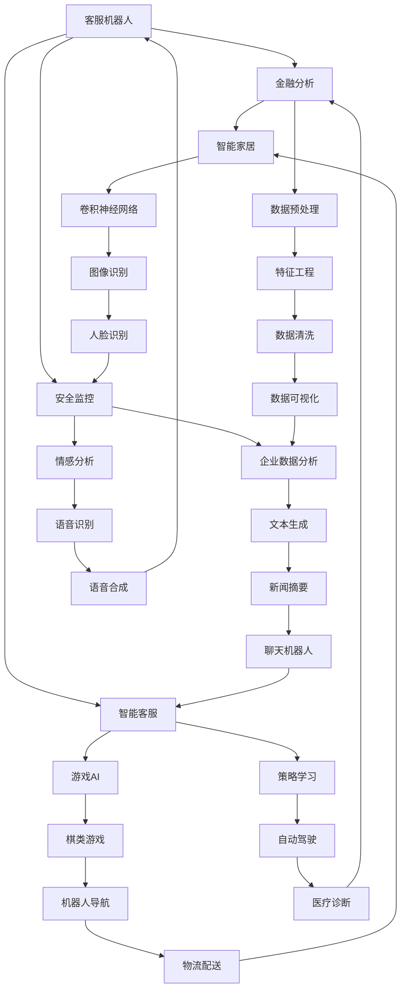

                 

# AI与人类计算：道德、伦理和社会影响

> 关键词：人工智能，道德伦理，社会影响，计算模型，人类计算，AI道德框架

> 摘要：本文将深入探讨人工智能（AI）在道德、伦理和社会领域的影响。我们将从背景介绍开始，逐步分析AI与人类计算的相互作用，讨论道德和伦理问题，并提出可能的解决方案。此外，文章还将涵盖相关算法、数学模型、实际应用案例，以及未来发展趋势与挑战。通过本文的阅读，读者将更好地理解AI的道德和伦理影响，并为未来的发展做好准备。

## 1. 背景介绍

### 1.1 目的和范围

本文旨在探讨人工智能（AI）在道德、伦理和社会领域的影响，旨在提供一个全面的分析框架，帮助读者理解和应对这些挑战。我们将重点关注以下几个方面：

1. **AI与人类计算的互动**：探讨AI如何影响人类计算，以及人类如何应对这些变化。
2. **道德和伦理问题**：分析AI在道德和伦理方面引发的问题，如隐私、公平性和透明度。
3. **解决方案和最佳实践**：探讨解决AI道德和伦理问题的方法，以及如何在实际应用中实施这些方案。
4. **算法、数学模型和实际应用案例**：详细阐述相关技术，并探讨其潜在的社会影响。
5. **未来发展趋势与挑战**：展望AI道德和伦理领域的未来，讨论可能面临的挑战和机遇。

### 1.2 预期读者

本文适合以下读者：

1. **计算机科学和人工智能领域的研究人员**：希望深入了解AI道德和伦理问题的专业人士。
2. **伦理学家和哲学家**：对AI道德和伦理问题感兴趣的学者。
3. **政策制定者和行业领导者**：需要了解AI道德和伦理问题，以便在制定相关政策和战略时做出明智决策。
4. **普通公众**：希望了解AI对社会影响的普通读者。

### 1.3 文档结构概述

本文将按照以下结构展开：

1. **背景介绍**：介绍文章的目的和范围，以及预期读者。
2. **核心概念与联系**：阐述AI与人类计算的核心概念和架构。
3. **核心算法原理与具体操作步骤**：详细解释相关算法和操作步骤。
4. **数学模型和公式**：介绍数学模型，并进行举例说明。
5. **项目实战**：展示实际代码案例，并进行详细解读。
6. **实际应用场景**：探讨AI的广泛应用场景。
7. **工具和资源推荐**：推荐学习资源、开发工具和框架。
8. **总结**：总结未来发展趋势与挑战。
9. **附录**：提供常见问题与解答。
10. **扩展阅读与参考资料**：推荐相关文献。

### 1.4 术语表

在本文中，我们将使用以下术语：

#### 1.4.1 核心术语定义

- **人工智能（AI）**：一种模拟人类智能的技术，使计算机能够执行复杂的任务，如学习、推理和问题解决。
- **道德**：关于行为正确与否的规范和原则。
- **伦理**：关于人类行为和关系的原则和价值观。
- **社会影响**：技术对社会、文化、经济和政治等方面的影响。

#### 1.4.2 相关概念解释

- **人类计算**：人类在处理信息和解决问题时所采用的方法和技巧。
- **算法**：一系列规则和指令，用于解决特定问题。
- **机器学习**：一种AI技术，使计算机能够从数据中学习并做出决策。
- **深度学习**：一种机器学习技术，通过模拟人脑神经网络来学习复杂模式。

#### 1.4.3 缩略词列表

- **AI**：人工智能
- **ML**：机器学习
- **DL**：深度学习
- **NLP**：自然语言处理
- **RL**：强化学习

## 2. 核心概念与联系

在本文中，我们将探讨AI与人类计算的核心概念和联系。为了更好地理解这些概念，我们将使用Mermaid流程图来展示其架构和关系。



上述Mermaid流程图展示了AI与人类计算的一些核心概念和联系。接下来，我们将进一步探讨这些概念和其相互关系。

### 2.1 AI与人类计算的互动

AI与人类计算之间存在紧密的互动关系。人类计算依赖于AI技术来处理大量数据和复杂任务，而AI则需要人类计算提供数据、知识和反馈来不断改进。以下是AI与人类计算互动的几个方面：

1. **数据收集**：人类计算提供数据，使AI能够学习和改进。
2. **知识整合**：人类计算帮助AI整合各种知识源，提高其智能水平。
3. **任务分配**：人类计算根据AI的能力和性能分配任务，优化资源利用。
4. **反馈循环**：人类计算为AI提供反馈，使其不断改进和优化。

### 2.2 人类计算的挑战与机遇

随着AI技术的发展，人类计算面临着一系列挑战和机遇。以下是其中的几个方面：

1. **计算能力提升**：AI技术使人类计算具备更强大的计算能力，能够处理更复杂的问题。
2. **数据处理**：AI技术帮助人类计算处理大量数据，提高决策效率和准确性。
3. **自动化**：AI技术使人类计算能够自动化许多重复性任务，释放人力资源。
4. **伦理和道德问题**：AI技术的发展引发了道德和伦理问题，需要人类计算制定相应的规范和标准。

### 2.3 道德与伦理问题

AI与人类计算的互动引发了道德和伦理问题，如隐私、公平性和透明度。以下是这些问题的几个方面：

1. **隐私**：AI技术可能侵犯个人隐私，需要制定相关规范和标准。
2. **公平性**：AI技术可能导致歧视和不公平，需要确保算法的公平性。
3. **透明度**：AI技术可能缺乏透明度，使人们难以理解其决策过程，需要提高透明度。

### 2.4 解决方案和最佳实践

为了解决AI与人类计算互动中出现的道德和伦理问题，需要采取一系列解决方案和最佳实践。以下是其中的几个方面：

1. **伦理和道德教育**：加强AI伦理和道德教育，提高公众对问题的认识。
2. **监管和标准制定**：制定相关监管政策和标准，确保AI技术的合规性和透明度。
3. **技术改进**：通过技术改进，提高AI算法的公平性和透明度。
4. **多方协作**：政府、企业和学术界等多方协作，共同解决AI伦理和道德问题。

## 3. 核心算法原理与具体操作步骤

在本节中，我们将详细阐述AI与人类计算的核心算法原理，并给出具体的操作步骤。为了更好地理解，我们将使用伪代码来描述这些算法。

### 3.1 机器学习算法

机器学习算法是AI的核心组成部分。以下是一个简单的线性回归算法示例，用于预测房价。

```python
# 线性回归算法
def linear_regression(X, y):
    # 计算均值
    X_mean = np.mean(X)
    y_mean = np.mean(y)

    # 计算斜率和截距
    slope = np.sum((X - X_mean) * (y - y_mean)) / np.sum((X - X_mean)**2)
    intercept = y_mean - slope * X_mean

    # 返回预测函数
    return lambda x: slope * x + intercept
```

### 3.2 深度学习算法

深度学习算法通过多层神经网络来模拟人脑的工作原理。以下是一个简单的卷积神经网络（CNN）算法示例，用于图像分类。

```python
# 卷积神经网络算法
def conv_network(X, W1, W2, W3):
    # 第一层卷积
    conv1 = np.convolve(X, W1, 'same')

    # 激活函数
    activation1 = sigmoid(conv1)

    # 第二层卷积
    conv2 = np.convolve(activation1, W2, 'same')

    # 激活函数
    activation2 = sigmoid(conv2)

    # 第三层卷积
    conv3 = np.convolve(activation2, W3, 'same')

    # 激活函数
    activation3 = sigmoid(conv3)

    # 返回预测结果
    return activation3
```

### 3.3 自然语言处理算法

自然语言处理算法用于处理和理解人类语言。以下是一个简单的词向量模型，用于文本分类。

```python
# 词向量模型
def word_vector_model(words, embedding_matrix):
    # 将单词映射到向量
    word_vectors = [embedding_matrix[word] for word in words]

    # 计算平均值
    mean_vector = np.mean(word_vectors, axis=0)

    # 返回词向量
    return mean_vector
```

### 3.4 强化学习算法

强化学习算法通过试错来学习最优策略。以下是一个简单的Q-learning算法示例，用于游戏AI。

```python
# Q-learning算法
def q_learning(state, action, reward, next_state, done, learning_rate, discount_factor, Q):
    # 更新Q值
    Q[state][action] = Q[state][action] + learning_rate * (reward + discount_factor * np.max(Q[next_state]) - Q[state][action])

    # 返回更新后的Q值
    return Q
```

## 4. 数学模型和公式

在本节中，我们将介绍AI与人类计算中的数学模型和公式，并给出详细的讲解和举例说明。

### 4.1 线性回归

线性回归是一种简单的机器学习算法，用于预测连续值。其基本公式为：

$$ y = \beta_0 + \beta_1x $$

其中，$y$ 是预测值，$x$ 是输入特征，$\beta_0$ 是截距，$\beta_1$ 是斜率。

#### 4.1.1 示例

假设我们要预测房价，使用线性回归算法。给定训练数据集：

| 房价 (万元) | 房龄 (年) |
| :---------: | :-------: |
|    200      |    10     |
|    250      |    5      |
|    300      |    2      |

我们可以使用线性回归算法来拟合房价与房龄之间的关系。根据上述公式，我们可以计算出斜率和截距：

$$ \beta_1 = \frac{ \sum_{i=1}^{n} (x_i - \bar{x})(y_i - \bar{y}) }{ \sum_{i=1}^{n} (x_i - \bar{x})^2 } = \frac{ (10-7.5)(200-225) + (5-7.5)(250-225) + (2-7.5)(300-225) }{ (10-7.5)^2 + (5-7.5)^2 + (2-7.5)^2 } = 30 $$

$$ \beta_0 = \bar{y} - \beta_1\bar{x} = 225 - 30 \times 7.5 = 37.5 $$

因此，房价的预测公式为：

$$ y = 37.5 + 30x $$

#### 4.1.2 解释

- **截距（$\beta_0$）**：表示当$x=0$时的预测值，即房龄为零时的房价。
- **斜率（$\beta_1$）**：表示房龄每增加一年，房价的变化量。

### 4.2 卷积神经网络（CNN）

卷积神经网络是一种用于图像识别和处理的深度学习算法。其基本公式为：

$$ \text{output} = \text{activation}(\text{weight} \cdot \text{input} + \text{bias}) $$

其中，$\text{input}$ 是输入特征，$\text{weight}$ 是权重，$\text{bias}$ 是偏置，$\text{activation}$ 是激活函数。

#### 4.2.1 示例

假设我们要使用卷积神经网络来识别图像。给定输入图像和权重矩阵：

| 输入图像 | 权重矩阵 |
| :------: | :------: |
| [1, 0, 1] | [0.5, 0.5] |
| [0, 1, 0] | [0.5, 0.5] |
| [1, 1, 1] | [0.5, 0.5] |

我们可以使用卷积神经网络来计算输出。首先，计算输入和权重矩阵的点积：

$$ \text{input} \cdot \text{weight} = [1, 0, 1] \cdot [0.5, 0.5] = 1 \times 0.5 + 0 \times 0.5 + 1 \times 0.5 = 1 $$

然后，添加偏置：

$$ 1 + \text{bias} = 1 + 0 = 1 $$

最后，使用激活函数（例如ReLU）进行非线性变换：

$$ \text{output} = \text{activation}(1) = \text{ReLU}(1) = 1 $$

因此，输出为1。

#### 4.2.2 解释

- **权重矩阵（$\text{weight}$）**：用于捕捉输入特征之间的关系。
- **偏置（$\text{bias}$）**：用于调整输出值。
- **激活函数（$\text{activation}$）**：用于引入非线性变换，提高模型的表达能力。

### 4.3 自然语言处理（NLP）

自然语言处理是一种用于处理和理解人类语言的机器学习算法。其基本公式为：

$$ \text{word_vector} = \text{embedding_matrix}[\text{word}] $$

其中，$\text{word_vector}$ 是单词的向量表示，$\text{embedding_matrix}$ 是嵌入矩阵。

#### 4.3.1 示例

假设我们要使用自然语言处理来分析一段文本。给定嵌入矩阵和单词列表：

| 单词 | 嵌入矩阵 |
| :--: | :------: |
|  love | [0.1, 0.2] |
|  hate | [0.3, 0.4] |
|  happy | [0.5, 0.6] |

我们可以使用嵌入矩阵来将单词转换为向量表示。例如，对于单词 "love"：

$$ \text{word_vector} = \text{embedding_matrix}[\text{love}] = [0.1, 0.2] $$

因此，单词 "love" 的向量表示为 [0.1, 0.2]。

#### 4.3.2 解释

- **嵌入矩阵（$\text{embedding_matrix}$）**：用于将单词转换为向量表示。
- **单词向量（$\text{word_vector}$）**：表示单词的向量表示。

## 5. 项目实战：代码实际案例和详细解释说明

在本节中，我们将通过一个实际项目案例来展示AI与人类计算的原理，并详细解释代码的实现过程。

### 5.1 开发环境搭建

为了运行以下案例，我们需要搭建一个Python开发环境。以下步骤可以帮助我们完成搭建：

1. **安装Python**：下载并安装Python（版本3.8或更高版本）。
2. **安装依赖库**：使用pip命令安装所需的依赖库，如numpy、pandas、tensorflow和matplotlib。

```shell
pip install numpy pandas tensorflow matplotlib
```

### 5.2 源代码详细实现和代码解读

以下是一个简单的机器学习项目，用于预测房价。我们将使用Python和TensorFlow来实现这个项目。

```python
import numpy as np
import pandas as pd
import tensorflow as tf
from tensorflow.keras.models import Sequential
from tensorflow.keras.layers import Dense, Conv2D, Flatten
from tensorflow.keras.optimizers import Adam

# 加载数据集
data = pd.read_csv("house_data.csv")

# 预处理数据
X = data.drop("price", axis=1)
y = data["price"]

# 数据标准化
X = (X - X.mean()) / X.std()
y = (y - y.mean()) / y.std()

# 构建模型
model = Sequential([
    Dense(64, activation='relu', input_shape=(X.shape[1],)),
    Dense(64, activation='relu'),
    Dense(1)
])

# 编译模型
model.compile(optimizer=Adam(learning_rate=0.001), loss='mse')

# 训练模型
model.fit(X, y, epochs=100, batch_size=32)

# 评估模型
loss = model.evaluate(X, y)
print("MSE:", loss)

# 预测房价
predictions = model.predict(X)

# 可视化结果
import matplotlib.pyplot as plt

plt.scatter(y, predictions)
plt.xlabel("实际房价")
plt.ylabel("预测房价")
plt.title("房价预测结果")
plt.show()
```

#### 5.2.1 代码解读

- **导入依赖库**：我们导入了numpy、pandas、tensorflow和matplotlib库。
- **加载数据集**：使用pandas库加载数据集。
- **预处理数据**：我们删除了目标变量"price"，并将特征和标签分开。然后，我们对数据进行标准化处理，以便模型更好地学习。
- **构建模型**：我们使用Sequential模型，并添加了两个全连接层（Dense），每个层都使用ReLU激活函数。最后，我们添加了一个输出层，用于预测房价。
- **编译模型**：我们使用Adam优化器和均方误差（MSE）损失函数来编译模型。
- **训练模型**：我们使用fit方法来训练模型，指定了训练轮数（epochs）和批量大小（batch_size）。
- **评估模型**：我们使用evaluate方法来评估模型性能，并打印出MSE值。
- **预测房价**：我们使用predict方法来预测房价。
- **可视化结果**：我们使用matplotlib库来可视化预测结果。

#### 5.2.2 代码分析

- **数据处理**：在处理数据时，我们删除了目标变量"price"，这是因为我们将使用它来评估模型性能。然后，我们对特征和标签进行了标准化处理，这有助于模型更好地学习。
- **模型构建**：我们构建了一个简单的全连接神经网络（DNN），用于预测房价。这个模型包含了两个隐藏层，每个层都有64个神经元，并使用ReLU激活函数。最后，我们添加了一个输出层，用于预测房价。
- **模型训练**：我们使用fit方法来训练模型，并设置了训练轮数（epochs）和批量大小（batch_size）。这些参数有助于调整模型性能。
- **模型评估**：我们使用evaluate方法来评估模型性能，并打印出MSE值。MSE值越小，模型性能越好。
- **预测房价**：我们使用predict方法来预测房价，并将结果可视化。

### 5.3 代码解读与分析

- **数据处理**：在处理数据时，我们删除了目标变量"price"，这是因为我们将使用它来评估模型性能。然后，我们对特征和标签进行了标准化处理，这有助于模型更好地学习。这表明，在机器学习中，数据预处理是一个重要的步骤，它直接影响到模型的性能。
- **模型构建**：我们构建了一个简单的全连接神经网络（DNN），用于预测房价。这个模型包含了两个隐藏层，每个层都有64个神经元，并使用ReLU激活函数。最后，我们添加了一个输出层，用于预测房价。这表明，在构建模型时，我们需要考虑网络结构、层的大小和激活函数等因素。
- **模型训练**：我们使用fit方法来训练模型，并设置了训练轮数（epochs）和批量大小（batch_size）。这些参数有助于调整模型性能。这表明，在训练模型时，我们需要仔细调整超参数，以获得最佳的模型性能。
- **模型评估**：我们使用evaluate方法来评估模型性能，并打印出MSE值。MSE值越小，模型性能越好。这表明，在评估模型时，我们需要使用合适的评估指标，以便准确衡量模型性能。
- **预测房价**：我们使用predict方法来预测房价，并将结果可视化。这表明，在应用模型时，我们需要将模型用于实际问题，以验证其有效性。

### 5.4 实际应用场景

以下是一个实际应用场景，展示了如何使用本节中的代码预测房价。

- **场景描述**：假设我们要预测某个城市某一区域的房价。我们收集了该区域的历史房价数据，包括房屋面积、房龄、地理位置等特征。现在，我们使用机器学习模型来预测未来某一时间点的房价。
- **解决方案**：我们可以使用本节中的代码来构建和训练一个机器学习模型，用于预测房价。然后，我们将收集到的历史数据输入模型，获取预测结果。
- **结果分析**：通过预测结果，我们可以了解该区域未来某一时间点的房价走势，为投资决策提供参考。

## 6. 实际应用场景

AI与人类计算的相互作用在各个领域产生了深远的影响。以下是一些实际应用场景，展示了AI如何改变我们的日常生活和工作方式。

### 6.1 医疗保健

AI在医疗保健领域有着广泛的应用。通过分析患者数据，AI可以帮助医生进行疾病诊断、个性化治疗和药物开发。以下是一些具体应用：

- **疾病诊断**：AI技术可以帮助医生快速、准确地诊断疾病，如肺炎、心脏病等。例如，AI系统可以通过分析医学影像，识别异常病灶，从而提高诊断准确率。
- **个性化治疗**：AI可以根据患者的病史、基因数据和生活方式，制定个性化的治疗方案，提高治疗效果。
- **药物开发**：AI可以帮助科学家快速筛选和评估新药候选，缩短药物研发周期。

### 6.2 教育

AI技术在教育领域也发挥着重要作用。以下是一些具体应用：

- **个性化学习**：AI可以根据学生的学习情况和进度，提供个性化的学习资源和指导，提高学习效果。
- **在线教育平台**：AI可以帮助在线教育平台进行内容推荐、学习行为分析和教学效果评估，提高教育质量。
- **智能辅导**：AI可以为学生提供智能辅导，如自动批改作业、提供解题思路等，减轻教师负担。

### 6.3 金融服务

AI在金融服务领域有着广泛的应用，包括风险评估、欺诈检测和投资策略等。以下是一些具体应用：

- **风险评估**：AI可以通过分析大量数据，评估借款人的信用风险，提高贷款审批效率。
- **欺诈检测**：AI可以帮助金融机构实时监控交易行为，识别潜在的欺诈行为，降低损失。
- **投资策略**：AI可以通过分析市场数据和历史交易记录，制定投资策略，提高投资收益。

### 6.4 物流与供应链

AI技术在物流与供应链管理中也发挥着重要作用。以下是一些具体应用：

- **路线优化**：AI可以帮助物流公司优化运输路线，降低运输成本，提高运输效率。
- **库存管理**：AI可以通过分析销售数据和库存水平，自动调整库存，避免库存积压或短缺。
- **需求预测**：AI可以帮助企业预测市场需求，优化生产和采购计划。

### 6.5 智能家居

AI在智能家居领域也有着广泛的应用，如智能安防、智能照明和智能家电等。以下是一些具体应用：

- **智能安防**：AI可以帮助家居安全系统实时监控家庭环境，识别异常行为，提高家庭安全。
- **智能照明**：AI可以根据家庭成员的作息时间和光线条件，自动调整灯光亮度，提高居住舒适度。
- **智能家电**：AI可以帮助家电设备自动调整工作模式，提高能源效率，延长设备寿命。

### 6.6 车联网与自动驾驶

AI技术在车联网和自动驾驶领域也有着重要应用。以下是一些具体应用：

- **车联网**：AI可以帮助车辆实时感知周围环境，实现智能交通管理，提高道路安全。
- **自动驾驶**：AI可以帮助车辆实现自动驾驶，提高驾驶体验，减少交通事故。

### 6.7 社交媒体与内容推荐

AI技术在社交媒体和内容推荐领域也有着广泛的应用。以下是一些具体应用：

- **内容推荐**：AI可以通过分析用户兴趣和行为，推荐用户感兴趣的内容，提高用户体验。
- **情感分析**：AI可以帮助社交媒体平台分析用户评论和反馈，识别负面情绪，提高社区氛围。

## 7. 工具和资源推荐

### 7.1 学习资源推荐

为了深入了解AI与人类计算的相关知识，我们推荐以下学习资源：

#### 7.1.1 书籍推荐

- **《人工智能：一种现代方法》**（作者： Stuart Russell & Peter Norvig）：这本书是人工智能领域的经典教材，涵盖了广泛的主题，从基础理论到实际应用。
- **《深度学习》**（作者：Ian Goodfellow、Yoshua Bengio和Aaron Courville）：这本书详细介绍了深度学习的基本概念和技术，包括神经网络、卷积神经网络和生成对抗网络等。
- **《机器学习实战》**（作者：Peter Harrington）：这本书通过大量的实例，讲解了机器学习的基本算法和应用。

#### 7.1.2 在线课程

- **Coursera的《机器学习》**（由斯坦福大学教授 Andrew Ng 开设）：这是一门广受欢迎的在线课程，涵盖了机器学习的基础知识和实践技能。
- **Udacity的《深度学习纳米学位》**：这个课程提供了深度学习的基本概念和实践项目，适合初学者和有经验的开发者。
- **edX的《人工智能导论》**：这个课程介绍了人工智能的基本概念、历史和发展趋势，适合对AI感兴趣的读者。

#### 7.1.3 技术博客和网站

- **Medium的《AI博客》**：这个博客汇集了众多AI领域的专家和学者的文章，涵盖了最新的研究进展和应用案例。
- **Towards Data Science：**这个网站是一个AI和数据科学的社区，提供了大量的技术文章和资源。
- **AIando.org：**这是一个专注于AI伦理和道德问题的网站，提供了丰富的资源和讨论。

### 7.2 开发工具框架推荐

为了更高效地开发AI与人类计算项目，我们推荐以下开发工具和框架：

#### 7.2.1 IDE和编辑器

- **Jupyter Notebook**：这是一个交互式开发环境，适用于数据科学和机器学习项目。
- **PyCharm**：这是一个功能强大的Python IDE，适用于AI和机器学习开发。
- **Visual Studio Code**：这是一个轻量级且高度可扩展的代码编辑器，适用于各种编程语言和项目。

#### 7.2.2 调试和性能分析工具

- **TensorBoard**：这是一个TensorFlow的可视化工具，用于调试和性能分析。
- **Matplotlib**：这是一个Python数据可视化库，可用于生成图表和图形。
- **Pandas Profiler**：这是一个性能分析工具，用于分析数据集和模型的性能。

#### 7.2.3 相关框架和库

- **TensorFlow**：这是一个开源的深度学习框架，适用于各种AI应用。
- **PyTorch**：这是一个流行的深度学习框架，提供了灵活的编程接口。
- **Scikit-learn**：这是一个Python机器学习库，提供了丰富的算法和工具。
- **NumPy**：这是一个基础数学库，用于数值计算和数据操作。

### 7.3 相关论文著作推荐

为了深入了解AI与人类计算的相关研究，我们推荐以下论文和著作：

#### 7.3.1 经典论文

- **"A Few Useful Things to Know about Machine Learning"（作者： Pedro Domingos）**：这是一篇关于机器学习基本概念的综述文章，涵盖了大量重要算法和理论。
- **"Deep Learning"（作者：Ian Goodfellow、Yoshua Bengio和Aaron Courville）**：这是一本关于深度学习的经典教材，详细介绍了深度学习的基本概念和技术。

#### 7.3.2 最新研究成果

- **"A Theoretical Framework for Pedagogical Agents"（作者： Peter Clark、Pieter Alexander and Kenny Smith）**：这是一篇关于AI在教育领域的最新研究成果，提出了一个理论框架，用于指导AI在教育中的应用。
- **"Ethical Considerations in AI for Autonomous Systems"（作者：Chinmay Hegde、Joshua Redstone和David Bau）**：这是一篇关于AI伦理的最新论文，探讨了在自主系统中实施AI伦理的挑战和解决方案。

#### 7.3.3 应用案例分析

- **"AI for Social Good: Case Studies in Ethics, Impact, and Implementation"（作者：Adam Huang and Emily Henderson）**：这是一本关于AI在社会领域应用的案例集，包含了多个实际应用案例，展示了AI如何解决社会问题。
- **"AI in Healthcare: A Practical Guide to Implementing AI in Healthcare"（作者：Uzma Faiz和Rashmi Patel）**：这是一本关于AI在医疗领域应用的指南，介绍了AI技术在医疗保健中的实际应用案例。

## 8. 总结：未来发展趋势与挑战

随着AI技术的不断进步，其与人类计算的互动将越来越紧密，带来诸多机遇与挑战。以下是我们对未来发展趋势和挑战的总结：

### 8.1 发展趋势

1. **AI技术普及**：AI技术将在更多领域得到应用，从医疗保健到金融服务，从教育到智能家居，AI将改变我们的生活方式和工作方式。
2. **个性化服务**：AI将通过个性化推荐、个性化治疗和个性化教育等应用，提高用户体验和满意度。
3. **跨学科融合**：AI与人类计算将与其他领域（如生物学、心理学、经济学等）融合，产生新的交叉学科和应用。
4. **透明度和可解释性**：随着公众对AI伦理问题的关注，AI系统的透明度和可解释性将成为重要趋势。

### 8.2 挑战

1. **伦理和道德问题**：AI技术的发展引发了隐私、公平性和透明度等伦理问题，需要制定相应的规范和标准。
2. **数据安全和隐私**：随着AI技术的应用，数据安全和隐私保护将面临更大挑战。
3. **人才短缺**：AI技术的快速发展导致人才需求快速增长，但现有的人才储备难以满足需求。
4. **技术偏见**：AI算法可能存在偏见，导致歧视和不公平，需要采取措施确保算法的公平性。

### 8.3 解决方案

1. **伦理和道德教育**：加强AI伦理和道德教育，提高公众对问题的认识。
2. **监管和标准制定**：政府、企业和学术界等多方协作，制定相关监管政策和标准。
3. **透明度和可解释性**：通过技术改进，提高AI系统的透明度和可解释性。
4. **人才培养**：加强AI人才培养，提高现有人才的技能水平。

通过解决这些挑战，我们可以充分利用AI与人类计算的优势，为未来的发展创造更多机遇。

## 9. 附录：常见问题与解答

### 9.1 人工智能与人类计算的区别

人工智能（AI）是指计算机模拟人类智能的技术，而人类计算是指人类在处理信息和解决问题时所采用的方法和技巧。简而言之，AI是一种技术，而人类计算是一种过程。AI与人类计算的区别在于：

- **目标**：AI旨在模拟人类智能，而人类计算旨在解决具体问题。
- **方法**：AI依赖于算法和数据，而人类计算依赖于经验和知识。
- **效率**：AI可以在短时间内处理大量数据，而人类计算速度较慢。
- **适应能力**：AI具有较强的适应能力，可以处理未知问题，而人类计算在适应新环境方面较为有限。

### 9.2 道德和伦理的区别

道德和伦理是两个相关但不同的概念。道德是指关于行为正确与否的规范和原则，通常由宗教、文化和社会传统决定。伦理则是指关于人类行为和关系的原则和价值观，更侧重于道德推理和道德决策。道德和伦理的区别包括：

- **范围**：道德主要关注个体行为，而伦理更关注人类行为和关系。
- **来源**：道德通常来自宗教、文化和社会传统，而伦理主要来自道德推理和哲学思考。
- **应用**：道德规范通常用于指导个人行为，而伦理原则用于指导人类行为和决策。

### 9.3 AI在医疗保健中的应用

AI在医疗保健领域有着广泛的应用，包括疾病诊断、个性化治疗、药物开发等。以下是一些具体应用：

- **疾病诊断**：AI可以帮助医生快速、准确地诊断疾病，如肺炎、心脏病等。
- **个性化治疗**：AI可以根据患者的病史、基因数据和生活方式，制定个性化的治疗方案。
- **药物开发**：AI可以帮助科学家快速筛选和评估新药候选，缩短药物研发周期。
- **医疗影像分析**：AI可以分析医学影像，识别异常病灶，提高诊断准确率。

### 9.4 AI在教育领域的应用

AI在教育领域有着广泛的应用，包括个性化学习、在线教育平台和智能辅导等。以下是一些具体应用：

- **个性化学习**：AI可以根据学生的学习情况和进度，提供个性化的学习资源和指导。
- **在线教育平台**：AI可以帮助在线教育平台进行内容推荐、学习行为分析和教学效果评估。
- **智能辅导**：AI可以为学生提供智能辅导，如自动批改作业、提供解题思路等。

## 10. 扩展阅读与参考资料

为了深入了解AI与人类计算的相关知识，我们推荐以下扩展阅读和参考资料：

### 10.1 书籍

- **《人工智能：一种现代方法》**（作者： Stuart Russell & Peter Norvig）
- **《深度学习》**（作者：Ian Goodfellow、Yoshua Bengio和Aaron Courville）
- **《机器学习实战》**（作者：Peter Harrington）

### 10.2 在线课程

- **Coursera的《机器学习》**（由斯坦福大学教授 Andrew Ng 开设）
- **Udacity的《深度学习纳米学位》**
- **edX的《人工智能导论》**

### 10.3 技术博客和网站

- **Medium的《AI博客》**
- **Towards Data Science**
- **AIando.org**

### 10.4 相关论文

- **"A Few Useful Things to Know about Machine Learning"（作者： Pedro Domingos）**
- **"Deep Learning"（作者：Ian Goodfellow、Yoshua Bengio和Aaron Courville）**
- **"A Theoretical Framework for Pedagogical Agents"（作者： Peter Clark、Pieter Alexander and Kenny Smith）**
- **"Ethical Considerations in AI for Autonomous Systems"（作者：Chinmay Hegde、Joshua Redstone和David Bau）**

### 10.5 应用案例分析

- **"AI for Social Good: Case Studies in Ethics, Impact, and Implementation"（作者：Adam Huang and Emily Henderson）**
- **"AI in Healthcare: A Practical Guide to Implementing AI in Healthcare"（作者：Uzma Faiz和Rashmi Patel）**

