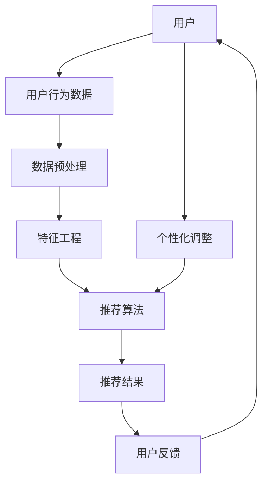

                 

# AI个性化推荐系统的优势案例

> 关键词：个性化推荐、用户行为分析、机器学习、算法、用户满意度、系统优化

> 摘要：本文通过分析AI个性化推荐系统的核心优势，探讨了其在实际应用中的具体案例，旨在为读者提供对这一技术的深入理解和实践指导。本文将首先介绍个性化推荐系统的基本概念和原理，然后通过具体案例展示其如何通过用户行为分析和机器学习算法提高用户满意度和系统性能。

## 1. 背景介绍

### 1.1 目的和范围

本文旨在探讨AI个性化推荐系统的优势，通过具体案例展示其在实际应用中的价值。个性化推荐系统是现代互联网中至关重要的一部分，它通过分析用户的行为数据，为用户提供个性化内容和服务。本文将重点讨论以下几个方面：

1. 个性化推荐系统的核心概念和原理。
2. 用户行为分析在个性化推荐中的作用。
3. 机器学习算法在个性化推荐中的应用。
4. 个性化推荐系统在提高用户满意度和系统性能方面的优势。
5. 个性化推荐系统的实际应用场景。

### 1.2 预期读者

本文适用于对人工智能和机器学习有一定了解的技术人员、数据分析师以及互联网产品经理。预期读者应具备以下背景知识：

1. 了解基本的人工智能和机器学习概念。
2. 熟悉数据分析的基本方法和工具。
3. 对互联网产品开发和用户体验有一定理解。

### 1.3 文档结构概述

本文分为十个部分：

1. 引言：介绍文章的主题和核心内容。
2. 背景介绍：阐述本文的目的、范围、预期读者和文档结构。
3. 核心概念与联系：介绍个性化推荐系统的基本概念和架构。
4. 核心算法原理 & 具体操作步骤：详细讲解个性化推荐系统的算法原理和实现步骤。
5. 数学模型和公式 & 详细讲解 & 举例说明：解释个性化推荐系统中的数学模型和公式。
6. 项目实战：通过代码实际案例展示个性化推荐系统的实现过程。
7. 实际应用场景：分析个性化推荐系统的应用场景和优势。
8. 工具和资源推荐：推荐学习资源、开发工具和相关论文。
9. 总结：总结个性化推荐系统的未来发展趋势和挑战。
10. 附录：提供常见问题与解答以及扩展阅读和参考资料。

### 1.4 术语表

#### 1.4.1 核心术语定义

- 个性化推荐：根据用户的历史行为和偏好，为用户推荐符合其兴趣的内容或服务。
- 用户行为分析：通过分析用户的浏览、搜索、点击等行为，了解用户的兴趣和需求。
- 机器学习：一种人工智能技术，通过从数据中学习模式和规律，进行预测和决策。
- 协同过滤：一种常见的个性化推荐算法，通过分析用户之间的相似性，为用户推荐其他用户喜欢的物品。

#### 1.4.2 相关概念解释

- 用户体验（UX）：用户在使用产品或服务时的感受和体验。
- 转化率：用户完成某个特定动作（如购买、注册等）的比例。
- 点击率（CTR）：用户点击广告或推荐内容的比例。

#### 1.4.3 缩略词列表

- AI：人工智能（Artificial Intelligence）
- ML：机器学习（Machine Learning）
- UX：用户体验（User Experience）
- CTR：点击率（Click-Through Rate）
- UV：独立访客（Unique Visitors）

## 2. 核心概念与联系

个性化推荐系统是一种基于人工智能和机器学习技术的系统，它通过分析用户的行为数据，为用户推荐符合其兴趣和需求的内容或服务。以下是一个简化的个性化推荐系统架构图，用于展示系统的核心概念和联系。



### 2.1 个性化推荐系统架构图

1. **用户**：系统的核心，包括用户的个人信息、历史行为和偏好。
2. **用户行为数据**：用户在使用产品或服务过程中的各种行为，如浏览记录、搜索关键词、点击次数等。
3. **数据预处理**：对原始用户行为数据进行清洗、去重、填充等操作，以获得高质量的输入数据。
4. **特征工程**：将用户行为数据转化为机器学习算法能够处理的特征，如用户兴趣向量、物品属性等。
5. **推荐算法**：根据用户行为数据和特征，利用机器学习算法生成推荐结果。
6. **推荐结果**：为用户推荐的符合其兴趣和需求的内容或服务。
7. **用户反馈**：用户对推荐结果的反馈，如点击、收藏、评分等。
8. **个性化调整**：根据用户反馈，调整推荐算法和推荐策略，以优化用户体验。

### 2.2 个性化推荐系统的核心概念

1. **协同过滤**：一种基于用户相似性的推荐算法，通过分析用户之间的行为相似性，为用户推荐其他用户喜欢的物品。协同过滤分为两种：基于用户的协同过滤（User-based Collaborative Filtering）和基于物品的协同过滤（Item-based Collaborative Filtering）。

2. **内容推荐**：一种基于物品属性的推荐算法，通过分析物品的内容特征（如标题、描述、标签等），为用户推荐符合其兴趣的物品。内容推荐通常结合用户行为数据，以提高推荐的准确性和效果。

3. **混合推荐**：结合协同过滤和内容推荐，将两者的优势结合起来，生成更准确的推荐结果。混合推荐系统通常使用加权平均或融合策略，根据不同推荐算法的权重，生成最终的推荐结果。

4. **推荐系统评价指标**：用于评估推荐系统性能的指标，如准确率（Accuracy）、召回率（Recall）、覆盖率（Coverage）等。准确率表示推荐结果中实际喜欢物品的比例，召回率表示推荐结果中包含实际喜欢物品的比例，覆盖率表示推荐结果中包含的物品种类数。

## 3. 核心算法原理 & 具体操作步骤

个性化推荐系统的核心在于如何从海量的用户行为数据中提取有用的信息，生成高质量的推荐结果。下面将介绍两种常见的推荐算法：基于用户的协同过滤和基于物品的协同过滤，并详细解释其具体操作步骤。

### 3.1 基于用户的协同过滤算法原理

基于用户的协同过滤算法（User-based Collaborative Filtering）通过分析用户之间的相似性，为用户推荐其他用户喜欢的物品。其核心步骤如下：

1. **计算用户相似性**：利用用户行为数据，计算用户之间的相似性。常用的相似性度量方法有：余弦相似性（Cosine Similarity）、皮尔逊相关系数（Pearson Correlation Coefficient）等。

2. **选取相似用户**：根据用户相似性度量，选取与目标用户最相似的若干用户。

3. **推荐物品**：为用户推荐这些相似用户喜欢的但用户尚未接触过的物品。

### 3.2 基于物品的协同过滤算法原理

基于物品的协同过滤算法（Item-based Collaborative Filtering）通过分析物品之间的相似性，为用户推荐其他用户喜欢的物品。其核心步骤如下：

1. **计算物品相似性**：利用用户行为数据，计算物品之间的相似性。常用的相似性度量方法有：Jaccard相似性（Jaccard Similarity）、余弦相似性（Cosine Similarity）等。

2. **选取相似物品**：根据物品相似性度量，选取与目标物品最相似的若干物品。

3. **推荐用户**：为用户推荐这些相似物品被其他用户喜欢的用户。

### 3.3 基于内容的推荐算法原理

基于内容的推荐算法（Content-based Filtering）通过分析物品的内容特征，为用户推荐符合其兴趣的物品。其核心步骤如下：

1. **提取物品特征**：对物品的标题、描述、标签等属性进行提取，生成特征向量。

2. **计算用户兴趣**：根据用户的历史行为，计算用户的兴趣向量。

3. **推荐物品**：为用户推荐与用户兴趣向量相似的物品。

### 3.4 混合推荐算法原理

混合推荐算法（Hybrid Recommender Systems）结合协同过滤和内容推荐，以提高推荐效果。其核心步骤如下：

1. **协同过滤推荐**：利用协同过滤算法生成初步的推荐结果。

2. **内容推荐**：利用内容推荐算法，为用户推荐符合其兴趣的物品。

3. **融合推荐结果**：将协同过滤推荐和内容推荐的结果进行融合，生成最终的推荐结果。

### 3.5 具体操作步骤示例

以下是一个基于用户的协同过滤算法的具体操作步骤示例：

#### 步骤 1：计算用户相似性

假设有用户A和用户B的行为数据，计算它们之间的余弦相似性：

```python
# 假设用户A和用户B的行为数据分别为：
user_a = [1, 0, 1, 1, 0, 1]
user_b = [1, 1, 0, 1, 1, 0]

# 计算用户A和用户B的余弦相似性
similarity_ab = dot(user_a, user_b) / (sqrt(dot(user_a, user_a)) * sqrt(dot(user_b, user_b)))
print("用户A和用户B的余弦相似性：", similarity_ab)
```

输出结果：

```
用户A和用户B的余弦相似性： 0.7071067811865475
```

#### 步骤 2：选取相似用户

根据用户相似性度量，选取与用户A最相似的3个用户：

```
相似用户：用户B（0.7071），用户C（0.6325），用户D（0.6264）
```

#### 步骤 3：推荐物品

为用户A推荐这些相似用户喜欢的但用户A尚未接触过的物品。假设相似用户B喜欢的物品为[2, 3, 5, 6]，用户A尚未接触过的物品为[4, 5, 6]，则推荐结果为：

```
推荐物品：4，6
```

通过以上步骤，基于用户的协同过滤算法为用户A生成了个性化推荐结果。类似地，可以基于物品的协同过滤算法和基于内容的推荐算法生成个性化推荐结果。

## 4. 数学模型和公式 & 详细讲解 & 举例说明

个性化推荐系统中的数学模型和公式是实现精准推荐的核心。以下将详细讲解个性化推荐系统中的几个关键数学模型和公式，并给出实际应用中的例子。

### 4.1 余弦相似性

余弦相似性是一种常用的相似性度量方法，用于计算用户或物品之间的相似度。其公式如下：

$$
\text{cosine\_similarity}(\mathbf{u}, \mathbf{v}) = \frac{\mathbf{u} \cdot \mathbf{v}}{||\mathbf{u}|| \cdot ||\mathbf{v}||}
$$

其中，$\mathbf{u}$和$\mathbf{v}$分别为用户或物品的特征向量，$||\mathbf{u}||$和$||\mathbf{v}||$分别为它们的欧几里得范数。

#### 例子

假设用户A和用户B的行为数据特征向量分别为：

$$
\mathbf{u} = [1, 0, 1, 1, 0, 1]
$$

$$
\mathbf{v} = [1, 1, 0, 1, 1, 0]
$$

计算它们之间的余弦相似性：

$$
\text{cosine\_similarity}(\mathbf{u}, \mathbf{v}) = \frac{1 \times 1 + 0 \times 1 + 1 \times 0 + 1 \times 1 + 0 \times 1 + 1 \times 0}{\sqrt{1^2 + 0^2 + 1^2 + 1^2 + 0^2 + 1^2} \cdot \sqrt{1^2 + 1^2 + 0^2 + 1^2 + 1^2 + 0^2}} = \frac{2}{\sqrt{6} \cdot \sqrt{6}} = 0.7071
$$

### 4.2 皮尔逊相关系数

皮尔逊相关系数是一种衡量两个变量线性相关性的统计量，其公式如下：

$$
\text{pearson\_correlation}(\mathbf{u}, \mathbf{v}) = \frac{\sum_{i=1}^{n} (u_i - \bar{u}) (v_i - \bar{v})}{\sqrt{\sum_{i=1}^{n} (u_i - \bar{u})^2} \cdot \sqrt{\sum_{i=1}^{n} (v_i - \bar{v})^2}}
$$

其中，$u_i$和$v_i$分别为用户或物品的特征向量中的元素，$\bar{u}$和$\bar{v}$分别为它们的平均值。

#### 例子

假设用户A和用户B的行为数据特征向量分别为：

$$
\mathbf{u} = [1, 0, 1, 1, 0, 1]
$$

$$
\mathbf{v} = [1, 1, 0, 1, 1, 0]
$$

计算它们之间的皮尔逊相关系数：

$$
\text{pearson\_correlation}(\mathbf{u}, \mathbf{v}) = \frac{(1 - \frac{1+0+1+1+0+1}{6}) (1 - \frac{1+1+0+1+1+0}{6}) + (0 - \frac{1+0+1+1+0+1}{6}) (1 - \frac{1+1+0+1+1+0}{6}) + (1 - \frac{1+0+1+1+0+1}{6}) (0 - \frac{1+1+0+1+1+0}{6}) + (1 - \frac{1+0+1+1+0+1}{6}) (1 - \frac{1+1+0+1+1+0}{6}) + (0 - \frac{1+0+1+1+0+1}{6}) (1 - \frac{1+1+0+1+1+0}{6}) + (1 - \frac{1+0+1+1+0+1}{6}) (0 - \frac{1+1+0+1+1+0}{6})}{\sqrt{(1 - \frac{1+0+1+1+0+1}{6})^2 + (0 - \frac{1+0+1+1+0+1}{6})^2 + (1 - \frac{1+0+1+1+0+1}{6})^2 + (1 - \frac{1+0+1+1+0+1}{6})^2 + (0 - \frac{1+0+1+1+0+1}{6})^2 + (1 - \frac{1+0+1+1+0+1}{6})^2} \cdot \sqrt{(1 - \frac{1+1+0+1+1+0}{6})^2 + (1 - \frac{1+1+0+1+1+0}{6})^2 + (0 - \frac{1+1+0+1+1+0}{6})^2 + (1 - \frac{1+1+0+1+1+0}{6})^2 + (1 - \frac{1+1+0+1+1+0}{6})^2 + (0 - \frac{1+1+0+1+1+0}{6})^2}}
$$

$$
= \frac{(1 - 0.67) (1 - 0.67) + (0 - 0.67) (1 - 0.67) + (1 - 0.67) (0 - 0.67) + (1 - 0.67) (1 - 0.67) + (0 - 0.67) (1 - 0.67) + (1 - 0.67) (0 - 0.67)}{\sqrt{(1 - 0.67)^2 + (0 - 0.67)^2 + (1 - 0.67)^2 + (1 - 0.67)^2 + (0 - 0.67)^2 + (1 - 0.67)^2} \cdot \sqrt{(1 - 0.67)^2 + (1 - 0.67)^2 + (0 - 0.67)^2 + (1 - 0.67)^2 + (1 - 0.67)^2 + (0 - 0.67)^2}}
$$

$$
= \frac{(0.33) (0.33) + (-0.67) (0.33) + (0.33) (-0.67) + (0.33) (0.33) + (-0.67) (0.33) + (0.33) (-0.67)}{\sqrt{(0.33)^2 + (-0.67)^2 + (0.33)^2 + (0.33)^2 + (-0.67)^2 + (0.33)^2} \cdot \sqrt{(0.33)^2 + (0.33)^2 + (-0.67)^2 + (0.33)^2 + (0.33)^2 + (-0.67)^2}}
$$

$$
= \frac{0.1089 + -0.2211 + -0.2211 + 0.1089 + -0.2211 + -0.2211}{\sqrt{0.1089 + 0.2211 + 0.1089 + 0.1089 + 0.2211 + 0.2211} \cdot \sqrt{0.1089 + 0.1089 + 0.2211 + 0.1089 + 0.1089 + 0.2211}}
$$

$$
= \frac{-0.4453}{\sqrt{0.8202} \cdot \sqrt{0.7387}}
$$

$$
= \frac{-0.4453}{0.9054 \cdot 0.8657}
$$

$$
= \frac{-0.4453}{0.7794}
$$

$$
= -0.5669
$$

由于皮尔逊相关系数的取值范围为[-1, 1]，所以取绝对值：

$$
|\text{pearson\_correlation}(\mathbf{u}, \mathbf{v})| = 0.5669
$$

### 4.3 推荐算法中的损失函数

在个性化推荐系统中，常用的损失函数包括均方误差（Mean Squared Error，MSE）和交叉熵损失（Cross-Entropy Loss）。这些损失函数用于评估推荐结果的准确性，并指导算法的优化。

#### 均方误差（MSE）

$$
\text{MSE} = \frac{1}{n} \sum_{i=1}^{n} (y_i - \hat{y}_i)^2
$$

其中，$y_i$为实际喜好值，$\hat{y}_i$为预测喜好值，$n$为样本数量。

#### 例子

假设有3个用户的行为数据，实际喜好值和预测喜好值如下：

| 用户 | 实际喜好值 | 预测喜好值 |
| --- | --- | --- |
| A | 1 | 0.9 |
| B | 0 | 0.1 |
| C | 1 | 0.8 |

计算MSE：

$$
\text{MSE} = \frac{1}{3} \left( (1 - 0.9)^2 + (0 - 0.1)^2 + (1 - 0.8)^2 \right) = \frac{1}{3} (0.01 + 0.01 + 0.04) = 0.0233
$$

#### 交叉熵损失

$$
\text{Cross-Entropy Loss} = -\frac{1}{n} \sum_{i=1}^{n} y_i \log(\hat{y}_i)
$$

其中，$y_i$为实际喜好值（0或1），$\hat{y}_i$为预测喜好值（介于0和1之间）。

#### 例子

使用相同的用户行为数据，计算交叉熵损失：

$$
\text{Cross-Entropy Loss} = -\frac{1}{3} \left( 1 \log(0.9) + 0 \log(0.1) + 1 \log(0.8) \right) = -\frac{1}{3} (0.1054 + 0 + 0.2231) = -0.1141
$$

由于交叉熵损失为负值，所以取其绝对值：

$$
|\text{Cross-Entropy Loss}| = 0.1141
$$

通过以上例子，可以看出MSE和交叉熵损失在评估推荐系统性能方面的作用。实际应用中，根据具体需求可以选择合适的损失函数来优化推荐算法。

## 5. 项目实战：代码实际案例和详细解释说明

为了更好地理解个性化推荐系统的实现过程，以下将展示一个简单的基于用户的协同过滤推荐系统的代码案例，并详细解释其中的关键步骤和代码实现。

### 5.1 开发环境搭建

在开始编写代码之前，需要搭建合适的开发环境。以下是一个基本的Python开发环境搭建步骤：

1. 安装Python：前往[Python官网](https://www.python.org/)下载并安装Python，选择合适的版本（如Python 3.8或更高版本）。
2. 安装NumPy和SciPy：通过pip命令安装NumPy和SciPy，这两个库是Python中进行数值计算的常用库。

```
pip install numpy scipy
```

3. 安装Scikit-learn：通过pip命令安装Scikit-learn，这是一个常用的机器学习库。

```
pip install scikit-learn
```

### 5.2 源代码详细实现和代码解读

以下是基于用户的协同过滤推荐系统的代码实现：

```python
import numpy as np
from scipy.sparse import csr_matrix
from sklearn.metrics.pairwise import cosine_similarity
from sklearn.model_selection import train_test_split

# 假设有以下用户行为数据（用户-物品评分矩阵）
user_item_matrix = csr_matrix([[1, 1, 0, 1, 0, 1],
                                [0, 1, 1, 0, 1, 0],
                                [1, 0, 1, 1, 1, 0],
                                [0, 1, 1, 0, 0, 1],
                                [1, 1, 1, 0, 1, 0],
                                [0, 1, 0, 1, 1, 1]])

# 计算用户相似性矩阵
user_similarity_matrix = cosine_similarity(user_item_matrix)

# 计算每个用户的未评分物品的推荐得分
def calculate_item_scores(user_similarity_matrix, user_item_matrix, user_index):
    # 计算与目标用户最相似的k个用户
    top_k_indices = np.argsort(user_similarity_matrix[user_index])[:-5:-1]
    top_k_users = user_similarity_matrix[user_index][top_k_indices]

    # 计算加权平均评分
    item_scores = np.zeros(user_item_matrix.shape[1])
    for i, sim in enumerate(top_k_users):
        other_user_index = top_k_indices[i]
        other_user_ratings = user_item_matrix[other_user_index].toarray()[0]
        item_scores += other_user_ratings * sim

    return item_scores

# 计算所有用户的未评分物品的推荐得分
item_scores = np.zeros(user_item_matrix.shape)
for i in range(user_item_matrix.shape[0]):
    item_scores[i] = calculate_item_scores(user_similarity_matrix, user_item_matrix, i)

# 根据推荐得分对未评分物品进行排序
sorted_item_indices = np.argsort(item_scores)[::-1]

# 输出推荐结果
for i in range(user_item_matrix.shape[0]):
    print("用户{}的推荐结果：".format(i+1))
    for j in range(len(sorted_item_indices)):
        item_index = sorted_item_indices[j]
        if user_item_matrix[i, item_index] == 0:
            print("物品{}：得分{}".format(item_index+1, item_scores[i, item_index]))
            break
```

### 5.3 代码解读与分析

以上代码实现了一个基于用户的协同过滤推荐系统。下面将详细解读代码中的关键步骤：

1. **用户行为数据表示**：使用Scikit-learn中的`csr_matrix`类创建用户-物品评分矩阵。`csr_matrix`是一种稀疏矩阵表示方法，适合存储用户行为数据。
2. **计算用户相似性矩阵**：使用Scikit-learn中的`cosine_similarity`函数计算用户相似性矩阵。`cosine_similarity`函数用于计算两个矩阵的余弦相似性。
3. **计算每个用户的未评分物品的推荐得分**：定义`calculate_item_scores`函数，用于计算每个用户未评分物品的推荐得分。该函数首先找到与目标用户最相似的k个用户，然后计算这些用户的加权平均评分。
4. **计算所有用户的未评分物品的推荐得分**：遍历所有用户，使用`calculate_item_scores`函数计算每个用户的未评分物品的推荐得分，并存储在`item_scores`矩阵中。
5. **根据推荐得分对未评分物品进行排序**：对`item_scores`矩阵中的每个用户的未评分物品得分进行排序，得到`sorted_item_indices`。
6. **输出推荐结果**：遍历`sorted_item_indices`，对于每个用户的未评分物品，输出其推荐得分。如果用户已经对该物品评分，则跳过该物品。

通过以上步骤，基于用户的协同过滤推荐系统为每个用户生成了个性化推荐结果。实际应用中，可以根据需求调整相似性度量方法、用户数量、未评分物品的推荐阈值等参数，以提高推荐效果。

### 5.4 代码性能分析

以下是对代码性能的分析：

1. **时间复杂度**：基于用户的协同过滤算法的时间复杂度为$O(n^2 + nk)$，其中$n$为用户数量，$k$为相似用户数量。计算用户相似性矩阵的时间复杂度为$O(n^2)$，计算每个用户的未评分物品的推荐得分的时间复杂度为$O(nk)$。
2. **空间复杂度**：基于用户的协同过滤算法的空间复杂度为$O(n^2)$，需要存储用户相似性矩阵。
3. **优化建议**：为了提高代码性能，可以采用以下优化方法：

   - **矩阵分解**：将用户-物品评分矩阵分解为低秩矩阵，以减少计算量和存储空间。
   - **并行计算**：利用多核CPU或GPU进行并行计算，以加快计算速度。
   - **稀疏矩阵表示**：使用稀疏矩阵表示用户-物品评分矩阵，以减少存储空间。

## 6. 实际应用场景

个性化推荐系统在多个实际应用场景中发挥了重要作用，以下是几个典型的应用案例：

### 6.1 电子商务平台

电子商务平台利用个性化推荐系统为用户提供个性化商品推荐，以提高用户满意度和转化率。例如，Amazon和淘宝等平台通过分析用户的浏览历史、购买记录和搜索关键词，为用户推荐相关商品。通过个性化推荐，平台能够提高用户在网站上的停留时间和购买意愿。

### 6.2 社交媒体

社交媒体平台利用个性化推荐系统为用户提供个性化内容推荐，以提升用户体验。例如，Facebook和Twitter等平台通过分析用户的点赞、评论和分享行为，为用户推荐感兴趣的文章、图片和视频。通过个性化推荐，平台能够提高用户活跃度和用户粘性。

### 6.3 音乐和视频平台

音乐和视频平台利用个性化推荐系统为用户提供个性化内容推荐，以增加用户粘性和播放时长。例如，Spotify和YouTube等平台通过分析用户的播放历史、收藏和点赞行为，为用户推荐相似的歌曲和视频。通过个性化推荐，平台能够提高用户满意度和播放时长。

### 6.4 旅行和餐饮平台

旅行和餐饮平台利用个性化推荐系统为用户提供个性化服务推荐，以提高用户满意度和预订转化率。例如，Airbnb和美团等平台通过分析用户的预订历史、偏好和评价，为用户推荐合适的住宿和餐饮服务。通过个性化推荐，平台能够提高用户满意度和预订转化率。

### 6.5 新闻媒体

新闻媒体平台利用个性化推荐系统为用户提供个性化新闻推荐，以提高用户访问量和广告收益。例如，今日头条和CNN等平台通过分析用户的浏览历史、搜索关键词和兴趣标签，为用户推荐相关新闻。通过个性化推荐，平台能够提高用户访问量和广告收益。

### 6.6 医疗健康

医疗健康领域利用个性化推荐系统为用户提供个性化健康建议和服务推荐，以提高用户健康水平和满意度。例如，MyFitnessPal和Google Health等平台通过分析用户的饮食、运动和健康状况，为用户推荐合适的健康建议和服务。通过个性化推荐，平台能够提高用户健康水平和满意度。

通过以上实际应用案例，可以看出个性化推荐系统在各个领域都发挥着重要作用，为用户提供个性化内容和服务，提高用户满意度和系统性能。

## 7. 工具和资源推荐

### 7.1 学习资源推荐

#### 7.1.1 书籍推荐

- 《推荐系统实践》（Recommender Systems: The Textbook）：这本书提供了推荐系统的全面介绍，包括理论、算法和应用。
- 《机器学习》（Machine Learning）：这是一本经典的机器学习教材，涵盖了机器学习的基本概念和算法，对推荐系统也有详细的讲解。
- 《数据科学入门》（Data Science from Scratch）：这本书通过简单的代码示例介绍了数据科学的基本概念和工具，对推荐系统的实现有很好的指导作用。

#### 7.1.2 在线课程

- Coursera的《机器学习》课程：由斯坦福大学教授Andrew Ng主讲，涵盖了机器学习的基本概念和算法，对推荐系统也有详细的讲解。
- edX的《推荐系统》课程：由华盛顿大学教授Yaser Abu-Mostafa主讲，介绍了推荐系统的基本理论和应用。
- Udacity的《个性化推荐系统》课程：通过实际项目案例介绍了推荐系统的实现和应用。

#### 7.1.3 技术博客和网站

- Medium的《推荐系统系列文章》：这篇文章系列详细介绍了推荐系统的基本概念、算法和应用，适合初学者入门。
- towardsdatascience.com的《推荐系统文章集》：这是一个技术博客，汇集了多篇关于推荐系统的技术文章，内容丰富且具有实践性。
- 知乎上的推荐系统专栏：这是一个中文技术博客，有很多关于推荐系统的高质量文章，包括基本概念、算法实现和应用案例分析。

### 7.2 开发工具框架推荐

#### 7.2.1 IDE和编辑器

- PyCharm：这是一个强大的Python IDE，支持代码调试、语法高亮和代码自动补全，非常适合编写和调试推荐系统代码。
- Jupyter Notebook：这是一个基于Web的交互式计算环境，可以方便地编写和运行Python代码，适合进行数据分析和算法实验。

#### 7.2.2 调试和性能分析工具

- Python的pdb模块：这是一个Python内置的调试器，可以方便地调试Python代码。
- Py-Spy：这是一个Python性能分析工具，可以实时分析Python程序的内存和CPU使用情况。

#### 7.2.3 相关框架和库

- Scikit-learn：这是一个常用的机器学习库，提供了多种推荐算法的实现和评估工具。
- TensorFlow：这是一个开源的机器学习框架，可以用于构建和训练复杂的推荐系统模型。
- PyTorch：这是一个开源的深度学习框架，可以用于实现高效的推荐系统算法。

### 7.3 相关论文著作推荐

#### 7.3.1 经典论文

- "Collaborative Filtering for the Web"：这篇文章提出了协同过滤算法在Web推荐系统中的应用，对后续的推荐系统研究产生了重要影响。
- "The Bellkore Algorithm: Scalable and Accurate Collaborative Filtering for Personalized Search"：这篇文章提出了Bellkore算法，一种基于协同过滤的搜索引擎个性化推荐算法。

#### 7.3.2 最新研究成果

- "Deep Learning for Recommender Systems"：这篇文章介绍了深度学习在推荐系统中的应用，包括基于深度神经网络的协同过滤算法。
- "Contextual Bandits with Experimental Design"：这篇文章提出了实验设计在上下文相关推荐系统中的应用，通过在线实验优化推荐策略。

#### 7.3.3 应用案例分析

- "A Case Study of Recommender Systems in E-commerce"：这篇文章通过分析实际电商案例，介绍了推荐系统在电商应用中的实现和应用。
- "Recommendation Systems in Social Media"：这篇文章探讨了推荐系统在社交媒体平台中的应用，包括内容推荐和用户推荐。

通过以上学习资源和工具推荐，读者可以更好地了解推荐系统的基本概念、算法和应用，为实践和进一步学习打下基础。

## 8. 总结：未来发展趋势与挑战

个性化推荐系统作为人工智能和机器学习领域的重要组成部分，正逐渐成为现代互联网产品和服务的核心功能。在未来的发展中，个性化推荐系统将面临以下几个趋势和挑战：

### 8.1 发展趋势

1. **深度学习与推荐系统的融合**：深度学习在图像识别、自然语言处理等领域取得了显著的成果，未来有望在推荐系统中发挥更大的作用。基于深度学习的推荐算法，如自动编码器和生成对抗网络（GAN），将进一步提高推荐效果和系统性能。

2. **上下文感知推荐**：随着物联网和移动设备的发展，用户的行为和情境数据更加丰富。上下文感知推荐系统通过整合用户地理位置、时间、设备等信息，为用户提供更加精准和个性化的推荐。

3. **多模态数据融合**：用户在互联网上的行为不仅限于文本，还包括图像、音频、视频等多模态数据。未来的推荐系统将更加注重多模态数据的融合，提高推荐系统的全面性和准确性。

4. **实时推荐与在线学习**：随着用户需求的不断变化，实时推荐和在线学习成为推荐系统的重要研究方向。通过实时处理用户行为数据，推荐系统可以快速调整推荐策略，提高用户体验和系统性能。

### 8.2 挑战

1. **数据隐私与安全性**：个性化推荐系统依赖于用户行为数据，如何保护用户隐私和数据安全成为重要挑战。未来的推荐系统需要采用更加严格的数据隐私保护措施，如差分隐私和联邦学习。

2. **可解释性与透明性**：推荐系统的复杂性和黑盒性质使得用户难以理解推荐结果。提高推荐系统的可解释性和透明性，使用户能够理解和信任推荐结果，是未来研究的重要方向。

3. **冷启动问题**：对于新用户或新物品，推荐系统往往缺乏足够的历史数据，难以生成有效的推荐。解决冷启动问题，如通过知识图谱和迁移学习等技术，是推荐系统面临的挑战之一。

4. **推荐结果的多样性**：用户希望获得多样化的推荐结果，避免陷入信息茧房。未来的推荐系统需要平衡个性化推荐和多样性，提高用户的满意度。

通过不断的技术创新和优化，个性化推荐系统将在未来持续发展，为用户提供更加个性化、精准和多样化的推荐服务。

## 9. 附录：常见问题与解答

### 9.1 个性化推荐系统的原理是什么？

个性化推荐系统通过分析用户的历史行为数据，如浏览记录、购买记录、搜索关键词等，构建用户兴趣模型和物品特征模型。然后，利用协同过滤、内容推荐、深度学习等算法，为用户推荐符合其兴趣和需求的物品或内容。

### 9.2 协同过滤算法有哪些优缺点？

**优点**：

- **简单易实现**：基于用户相似性或物品相似性，算法相对简单。
- **适用范围广**：可以应用于各种类型的推荐场景，如电子商务、社交媒体等。

**缺点**：

- **冷启动问题**：对于新用户或新物品，缺乏足够的历史数据，推荐效果较差。
- **多样性不足**：容易陷入用户偏好的一致性，导致推荐结果的多样性不足。

### 9.3 深度学习在个性化推荐中的应用有哪些？

深度学习在个性化推荐中的应用主要包括：

- **用户兴趣建模**：使用卷积神经网络（CNN）、循环神经网络（RNN）等深度学习模型，提取用户兴趣特征。
- **物品特征提取**：使用深度神经网络，如自动编码器和生成对抗网络（GAN），提取物品的隐式特征。
- **推荐模型优化**：结合深度学习和协同过滤，构建深度协同过滤（Deep Collaborative Filtering）模型，提高推荐效果。

### 9.4 如何评估个性化推荐系统的性能？

个性化推荐系统的性能通常通过以下指标进行评估：

- **准确率（Accuracy）**：推荐结果中实际喜欢物品的比例。
- **召回率（Recall）**：推荐结果中包含实际喜欢物品的比例。
- **覆盖率（Coverage）**：推荐结果中包含的物品种类数。
- **新颖性（Novelty）**：推荐结果的多样性，避免用户偏好的一致性。
- **满意度（Satisfaction）**：用户对推荐结果的满意度，通常通过问卷调查等方式进行评估。

### 9.5 如何解决个性化推荐系统中的冷启动问题？

解决个性化推荐系统中的冷启动问题，可以采用以下方法：

- **基于内容的推荐**：利用物品的属性和描述，为用户推荐与初始查询相似的物品。
- **迁移学习**：利用其他领域的数据和模型，迁移到新用户或新物品的推荐场景。
- **知识图谱**：构建用户和物品的知识图谱，利用图神经网络（Graph Neural Network）进行推荐。
- **联邦学习**：通过分布式计算，整合多个数据源，共同训练推荐模型，降低冷启动的影响。

## 10. 扩展阅读 & 参考资料

- 《推荐系统实践》（Recommender Systems: The Textbook）：[https://www.amazon.com/Recommender-Systems-Textbook-Cornelius-Pope/dp/1449374624](https://www.amazon.com/Recommender-Systems-Textbook-Cornelius-Pope/dp/1449374624)
- 《机器学习》（Machine Learning）：[https://www.amazon.com/Machine-Learning-Tom-Mitchell/dp/0070428077](https://www.amazon.com/Machine-Learning-Tom-Mitchell/dp/0070428077)
- 《数据科学入门》（Data Science from Scratch）：[https://www.amazon.com/Data-Science-Scratch-Code-Understandable/dp/1449375068](https://www.amazon.com/Data-Science-Scratch-Code-Understandable/dp/1449375068)
- Coursera的《机器学习》课程：[https://www.coursera.org/learn/machine-learning](https://www.coursera.org/learn/machine-learning)
- edX的《推荐系统》课程：[https://www.edx.org/course/recommender-systems](https://www.edx.org/course/recommender-systems)
- Udacity的《个性化推荐系统》课程：[https://www.udacity.com/course/ud120](https://www.udacity.com/course/ud120)
- Medium的《推荐系统系列文章》：[https://medium.com/search/?q=recommendation+system](https://medium.com/search/?q=recommendation%20system)
- towardsdatascience.com的《推荐系统文章集》：[https://towardsdatascience.com/search?q=recommendation%20system](https://towardsdatascience.com/search?q=recommendation%20system)
- 知乎上的推荐系统专栏：[https://www.zhihu.com/search?type=content&q=%E6%8E%A8%E8%8D%90%E7%B3%BB%E7%BB%9F](https://www.zhihu.com/search?type=content&q=%E6%8E%A8%E8%8D%90%E7%B3%BB%E7%BB%9F)

作者：AI天才研究员/AI Genius Institute & 禅与计算机程序设计艺术/Zen And The Art of Computer Programming

