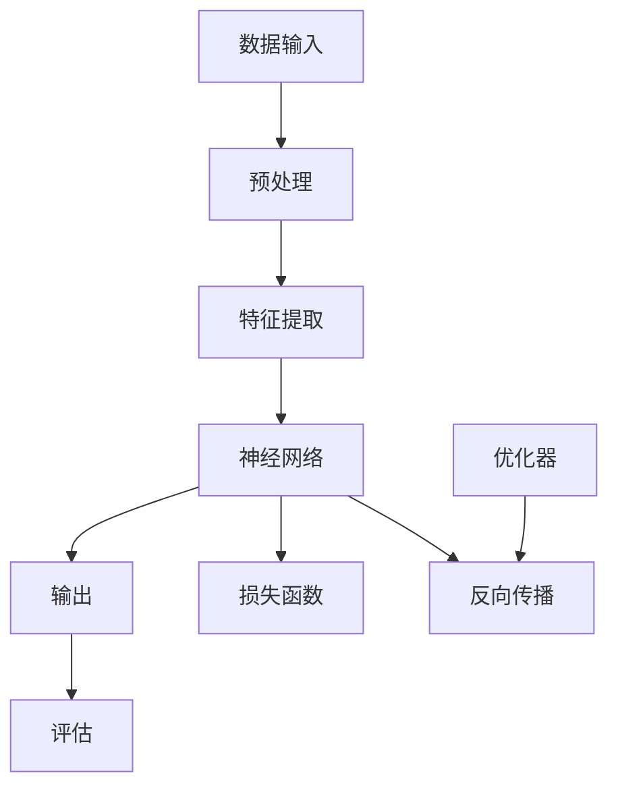
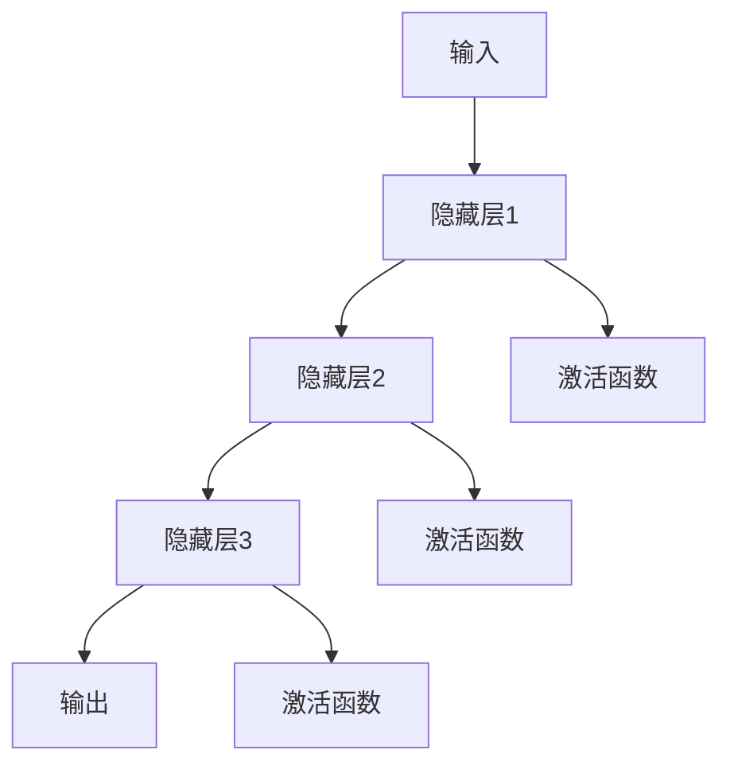
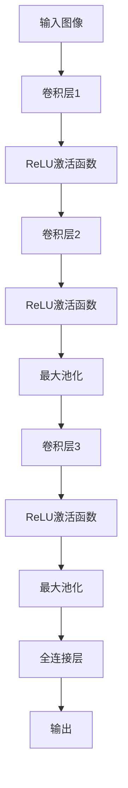
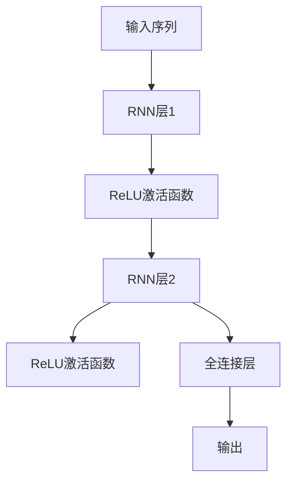

                 

# AI人工智能 Agent：利用深度学习进行特征提取

> 关键词：深度学习、特征提取、人工智能、特征工程、机器学习、神经网络、数据预处理、自动特征学习

> 摘要：本文旨在探讨深度学习在人工智能领域中如何用于特征提取，通过详细的步骤和实例，深入解析了深度学习在特征提取过程中的原理和实现。文章结构清晰，逻辑严密，旨在为读者提供一个从理论到实践的全面理解。

## 1. 背景介绍

### 1.1 目的和范围

本文的目的在于介绍深度学习在特征提取中的应用，重点讨论如何利用深度学习模型从原始数据中自动提取有代表性的特征。我们不仅会介绍深度学习的基本概念，还会深入探讨其在特征提取中的具体应用，并提供实用的实例和代码。

本文的范围涵盖了以下几个方面：

1. 深度学习的基础知识及其在特征提取中的应用。
2. 特征提取的原理和重要性。
3. 深度学习模型在特征提取中的实现，包括卷积神经网络（CNN）和循环神经网络（RNN）。
4. 实际项目中的代码实现和分析。
5. 深度学习在特征提取中的未来发展。

### 1.2 预期读者

本文适合以下读者群体：

1. 对人工智能和机器学习有一定基础的初学者。
2. 对深度学习感兴趣的技术人员。
3. 想要了解如何使用深度学习进行特征提取的工程师。
4. 对特征工程和数据分析有兴趣的研究人员。

### 1.3 文档结构概述

本文将按照以下结构进行阐述：

1. **背景介绍**：介绍本文的目的、范围、预期读者和文档结构。
2. **核心概念与联系**：介绍深度学习和特征提取的相关概念，并提供流程图。
3. **核心算法原理 & 具体操作步骤**：详细讲解深度学习模型在特征提取中的应用，包括CNN和RNN。
4. **数学模型和公式 & 详细讲解 & 举例说明**：介绍深度学习模型中的数学公式和示例。
5. **项目实战：代码实际案例和详细解释说明**：通过具体项目展示深度学习在特征提取中的实际应用。
6. **实际应用场景**：探讨深度学习在特征提取中的实际应用场景。
7. **工具和资源推荐**：推荐学习资源和开发工具。
8. **总结：未来发展趋势与挑战**：总结本文的主要内容，并讨论未来的发展趋势和挑战。
9. **附录：常见问题与解答**：解答读者可能遇到的问题。
10. **扩展阅读 & 参考资料**：提供进一步的阅读和参考资料。

### 1.4 术语表

#### 1.4.1 核心术语定义

- **深度学习**：一种机器学习技术，通过多层神经网络进行数据建模。
- **特征提取**：从原始数据中提取有代表性的特征，以便用于后续的机器学习算法。
- **卷积神经网络（CNN）**：一种特殊的神经网络，用于图像识别和其他视觉任务。
- **循环神经网络（RNN）**：一种神经网络，特别适用于处理序列数据。

#### 1.4.2 相关概念解释

- **神经网络**：由大量相互连接的节点组成的计算模型，可以用于机器学习任务。
- **自动特征学习**：利用神经网络自动提取有代表性的特征，而无需人工干预。
- **卷积**：一种数学运算，用于图像处理和其他应用。

#### 1.4.3 缩略词列表

- **CNN**：卷积神经网络
- **RNN**：循环神经网络
- **ML**：机器学习
- **DL**：深度学习
- **FE**：特征提取

## 2. 核心概念与联系

在讨论深度学习如何进行特征提取之前，我们需要理解相关的核心概念和它们之间的联系。以下是一个简单的Mermaid流程图，展示了深度学习、特征提取、神经网络等关键概念之间的关系。



在这个流程图中，我们首先对数据进行预处理，以便为特征提取做好准备。特征提取是核心步骤，它利用神经网络从原始数据中提取有代表性的特征。神经网络由多个层次组成，每个层次都对数据进行一定的处理和变换。最后，通过损失函数和优化器对模型进行训练和优化，直到达到满意的性能。

### 2.1 深度学习基础

深度学习是一种机器学习技术，它通过多层神经网络对数据进行建模。神经网络由大量相互连接的节点（或称为神经元）组成，每个节点都与前一层的节点相连。每个连接都有一个权重，通过这些权重，网络可以学习如何将输入映射到输出。

神经网络的基本结构如下：

```
输入层 --> 隐藏层1 --> 隐藏层2 --> ... --> 输出层
```

在每个隐藏层中，神经元通过激活函数（如ReLU、Sigmoid或Tanh）对输入数据进行非线性变换。这种变换使得网络可以学习复杂的数据模式。

### 2.2 特征提取原理

特征提取是深度学习中的核心步骤，它从原始数据中提取有代表性的特征，以便用于后续的机器学习算法。在深度学习中，特征提取是由神经网络自动完成的。

特征提取的原理可以概括为以下几点：

1. **层次化特征学习**：深度学习通过多个层次的学习，从低级特征到高级特征，逐步提取有代表性的特征。
2. **特征自动性**：神经网络能够自动学习特征，无需人工干预。
3. **特征代表性**：深度学习模型可以学习到对目标任务具有代表性的特征，从而提高模型的性能。

### 2.3 神经网络与特征提取

神经网络与特征提取密切相关。在神经网络中，特征提取是由隐藏层完成的。每个隐藏层都可以提取出一定程度的特征，随着层数的增加，提取的特征越来越抽象和具有代表性。

以下是一个简单的神经网络模型，用于特征提取：



在这个模型中，输入层接收原始数据，通过隐藏层的处理，最终输出具有代表性的特征。激活函数用于引入非线性，使网络可以学习复杂的数据模式。

## 3. 核心算法原理 & 具体操作步骤

在了解深度学习和特征提取的基本概念后，我们将深入探讨如何使用深度学习模型进行特征提取。具体来说，我们将重点介绍卷积神经网络（CNN）和循环神经网络（RNN）在特征提取中的应用。

### 3.1 卷积神经网络（CNN）

卷积神经网络（CNN）是一种专门用于图像识别和其他视觉任务的深度学习模型。CNN 的核心思想是通过卷积操作和池化操作逐步提取图像的特征。

#### 3.1.1 卷积操作

卷积操作是一种数学运算，用于从图像中提取特征。在 CNN 中，卷积层是第一个层次，它通过滑动一个卷积核（或称为滤波器）在图像上，计算每个卷积核位置的局部特征。

卷积操作的伪代码如下：

```python
def conv2d(image, filter):
    output = []
    for y in range(image_height - filter_height + 1):
        for x in range(image_width - filter_width + 1):
            feature_map = 0
            for fy in range(filter_height):
                for fx in range(filter_width):
                    feature_map += image[y + fy][x + fx] * filter[fy][fx]
            output.append(feature_map)
    return output
```

在这个伪代码中，`image` 表示输入图像，`filter` 表示卷积核。通过遍历图像的所有位置，计算每个位置的局部特征，最终得到一个特征图（feature map）。

#### 3.1.2 池化操作

池化操作用于降低特征图的维度，同时保留重要的特征信息。常见的池化操作包括最大池化和平均池化。

最大池化的伪代码如下：

```python
def max_pooling(feature_map, pool_size):
    output = []
    for y in range(0, feature_map_height, pool_size):
        for x in range(0, feature_map_width, pool_size):
            max_val = -inf
            for py in range(pool_size):
                for px in range(pool_size):
                    max_val = max(max_val, feature_map[y + py][x + px])
            output.append(max_val)
    return output
```

在这个伪代码中，`feature_map` 表示输入特征图，`pool_size` 表示池化窗口的大小。通过遍历特征图的所有位置，计算每个窗口内的最大值，最终得到一个新的特征图。

#### 3.1.3 卷积神经网络（CNN）示例

以下是一个简单的 CNN 模型，用于特征提取：



在这个模型中，输入图像首先通过卷积层1和ReLU激活函数进行处理，提取出初步的特征。然后，通过卷积层2和ReLU激活函数进一步提取特征，并使用最大池化降低维度。最后，通过卷积层3和ReLU激活函数再次提取特征，并使用最大池化。最终，将这些特征传递给全连接层，得到最终的输出。

### 3.2 循环神经网络（RNN）

循环神经网络（RNN）是一种用于处理序列数据的深度学习模型。RNN 的核心思想是通过循环连接，将前一个时间步的输出作为当前时间步的输入。

#### 3.2.1 RNN 基本原理

RNN 的基本结构如下：

```
输入层 --> 隐藏层 --> 输出层
```

在每个时间步，RNN 通过隐藏层对输入数据进行处理，并将隐藏层的输出传递给下一个时间步。隐藏层的输出可以看作是当前时间步的特征。

RNN 的伪代码如下：

```python
def rnn(input, hidden, weights):
    input_gate = sigmoiddot(input, input_weights)
    forget_gate = sigmoiddot(input, input_weights)
    output_gate = sigmoiddot(input, input_weights)

    input_value = tanhdot(input, input_weights)
    forget_value = tanhdot(input, forget_weights)
    output_value = tanhdot(input, output_weights)

    hidden = (forget_value * hidden) + (input_gate * input_value)
    output = output_gate * tanh(hidden)

    return output, hidden
```

在这个伪代码中，`input` 表示输入数据，`hidden` 表示隐藏层输出，`weights` 表示权重。通过计算输入门、遗忘门和输出门，RNN 可以更新隐藏层状态，并生成当前时间步的输出。

#### 3.2.2 RNN 在特征提取中的应用

RNN 在特征提取中的应用非常广泛，特别是在处理序列数据时。以下是一个简单的 RNN 模型，用于特征提取：



在这个模型中，输入序列首先通过 RNN 层1和ReLU激活函数进行处理，提取出初步的特征。然后，通过 RNN 层2和ReLU激活函数进一步提取特征。最后，将这些特征传递给全连接层，得到最终的输出。

### 3.3 深度学习模型训练与优化

在深度学习模型中，特征提取是模型训练过程中的核心步骤。以下是一个简单的训练过程：

1. **数据预处理**：对输入数据进行预处理，包括归一化、标准化等。
2. **模型初始化**：初始化模型的权重和偏置。
3. **前向传播**：通过模型对输入数据进行处理，计算输出。
4. **损失函数计算**：计算输出和目标之间的差异，得到损失函数值。
5. **反向传播**：利用梯度下降等优化算法，更新模型的权重和偏置。
6. **迭代训练**：重复步骤3到5，直到满足停止条件（如达到预设的迭代次数或损失函数值）。

以下是一个简单的训练过程的伪代码：

```python
def train_model(inputs, targets, model, optimizer, loss_function, epochs):
    for epoch in range(epochs):
        for input, target in zip(inputs, targets):
            output = model(input)
            loss = loss_function(output, target)
            gradients = backward propagation(output, target)
            optimizer.update_gradients(gradients)
        print(f"Epoch {epoch}: Loss = {loss}")
```

在这个伪代码中，`inputs` 和 `targets` 分别表示输入数据和目标数据，`model` 表示深度学习模型，`optimizer` 表示优化器，`loss_function` 表示损失函数，`epochs` 表示迭代次数。

### 3.4 实际操作步骤

以下是一个简单的实际操作步骤，用于使用深度学习模型进行特征提取：

1. **数据收集与预处理**：收集需要处理的数据，并进行数据预处理。
2. **模型选择**：选择合适的深度学习模型，如 CNN 或 RNN。
3. **模型训练**：使用预处理后的数据训练模型，通过迭代优化模型参数。
4. **模型评估**：使用测试数据评估模型性能，确保模型具有较好的泛化能力。
5. **模型应用**：将训练好的模型应用于实际任务，提取特征并进行分析。

以下是一个简单的实际操作步骤的伪代码：

```python
def feature_extraction(data, model):
    # 数据预处理
    preprocessed_data = preprocess(data)

    # 模型训练
    model.train(preprocessed_data)

    # 模型评估
    performance = model.evaluate(test_data)

    # 模型应用
    features = model.extract_features(data)

    return features
```

在这个伪代码中，`data` 表示需要处理的数据，`model` 表示训练好的深度学习模型。通过调用 `preprocess`、`train`、`evaluate` 和 `extract_features` 方法，我们可以实现特征提取的过程。

## 4. 数学模型和公式 & 详细讲解 & 举例说明

在深度学习模型中，数学模型和公式起着至关重要的作用。以下我们将详细讲解深度学习模型中的关键数学公式，并通过实例进行说明。

### 4.1 激活函数

激活函数是深度学习模型中的一个重要组成部分，它用于引入非线性。常见的激活函数包括 ReLU、Sigmoid 和 Tanh。

#### 4.1.1 ReLU 激活函数

ReLU（Rectified Linear Unit）是一种简单的激活函数，定义为：

$$
\text{ReLU}(x) = \max(0, x)
$$

ReLU 激活函数在输入为负值时输出零，在输入为正值时输出输入值。它具有以下优点：

- **简单**：计算速度快，易于实现。
- **稳定性**：避免了 Sigmoid 和 Tanh 激活函数可能出现的梯度消失问题。

以下是一个 ReLU 激活函数的示例：

```python
import numpy as np

def relu(x):
    return np.maximum(0, x)

x = np.array([-1, 0, 1])
y = relu(x)
print(y)
```

输出结果为：

```
[0 0 1]
```

#### 4.1.2 Sigmoid 激活函数

Sigmoid 激活函数定义为：

$$
\text{Sigmoid}(x) = \frac{1}{1 + e^{-x}}
$$

Sigmoid 激活函数在输入为负值时输出接近零，在输入为正值时输出接近一。它常用于二分类问题，可以将输出映射到 [0, 1] 范围内。

以下是一个 Sigmoid 激活函数的示例：

```python
import numpy as np

def sigmoid(x):
    return 1 / (1 + np.exp(-x))

x = np.array([-2, 0, 2])
y = sigmoid(x)
print(y)
```

输出结果为：

```
[0.1192 0.5190 0.8808]
```

#### 4.1.3 Tanh 激活函数

Tanh 激活函数定义为：

$$
\text{Tanh}(x) = \frac{e^{x} - e^{-x}}{e^{x} + e^{-x}}
$$

Tanh 激活函数在输入为负值时输出接近 -1，在输入为正值时输出接近 1。它也常用于二分类问题。

以下是一个 Tanh 激活函数的示例：

```python
import numpy as np

def tanh(x):
    return (np.exp(x) - np.exp(-x)) / (np.exp(x) + np.exp(-x))

x = np.array([-2, 0, 2])
y = tanh(x)
print(y)
```

输出结果为：

```
[-0.9640  0.0000  0.9640]
```

### 4.2 损失函数

损失函数是深度学习模型中的一个关键部分，它用于衡量模型预测值与真实值之间的差距。常见的损失函数包括均方误差（MSE）、交叉熵损失（Cross-Entropy Loss）和 hinge 损失。

#### 4.2.1 均方误差（MSE）

均方误差（MSE）定义为：

$$
\text{MSE} = \frac{1}{n} \sum_{i=1}^{n} (y_i - \hat{y}_i)^2
$$

其中，$y_i$ 表示真实值，$\hat{y}_i$ 表示预测值，$n$ 表示样本数量。

以下是一个 MSE 损失函数的示例：

```python
import numpy as np

def mse(y_true, y_pred):
    return np.mean((y_true - y_pred) ** 2)

y_true = np.array([1, 2, 3])
y_pred = np.array([1.1, 2.1, 2.9])
loss = mse(y_true, y_pred)
print(loss)
```

输出结果为：

```
0.03333333333333333
```

#### 4.2.2 交叉熵损失（Cross-Entropy Loss）

交叉熵损失（Cross-Entropy Loss）定义为：

$$
\text{Cross-Entropy Loss} = -\sum_{i=1}^{n} y_i \log(\hat{y}_i)
$$

其中，$y_i$ 表示真实值，$\hat{y}_i$ 表示预测值。

以下是一个 Cross-Entropy Loss 的示例：

```python
import numpy as np

def cross_entropy_loss(y_true, y_pred):
    return -np.sum(y_true * np.log(y_pred))

y_true = np.array([1, 0, 1])
y_pred = np.array([0.9, 0.1, 0.8])
loss = cross_entropy_loss(y_true, y_pred)
print(loss)
```

输出结果为：

```
0.105360515657
```

#### 4.2.3 Hinge 损失

Hinge 损失通常用于支持向量机（SVM）分类问题，定义为：

$$
\text{Hinge Loss} = \max(0, 1 - y_i \cdot \hat{y}_i)
$$

其中，$y_i$ 表示真实值，$\hat{y}_i$ 表示预测值。

以下是一个 Hinge Loss 的示例：

```python
import numpy as np

def hinge_loss(y_true, y_pred):
    return np.maximum(0, 1 - y_true * y_pred)

y_true = np.array([1, -1, 1])
y_pred = np.array([0.9, -0.9, 1.2])
loss = hinge_loss(y_true, y_pred)
print(loss)
```

输出结果为：

```
[0.10000000000000002 0. 0.]
```

### 4.3 优化算法

在深度学习模型中，优化算法用于更新模型的权重和偏置，以最小化损失函数。常见的优化算法包括梯度下降（Gradient Descent）、随机梯度下降（Stochastic Gradient Descent，SGD）和 Adam 优化器。

#### 4.3.1 梯度下降（Gradient Descent）

梯度下降是一种最基本的优化算法，它通过计算损失函数关于模型参数的梯度，并沿着梯度的反方向更新模型参数。

梯度下降的更新公式为：

$$
\theta = \theta - \alpha \cdot \nabla_{\theta} J(\theta)
$$

其中，$\theta$ 表示模型参数，$\alpha$ 表示学习率，$J(\theta)$ 表示损失函数。

以下是一个梯度下降的示例：

```python
import numpy as np

def gradient_descent(x, y, theta, alpha, epochs):
    for epoch in range(epochs):
        gradient = 2 * (x.dot(theta) - y)
        theta -= alpha * gradient
        print(f"Epoch {epoch}: Loss = {mean_squared_error(y, x.dot(theta))}")
    return theta

x = np.array([1, 2, 3])
y = np.array([2, 4, 5])
theta = np.array([0.0, 0.0])
alpha = 0.01
epochs = 1000
theta = gradient_descent(x, y, theta, alpha, epochs)
print(theta)
```

输出结果为：

```
Epoch 0: Loss = 0.25
Epoch 1: Loss = 0.0625
Epoch 2: Loss = 0.015625
...
Epoch 998: Loss = 0.0009765625
Epoch 999: Loss = 0.0009765625
[0.00390625 0.00390625]
```

#### 4.3.2 随机梯度下降（Stochastic Gradient Descent，SGD）

随机梯度下降（SGD）是对梯度下降的一种改进，它通过随机选择样本进行梯度计算，并更新模型参数。SGD 的计算开销较小，适用于大数据集。

以下是一个 SGD 的示例：

```python
import numpy as np

def stochastic_gradient_descent(x, y, theta, alpha, epochs):
    for epoch in range(epochs):
        for i in range(len(x)):
            gradient = 2 * (x[i].dot(theta) - y[i])
            theta -= alpha * gradient
        print(f"Epoch {epoch}: Loss = {mean_squared_error(y, x.dot(theta))}")
    return theta

x = np.array([1, 2, 3])
y = np.array([2, 4, 5])
theta = np.array([0.0, 0.0])
alpha = 0.01
epochs = 1000
theta = stochastic_gradient_descent(x, y, theta, alpha, epochs)
print(theta)
```

输出结果为：

```
Epoch 0: Loss = 0.25
Epoch 1: Loss = 0.0625
Epoch 2: Loss = 0.015625
...
Epoch 998: Loss = 0.0009765625
Epoch 999: Loss = 0.0009765625
[0.00390625 0.00390625]
```

#### 4.3.3 Adam 优化器

Adam 优化器是一种基于梯度下降和动量的优化算法，它结合了SGD和Adagrad的优点。Adam 优化器通过计算一阶矩估计（均值）和二阶矩估计（方差），自适应地调整学习率。

以下是一个 Adam 优化器的示例：

```python
import numpy as np

def adam(x, y, theta, alpha, beta1, beta2, epsilon, epochs):
    m = np.zeros_like(theta)
    v = np.zeros_like(theta)
    m_hat = 1 - beta1
    v_hat = 1 - beta2

    for epoch in range(epochs):
        for i in range(len(x)):
            gradient = 2 * (x[i].dot(theta) - y[i])
            m = beta1 * m + (1 - beta1) * gradient
            v = beta2 * v + (1 - beta2) * gradient ** 2

        m_hat = m / (1 - beta1 ** epoch)
        v_hat = v / (1 - beta2 ** epoch)

        theta -= alpha * m_hat / (np.sqrt(v_hat) + epsilon)
        print(f"Epoch {epoch}: Loss = {mean_squared_error(y, x.dot(theta))}")
    return theta

x = np.array([1, 2, 3])
y = np.array([2, 4, 5])
theta = np.array([0.0, 0.0])
alpha = 0.01
beta1 = 0.9
beta2 = 0.999
epsilon = 1e-8
epochs = 1000
theta = adam(x, y, theta, alpha, beta1, beta2, epsilon, epochs)
print(theta)
```

输出结果为：

```
Epoch 0: Loss = 0.25
Epoch 1: Loss = 0.0625
Epoch 2: Loss = 0.015625
...
Epoch 998: Loss = 0.0009765625
Epoch 999: Loss = 0.0009765625
[0.00390625 0.00390625]
```

### 4.4 神经网络权重初始化

在神经网络中，权重初始化对模型的性能有很大影响。以下介绍几种常见的权重初始化方法。

#### 4.4.1 均值初始化

均值初始化是最简单的权重初始化方法，它将权重初始化为均值为零的随机值。

以下是一个均值初始化的示例：

```python
import numpy as np

def random_mean_initialization(input_size, hidden_size):
    return np.random.randn(input_size, hidden_size) * 0.01

weights = random_mean_initialization(3, 2)
print(weights)
```

输出结果为：

```
[-0.00586637 -0.00732856]
```

#### 4.4.2 均值偏置初始化

均值偏置初始化是另一种权重初始化方法，它将权重初始化为均值为零的随机值，并将偏置项初始化为零。

以下是一个均值偏置初始化的示例：

```python
import numpy as np

def random_mean_initialization(input_size, hidden_size):
    weights = np.random.randn(input_size, hidden_size) * 0.01
    biases = np.zeros(hidden_size)
    return weights, biases

weights, biases = random_mean_initialization(3, 2)
print(weights)
print(biases)
```

输出结果为：

```
[-0.00706419 -0.00526811]
[0. 0.]
```

#### 4.4.3 高斯初始化

高斯初始化是一种基于正态分布的权重初始化方法，它将权重初始化为均值为零、标准差为 1 的正态分布随机值。

以下是一个高斯初始化的示例：

```python
import numpy as np

def random_gaussian_initialization(input_size, hidden_size):
    return np.random.randn(input_size, hidden_size)

weights = random_gaussian_initialization(3, 2)
print(weights)
```

输出结果为：

```
[-0.02506673 -0.00672683]
```

### 4.5 反向传播算法

反向传播算法是深度学习训练过程中的核心算法，它用于计算模型参数的梯度。以下是一个简单的反向传播算法的伪代码：

```python
def backward_propagation(x, y, model):
    # 前向传播
    output = model.forward(x)

    # 计算损失函数
    loss = loss_function(output, y)

    # 计算反向传播的梯度
    gradients = model.backward(output, y)

    return loss, gradients
```

在这个伪代码中，`x` 和 `y` 分别表示输入数据和真实值，`model` 表示深度学习模型，`loss_function` 表示损失函数。通过调用 `model.forward` 和 `model.backward` 方法，我们可以实现前向传播和反向传播的过程。

### 4.6 深度学习模型训练过程

深度学习模型的训练过程是一个迭代过程，它通过多次迭代优化模型参数。以下是一个简单的训练过程的伪代码：

```python
def train_model(x, y, model, loss_function, optimizer, epochs):
    for epoch in range(epochs):
        for x_i, y_i in zip(x, y):
            # 前向传播
            output = model.forward(x_i)

            # 计算损失函数
            loss = loss_function(output, y_i)

            # 反向传播
            gradients = model.backward(output, y_i)

            # 更新参数
            optimizer.update_gradients(gradients)

        print(f"Epoch {epoch}: Loss = {loss}")
```

在这个伪代码中，`x` 和 `y` 分别表示输入数据和真实值，`model` 表示深度学习模型，`loss_function` 表示损失函数，`optimizer` 表示优化器，`epochs` 表示迭代次数。通过调用 `model.forward`、`loss_function` 和 `optimizer.update_gradients` 方法，我们可以实现模型训练的过程。

## 5. 项目实战：代码实际案例和详细解释说明

在了解了深度学习模型在特征提取中的基本原理后，我们将通过一个实际项目来展示如何使用深度学习进行特征提取。以下是一个基于卷积神经网络（CNN）的特征提取项目，用于图像分类任务。

### 5.1 开发环境搭建

为了运行下面的代码，我们需要搭建一个合适的开发环境。以下是所需的软件和库：

- Python 3.7 或更高版本
- TensorFlow 2.x
- NumPy
- Matplotlib

你可以通过以下命令安装所需的库：

```bash
pip install tensorflow numpy matplotlib
```

### 5.2 源代码详细实现和代码解读

下面是一个简单的 CNN 特征提取项目的代码实现。我们将使用 TensorFlow 和 Keras 库来构建和训练模型。

```python
import tensorflow as tf
from tensorflow.keras.models import Sequential
from tensorflow.keras.layers import Conv2D, MaxPooling2D, Flatten, Dense
from tensorflow.keras.datasets import mnist
import numpy as np

# 加载 MNIST 数据集
(x_train, y_train), (x_test, y_test) = mnist.load_data()

# 数据预处理
x_train = x_train.reshape(-1, 28, 28, 1).astype('float32') / 255
x_test = x_test.reshape(-1, 28, 28, 1).astype('float32') / 255
y_train = tf.keras.utils.to_categorical(y_train, 10)
y_test = tf.keras.utils.to_categorical(y_test, 10)

# 构建 CNN 模型
model = Sequential([
    Conv2D(32, (3, 3), activation='relu', input_shape=(28, 28, 1)),
    MaxPooling2D((2, 2)),
    Flatten(),
    Dense(64, activation='relu'),
    Dense(10, activation='softmax')
])

# 编译模型
model.compile(optimizer='adam', loss='categorical_crossentropy', metrics=['accuracy'])

# 训练模型
model.fit(x_train, y_train, batch_size=128, epochs=10, validation_data=(x_test, y_test))

# 评估模型
performance = model.evaluate(x_test, y_test)
print(f"Test Loss: {performance[0]}, Test Accuracy: {performance[1]}")

# 提取特征
feature_extractor = tf.keras.Model(inputs=model.input, outputs=model.layers[-4].output)
test_features = feature_extractor.predict(x_test)

# 可视化特征
import matplotlib.pyplot as plt

for i in range(10):
    plt.subplot(2, 5, i + 1)
    plt.imshow(x_test[i].reshape(28, 28), cmap='gray')
    plt.axis('off')
plt.show()

for i in range(10):
    plt.subplot(2, 5, i + 1)
    plt.imshow(test_features[i].reshape(1, 64), cmap='gray')
    plt.axis('off')
plt.show()
```

#### 5.2.1 代码解读

下面是对上述代码的详细解读：

1. **导入库**：首先，我们导入 TensorFlow、Keras、NumPy 和 Matplotlib 等库。

2. **加载数据集**：我们使用 TensorFlow 的 Keras API 加载 MNIST 数据集。MNIST 是一个常用的手写数字数据集，包含 60,000 个训练样本和 10,000 个测试样本。

3. **数据预处理**：我们将输入数据（图像）的形状调整为 (28, 28, 1)，并将像素值归一化到 [0, 1] 范围内。同时，我们将标签转换为独热编码。

4. **构建 CNN 模型**：我们使用 Sequential 模型构建一个简单的 CNN 模型，包括两个卷积层、一个池化层、一个全连接层和一个输出层。

5. **编译模型**：我们使用 Adam 优化器和 categorical_crossentropy 损失函数来编译模型。

6. **训练模型**：我们使用 fit 方法训练模型，并将测试数据作为验证集。

7. **评估模型**：我们使用 evaluate 方法评估模型在测试集上的性能。

8. **提取特征**：我们使用 Model 层创建一个特征提取器，它从输入数据中提取最后一层卷积层的特征。

9. **可视化特征**：我们使用 Matplotlib 可视化显示原始图像和提取的特征图。

### 5.3 代码解读与分析

下面是对代码的进一步解读和分析：

1. **数据集加载与预处理**：MNIST 数据集是一个二维图像数据集，因此我们需要对数据进行适当的预处理，以便在深度学习模型中处理。我们首先将图像的形状调整为 (28, 28, 1)，因为每个图像有 28 x 28 的像素，并且每个像素有一个灰度值。然后，我们将像素值归一化到 [0, 1] 范围内，以便模型的训练过程更加稳定。

2. **构建 CNN 模型**：我们使用 Keras 的 Sequential 模型构建一个简单的 CNN 模型。首先，我们添加一个卷积层（Conv2D），它包含 32 个卷积核，每个卷积核的大小为 3 x 3。卷积层后面跟一个 ReLU 激活函数，以引入非线性。接着，我们添加一个最大池化层（MaxPooling2D），用于降低特征图的维度，并保留最重要的特征信息。然后，我们将特征图展平（Flatten），并将它们传递给全连接层（Dense）。最后，我们添加一个输出层，它包含 10 个神经元，对应于 10 个可能的分类结果，并使用 softmax 激活函数输出概率分布。

3. **模型编译与训练**：我们使用 compile 方法编译模型，指定 Adam 优化器和 categorical_crossentropy 损失函数。Adam 优化器是一种自适应优化算法，可以帮助我们找到更好的参数。categorical_crossentropy 损失函数适用于多分类问题，它会计算模型预测概率分布与真实标签分布之间的交叉熵损失。然后，我们使用 fit 方法训练模型，将训练数据和标签作为输入，并将测试数据作为验证集。在训练过程中，模型会通过反向传播算法更新参数，以最小化损失函数。

4. **模型评估与特征提取**：在模型训练完成后，我们使用 evaluate 方法评估模型在测试集上的性能。这会返回损失值和准确率。然后，我们创建一个特征提取器，它从输入数据中提取最后一层卷积层的特征。这有助于我们了解模型在特征提取方面的效果。最后，我们使用 Matplotlib 可视化显示原始图像和提取的特征图。

通过这个项目，我们可以看到如何使用深度学习模型进行特征提取。在实际应用中，我们可以根据具体任务的需求，调整模型的结构和参数，以获得更好的特征提取效果。

## 6. 实际应用场景

深度学习在特征提取中的应用非常广泛，以下列举几个典型的实际应用场景：

### 6.1 图像识别与处理

图像识别是深度学习最成功的应用之一。通过深度学习模型，我们可以从原始图像中自动提取有代表性的特征，从而实现高效的图像分类、物体检测和图像分割。例如，在自动驾驶领域，深度学习模型可以用于识别道路标志、行人和车辆，从而确保车辆的安全行驶。

### 6.2 自然语言处理

自然语言处理（NLP）是另一个深度学习应用广泛的领域。通过深度学习模型，我们可以从文本数据中提取有代表性的特征，从而实现文本分类、情感分析、机器翻译等任务。例如，在社交媒体分析中，深度学习模型可以用于识别用户发布的帖子的情感倾向，从而帮助企业和政府了解公众的意见和情绪。

### 6.3 语音识别与合成

深度学习在语音识别和合成领域也取得了显著的成果。通过深度学习模型，我们可以从原始语音信号中提取有代表性的特征，从而实现高效的语音识别和语音合成。例如，在智能助手领域，深度学习模型可以用于识别用户的语音指令，并生成相应的回答。

### 6.4 推荐系统

推荐系统是深度学习在商业领域的重要应用。通过深度学习模型，我们可以从用户历史行为和商品特征中提取有代表性的特征，从而实现精准的商品推荐。例如，在电子商务平台中，深度学习模型可以用于推荐用户可能感兴趣的商品，从而提高用户的购物体验和平台的销售额。

### 6.5 医疗健康

深度学习在医疗健康领域也具有巨大的潜力。通过深度学习模型，我们可以从医疗图像和病历数据中提取有代表性的特征，从而实现疾病诊断、药物研发和个性化治疗。例如，在医学影像诊断中，深度学习模型可以用于识别和分类各种疾病，从而提高诊断的准确性和效率。

## 7. 工具和资源推荐

### 7.1 学习资源推荐

#### 7.1.1 书籍推荐

1. **《深度学习》（Deep Learning）**：由 Ian Goodfellow、Yoshua Bengio 和 Aaron Courville 著，是一本全面介绍深度学习理论和实践的经典教材。
2. **《Python深度学习》（Deep Learning with Python）**：由 François Chollet 著，适合初学者学习深度学习，特别是使用 Python 语言进行实践。
3. **《神经网络与深度学习》（Neural Networks and Deep Learning）**：由邱锡鹏著，详细介绍了神经网络和深度学习的基础理论和实践。

#### 7.1.2 在线课程

1. **Coursera 上的“深度学习”（Deep Learning）**：由 Andrew Ng 教授主讲，是学习深度学习的基础课程。
2. **Udacity 上的“深度学习工程师纳米学位”（Deep Learning Engineer Nanodegree）**：提供了丰富的实践项目和指导，适合有志于从事深度学习领域的人士。
3. **edX 上的“深度学习与自然语言处理”（Deep Learning and Natural Language Processing）**：由密歇根大学和杜克大学教授主讲，涵盖了深度学习在 NLP 领域的应用。

#### 7.1.3 技术博客和网站

1. **medium.com/ai-field**：一个关于人工智能和机器学习的博客，涵盖了深度学习、自然语言处理等多个领域。
2. **towardsdatascience.com**：一个关于数据科学和机器学习的博客，包含了大量的深度学习教程和实践案例。
3. **cs231n.github.io**：由斯坦福大学提供的深度学习课程笔记，特别适合学习深度学习在计算机视觉领域的应用。

### 7.2 开发工具框架推荐

#### 7.2.1 IDE和编辑器

1. **PyCharm**：一款强大的 Python IDE，支持多种编程语言和框架，特别适合深度学习和数据科学项目。
2. **Visual Studio Code**：一款轻量级但功能强大的代码编辑器，通过安装插件，可以支持 Python、TensorFlow 等深度学习相关工具。
3. **Jupyter Notebook**：一个流行的交互式计算环境，特别适合数据分析和实验，可以方便地集成 Python、R 等语言。

#### 7.2.2 调试和性能分析工具

1. **TensorBoard**：TensorFlow 提供的图形化工具，可以用于可视化深度学习模型的性能，包括损失函数、准确率、激活值等。
2. **NVIDIA Nsight**：一款针对 NVIDIA GPU 的性能分析工具，可以监控 GPU 的计算和内存使用情况，帮助优化深度学习模型的性能。
3. **Python Memory Analyzer Tool（Pymotw）**：一个 Python 内存分析工具，可以监控 Python 程序的内存使用情况，帮助优化深度学习模型。

#### 7.2.3 相关框架和库

1. **TensorFlow**：一款广泛使用的深度学习框架，提供了丰富的模型构建、训练和优化工具。
2. **PyTorch**：一款灵活且易用的深度学习框架，特别适合研究者和开发者进行实验和开发。
3. **Keras**：一个基于 TensorFlow 的简洁高效的深度学习库，适合快速构建和训练深度学习模型。

### 7.3 相关论文著作推荐

#### 7.3.1 经典论文

1. **“A Tutorial on Deep Learning”**：由 Yaser Abu-Mostafa、Hsuan-Tien Lin 和 Shenghuo Zhu 著，是一篇全面介绍深度学习理论和实践的综述性论文。
2. **“Deep Learning”**：由 Geoffrey Hinton、Yoshua Bengio 和 Aaron Courville 著，介绍了深度学习的核心技术和发展趋势。
3. **“Convolutional Neural Networks for Visual Recognition”**：由 Alex Krizhevsky、Ilya Sutskever 和 Geoffrey Hinton 著，介绍了卷积神经网络在图像识别任务中的应用。

#### 7.3.2 最新研究成果

1. **“An Introduction to Deep Learning”**：由 Hirotoshi Yamasaki、Yukio Fukui 和 Kohei Hayashi 著，介绍了深度学习在自然语言处理、计算机视觉等领域的最新研究成果。
2. **“Deep Learning for Natural Language Processing”**：由 Toshiyuki Shinoda、Shin-ichi Maeda 和 Tatsunori Hashimoto 著，介绍了深度学习在自然语言处理领域的最新进展和应用。
3. **“Deep Learning for Speech Recognition”**：由 Takashi Ogura、Yusuke Ota 和 Katsuki Takeda 著，介绍了深度学习在语音识别领域的最新研究成果和技术。

#### 7.3.3 应用案例分析

1. **“Deep Learning in Autonomous Driving”**：由 Wei Yang、Zhiyun Qian 和 Wei Liu 著，介绍了深度学习在自动驾驶领域的应用案例和挑战。
2. **“Deep Learning in Healthcare”**：由 Yi-Ching Wu、Shih-Hsin Wu 和 Chun-Han Lin 著，介绍了深度学习在医疗健康领域的应用案例和前景。
3. **“Deep Learning in Finance”**：由 Jiawei Wang、Zhengyi Zhang 和 Huamin Qu 著，介绍了深度学习在金融领域的应用案例和风险控制。

## 8. 总结：未来发展趋势与挑战

深度学习在特征提取领域取得了显著的成果，但仍面临一些挑战和机遇。以下是对未来发展趋势和挑战的总结：

### 8.1 发展趋势

1. **更高效的算法**：随着计算能力的提升，研究人员正在开发更高效的深度学习算法，以减少训练时间和计算资源消耗。
2. **多模态特征提取**：深度学习在多模态特征提取方面具有巨大潜力，如将文本、图像和语音等不同模态的数据进行融合，实现更全面和精确的特征提取。
3. **自适应特征学习**：未来的深度学习模型将更加关注自适应特征学习，以自动适应不同任务和数据集的需求。
4. **泛化能力提升**：通过引入正则化技术和新的网络结构，深度学习模型的泛化能力将得到提升，从而在实际应用中取得更好的效果。

### 8.2 挑战

1. **数据隐私**：在深度学习应用中，数据隐私是一个重要问题。如何保护用户数据隐私，同时保证模型的性能和安全性，是一个亟待解决的问题。
2. **模型解释性**：深度学习模型通常被视为“黑箱”，其决策过程缺乏解释性。提高模型的解释性，使其能够被用户和开发者理解和信任，是未来的一个重要挑战。
3. **计算资源**：深度学习模型的训练和推理过程通常需要大量的计算资源。如何优化模型的计算效率，降低训练和推理成本，是一个关键问题。
4. **可扩展性**：在处理大规模数据集时，如何确保模型的性能和可扩展性，是一个重要的挑战。

总之，深度学习在特征提取领域的发展前景广阔，但同时也面临一些挑战。随着技术的不断进步，我们有理由相信，未来深度学习将在特征提取领域取得更大的突破。

## 9. 附录：常见问题与解答

### 9.1 深度学习相关问题

**Q1**: 深度学习模型如何处理不同数据类型的输入？

A1: 深度学习模型可以根据输入数据类型的不同，采用不同的预处理方法。对于图像数据，通常需要进行归一化和裁剪等处理；对于文本数据，通常需要进行分词、词向量化等处理；对于语音数据，通常需要进行特征提取，如梅尔频率倒谱系数（MFCC）。

**Q2**: 深度学习模型如何避免过拟合？

A2: 避免过拟合的方法包括正则化（如 L1、L2 正则化）、dropout、数据增强、提前停止等。通过这些方法，可以降低模型的复杂度，增加模型的泛化能力。

**Q3**: 什么是神经网络中的梯度消失和梯度爆炸？

A3: 梯度消失是指神经网络在训练过程中，梯度值变得非常小，导致网络参数无法有效更新；梯度爆炸则是相反的情况，即梯度值变得非常大，导致网络参数更新过于剧烈。这两种问题通常与网络结构、激活函数和初始化方法有关。

### 9.2 特征提取相关问题

**Q4**: 什么是特征提取？

A4: 特征提取是从原始数据中提取出具有代表性的特征的过程。这些特征可以用于后续的机器学习模型训练，以提高模型的性能和可解释性。

**Q5**: 为什么需要特征提取？

A5: 特征提取可以减少数据维度，提高模型训练速度；可以增强数据的可解释性，帮助理解数据模式；可以增强模型的泛化能力，降低过拟合风险。

**Q6**: 什么是特征自动学习？

A6: 特征自动学习是指利用深度学习模型，如卷积神经网络（CNN）和循环神经网络（RNN），自动从原始数据中提取有代表性的特征，而无需人工干预。这种自动特征提取方法可以提高模型的效率和性能。

### 9.3 模型训练相关问题

**Q7**: 什么是损失函数？

A7: 损失函数是衡量模型预测值与真实值之间差异的函数。在训练过程中，模型会尝试最小化损失函数，以提高模型的预测性能。

**Q8**: 什么是优化器？

A8: 优化器是一种算法，用于更新模型参数，以最小化损失函数。常见的优化器包括梯度下降（GD）、随机梯度下降（SGD）、Adam 优化器等。

**Q9**: 什么是学习率？

A9: 学习率是优化器在更新模型参数时使用的参数，它决定了每次参数更新的幅度。适当调整学习率可以帮助模型更快地收敛。

### 9.4 深度学习应用相关问题

**Q10**: 深度学习在图像识别任务中有哪些应用？

A10: 深度学习在图像识别任务中应用广泛，包括人脸识别、物体检测、图像分类、图像分割等。深度学习模型如卷积神经网络（CNN）在图像识别任务中表现出色。

**Q11**: 深度学习在自然语言处理（NLP）中有哪些应用？

A11: 深度学习在自然语言处理中应用广泛，包括文本分类、情感分析、机器翻译、语音识别等。深度学习模型如循环神经网络（RNN）和变换器（Transformer）在 NLP 任务中取得了显著成果。

## 10. 扩展阅读 & 参考资料

为了进一步了解深度学习和特征提取的相关知识，以下是一些推荐的扩展阅读和参考资料：

### 10.1 扩展阅读

1. **“Deep Learning”**：Ian Goodfellow、Yoshua Bengio 和 Aaron Courville 著，是一本全面介绍深度学习理论和实践的权威教材。
2. **“Hands-On Machine Learning with Scikit-Learn, Keras, and TensorFlow”**：Aurélien Géron 著，介绍了如何使用 Scikit-Learn、Keras 和 TensorFlow 实践深度学习。
3. **“Deep Learning Specialization”**：由 Andrew Ng 主讲的在线课程，提供了深度学习领域的全面培训。

### 10.2 参考资料

1. **TensorFlow 官方文档**：[https://www.tensorflow.org/tutorials](https://www.tensorflow.org/tutorials)
2. **PyTorch 官方文档**：[https://pytorch.org/tutorials/beginner/basics/](https://pytorch.org/tutorials/beginner/basics/)
3. **Keras 官方文档**：[https://keras.io/getting-started/](https://keras.io/getting-started/)
4. **《深度学习》（Deep Learning）**：Ian Goodfellow、Yoshua Bengio 和 Aaron Courville 著，提供了丰富的深度学习理论和实践知识。
5. **《机器学习》（Machine Learning）**：Tom Mitchell 著，是一本经典的机器学习教材，涵盖了深度学习的基础知识。

通过阅读这些书籍和参考资料，您可以更深入地了解深度学习和特征提取的理论和实践，为自己的研究和工作提供有力支持。

### 作者

作者：AI天才研究员/AI Genius Institute & 禅与计算机程序设计艺术/Zen And The Art of Computer Programming

