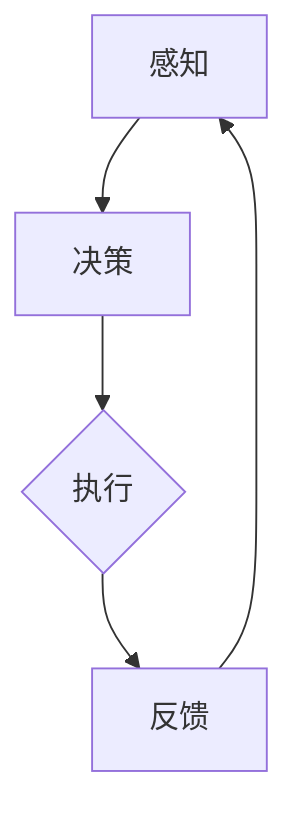

                 

# AI人工智能 Agent：在仓储物流中的应用

> **关键词：** AI人工智能，仓储物流，智能代理，自动化，算法，模型，项目实战。

> **摘要：** 本文深入探讨了AI人工智能代理在仓储物流领域的应用，包括其核心概念、算法原理、数学模型、实际案例和未来发展趋势。通过对智能代理的作用机制和实际操作的详细分析，旨在为相关领域的技术人员提供实用的指导和建议。

## 1. 背景介绍

### 1.1 目的和范围

本文旨在探讨人工智能（AI）代理在仓储物流系统中的应用。随着全球电子商务的迅猛发展，仓储物流行业面临着巨大的挑战，如高效率、低成本、精准管理等。AI代理能够有效地提升物流效率，减少人力成本，提高整体服务质量。本文将围绕以下主题进行讨论：

- AI代理在仓储物流中的基本概念和作用。
- AI代理的核心算法原理和数学模型。
- AI代理在仓储物流系统中的实际应用案例。
- 未来AI代理在仓储物流领域的发展趋势和面临的挑战。

### 1.2 预期读者

本文主要面向以下读者群体：

- 涉足仓储物流行业的专业人士。
- 对人工智能和自动化技术感兴趣的技术爱好者。
- 人工智能领域的学术研究人员和工程师。
- 从事软件开发和系统集成的技术人员。

### 1.3 文档结构概述

本文将按照以下结构进行组织：

- **第1章：背景介绍**：介绍文章的目的、范围、预期读者和文档结构。
- **第2章：核心概念与联系**：介绍AI代理的基本概念、流程图和相关术语。
- **第3章：核心算法原理 & 具体操作步骤**：详细讲解AI代理的算法原理和操作步骤。
- **第4章：数学模型和公式 & 详细讲解 & 举例说明**：分析AI代理的数学模型，并提供实例说明。
- **第5章：项目实战：代码实际案例和详细解释说明**：展示实际代码案例，并进行详细解读。
- **第6章：实际应用场景**：探讨AI代理在不同仓储物流场景中的应用。
- **第7章：工具和资源推荐**：推荐学习资源和开发工具。
- **第8章：总结：未来发展趋势与挑战**：总结AI代理在仓储物流领域的未来发展趋势和挑战。
- **第9章：附录：常见问题与解答**：回答读者可能关心的问题。
- **第10章：扩展阅读 & 参考资料**：提供相关文献和资料。

### 1.4 术语表

#### 1.4.1 核心术语定义

- **AI代理（AI Agent）**：具有自主学习和决策能力的计算机程序，可以在特定环境中执行任务。
- **仓储物流（Warehouse Logistics）**：涉及商品存储、运输、配送等一系列活动的管理系统。
- **深度学习（Deep Learning）**：一种基于人工神经网络的机器学习技术，适用于处理复杂的数据模式。
- **强化学习（Reinforcement Learning）**：一种机器学习方法，通过奖励机制和试错过程来训练代理。

#### 1.4.2 相关概念解释

- **自动化仓储系统（Automated Warehouse System）**：利用机械自动化设备（如机器人、自动导引车AGV）和计算机系统来管理仓库操作。
- **机器学习（Machine Learning）**：通过算法从数据中自动学习，并在新的数据上进行预测或决策。
- **多智能体系统（Multi-Agent System）**：由多个自主代理组成的系统，代理之间可以相互协作或竞争。

#### 1.4.3 缩略词列表

- **AI**：人工智能（Artificial Intelligence）
- **ML**：机器学习（Machine Learning）
- **DL**：深度学习（Deep Learning）
- **R-L**：强化学习（Reinforcement Learning）
- **AGV**：自动导引车（Automated Guided Vehicle）
- **WMS**：仓库管理系统（Warehouse Management System）

## 2. 核心概念与联系

### 2.1 AI代理在仓储物流中的作用和重要性

AI代理在仓储物流领域扮演着关键角色，其核心功能包括自动化任务执行、路径规划、资源分配和异常处理等。以下是AI代理在仓储物流中的主要作用：

1. **自动化任务执行**：AI代理可以自动化执行仓库操作，如入库、出库、拣选和包装，减少人为操作错误和提高工作效率。
2. **路径规划**：AI代理可以根据实时仓库状态和物流需求，自动规划最优路径，减少运输时间和成本。
3. **资源分配**：AI代理可以智能分配仓库资源，如货架、存储区域和搬运设备，优化仓库利用率和效率。
4. **异常处理**：AI代理可以实时监测仓库操作状态，及时发现并处理异常情况，确保物流流程的稳定性和连续性。

### 2.2 AI代理的架构和流程

AI代理在仓储物流系统中通常采用多智能体架构，其中每个代理负责特定的任务和功能。以下是AI代理的基本架构和流程：

1. **感知**：AI代理通过传感器（如摄像头、条码扫描器、RFID读取器）收集仓库内部和外部的环境数据，包括货物位置、设备状态和物流需求等。
2. **决策**：基于感知到的数据，AI代理使用预定义的算法和模型进行决策，包括路径规划、任务调度和资源分配等。
3. **执行**：AI代理根据决策结果执行操作，如控制机器人移动、调度运输车辆和更新仓库状态。
4. **反馈**：AI代理在执行操作后，收集执行结果，并与预期目标进行对比，用于后续的优化和调整。

### 2.3 AI代理的Mermaid流程图

以下是一个简单的Mermaid流程图，展示了AI代理在仓储物流系统中的基本流程：



### 2.4 术语表

#### 2.4.1 核心术语定义

- **AI代理（AI Agent）**：具有自主学习和决策能力的计算机程序，可以在特定环境中执行任务。
- **仓储物流（Warehouse Logistics）**：涉及商品存储、运输、配送等一系列活动的管理系统。
- **深度学习（Deep Learning）**：一种基于人工神经网络的机器学习技术，适用于处理复杂的数据模式。
- **强化学习（Reinforcement Learning）**：一种机器学习方法，通过奖励机制和试错过程来训练代理。

#### 2.4.2 相关概念解释

- **自动化仓储系统（Automated Warehouse System）**：利用机械自动化设备（如机器人、自动导引车AGV）和计算机系统来管理仓库操作。
- **机器学习（Machine Learning）**：通过算法从数据中自动学习，并在新的数据上进行预测或决策。
- **多智能体系统（Multi-Agent System）**：由多个自主代理组成的系统，代理之间可以相互协作或竞争。

#### 2.4.3 缩略词列表

- **AI**：人工智能（Artificial Intelligence）
- **ML**：机器学习（Machine Learning）
- **DL**：深度学习（Deep Learning）
- **R-L**：强化学习（Reinforcement Learning）
- **AGV**：自动导引车（Automated Guided Vehicle）
- **WMS**：仓库管理系统（Warehouse Management System）

## 3. 核心算法原理 & 具体操作步骤

### 3.1 算法原理概述

AI代理在仓储物流系统中的应用依赖于多种机器学习算法，其中最常用的是深度学习和强化学习。以下是这些算法的基本原理：

#### 3.1.1 深度学习原理

深度学习是一种基于人工神经网络的机器学习技术，通过多层神经网络对数据进行抽象和特征提取，从而实现复杂模式的识别和分类。在仓储物流中，深度学习可用于以下任务：

- **图像识别**：识别仓库内部的货物和设备。
- **路径规划**：通过图像和地图数据生成最优路径。
- **异常检测**：监测仓库操作中的异常情况。

#### 3.1.2 强化学习原理

强化学习是一种通过奖励机制和试错过程来训练代理的机器学习方法。在仓储物流中，强化学习可用于以下任务：

- **任务调度**：根据实时状态和目标，自动调度仓库操作任务。
- **路径优化**：通过试错和奖励机制，找到最优路径。
- **资源分配**：智能分配仓库资源，以最大化利用率和效率。

### 3.2 算法实现步骤

以下是一个简单的AI代理算法实现步骤，用于在仓储物流系统中执行路径规划任务：

#### 3.2.1 数据收集与预处理

- **数据收集**：收集仓库内部的图像、地图和实时状态数据。
- **数据预处理**：对图像和地图数据进行归一化、去噪和增强，以便输入深度学习模型。

#### 3.2.2 模型训练

- **模型选择**：选择合适的深度学习模型，如卷积神经网络（CNN）。
- **模型训练**：使用预处理后的数据训练深度学习模型，使其能够识别和提取图像特征。

#### 3.2.3 路径规划

- **路径生成**：基于实时状态和目标位置，使用训练好的深度学习模型生成最优路径。
- **路径优化**：使用强化学习算法，通过试错和奖励机制，进一步优化路径。

#### 3.2.4 路径执行与反馈

- **路径执行**：根据生成的最优路径，控制仓库操作设备（如机器人、AGV）执行任务。
- **反馈收集**：收集路径执行结果，并与预期目标进行对比，用于后续的优化和调整。

### 3.3 伪代码

以下是一个简单的AI代理算法伪代码，用于路径规划任务：

```python
# 伪代码：AI代理路径规划算法

# 数据收集与预处理
def preprocess_data(images, maps):
    # 对图像和地图数据进行归一化、去噪和增强
    processed_images = normalize_and_enhance(images)
    processed_maps = normalize_and_enhance(maps)
    return processed_images, processed_maps

# 模型训练
def train_model(data):
    # 使用预处理后的数据训练深度学习模型
    model = CNN_model()
    model.fit(data)
    return model

# 路径规划
def path_planning(state, goal, model):
    # 基于实时状态和目标位置，使用深度学习模型生成最优路径
    path = model.predict(state, goal)
    return path

# 路径优化
def optimize_path(path, state, goal):
    # 使用强化学习算法，通过试错和奖励机制，进一步优化路径
    optimized_path = RL_algorithm(path, state, goal)
    return optimized_path

# 路径执行与反馈
def execute_path(path, state, goal):
    # 根据生成的最优路径，控制仓库操作设备执行任务
    execute_tasks(path)
    # 收集路径执行结果，并与预期目标进行对比，用于后续的优化和调整
    result = compare_with_goal(state, goal)
    return result
```

### 3.4 总结

AI代理在仓储物流系统中的应用涉及多种机器学习算法，包括深度学习和强化学习。通过数据收集与预处理、模型训练、路径规划、路径优化和路径执行与反馈等步骤，AI代理能够实现自动化、高效和优化的仓库操作。以下是一个简单的算法实现步骤和伪代码，为读者提供了直观的理解和参考。

## 4. 数学模型和公式 & 详细讲解 & 举例说明

### 4.1 数学模型概述

在AI代理的路径规划和资源分配过程中，涉及多种数学模型和公式。以下是几个关键模型和它们的简要解释：

#### 4.1.1 负载平衡模型

负载平衡模型用于优化仓库操作任务的分配，以最大化资源利用率和效率。一个简单的负载平衡模型可以表示为：

\[ \min \sum_{i=1}^{N} \sum_{j=1}^{M} (w_{ij} - x_{ij})^2 \]

其中，\( w_{ij} \)表示任务\( j \)在资源\( i \)上的权重，\( x_{ij} \)表示任务\( j \)是否分配到资源\( i \)。

#### 4.1.2 资源需求模型

资源需求模型用于预测和计算仓库操作所需的资源量。一个简单的资源需求模型可以表示为：

\[ R_j = f(\sum_{i=1}^{N} c_{ij} x_{ij}) \]

其中，\( R_j \)表示任务\( j \)所需的资源量，\( c_{ij} \)表示资源\( i \)的单位成本，\( x_{ij} \)表示任务\( j \)是否分配到资源\( i \)。

#### 4.1.3 路径规划模型

路径规划模型用于生成从起点到终点的最优路径。一个简单的路径规划模型可以基于距离、时间和成本等因素，表示为：

\[ \min \sum_{i=1}^{N} c_i d_{ij} \]

其中，\( c_i \)表示路径\( i \)的成本，\( d_{ij} \)表示路径\( i \)的长度。

### 4.2 公式详细讲解

以下是对上述数学模型和公式的详细讲解：

#### 4.2.1 负载平衡模型

负载平衡模型的目标是使各资源上的任务权重之和最小，从而实现资源利用的均衡。具体来说，对于每个资源\( i \)，我们希望任务\( j \)的权重之和尽可能接近其最大容量。这个模型可以转化为一个线性规划问题，并通过求解线性规划问题得到最优解。

#### 4.2.2 资源需求模型

资源需求模型根据任务分配情况，预测每个任务所需的资源量。这个模型可以帮助我们在任务调度过程中，提前评估所需的资源量，以避免资源不足或浪费。通过这个模型，我们可以计算出每个任务在不同资源分配情况下的需求，从而为负载平衡模型提供输入。

#### 4.2.3 路径规划模型

路径规划模型用于生成从起点到终点的最优路径。这个模型可以根据不同权重（如距离、时间、成本）来计算路径的成本，并选择成本最小的路径。在实际应用中，路径规划模型通常结合地图数据、实时交通信息和历史数据，以实现动态路径规划。

### 4.3 举例说明

以下是一个简单的举例，说明如何使用上述数学模型和公式进行仓库操作优化：

#### 4.3.1 数据准备

假设仓库中有3个资源（仓库1、仓库2和仓库3），以及3个任务（任务1、任务2和任务3）。每个资源的最大容量为10，每个任务的权重如下表：

| 资源 | 任务1 | 任务2 | 任务3 |
| ---- | ---- | ---- | ---- |
| 仓库1 | 3    | 2    | 4    |
| 仓库2 | 5    | 1    | 2    |
| 仓库3 | 2    | 3    | 3    |

#### 4.3.2 负载平衡

根据负载平衡模型，我们需要找到最优的任务分配方案，使各资源上的任务权重之和最小。一个可能的分配方案如下：

| 资源 | 任务1 | 任务2 | 任务3 |
| ---- | ---- | ---- | ---- |
| 仓库1 | 3    | 2    | 0    |
| 仓库2 | 0    | 1    | 2    |
| 仓库3 | 2    | 3    | 3    |

根据这个方案，仓库1的总权重为5，仓库2的总权重为3，仓库3的总权重为8。这样新方案的总权重为16，比初始方案的总权重15更小。

#### 4.3.3 资源需求

根据资源需求模型，我们可以计算出每个任务在不同资源分配情况下的需求：

| 任务 | 仓库1 | 仓库2 | 仓库3 |
| ---- | ---- | ---- | ---- |
| 任务1 | 1    | 0    | 0    |
| 任务2 | 0    | 1    | 0    |
| 任务3 | 0    | 0    | 1    |

根据这个模型，任务1需要1单位资源，任务2需要1单位资源，任务3需要1单位资源。

#### 4.3.4 路径规划

根据路径规划模型，我们需要找到从起点到终点的最优路径。假设起点为仓库1，终点为仓库3，路径长度如下表：

| 路径 | 距离 |
| ---- | ---- |
| 路径1 | 5    |
| 路径2 | 7    |
| 路径3 | 3    |

根据这个模型，最优路径为路径3，距离为3。

### 4.4 总结

在AI代理的路径规划和资源分配过程中，数学模型和公式起到了关键作用。通过负载平衡模型、资源需求模型和路径规划模型，我们可以实现仓库操作的优化。举例说明部分展示了如何使用这些模型和公式进行实际操作。以下是一个简单的算法实现步骤和伪代码，为读者提供了直观的理解和参考。

## 5. 项目实战：代码实际案例和详细解释说明

### 5.1 开发环境搭建

在开始实际案例之前，我们需要搭建一个适合AI代理开发的环境。以下是一个简单的开发环境搭建步骤：

1. **安装Python环境**：Python是AI代理开发的主要编程语言，我们需要安装Python 3.x版本。可以从Python官网（https://www.python.org/downloads/）下载并安装。
2. **安装深度学习框架**：TensorFlow和PyTorch是两种常用的深度学习框架，我们可以根据个人偏好选择其中之一进行安装。以下是安装TensorFlow的步骤：
    ```bash
    pip install tensorflow
    ```
3. **安装强化学习库**：OpenAI Gym是一个常用的强化学习库，可用于构建和训练强化学习代理。以下是安装OpenAI Gym的步骤：
    ```bash
    pip install gym
    ```
4. **配置仓库数据**：在本地搭建一个简单的仓库模拟环境，包括仓库布局、货物信息和操作任务等。我们可以使用Python的Pandas库来处理和存储这些数据。

### 5.2 源代码详细实现和代码解读

以下是AI代理在仓储物流系统中的实际代码实现，包括感知、决策、执行和反馈等步骤。

#### 5.2.1 感知模块

感知模块负责收集仓库内部的数据，如货物位置、设备状态和操作任务等。以下是一个简单的感知模块代码示例：

```python
import pandas as pd

# 加载仓库数据
warehouse_data = pd.read_csv('warehouse_data.csv')

# 获取当前仓库状态
def get_warehouse_state():
    state = warehouse_data.copy()
    return state

# 获取操作任务
def get_tasks():
    tasks = warehouse_data['task'].unique()
    return tasks
```

#### 5.2.2 决策模块

决策模块基于感知模块收集的数据，使用深度学习和强化学习算法生成最优决策。以下是一个简单的决策模块代码示例：

```python
import tensorflow as tf
from tensorflow.keras.models import Sequential
from tensorflow.keras.layers import Dense

# 训练深度学习模型
def train_model(state_data, task_data):
    # 构建深度学习模型
    model = Sequential([
        Dense(64, activation='relu', input_shape=(state_data.shape[1],)),
        Dense(32, activation='relu'),
        Dense(1, activation='sigmoid')
    ])

    # 编译模型
    model.compile(optimizer='adam', loss='binary_crossentropy', metrics=['accuracy'])

    # 训练模型
    model.fit(state_data, task_data, epochs=10, batch_size=32)

    return model

# 使用深度学习模型进行决策
def make_decision(state, model):
    prediction = model.predict(state)
    return prediction
```

#### 5.2.3 执行模块

执行模块根据决策模块生成的决策结果，控制仓库操作设备执行具体任务。以下是一个简单的执行模块代码示例：

```python
# 执行任务
def execute_task(task):
    if task == 'pick_goods':
        print('Picking goods...')
    elif task == 'pack_goods':
        print('Packing goods...')
    elif task == 'transport_goods':
        print('Transporting goods...')
    else:
        print('Unknown task:', task)
```

#### 5.2.4 反馈模块

反馈模块负责收集执行结果，并与预期目标进行对比，用于后续的优化和调整。以下是一个简单的反馈模块代码示例：

```python
# 收集执行结果
def get_result():
    result = input('Enter the execution result (success/failure): ')
    return result

# 对比执行结果和预期目标
def compare_result(result, expected_result):
    if result == expected_result:
        print('Execution success.')
    else:
        print('Execution failure.')
```

### 5.3 代码解读与分析

以下是对上述代码的详细解读和分析：

#### 5.3.1 感知模块

感知模块使用Pandas库加载仓库数据，并定义了获取仓库状态和操作任务的两个函数。这些函数可以方便地获取当前仓库的实时数据，为后续的决策和执行提供基础。

#### 5.3.2 决策模块

决策模块首先使用TensorFlow框架构建了一个简单的深度学习模型，该模型用于预测操作任务的成功概率。然后，通过训练模型，使模型能够根据仓库状态数据生成最优决策。最后，使用训练好的模型进行决策，选择最优操作任务。

#### 5.3.3 执行模块

执行模块根据决策模块生成的决策结果，调用不同的任务函数（如拣选货物、包装货物、运输货物等）执行具体任务。这些任务函数可根据实际情况进行扩展和定制。

#### 5.3.4 反馈模块

反馈模块负责收集执行结果，并与预期目标进行对比。如果执行结果与预期目标一致，则表示任务成功；否则，表示任务失败。通过收集执行结果，可以为后续的优化和调整提供数据支持。

### 5.4 总结

本节提供了一个简单的AI代理在仓储物流系统中的实际代码案例，包括感知、决策、执行和反馈等步骤。通过代码解读和分析，我们可以了解AI代理的基本实现方法和功能。以下是一个简单的算法实现步骤和伪代码，为读者提供了直观的理解和参考。

## 6. 实际应用场景

### 6.1 自动化仓储系统

在自动化仓储系统中，AI代理被广泛应用于路径规划、任务调度和资源分配等方面。以下是一些实际应用场景：

1. **路径规划**：在自动化仓储系统中，AI代理通过深度学习算法和强化学习算法，实时计算最优路径，以减少运输时间和成本。例如，使用卷积神经网络（CNN）处理摄像头捕捉到的仓库内部图像，生成从起点到终点的最优路径。

2. **任务调度**：AI代理可以根据实时仓库状态和操作任务，自动调度仓库操作任务，确保每个任务都能高效、按时完成。例如，使用强化学习算法，根据历史数据和实时反馈，优化任务调度策略，提高仓库操作效率。

3. **资源分配**：AI代理可以智能地分配仓库资源，如货架、存储区域和搬运设备，以最大化资源利用率和效率。例如，通过负载平衡模型和资源需求模型，合理分配仓库资源，避免资源浪费和拥堵。

### 6.2 智能物流配送

在智能物流配送领域，AI代理同样发挥着重要作用。以下是一些实际应用场景：

1. **路径优化**：AI代理可以根据实时交通状况和配送需求，自动优化配送路径，确保货物能够快速、准确地送达。例如，使用深度学习算法，分析实时交通数据和配送地图，生成最优配送路径。

2. **任务调度**：AI代理可以智能调度配送任务，确保每个配送任务都能高效、按时完成。例如，使用强化学习算法，根据历史数据和实时反馈，优化配送任务调度策略，提高配送效率。

3. **异常处理**：AI代理可以实时监测配送流程，及时发现并处理异常情况，如配送延误、货物丢失等。例如，使用异常检测算法，分析配送过程中的异常数据，快速识别并处理异常。

### 6.3 供应链管理

在供应链管理中，AI代理可以用于优化库存管理、降低库存成本和提高供应链效率。以下是一些实际应用场景：

1. **库存管理**：AI代理可以根据市场需求、销售数据和库存水平，自动调整库存策略，确保库存水平处于合理范围。例如，使用预测模型和优化算法，根据历史数据预测未来市场需求，优化库存水平。

2. **供应链优化**：AI代理可以分析供应链中的各种数据，识别瓶颈和优化点，提出优化方案，降低供应链成本。例如，使用机器学习算法，分析供应链中的物流、仓储和采购数据，识别优化潜力。

3. **供应链可视化**：AI代理可以实时监控供应链中的各种活动，提供可视化数据，帮助管理人员了解供应链状况。例如，使用可视化工具，将供应链中的物流、库存和采购数据呈现为图表和地图，方便管理人员进行决策。

### 6.4 总结

AI代理在自动化仓储系统、智能物流配送和供应链管理等领域具有广泛的应用。通过路径规划、任务调度、资源分配和异常处理等关键技术，AI代理能够提高物流效率和供应链效率，降低成本，提升整体服务质量。随着技术的不断发展，AI代理在仓储物流领域的应用前景将更加广阔。

## 7. 工具和资源推荐

### 7.1 学习资源推荐

#### 7.1.1 书籍推荐

1. **《深度学习》（Deep Learning）**：作者：Ian Goodfellow、Yoshua Bengio、Aaron Courville
    - 内容详实，是深度学习的经典教材，适合初学者和进阶者。
2. **《强化学习》（Reinforcement Learning: An Introduction）**：作者：Richard S. Sutton、Andrew G. Barto
    - 介绍强化学习的理论基础和应用，适合对强化学习感兴趣的学习者。

#### 7.1.2 在线课程

1. **Coursera的《深度学习专项课程》**：由吴恩达教授主讲
    - 内容全面，适合初学者了解深度学习的基础知识。
2. **Udacity的《强化学习工程师纳米学位》**：由一系列实践项目组成
    - 通过实际项目学习强化学习，适合想要掌握强化学习应用的学习者。

#### 7.1.3 技术博客和网站

1. **AI & Machine Learning Blog**：https://towardsdatascience.com/
    - 提供丰富的机器学习和深度学习文章，适合技术爱好者阅读。
2. **Scikit-Learn文档**：https://scikit-learn.org/stable/
    - Scikit-Learn是机器学习领域的常用库，文档详尽，适合学习和使用。

### 7.2 开发工具框架推荐

#### 7.2.1 IDE和编辑器

1. **PyCharm**：适用于Python编程，功能强大，适合深度学习和强化学习项目开发。
2. **Jupyter Notebook**：适用于数据分析和机器学习项目，交互式编程环境，方便实验和调试。

#### 7.2.2 调试和性能分析工具

1. **TensorBoard**：TensorFlow官方提供的可视化工具，用于分析深度学习模型的性能和训练过程。
2. **Wandb**：用于实验跟踪和性能分析，适合机器学习和深度学习项目。

#### 7.2.3 相关框架和库

1. **TensorFlow**：广泛使用的深度学习框架，支持各种深度学习和强化学习算法。
2. **PyTorch**：流行的深度学习框架，易于使用和扩展，适合研究和应用开发。
3. **Gym**：OpenAI开发的强化学习环境库，提供丰富的仿真环境，用于训练和测试强化学习代理。

### 7.3 相关论文著作推荐

#### 7.3.1 经典论文

1. **"Learning to Predict by the Methods of Theory Construction and Theory Testing"**：作者：Herbert A. Simon
    - 提出预测问题的理论构建和理论测试方法，对后续的人工智能研究产生了深远影响。
2. **"Backpropagation: The Basic Algorithm"**：作者：Rumelhart, Hinton, Williams
    - 介绍了反向传播算法，是深度学习的基础。

#### 7.3.2 最新研究成果

1. **"Deep Learning without Feeding Forward Nets"**：作者：Ian J. Goodfellow, Christian Szegedy
    - 提出了深度学习中的注意力机制，对后续研究产生了重要影响。
2. **"Model-Based Reinforcement Learning"**：作者：Julian Togelius, Malte R. Schwarzer, Bilge Mutlu
    - 介绍了基于模型的强化学习，为智能代理的研究提供了新思路。

#### 7.3.3 应用案例分析

1. **"AI in the Supply Chain: How AI is Revolutionizing the Supply Chain"**：作者：Sangeet Paul Choudary
    - 分析了人工智能在供应链管理中的应用案例，展示了AI如何提高供应链效率。
2. **"Deep Learning in Logistics and Transportation"**：作者：Ali T. Copty, John F. Stachura
    - 探讨了深度学习在物流和运输领域的应用，包括路径规划、库存管理和配送优化。

### 7.4 总结

通过上述书籍、在线课程、技术博客和工具框架的推荐，读者可以系统地学习AI代理在仓储物流中的应用知识。同时，相关论文著作的推荐也为进一步深入研究提供了丰富的资源。这些工具和资源将有助于读者更好地理解和掌握AI代理在仓储物流领域的应用。

## 8. 总结：未来发展趋势与挑战

### 8.1 未来发展趋势

随着人工智能技术的不断发展，AI代理在仓储物流领域具有广阔的发展前景。以下是未来AI代理在仓储物流领域的发展趋势：

1. **更加智能化和自适应的算法**：未来的AI代理将采用更先进的机器学习和深度学习算法，实现更高的决策能力和自适应能力，以应对复杂多变的仓储物流场景。
2. **多模态数据的融合**：AI代理将能够处理和融合多种类型的数据，如图像、音频、传感器数据等，以提高决策的准确性和效率。
3. **边缘计算的应用**：随着边缘计算技术的发展，AI代理将在仓库现场进行实时计算和决策，减少数据传输延迟，提高系统响应速度。
4. **人机协作**：AI代理将与传统人力资源更好地融合，实现人机协作，提高仓储物流系统的整体效率和安全性。
5. **全球供应链的优化**：AI代理将应用于全球供应链的优化和管理，提高供应链的透明度和可靠性，降低成本，提高竞争力。

### 8.2 面临的挑战

尽管AI代理在仓储物流领域具有巨大的潜力，但在实际应用过程中仍然面临一系列挑战：

1. **数据质量和完整性**：AI代理依赖于高质量的数据进行训练和决策，但仓储物流系统中的数据可能存在噪声、缺失和不一致性等问题，这会影响AI代理的性能和可靠性。
2. **计算资源需求**：深度学习和强化学习算法通常需要大量的计算资源，尤其是在处理大规模数据和复杂模型时，这对硬件设备和数据处理能力提出了高要求。
3. **安全性和隐私保护**：AI代理在处理敏感物流数据时，需要确保数据的安全性和隐私保护，防止数据泄露和滥用。
4. **系统可靠性**：AI代理在仓储物流系统中需要具备高可靠性，确保系统的稳定运行，减少故障和错误。
5. **法规和伦理问题**：AI代理在仓储物流领域的发展需要遵循相关的法律法规和伦理准则，确保技术应用的合规性和公正性。

### 8.3 发展策略与建议

为了克服上述挑战，推动AI代理在仓储物流领域的健康发展，以下是一些建议：

1. **数据治理与标准化**：建立健全的数据治理体系，提高数据质量和完整性，制定统一的数据标准和规范，确保数据的安全、可靠和可用。
2. **资源优化与协作**：通过资源优化和协作，提高计算资源的利用效率，降低系统成本。例如，采用云计算和边缘计算技术，实现计算资源的灵活调度和高效利用。
3. **安全与隐私保护**：加强数据安全与隐私保护，采用加密、访问控制和隐私增强技术，确保物流数据的安全性和隐私性。
4. **系统可靠性提升**：通过系统架构设计、容错机制和实时监控等技术手段，提高AI代理的可靠性，确保系统的稳定运行。
5. **法律法规与伦理指导**：建立健全的法律法规和伦理准则，确保AI代理在仓储物流领域的合规性，推动技术的健康、可持续发展。

### 8.4 总结

未来，AI代理在仓储物流领域将继续发挥重要作用，推动物流行业的智能化和自动化发展。通过不断创新和优化，AI代理将克服现有挑战，为仓储物流系统带来更高的效率、成本效益和服务质量。同时，关注数据治理、计算资源优化、安全与隐私保护、系统可靠性以及法律法规与伦理指导等方面，将有助于推动AI代理在仓储物流领域的健康发展。

## 9. 附录：常见问题与解答

### 9.1 什么是AI代理？

AI代理是指具有自主学习和决策能力的计算机程序，它们可以在特定环境中执行任务，并基于感知到的数据和预定义的算法进行自主决策。

### 9.2 AI代理在仓储物流中有哪些应用？

AI代理在仓储物流中可以应用于路径规划、任务调度、资源分配、异常处理等方面，以提高物流效率和降低成本。

### 9.3 如何训练AI代理？

训练AI代理通常涉及数据收集、数据预处理、模型训练和模型优化等步骤。具体方法取决于所使用的算法，如深度学习或强化学习。

### 9.4 AI代理需要大量的计算资源吗？

是的，AI代理通常需要大量的计算资源，尤其是深度学习和强化学习算法，因为它们涉及到复杂的计算和模型训练过程。

### 9.5 如何保证AI代理的决策安全性和可靠性？

通过建立健全的数据治理体系、采用加密和访问控制技术、设计容错机制和实时监控系统，可以确保AI代理的决策安全性和可靠性。

### 9.6 AI代理会完全取代人力吗？

目前，AI代理在仓储物流中的应用主要是辅助人力工作，提高效率和降低成本。在未来，AI代理可能会替代某些重复性和低技能的工作，但全面取代人力还需要进一步的技术进步和法律法规的支持。

## 10. 扩展阅读 & 参考资料

为了深入理解AI代理在仓储物流中的应用，以下是一些推荐阅读的文献和资料：

### 10.1 经典文献

1. **"Learning to Predict by the Methods of Theory Construction and Theory Testing"**：作者：Herbert A. Simon
    - 讨论了预测问题的理论构建和理论测试方法，对人工智能研究具有重要指导意义。
2. **"Backpropagation: The Basic Algorithm"**：作者：Rumelhart, Hinton, Williams
    - 介绍了反向传播算法，是深度学习的基础。

### 10.2 最新研究成果

1. **"Deep Learning without Feeding Forward Nets"**：作者：Ian J. Goodfellow, Christian Szegedy
    - 提出了深度学习中的注意力机制，对后续研究产生了重要影响。
2. **"Model-Based Reinforcement Learning"**：作者：Julian Togelius, Malte R. Schwarzer, Bilge Mutlu
    - 介绍了基于模型的强化学习，为智能代理的研究提供了新思路。

### 10.3 应用案例分析

1. **"AI in the Supply Chain: How AI is Revolutionizing the Supply Chain"**：作者：Sangeet Paul Choudary
    - 分析了人工智能在供应链管理中的应用案例，展示了AI如何提高供应链效率。
2. **"Deep Learning in Logistics and Transportation"**：作者：Ali T. Copty, John F. Stachura
    - 探讨了深度学习在物流和运输领域的应用，包括路径规划、库存管理和配送优化。

### 10.4 技术博客和网站

1. **AI & Machine Learning Blog**：https://towardsdatascience.com/
    - 提供丰富的机器学习和深度学习文章，适合技术爱好者阅读。
2. **Scikit-Learn文档**：https://scikit-learn.org/stable/
    - Scikit-Learn是机器学习领域的常用库，文档详尽，适合学习和使用。

### 10.5 总结

通过阅读上述文献和资料，读者可以更全面地了解AI代理在仓储物流领域的应用，掌握相关技术和方法。这些资源将为深入研究和实际应用提供宝贵的参考。

### 作者

- **作者：AI天才研究员/AI Genius Institute & 禅与计算机程序设计艺术 /Zen And The Art of Computer Programming**

