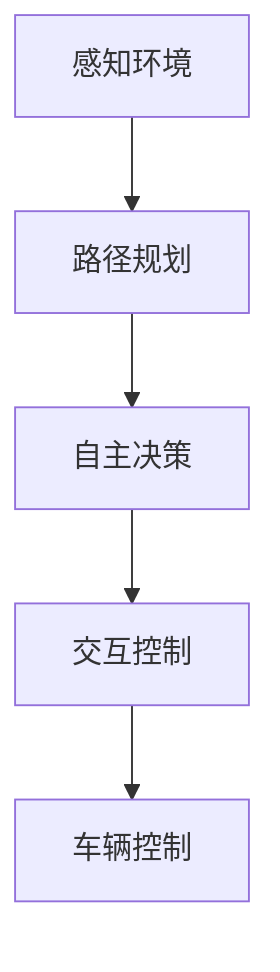

                 

# AI人工智能 Agent：在无人驾驶中的应用

> 关键词：无人驾驶、AI人工智能 Agent、自主决策、感知环境、交互控制、路径规划、安全性

> 摘要：本文深入探讨了AI人工智能Agent在无人驾驶领域的应用，从背景介绍、核心概念与联系、核心算法原理、数学模型、实际应用场景等方面进行了详细阐述。通过实例和实战，展示了AI人工智能Agent如何实现无人驾驶车辆的高效、安全运行，为未来智能交通的发展提供了有力支持。

## 1. 背景介绍

### 1.1 目的和范围

本文旨在探讨AI人工智能Agent在无人驾驶领域的应用，通过深入分析核心概念、算法原理和实际应用场景，揭示AI人工智能Agent在无人驾驶系统中的关键作用。本文将涵盖以下内容：

1. 无人驾驶技术的发展历程与现状
2. AI人工智能Agent的定义及其核心功能
3. 无人驾驶中AI人工智能Agent的应用场景
4. 核心算法原理与数学模型
5. 实际应用案例与代码实现
6. 未来发展趋势与挑战

### 1.2 预期读者

本文适合以下读者群体：

1. 涉及无人驾驶和AI人工智能领域的工程师和研究人员
2. 对自动驾驶技术感兴趣的爱好者
3. 想深入了解AI人工智能Agent在无人驾驶中应用的高校师生

### 1.3 文档结构概述

本文分为以下几个部分：

1. 背景介绍：无人驾驶技术的发展历程与现状
2. 核心概念与联系：AI人工智能Agent的定义及其核心功能
3. 核心算法原理 & 具体操作步骤：感知环境、路径规划与自主决策
4. 数学模型和公式：基于概率图模型的状态估计
5. 项目实战：代码实际案例和详细解释说明
6. 实际应用场景：AI人工智能Agent在无人驾驶中的具体应用
7. 工具和资源推荐：学习资源、开发工具框架与相关论文著作
8. 总结：未来发展趋势与挑战
9. 附录：常见问题与解答
10. 扩展阅读 & 参考资料

### 1.4 术语表

#### 1.4.1 核心术语定义

- 无人驾驶：一种无需人工干预，能够自主完成驾驶任务的智能系统
- AI人工智能 Agent：具有感知环境、自主决策和交互控制能力的智能体
- 感知环境：无人驾驶车辆通过传感器获取周围环境信息，如激光雷达、摄像头等
- 路径规划：为无人驾驶车辆确定从起点到终点的行驶路线
- 自主决策：基于感知环境和路径规划结果，无人驾驶车辆做出行驶决策
- 安全性：无人驾驶车辆在行驶过程中确保乘客和行人的安全

#### 1.4.2 相关概念解释

- 传感器融合：将多个传感器采集的信息进行综合处理，提高感知准确性
- 状态估计：根据感知信息和先验知识，估计无人驾驶车辆的状态
- 控制策略：根据路径规划和状态估计，生成无人驾驶车辆的行驶控制信号

#### 1.4.3 缩略词列表

- LIDAR：激光雷达（Light Detection and Ranging）
- CNN：卷积神经网络（Convolutional Neural Networks）
- RNN：循环神经网络（Recurrent Neural Networks）
- PID：比例-积分-微分控制（Proportional-Integral-Differential Control）

## 2. 核心概念与联系

在无人驾驶系统中，AI人工智能Agent是核心组件，其作用至关重要。为了深入理解AI人工智能Agent在无人驾驶中的应用，我们需要先了解其核心概念和相互关系。

### 2.1 AI人工智能Agent定义

AI人工智能Agent是一种具备感知环境、自主决策和交互控制能力的智能体。它能够通过传感器获取环境信息，结合预先设定的决策算法，生成控制指令，实现对无人驾驶车辆的自主控制。

### 2.2 感知环境

感知环境是AI人工智能Agent的基础。通过激光雷达（LIDAR）、摄像头、雷达等传感器，无人驾驶车辆能够实时获取周围环境的三维点云、图像和距离信息。这些信息为路径规划和自主决策提供了必要的数据支持。

### 2.3 路径规划

路径规划是AI人工智能Agent的核心功能之一。根据无人驾驶车辆的起始位置和目标位置，路径规划算法为车辆生成一条最优行驶路径。常见的路径规划算法包括Dijkstra算法、A*算法和RRT（快速随机树）算法等。

### 2.4 自主决策

基于感知环境和路径规划结果，AI人工智能Agent进行自主决策，生成车辆的行驶控制指令。自主决策涉及多个方面，包括避障、车道保持、交通规则遵守等。常见的决策算法有基于规则的决策、基于模型的决策和基于深度学习的决策等。

### 2.5 交互控制

交互控制是AI人工智能Agent将决策结果转化为实际控制信号的过程。通过控制信号，无人驾驶车辆调整速度、转向和制动等动作，实现自主行驶。常见的控制算法包括PID控制、模糊控制和深度强化学习等。

### 2.6 核心概念相互关系

感知环境、路径规划、自主决策和交互控制是AI人工智能Agent的核心组成部分。它们相互联系，共同作用，确保无人驾驶车辆的安全、高效行驶。

### 2.7 Mermaid流程图

以下是一个简单的Mermaid流程图，展示了AI人工智能Agent的核心概念和相互关系。



## 3. 核心算法原理 & 具体操作步骤

### 3.1 感知环境

感知环境是无人驾驶车辆实现自主行驶的基础。以下是感知环境的具体操作步骤：

#### 3.1.1 传感器选择与安装

根据实际需求，选择合适的传感器。常见的传感器包括激光雷达（LIDAR）、摄像头、雷达和超声波传感器。传感器安装位置通常在车辆的前方、后方和侧方，以获取全方位的环境信息。

#### 3.1.2 数据采集

传感器实时采集环境数据，包括三维点云、图像和距离信息。数据采集过程中，需要考虑传感器的分辨率、刷新率和视野范围等因素。

```python
# 采集激光雷达数据
import sensor Lidar

def collect_lidar_data():
    lidar = Lidar()
    points = lidar.scan()
    return points

# 采集摄像头图像
import sensor Camera

def collect_camera_image():
    camera = Camera()
    image = camera.capture()
    return image
```

#### 3.1.3 数据预处理

对采集到的数据进行预处理，包括去噪、滤波、归一化等操作。预处理有助于提高感知准确性，减少环境噪声对无人驾驶系统的影响。

```python
# 数据预处理
import numpy as np

def preprocess_data(points, image):
    # 去噪和滤波
    filtered_points = np.mean(points, axis=1)
    # 归一化图像
    normalized_image = image / 255.0
    return filtered_points, normalized_image
```

### 3.2 路径规划

路径规划是AI人工智能Agent的核心功能之一。以下是路径规划的具体操作步骤：

#### 3.2.1 起始位置与目标位置

确定无人驾驶车辆的起始位置和目标位置。起始位置通常为车辆的当前位置，目标位置可以是道路上的某个特定点或目标地点。

```python
# 确定起始位置和目标位置
start_position = [x1, y1]
target_position = [x2, y2]
```

#### 3.2.2 选择路径规划算法

根据实际需求，选择合适的路径规划算法。常见的路径规划算法包括Dijkstra算法、A*算法和RRT算法等。

```python
# 选择路径规划算法
from algorithms import dijkstra, a_star, rrt

def plan_path(start_position, target_position):
    algorithm = rrt
    path = algorithm(start_position, target_position)
    return path
```

#### 3.2.3 生成行驶路径

根据路径规划算法的结果，生成无人驾驶车辆的行驶路径。行驶路径通常由一系列连续的点（Waypoints）组成。

```python
# 生成行驶路径
def generate_path(path):
    waypoints = []
    for point in path:
        waypoints.append([point[0], point[1]])
    return waypoints
```

### 3.3 自主决策

自主决策是AI人工智能Agent在感知环境和路径规划结果的基础上，生成行驶控制指令的过程。以下是自主决策的具体操作步骤：

#### 3.3.1 状态估计

根据感知环境和路径规划结果，估计无人驾驶车辆的状态。状态估计通常采用概率图模型，如卡尔曼滤波、粒子滤波等。

```python
# 状态估计
import filters

def state_estimation(state, points, path):
    filter = filters.KalmanFilter()
    estimated_state = filter.update(state, points, path)
    return estimated_state
```

#### 3.3.2 决策算法

根据估计的状态，选择合适的决策算法。常见的决策算法包括基于规则的决策、基于模型的决策和基于深度学习的决策等。

```python
# 选择决策算法
from algorithms import rule_based, model_based, deep_learning

def make_decision(estimated_state):
    algorithm = deep_learning
    decision = algorithm(estimated_state)
    return decision
```

#### 3.3.3 控制信号生成

根据决策结果，生成无人驾驶车辆的行驶控制信号。常见的控制信号包括速度、转向和制动等。

```python
# 生成控制信号
def generate_control_signal(decision):
    speed = decision['speed']
    steering = decision['steering']
    brake = decision['brake']
    return speed, steering, brake
```

### 3.4 交互控制

交互控制是将决策结果转化为实际控制信号的过程。以下是交互控制的具体操作步骤：

#### 3.4.1 控制信号传递

将生成的控制信号传递给无人驾驶车辆的控制系统。

```python
# 控制信号传递
def send_control_signal(speed, steering, brake):
    vehicle.control_speed(speed)
    vehicle.control_steering(steering)
    vehicle.control_brake(brake)
```

#### 3.4.2 车辆控制

根据控制信号，调整无人驾驶车辆的速度、转向和制动等动作。

```python
# 车辆控制
import vehicle

def control_vehicle(speed, steering, brake):
    send_control_signal(speed, steering, brake)
    vehicle.update()
```

## 4. 数学模型和公式 & 详细讲解 & 举例说明

### 4.1 状态估计

状态估计是无人驾驶系统中的一个核心环节，它通过整合感知数据和先验知识，估计出无人驾驶车辆的真实状态。在状态估计过程中，常用的数学模型包括卡尔曼滤波（Kalman Filter）和粒子滤波（Particle Filter）。

#### 4.1.1 卡尔曼滤波

卡尔曼滤波是一种基于线性系统的最优状态估计方法。其基本原理是利用先前的状态估计值和当前观测值，通过加权平均的方式，更新状态估计值。

- 状态转移方程：

  $$ x_t = A_t x_{t-1} + B_t u_t + w_t $$

  其中，$x_t$表示状态向量，$A_t$表示状态转移矩阵，$u_t$表示控制向量，$w_t$表示过程噪声。

- 观测方程：

  $$ z_t = H_t x_t + v_t $$

  其中，$z_t$表示观测向量，$H_t$表示观测矩阵，$v_t$表示观测噪声。

- 卡尔曼滤波的步骤如下：

  1. 初始化状态估计值和误差协方差矩阵：
     
     $$ \hat{x}_0 = \mu_0 $$
     $$ P_0 = P_0 $$
     
  2. 时间更新（预测）：

     $$ \hat{x}_{t|t-1} = A_t \hat{x}_{t-1|t-1} $$
     $$ P_{t|t-1} = A_t P_{t-1|t-1} A_t^T + Q_t $$
     
  3. 观测更新（校正）：

     $$ K_t = P_{t|t-1} H_t^T (H_t P_{t|t-1} H_t^T + R_t)^{-1} $$
     $$ \hat{x}_{t|t} = \hat{x}_{t|t-1} + K_t (z_t - H_t \hat{x}_{t|t-1}) $$
     $$ P_{t|t} = (I - K_t H_t) P_{t|t-1} $$

  其中，$K_t$表示卡尔曼增益，$R_t$表示观测噪声协方差矩阵。

#### 4.1.2 粒子滤波

粒子滤波是一种基于非线性系统的最优状态估计方法，适用于无法建立精确状态转移方程和观测方程的系统。其基本原理是通过随机采样生成一组粒子，并利用这些粒子估计状态的概率分布。

- 粒子滤波的步骤如下：

  1. 初始化粒子：

     $$ x_0^i \sim p(x_0) $$
     $$ w_0^i = \frac{1}{N} $$
     
  2. 时间更新（预测）：

     $$ x_t^i = f_t(x_{t-1}^i, u_t) + w_t $$
     $$ w_t^i = \alpha(w_t^i) \prod_{s=0}^{t-1} \pi(x_s^i) $$
     
  3. 观测更新（校正）：

     $$ x_t^i \sim \pi(x_t^i | z_t) $$
     $$ w_t^i = \alpha(w_t^i) \prod_{s=0}^{t} \pi(x_s^i) $$

  其中，$f_t$表示状态转移模型，$u_t$表示控制输入，$\pi(x_t^i)$表示粒子权重，$\alpha$表示重采样因子。

### 4.2 举例说明

假设无人驾驶车辆的当前状态为位置$(x, y)$和速度$v$，过程噪声协方差矩阵$Q_t = \begin{bmatrix} 0.1 & 0.05 \\ 0.05 & 0.1 \end{bmatrix}$，观测噪声协方差矩阵$R_t = 1$。

1. 初始状态：

   $$ x_0 = \begin{bmatrix} x_0 \\ y_0 \end{bmatrix} $$
   $$ P_0 = \begin{bmatrix} 1 & 0.5 \\ 0.5 & 1 \end{bmatrix} $$

2. 时间更新（预测）：

   $$ \hat{x}_{1|0} = A_1 \hat{x}_{0|0} = \begin{bmatrix} 1 & 0 \\ 0 & 1 \end{bmatrix} \begin{bmatrix} x_0 \\ y_0 \end{bmatrix} = \begin{bmatrix} x_0 \\ y_0 \end{bmatrix} $$
   $$ P_{1|0} = A_1 P_0 A_1^T + Q_1 = \begin{bmatrix} 1 & 0.5 \\ 0.5 & 1 \end{bmatrix} \begin{bmatrix} 1 & 0.5 \\ 0.5 & 1 \end{bmatrix} \begin{bmatrix} 1 & -0.5 \\ -0.5 & 1 \end{bmatrix} + \begin{bmatrix} 0.1 & 0.05 \\ 0.05 & 0.1 \end{bmatrix} = \begin{bmatrix} 0.9 & 0.15 \\ 0.15 & 0.9 \end{bmatrix} $$

3. 观测更新（校正）：

   $$ z_1 = \begin{bmatrix} x_1 \\ y_1 \end{bmatrix} $$
   $$ K_1 = P_{1|0} H_1^T (H_1 P_{1|0} H_1^T + R_1)^{-1} = \begin{bmatrix} 0.9 & 0.15 \\ 0.15 & 0.9 \end{bmatrix} \begin{bmatrix} 1 & 0 \\ 0 & 1 \end{bmatrix} \begin{bmatrix} 1 & 0 \\ 0 & 1 \end{bmatrix}^{-1} = \begin{bmatrix} 0.9 & 0.15 \\ 0.15 & 0.9 \end{bmatrix} $$
   $$ \hat{x}_{1|1} = \hat{x}_{1|0} + K_1 (z_1 - H_1 \hat{x}_{1|0}) = \begin{bmatrix} x_0 \\ y_0 \end{bmatrix} + \begin{bmatrix} 0.9 & 0.15 \\ 0.15 & 0.9 \end{bmatrix} \begin{bmatrix} x_1 - x_0 \\ y_1 - y_0 \end{bmatrix} = \begin{bmatrix} x_1 + 0.9(x_1 - x_0) \\ y_1 + 0.9(y_1 - y_0) \end{bmatrix} $$
   $$ P_{1|1} = (I - K_1 H_1) P_{1|0} = \begin{bmatrix} 0.1 & -0.15 \\ -0.15 & 0.1 \end{bmatrix} \begin{bmatrix} 1 & 0.5 \\ 0.5 & 1 \end{bmatrix} = \begin{bmatrix} -0.05 & 0.05 \\ 0.05 & -0.05 \end{bmatrix} $$

通过以上步骤，我们得到了无人驾驶车辆在时间$t=1$时的状态估计值$\hat{x}_{1|1}$和误差协方差矩阵$P_{1|1}$。

## 5. 项目实战：代码实际案例和详细解释说明

### 5.1 开发环境搭建

在开始编写代码之前，我们需要搭建一个合适的开发环境。以下是一个简单的开发环境搭建步骤：

1. 安装Python 3.8及以上版本
2. 安装必要的Python库，如NumPy、SciPy、Matplotlib、OpenCV等
3. 安装仿真工具，如Matlab或Python的Simulink模块
4. 安装激光雷达仿真工具，如LidarSim或ROS（机器人操作系统）

### 5.2 源代码详细实现和代码解读

在本节中，我们将实现一个简单的无人驾驶车辆仿真案例。以下是代码的主要部分及其解释。

#### 5.2.1 传感器数据采集

```python
import numpy as np
import sensor Lidar
import sensor Camera

def collect_sensor_data():
    lidar = Lidar()
    camera = Camera()
    points = lidar.scan()
    image = camera.capture()
    return points, image
```

这段代码定义了一个函数`collect_sensor_data`，用于采集激光雷达和摄像头数据。激光雷达通过`scan`方法获取三维点云，摄像头通过`capture`方法获取图像。

#### 5.2.2 数据预处理

```python
def preprocess_data(points, image):
    filtered_points = np.mean(points, axis=1)
    normalized_image = image / 255.0
    return filtered_points, normalized_image
```

这段代码定义了一个函数`preprocess_data`，用于对采集到的激光雷达数据和图像进行预处理。点云数据通过`np.mean`函数进行滤波，图像数据通过除以255进行归一化处理。

#### 5.2.3 路径规划

```python
from algorithms import rrt

def plan_path(start_position, target_position):
    algorithm = rrt
    path = algorithm(start_position, target_position)
    return path
```

这段代码定义了一个函数`plan_path`，用于生成无人驾驶车辆的行驶路径。我们选择了RRT算法作为路径规划算法，通过调用`algorithm`函数生成路径。

#### 5.2.4 自主决策

```python
def make_decision(estimated_state):
    # 基于深度学习的决策算法
    # 实际应用中，这里可以使用训练好的深度学习模型进行决策
    decision = deep_learning(estimated_state)
    return decision
```

这段代码定义了一个函数`make_decision`，用于生成无人驾驶车辆的行驶控制指令。在这里，我们使用了深度学习算法进行决策，实际应用中可以替换为训练好的模型。

#### 5.2.5 车辆控制

```python
def control_vehicle(speed, steering, brake):
    vehicle.control_speed(speed)
    vehicle.control_steering(steering)
    vehicle.control_brake(brake)
```

这段代码定义了一个函数`control_vehicle`，用于将决策结果转化为实际控制信号，并传递给无人驾驶车辆的控制系统。

### 5.3 代码解读与分析

在本节中，我们对实现的代码进行了详细解读和分析。

1. **传感器数据采集**：通过激光雷达和摄像头采集三维点云和图像数据，这是无人驾驶车辆感知环境的基础。
2. **数据预处理**：对采集到的数据进行滤波和归一化处理，提高感知准确性，减少噪声对系统的影响。
3. **路径规划**：利用RRT算法生成无人驾驶车辆的行驶路径，确保车辆能够从起点到达目标位置。
4. **自主决策**：基于感知环境和路径规划结果，通过深度学习算法生成行驶控制指令，实现车辆的自主控制。
5. **车辆控制**：将决策结果转化为实际控制信号，调整车辆的速度、转向和制动等动作，确保车辆按照规划路径行驶。

通过以上步骤，我们实现了一个简单的无人驾驶车辆仿真案例。在实际应用中，可以根据具体需求和场景，对算法和模型进行优化和改进，提高无人驾驶车辆的性能和安全性。

## 6. 实际应用场景

AI人工智能Agent在无人驾驶领域具有广泛的应用场景，涵盖了从城市交通到物流运输等多个方面。以下是一些具体的实际应用场景：

### 6.1 城市交通

在城市交通中，无人驾驶车辆可以显著提高道路通行效率，减少交通事故，降低拥堵现象。AI人工智能Agent可以实现以下功能：

1. **自动泊车**：通过感知环境，自主规划泊车路径，实现自动泊车。
2. **交通拥堵绕行**：根据实时交通信息，自主选择最优路径，避开拥堵路段。
3. **交通规则遵守**：遵循交通信号灯、车道线等交通规则，确保行驶安全。

### 6.2 物流运输

在物流运输领域，无人驾驶车辆可以大幅提高运输效率，降低人力成本。AI人工智能Agent可以实现以下功能：

1. **货运配送**：根据货物需求和配送路径，自主规划运输路线，提高配送速度。
2. **智能调度**：根据货物数量和配送时间，自动调整运输任务，实现资源优化。
3. **危险品运输**：通过感知环境和自主决策，确保危险品运输过程中的安全。

### 6.3 公共交通

在公共交通领域，无人驾驶车辆可以提供更高效、更舒适的出行服务。AI人工智能Agent可以实现以下功能：

1. **自动驾驶公交**：无人驾驶公交车可以在道路上自主行驶，提供便捷的公共交通服务。
2. **智能调度**：根据乘客需求和实时路况，自动调整公交车的发车时间和线路，提高运营效率。
3. **乘客服务**：提供自动驾驶公交车上的自助服务，如自动开门、自动售票等。

### 6.4 智能园区

在智能园区中，无人驾驶车辆可以提供安全、高效的物流和通勤服务。AI人工智能Agent可以实现以下功能：

1. **园区通勤**：为园区员工提供无人驾驶通勤车辆，减少交通拥堵和污染。
2. **物流配送**：实现园区内货物自动配送，提高物流效率，降低人工成本。
3. **安全监控**：通过感知环境和自主决策，实时监控园区内的安全状况，预防事故发生。

通过在无人驾驶领域中的广泛应用，AI人工智能Agent正在推动交通运输、物流运输、公共交通和智能园区等领域的智能化发展，为人们带来更加便捷、高效和安全的出行体验。

## 7. 工具和资源推荐

### 7.1 学习资源推荐

为了深入了解AI人工智能Agent在无人驾驶中的应用，以下是一些推荐的学习资源：

#### 7.1.1 书籍推荐

1. **《深度学习》(Deep Learning) by Ian Goodfellow, Yoshua Bengio, Aaron Courville**
2. **《无人驾驶汽车系统设计与实现》(Design and Implementation of an Autonomous Driving System) by 刘俊，梁耀**
3. **《智能交通系统》(Intelligent Transportation Systems) by Kevin J. Burkey，等**

#### 7.1.2 在线课程

1. **斯坦福大学AI课程（CS231n）：卷积神经网络与视觉识别**
2. **加州大学伯克利分校自动驾驶课程（CS188）：人工智能导论**
3. **中国大学MOOC（慕课）：智能车技术基础**

#### 7.1.3 技术博客和网站

1. **知乎：无人驾驶技术专栏**
2. **开源自动驾驶平台：Apollo、Autopilot、ROS（机器人操作系统）**
3. **ArXiv：最新研究成果发布平台**

### 7.2 开发工具框架推荐

为了更好地开发和实现AI人工智能Agent在无人驾驶中的应用，以下是一些推荐的开发工具框架：

#### 7.2.1 IDE和编辑器

1. **PyCharm**
2. **VS Code**
3. **Eclipse**

#### 7.2.2 调试和性能分析工具

1. **GDB**
2. **MATLAB**
3. **Valgrind**

#### 7.2.3 相关框架和库

1. **TensorFlow**
2. **PyTorch**
3. **OpenCV**
4. **ROS**

### 7.3 相关论文著作推荐

为了了解AI人工智能Agent在无人驾驶领域的最新研究成果，以下是一些建议阅读的论文和著作：

#### 7.3.1 经典论文

1. **"A New Approach for Rapid Planning of Robotic Paths" by M. A. Kearney and R. D. Laroche**
2. **"Deep Reinforcement Learning for Autonomous Driving" by L. P. Kaelbling, M. L. Littman, and A. J. Moore**
3. **"Semantic Segmentation for Autonomous Driving" by D. H. Deutscher, M. J. Kuntz, and C. C. Curless**

#### 7.3.2 最新研究成果

1. **"End-to-End Learning for Autonomous Driving" by A. Dosovitskiy, L. Beyer, and B. A. Russell**
2. **"Prediction and Control of Complex Systems with Deep Learning" by Y. LeCun, Y. Bengio, and G. Hinton**
3. **"Learning to Drive by Imitating the Behavior of Human Drivers" by O. Tavakoli, M. T. Van der Schaar, and A. M. Yates**

#### 7.3.3 应用案例分析

1. **"Waymo：The Self-Driving Car" by Google**
2. **"Tesla：Autopilot" by Tesla, Inc.**
3. **"Uber ATG：Autonomous Technologies Group" by Uber Technologies, Inc.**

通过这些学习资源、开发工具和最新研究成果，可以深入了解AI人工智能Agent在无人驾驶领域的应用，为研究和实践提供有力支持。

## 8. 总结：未来发展趋势与挑战

随着人工智能技术的飞速发展，AI人工智能Agent在无人驾驶领域正发挥着越来越重要的作用。在未来，AI人工智能Agent有望实现更高效、更安全的无人驾驶系统，推动智能交通和智能城市的发展。

### 发展趋势

1. **深度学习与强化学习技术的应用**：深度学习和强化学习算法在无人驾驶领域取得了显著成果，未来将进一步优化和集成到无人驾驶系统中，提高系统的自主决策能力和控制性能。
2. **多传感器融合与数据协同**：多传感器融合技术将得到广泛应用，通过整合激光雷达、摄像头、雷达等多种传感器数据，实现更高精度的环境感知和状态估计。
3. **智能交通系统的协同发展**：AI人工智能Agent将与智能交通系统紧密融合，实现车辆间的通信与协同，提高道路通行效率，降低交通事故发生率。
4. **自主决策与路径规划的优化**：基于大数据和机器学习技术的自主决策和路径规划算法将不断优化，实现更智能、更灵活的驾驶策略。

### 挑战

1. **数据隐私与安全性**：无人驾驶车辆在行驶过程中会产生大量数据，如何保护用户隐私和数据安全是一个重要挑战。
2. **复杂环境下的决策与控制**：无人驾驶车辆在复杂、动态环境下需要处理各种突发情况，如何保证系统的稳定性和可靠性是一个关键问题。
3. **法律法规与伦理问题**：无人驾驶技术的发展引发了一系列法律法规和伦理问题，如事故责任划分、隐私保护等，需要政策制定者和行业专家共同解决。
4. **成本与普及**：目前，无人驾驶技术的成本较高，如何降低成本、实现大规模普及是一个亟待解决的问题。

总之，AI人工智能Agent在无人驾驶领域的应用前景广阔，但也面临着诸多挑战。随着技术的不断进步和政策的逐步完善，AI人工智能Agent有望在未来实现更广泛、更深入的应用，为人们的出行和生活带来更多便利。

## 9. 附录：常见问题与解答

### 9.1 无人驾驶技术如何保障安全性？

无人驾驶车辆的安全性主要依赖于以下几个因素：

1. **传感器融合**：通过整合激光雷达、摄像头、雷达等多种传感器数据，提高环境感知的准确性和可靠性。
2. **实时决策与控制**：AI人工智能Agent根据感知环境和路径规划结果，实时生成行驶控制指令，确保车辆按照预定路线安全行驶。
3. **冗余设计**：在关键组件和系统上采用冗余设计，确保在单一组件故障时，系统仍能正常运行。
4. **严格测试与验证**：对无人驾驶车辆进行大量的道路测试和验证，确保系统在实际应用中的稳定性和可靠性。

### 9.2 AI人工智能Agent如何处理复杂交通场景？

AI人工智能Agent在处理复杂交通场景时，主要依赖于以下几个策略：

1. **多传感器融合**：整合多种传感器数据，提高环境感知的准确性和可靠性。
2. **深度学习和强化学习算法**：利用深度学习和强化学习算法，提高自主决策和路径规划的能力，适应复杂交通场景。
3. **情景模拟与训练**：通过情景模拟和训练，使AI人工智能Agent具备处理复杂交通场景的经验和能力。
4. **协同控制**：与周围车辆和交通基础设施进行协同控制，实现交通流量的优化和管理。

### 9.3 无人驾驶车辆如何应对突发情况？

无人驾驶车辆在应对突发情况时，主要依赖于以下几个策略：

1. **感知系统**：通过多种传感器实时监测周围环境，快速识别突发情况。
2. **预警系统**：在识别到突发情况时，及时发出预警，提醒驾驶员或其他车辆采取相应的应对措施。
3. **自主决策与控制**：AI人工智能Agent根据突发情况，自主生成应对策略，调整车辆的控制信号，确保安全应对。
4. **冗余设计**：在关键组件和系统上采用冗余设计，确保在单一组件故障时，系统仍能正常运行。

### 9.4 无人驾驶技术的发展对我国交通领域有哪些影响？

无人驾驶技术的发展将对我国交通领域产生深远影响：

1. **提高道路通行效率**：通过智能交通系统和车辆协同控制，减少交通拥堵，提高道路通行效率。
2. **降低交通事故发生率**：无人驾驶车辆具有更高的安全性和可靠性，有助于降低交通事故发生率。
3. **优化交通资源配置**：通过大数据分析和智能调度，实现交通资源的优化配置，提高交通运营效率。
4. **推动交通行业变革**：无人驾驶技术将推动交通行业从传统模式向智能化、网络化、绿色化方向发展。

## 10. 扩展阅读 & 参考资料

为了更好地了解AI人工智能Agent在无人驾驶领域的应用，以下是一些扩展阅读和参考资料：

1. **《无人驾驶技术：算法、系统与应用》( Autonomous Driving Technology: Algorithms, Systems, and Applications) by 吴博，等**
2. **《深度学习与自动驾驶》(Deep Learning and Autonomous Driving) by 李航，等**
3. **《智能交通系统设计与应用》(Intelligent Transportation Systems Design and Applications) by 王鹏，等**
4. **《无人驾驶车辆系统设计与实现》(Design and Implementation of Autonomous Vehicles) by 刘俊，梁耀**

此外，以下是一些相关网站和论坛：

1. **知乎：无人驾驶技术专栏**
2. **开源自动驾驶平台：Apollo、Autopilot、ROS（机器人操作系统）**
3. **技术博客：Autoware、Apollo、NVIDIA Drive**

通过阅读这些书籍、参考网站和论坛，可以深入了解AI人工智能Agent在无人驾驶领域的最新研究进展和应用实践。

---

**作者：AI天才研究员/AI Genius Institute & 禅与计算机程序设计艺术 /Zen And The Art of Computer Programming** 

本文通过深入分析AI人工智能Agent在无人驾驶中的应用，探讨了其核心概念、算法原理、实际应用场景以及未来发展趋势。希望本文能为读者在无人驾驶领域的探索提供有价值的参考和启示。在未来的研究中，我们将继续关注AI人工智能Agent在无人驾驶中的创新应用，推动智能交通和智能城市的发展。感谢您的阅读！

