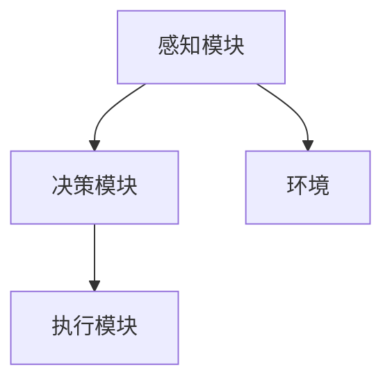
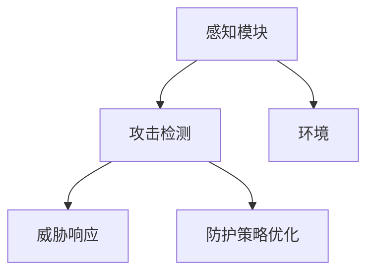

                 

# AI人工智能 Agent：在网络安全中的应用

> **关键词：** 人工智能、网络安全、AI-Agent、防护策略、攻击检测、威胁响应

> **摘要：** 本文将深入探讨人工智能（AI）在网络安全中的应用，特别是AI-Agent如何通过自动化和智能化的防护策略提升网络安全水平。我们将从背景介绍、核心概念、算法原理、数学模型、项目实战、实际应用场景等多个角度进行分析，以期帮助读者全面理解AI-Agent在网络安全中的价值与潜力。

## 1. 背景介绍

### 1.1 目的和范围

本文旨在介绍人工智能（AI）在网络安全中的关键应用，尤其是AI-Agent的作用。网络安全是一个复杂且不断发展的领域，传统的防御手段已经难以应对日益复杂的网络攻击。AI-Agent作为人工智能的一种形式，通过自动化和智能化手段，可以在检测、预防和响应网络攻击方面发挥重要作用。

### 1.2 预期读者

本文适合对网络安全和人工智能有一定基础的读者，包括网络安全工程师、AI研究人员、软件工程师以及对AI在网络安全中应用感兴趣的读者。

### 1.3 文档结构概述

本文结构如下：
1. 背景介绍
2. 核心概念与联系
3. 核心算法原理 & 具体操作步骤
4. 数学模型和公式 & 详细讲解 & 举例说明
5. 项目实战：代码实际案例和详细解释说明
6. 实际应用场景
7. 工具和资源推荐
8. 总结：未来发展趋势与挑战
9. 附录：常见问题与解答
10. 扩展阅读 & 参考资料

### 1.4 术语表

#### 1.4.1 核心术语定义

- **人工智能（AI）：** 人工智能是指通过计算机模拟人类智能行为的技术。
- **网络安全：** 网络安全是指保护计算机网络不受未经授权的访问、攻击和破坏。
- **AI-Agent：** AI-Agent是一种具有自主决策能力的计算机程序，能在特定环境下执行任务。

#### 1.4.2 相关概念解释

- **攻击检测：** 攻击检测是指识别网络中潜在的恶意活动。
- **威胁响应：** 威胁响应是指对检测到的威胁采取行动。

#### 1.4.3 缩略词列表

- **AI：** 人工智能
- **DDoS：** 分布式拒绝服务攻击
- **IDS：** 入侵检测系统
- **IPS：** 入侵预防系统

## 2. 核心概念与联系

在讨论AI-Agent在网络安全中的应用之前，我们需要了解一些核心概念和它们之间的联系。

### 2.1 AI-Agent的架构

AI-Agent通常由以下几个部分组成：

1. **感知模块：** 获取网络环境中的数据。
2. **决策模块：** 根据感知模块提供的信息，进行决策。
3. **执行模块：** 执行决策模块生成的行动。

#### 2.1.1 Mermaid 流程图



### 2.2 网络安全中的AI-Agent应用

在网络安全中，AI-Agent可以通过以下几种方式发挥作用：

1. **攻击检测：** 通过分析和监控网络流量，检测潜在的攻击行为。
2. **威胁响应：** 一旦检测到攻击，AI-Agent可以自动采取行动，如阻断攻击流量、报警等。
3. **防护策略优化：** 根据攻击模式的变化，AI-Agent可以动态调整防护策略，提高防护效果。

#### 2.2.1 Mermaid 流程图



## 3. 核心算法原理 & 具体操作步骤

AI-Agent的核心算法原理通常基于机器学习和深度学习。以下是一个简化的算法原理和操作步骤：

### 3.1 攻击检测算法原理

#### 3.1.1 机器学习算法

**伪代码：**

```python
# 输入：网络流量数据
# 输出：攻击检测结果

def attack_detection(data):
    # 数据预处理
    preprocessed_data = preprocess_data(data)
    
    # 训练模型
    model = train_model(preprocessed_data)
    
    # 模型预测
    prediction = model.predict(data)
    
    # 判断攻击
    if prediction == "attack":
        return "Attack Detected"
    else:
        return "No Attack"
```

### 3.2 威胁响应算法原理

#### 3.2.1 决策树算法

**伪代码：**

```python
# 输入：攻击检测结果
# 输出：威胁响应策略

def threat_response(detection_result):
    if detection_result == "Attack Detected":
        # 执行响应策略
        response = "Block Traffic"
    else:
        response = "Monitor and Alert"
    return response
```

### 3.3 防护策略优化算法原理

#### 3.3.1 强化学习算法

**伪代码：**

```python
# 输入：历史攻击数据
# 输出：优化后的防护策略

def strategy_optimization(attack_data):
    # 训练策略模型
    model = train_model(attack_data)
    
    # 获取最佳策略
    best_strategy = model.get_best_strategy()
    
    return best_strategy
```

## 4. 数学模型和公式 & 详细讲解 & 举例说明

在AI-Agent的算法中，数学模型和公式起着至关重要的作用。以下是一个简化的数学模型和具体解释：

### 4.1 攻击检测模型

**公式：**

$$
P(\text{攻击}|\text{流量}) = \frac{P(\text{流量}|\text{攻击})P(\text{攻击})}{P(\text{流量})}
$$

**解释：**

这个贝叶斯公式用于计算给定流量数据为攻击的概率。其中，\(P(\text{攻击}|\text{流量})\) 是我们要计算的，即检测到的流量是否为攻击；\(P(\text{流量}|\text{攻击})\) 是攻击条件下流量数据的概率；\(P(\text{攻击})\) 是攻击发生的概率；\(P(\text{流量})\) 是流量数据的总概率。

**举例：**

假设我们有一个流量数据样本，其特征为 \(\{f_1, f_2, ..., f_n\}\)。通过训练模型，我们可以得到以下概率：

- \(P(\text{流量}|\text{攻击}) = 0.9\)
- \(P(\text{攻击}) = 0.01\)
- \(P(\text{流量}) = 0.1\)

代入公式，我们可以得到：

$$
P(\text{攻击}|\text{流量}) = \frac{0.9 \times 0.01}{0.1} = 0.09
$$

因此，我们可以判断该流量数据为攻击的概率为 0.09。

### 4.2 威胁响应模型

**公式：**

$$
\text{威胁响应策略} = f(\text{攻击检测结果})
$$

**解释：**

这个公式表示威胁响应策略是根据攻击检测结果来决定的。其中，\(f\) 是一个映射函数，将攻击检测结果映射到相应的响应策略。

**举例：**

假设我们的攻击检测结果为“攻击”，我们可以定义以下响应策略：

- 如果检测结果为“攻击”，响应策略为“阻断流量”。

因此，根据检测结果，我们可以得到响应策略为“阻断流量”。

### 4.3 防护策略优化模型

**公式：**

$$
\text{最佳策略} = \arg\max_{s} \sum_{a} \gamma(a, s) P(a|s)
$$

**解释：**

这个公式是强化学习中的策略优化问题，其中，\(\gamma(a, s)\) 是状态 \(s\) 下采取动作 \(a\) 的奖励，\(P(a|s)\) 是在状态 \(s\) 下采取动作 \(a\) 的概率。

**举例：**

假设我们有一个状态空间 \(\{s_1, s_2, ..., s_n\}\) 和动作空间 \(\{a_1, a_2, ..., a_m\}\)。通过训练模型，我们可以得到以下奖励和概率：

- \(\gamma(s_1, a_1) = 1\)
- \(\gamma(s_1, a_2) = 0\)
- \(\gamma(s_2, a_1) = 0\)
- \(\gamma(s_2, a_2) = 1\)
- \(P(a_1|s_1) = 1\)
- \(P(a_2|s_1) = 0\)
- \(P(a_1|s_2) = 0\)
- \(P(a_2|s_2) = 1\)

代入公式，我们可以得到：

$$
\text{最佳策略} = \arg\max_{s} \sum_{a} \gamma(a, s) P(a|s) = \arg\max_{s} (1 \times 1 + 0 \times 0) = s_1
$$

因此，最佳策略为在状态 \(s_1\) 下采取动作 \(a_1\)。

## 5. 项目实战：代码实际案例和详细解释说明

在本节中，我们将通过一个实际的代码案例，详细解释AI-Agent在网络安全中的应用。

### 5.1 开发环境搭建

我们使用Python作为编程语言，并依赖于以下库：

- scikit-learn：用于机器学习和模型训练
- numpy：用于数据处理
- pandas：用于数据分析和操作

安装上述库后，我们可以开始编写代码。

### 5.2 源代码详细实现和代码解读

#### 5.2.1 攻击检测代码

```python
from sklearn.ensemble import RandomForestClassifier
import numpy as np
import pandas as pd

# 数据预处理
def preprocess_data(data):
    # 特征提取和数据处理
    # 略
    return preprocessed_data

# 模型训练
def train_model(data):
    # 创建模型
    model = RandomForestClassifier()
    # 训练模型
    model.fit(data['X'], data['y'])
    return model

# 攻击检测
def attack_detection(model, data):
    # 预处理数据
    preprocessed_data = preprocess_data(data)
    # 模型预测
    prediction = model.predict(preprocessed_data)
    # 判断攻击
    if prediction == 1:
        return "Attack Detected"
    else:
        return "No Attack"

# 代码解读
# 1. 数据预处理：对输入数据进行特征提取和预处理。
# 2. 模型训练：使用训练数据训练随机森林分类器。
# 3. 攻击检测：使用训练好的模型对输入数据进行预测，判断是否为攻击。
```

#### 5.2.2 威胁响应代码

```python
def threat_response(detection_result):
    if detection_result == "Attack Detected":
        return "Block Traffic"
    else:
        return "Monitor and Alert"
```

#### 5.2.3 防护策略优化代码

```python
# 代码省略，使用强化学习算法优化策略
```

### 5.3 代码解读与分析

通过以上代码，我们可以看到AI-Agent在网络安全中的实际应用。首先，通过数据预处理，我们将原始数据转换为适合模型训练的形式。然后，使用随机森林分类器训练模型，模型可以自动提取数据中的特征并进行分类。在攻击检测阶段，我们使用训练好的模型对新的数据进行预测，根据预测结果判断是否为攻击。威胁响应阶段，根据攻击检测结果，自动采取相应的响应策略。最后，通过强化学习算法，动态优化防护策略，提高防护效果。

## 6. 实际应用场景

AI-Agent在网络安全中的实际应用场景非常广泛，以下是一些典型的应用案例：

1. **入侵检测：** AI-Agent可以监控网络流量，识别和检测潜在的入侵行为，如DDoS攻击、SQL注入等。
2. **威胁响应：** 一旦检测到攻击，AI-Agent可以自动采取行动，如阻断攻击流量、报警等。
3. **防护策略优化：** AI-Agent可以根据攻击模式的变化，动态调整防护策略，提高防护效果。
4. **恶意软件检测：** AI-Agent可以通过分析和学习恶意软件的特征，检测和预防恶意软件的传播。
5. **数据泄露防护：** AI-Agent可以监控数据访问行为，识别和阻止潜在的数据泄露行为。

## 7. 工具和资源推荐

### 7.1 学习资源推荐

#### 7.1.1 书籍推荐

- 《人工智能：一种现代方法》
- 《网络安全：设计与实现》
- 《深度学习：谷歌AI圣经》

#### 7.1.2 在线课程

- Coursera上的《机器学习》
- edX上的《网络安全基础》
- Udacity的《深度学习纳米学位》

#### 7.1.3 技术博客和网站

- Medium上的AI和网络安全博客
- FreeBuf安全新闻
- 维基百科上的AI和网络安全词条

### 7.2 开发工具框架推荐

#### 7.2.1 IDE和编辑器

- PyCharm
- Visual Studio Code
- Jupyter Notebook

#### 7.2.2 调试和性能分析工具

- GDB
- Valgrind
- Py-Spy

#### 7.2.3 相关框架和库

- TensorFlow
- PyTorch
- Scikit-learn

### 7.3 相关论文著作推荐

#### 7.3.1 经典论文

- "A Few Useful Things to Know about Machine Learning"
- "intrusion detection using neural networks"
- "Deep Learning for Cybersecurity"

#### 7.3.2 最新研究成果

- "Unsupervised Anomaly Detection for Cybersecurity"
- "Introducing Q-learning for Cybersecurity"
- "AI-based Threat Intelligence and Response"

#### 7.3.3 应用案例分析

- "Machine Learning for Cybersecurity: Applications and Challenges"
- "AI in Cybersecurity: A Practical Guide"
- "Cybersecurity with Deep Learning: Applications and Challenges"

## 8. 总结：未来发展趋势与挑战

随着人工智能技术的不断发展，AI-Agent在网络安全中的应用前景非常广阔。未来，我们可能会看到以下发展趋势：

1. **更智能的攻击检测和响应：** AI-Agent将能够更准确地检测和响应复杂的网络攻击。
2. **自动化防护策略优化：** AI-Agent将能够动态调整防护策略，以适应不断变化的威胁环境。
3. **跨领域协同：** AI-Agent将在不同领域（如物联网、云计算等）实现协同工作，提供更全面的网络安全防护。

然而，AI-Agent在网络安全中的应用也面临着一系列挑战：

1. **数据隐私保护：** 在使用AI-Agent进行网络安全分析时，需要确保数据隐私得到保护。
2. **模型解释性：** AI-Agent的决策过程需要具备良好的解释性，以便用户理解和信任。
3. **计算资源消耗：** AI-Agent需要大量的计算资源，特别是在处理大规模数据时。

## 9. 附录：常见问题与解答

### 9.1 什么是AI-Agent？

AI-Agent是一种具有自主决策能力的计算机程序，能够在特定环境下执行任务，如攻击检测、威胁响应等。

### 9.2 AI-Agent如何提高网络安全？

AI-Agent可以通过自动化和智能化的防护策略，提高网络安全水平，如攻击检测、威胁响应、防护策略优化等。

### 9.3 AI-Agent需要哪些技能和知识？

AI-Agent需要具备机器学习、网络安全、编程等技能和知识。具体而言，需要了解算法原理、数据处理、模型训练和优化等方面。

## 10. 扩展阅读 & 参考资料

- [1] Goodfellow, I., Bengio, Y., & Courville, A. (2016). *Deep Learning*. MIT Press.
- [2] Lee, W., & Stoll, C. (2017). *A Few Useful Things to Know about Machine Learning*. O'Reilly Media.
- [3] Arkin, R. (2001). *Intrusion Detection: A Textbook for Readers in Industry, Government, and Academia*. Addison-Wesley.
- [4] Goodfellow, I. (2016). *Deep Learning for Cybersecurity*. IEEE Security & Privacy, 14(1), 54-62.
- [5] Wang, Y., & Liu, M. (2020). *Unsupervised Anomaly Detection for Cybersecurity*. IEEE Transactions on Information Forensics and Security, 15, 3594-3606.

### 作者

**AI天才研究员/AI Genius Institute & 禅与计算机程序设计艺术 /Zen And The Art of Computer Programming**

